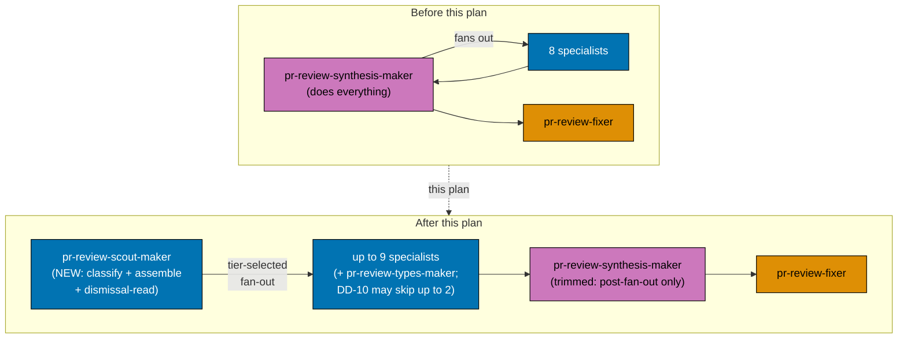
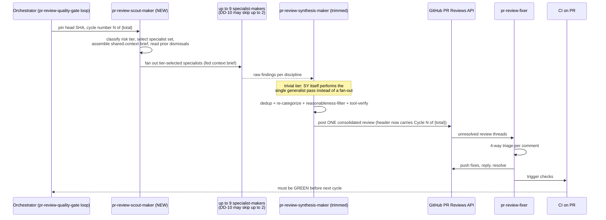
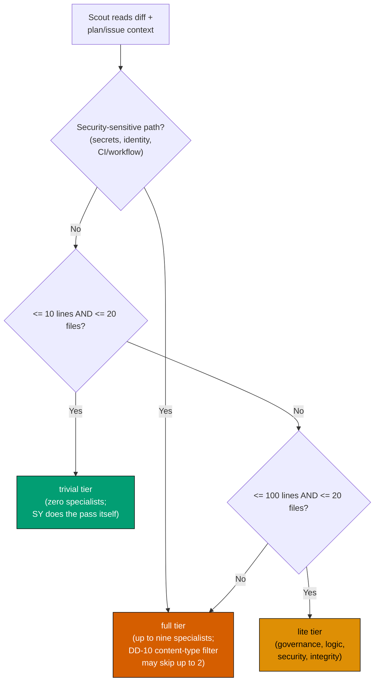

# Technical Documentation: PR Review Cycle Scout + Cycle-Number + Type-Soundness

## Architecture Overview

The PR Review Quality Gate pipeline moves from a 10-agent shape (8 discipline specialists +
`pr-review-synthesis-maker` + `pr-review-fixer`) to a 12-agent shape (9 discipline specialists +
`pr-review-scout-maker` + `pr-review-synthesis-maker` + `pr-review-fixer`). The orchestrator (the
workflow's own Step 1/2/3 loop, called from `plan-execution.md` Step 8 or invoked directly against a
PR) gains one call per cycle — to scout — inserted before the specialist fan-out; every other
orchestration boundary (fan-out is concurrent, cross-cycle is sequential, CI-green is a hard gate)
stays exactly as documented today.

**This architecture is applied identically in all four repos** (`ose-public`, `ose-primer`,
the private sibling, `beaver-nest`) — each repo runs its own independent instance of the 10-agent-to-
12-agent transition described below. Nothing in this section's diagrams or design decisions differs
by repo; the per-repo divergence is confined to the mechanical edit shape of two specific files
(`AGENTS.md`'s wording, per repo, and `pr-review-quality-gate.md`'s "eight" occurrence count in
the private sibling), documented in [File-Impact Analysis](#file-impact-analysis) below, not to the
architecture itself.

### Diagram 1 — Component Interactions (Before → After)



### Diagram 2 — Updated Per-Cycle Sequence



### Diagram 3 — Scout's Tier-Classification Decision (unchanged thresholds, new owner)



Thresholds and tier semantics are **unchanged** from the pre-plan D12 — only the owning agent moves.
`pr-review-types-maker` is **not** added to the `lite` set (see [DD-3](#design-decisions)).

## Design Decisions

- **DD-1: `pr-review-scout-maker` runs at `model: opus`, not `sonnet`.**
  `pr-review-synthesis-maker.md`'s pre-existing Model Selection Justification names "owning
  pre-fan-out judgment calls no specialist makes" as one of its explicit reasons for its own opus
  tier: _"errors here are not correctable downstream the way a single specialist's miss is... nobody
  catches a bad risk-tier or context-assembly call except this agent."_ Relocating those exact
  duties to a new agent does not shrink their blast radius — a scout misclassification (e.g. calling
  a security-sensitive PR `lite` and never fanning out `pr-review-security-maker` at all) is just as
  uncorrectable downstream as it was when synthesis-maker made the same call. Tradeoff accepted
  explicitly: **this doubles the opus-tier call count per cycle** (scout + synthesis-maker, both
  opus, versus one opus call before). The nine sonnet-tier specialists are unaffected. This is
  recorded here, not silently absorbed, so the
  [Cost and Latency Budgeting](../../../repo-governance/development/quality/pr-review-disciplines.md#cost-and-latency-budgeting)
  future-work section has the real shape to react to next time it is revisited.
- **DD-2: New grey-zone ruling (g) — "Compiles vs. is sound."** Added to
  `pr-review-disciplines.md`'s Six Grey-Zone Rulings (becoming seven), it reads: a change that fails
  to build/type-check is not any specialist's finding at all — CI's build step already gates it red,
  and reporting a compile failure as a PR-review finding would be redundant with a signal the
  reviewer already has independently. A change that **compiles but is unsoundly typed** (a broad
  `any`, a non-exhaustive match defaulting silently, an unjustified `unsafe` block, a
  null-forgiving-operator override on a path that can actually be null) is `pr-review-types-maker`'s
  finding. This is a three-way split (not-a-finding vs. types vs. architecture-for-new-boundaries),
  distinguishing it from the other six rulings, which all route between exactly two disciplines.
- **DD-3: Type-soundness launches `full`-tier-only, not in the `lite` four-set.** The `lite` set
  (governance, logic, security, integrity) was chosen at the original eight-discipline cutover as
  "the four highest-yield lenses for this repo" — a judgment call made without live data for a
  discipline that did not yet exist. Following the same posture the convention already applies to
  its two most-recently-added disciplines (performance, docs — both `full`-tier-only, watched via
  per-discipline acceptance-rate monitoring before any tier promotion is considered), type-soundness
  starts `full`-tier-only. Promotion to `lite` is a future decision gated on real acceptance-rate
  data, not this plan's call to make.
- **DD-4: Header field format is `**Cycle**: N of {total}`**, inserted as the first line of the
  Consolidated Review Header (before `**Risk tier**`), because cycle number is the coarsest-grained,
  most-orienting fact a reader needs before the tier/specialist/coverage detail underneath it.
- **DD-5: Scout's tool list is `Read, Bash, Grep, Glob`** — no `Write`/`Edit` (scout never modifies
  files, mirroring synthesis-maker's own no-Write/Edit posture), and no `WebFetch`/`WebSearch` (D12
  classification and D13 context assembly are purely internal to the PR's own diff/metadata/plan
  files; external fact-verification is synthesis-maker's tool-verify job, not scout's).
- **DD-6: The `AGENTS.md` edit is per-repo, not a single verbatim diff broadcast to all four —
  `pr-review-scout-maker` and `pr-review-types-maker` are deliberately NOT named in any repo's
  `AGENTS.md`.** Per [brd.md's baseline](./brd.md#current-state-baseline-mechanically-verified-2026-08-05),
  three repos (`ose-public`, `ose-primer`, `beaver-nest`) share the pattern "eight discipline
  `pr-review-*-maker` specialists fan out to..." — a single-word `eight` → `nine` swap, net `-1`
  byte. The private sibling has no literal "eight" in its bullet at all; it names the eight disciplines
  explicitly by list with no scout mention, so its edit is a multi-word insertion (add
  `pr-review-types-maker` to the list, add a scout clause ahead of the fan-out) — net **byte-positive**,
  the opposite direction of the other three. Each repo sits at a different point against its own
  27,000 B warn / 30,000 B hard-fail budget (`ose-public` 28,944 B, `ose-primer` **29,852 B** — only
  148 B of headroom, the tightest by far — private sibling 26,754 B, `beaver-nest` 29,547 B); any
  net-positive edit in the three tight repos risks tripping the warn threshold further, while
  the private sibling's comparatively large headroom is exactly why its edit is safe to be net-positive
  there and nowhere else. The catalog (`.claude/agents/README.md`) and the convention
  (`pr-review-disciplines.md`) remain the authoritative, budget-unconstrained sources for the two new
  agents' names and charters, in every repo.
- **DD-7: Trivial-tier handoff — scout classifies and assembles context; `pr-review-synthesis-maker`
  still performs the actual single generalist review pass itself when the tier is `trivial`.** Scout
  never reviews code — its charter is purely classification, selection, and context assembly.
  Keeping the "who actually looks at trivial-tier diffs" duty with synthesis-maker (which already had
  it pre-plan) avoids handing scout a second, unrelated responsibility (reviewing) on top of its
  first (classifying), which would blur exactly the separation this plan exists to introduce.
- **DD-8: `pr-review-types-maker`'s `SUPPRESS` block** explicitly excludes: (1) any compile/build
  failure (per DD-2, not a finding at all — CI already reds it); (2) a style nit a project's own
  linter already enforces (e.g. a configured `no-explicit-any` ESLint rule already catching the same
  case mechanically); (3) speculative "consider a stricter type here" when the specialist has not
  fully traced the control-flow narrowing that already makes the looser type sound at that point;
  (4) type laxity inside test-only fixture/mock files where the project's own testing convention
  already accepts it. This mirrors the SUPPRESS-block shape every other specialist already carries.
- **DD-9: Naming.** `pr-review-scout-maker` (scope `pr`, qualifier `review-scout`, role `maker`) and
  `pr-review-types-maker` (scope `pr`, qualifier `review-types`, role `maker`) both conform to the
  [Agent Naming Convention](../../../repo-governance/conventions/structure/agent-naming.md)'s
  `<scope>(-<qualifier>)*-<role>` structure, matching the existing `pr-review-<discipline>-maker`
  family shape exactly. "Scout" is chosen over "triage" because it is the maintainer's own word for
  the role (see the original request) and reads unambiguously as "goes first, reports back" rather
  than "triage" (which could be misread as bug-severity triage, a different concept already covered
  by the Criticality Levels Convention).
- **DD-10: Content-Type Applicability Filter, discovered during this PR's own Phase 5 cycle-1
  dogfood, not pre-planned.** Cycle 1's fan-out against this plan's own delivering PR (a 38-file,
  Markdown-only diff) surfaced that 7 of 9 specialists found real, high-confidence findings — including
  a CRITICAL from `pr-review-security-maker` — while exactly 2 (`pr-review-types-maker`,
  `pr-review-integrity-maker`) found nothing, both for a structural reason: their own charters are
  gated on an artifact class (typed source; test/CI files) absent from this diff. The maintainer,
  grilled on whether to react to this mid-dogfood, explicitly chose the broader of three offered
  options — generalize `full`-tier fan-out to skip a specialist when its own charter's artifact-class
  gate is unmet — over the narrower two-specialist-only option and over parking it for later
  monitoring data, with one hard condition: the filter **must be re-derived fresh every cycle** from
  that cycle's own current diff, never cached from a prior cycle, since the fixer's own pushed commits
  between cycles can change the diff's file-type composition. Implemented as a `full`-tier-only
  addendum to D12 (see [`pr-review-scout-maker.md`](../../../.claude/agents/pr-review/pr-review-scout-maker.md#risk-tier-classification--specialist-set-selection-d12)):
  only `pr-review-types-maker` and `pr-review-integrity-maker` are ever skipped, and only when their
  own declared artifact class is verifiably absent from the current cycle's diff; the other seven
  specialists are never skipped by file type, since their charters — as this very cycle proved — reason
  about intent, tradeoffs, and conventions in prose and prompts exactly as readily as in code. This
  decision is intentionally conservative (2 of 9 candidates, default-to-include on any ambiguity) to
  avoid the exact risk the maintainer flagged when choosing the broader option: an incorrectly
  aggressive content-type skip could have suppressed `pr-review-security-maker` on this same diff and
  never surfaced the CRITICAL untrusted-input-handling finding it actually caught.
- **DD-11: Per-specialist attribution in the posted review, discovered in the same cycle-1 dogfood
  turn as DD-10.** After seeing DD-10's own analysis (which specialists found what), the maintainer
  asked that this data not stay a one-off manual read of agent transcripts — it should be durably
  captured in every posted review, since it is exactly the raw material the
  [Post-Cutover Monitoring Plan](../../../repo-governance/development/quality/pr-review-disciplines.md#post-cutover-monitoring-plan)
  already names as a goal ("per-discipline acceptance rate") but had no mechanism to actually record.
  `pr-review-synthesis-maker.md`'s Consolidated Review Header gains a `**Per-specialist raw
findings**` field (raw count per fanned-out specialist, including zero-finding specialists and
  DD-10 skips with their reason), and every posted finding gains a `**Raised by**:` byline naming its
  originating specialist(s) — a Deduplicate-function merge keeps every contributing name, so a
  multiply-corroborated finding (this cycle's scout→synthesis wiring bug, independently caught by
  four specialists) visibly shows its corroboration count rather than reading as one specialist's
  opinion. This makes every posted review, on its own, sufficient raw data for a future acceptance-
  rate read — no side log, no re-deriving from agent transcripts. The maintainer explicitly asked for
  cycle 1 to be **restarted from a fresh scout pass** rather than patched mid-flight, so that cycle 1's
  own posted review reflects DD-10 and DD-11 consistently together, instead of a hybrid where scout
  ran under pre-DD-10 logic while synthesis posted under post-DD-11 formatting.

## File-Impact Analysis

The tree below is the pattern applied **once per repo**, root-relative inside each of
`ose-public/`, `ose-primer/`, `private-sibling/`, and `beaver-nest/` independently — it is not a single
shared tree, since each repo has its own copy of every file listed:

```text
.
├── AGENTS.md [E] — PR Review Cycle bullet edit; shape is per-repo, see DD-6 (three repos: single-word
│   eight → nine; <private-sibling>: multi-word list insertion, net byte-positive)
├── .claude/
│   └── agents/
│       ├── README.md [E] — catalog entries for both new agents
│       ├── pr-review-synthesis-maker.md [E] — remove Pre-Fan-Out Duties section (moved to scout),
│       │   add Cycle field to Consolidated Review Header, update "ninth"→"eleventh" self-description
│       ├── pr-review-scout-maker.md [N] — new pipeline stage-0 agent, full charter below
│       └── pr-review-types-maker.md [N] — new type-soundness discipline specialist, full charter below
├── .opencode/agents/ [G] — pr-review-scout-maker.md, pr-review-types-maker.md (new),
│   pr-review-synthesis-maker.md (regenerated) — via `npm run generate:bindings`, never hand-authored
├── .cursor/agents/ [G]
├── .amazonq/** [G] — regenerated mirrors of the same three agent files
└── repo-governance/
    ├── development/quality/pr-review-disciplines.md [E] — 9th discipline row (type-soundness), 7th
    │   grey-zone ruling (DD-2), sweep applicable "eight"→"nine" occurrences (26 total in every repo,
    │   individually judged, not blind sed), update D12/D13 attribution from synthesis-maker to scout
    └── workflows/pr/pr-review-quality-gate.md [E] — Participants list (add scout), both mermaid
        diagrams (flowchart + sequenceDiagram), Loop Algorithm pseudocode, Cycle-number header field
        documentation, sweep applicable "eight" occurrences to "nine" (6 total in ose-public/
        ose-primer/beaver-nest; **5** in <private-sibling> — see brd.md's baseline)
```

### More Detail

- **Mirror discovery criteria, per repo**: the `[G]` mirrors under `.opencode/`, `.cursor/`, and
  `.amazonq/` are exactly the regenerated counterparts of the three touched/new `.claude/agents/`
  files above — discovered mechanically via that repo's own `npm run generate:bindings` diff output
  and verified by that repo's own `npm run validate:sync`, never enumerated or hand-authored
  individually, and never carried over from another repo's generated output.
- **Sweep-count rationale, per repo**: the two `eight`→`nine` sweeps (26 occurrences in
  `pr-review-disciplines.md` in every repo; 6 in `pr-review-quality-gate.md` in three repos, **5** in
  the private sibling) are not a blind find-and-replace, in any repo — each occurrence is read in context
  and judged as a current-count statement (becomes `nine`) or a historical narration of the original
  eight-discipline cutover (stays `eight`), per that repo's own Phase 1/Phase 2 track in
  [delivery.md](./delivery.md). A count matching in one repo does not excuse skipping the read-in-
  context judgment in another — the occurrence text itself can differ even where the count matches.
- **`AGENTS.md` edit shape divergence (DD-6)**: `ose-public`, `ose-primer`, `beaver-nest` all apply
  the same single-word `eight` → `nine` swap; the private sibling applies a structurally different edit
  (list insertion) because its bullet never said "eight" to begin with. Each repo's Phase 4 delivery
  item in [delivery.md](./delivery.md) is written to match that repo's actual wording, not copied
  from `ose-public`'s diff.

## Dependencies

- No new runtime dependencies (`package.json`, `Cargo.toml`, etc.), in any of the four repos — this
  plan edits Markdown governance docs and agent-definition Markdown files only.
- Depends on each repo's own `npm run generate:bindings` / `npm run validate:sync` (existing tooling,
  unchanged, present identically in all four repos) to keep that repo's own
  `.opencode/`/`.cursor/`/`.amazonq/` mirrors in sync with its two new `.claude/agents/` files and its
  trimmed `pr-review-synthesis-maker.md`. These four toolchains run independently — one repo's sync
  passing is not evidence another's will.
- Depends on each repo's own (pre-existing, unmodified-by-this-plan) `pr-review-quality-gate`
  workflow actually running against that repo's own delivering PR — the dogfood verification in each
  track's own Phase 5 of [delivery.md](./delivery.md) is the functional test for the new agent shape
  in that repo, since there is no automated unit-test harness for agent-prompt behavior in any of the
  four.

## Testing / Verification Strategy

Agent-definition and governance-doc changes are **not** `apps/`/`libs/` application code, so the
Specs & Gherkin Completeness Convention's `specs/` companion-artifact requirement does not apply in
any of the four repos (docs-only / prompt-only changes are exempt, consistent with how the original
eight-discipline split and every subsequent `pr-review-*-maker.md` addition were delivered, in every
repo that already ran that split). Verification instead relies on, applied independently per repo:

1. **Mechanical grep-based acceptance criteria** — every `prd.md` Gherkin scenario above pairs a
   positive check (the new text/field/file exists) with a negative control (the old absence is
   confirmed first, so the positive check is falsifiable in both directions, per this repo family's
   acceptance-clause discipline), run once inside each repo's own checkout.
2. **`repo-rules-checker`** — already runs in each repo and audits every `pr-review-*-maker.md` agent
   definition against that repo's own discipline table's owned/routed-to scope, flagging a specialist
   charter missing its `SUPPRESS` block (per `pr-review-disciplines.md`'s own Enforcement section);
   each track's Phase 3 delivery item runs it explicitly against that repo's two new agent files
   before they are considered complete.
3. **Live dogfooding, four times** — each repo's own `worktree-to-pr` delivery mode means the very
   first PR to exercise the new scout-first, nine-specialist, cycle-numbered pipeline **in that repo**
   is that repo's own delivering PR (its own Phase 5). A design defect in the new shape (e.g. scout
   mis-selecting specialists, or the header field rendering wrong) surfaces immediately against a real
   PR in each repo rather than waiting for the next unrelated PR to discover it — and a defect
   surfacing in one repo's dogfood run does not automatically mean another repo's run hits the same
   defect, since the underlying diff/PR content differs per repo.
4. **`npm run validate:sync`, in each repo** — confirms that repo's generated mirrors match its
   `.claude/` source byte-for-byte, the same gate every other `.claude/agents/` change in that repo
   already passes through.

## Detailed Design of `pr-review-scout-maker.md`

Frontmatter:

```yaml
---
name: pr-review-scout-maker
description: Planning-grade PR-review pipeline stage 0 — the tenth pr-review-*-maker agent, running before every cycle's specialist fan-out. Owns risk-tier classification (trivial/lite/full) and specialist-set selection, assembles the shared PR/plan/full-diff context brief once per cycle, and reads prior-cycle thread-resolution status (including human dismissals) so no specialist re-litigates a settled thread. Never discovers or posts findings itself — its sole output is the cycle's tier decision, specialist set, and shared-context brief handed to the fan-out and to pr-review-synthesis-maker.
tools: Read, Bash, Grep, Glob
model: opus
color: blue
skills: []
---
```

Section shape (mirrors `pr-review-synthesis-maker.md`'s own structure for its now-removed D12/D13
sections, adapted into a standalone charter):

- `# PR Review Scout Maker Agent`
- `## Agent Metadata` — Role: Maker (blue); Model Selection Justification citing DD-1 verbatim
  (opus tier, uncorrectable-downstream-error rationale, explicit cost tradeoff acknowledged)
- `## Core Responsibility` — pin head SHA (`gh pr view <PR> --json headRefOid`), read the full diff,
  read the PR's originating plan/issue context — same ordering `pr-review-synthesis-maker` already
  uses for its own Core Responsibility, since scout now runs this step first in the pipeline
- `## Risk-Tier Classification + Specialist-Set Selection (D12)` — moved verbatim in substance from
  `pr-review-synthesis-maker.md`'s current section of the same name, re-attributed to this agent; the
  thresholds and the security-sensitive-path override are unchanged (see [Diagram 3](#diagram-3--scouts-tier-classification-decision-unchanged-thresholds-new-owner))
- `## Shared-Context Assembly, Once (D13)` — moved verbatim in substance, including the D13
  no-generated-file-exclusion posture and the coordinator-discretion large-diff-slicing note (now
  scout's discretion, recorded for `pr-review-synthesis-maker` to read from the brief)
- `## Prior-Cycle Thread-Resolution Read (Human-Dismissal Read)` — moved verbatim in substance
- `## Trivial-Tier Handoff (DD-7)` — new section stating explicitly that scout does NOT perform the
  trivial-tier generalist review pass itself; it hands the assembled context brief to
  `pr-review-synthesis-maker`, which performs that pass, exactly as pre-plan
- `## Output Contract` — new section stating scout's output is exactly three things per cycle: the
  risk tier, the selected specialist set (or the empty set for trivial), and the shared-context brief
  (including the dismissal-read state) — handed to both the fan-out and to
  `pr-review-synthesis-maker`; scout never originates a review finding and never calls the GitHub
  Reviews API
- `## When to Use This Agent` — mirrors the existing family's Use/Do-NOT-Use structure
- `## Tools Usage` — justifies the DD-5 tool list
- `## Reference Documentation` — links to `pr-review-disciplines.md`, `pr-review-quality-gate.md`,
  `pr-review-synthesis-maker.md`, this plan's `README.md`

## Detailed Design of `pr-review-types-maker.md`

Frontmatter:

```yaml
---
name: pr-review-types-maker
description: Execution-grade PR reviewer scoped to the type-soundness discipline only — type-system soundness beyond what the compiler already enforces, across TypeScript, Rust, F#, and C#. Flags unsound type escapes (unjustified any/unknown, unexplained unsafe blocks, panic-prone unwrap/expect on fallible paths, null-forgiving-operator misuse, non-exhaustive match/switch), never a compile/build failure (already CI-gated) and never whether a well-typed function's behavior is correct (pr-review-logic-maker's charter). One of nine discipline-scoped specialists feeding the pr-review-synthesis-maker coordinator; inherits pr-review-maker's hard rules verbatim, scoped to its own charter and SUPPRESS block.
tools: Read, Bash, Grep, Glob, WebFetch, WebSearch
model: sonnet
color: blue
skills: []
---
```

Section shape (mirrors the eight existing discipline specialists' common shape, e.g.
`pr-review-architecture-maker.md`, adapted to this discipline's charter):

- `# PR Review Types Maker Agent`
- `## Agent Metadata` — Role: Maker (blue); Model Selection Justification: `sonnet`, matching the
  other eight discipline specialists per the D5 decision (specialists stay standard-tier; opus is
  reserved for the coordinator-tier agents per DD-1)
- `## Core Responsibility` — same pin-SHA / read-diff / read-plan-context ordering every specialist
  already follows
- `## Charter: Owns Type-Soundness, Cross-Language` — the owned-scope table row from
  `pr-review-disciplines.md`'s updated Eight[now Nine] Reviewer Disciplines table, expanded per
  language:
  - **TypeScript**: unjustified `any`/`unknown` without narrowing, type assertions (`as`) bypassing a
    real type mismatch, overly-broad union widening
  - **Rust**: `unsafe` blocks with no comment justifying the invariant upheld, `unwrap()`/`expect()`
    on a fallible `Result`/`Option` in a production (non-test) path where a documented error type
    already exists, unsound generic variance
  - **F#**: non-exhaustive `match` expressions relying on a silent default/exception instead of a
    full discriminated-union match, `Option`/`null` interop misuse at F#/.NET boundaries
  - **C#**: nullable-reference-annotation violations, null-forgiving-operator (`!`) overuse on a path
    that can genuinely be null, stringly-typed APIs where a documented enum/record type already
    exists
- `## NOT Its Job (Routes Elsewhere)` — per DD-2 and the discipline table's routing column: a
  compile/build failure is not a finding at all (CI already gates it); whether a new
  type/module boundary should exist → `pr-review-architecture-maker`; whether a well-typed
  function's behavior is correct → `pr-review-logic-maker`
- `## SUPPRESS Block` — the four items from [DD-8](#design-decisions), written in the same
  imperative "must not raise" style every existing specialist's own SUPPRESS block already uses
- `## Finding Requirements (Hard Rules)` — inherited verbatim from the retired monolith, identical to
  every other specialist: numeric confidence 0-100 with a hard drop below 80, CRITICAL/HIGH/MEDIUM/LOW
  severity, concrete `file:line` evidence, anti-sycophantic framing
- `## Scope Guard` / `## Untrusted-Input Handling` — inherited verbatim, identical boilerplate every
  specialist already carries
- `## When to Use This Agent` / `## Tools Usage` / `## Reference Documentation` — mirrors the family
  shape; `WebFetch`/`WebSearch` justified for spot-checking a language's current type-system
  semantics (e.g. confirming current TypeScript `strict` flag behavior) when the specialist is
  uncertain, mirroring how the other specialists justify the same two tools

## Rollback

No destructive step is required to roll back, in any repo: this plan only adds two new agent files,
edits three existing files, and regenerates mirrors, in each repo independently. Rollback is a
forward `git revert` of that repo's own delivering PR's merge commit (never a history rewrite),
applied **per repo** — reverting one repo's PR has no effect on the other three, since each is an
independent merge on an independent `main`. Each repo's revert:

1. Deletes that repo's `pr-review-scout-maker.md` and `pr-review-types-maker.md` (and their mirrors).
2. Restores that repo's `pr-review-synthesis-maker.md`'s D12/D13 sections and the un-cycle-numbered
   header.
3. Restores that repo's `pr-review-disciplines.md` and `pr-review-quality-gate.md` to their
   eight-discipline text.
4. Restores that repo's own `AGENTS.md` wording to its pre-plan form — the single `eight` wording in
   `ose-public`/`ose-primer`/`beaver-nest`, or the explicit eight-item list in the private sibling.

Run `npm run generate:bindings && npm run validate:sync` in that repo after its revert, identical to
that repo's own forward-delivery Phase 4 step, to resynchronize its mirrors. A partial rollback (some
repos reverted, others not) is a valid intermediate state — the four repos were never coupled at the
git level, only at the design level — but leaves the family in the same mixed-shape state the
Product-Level Risks section already flags as worth avoiding during forward delivery.

## Related Documentation

- [README.md](./README.md), [brd.md](./brd.md), [prd.md](./prd.md), [delivery.md](./delivery.md)
- [PR Reviewer-Discipline Convention](../../../repo-governance/development/quality/pr-review-disciplines.md)
- [PR Review Quality Gate workflow](../../../repo-governance/workflows/pr/pr-review-quality-gate.md)
- [Agent Naming Convention](../../../repo-governance/conventions/structure/agent-naming.md)
- [Model Selection](../../../repo-governance/development/agents/model-selection.md)
