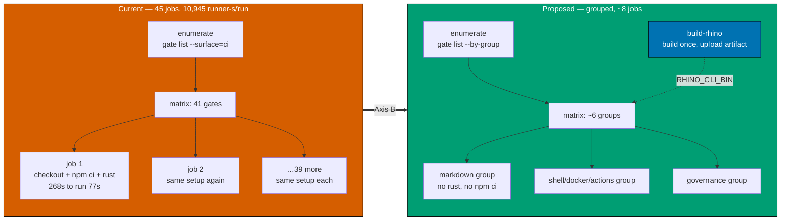
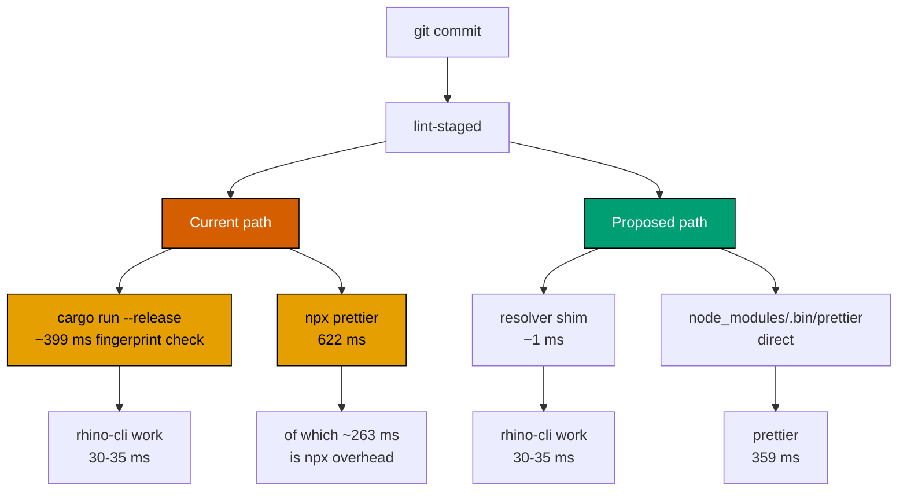
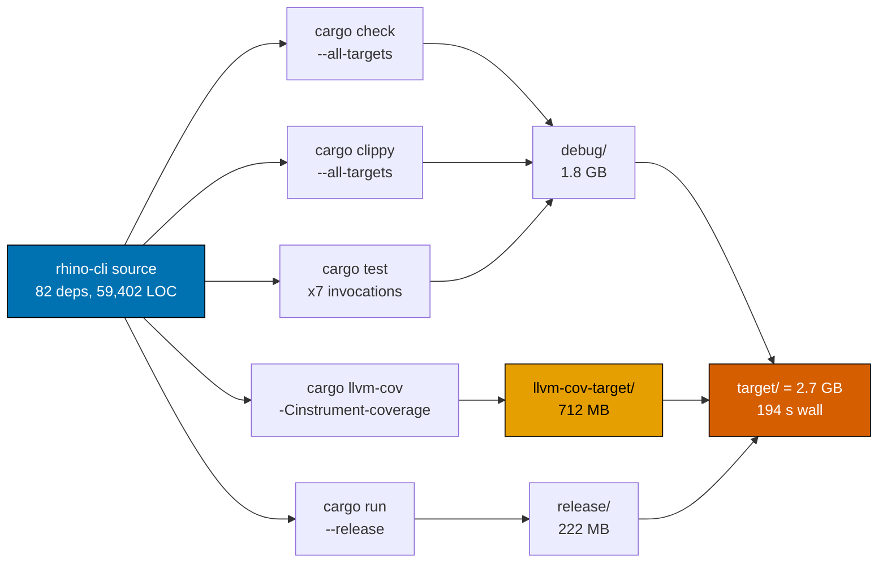
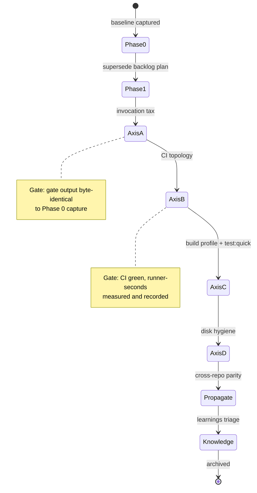

# Technical Documentation — Optimize CIs

## Measurement Baseline

All figures were produced by experiment on **2026-08-08**. Local figures come from this machine
(Darwin 24.5.0, Apple Silicon) in `worktrees/optimize-cis`; CI figures come from GitHub Actions run
history via `gh api` across all four OSE repos. Nothing here is estimated. Raw data and analysis
scripts are in `local-temp/` (gitignored): `local-benchmark-evidence.md`, `ci-history-evidence.md`,
`disk-occupancy-evidence.md`.

### Method note — a measurement trap worth recording

An early local pass timed commands with `$BIN $cmd` inside a `zsh` loop. **`zsh` does not word-split
unquoted variables**, so `"md links validate"` was passed as a single argument and every command
exited with `unrecognized subcommand` in ~3 ms. The numbers looked spectacular and were meaningless.
Every local figure below was re-measured under `bash` with non-error execution verified. A second
early pass timed with `python3` timestamp subprocesses, whose ~700 ms startup swamped the
measurement. **Timing harnesses in this repo must loop N times under `bash` and divide.**
`[Repo-grounded]`

### A.1 — Process-launch tax (loop N times under `bash`, divide)

| Invocation                                 |    ms/run |   N |
| ------------------------------------------ | --------: | --: |
| `rhino-cli --version` (direct binary)      |       3.2 | 100 |
| `rhino-cli --help` (direct binary)         |       4.0 |  20 |
| `cargo run --release --quiet -- --version` |   **388** |  20 |
| `npx nx show projects`                     | **3,560** |   3 |

### A.2 — Pre-commit per-file gates, 10 markdown files

Every row below was re-measured with the exit code asserted and the command's output inspected, after
an earlier pass produced fabricated figures (see the Method note above). `[Repo-grounded]`

| Gate                            | Current form                    | ms/run | Direct form                             | ms/run | Saving |
| ------------------------------- | ------------------------------- | -----: | --------------------------------------- | -----: | -----: |
| prettier `--check`              | `npx --no -- prettier`          |    622 | `./node_modules/.bin/prettier`          |    359 | 263 ms |
| markdownlint-cli2               | `npx --no -- markdownlint-cli2` |    441 | `./node_modules/.bin/markdownlint-cli2` |    189 | 252 ms |
| `md mermaid validate`           | `cargo run --release …`         |    406 | direct binary                           |     34 | 372 ms |
| `md heading-hierarchy validate` | `cargo run --release …`         |    375 | direct binary                           |     33 | 342 ms |
| `md naming validate`            | `cargo run --release …`         |    414 | direct binary                           |     30 | 384 ms |
| `md frontmatter validate`       | `cargo run --release …`         |    401 | direct binary                           |     35 | 366 ms |

**`lint-staged` path total: 2,659 ms → 680 ms (3.9×). Including the hook shim's own `cargo run`
(388 ms → ~3 ms): 3,047 ms → 683 ms (4.5×).** `[Repo-grounded]`

**The two taxes are not comparable in size.** `cargo run` wraps ~33 ms of work in ~399 ms of cargo
fingerprint-checking — a ~12× multiplier, and the dominant local cost. `npx` adds ~250–263 ms per
tool, which is real and worth removing but roughly a third of the `cargo run` saving. A plan that
treated them as equivalent would misallocate its effort.

### A.3 — Whole-repo scanner gates (pre-push surface), direct binary, N=3

| Gate                                          |  ms/run |
| --------------------------------------------- | ------: |
| `md links validate` (gate exclusions applied) | **436** |
| `md mermaid validate` (whole repo)            |     592 |
| `parity manifest validate`                    |     285 |
| `harness instruction-size validate`           |     194 |
| `md heading-hierarchy validate`               |     173 |
| `harness duplication validate`                |     125 |
| `specs structure validate`                    |      95 |
| `repo-governance vendor validate`             |      92 |
| `env validate`                                |      58 |
| `md readme-index validate`                    |      55 |
| `harness bindings validate`                   |      51 |
| `md frontmatter validate`                     |      49 |
| `md naming validate`                          |      31 |

Sum ≈ **1.5 s** of genuine work across the pre-push scanners. `md links validate` is the largest
single contributor and the only `rhino-cli` code path whose own runtime is worth optimizing on its
merits.

**Measure gates as they are actually configured.** A bare `md links validate` takes 882 ms and exits 1,
reporting 147 broken links — all of them preexisting in `plans/done/`. The registry invokes it with
`--exclude plans/done --exclude apps/ayokoding-www/content --exclude apps/ose-www/content`
`[Repo-grounded]`, under which it takes **436 ms and exits 0**. Timing a gate without its registry
arguments overstates both its cost and its failure rate.

### B.1 — CI cost roll-up, `pr-quality-gate`, 22 completed runs per repo

| repo                | jobs/run |   job-s/run |  setup-node | setup-lang | checkout | provision | real work |   overhead |
| ------------------- | -------: | ----------: | ----------: | ---------: | -------: | --------: | --------: | ---------: |
| ose-public          |       45 |    10,945 s | **5,894 s** |    1,082 s |    503 s |     534 s |   2,492 s | **77.2 %** |
| ose-primer          |       48 |    11,683 s | **6,597 s** |    1,241 s |    169 s |     275 s |   2,684 s |     77.0 % |
| The private sibling |       35 |     9,239 s | **5,024 s** |    1,932 s |    117 s |     968 s |     751 s |     91.9 % |
| beaver-nest         |       19 | **2,226 s** |     1,302 s |      251 s |    170 s |       0 s |     438 s |     80.3 % |

### B.2 — The 41-job validator fleet in `ose-public` (n = 792 job instances)

| category                            | total s | avg s per job instance |
| ----------------------------------- | ------: | ---------------------: |
| **toolchain-setup**                 | 134,477 |     **169.8 s (2:50)** |
| lint/validate (the actual gate)     |  48,643 |          61.4 s (1:01) |
| `Provision registry-declared tools` |  11,747 |                 14.8 s |
| checkout                            |   9,382 |                 11.8 s |
| runner-internal                     |   8,320 |                 10.5 s |

**268.4 s per job instance, of which 77 s (29 %) is the gate command and ~191 s (71 %) is setup the
job did not need to be alone to pay.**

| step                                                  |   n |       p50 | total s across 22 runs |
| ----------------------------------------------------- | --: | --------: | ---------------------: |
| `Run ./.github/actions/setup-node`                    | 792 | **144 s** |            **113,151** |
| `cargo run … gate run --surface=ci --only="$GATE_ID"` | 791 |      77 s |                 48,643 |
| `Run ./.github/actions/setup-rust`                    | 791 |      27 s |                 21,326 |
| `Run actions/checkout@v6`                             | 792 |      11 s |                  9,382 |

`setup-node` alone is **46.5 % of the entire `ose-public` PR quality gate**.

**Reconciling 36, 41, and 45.** The registry currently declares **36** `ci`-surface gates
(`gate list --surface=ci` on the working tree) `[Repo-grounded]`, which become 36 matrix legs. The run
history's "41-job validator fleet" is those 36 plus the five sibling validator jobs that are not
matrix legs — `typescript`, `dotnet`, `rust`, `compat-min-version`, `specs-structure`. Adding the four
orchestration jobs — `detect`, `format`, `enumerate`, `quality-gate` — gives the 45 jobs per run.
The figures are consistent; only the grouping differs.

### B.3 — The controlled experiment already run in your repos

The private sibling ran both topologies inside the sample window, same repo, same runners:

| Check            | As its own job |  Grouped | Ratio |
| ---------------- | -------------: | -------: | ----: |
| `actionlint`     |          234 s | **16 s** | 14.6× |
| `shellcheck`     |          248 s | **16 s** | 15.5× |
| `hadolint`       |          238 s |     16 s | 14.9× |
| 3 IaC validators |         3 jobs | **34 s** |  ~21× |

And in fully-migrated `beaver-nest`, `convention license validate`,
`specs gherkin-cardinality validate`, `actionlint`, `hadolint`, and `ShellCheck` each cost **0–1 s**,
versus **263–270 s** as dedicated jobs in `ose-public`. `[Repo-grounded]`

This is the single most important fact in the plan: **the intervention is already validated in
production, in this repo family, on these runners.** Axis B is adoption, not experiment.

### B.4 — Cache, contention, and waste channels

| Finding                    | Value                                                                                                               |
| -------------------------- | ------------------------------------------------------------------------------------------------------------------- |
| `ose-public` Actions cache | **10,525,641,701 bytes = 98.0 % of the 10 GiB ceiling**                                                             |
| Cause                      | `key: nx-…-${{ github.sha }}` mints a fresh **237.9 MB** entry per commit; 35 entries = 8.13 GB = 83 % of the cache |
| Effective retention        | **~1 day** (vs 5–6 days in sibling repos)                                                                           |
| Measured flakiness         | **Zero** — no failure-then-success on an unchanged SHA in any repo                                                  |
| Cancellations              | ose-public **24/200 (12.0 %)**, burning 38,320 s                                                                    |
| Explicit re-runs           | 0.5–1.5 %                                                                                                           |

The other three repos share the same key shape harmlessly because their `.nx/cache` payload is
1 KB–70 KB, not 237.9 MB. This is an `ose-public`-specific defect. `[Repo-grounded]`

### C.1 — Build profile

`apps/rhino-cli/Cargo.toml [profile.release]` is
`opt-level = 3, lto = "thin", codegen-units = 1, panic = "abort", strip = "symbols"`. `[Repo-grounded]`

| Profile                  | Cold build (isolated target dir, warm registry) | target/ | Real-work runtime |
| ------------------------ | ----------------------------------------------: | ------: | ----------------: |
| Current                  |                    **53.0 s** wall / 98.7 s CPU |  221 MB |           0.097 s |
| `lto=off, cgu=16, opt=1` |                    **19.6 s** wall / 88.7 s CPU |  206 MB |           0.086 s |

**2.7× faster cold build, no runtime penalty.** The crate is 82 dependencies, 59,402 LOC across 195
source files, producing a 4.08 MB binary.

### C.2 — Fingerprint multiplication in `test:quick`

`rhino-cli:test:quick` chains five subtargets whose flags differ, so cargo treats each as a distinct
build: `[Repo-grounded]`

| Subtarget       | Command shape                                                      |        Wall | `target/` after |
| --------------- | ------------------------------------------------------------------ | ----------: | --------------: |
| (start)         | —                                                                  |           — |          222 MB |
| `typecheck`     | `cargo check --all-targets`                                        |      21.0 s |          637 MB |
| `lint`          | `cargo fmt --check` + `cargo clippy --all-targets`                 |      10.3 s |          842 MB |
| `test:unit`     | **7 separate `cargo test` invocations**, lib at `--test-threads=1` | **119.0 s** |          2.0 GB |
| `test:coverage` | `cargo llvm-cov` (`-Cinstrument-coverage`) `--fail-under-lines 90` |      40.1 s |      **2.7 GB** |
| `test:specs`    | `cargo run --release` ×2                                           |       3.7 s |          2.7 GB |
| **total**       |                                                                    |   **194 s** |      **2.7 GB** |

Final breakdown: `debug` 1.8 GB, `llvm-cov-target` 712 MB, `release` 222 MB — three full builds of
one crate.

### D.1 — Disk

Post-sweep snapshot (the ambient sweeper had already run; no `node_modules/` existed at measurement
time, so `node_modules` duplication is unmeasured, not zero).

| #   | Bucket                                 |        GB | Share of 28.00 GB attributable |
| --- | -------------------------------------- | --------: | -----------------------------: |
| 1   | `ose-public/local-temp/`               | **12.31** |                        43.96 % |
| 2   | `~/.rustup/toolchains/` (6 toolchains) |      7.21 |                        25.73 % |
| 3   | `~/.cache/ose-cargo-target/`           |      1.97 |                         7.04 % |
| 4   | `~/.dotnet/`                           |      1.51 |                         5.39 % |
| 5   | `~/Library/Caches/ms-playwright/`      |      1.33 |                         4.74 % |

Top three = **76.7 %**. Measured reclaim candidates total **15.92 GB (56.8 %)**, none load-bearing —
the six components sum exactly: `[Repo-grounded]`

| Reclaim candidate                                                         |        GB |
| ------------------------------------------------------------------------- | --------: |
| Orphaned `.next` builds in `local-temp` (three generations, 57,811 files) |      9.32 |
| Unpinned rustup toolchains (only `ose-primer` pins a channel)             |      4.45 |
| `debug/incremental` in the shared cargo cache                             |      0.96 |
| Duplicated toolchain roots inside `local-temp`                            |      0.79 |
| This worktree's unshared `apps/rhino-cli/target`                          |      0.22 |
| Stale `mcp-chrome-*` builds                                               |      0.18 |
| **total**                                                                 | **15.92** |

Two structural findings:

- **This worktree's `target/` is not shared.** All three sibling repos symlink
  `apps/rhino-cli/target` into `~/.cache/ose-cargo-target/<repo>/rhino-cli`, but
  `worktrees/optimize-cis/apps/rhino-cli/target` is a real directory — a 985-file, 221.8 MB
  duplicate. The sharing convention does not cover worktrees, which matters because
  `worktree-to-pr` is mandatory.
- **`local-temp/` is sweeper-exempt and unbounded** per [`AGENTS.md`](../../../AGENTS.md). Nothing
  prunes it; it is now 88.2 % of `ose-public`.

### D.2 — Cross-worktree cargo build-lock contention

A `cargo run` during this session blocked **65.05 s wall at 0.31 s user / 0.50 s sys** — pure lock
wait, no compilation. Because `doctor --fix` points every worktree of a repo at one shared per-crate
`target/`, concurrent cargo processes across worktrees serialize on a single build-directory lock.
The shared cache trades disk for serialization. `[Repo-grounded]`

## Why Not A Rewrite

The plan that this one supersedes considered a language change, and an earlier plan proposed OCaml.
The measurements close the question:

- `rhino-cli`'s own work is **3.2 ms** (`--version`) to **1,081 ms** (`md links validate`, the worst
  gate). A Go binary would land in the same range; Go's startup is comparable to Rust's, and
  `md links validate` is I/O- and parse-bound, not language-bound.
- **Every cost this plan targets survives a rewrite unchanged.** `cargo run` becomes `go run` (same
  tax, arguably worse). 41 CI jobs stay 41 CI jobs. `npm ci` still runs 792 times. The
  237.9 MB-per-commit cache key is untouched. `setup-node`'s 46.5 % share is untouched.
- The one cost a rewrite genuinely removes — the 53 s cold Rust build — is **already removed by a
  profile change measured at 19.6 s**, and removed entirely in CI by building once per run.

A rewrite is a large, risky, coverage-threatening change that addresses none of the top five cost
centres. This plan addresses all five without touching the language.

## Design Decisions

### DD-1 — Generated gate commands resolve a prebuilt binary, not `cargo run`

**Decision.** `apps/rhino-cli/src/commands/gate/emit.rs` currently renders every `GateKind::RhinoCli`
entry as `cargo run --release --quiet --manifest-path apps/rhino-cli/Cargo.toml -- <command>`
(lines 122–125). `[Repo-grounded]` It will instead render a call to a single resolver shim that locates an
already-built binary and executes it.

**Why a shim and not a bare path.** The binary can legitimately be absent: the ambient build-artifact
sweeper deletes `target/` at any time, and a fresh worktree has never built. A bare path would make
the hook fail with a confusing `no such file`. The shim resolves in order — an explicit
`RHINO_CLI_BIN` override, then the built binary, then a build-and-retry — so the slow path happens
once after a sweep instead of on every invocation.

**Rejected alternative — keep `cargo run` but add `--offline`.** Measured: the 388 ms is cargo's
fingerprint check over the whole dependency graph, not network access. `--offline` does not remove it.

**Note.** `gate/run.rs:432` already dispatches gate-internal leaves via `std::env::current_exe()`
`[Repo-grounded]` — the cheap path. Only the generated `lint-staged` commands, the three Husky shims,
and the CI workflow sites pay the tax, which is why this change is narrow.

### DD-2 — `npx` gives way to direct `node_modules/.bin` dispatch

**Decision.** Generated commands for `GateKind::External` node tools resolve
`node_modules/.bin/<tool>` directly. Measured: 622 ms → 359 ms for prettier, 441 ms → 189 ms for
markdownlint-cli2 — a real but modest ~250 ms saving per tool, an order of magnitude smaller than the
`cargo run` saving.

**Constraint.** `lint-staged` runs commands through a shell with the repo root as cwd, so a
repo-relative `.bin` path is stable. Tools genuinely absent from `node_modules` keep `npx`; the
registry's existing `doctor_tools` field already distinguishes them.

### DD-3 — CI groups are a required registry field, never derived

**Decision.** `repo-config.yml` gains a **required** `ci_group` field on every gate entry.
`gate list --surface=ci --format=json --by-group` emits one matrix entry per group;
`gate run --surface=ci --group=<id>` runs every gate in that group inside one job.

**Why explicit rather than derived.** `beaver-nest` proves the topology but hand-maintains its ~19
jobs in the workflow file with no registry backing, so its job list and its gate registry can drift
silently. Deriving groups from a gate's `doctor_tools` or category would reintroduce exactly the
name-and-folder-derivation magic this repository avoids. A required field keeps `repo-config.yml`
authoritative — `gate validate` fails when a gate declares no group — and keeps the workflow
generated rather than hand-written.

**Consequence, stated plainly.** One job's log now covers several checks instead of one, and a single
red group names the group rather than the individual check. Mitigated by `gate run --group` printing
a per-gate PASS/FAIL summary line, so the failing gate id is still greppable in the log.

### DD-4 — `rhino-cli` is built once per CI run and passed as an artifact

**Decision.** A `build-rhino` job compiles the binary once under the fast gate profile and uploads it;
every gate group downloads it and sets `RHINO_CLI_BIN`. Gate groups then need **no Rust toolchain at
all**, removing `setup-rust` (27 s p50 × 791 instances = 21,326 s per 22 runs) from every gate job.

**This also removes the three `cargo install` calls** (`cargo-llvm-cov`, `cargo-deny`, `cargo-hack`)
from gate jobs. They are guarded only by `command -v` and serve `test:coverage`, `deps:audit`, and
`compat:min-version` — never a gate leg. `[Repo-grounded]`

### DD-5 — `setup-node` stops running `npm ci` in jobs that do not need node

**Decision.** `.github/actions/setup-node` gains an input controlling whether `npm ci` runs. Gate
groups whose tools are all native binaries or the `rhino-cli` artifact skip it entirely.

**Evidence.** `setup-node` is 46.5 % of the whole gate at 144 s p50 × 792 instances.
`beaver-nest` already demonstrates the pattern: its `setup-node` runs in **158 of 224** job
instances, not all of them. `[Repo-grounded]`

### DD-6 — Two cargo profiles: shipped and gate

**Decision.** Keep `[profile.release]` as-is for the shipped artifact. Add a
`[profile.gate]` inheriting from release with `lto = false, codegen-units = 16, opt-level = 1`.
Gates, hooks, and CI build `--profile gate`; `nx run rhino-cli:build` keeps `--release`.

**Why not just relax `release`.** The parity manifest and any published binary should stay
maximally optimized. Splitting the profiles gets the 2.7× build win without changing what ships.

### DD-7 — `test:quick` stops compiling the same tree three times

**Decision.** `test:coverage` (which forces its own `-Cinstrument-coverage` fingerprint and 712 MB of
`llvm-cov-target`) moves out of the `test:quick` chain and onto CI only. `test:unit`'s seven
sequential `cargo test` invocations collapse where they share a profile.

**Rationale.** `test:quick` is the **pre-push** gate; a 194 s pre-push and a 2.7 GB `target/` are
what makes local iteration painful. Coverage thresholds are a CI concern — they gate merge, not
push. Coverage enforcement is not weakened, only relocated; `delivery.md` asserts the CI job still
enforces `--fail-under-lines 90`.

### DD-8 — Nx cache key stops including the commit SHA

**Decision.** Drop `-${{ github.sha }}` from the `.nx/cache` key in
`.github/actions/setup-node/action.yml:30` `[Repo-grounded]`, retaining the existing `restore-keys`
fallbacks.

**Evidence.** The SHA suffix guarantees a cache miss and a fresh 237.9 MB write on every commit,
consuming 83 % of a 10 GiB budget and collapsing retention to ~1 day. The `restore-keys` already
provide the intended partial-match behaviour.

### DD-9 — One Rust version, declared once per crate and agreed everywhere

**Decision.** Converge every Rust version declaration in the three in-scope repos on **`1.95.0`**,
the value 9 of the 11 existing `rust-toolchain.toml` sites already carry, and align the MSRV field
to the same number so the toolchain channel and the declared floor stop disagreeing. Prune the
machine's `~/.rustup` to the toolchains the repos actually pin, retaining `stable` only when a
non-OSE Rust project is found on the machine.

**Evidence — three independent sources of truth disagree today** `[Repo-grounded]`:

| Source                            | Mechanism                                                           | Value today                                                                   |
| --------------------------------- | ------------------------------------------------------------------- | ----------------------------------------------------------------------------- |
| `rust-toolchain.toml` → `channel` | what `cargo` actually builds with                                   | `1.95.0` at 9 sites; **`stable` at 2** (`crud-be-rust-axum`, `coralpolyp-be`) |
| `Cargo.toml` → `rust-version`     | MSRV floor; drives `compat:min-version` and the CI pre-install loop | `1.88` at 10 sites; **`1.94.0` at 1** (`crud-be-rust-axum`)                   |
| `doctor`'s expected-rustc         | `tools.rs:698` reads `apps/rhino-cli/Cargo.toml → rust-version`     | `1.88` — so `doctor` validates against the **floor**, never the channel       |

The third row is the sharpest: `doctor` reports the environment healthy when `rustc` matches `1.88`,
while every build actually runs on `1.95.0`. The check cannot detect the drift it exists to catch.

**Consequences of the drift, all measured:**

- `~/.rustup` holds **6 toolchains / 7.2 GB**, of which `1.80` (1.1 GB), `1.94` (1.2 GB), and
  `1.96.0` (952 MB) are pinned by nothing in any of the four repos.
- The private sibling's `setup-rust` installs `stable` via `dtolnay/rust-toolchain@stable` (default input,
  no caller overrides it) — a different mechanism from the `actions-rust-lang/setup-rust-toolchain@v1`
  the other three use. Since `apps/rhino-cli/rust-toolchain.toml` pins `1.95.0`, rustup then
  downloads `1.95.0` on the first `cargo` call. **Every the private sibling Rust job installs a toolchain
  it never uses, then fetches the one it needs.**
- The `Pre-install pinned MSRV toolchain(s)` block exists verbatim in all four `setup-rust` actions
  purely to work around the floor/channel gap — it serialises a rustup install to stop parallel
  `cargo hack check --rust-version` tasks corrupting the shared download dir. Aligning MSRV to the
  channel makes the block install the already-present pinned toolchain, dissolving the race.
- `private-sibling/repo-governance/workflows/infra/infra-development-environment-setup.md:59` states the
  Rust requirement as `>= 1.80 (MSRV) | apps/coralpolyp-be/Cargo.toml`, but that file declares
  `1.88`. The doc is stale and is the likely origin of the orphaned `1.80` toolchain.
- `ose-primer` and the private sibling both carry `docs/.../rust/README.md:84` → `**Version**: Rust 1.82+
(stable)`, a hardcoded number matching no declaration. `ose-public` and `beaver-nest` instead
  point at `Cargo.toml` with no number — the correct pattern, and the one to converge on.

**Why `1.95.0` and not the newest.** Latest stable is **1.97.1**, released 2026-07-14 — 25 days old
at plan authoring, so it fails the 60-day soak the
[dependency bump policy](../../../repo-governance/development/workflow/dependency-bump-policy.md)
requires on Path B. `1.95.0` is what the repos already run, so unification carries **zero
version-change risk** and keeps this plan's CI-performance thesis separable from a version bump. A
later bump is explicitly out of scope here and must run the policy's own soak and CVE checks.

**Why MSRV is aligned rather than deleted.** Setting `rust-version = "1.95.0"` makes
`compat:min-version` tautological — it proves a crate builds on the toolchain it already builds on.
Deleting the gate would be the honest end state, but it removes a check and so collides with M5
coverage invariance; it also changes a published quality posture. Alignment achieves one version,
keeps the check set intact, dissolves the pre-install race, and is a one-number revert. Retiring the
gate is recorded as follow-up work, not done here. The declared floor buys nothing today regardless:
`rust-commons` is internal-only and the three CLIs are applications, so no downstream crate compiles
against a floor.

**Why `stable` may survive the prune.** Deleting `stable` is the only step here whose blast radius
leaves the OSE repos — an unrelated project on this machine may depend on it, and no repo-local
evidence can rule that out. The delivery step therefore decides by predicate rather than by
judgement: scan for `Cargo.toml` outside `~/ose-projects`, and delete `stable` only when that scan
returns nothing. This keeps the step fully `[AI]` without guessing.

## Diagrams

### Current versus proposed CI topology



### Gate invocation path, before and after



### Build-fingerprint multiplication in `test:quick`



### Phase flow and gates



## File-Impact Analysis

```text
ose-public/
├── apps/rhino-cli/
│   ├── Cargo.toml                                    [E] add [profile.gate]; rust-version → 1.95.0 (DD-9)
│   ├── project.json                                  [E] test:quick chain; gate-profile targets
│   ├── scripts/rhino-bin.sh                          [N] resolver shim (DD-1)
│   ├── src/application/doctor/tools.rs               [E] expected rustc reads channel, not MSRV (DD-9)
│   └── src/commands/gate/
│       ├── emit.rs                                   [E] render shim, not `cargo run` (DD-1, DD-2)
│       ├── list.rs                                   [E] `--by-group` output mode (DD-3)
│       ├── run.rs                                    [E] `--group=<id>` selector (DD-3)
│       └── validate.rs                               [E] require ci_group; assert workflow conformance
├── apps/{ose-cli,ayokoding-cli}/Cargo.toml           [E] rust-version → 1.95.0 (DD-9)
├── libs/rust-commons/Cargo.toml                      [E] rust-version → 1.95.0 (DD-9)
├── repo-config.yml                                   [E] required `ci_group` on every gate entry
├── package.json                                      [G] lint-staged block, regenerated
├── .husky/{pre-commit,pre-push,commit-msg}           [G] shims, regenerated
├── .github/
│   ├── actions/setup-node/action.yml                 [E] optional npm ci (DD-5); cache key (DD-8)
│   ├── actions/setup-rust/action.yml                 [E] optional cargo-install block (DD-4)
│   └── workflows/pr-quality-gate.yml                 [E] build-rhino job; matrix over groups
├── specs/apps/rhino/behavior/rhino-cli/gherkin/system/
│   └── doctor.feature                                [E] rustc checked against channel (DD-9)
├── specs/apps/rhino/behavior/rhino-cli/gherkin/gate/
│   ├── gate-binary-resolution.feature                [N] shim resolution (DD-1)
│   ├── gate-emission.feature                         [E] shim + node-bin rendering (DD-1, DD-2)
│   ├── gate-enumeration.feature                      [E] --by-group (DD-3)
│   ├── gate-execution.feature                        [E] --group, CI topology (DD-3, DD-4, DD-5)
│   └── gate-validation.feature                       [E] ci_group required (DD-3)
├── repo-governance/development/
│   ├── infra/nx-targets.md                           [E] test:quick composition change (DD-7)
│   └── infra/temporary-files.md                      [E] local-temp retention (Axis D)
├── docs/reference/                                   [E] any doc naming the old invocation form
├── docs/explanation/.../rust/README.md               [E] MSRV bullet states floor == pin (DD-9)
├── plans/backlog/rhino-cli-optimization/             [D] superseded — deleted in Phase 1
├── plans/backlog/README.md                           [E] de-index the deleted plan
└── plans/in-progress/
    ├── README.md                                     [E] index this plan
    └── optimize-cis/                                 [N] this plan
```

Markers: `[E]` edited · `[N]` new · `[D]` deleted · `[G]` generated (never hand-edited).

### More Detail

- **Generated artifacts are not optional touches.** `package.json`'s `lint-staged` block and the three
  `.husky/` shims are emitted by `gate emit`; `.opencode/`, `.cursor/`, and `.amazonq/` are emitted by
  `npm run generate:bindings`. Per [File-Touch Discipline](../../../repo-governance/development/practice/file-touch-discipline.md)
  they belong on the ledger and land in the **same commit** as the source that produced them.
- **Ordering is load-bearing.** DD-3 (`ci_group` required) must land before DD-4 (build-once artifact),
  because the workflow's matrix source changes shape first. DD-1 must land before the CI sites are
  rewritten, since CI consumes the same emitted form.
- **`repo-config.yml` is byte-relevant across repos.** `apps/rhino-cli` is under a byte-identity parity
  gate spanning `ose-public`, `ose-primer`, and the private sibling with zero carve-outs
  ([Related Repositories](../../../docs/reference/related-repositories.md)). Any `src/` edit here opens a
  cross-repo obligation that the propagation phase must discharge before the parity gate can pass.
- **`beaver-nest` carries a fork** of `rhino-cli` and is in neither parity boundary, so it receives the
  workflow-level changes only if its own measurements justify them — it is already the fast repo.
- **Four files exist only in the siblings** and so cannot appear in the `ose-public` tree above:
  `ose-primer/apps/crud-be-rust-axum/rust-toolchain.toml` and
  `private-sibling/apps/coralpolyp-be/rust-toolchain.toml` (`channel = "stable"` → `1.95.0`),
  `private-sibling/.github/actions/setup-rust/action.yml` (`dtolnay/rust-toolchain@stable` → the
  `actions-rust-lang` form the other repos use), and
  `private-sibling/repo-governance/workflows/infra/infra-development-environment-setup.md` (stale
  `>= 1.80` claim). Phase 10 owns all four.
- **`beaver-nest` still constrains the machine-side prune.** It is excluded from this plan's changes,
  not from the machine whose `~/.rustup` the prune edits, so its pinned channel is part of the
  required set the prune is derived from.

## Rollback

Each axis is independently revertible, and none changes what a gate reports.

| Axis | Rollback                                                                                                                                                                                                                                                                                                                                                   |
| ---- | ---------------------------------------------------------------------------------------------------------------------------------------------------------------------------------------------------------------------------------------------------------------------------------------------------------------------------------------------------------- |
| A    | Revert `emit.rs`, re-run `gate emit` + `generate:bindings`; the `cargo run` form returns                                                                                                                                                                                                                                                                   |
| B    | Revert `pr-quality-gate.yml` and the `ci_group` field; matrix returns to per-gate fan-out                                                                                                                                                                                                                                                                  |
| C    | Remove `[profile.gate]`; targets fall back to `--release`                                                                                                                                                                                                                                                                                                  |
| D    | Reclamation is quarantine-then-verify: candidates are `mv`d into `local-temp/.reclaim-quarantine-<date>/` and only deleted after `doctor --fix`, `test:quick`, and `nx affected -t build` all pass. Until that final `rm`, a single `mv` back restores everything; after it, all removed content is regenerable via `nx build` / `npm run doctor -- --fix` |

| E | Version unification reverts as five one-number edits (`rust-version` per manifest) plus a `channel` revert in the two sibling crates; the `doctor` source change reverts with `tools.rs`. The rustup prune reverts via `rustup toolchain install <name>` — reversible, but the only step here whose undo needs network, which is why its no-download proof runs inline rather than at the phase gate |

The behaviour-preservation assertion is the real safety net: every phase gate diffs the full gate
output against the Phase 0 capture, so a regression in what is checked fails the phase, not review.
