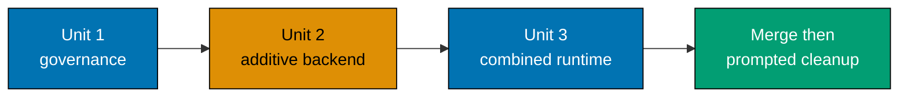

# Delivery — BeaverNest App Setup

> **Legend** — `[AI]`: an agent performs the step (the default; unmarked steps are `[AI]`).
> `[HUMAN]`: only a human can do it (physical action, out-of-band approval, or real-secret/
> privileged-credential handling). `[AI+HUMAN]`: agent prepares; human approves or finishes.
>
> Every phase ends with a must-pass gate and one resume command. Do not start the next phase while
> the current gate is red.

## Delivery Mode: `worktree-to-pr`

> **Worktree Cap conformance note (added when the rule landed):** this plan declares three
> worktrees (`beaver-nest-app-setup`, `beaver-nest-app-setup-backend`,
> `beaver-nest-app-setup-client-runtime`) across its delivery units. All three were already
> provisioned (`git worktree add` steps checked `[x]`) before the
> [Worktree Cap](../../../repo-governance/conventions/structure/plans/worktree-cap.md#worktree-cap--one-worktree-per-repository-per-plan-hard-rule)
> and
> [Per-Repository Delivery Mode Restrictions](../../../repo-governance/conventions/structure/plans/per-repository-delivery-mode-restrictions.md#per-repository-delivery-mode-restrictions-hard-rule)
> rules landed — grandfathered as historical record, not rewritten. No new worktree provisioning
> remains pending in this plan.

Use three sequential worktree-to-PR delivery units. Each PR targets `main`, follows the
[PR Merge Protocol](../../../repo-governance/development/workflow/pr-merge-protocol.md), and runs the
default three-cycle PR-Review Maker→Fixer quality gate. Phase 0 is setup only and never opens a PR.

**CI scope note**: every CI-verification step below is scoped to a named/branch/PR-event workflow
(`pr-quality-gate.yml`, `beaver-nest-app-test-local-deploy-stag.yml`, etc.) — never
`.github/workflows/main-ci.yml`, which is deprecated, schedule-only, and must not be monitored or
gated on.

## Worktree

Worktree path: `worktrees/beaver-nest-app-setup/`

Optional manual pre-provisioning (run from repository root):

```bash
claude --worktree beaver-nest-app-setup
```

The plan-execution Step 0 gate enters this worktree by default: it auto-provisions from the latest
`origin/main` when missing, syncs with `origin/main` before implementing, and prompts before deleting
the worktree after the plan is archived and pushed. The later delivery units use the exact worktrees
declared in the delivery-boundary table.

## Execution-State Ledger

Phase 0 uses only executor task state because it creates no reviewable artifact. Before the first
change-producing action in every later phase, create or append
`plans/in-progress/beaver-nest-app-setup/execution-state.md`. It is the durable, append-only
handoff record and is committed with the phase's delivery unit. Each phase gets a `## Phase N` block
with `### Task Status`, `### Files Changed`, `### Commands and Results`, and `### Evidence` headings.
Every row under `### Files Changed` names one path, action (`created`, `modified`, `deleted`, or
`generated`), and reason. Add the path when it is touched, not when staging. Reconcile that exact
ledger against `rtk git status --short` before every commit; stage only ledgered paths. The final
archival step moves this file with the plan; it is not a second source of product requirements.

## PR-Review Workflow Invocation Record

The repository's agent/workflow interface is the invocation mechanism for the mandatory review
cycles; it has no shell-equivalent command. For **each** cycle, the orchestrator sends this exact
request to the repository workflow runner, substituting only the values in angle brackets:

```text
Run workflow `pr-review-quality-gate` with:
  pr: <the sole URL in local-temp/beaver-nest-app-setup-unit-<N>-pr-url.txt>
  cycles: 1
  cycle-label: unit-<N>-cycle-<C>
  prior-cycle-record: <local-temp/beaver-nest-app-setup-unit-<N>-cycle-<C-1>-review.md, or none for C=1>
  result-record: local-temp/beaver-nest-app-setup-unit-<N>-cycle-<C>-review.md
```

The workflow runner writes the returned `final-status`, `cycles-completed`, `unresolved-threads`,
the pinned PR head SHA, the consolidated-review URL, all fixer commit SHAs, and any escalation to
the named `result-record`. The orchestrator appends the same path and summary to the phase block of
`execution-state.md`. A cycle fails if the record is absent, does not say `done`, does not say
`cycles-completed: 1`, or says a nonzero unresolved-thread count. The following CI-run-ID command
is run only after that cycle record exists and its fixer push is visible.

## Parallelization Model

Use the N+1 model with the main orchestrator and at most N=3 background agents. The three
change-producing units are serial because unit 2 reads the governance merged by unit 1 and unit 3
reads the backend contract merged by unit 2. Within a unit, independent review or test commands may
fan out only when they do not write a shared file. Cleanup is terminal and is blocked by all merges.

If any command in this checklist fails, fix its root cause before continuing, including every
preexisting failure encountered in scope. Never bypass, suppress, skip, or defer a red gate merely
because the failure predates this plan.



### Dependency DAG

| Node | Responsibility                                      | blockedBy | blocks | Execution                         |
| ---- | --------------------------------------------------- | --------- | ------ | --------------------------------- |
| P0   | Origin precondition, environment, five-project base | none      | P1     | serial                            |
| P1   | Governance-only real-database rules                 | P0        | R1     | serial                            |
| R1   | Unit 1 review, CI, and merge                        | P1        | P2     | serial delivery boundary          |
| P2   | Additive SQLite, migration, and recovery backend    | R1        | P3     | serial; independent tests may fan |
| P3   | Additive readiness contract and unit 2 delivery     | P2        | R2     | serial                            |
| R2   | Unit 2 review, CI, and merge                        | P3        | P4     | serial delivery boundary          |
| P4   | Frontend specs and Vite CSR workspace               | R2        | P5     | serial                            |
| P5   | Combined runtime, routing, persistence, and CI      | P4        | P6     | serial                            |
| P6   | Full-story verification and tester follow-ups       | P5        | K      | test lanes may fan out            |
| K    | Knowledge capture                                   | P6        | A      | serial                            |
| A    | Archive, unit 3 review/merge, prompted cleanup      | K         | none   | terminal                          |

### Delivery Boundaries

| Phase(s) | Delivery unit                                   | Worktree / branch                                                                          | PR opens             |
| -------- | ----------------------------------------------- | ------------------------------------------------------------------------------------------ | -------------------- |
| 0        | — (setup and baseline)                          | —                                                                                          | no                   |
| 1        | Governance-only real-database rules             | `worktrees/beaver-nest-app-setup/` / `beaver-nest-app-setup`                               | yes — at Phase 1 end |
| 2-3      | Additive SQLite and readiness backend           | `worktrees/beaver-nest-app-setup-backend/` / `beaver-nest-app-setup-backend`               | yes — at Phase 3 end |
| 4-8      | Vite CSR, combined same-origin runtime, archive | `worktrees/beaver-nest-app-setup-client-runtime/` / `beaver-nest-app-setup-client-runtime` | yes — at Phase 8 end |

### Delivery Deviations (reconciled against git 2026-08-05)

Units 1 and 2 delivered as specified: PR #1 (`beaver-nest-app-setup`, merged 2026-08-03) carried
Phase 1, PR #2 (`beaver-nest-app-setup-backend`, merged 2026-08-03) carried Phases 2-3. Both merge
commits are on `main` (`66bfd9ffa`, `be67af9f0`).

**Unit 3 deviated.** Its Phase 4-6 content reached `main` **without a PR** — seven commits from
`8bfe22fa0 feat(beaver-nest-fe): migrate workspace to vite` through
`cd2ec0e4d docs(governance): apply model selection disclosure`, landed by pushing the
`beaver-nest-app-setup-client-runtime` branch directly rather than opening the PR this table
requires. No PR #3 exists; `gh pr list --state all` returns only #1 and #2. Consequences:

- The mandatory **PR-Review Maker→Fixer Cycles** never ran for unit 3, so no
  `local-temp/beaver-nest-app-setup-unit-3-cycle-*-review.md` record exists and the PR-Review
  Workflow Invocation Record below has no unit-3 entry.
- Phase 8's "Unit 3 PR/Merge" steps are now **unsatisfiable as written** — the content they were to
  merge is already on `main`. Phase 8 needs rescoping to archive-and-cleanup before it can be
  executed, or the plan needs an explicit waiver recording the direct-push landing.
- All three worktrees named in this table are gone (`git worktree list` shows only the primary
  checkout), and the unit-3 branch has been deleted, so unit 3 cannot be re-delivered through a PR
  without reconstructing it from `main`.

Checkbox state through Phase 5 was reconciled from the `execution-state.md` ledger, the two merged
PRs, and the artifacts verified present on `main`; it had drifted to 42/385 while Phases 0-5 were in
fact complete.

## Phase 0: Origin Precondition, Environment, and Baseline

- [x] [AI] Verify this authored plan already exists on `origin/main` with
      `git fetch origin && git show origin/main:plans/in-progress/beaver-nest-app-setup/delivery.md >/dev/null`;
      acceptance: the command exits 0 before any origin-based worktree is provisioned. If it fails,
      stop and ask the user for separate authorization to commit and land the plan; this authoring
      request does not authorize staging or committing it.
- [x] [AI] Run `npm install` from `~/ose-projects/beaver-nest`; acceptance: npm exits 0 and no
      unledgered tracked file changes.
- [x] [AI] Run `npm run doctor -- --fix` from `~/ose-projects/beaver-nest`; acceptance: the
      doctor exits 0 without changing git identity.
- [x] [AI] Provision the first unit with
      `git fetch origin && git worktree add -b beaver-nest-app-setup worktrees/beaver-nest-app-setup origin/main`
      when it is absent; acceptance: `git -C worktrees/beaver-nest-app-setup status --short` is empty.
- [x] [AI] Run `npm install` inside `worktrees/beaver-nest-app-setup/`; acceptance: npm exits 0.
- [x] [AI] Run `npm run doctor -- --fix` inside `worktrees/beaver-nest-app-setup/`; acceptance: the
      doctor exits 0 without changing git identity.
- [x] [AI] Initialize the append-only file-touch ledger in executor task state; acceptance: every
      later touched path is recorded and no repository file is created for the Phase 0 ledger.
- [x] [AI] Create only local temporary scratch-probe inputs
      `local-temp/beaver-nest-publication-probe/{main.rs,Dockerfile}`: `main.rs` uses only Rust `std` to
      listen on `0.0.0.0:80` and return a bounded `200` response; `Dockerfile` uses only `FROM scratch`,
      copies the compiled binary, and declares port `80`. Record their hashes, the installed
      `aarch64-unknown-linux-musl` target, `rust-lld` linker, and `docker build --pull=false` result in
      `local-temp/beaver-nest-publication-probe/executor-state.md`; acceptance: the executor-state record
      proves no registry package, remote image, or manifest change is introduced, so the dependency
      policy's external-package clearance path is not applicable.
- [x] [AI] Run a disposable host-address publication capability probe with
      `rustc --edition=2024 --target aarch64-unknown-linux-musl -C linker=rust-lld -C target-feature=+crt-static -O local-temp/beaver-nest-publication-probe/main.rs -o local-temp/beaver-nest-publication-probe/publication-probe-server && docker build --pull=false --tag beaver-nest-publication-probe:local -f local-temp/beaver-nest-publication-probe/Dockerfile local-temp/beaver-nest-publication-probe && beaver_nest_probe=beaver-nest-publication-probe-$$; trap 'docker stop "$beaver_nest_probe" >/dev/null 2>&1 || true; docker rm "$beaver_nest_probe" >/dev/null 2>&1 || true' EXIT; docker run --detach --name "$beaver_nest_probe" --publish 127.0.0.1:19391:80 beaver-nest-publication-probe:local >/dev/null && curl --fail --silent --show-error http://127.0.0.1:19391/ >/dev/null && docker port "$beaver_nest_probe" 80 | rg '^127\.0\.0\.1:19391$'`;
      acceptance: the selected Linux Docker Engine or macOS Docker Desktop runtime retains the explicit
      loopback fixture address rather than a wildcard, and records no real VPN address. If it fails,
      stop before Phase 1 and record the unsupported runtime in executor task state; do not relax the
      production address-binding requirement.
- [x] [AI] Run
      `npm exec -- nx run-many -t typecheck,lint,test:quick,test:specs -p beaver-nest-contracts,beaver-nest-be,beaver-nest-be-e2e,beaver-nest-fe,beaver-nest-fe-e2e --parallel=3`
      inside the first worktree; acceptance: all targets for the exact five-project baseline exit 0.
- [x] [AI] Run `npm run lint:md && npm run validate:sync && npm exec -- nx run rhino-cli:instruction-size:validation`
      inside the first worktree; acceptance: all three commands exit 0.

### Phase 0 Gate

> All checks below must pass before Phase 1. Phase 0 pushes nothing, opens no PR, runs no review
> cycle, and changes no source, spec, documentation, governance, or plan file.

- [x] [AI] Run
      `git -C worktrees/beaver-nest-app-setup merge-base --is-ancestor origin/main HEAD`;
      acceptance: the command exits 0.
- [x] [AI] Run `git -C worktrees/beaver-nest-app-setup status --short`; acceptance: output is empty.
- [x] [AI] Re-run
      `npm exec -- nx run-many -t test:quick,test:specs -p beaver-nest-contracts,beaver-nest-be,beaver-nest-be-e2e,beaver-nest-fe,beaver-nest-fe-e2e --parallel=3`;
      acceptance: all exact five-project baseline targets exit 0.

> **Pause Safety**: The plan is present on `origin/main`, the first worktree is clean and current, and
> no reviewable file changed. Safe to stop. To resume:
> `git -C worktrees/beaver-nest-app-setup status --short`.

## Phase 1: Governance-Only Real-Database Rules

Run every Phase 1 command from
`~/ose-projects/beaver-nest/worktrees/beaver-nest-app-setup/` unless the checkbox names a
different working directory.

- [x] [AI] Create `plans/in-progress/beaver-nest-app-setup/execution-state.md` with the four required
      headings and a `## Phase 1` block before editing governance content; acceptance: the file has
      empty `### Task Status`, `### Files Changed`, `### Commands and Results`, and `### Evidence`
      sections, and its first `Files Changed` row records the file itself as created for durable
      execution-state tracking.
- [x] [AI] If Phase 0's local scratch publication probe succeeded and its executor-state record can be
      safely retained without host-specific data, create the committed sanitized evidence record
      `plans/in-progress/beaver-nest-app-setup/evidence/phase-0-dependency-adoption.md` before editing
      governance content. Transcribe only the source and Dockerfile hashes, Rust target, `rust-lld` link,
      and `docker build --pull=false` result from
      `local-temp/beaver-nest-publication-probe/executor-state.md`; acceptance: the retained record proves
      no registry package, remote image, or manifest change was introduced, retains no private host value,
      and preserves the local artifact's **N/A** external-package-clearance status. If retention is not
      safe or appropriate, record that decision in the Phase 1 execution-state ledger and do not create
      the evidence file.

- [x] [AI] Edit `repo-governance/development/quality/three-level-testing-standard.md` so universal
      integration gates require each app's real configured production database rather than PostgreSQL;
      acceptance: its generic integration guidance names no specific database product.
- [x] [AI] Edit `repo-governance/development/infra/bdd-spec-test-mapping.md` so integration BDD mapping
      requires the configured real production database; acceptance: its generic mapping makes SQLite
      and PostgreSQL equally valid app-selected examples.
- [x] [AI] Edit `repo-governance/development/infra/ci-conventions.md` so CI database guidance is
      application-selected rather than PostgreSQL-only; acceptance: generic CI requirements retain no
      PostgreSQL dependency.
- [x] [AI] Edit `repo-governance/development/infra/nx-targets.md` so `test:integration` documentation
      requires the real configured production database; acceptance: its target definition remains
      database-neutral.
- [x] [AI] Edit `repo-governance/development/README.md` to link the generalized real-database rule;
      acceptance: its development index describes no PostgreSQL-only integration requirement.
- [x] [AI] Edit `repo-governance/development/quality/README.md` to index the generalized testing rule;
      acceptance: its quality index has no stale PostgreSQL-only description.
- [x] [AI] Edit `docs/how-to/add-new-app.md` so a new app declares and tests its own configured
      production database; acceptance: its app-creation guidance does not prescribe PostgreSQL.
- [x] [AI] Edit `repo-governance/development/pattern/database-audit-trail.md` so future domain tables
      retain six-column audit, soft-delete, explicit SQL migration, and startup-failure requirements
      while ORM mapping is optional; acceptance:
      `rg -n 'EF Core|ORM|DbUp|SQLite|PostgreSQL' repo-governance/development/pattern/database-audit-trail.md`
      shows direct parameterized SQL as a valid manifestation.
- [x] [AI] Run
      `npm exec -- prettier --write repo-governance/development/quality/three-level-testing-standard.md repo-governance/development/infra/bdd-spec-test-mapping.md repo-governance/development/infra/ci-conventions.md repo-governance/development/infra/nx-targets.md repo-governance/development/README.md repo-governance/development/quality/README.md repo-governance/development/pattern/database-audit-trail.md docs/how-to/add-new-app.md`;
      acceptance: Prettier exits 0 and touches no path outside the Phase 1 ledger.
- [x] [AI] Run
      `npm exec -- markdownlint-cli2 repo-governance/development/quality/three-level-testing-standard.md repo-governance/development/infra/bdd-spec-test-mapping.md repo-governance/development/infra/ci-conventions.md repo-governance/development/infra/nx-targets.md repo-governance/development/README.md repo-governance/development/quality/README.md repo-governance/development/pattern/database-audit-trail.md docs/how-to/add-new-app.md`;
      acceptance: markdownlint exits 0.
- [x] [AI] Reconcile `rtk git status --short` against the ledger; acceptance: every changed path is a
      Phase 1 governance/documentation path or this plan's execution-state record, and no spec,
      contract, app, infrastructure, or workflow path changed.
- [x] [AI] Export the Phase 1 task-state ledger one repository-relative path per line to
      `local-temp/beaver-nest-app-setup-unit-1-ledger.txt`; acceptance:
      `test -s local-temp/beaver-nest-app-setup-unit-1-ledger.txt` exits 0 and inspection confirms only
      the exact Phase 1 governance/documentation paths plus this plan's execution-state path.
- [x] [AI] Stage the unit 1 ledger with
      `while IFS= read -r beaver_nest_unit_1_stage_path; do case "$beaver_nest_unit_1_stage_path" in */.env.example) :;; /*|*..*|*.env|*.env.*) exit 1;; esac; git add -- "$beaver_nest_unit_1_stage_path" || exit 1; done < local-temp/beaver-nest-app-setup-unit-1-ledger.txt`;
      acceptance:
      `diff -u <(sort local-temp/beaver-nest-app-setup-unit-1-ledger.txt) <(git diff --cached --name-only | sort)`
      exits 0, so no path absent from the ledger is staged.
- [x] [AI] Commit with
      `git commit -m "docs(governance): support configured production databases"`; acceptance: one
      conventional commit is created without modifying git identity.
- [x] [AI] Push with `git push -u origin beaver-nest-app-setup`; acceptance:
      `git rev-parse HEAD` equals `git rev-parse origin/beaver-nest-app-setup`.
- [x] [AI] Create `local-temp/beaver-nest-app-setup-unit-1-pr.md` with exact unit 1 scope, commands,
      evidence, dependency, and no-private-value sections; acceptance:
      `test -s local-temp/beaver-nest-app-setup-unit-1-pr.md` exits 0 and the body describes
      governance-only changes.
- [x] [AI] Open the unit 1 draft PR with
      `gh pr create --draft --base main --head beaver-nest-app-setup --title "docs(governance): support configured production databases" --body-file local-temp/beaver-nest-app-setup-unit-1-pr.md`;
      acceptance: `gh pr view beaver-nest-app-setup --json baseRefName,headRefName,isDraft` reports
      `main`, `beaver-nest-app-setup`, and `true`.
- [x] [AI] Record the unit 1 PR URL with
      `gh pr view beaver-nest-app-setup --json url --jq .url > local-temp/beaver-nest-app-setup-unit-1-pr-url.txt && test -s local-temp/beaver-nest-app-setup-unit-1-pr-url.txt`;
      acceptance: the file has exactly one HTTPS PR URL.
- [x] [AI] Send the exact **PR-Review Workflow Invocation Record** request with `N=1`, `C=1`, and
      `prior-cycle-record: none`; acceptance:
      `local-temp/beaver-nest-app-setup-unit-1-cycle-1-review.md` says `final-status: done`,
      `cycles-completed: 1`, and `unresolved-threads: 0`, and all reported CRITICAL/HIGH/MEDIUM
      findings are resolved and pushed.
- [x] [AI] Resolve the cycle 1 run ID with
      `gh run list --branch beaver-nest-app-setup --event pull_request --limit 1 --json databaseId --jq '.[0].databaseId' > local-temp/beaver-nest-app-setup-unit-1-cycle-1-run-id.txt && test -s local-temp/beaver-nest-app-setup-unit-1-cycle-1-run-id.txt`;
      acceptance: the file contains one numeric run ID for the pushed cycle 1 HEAD.
- [x] [AI] Poll unit 1 CI every two minutes with one
      `gh run view "$(tr -d '\n' < local-temp/beaver-nest-app-setup-unit-1-cycle-1-run-id.txt)" --json status,conclusion`
      call per wakeup; acceptance: status is `completed` and conclusion is `success`.
- [x] [AI] Send the exact **PR-Review Workflow Invocation Record** request with `N=1`, `C=2`, and
      `prior-cycle-record: local-temp/beaver-nest-app-setup-unit-1-cycle-1-review.md`; acceptance:
      `local-temp/beaver-nest-app-setup-unit-1-cycle-2-review.md` says `final-status: done`,
      `cycles-completed: 1`, and `unresolved-threads: 0`; all blocking findings are resolved and
      pushed.
- [x] [AI] Resolve the cycle 2 run ID with
      `gh run list --branch beaver-nest-app-setup --event pull_request --limit 1 --json databaseId --jq '.[0].databaseId' > local-temp/beaver-nest-app-setup-unit-1-cycle-2-run-id.txt && test -s local-temp/beaver-nest-app-setup-unit-1-cycle-2-run-id.txt`;
      acceptance: the file contains one numeric run ID for the pushed cycle 2 HEAD and differs from
      cycle 1.
- [x] [AI] Poll the new unit 1 CI run every two minutes with one
      `gh run view "$(tr -d '\n' < local-temp/beaver-nest-app-setup-unit-1-cycle-2-run-id.txt)" --json status,conclusion`
      call per wakeup; acceptance: status is `completed` and conclusion is `success`.
- [x] [AI] Send the exact **PR-Review Workflow Invocation Record** request with `N=1`, `C=3`, and
      `prior-cycle-record: local-temp/beaver-nest-app-setup-unit-1-cycle-2-review.md`; acceptance:
      `local-temp/beaver-nest-app-setup-unit-1-cycle-3-review.md` says `final-status: done`,
      `cycles-completed: 1`, and `unresolved-threads: 0`; zero CRITICAL/HIGH/MEDIUM findings remain
      and the branch is forward-updated to latest `origin/main`.
- [x] [AI] Resolve the cycle 3 run ID with
      `gh run list --branch beaver-nest-app-setup --event pull_request --limit 1 --json databaseId --jq '.[0].databaseId' > local-temp/beaver-nest-app-setup-unit-1-cycle-3-run-id.txt && test -s local-temp/beaver-nest-app-setup-unit-1-cycle-3-run-id.txt`;
      acceptance: the file contains one numeric run ID for the pushed cycle 3 HEAD and differs from
      cycles 1 and 2.
- [x] [AI] Poll the final unit 1 CI run every two minutes with one
      `gh run view "$(tr -d '\n' < local-temp/beaver-nest-app-setup-unit-1-cycle-3-run-id.txt)" --json status,conclusion`
      call per wakeup; acceptance: status is `completed` and conclusion is `success`.
- [x] [AI] Merge unit 1 only after all five hardened preconditions hold using the mechanism required by
      the PR Merge Protocol; acceptance:
      `gh pr view beaver-nest-app-setup --json state,mergedAt,mergeCommit` reports `MERGED`, a non-null
      merge time, and a merge commit.

### Phase 1 Gate

> All checks below must pass after unit 1 merges and before provisioning unit 2.

- [x] [AI] Run
      `git fetch origin && git merge-base --is-ancestor "$(gh pr view beaver-nest-app-setup --json mergeCommit --jq .mergeCommit.oid)" origin/main`;
      acceptance: the command exits 0.
- [x] [AI] Run
      `git switch --detach origin/main && npm exec -- nx run-many -t test:quick,test:specs -p beaver-nest-contracts,beaver-nest-be,beaver-nest-be-e2e,beaver-nest-fe,beaver-nest-fe-e2e --parallel=3`;
      acceptance: all exact five-project gates exit 0.
- [x] [AI] Inspect the final strict unit 1 review report; acceptance: it records zero
      CRITICAL/HIGH/MEDIUM findings and successful required CI.

> **Pause Safety**: Governance-only support for app-selected production databases is merged and all
> existing BeaverNest behavior remains unchanged. Safe to stop. To resume:
> `git fetch origin && git merge-base --is-ancestor "$(gh pr view beaver-nest-app-setup --json mergeCommit --jq .mergeCommit.oid)" origin/main`.

## Phase 2: Additive SQLite, Migration, and Recovery Backend

After provisioning, run every Phase 2 and Phase 3 command from
`~/ose-projects/beaver-nest/worktrees/beaver-nest-app-setup-backend/` unless the checkbox
names a different working directory.

- [x] [AI] Provision unit 2 with
      `git fetch origin && git worktree add -b beaver-nest-app-setup-backend worktrees/beaver-nest-app-setup-backend origin/main`;
      acceptance: `git -C worktrees/beaver-nest-app-setup-backend status --short` is empty.
- [x] [AI] Run `npm install` inside `worktrees/beaver-nest-app-setup-backend/`; acceptance: npm exits 0.
- [x] [AI] Run `npm run doctor -- --fix` inside `worktrees/beaver-nest-app-setup-backend/`; acceptance:
      the doctor exits 0 without modifying git identity.
- [x] [AI] After entering the provisioned unit 2 worktree, append a `## Phase 2` block with the four
      required headings to `plans/in-progress/beaver-nest-app-setup/execution-state.md`; acceptance:
      the phase begins with no claimed files or results, every subsequent Phase 2 path is appended when
      touched, and the execution-state record inherited from merged unit 1 remains committed history
      rather than an uncommitted cross-worktree ledger.
- [x] [AI] Apply
      `repo-governance/development/workflow/dependency-bump-policy.md` to exact versions of
      `dbup-sqlite` and `Microsoft.Data.Sqlite`, recording sanitized Path A/B/C evidence in
      `plans/in-progress/beaver-nest-app-setup/evidence/phase-2-dependency-adoption.md`; acceptance: the
      evidence records the selection date, 60-day cutoff when applicable, release date, Rule 5a and Rule
      5b results, NVD, GitHub Advisories, Snyk, vendor pages, CISA KEV, and EPSS without secrets; copy
      each final clearance status and exact version into the `tech-docs.md` Security Clearance Status
      table before editing the project file.
- [x] [AI] Edit `apps/beaver-nest-be/src/BeaverNestBe/BeaverNestBe.fsproj` to exact-pin only the
      approved DbUp SQLite and Microsoft SQLite packages; acceptance:
      `dotnet list apps/beaver-nest-be/src/BeaverNestBe/BeaverNestBe.fsproj package | rg -i 'EntityFramework|Dapper|ORM'`
      exits 1 with no matches.
- [x] [AI] Verify the Phase 2 dependency edit with
      `rg -n 'Version="[^"]*(\^|~|\*|latest)' apps/beaver-nest-be/src/BeaverNestBe/BeaverNestBe.fsproj`
      and `npm exec -- nx run beaver-nest-be:deps:audit`; acceptance: the exact-pin scan exits 1 with
      no match, the dependency audit exits 0, and their sanitized results are added to the Phase 2
      evidence file and `tech-docs.md` clearance table before continuing.
- [x] [AI] **RED** — add listener-configuration tests to
      `apps/beaver-nest-be/tests/unit/Tests/HttpConfigurationTests.fs` and register the test-only file in
      `apps/beaver-nest-be/tests/unit/BeaverNestBe.UnitTests.fsproj`; run
      `npm exec -- nx run beaver-nest-be:test:unit`; acceptance: tests fail because the app does not yet
      parse `BEAVER_NEST_BE_HTTP_LISTEN_ADDRESS`/`BEAVER_NEST_BE_HTTP_LISTEN_PORT`, host default
      `127.0.0.1:19300`, host-dev override `127.0.0.1:19320`, or container-only explicit
      `0.0.0.0:19300`.
- [x] [AI] **GREEN** — add
      `apps/beaver-nest-be/src/BeaverNestBe/Domain/HttpConfiguration.fs`, edit
      `apps/beaver-nest-be/src/BeaverNestBe/Program.fs`, and register source compile order in
      `apps/beaver-nest-be/src/BeaverNestBe/BeaverNestBe.fsproj`; add placeholders/defaults for
      `BEAVER_NEST_BE_HTTP_LISTEN_ADDRESS`, `BEAVER_NEST_BE_HTTP_LISTEN_PORT`,
      `BEAVER_NEST_BE_DEVELOPMENT_DATA_DIRECTORY`, `BEAVER_NEST_BE_DATA_DIRECTORY`,
      `BEAVER_NEST_BE_HOST_DATA_DIRECTORY`,
      `BEAVER_NEST_BE_SQLITE_BUSY_TIMEOUT_MILLISECONDS`,
      `BEAVER_NEST_BE_VPN_HOST_IP`, `BEAVER_NEST_BE_PUBLIC_PORT`,
      and `BEAVER_NEST_BE_BACKUP_DIRECTORY` to
      `apps/beaver-nest-be/.env.example`; run `npm exec -- nx run beaver-nest-be:test:unit`;
      acceptance: host default is loopback port `19300`, Nx `dev` explicitly overrides loopback port
      `19320`, standard `DOTNET_RUNNING_IN_CONTAINER=true` permits explicit container listen
      `0.0.0.0:19300`, and no other host use of `0.0.0.0` is accepted.
- [x] [AI] **REFACTOR** — keep listener parsing/validation pure in
      `apps/beaver-nest-be/src/BeaverNestBe/Domain/HttpConfiguration.fs`, remove obsolete
      `BEAVER_NEST_BE_PORT` from `apps/beaver-nest-be/{project.json,.env.example,README.md}` and all
      active code/config, and include the backend env example in named inputs; run
      `rg -n 'BEAVER_NEST_BE_PORT' apps/beaver-nest-be infra/dev/beaver-nest-app .github/workflows`;
      acceptance: `rg` exits 1 and `npm exec -- nx run beaver-nest-be:test:quick` exits 0.
- [x] [AI] **RED** — add the additive unit-2 ownership assertions to
      `infra/dev/beaver-nest-app/tests/env-contract.sh`; run
      `bash infra/dev/beaver-nest-app/tests/env-contract.sh`; acceptance: it fails because
      `repo-config.yml` does not register the new backend/Compose keys from
      `apps/beaver-nest-be/.env.example`.
- [x] [AI] **GREEN** — edit `repo-config.yml` to register every new backend key and its Compose/local
      injection home while temporarily retaining the current frontend env source until unit 3; run
      `bash infra/dev/beaver-nest-app/tests/env-contract.sh && cargo run --release --quiet --manifest-path apps/rhino-cli/Cargo.toml -- env validate`;
      acceptance: both commands exit 0 and unit 2 introduces no undeclared key or real value.
- [x] [AI] **REFACTOR** — remove the obsolete CORS declaration/allowlist from
      `apps/beaver-nest-be/.env.example` and `repo-config.yml`; run
      `bash infra/dev/beaver-nest-app/tests/env-contract.sh && cargo run --release --quiet --manifest-path apps/rhino-cli/Cargo.toml -- repo-config validate`;
      acceptance: both commands exit 0 while the temporary frontend owner remains unchanged.

- [x] [AI] **RED** — add
      `specs/apps/beaver-nest/behavior/beaver-nest-be/gherkin/persistence/fresh-database.feature`, its
      literal TickSpec bindings in `apps/beaver-nest-be/tests/unit/Steps/PersistenceSteps.fs`, and
      fresh-database coverage in `apps/beaver-nest-be/tests/integration/SqliteMigrationTests.fs`;
      register both F# test files in their exact `.fsproj` compile order and link the feature from
      `specs/apps/beaver-nest/behavior/beaver-nest-be/gherkin/README.md`; run
      `npm exec -- nx run beaver-nest-be:test:specs` followed by
      `npm exec -- nx run beaver-nest-be:test:integration`; acceptance: the spec gate stays green and
      the new behavior assertion fails because no migration journal is created before listen.

  **Gherkin (binds) →** "Fresh database is migrated before serving"

  ```gherkin
  Scenario: Fresh database is migrated before serving
    Given the configured durable database directory is writable and contains no database
    When the BeaverNest application starts
    Then DbUp creates its migration journal before the HTTP endpoint begins listening
    And no product or domain table is created
  ```

- [x] [AI] **GREEN** — add
      `apps/beaver-nest-be/src/BeaverNestBe/Infrastructure/Sqlite/Connection.fs`,
      `apps/beaver-nest-be/src/BeaverNestBe/Infrastructure/Migrations.fs`, and one timestamped
      initialization SQL file under `apps/beaver-nest-be/src/BeaverNestBe/Migrations/`; register exact
      compile/content order in `apps/beaver-nest-be/src/BeaverNestBe/BeaverNestBe.fsproj`; run
      `npm exec -- nx run beaver-nest-be:test:integration`; acceptance: DbUp creates only its journal
      before the host listens.
- [x] [AI] **REFACTOR** — extract the fresh-database pre-listen migration orchestration into a focused
      function in `apps/beaver-nest-be/src/BeaverNestBe/Infrastructure/Migrations.fs` while retaining
      the literal bindings in `apps/beaver-nest-be/tests/unit/Steps/PersistenceSteps.fs`; run
      `npm exec -- nx run beaver-nest-be:test:specs && npm exec -- nx run beaver-nest-be:test:integration`;
      acceptance: the `fresh-database.feature` scenario remains bound, DbUp creates its journal before
      listen, and no product or domain table is created.
- [x] [AI] **RED** — add `apps/beaver-nest-be/tests/unit/Tests/DatabaseConfigurationTests.fs` and its
      `.fsproj` compile entry; run `npm exec -- nx run beaver-nest-be:test:unit`; acceptance: tests fail
      until configuration derives only `beaver-nest.sqlite3` from a canonical data directory, rejects
      root/home/repository paths, symlink components, directory-as-file values, aliases, and an
      attempted database file outside the data directory.
- [x] [AI] **GREEN** — add pure validation to
      `apps/beaver-nest-be/src/BeaverNestBe/Domain/DatabaseConfiguration.fs` and wire it through
      `Program.fs`/`Connection.fs`; run `npm exec -- nx run beaver-nest-be:test:unit`; acceptance: the
      production database path is exactly `/var/lib/beaver-nest/beaver-nest.sqlite3`, local tests use
      only their own canonical `mktemp` directory, the development wrapper can supply only its own
      canonical directory, and no arbitrary database-file environment variable remains.
- [x] [AI] **REFACTOR** — centralize the fixed-name and canonical-directory predicates in
      `apps/beaver-nest-be/src/BeaverNestBe/Domain/DatabaseConfiguration.fs`; run
      `npm exec -- nx run beaver-nest-be:test:quick`; acceptance: strict F# lint and existing/new tests
      exit 0.

- [x] [AI] **RED** — add
      `specs/apps/beaver-nest/behavior/beaver-nest-be/gherkin/persistence/migration-restart.feature`, its
      literal bindings to `apps/beaver-nest-be/tests/unit/Steps/PersistenceSteps.fs`, and
      restart/idempotence coverage to `apps/beaver-nest-be/tests/integration/SqliteMigrationTests.fs`;
      link the feature from the backend Gherkin README; run
      `npm exec -- nx run beaver-nest-be:test:specs` followed by
      `npm exec -- nx run beaver-nest-be:test:integration`; acceptance: the spec gate stays green and
      the new journal-count assertion fails before migration-state comparison exists.

  **Gherkin (binds) →** "Restart does not reapply completed migrations"

  ```gherkin
  Scenario: Restart does not reapply completed migrations
    Given the database contains a completed DbUp migration journal
    When the BeaverNest application restarts against the same mounted directory
    Then every completed migration remains recorded exactly once
    And readiness reports schema "current"
  ```

- [x] [AI] **GREEN** — implement expected-script/journal comparison in
      `apps/beaver-nest-be/src/BeaverNestBe/Infrastructure/Migrations.fs`; run
      `npm exec -- nx run beaver-nest-be:test:integration`; acceptance: two starts produce one journal
      entry per script and return schema state `current`.
- [x] [AI] **REFACTOR** — move migration-state comparison to a pure function in
      `apps/beaver-nest-be/src/BeaverNestBe/Domain/Readiness.fs`; run
      `npm exec -- nx run beaver-nest-be:test:quick`; acceptance: table-driven state tests and strict
      lint exit 0.

- [x] [AI] **RED** — add
      `specs/apps/beaver-nest/behavior/beaver-nest-be/gherkin/persistence/broken-migration.feature`, its
      literal bindings to `apps/beaver-nest-be/tests/unit/Steps/PersistenceSteps.fs`, an invalid-SQL
      fixture under `apps/beaver-nest-be/tests/integration/Fixtures/Migrations/`, and startup-failure
      coverage to `apps/beaver-nest-be/tests/integration/SqliteMigrationTests.fs`; link the feature from
      the backend Gherkin README; run `npm exec -- nx run beaver-nest-be:test:specs` followed by
      `npm exec -- nx run beaver-nest-be:test:integration`; acceptance: the spec gate stays green and
      the behavior test fails before a failed migration becomes a sanitized pre-listen fatal result.

  **Gherkin (binds) →** "Broken migration prevents partial startup"

  ```gherkin
  Scenario: Broken migration prevents partial startup
    Given the migration set contains an intentionally invalid SQL script in an isolated test fixture
    When the BeaverNest application starts against a disposable database
    Then startup exits non-zero before publishing the HTTP endpoint
    And the migration failure is logged without exposing sensitive configuration
  ```

- [x] [AI] **GREEN** — edit `apps/beaver-nest-be/src/BeaverNestBe/Infrastructure/Migrations.fs` and
      `apps/beaver-nest-be/src/BeaverNestBe/Program.fs` to fail before host listen with sanitized logs;
      run `npm exec -- nx run beaver-nest-be:test:integration`; acceptance: invalid fixture startup is
      non-zero and logs expose no SQL, database path, or connection detail.
- [x] [AI] **REFACTOR** — centralize provider error classification in
      `apps/beaver-nest-be/src/BeaverNestBe/Infrastructure/Sqlite/Errors.fs`; run
      `npm exec -- nx run beaver-nest-be:test:quick`; acceptance: all error mappings remain green.

- [x] [AI] **RED** — add
      `specs/apps/beaver-nest/behavior/beaver-nest-be/gherkin/persistence/sqlite-settings.feature`, its
      literal bindings to `apps/beaver-nest-be/tests/unit/Steps/PersistenceSteps.fs`, and SQLite-setting
      coverage to `apps/beaver-nest-be/tests/integration/SqliteSettingsTests.fs`; register the
      integration test in exact `.fsproj` order and link the feature from the backend Gherkin README;
      run `npm exec -- nx run beaver-nest-be:test:specs` followed by
      `npm exec -- nx run beaver-nest-be:test:integration`; acceptance: the spec gate stays green and
      setting assertions fail before explicit foreign-key, WAL, and finite busy-timeout configuration.

  **Gherkin (binds) →** "Database enables required safety settings"

  ```gherkin
  Scenario: Database enables required safety settings
    Given a migrated BeaverNest database is open
    When the SQLite operating settings are inspected
    Then foreign key enforcement is enabled
    And journal mode is WAL
    And a finite busy timeout is configured
  ```

- [x] [AI] **GREEN** — edit
      `apps/beaver-nest-be/src/BeaverNestBe/Infrastructure/Sqlite/Connection.fs` to enable foreign keys,
      WAL, and the configured finite busy timeout without `Cache=Shared`; run
      `npm exec -- nx run beaver-nest-be:test:integration`; acceptance: queried PRAGMA/provider values
      match the configuration.
- [x] [AI] **REFACTOR** — represent SQLite settings as an immutable validated F# record and open one
      connection per operation; run `npm exec -- nx run beaver-nest-be:test:quick`; acceptance: strict
      typecheck/lint/coverage exit 0.

- [x] [AI] **RED** — add
      `specs/apps/beaver-nest/behavior/beaver-nest-be/gherkin/persistence/sqlite-contention.feature`, its
      literal bindings to `apps/beaver-nest-be/tests/unit/Steps/PersistenceSteps.fs`, and a
      two-connection contention test that creates its fixture table only in the disposable DB from
      `apps/beaver-nest-be/tests/integration/SqliteSettingsTests.fs`; link the feature from the backend
      Gherkin README; run `npm exec -- nx run beaver-nest-be:test:specs` followed by
      `npm exec -- nx run beaver-nest-be:test:integration`; acceptance: spec coverage stays green,
      controlled busy classification fails before implementation, and no fixture table appears in
      production migrations.

  **Gherkin (binds) →** "Brief writer contention respects the busy timeout"

  ```gherkin
  Scenario: Brief writer contention respects the busy timeout
    Given one disposable SQLite connection holds a short write transaction
    When a second connection attempts a write through the configured data boundary
    Then the second operation retries only until the configured busy timeout
    And the result is returned as a controlled database-busy error rather than an unbounded hang
  ```

- [x] [AI] **GREEN** — implement SQLite busy/locked classification in
      `apps/beaver-nest-be/src/BeaverNestBe/Infrastructure/Sqlite/Errors.fs`; run
      `npm exec -- nx run beaver-nest-be:test:integration`; acceptance: the second operation returns a
      controlled result within the configured finite timeout without unbounded retry.
- [x] [AI] **REFACTOR** — remove duplicated provider-code matching and timing sleeps from
      `apps/beaver-nest-be/tests/integration/SqliteSettingsTests.fs`; run
      `npm exec -- nx run beaver-nest-be:test:quick && npm exec -- nx run beaver-nest-be:test:integration`;
      acceptance: both commands exit 0 deterministically.

- [x] [AI] **RED** — add
      `specs/apps/beaver-nest/behavior/beaver-nest-be/gherkin/recovery/online-backup.feature`, its literal
      bindings in `apps/beaver-nest-be/tests/unit/Steps/RecoverySteps.fs`, and online-backup coverage to
      `apps/beaver-nest-be/tests/integration/DatabaseOperationsTests.fs`; register both F# files in
      exact `.fsproj` order and link the feature from the backend Gherkin README; run
      `npm exec -- nx run beaver-nest-be:test:specs` followed by
      `npm exec -- nx run beaver-nest-be:test:integration`; acceptance: spec coverage stays green and
      behavior fails before the SQLite backup API and validation exist.

  **Gherkin (binds) →** "Online backup produces a valid database"

  ```gherkin
  Scenario: Online backup produces a valid database
    Given BeaverNest is ready with WAL enabled
    When I run the manual backup command while the application remains online
    Then the backup completes through the SQLite backup API
    And integrity_check returns "ok" for the backup
    And foreign_key_check returns no rows for the backup
  ```

- [x] [AI] **GREEN** — add `apps/beaver-nest-be/src/BeaverNestBe/Operations/Database.fs` and wire
      `backup --name` in `apps/beaver-nest-be/src/BeaverNestBe/Program.fs` so a validated basename is
      resolved only beneath fixed in-container `/var/backups/beaver-nest`, using
      `SqliteConnection.BackupDatabase`; run `npm exec -- nx run beaver-nest-be:test:integration`;
      acceptance: online backup passes both integrity checks and refuses traversal, symlinks, aliases,
      and an existing name.
- [x] [AI] **REFACTOR** — centralize canonical backup-path validation in
      `apps/beaver-nest-be/src/BeaverNestBe/Operations/Database.fs`; run
      `npm exec -- nx run beaver-nest-be:test:quick`; acceptance: root/home/repository targets, symlink
      components, source/destination aliasing, and overwrite attempts are rejected without raw `cp`.

- [x] [AI] **RED** — add
      `specs/apps/beaver-nest/behavior/beaver-nest-be/gherkin/recovery/verified-restore.feature`, its
      literal bindings to `apps/beaver-nest-be/tests/unit/Steps/RecoverySteps.fs`, and stopped-app
      restore and command-order coverage to
      `apps/beaver-nest-be/tests/integration/DatabaseOperationsTests.fs`; link the feature from the
      backend Gherkin README; run `npm exec -- nx run beaver-nest-be:test:specs`
      followed by `npm exec -- nx run beaver-nest-be:test:integration`; acceptance: spec coverage stays
      green and recoverable replacement, no-listener/no-pre-migration, and restored-journal assertions
      fail before restore exists.

  **Gherkin (binds) →** "Verified restore returns the application to ready state"

  ```gherkin
  Scenario: Verified restore returns the application to ready state
    Given a validated backup and the application is stopped
    When I run the restore command against the configured durable directory
    Then the replaced database is preserved at a recoverable path
    And the restored migration journal is current
    And the restarted application reports ready
  ```

- [x] [AI] **GREEN** — wire `restore --name` in
      `apps/beaver-nest-be/src/BeaverNestBe/Program.fs` so command-mode dispatch happens before DbUp,
      host construction, or an HTTP listener; a validated basename resolves only beneath fixed
      in-container `/var/backups/beaver-nest`, with a fixed canonical live destination, unique
      recoverable sibling preservation, and stale WAL/SHM handling; run
      `npm exec -- nx run beaver-nest-be:test:integration`; acceptance: a valid backup restores to
      current schema, corrupt/symlink/overwrite cases cannot replace live data, and restore starts no
      listener or migration before replacement.
- [x] [AI] **REFACTOR** — share integrity and foreign-key validation between backup and restore in
      `apps/beaver-nest-be/src/BeaverNestBe/Operations/Database.fs`; run
      `npm exec -- nx run beaver-nest-be:test:quick`; acceptance: command parsing remains pure and all
      operation tests pass.

### Phase 2 Gate

> All checks below must pass before Phase 3. Unit 2 has not opened a PR and the active greeting API
> and current frontend remain intact.

- [x] [AI] Run `npm exec -- nx run beaver-nest-be:test:quick`; acceptance: the command exits 0.
- [x] [AI] Run `npm exec -- nx run beaver-nest-be:test:integration`; acceptance: the command exits 0
      using unique disposable real SQLite files.
- [x] [AI] Run `npm exec -- nx run beaver-nest-be:test:specs`; acceptance: the command exits 0 with
      the additive backend features and retained hello feature.
- [x] [AI] Run
      `dotnet list apps/beaver-nest-be/src/BeaverNestBe/BeaverNestBe.fsproj package | rg -i 'EntityFramework|Dapper|ORM'`;
      acceptance: `rg` exits 1 with no matches.
- [x] [AI] Run `rtk git status --short` in the backend worktree; acceptance: only Phase 2 ledger paths
      appear and no database, backup, real env, or disposable-directory content appears.

> **Pause Safety**: Unit 2 contains a tested additive SQLite/migration/backup core while greeting and
> the current frontend still work; no unit 2 PR exists yet. Safe to stop. To resume:
> `npm exec -- nx run beaver-nest-be:test:integration`.

## Phase 3: Additive Readiness Contract and Unit 2 Delivery

- [x] [AI] Append a `## Phase 3` block with the four required headings to
      `plans/in-progress/beaver-nest-app-setup/execution-state.md`; acceptance: the phase begins with
      no claimed files or results, and every subsequent Phase 3 path is appended when touched.

- [x] [AI] **RED** — add
      `specs/apps/beaver-nest/containers/contracts/tests/readiness-contract.sh` and replace the
      `beaver-nest-contracts:test:unit` no-op in
      `specs/apps/beaver-nest/containers/contracts/project.json` with that exact script; run
      `npm exec -- nx run beaver-nest-contracts:test:unit`; acceptance: it fails before the contract
      declares readiness `200`/`503`, the exact safe response schemas, `Cache-Control: no-store`, and
      the absence of response validator headers.
- [x] [AI] **GREEN** — edit `specs/apps/beaver-nest/containers/contracts/openapi.yaml` to retain
      `getHello` and Greeting while adding `GET /api/v1/readiness` with exact `200` and `503` schemas,
      `Cache-Control: no-store`, and no validator headers for both statuses; run
      `npm exec -- nx run beaver-nest-contracts:lint && npm exec -- nx run beaver-nest-contracts:test:unit && npm exec -- nx run beaver-nest-contracts:bundle && npm exec -- nx run beaver-nest-be:codegen && npm exec -- nx run beaver-nest-fe:codegen`;
      acceptance: lint and contract test pass, the bundled OpenAPI contains health, hello, readiness,
      and JSON Error contracts, and generated clients/types contain both greeting and readiness
      operations so the current frontend still compiles.
- [x] [AI] **REFACTOR** — keep the readiness-contract script assertion-only and use no YAML parser
      dependency; run `npm exec -- nx run beaver-nest-contracts:test:quick`; acceptance: all contract
      targets exit 0 and the script has no network or generation side effect.
- [x] [AI] Characterize current liveness by replacing the active health scenario with
      `specs/apps/beaver-nest/behavior/beaver-nest-be/gherkin/health/liveness.feature`, adding its literal
      binding to `apps/beaver-nest-be/tests/unit/Steps/HealthSteps.fs`, linking it from the backend
      Gherkin README, and extending `apps/beaver-nest-be/tests/unit/Tests/HealthHandlerTests.fs`; run
      `npm exec -- nx run beaver-nest-be:test:specs` followed by
      `npm exec -- nx run beaver-nest-be:test:unit`; acceptance: both gates pass without a fake RED and
      liveness exposes no database detail.

  **Gherkin (binds) →** "Live process reports liveness without database details"

  ```gherkin
  Scenario: Live process reports liveness without database details
    Given the BeaverNest process is accepting HTTP requests
    When I send a GET request to "/api/v1/health"
    Then the response status is 200
    And the JSON response reports status "ok"
    And the response reveals no database path or migration detail
  ```

- [x] [AI] **RED** — add
      `specs/apps/beaver-nest/behavior/beaver-nest-be/gherkin/health/readiness-ready.feature`, its literal
      binding in `apps/beaver-nest-be/tests/unit/Steps/ReadinessSteps.fs`, and ready-port response
      coverage to `apps/beaver-nest-be/tests/unit/Tests/ReadinessHandlerTests.fs`; register exact F#
      compile order, link the feature from the backend Gherkin README, and run
      `npm exec -- nx run beaver-nest-be:test:specs` followed by
      `npm exec -- nx run beaver-nest-be:test:unit`; acceptance: spec coverage stays green and behavior
      fails because no handler maps ready state with no-store/no-validator policy.

  **Gherkin (binds) →** "Ready workspace reports database and schema state"

  ```gherkin
  Scenario: Ready workspace reports database and schema state
    Given startup migrations completed and SQLite accepts queries
    When I send a GET request to "/api/v1/readiness"
    Then the response status is 200
    And the JSON response reports status "ready", database "ready" and schema "current"
    And the response sends "Cache-Control: no-store" without a cache validator
  ```

- [x] [AI] **GREEN** — add
      `apps/beaver-nest-be/src/BeaverNestBe/Application/ReadinessPort.fs` and
      `apps/beaver-nest-be/src/BeaverNestBe/Api/ReadinessHandlers.fs`, register compile order, and map
      the route in `apps/beaver-nest-be/src/BeaverNestBe/WebApp.fs`; run
      `npm exec -- nx run beaver-nest-be:test:unit`; acceptance: exact readiness `200` JSON passes with
      `Cache-Control: no-store` and without ETag or Last-Modified.
- [x] [AI] **REFACTOR** — inject the readiness function explicitly and keep response construction pure;
      run `npm exec -- nx run beaver-nest-be:test:quick`; acceptance: strict lint/typecheck/coverage
      exit 0.

- [x] [AI] **RED** — add
      `specs/apps/beaver-nest/behavior/beaver-nest-be/gherkin/health/readiness-unready.feature`, its
      literal binding to `apps/beaver-nest-be/tests/unit/Steps/ReadinessSteps.fs`, unavailable-port unit
      coverage, and real HTTP/SQLite cases in
      `apps/beaver-nest-be/tests/integration/ReadinessHttpTests.fs`; register exact compile order, link
      the feature from the backend Gherkin README, and run
      `npm exec -- nx run beaver-nest-be:test:specs`, `npm exec -- nx run beaver-nest-be:test:unit`, and
      `npm exec -- nx run beaver-nest-be:test:integration`; acceptance: spec coverage stays green and
      behavior fails before safe `503` mapping for a real disposable-database lock and a complete
      filesystem/corruption fault.

  **Gherkin (binds) →** "Unready workspace returns a safe response"

  ```gherkin
  Scenario: Unready workspace returns a safe response
    Given SQLite cannot complete the readiness query
    When I send a GET request to "/api/v1/readiness"
    Then the response status is 503
    And the JSON response reports status "not-ready"
    And the response reveals no database path, SQL text or exception detail
    And the response sends "Cache-Control: no-store" without a cache validator
  ```

- [x] [AI] **GREEN** — map unavailable, busy, and corrupt internal readiness results to one safe `503`
      contract in `apps/beaver-nest-be/src/BeaverNestBe/Api/ReadinessHandlers.fs`; run
      `npm exec -- nx run beaver-nest-be:test:unit && npm exec -- nx run beaver-nest-be:test:integration`;
      acceptance: fake-port and real HTTP/SQLite lock/fault cases return bounded `503`, exact safe JSON,
      `Cache-Control: no-store`, no ETag/Last-Modified, and no path, SQL, provider code, or exception
      detail.
- [x] [AI] **REFACTOR** — expose a closed provider-independent readiness result from
      `apps/beaver-nest-be/src/BeaverNestBe/Domain/Readiness.fs`; run
      `npm exec -- nx run beaver-nest-be:test:quick && npm exec -- nx run beaver-nest-be:test:integration`;
      acceptance: both commands exit 0; integration manipulates only disposable SQLite state from test
      code, adds no production write route/test seam, and adds no fixture migration to the app.
- [x] [AI] Verify the exact unit 2 compile/binding registry in
      `apps/beaver-nest-be/tests/unit/BeaverNestBe.UnitTests.fsproj` and
      `apps/beaver-nest-be/tests/integration/BeaverNestBe.IntegrationTests.fsproj`; run
      `npm exec -- nx run beaver-nest-be:test:specs`; acceptance: all ten unit 2 scenario steps have
      executable bindings and every F# test file is compiled once in dependency order.
- [x] [AI] Add aggregate Playwright-BDD bindings for unit 2 HTTP/CLI observations in
      `apps/beaver-nest-be-e2e/steps/{health,readiness,persistence,recovery}.steps.ts`, update
      `apps/beaver-nest-be-e2e/e2e-coverage-baseline.json`, and retain greeting steps;
      **Gherkin (binds) →** the same ten unit 2 scenario titles (aggregate Playwright-BDD binder
      exception); run `npm exec -- nx run beaver-nest-be-e2e:test:specs`; acceptance: `bddgen`, behavior
      coverage, and E2E coverage all exit 0 without unconditional skip; readiness `200` and `503`
      bindings assert no-store and absence of validator headers.
- [x] [AI] Update `apps/beaver-nest-be/docker-compose.integration.yml`,
      `apps/beaver-nest-be/Dockerfile.integration`, and `apps/beaver-nest-be/scripts/run-e2e.sh` to pass
      only sanitized explicit unit 2 DB/listen variables and a disposable data directory; acceptance:
      `npm exec -- nx run beaver-nest-be-e2e:test:e2e` exits 0 without reading any real env file.
- [x] [AI] Run an additive runtime smoke test from a separate terminal with
      `beaver_nest_phase3_root=$(mktemp -d) && BEAVER_NEST_BE_DATA_DIRECTORY="$beaver_nest_phase3_root" BEAVER_NEST_BE_SQLITE_BUSY_TIMEOUT_MILLISECONDS=1000 BEAVER_NEST_BE_HTTP_LISTEN_ADDRESS=127.0.0.1 BEAVER_NEST_BE_HTTP_LISTEN_PORT=19320 npm exec -- nx run beaver-nest-be:dev`;
      acceptance: startup migrates the disposable database and listens only on CI/local loopback.
- [x] [AI] Run
      `curl --fail-with-body --silent --show-error --header 'Accept: application/json' http://127.0.0.1:19320/api/v1/health`;
      acceptance: status is `200`, JSON reports `ok`, and output contains no database path or migration
      detail.
- [x] [AI] Run
      `curl --fail-with-body --silent --show-error --header 'Accept: application/json' http://127.0.0.1:19320/api/v1/readiness`;
      acceptance: status is `200` and JSON reports ready/database ready/schema current.
- [x] [AI] Run
      `curl --fail-with-body --silent --show-error --header 'Accept: application/json' http://127.0.0.1:19320/api/v1/hello`;
      acceptance: status remains `200` in unit 2.
- [x] [AI] Update `apps/beaver-nest-be/README.md` with additive SQLite, migration, readiness, backup,
      restore, explicit-env, and local loopback-test procedures; acceptance:
      `npm exec -- markdownlint-cli2 apps/beaver-nest-be/README.md` exits 0.
- [x] [AI] Reconcile the unit 2 ledger against `rtk git status --short`; acceptance: every changed path
      is ledgered and no current frontend source, combined-runtime infrastructure, real env, database,
      or backup file appears.
- [x] [AI] Run
      `npm exec -- nx run-many -t build,typecheck,lint,test:quick,test:specs -p beaver-nest-contracts,beaver-nest-be,beaver-nest-be-e2e,beaver-nest-fe,beaver-nest-fe-e2e --parallel=3`;
      acceptance: all exact five-project gates exit 0 while hello/current FE remain active.
- [x] [AI] Run `npm exec -- nx run beaver-nest-be:test:integration`; acceptance: real SQLite integration
      exits 0.
- [x] [AI] Run `npm exec -- nx run beaver-nest-be-e2e:test:e2e`; acceptance: the full backend E2E spec
      suite exits 0 with a disposable DB directory.
- [x] [AI] Export the unit 2 task-state ledger one repository-relative path per line to
      `local-temp/beaver-nest-app-setup-unit-2-ledger.txt`; acceptance:
      `test -s local-temp/beaver-nest-app-setup-unit-2-ledger.txt` exits 0 and inspection excludes real
      env/database/backup/disposable paths and every unowned actor path.
- [x] [AI] Stage the unit 2 ledger with
      `while IFS= read -r beaver_nest_unit_2_stage_path; do case "$beaver_nest_unit_2_stage_path" in */.env.example) :;; /*|*..*|*.env|*.env.*) exit 1;; esac; git add -- "$beaver_nest_unit_2_stage_path" || exit 1; done < local-temp/beaver-nest-app-setup-unit-2-ledger.txt`;
      acceptance:
      `diff -u <(sort local-temp/beaver-nest-app-setup-unit-2-ledger.txt) <(git diff --cached --name-only | sort)`
      exits 0, so no path absent from the ledger is staged.
- [x] [AI] Commit with `git commit -m "feat(beaver-nest-be): add sqlite readiness foundation"`;
      acceptance: one conventional commit is created without changing git identity.
- [x] [AI] Push with `git push -u origin beaver-nest-app-setup-backend`; acceptance: remote and local
      branch SHAs match.
- [x] [AI] Identify the unit 2 post-push CI blast radius with
      `git diff origin/main...HEAD --name-only && npm exec -- nx show projects --affected --base=origin/main --head=HEAD`;
      acceptance: the executor records every changed app, contract, library, and configuration surface
      and maps the BeaverNest backend/frontend/contract blast radius to
      `beaver-nest-app-test-local-deploy-stag.yml` under
      `repo-governance/development/workflow/ci-post-push-verification.md`.
- [x] [AI] Before dispatching, inspect the newest
      `beaver-nest-app-test-local-deploy-stag.yml` run for the unit 2 branch with
      `gh run list --workflow=beaver-nest-app-test-local-deploy-stag.yml --branch=beaver-nest-app-setup-backend --limit=1 --json databaseId,headSha,status`;
      trigger it exactly once with
      `gh workflow run beaver-nest-app-test-local-deploy-stag.yml --ref beaver-nest-app-setup-backend`
      only when no run for the current `git rev-parse HEAD` is `queued` or `in_progress`; acceptance: the
      required app-group heavy workflow is either already running for the current head or is dispatched
      once, never duplicated.
- [x] [AI] Record the current-head heavy-workflow run ID in
      `local-temp/beaver-nest-app-setup-unit-2-post-push-app-ci-run-id.txt` using
      `gh run list --workflow=beaver-nest-app-test-local-deploy-stag.yml --branch=beaver-nest-app-setup-backend --event=workflow_dispatch --limit=3 --json databaseId,headSha,status`;
      acceptance: the recorded run has `headSha` equal to `git rev-parse HEAD` and one numeric
      `databaseId`.
- [x] [AI] Monitor the recorded unit 2 heavy-workflow run every two minutes using exactly one
      `gh run view "$(tr -d '\n' < local-temp/beaver-nest-app-setup-unit-2-post-push-app-ci-run-id.txt)" --json status,conclusion,jobs`
      call per wakeup; acceptance: it reaches `completed` with conclusion `success`; on failure, inspect
      `gh run view <run-id> --log-failed`, fix the root cause, push, and repeat this post-push sequence.
- [x] [AI] Create `local-temp/beaver-nest-app-setup-unit-2-pr.md` with exact additive scope, retained
      hello/current-FE compatibility, commands, SQLite evidence, dependency evidence, and no-private-
      value sections; acceptance: `test -s local-temp/beaver-nest-app-setup-unit-2-pr.md` exits 0.
- [x] [AI] Open the unit 2 draft PR with
      `gh pr create --draft --base main --head beaver-nest-app-setup-backend --title "feat(beaver-nest-be): add sqlite readiness foundation" --body-file local-temp/beaver-nest-app-setup-unit-2-pr.md`;
      acceptance: the PR targets `main` from only the backend worktree branch.
- [x] [AI] Identify and monitor the PR-triggered workflows `pr-quality-gate.yml` and `validate-env.yml`
      in addition to the completed heavy workflow: run
      `gh run list --branch=beaver-nest-app-setup-backend --event=pull_request --limit=20 --json databaseId,headSha,status,workflowName`;
      acceptance: each named workflow has a run for the current PR head, and each run is checked every
      two minutes with one `gh run view <run-id> --json status,conclusion,jobs` call per wakeup until
      `completed/success`; fixes that change the head restart this full three-workflow verification.
- [x] [AI] Record the unit 2 PR URL with
      `gh pr view beaver-nest-app-setup-backend --json url --jq .url > local-temp/beaver-nest-app-setup-unit-2-pr-url.txt && test -s local-temp/beaver-nest-app-setup-unit-2-pr-url.txt`;
      acceptance: the file has exactly one HTTPS PR URL.
- [x] [AI] Send the exact **PR-Review Workflow Invocation Record** request with `N=2`, `C=1`, and
      `prior-cycle-record: none`; acceptance:
      `local-temp/beaver-nest-app-setup-unit-2-cycle-1-review.md` says `final-status: done`,
      `cycles-completed: 1`, and `unresolved-threads: 0`; all CRITICAL/HIGH/MEDIUM findings are
      resolved and pushed.
- [x] [AI] Resolve the unit 2 cycle 1 run ID with
      `gh run list --branch beaver-nest-app-setup-backend --event pull_request --limit 1 --json databaseId --jq '.[0].databaseId' > local-temp/beaver-nest-app-setup-unit-2-cycle-1-run-id.txt && test -s local-temp/beaver-nest-app-setup-unit-2-cycle-1-run-id.txt`;
      acceptance: the file contains one numeric run ID for cycle 1 HEAD.
- [x] [AI] Poll unit 2 cycle 1 CI every two minutes with one
      `gh run view "$(tr -d '\n' < local-temp/beaver-nest-app-setup-unit-2-cycle-1-run-id.txt)" --json status,conclusion`
      per wakeup; acceptance: completed/success.
- [x] [AI] Send the exact **PR-Review Workflow Invocation Record** request with `N=2`, `C=2`, and
      `prior-cycle-record: local-temp/beaver-nest-app-setup-unit-2-cycle-1-review.md`; acceptance:
      `local-temp/beaver-nest-app-setup-unit-2-cycle-2-review.md` says `final-status: done`,
      `cycles-completed: 1`, and `unresolved-threads: 0`; all blocking findings are resolved and
      pushed.
- [x] [AI] Resolve the unit 2 cycle 2 run ID with
      `gh run list --branch beaver-nest-app-setup-backend --event pull_request --limit 1 --json databaseId --jq '.[0].databaseId' > local-temp/beaver-nest-app-setup-unit-2-cycle-2-run-id.txt && test -s local-temp/beaver-nest-app-setup-unit-2-cycle-2-run-id.txt`;
      acceptance: the numeric run ID is for cycle 2 HEAD and differs from cycle 1.
- [x] [AI] Poll unit 2 cycle 2 CI every two minutes with one
      `gh run view "$(tr -d '\n' < local-temp/beaver-nest-app-setup-unit-2-cycle-2-run-id.txt)" --json status,conclusion`
      per wakeup; acceptance: completed/success.
- [x] [AI] Send the exact **PR-Review Workflow Invocation Record** request with `N=2`, `C=3`, and
      `prior-cycle-record: local-temp/beaver-nest-app-setup-unit-2-cycle-2-review.md`; acceptance:
      `local-temp/beaver-nest-app-setup-unit-2-cycle-3-review.md` says `final-status: done`,
      `cycles-completed: 1`, and `unresolved-threads: 0`; zero CRITICAL/HIGH/MEDIUM findings remain
      and the branch is forward-updated to latest `origin/main`.
- [x] [AI] Resolve the unit 2 cycle 3 run ID with
      `gh run list --branch beaver-nest-app-setup-backend --event pull_request --limit 1 --json databaseId --jq '.[0].databaseId' > local-temp/beaver-nest-app-setup-unit-2-cycle-3-run-id.txt && test -s local-temp/beaver-nest-app-setup-unit-2-cycle-3-run-id.txt`;
      acceptance: the numeric run ID is for cycle 3 HEAD and differs from cycles 1 and 2.
- [x] [AI] Poll unit 2 cycle 3 CI every two minutes with one
      `gh run view "$(tr -d '\n' < local-temp/beaver-nest-app-setup-unit-2-cycle-3-run-id.txt)" --json status,conclusion`
      per wakeup; acceptance: completed/success.
- [x] [AI] Merge unit 2 only after all five hardened preconditions hold; acceptance:
      `gh pr view beaver-nest-app-setup-backend --json state,mergedAt,mergeCommit` reports `MERGED`, a
      non-null merge time, and a merge commit.

### Phase 3 Gate

> All checks below must pass after unit 2 merges and before provisioning unit 3.

- [x] [AI] Run
      `git fetch origin && git merge-base --is-ancestor "$(gh pr view beaver-nest-app-setup-backend --json mergeCommit --jq .mergeCommit.oid)" origin/main`;
      acceptance: the command exits 0.
- [x] [AI] Run
      `git switch --detach origin/main && npm exec -- nx run-many -t build,test:quick,test:specs -p beaver-nest-contracts,beaver-nest-be,beaver-nest-be-e2e,beaver-nest-fe,beaver-nest-fe-e2e --parallel=3`;
      acceptance: all exact five-project gates exit 0.
- [x] [AI] Run `npm exec -- nx run beaver-nest-be:test:integration`; acceptance: the full backend
      integration suite exits 0 against disposable real SQLite.
- [x] [AI] Run `npm exec -- nx run beaver-nest-be-e2e:test:e2e`; acceptance: the full backend E2E spec
      suite exits 0.
- [x] [AI] Inspect the final strict unit 2 review report; acceptance: it records zero
      CRITICAL/HIGH/MEDIUM findings and successful required CI.

> **Pause Safety**: Additive SQLite, migration, backup/restore, and readiness are merged; hello and the
> current frontend remain green for the next atomic unit. Safe to stop. To resume:
> `npm exec -- nx run beaver-nest-be:test:integration`.

## Phase 4: Frontend Specs and Vite Client-Rendered Workspace

After provisioning, run every Phase 4 through Phase 8 command from
`~/ose-projects/beaver-nest/worktrees/beaver-nest-app-setup-client-runtime/` unless the
checkbox names a different working directory.

- [x] [AI] Provision unit 3 with
      `git fetch origin && git worktree add -b beaver-nest-app-setup-client-runtime worktrees/beaver-nest-app-setup-client-runtime origin/main`;
      acceptance: `git -C worktrees/beaver-nest-app-setup-client-runtime status --short` is empty.
- [x] [AI] Run `npm install` inside `worktrees/beaver-nest-app-setup-client-runtime/`; acceptance: npm
      exits 0.
- [x] [AI] Run `npm run doctor -- --fix` inside the unit 3 worktree; acceptance: the doctor exits 0
      without modifying git identity.
- [x] [AI] After entering the provisioned unit 3 worktree, append a `## Phase 4` block with the four
      required headings to `plans/in-progress/beaver-nest-app-setup/execution-state.md`; acceptance:
      the phase begins with no claimed files or results, every subsequent Phase 4 path is appended when
      touched, and the execution-state record inherited from merged unit 2 remains committed history
      rather than an uncommitted cross-worktree ledger.
- [x] [AI] Apply `repo-governance/development/workflow/dependency-bump-policy.md` to exact Vite, official
      React-plugin, and MSW versions, plus the exact tag and immutable digest for every
      `docker.io/library/node` `FROM` reference retained or introduced in
      `apps/beaver-nest-fe/Dockerfile`, recording sanitized evidence in
      `plans/in-progress/beaver-nest-app-setup/evidence/phase-4-dependency-adoption.md`; acceptance: the
      record contains the selection date, 60-day cutoff when applicable, release date, Rule 5a and Rule
      5b results, NVD, GitHub Advisories, Snyk, vendor pages, CISA KEV, and required EPSS results without
      secret/private host values; copy each final clearance status, exact package version, and Node
      tag/digest plus its `FROM` occurrence into the `tech-docs.md` Security Clearance Status table before
      the manifest or Dockerfile edit.
- [x] [AI] Inventory the existing FE migration surface with
      `rg --files apps/beaver-nest-fe | sort`; acceptance: the executor records the exact root files,
      `src/app/{page,layout,error,not-found,icon,globals}` files/tests, `AppFrame`, `AppShell`, greeting
      client/tests, test registry/setup, PostCSS, Vitest, Dockerfile, and `.dockerignore` in the ledger
      before moving or deleting any of them.
- [x] [AI] **RED** — add a test-only Vite-entry contract at
      `apps/beaver-nest-fe/src/test/vite-entry.test.ts`; run
      `npm exec -- nx run beaver-nest-fe:test:unit`; acceptance: it fails because `index.html`, the Vite
      config, the client entry, static `dist` output, canonical `platform:vite` tag, and Vite targets do
      not yet exist.
- [x] [AI] **GREEN** — edit `apps/beaver-nest-fe/package.json` to remove Next runtime dependencies and
      exact-pin approved Vite, React-plugin, and MSW dependencies; run `npm install`; acceptance: only
      `apps/beaver-nest-fe/package.json` and root `package-lock.json` change for this action, and the
      lockfile records the approved exact versions.
- [x] [AI] Verify the Phase 4 dependency edit with
      `grep -E '"\^|"~' apps/beaver-nest-fe/package.json && { echo 'FAIL: caret/tilde found'; exit 1; } || echo 'OK: all exact'`
      followed by `npm audit --audit-level=moderate`; acceptance: the exact-pin command reports `OK: all
exact`, the audit exits 0, and their sanitized results are added to the Phase 4 evidence file and
      `tech-docs.md` clearance table before continuing.
- [x] [AI] **GREEN** — add `apps/beaver-nest-fe/{index.html,vite.config.ts}` and
      `apps/beaver-nest-fe/src/{main,App}.tsx`; run `npm exec -- nx run beaver-nest-fe:test:unit`;
      acceptance: the Vite entry contract passes and `index.html` contains no inline theme script or
      server-generated data.
- [x] [AI] **GREEN** — edit `apps/beaver-nest-fe/{tsconfig.json,vitest.config.ts,postcss.config.mjs}`
      with the minimum Vite-compatible compiler, test, and CSS configuration needed to compile the new
      entry; run `npm exec -- nx run beaver-nest-fe:test:unit`; acceptance: the unit target runs the
      Vite entry test without a Next plugin, `.next` inclusion, or `next-env.d.ts` reference.
- [x] [AI] **GREEN** — edit `apps/beaver-nest-fe/project.json` so Vite `dev` binds loopback port
      `19310`, `build` outputs `apps/beaver-nest-fe/dist`, `start` is removed, and `platform:nextjs`
      becomes canonical `platform:vite`; run
      `npm exec -- nx run beaver-nest-fe:test:unit`; acceptance: `nx show project beaver-nest-fe --json`
      reports Vite targets and `platform:vite`.
- [x] [AI] **REFACTOR** — migrate needed client-only CSS/components from
      `apps/beaver-nest-fe/src/app/globals.css` and
      `apps/beaver-nest-fe/src/components/{AppFrame,AppShell}.tsx`, delete the exact obsolete
      `apps/beaver-nest-fe/next.config.ts`,
      `apps/beaver-nest-fe/src/env.ts`,
      `apps/beaver-nest-fe/src/app/{page,page.test,layout,error,error.test,not-found,not-found.test,icon}.tsx`,
      `apps/beaver-nest-fe/src/app/globals.css`,
      `apps/beaver-nest-fe/src/lib/{greeting-client,greeting-client.test}.ts`, and
      `apps/beaver-nest-fe/src/test/landing.steps.ts`, and adapt
      `apps/beaver-nest-fe/{oxlint.json,Dockerfile,.dockerignore}`;
      configure only Vite development proxy `/api` to loopback backend `19320`; run
      `npm exec -- nx run beaver-nest-fe:build && npm exec -- nx run beaver-nest-fe:test:quick`;
      acceptance: commands exit 0 and
      `rg -n 'next/|next.config|use server|getHello|greeting-client|beaver-nest-be:19320|API_BASE|src/app/' apps/beaver-nest-fe/src apps/beaver-nest-fe/project.json`
      exits 1. Do not cite nonexistent `next-env.d.ts` as a deletion target.

- [x] [AI] **RED** — add `apps/beaver-nest-fe/src/theme.test.ts` covering initial system light/dark,
      import/call order before `createRoot`, system preference changes, repeated bootstrap, listener
      cleanup, and HMR disposal; run `npm exec -- nx run beaver-nest-fe:test:unit`; acceptance: tests
      fail because no external theme module exists.
- [x] [AI] **GREEN** — add bundled `apps/beaver-nest-fe/src/theme.ts`, import and invoke it from
      `apps/beaver-nest-fe/src/main.tsx` before `createRoot`, and import BeaverNest token CSS from the
      client style graph; run `npm exec -- nx run beaver-nest-fe:test:unit`; acceptance: system dark is
      applied before React mount, system light remains light, and `index.html` has no inline bootstrap.
- [x] [AI] **REFACTOR** — make `apps/beaver-nest-fe/src/theme.ts` idempotent and return cleanup for
      `matchMedia` listeners, wiring cleanup to Vite HMR dispose; run
      `npm exec -- nx run beaver-nest-fe:test:quick`; acceptance: repeated bootstrap/HMR leaves one
      listener and system preference changes update tokens without reload leaks.

- [x] [AI] **RED** — add
      `infra/dev/beaver-nest-app/tests/frontend-integration-target.sh`, replace the `test:integration`
      no-op in `apps/beaver-nest-fe/project.json`, and add
      `apps/beaver-nest-fe/src/test/readiness.integration.test.tsx` importing the not-yet-created MSW
      lifecycle; run `bash infra/dev/beaver-nest-app/tests/frontend-integration-target.sh && npm exec -- nx run beaver-nest-fe:test:integration`;
      acceptance: the target-contract script fails while the target is cacheable/no-op, and the real
      target fails because the MSW server/handlers are absent.
- [x] [AI] **GREEN** — add MSW lifecycle and readiness handlers under
      `apps/beaver-nest-fe/src/test/msw/`, wire them from `apps/beaver-nest-fe/vitest.config.ts`, and
      set the integration target to `cache: false`; run
      `bash infra/dev/beaver-nest-app/tests/frontend-integration-target.sh && npm exec -- nx run beaver-nest-fe:test:integration`;
      acceptance: the target executes a real request/response test, exits 0 rather than echoing no-op,
      and is non-cacheable.
- [x] [AI] **REFACTOR** — centralize exact generated-contract success/503 fixtures and reset handlers
      after every test under `apps/beaver-nest-fe/src/test/msw/`; run
      `npm exec -- nx run beaver-nest-fe:test:integration`; acceptance: two consecutive runs are green
      with no handler state leak.

- [x] [AI] **RED** — remove obsolete frontend landing features, add
      `specs/apps/beaver-nest/behavior/beaver-nest-fe/gherkin/workspace/browser-readiness.feature`, add
      its literal registry bindings to `apps/beaver-nest-fe/src/test/workspace.steps.ts`, update the FE
      Gherkin README, and add shell-before-readiness coverage to
      `apps/beaver-nest-fe/src/App.test.tsx`; run `npm exec -- nx run beaver-nest-fe:test:specs`
      followed by `npm exec -- nx run beaver-nest-fe:test:unit`; acceptance: spec coverage stays green
      and behavior fails before the app mounts and issues a same-origin readiness request.

  **Gherkin (binds) →** "Browser renders the workspace and obtains readiness"

  ```gherkin
  Scenario: Browser renders the workspace and obtains readiness
    Given BeaverNest is reachable through its configured VPN address
    When I navigate to "/" in a new browser session
    Then the application shell renders before the readiness request completes
    And the browser sends a same-origin GET request to "/api/v1/readiness"
    And the page reports Application Available, Database Ready and Schema Current
  ```

- [x] [AI] **GREEN** — add `apps/beaver-nest-fe/src/lib/readiness-client.ts`,
      `apps/beaver-nest-fe/src/lib/readiness-state.ts`, and readiness rendering in
      `apps/beaver-nest-fe/src/App.tsx`; reuse `AppHeader`, `Card`, `Button`, and `Icon` from
      `@open-sharia-enterprise/web-ui` rather than app-local equivalents, removing `AppFrame`/`AppShell`
      because the shared components already provide the required semantics; run
      `npm exec -- nx run beaver-nest-fe:test:unit`; acceptance: the shell assertion precedes response
      resolution, only relative `/api/v1/readiness` is requested after client mount, and all four
      shared components have observable rendered roles/content.
- [x] [AI] **REFACTOR** — model Loading/Ready/Unavailable as an immutable closed union with a pure
      reducer in `apps/beaver-nest-fe/src/lib/readiness-state.ts`; run
      `npm exec -- nx run beaver-nest-fe:test:quick`; acceptance: typecheck/lint/coverage exit 0.

- [x] [AI] **RED** — add
      `specs/apps/beaver-nest/behavior/beaver-nest-fe/gherkin/workspace/readiness-loading.feature`, its
      literal registry bindings, and a delayed MSW case to
      `apps/beaver-nest-fe/src/test/readiness.integration.test.tsx`; update the FE Gherkin README and
      run `npm exec -- nx run beaver-nest-fe:test:specs` followed by
      `npm exec -- nx run beaver-nest-fe:test:integration`; acceptance: spec coverage stays green and
      behavior fails before an accessible checking state exists.

  **Gherkin (binds) →** "Workspace shows readiness loading state"

  ```gherkin
  Scenario: Workspace shows readiness loading state
    Given the readiness response is intentionally delayed
    When I navigate to "/"
    Then the readiness region reports that status is being checked
    And the region does not falsely report the database as ready
  ```

- [x] [AI] **GREEN** — add accessible checking UI in
      `apps/beaver-nest-fe/src/components/ReadinessPanel.tsx`; run
      `npm exec -- nx run beaver-nest-fe:test:integration`; acceptance: checking is announced and no
      Ready text appears before resolution.
- [x] [AI] **REFACTOR** — render each state with semantic text/icon pairs rather than color alone in
      `apps/beaver-nest-fe/src/components/ReadinessPanel.tsx`; run
      `npm exec -- nx run beaver-nest-fe:test:quick`; acceptance: accessibility/component assertions
      pass.

- [x] [AI] **RED** — add
      `specs/apps/beaver-nest/behavior/beaver-nest-fe/gherkin/network/readiness-recovery.feature`, its
      literal registry bindings, and unavailable-then-ready MSW coverage to
      `apps/beaver-nest-fe/src/test/readiness.integration.test.tsx`; update the FE Gherkin README and
      run `npm exec -- nx run beaver-nest-fe:test:specs` followed by
      `npm exec -- nx run beaver-nest-fe:test:integration`; acceptance: spec coverage stays green and
      retry/live-region assertions fail before implementation.

  **Gherkin (binds) →** "Workspace recovers from readiness failure"

  ```gherkin
  Scenario: Workspace recovers from readiness failure
    Given the readiness endpoint returns an unavailable response
    When I navigate to "/" and activate "Refresh status" after service recovery
    Then the readiness request is retried without a full page navigation
    And the region changes from Unavailable to Ready using a polite live announcement
  ```

- [x] [AI] **GREEN** — add in-place `Refresh status` and `aria-live="polite"` behavior in
      `apps/beaver-nest-fe/src/components/ReadinessPanel.tsx`; run
      `npm exec -- nx run beaver-nest-fe:test:integration`; acceptance: one activation makes one new
      relative request and changes state without navigation.
- [x] [AI] **REFACTOR** — prevent duplicate in-flight requests and retain visible focus after retry;
      run `npm exec -- nx run beaver-nest-fe:test:quick`; acceptance: keyboard/focus assertions pass.

- [x] [AI] **RED** — add
      `specs/apps/beaver-nest/behavior/beaver-nest-fe/gherkin/workspace/no-promotional-cta.feature`, its
      literal registry bindings, and visible-content/accessibility coverage to
      `apps/beaver-nest-fe/src/App.test.tsx`; update the FE Gherkin README and run
      `npm exec -- nx run beaver-nest-fe:test:specs` followed by
      `npm exec -- nx run beaver-nest-fe:test:unit`; acceptance: spec coverage stays green and the
      existing promotional description or GitHub CTA makes behavior fail.

  **Gherkin (binds) →** "Workspace contains no promotional call to action"

  ```gherkin
  Scenario: Workspace contains no promotional call to action
    Given I am viewing the rendered workspace home
    When I inspect the visible page content and accessible links
    Then no promotional product description is present
    And no external GitHub call to action is present
  ```

- [x] [AI] **GREEN** — replace promotional landing content with the selected neutral centered
      readiness workspace and normative copy `Foundation status` / `No workspace features yet` in
      `apps/beaver-nest-fe/src/App.tsx`; run
      `npm exec -- nx run beaver-nest-fe:test:unit`; acceptance: the obsolete description and external
      CTA are absent.
- [x] [AI] **REFACTOR** — reuse existing BeaverNest tokens without speculative navigation or a new
      palette; run
      `npm exec -- nx run beaver-nest-fe:build && npm exec -- nx run beaver-nest-fe:test:quick && npm exec -- nx run beaver-nest-fe:test:integration`;
      acceptance: static build, system light/dark tests, and WCAG component checks exit 0.
- [x] [AI] **RED** — add `apps/beaver-nest-fe-e2e/tests/workspace-viewport.spec.ts` and
      `apps/beaver-nest-fe-e2e/playwright.viewport.config.ts` with a Vite `webServer` command and
      `testDir: "./tests"` so direct Playwright specs are discoverable; run
      `npm exec -- playwright test --config apps/beaver-nest-fe-e2e/playwright.viewport.config.ts` from
      the unit 3 worktree root; acceptance: assertions fail on clipped/overflowing or incorrectly
      composed foundation status at mobile `320x568` and `375x812`, tablet `768x1024`, or desktop
      `1280x800`.
- [x] [AI] **GREEN** — update `apps/beaver-nest-fe/src/App.tsx`,
      `apps/beaver-nest-fe/src/components/ReadinessPanel.tsx`, and client CSS for the selected responsive
      layout; run
      `npm exec -- playwright test --config apps/beaver-nest-fe-e2e/playwright.viewport.config.ts`
      from the unit 3 worktree root; acceptance: all four named viewports show AppHeader, Card, status
      rows, and Refresh button without clipping, overlap, or hidden keyboard focus.
- [x] [AI] **REFACTOR** — share viewport expectations and deterministic reduced-motion/theme setup in
      `apps/beaver-nest-fe-e2e/tests/workspace-viewport.spec.ts`; run
      `npm exec -- playwright test --config apps/beaver-nest-fe-e2e/playwright.viewport.config.ts`
      from the unit 3 worktree root; acceptance: mobile/tablet/desktop remain green without pixel sleeps
      or production conditionals.
- [x] [AI] **RED** — replace `apps/beaver-nest-fe-e2e/steps/{landing,accessibility}.steps.ts` with
      `apps/beaver-nest-fe-e2e/steps/{workspace,accessibility}.steps.ts`, update
      `apps/beaver-nest-fe-e2e/{playwright.config.ts,e2e-coverage-baseline.json,project.json,README.md}`,
      and import the not-yet-created route fixture;
      **Gherkin (binds) →** "Browser renders the workspace and obtains readiness"; "Workspace shows
      readiness loading state"; "Workspace recovers from readiness failure"; "Workspace contains no
      promotional call to action" (aggregate Playwright-BDD binder exception); run
      `npm exec -- nx run beaver-nest-fe-e2e:typecheck`; acceptance: it fails only because the imported
      route fixture is absent while scenario bodies remain unique.
- [x] [AI] **GREEN** — add delayed and unavailable-then-real-success fixtures exclusively with
      Playwright `page.route()` in `apps/beaver-nest-fe-e2e/utils/readiness-route.ts`; run
      `npm exec -- nx run beaver-nest-fe-e2e:test:specs`; acceptance: all frontend scenarios bind and
      `rg -n 'test hook|test-hook|E2E_' apps/beaver-nest-be/src apps/beaver-nest-fe/src` exits 1 and no
      production backend test hook exists.
- [x] [AI] **REFACTOR** — reset every `page.route()` interception after each scenario and share exact
      generated-contract fixtures in `apps/beaver-nest-fe-e2e/utils/readiness-route.ts`; run
      `npm exec -- nx run beaver-nest-fe-e2e:test:specs`; acceptance: typecheck/coverage are green with
      no duplicate scenario body or unconditional skip.

### Phase 4 Gate

> All checks below must pass before Phase 5. Unit 3 has not opened a PR.

- [x] [AI] Run
      `npm exec -- nx run beaver-nest-fe:build && npm exec -- nx run beaver-nest-fe:test:quick && npm exec -- nx run beaver-nest-fe:test:integration`;
      acceptance: all commands exit 0 and `apps/beaver-nest-fe/dist/index.html` is static CSR shell
      without readiness payload.
- [x] [AI] Run `npm exec -- nx run beaver-nest-fe:test:specs`; acceptance: the full FE spec gate exits 0.
- [x] [AI] Run `npm exec -- nx run beaver-nest-fe-e2e:test:specs`; acceptance: the full FE E2E spec
      gate exits 0.
- [x] [AI] Run
      `rg -n 'next/|next.config|force-dynamic|getHello|greeting-client|BEAVER_NEST_FE_API_BASE_URL' apps/beaver-nest-fe`;
      acceptance: `rg` exits 1.
- [x] [AI] Run `rtk git status --short`; acceptance: only ledgered unit 3 paths appear.
- [x] [AI] Export the Phase 4 task-state ledger to
      `local-temp/beaver-nest-app-setup-phase-4-ledger.txt`; acceptance:
      `test -s local-temp/beaver-nest-app-setup-phase-4-ledger.txt` exits 0 and every line is one
      repository-relative path already present in `execution-state.md`.
- [x] [AI] Stage the Phase 4 ledger with
      `while IFS= read -r beaver_nest_phase_4_stage_path; do case "$beaver_nest_phase_4_stage_path" in */.env.example) :;; /*|*..*|*.env|*.env.*) exit 1;; esac; git add -- "$beaver_nest_phase_4_stage_path" || exit 1; done < local-temp/beaver-nest-app-setup-phase-4-ledger.txt`;
      acceptance:
      `diff -u <(sort local-temp/beaver-nest-app-setup-phase-4-ledger.txt) <(git diff --cached --name-only | sort)`
      exits 0 and no unledgered path is staged.
- [x] [AI] Commit the Phase 4 theme with
      `git commit -m "feat(beaver-nest-fe): migrate workspace to vite"`; acceptance: one local
      Conventional Commit is created on the unit 3 branch and no PR/push occurs yet.

> **Pause Safety**: The unit 3 branch contains a tested Vite CSR workspace and final frontend specs,
> while production still awaits the combined ASP.NET runtime. Safe to stop. To resume:
> `npm exec -- nx run beaver-nest-fe:build`.

## Phase 5: Combined Same-Origin Runtime, Persistence, Security, and CI

- [x] [AI] Append a `## Phase 5` block with the four required headings to
      `plans/in-progress/beaver-nest-app-setup/execution-state.md`; acceptance: the phase begins with
      no claimed files or results, and every subsequent Phase 5 path is appended when touched.

- [x] [AI] Apply `repo-governance/development/workflow/dependency-bump-policy.md` before rewriting any
      Phase 5 Dockerfile: `docker.io/library/node` for the
      `apps/beaver-nest-be/Dockerfile` build stage and
      `infra/dev/beaver-nest-app/Dockerfile.fe.dev`; `mcr.microsoft.com/dotnet/sdk` for the
      `apps/beaver-nest-be/Dockerfile` build stage, `apps/beaver-nest-be/Dockerfile.integration`, and
      `infra/dev/beaver-nest-app/Dockerfile.be.dev`; and `mcr.microsoft.com/dotnet/aspnet` for the
      `apps/beaver-nest-be/Dockerfile` runtime stage. Record the selected exact tag and immutable digest,
      clearance, and each consuming `FROM` occurrence in
      `plans/in-progress/beaver-nest-app-setup/evidence/phase-5-container-base-images.md`; acceptance:
      the evidence records the selection date, current LTS confirmation or Path B/C cutoff, release date,
      Rule 5a/5b result, NVD, GitHub Advisories, Snyk, vendor, CISA KEV, and required EPSS results without
      secrets, and updates every corresponding `tech-docs.md` Security Clearance Status row before any
      Dockerfile edit. A Path C result also creates the required waiver in both `tech-docs.md` and
      `docs/reference/security-waivers.md` before merge.

- [x] [AI] **RED** — add `infra/dev/beaver-nest-app/tests/clean-image-build.sh`, which rsyncs the
      current unit-3 source into a task-specific `mktemp` tree while excluding `.git`, `node_modules`,
      `dist`, and generated-contract trees, then runs the root-context image build; run
      `bash infra/dev/beaver-nest-app/tests/clean-image-build.sh`; acceptance: it fails because the
      current root `.dockerignore` withholds the BeaverNest contract inputs and the current Dockerfile
      does not build/copy the Vite output.
- [x] [AI] **GREEN** — edit root `.dockerignore` to re-include only required
      `specs/apps/beaver-nest/` contract inputs, then rewrite `apps/beaver-nest-be/Dockerfile` as a
      root-context multi-stage build that runs contract bundle/codegen, builds
      `apps/beaver-nest-fe/dist`, publishes F#, copies only static output into ASP.NET, runs as stable
      `UID:GID 10001:10001`, and exposes only production container port `19300`; run
      `bash infra/dev/beaver-nest-app/tests/clean-image-build.sh`; acceptance: a source-only image builds
      with no reliance on host-generated/untracked clients or frontend output.
- [x] [AI] Verify every rewritten `FROM` reference in
      `apps/beaver-nest-fe/Dockerfile`, `apps/beaver-nest-be/Dockerfile`,
      `apps/beaver-nest-be/Dockerfile.integration`, `infra/dev/beaver-nest-app/Dockerfile.be.dev`, and
      `infra/dev/beaver-nest-app/Dockerfile.fe.dev` with
      `awk '$1 == "FROM" { beaver_nest_image = $2; if (beaver_nest_image ~ /^--/) beaver_nest_image = $3; if (beaver_nest_image !~ /:[^@]+@sha256:[0-9a-f]{64}$/) { print FILENAME ": FAIL: non-exact or non-digest FROM reference: " $0; invalid = 1 } } END { exit invalid }' apps/beaver-nest-fe/Dockerfile apps/beaver-nest-be/Dockerfile apps/beaver-nest-be/Dockerfile.integration infra/dev/beaver-nest-app/Dockerfile.be.dev infra/dev/beaver-nest-app/Dockerfile.fe.dev`
      followed by
      `awk '$1 == "FROM" { beaver_nest_image = $2; if (beaver_nest_image ~ /^--/) beaver_nest_image = $3; print beaver_nest_image }' apps/beaver-nest-fe/Dockerfile apps/beaver-nest-be/Dockerfile apps/beaver-nest-be/Dockerfile.integration infra/dev/beaver-nest-app/Dockerfile.be.dev infra/dev/beaver-nest-app/Dockerfile.fe.dev | sort -u | while IFS= read -r beaver_nest_from_image; do beaver_nest_inspection=$(docker buildx imagetools inspect "$beaver_nest_from_image") || exit 1; printf '\nPost-rewrite inspection: %s\n%s\n' "$beaver_nest_from_image" "$beaver_nest_inspection" >> plans/in-progress/beaver-nest-app-setup/evidence/phase-5-container-base-images.md; done`;
      acceptance: both commands exit 0; every `FROM` in all five rewritten Dockerfiles has an exact
      version tag plus immutable digest; each unique digest is inspectable; no floating image reference
      remains; and the sanitized per-occurrence inspection output is recorded in the Phase 4/5 evidence
      files and clearance table.
- [x] [AI] **REFACTOR** — minimize copied build inputs/layers in root `.dockerignore` and
      `apps/beaver-nest-be/Dockerfile`; run
      `docker build -f apps/beaver-nest-be/Dockerfile -t beaver-nest-app:local .` followed by
      `docker run --rm --entrypoint sh beaver-nest-app:local -c 'test ! -x /usr/bin/node && test "$(id -u):$(id -g)" = "10001:10001"'`;
      acceptance: the final image contains no Node/Next runtime and starts as `10001:10001`.
- [x] [AI] **RED** — add unsafe-owner/mode and safe-start cases to
      `infra/dev/beaver-nest-app/tests/container-permissions.sh`; run
      `bash infra/dev/beaver-nest-app/tests/container-permissions.sh`; acceptance: the unsafe cases do
      not fail closed before an entrypoint exists.
- [x] [AI] **GREEN** — add `apps/beaver-nest-be/scripts/container-entrypoint.sh` with `umask 0077` and
      exact mode checks; run `bash infra/dev/beaver-nest-app/tests/container-permissions.sh` and
      `shellcheck --severity=warning apps/beaver-nest-be/scripts/container-entrypoint.sh`;
      acceptance: long-running data directory is `0700`, SQLite/WAL/SHM/backup files are `0600`, and
      unsafe ownership for UID/GID `10001` fails before startup.
- [x] [AI] **REFACTOR** — extract readonly validation helpers inside
      `apps/beaver-nest-be/scripts/container-entrypoint.sh`; rerun
      `bash infra/dev/beaver-nest-app/tests/container-permissions.sh`; acceptance: all safe/unsafe
      cases remain green and no validation changes data before all checks pass.
- [x] [AI] **RED** — add global ASP.NET security-header tests covering API success/error, static asset,
      `index.html`, and SPA fallback in
      `apps/beaver-nest-be/tests/unit/Tests/SecurityHeaderTests.fs`; register them in
      `apps/beaver-nest-be/tests/unit/BeaverNestBe.UnitTests.fsproj`; run
      `npm exec -- nx run beaver-nest-be:test:unit`; acceptance: tests RED because the Next header layer
      no longer protects the combined endpoint; assertions also require the `Server` header to be
      absent.
- [x] [AI] **GREEN** — add global security-header middleware before API/static/fallback routing in
      `apps/beaver-nest-be/src/BeaverNestBe/WebApp.fs`; run
      `npm exec -- nx run beaver-nest-be:test:unit`; acceptance: CSP, nosniff, referrer, frame,
      permissions, absent-`Server`, and other existing policy assertions pass for every response
      class while `Program.fs` retains `AddServerHeader <- false`.
- [x] [AI] **REFACTOR** — move the security policy into one immutable header map in a new F# sibling under
      `apps/beaver-nest-be/src/BeaverNestBe/Api/`; run
      `npm exec -- nx run beaver-nest-be:test:quick`; acceptance: no policy is duplicated by route.
- [x] [AI] Characterize the current unknown-API JSON boundary by adding
      `specs/apps/beaver-nest/behavior/beaver-nest-be/gherkin/routing/unknown-api.feature`, its literal
      binding in `apps/beaver-nest-be/tests/unit/Steps/RoutingSteps.fs`, its Gherkin README link, and
      coverage in `apps/beaver-nest-be/tests/unit/Tests/NotFoundHandlerTests.fs`; register exact F#
      compile order and run `npm exec -- nx run beaver-nest-be:test:specs` followed by
      `npm exec -- nx run beaver-nest-be:test:unit`; acceptance: both pass without a fake RED.

  **Gherkin (binds) →** "Unknown API path returns JSON not SPA HTML"

  ```gherkin
  Scenario: Unknown API path returns JSON not SPA HTML
    Given the combined BeaverNest endpoint is running
    When I send a GET request to "/api/v1/does-not-exist"
    Then the response status is 404
    And the content type is "application/json"
    And the response body contains a non-empty error message
  ```

- [x] [AI] Characterize missing-asset 404 behavior by adding
      `specs/apps/beaver-nest/behavior/beaver-nest-be/gherkin/routing/missing-asset.feature`, its literal
      binding to `apps/beaver-nest-be/tests/unit/Steps/RoutingSteps.fs`, its README link, and coverage in
      `apps/beaver-nest-be/tests/unit/Tests/StaticRoutingTests.fs`; run
      `npm exec -- nx run beaver-nest-be:test:specs` followed by
      `npm exec -- nx run beaver-nest-be:test:unit`; acceptance: spec coverage and existing 404/not-shell
      behavior pass without a fake RED.

  **Gherkin (binds) →** "Unknown static asset is not replaced by the SPA shell"

  ```gherkin
  Scenario: Unknown static asset is not replaced by the SPA shell
    Given the combined BeaverNest endpoint is running
    When I send a GET request to "/assets/missing.js"
    Then the response status is 404
    And the response is not the Vite application shell
  ```

- [x] [AI] **RED** — add
      `specs/apps/beaver-nest/behavior/beaver-nest-be/gherkin/routing/spa-fallback.feature`, its literal
      binding to `apps/beaver-nest-be/tests/unit/Steps/RoutingSteps.fs`, its README link, and
      unknown-client-route coverage to `apps/beaver-nest-be/tests/unit/Tests/StaticRoutingTests.fs`;
      run `npm exec -- nx run beaver-nest-be:test:specs` followed by
      `npm exec -- nx run beaver-nest-be:test:unit`; acceptance: spec coverage stays green and behavior
      fails before last-priority SPA fallback is configured.

  **Gherkin (binds) →** "Unknown client route receives the SPA shell"

  ```gherkin
  Scenario: Unknown client route receives the SPA shell
    Given the combined BeaverNest endpoint is running
    When I navigate to "/future-client-route"
    Then the response status is 200
    And the returned document is the Vite application shell
  ```

- [x] [AI] **GREEN** — configure `UseStaticFiles` for the dedicated Vite directory in
      `apps/beaver-nest-be/src/BeaverNestBe/Program.fs`; then configure known APIs, the
      `/api/{**path}` JSON catch-all, protected `/assets` 404, and a final Giraffe
      `spaFallbackHandler` in `apps/beaver-nest-be/src/BeaverNestBe/WebApp.fs`. The fallback permits
      only GET/HEAD dotless non-API/non-asset paths and returns `index.html`; run
      `npm exec -- nx run beaver-nest-be:test:unit`; acceptance: all three route-boundary scenarios and
      security headers pass, and source inspection finds no `MapFallbackToFile` call.
- [x] [AI] **REFACTOR** — centralize route predicates/cache policies so fingerprinted assets are
      immutable-cacheable while `index.html` is no-cache; run
      `npm exec -- nx run beaver-nest-be:test:quick`; acceptance: no directory browsing or API HTML
      fallback.
- [x] [AI] **RED** — add
      `specs/apps/beaver-nest/behavior/beaver-nest-be/gherkin/routing/greeting-retirement.feature`, its
      literal binding to `apps/beaver-nest-be/tests/unit/Steps/RoutingSteps.fs`, its README link, and
      retired-greeting coverage to `apps/beaver-nest-be/tests/unit/Tests/NotFoundHandlerTests.fs`; run
      `npm exec -- nx run beaver-nest-be:test:specs` followed by
      `npm exec -- nx run beaver-nest-be:test:unit`; acceptance: spec coverage stays green and behavior
      fails while greeting still returns `200`.

  **Gherkin (binds) →** "Greeting route is no longer part of the API"

  ```gherkin
  Scenario: Greeting route is no longer part of the API
    Given the BeaverNest foundation has been delivered
    When I send a GET request to "/api/v1/hello"
    Then the response status is 404
    And the content type is "application/json"
  ```

- [x] [AI] **GREEN** — remove
      `apps/beaver-nest-be/src/BeaverNestBe/Domain/Greeting.fs`,
      `apps/beaver-nest-be/src/BeaverNestBe/Api/GreetingHandlers.fs`,
      `apps/beaver-nest-be/tests/unit/Steps/GreetingSteps.fs`,
      `apps/beaver-nest-be/tests/unit/Tests/GreetingHandlerTests.fs`, and the greeting route/compile
      entries; edit OpenAPI to remove `getHello`/Greeting and regenerate both app clients; run
      `npm exec -- nx run beaver-nest-be:test:unit`; acceptance: hello is JSON `404` and generated code
      contains no greeting operation; the backend Gherkin README removes the obsolete hello feature
      only in this GREEN step.
- [x] [AI] **REFACTOR** — remove greeting E2E steps/features and stale README references; run
      `rg -n 'getHello|GreetingHandlers|greeting-client|/api/v1/hello.*200' apps specs/apps/beaver-nest docs README.md`;
      acceptance: `rg` exits 1 outside archived plan/evidence history.
- [x] [AI] **RED** — add path/IP/ownership/mode/alias/overwrite cases to
      `infra/dev/beaver-nest-app/tests/preflight.sh`; run
      `bash infra/dev/beaver-nest-app/tests/preflight.sh`; acceptance: unsafe canonical paths, root/home/
      repository targets, symlink components, missing exact host IP, wrong UID/GID/modes, aliases, and
      overwrites are not yet rejected because no preflight exists.
- [x] [AI] **GREEN** — add `infra/dev/beaver-nest-app/scripts/preflight.sh`; run
      `bash infra/dev/beaver-nest-app/tests/preflight.sh` and
      `shellcheck --severity=warning infra/dev/beaver-nest-app/scripts/preflight.sh`;
      acceptance: every unsafe case fails closed before Compose and safe sanitized fixture paths pass.
- [x] [AI] **REFACTOR** — extract readonly canonical-path helpers into
      `infra/dev/beaver-nest-app/scripts/lib.sh`; run
      `bash infra/dev/beaver-nest-app/tests/preflight.sh && shellcheck --severity=warning infra/dev/beaver-nest-app/scripts/preflight.sh infra/dev/beaver-nest-app/scripts/lib.sh`;
      acceptance: validation changes nothing before all checks pass and prints no supplied private value.
- [x] [AI] **RED** — add combined-Compose service-recreate coverage under
      `infra/dev/beaver-nest-app/tests/persistence.sh`, add
      `specs/apps/beaver-nest/behavior/beaver-nest-be/gherkin/persistence/container-restart.feature`, its
      literal binding to `apps/beaver-nest-be/tests/unit/Steps/PersistenceSteps.fs`, and its backend
      Gherkin README link; run
      `npm exec -- nx run beaver-nest-be:test:specs && bash infra/dev/beaver-nest-app/tests/persistence.sh`;
      acceptance: the test script owns a unique `mktemp` root and explicit loopback fixture, spec coverage stays green, and behavior
      fails before one-service external-data recreation preserves the journal.

  **Gherkin (binds) →** "Database survives application-container restart"

  ```gherkin
  Scenario: Database survives application-container restart
    Given BeaverNest is ready and its migration journal exists in the mounted host directory
    When I recreate only the application container without deleting the host directory
    Then the same migration journal is present after restart
    And the application returns to ready state
  ```

- [x] [AI] **GREEN** — replace `infra/dev/beaver-nest-app/docker-compose.yml` with one long-running
      `beaver-nest-app` service using one external data bind at `/var/lib/beaver-nest` with
      `bind.create_host_path: false`, internal listen `0.0.0.0:19300`, no host backend port, and no
      `down -v`; implement service-only recreate in the persistence test and run
      `bash infra/dev/beaver-nest-app/tests/persistence.sh`; acceptance: its unique task-owned mktemp
      data directory preserves journal identity/count and readiness returns.
- [x] [AI] **REFACTOR** — centralize exact disposable-directory cleanup in
      `infra/dev/beaver-nest-app/tests/lib.sh`; run
      `bash infra/dev/beaver-nest-app/tests/persistence.sh && bash infra/dev/beaver-nest-app/tests/persistence.sh`;
      acceptance: tests are isolated and
      never resolve to an operator path.
- [x] [AI] **RED** — add exact-host-address/single-port Compose assertions under
      `infra/dev/beaver-nest-app/tests/publication.sh`, add
      `specs/apps/beaver-nest/behavior/beaver-nest-be/gherkin/network/vpn-publication.feature`, its
      literal binding in `apps/beaver-nest-be/tests/unit/Steps/NetworkSteps.fs`, its `.fsproj` compile
      entry, and its backend Gherkin README link; run
      `npm exec -- nx run beaver-nest-be:test:specs && bash infra/dev/beaver-nest-app/tests/publication.sh`;
      acceptance: the script owns its explicit loopback/mktemp CI fixture, spec
      coverage stays green, wildcard or separate-backend publication fails the behavior test, and the
      production public default is `19300` rather than local Vite port `19310`; missing and blank host
      IP cases must also fail before Compose can render.

  **Gherkin (binds) →** "VPN peer can reach the shared workspace"

  ```gherkin
  Scenario: VPN peer can reach the shared workspace
    Given the operator configured an address present on the host VPN interface
    When an admitted VPN peer opens the published BeaverNest port
    Then the workspace shell loads successfully
    And no separate backend port is reachable
  ```

- [x] [AI] **GREEN** — enforce exact host-address publication and one same-origin port in
      `infra/dev/beaver-nest-app/docker-compose.yml` with fail-closed
      `${BEAVER_NEST_BE_VPN_HOST_IP:?BEAVER_NEST_BE_VPN_HOST_IP is required}` and production default
      `${BEAVER_NEST_BE_PUBLIC_PORT:-19300}`; run
      `bash infra/dev/beaver-nest-app/tests/publication.sh`; acceptance: rendered
      Compose contains the supplied address, no wildcard, and no second port. This proves destination-
      address publication only, not VPN peer identity or source-network isolation.
- [x] [AI] **REFACTOR** — make Linux/macOS socket inspection adapters consume supplied sanitized
      addresses in `infra/dev/beaver-nest-app/tests/publication.sh`; run
      `shellcheck --severity=warning infra/dev/beaver-nest-app/tests/publication.sh && bash infra/dev/beaver-nest-app/tests/publication.sh`;
      acceptance: no
      real private address is written to output or evidence.
- [x] [AI] **RED** — add non-selected-host-address refusal and no-wildcard assertions to
      `infra/dev/beaver-nest-app/tests/publication.sh`, add
      `specs/apps/beaver-nest/behavior/beaver-nest-be/gherkin/network/other-host-addresses.feature`, its
      literal binding to `apps/beaver-nest-be/tests/unit/Steps/NetworkSteps.fs`, and its backend Gherkin
      README link; run
      `npm exec -- nx run beaver-nest-be:test:specs && bash infra/dev/beaver-nest-app/tests/publication.sh`;
      acceptance: the script establishes an isolated loopback/mktemp fixture, spec coverage stays green, and behavior detects any
      publication on an address other than the exact configured host address.

  **Gherkin (binds) →** "Other host addresses do not publish BeaverNest"

  ```gherkin
  Scenario: Other host addresses do not publish BeaverNest
    Given BeaverNest is published on the configured VPN host address
    When connection attempts target the host public, LAN and loopback addresses on the same port
    Then BeaverNest is not listening on those host addresses
    And socket inspection shows no wildcard host publication
  ```

- [x] [AI] **GREEN** — keep publication bound to the exact supplied host address and add sanitized
      refusal/socket checks for known alternate fixture addresses; run
      `bash infra/dev/beaver-nest-app/tests/publication.sh`; acceptance: CI loopback fixture is
      green without claiming firewall-level source isolation.
- [x] [AI] **REFACTOR** — document the publication boundary in
      `infra/dev/beaver-nest-app/README.md`; acceptance: documentation says exact host-address binding is
      the app guarantee and VPN admission/routing/firewall policy remains operator-owned.
- [x] [AI] **RED** — add `infra/dev/beaver-nest-app/tests/operations-profile.sh` asserting separate
      live-data and backup binds, one long-running writer, online backup/integrity scope, stopped-app
      restore, operation-lock serialization, active-service restore refusal, and basename-only commands; run
      `bash infra/dev/beaver-nest-app/tests/operations-profile.sh`; acceptance: it fails because one-shot profiles
      do not exist.
- [x] [AI] **GREEN** — add one-shot backup/integrity and stopped-app restore profiles to
      `infra/dev/beaver-nest-app/docker-compose.yml` and an operations wrapper at
      `infra/dev/beaver-nest-app/scripts/operations.sh`; run
      `bash infra/dev/beaver-nest-app/tests/operations-profile.sh`; acceptance: only
      one-shots mount `${BEAVER_NEST_BE_BACKUP_DIRECTORY}` at `/var/backups/beaver-nest`, the long-running
      app mounts only `/var/lib/beaver-nest`, backup uses `backup --name`, restore uses `restore --name`
      only while the app is stopped, an atomic operation lock serializes one-shots, and no arbitrary
      host path reaches the CLI.
- [x] [AI] **REFACTOR** — share immutable service/build/env anchors without sharing mutable lifecycle
      state in `infra/dev/beaver-nest-app/{docker-compose.yml,scripts/operations.sh}`; run
      `bash infra/dev/beaver-nest-app/tests/operations-profile.sh && bash infra/dev/beaver-nest-app/tests/persistence.sh`;
      acceptance: the app is the sole long-running SQLite writer, with narrowly
      scoped online backup/integrity DB access, serialized one-shots, and stopped-app restore as the
      only one-shot exceptions.
- [x] [AI] **RED** — add canonical-production-start cases to
      `infra/dev/beaver-nest-app/tests/start.sh`; run `bash infra/dev/beaver-nest-app/tests/start.sh`;
      acceptance: missing/blank host IP, unsafe host bind, real-env auto-load, or direct Compose bypass
      is not yet stopped by one supported preflight-before-Compose path.
- [x] [AI] **GREEN** — add `infra/dev/beaver-nest-app/scripts/start.sh` as the sole documented
      production entrypoint; run
      `bash infra/dev/beaver-nest-app/tests/start.sh && shellcheck --severity=warning infra/dev/beaver-nest-app/scripts/start.sh`;
      acceptance: it requires
      one explicit env-file argument, runs preflight, and invokes exact Compose files/service without
      exposing values or permitting wildcard/unsafe sources.
- [x] [AI] **REFACTOR** — centralize readonly Compose/service arguments in the start wrapper and remove
      every direct production `docker compose up` instruction from active docs/package scripts; run
      `bash infra/dev/beaver-nest-app/tests/start.sh`; acceptance: only the wrapper can start the production profile and it remains fail
      closed.
- [x] [AI] **RED** — add runner-ownership cases to
      `infra/dev/beaver-nest-app/tests/e2e-runner-ownership.sh`; run
      `bash infra/dev/beaver-nest-app/tests/e2e-runner-ownership.sh`; acceptance: it fails because
      the backend runner still nests stack lifecycle and no pure FE runner exists.
- [x] [AI] **GREEN** — add pure runners
      `apps/beaver-nest-{be,fe}-e2e/scripts/run-playwright.sh`, retain sole local lifecycle ownership in
      `apps/beaver-nest-be/scripts/run-e2e.sh`, and edit both E2E `project.json` files with pure
      `test:e2e:runner` plus lifecycle `test:e2e`; run
      `bash infra/dev/beaver-nest-app/tests/e2e-runner-ownership.sh`; acceptance: CI can run both
      suites against its existing stack and local targets each own exactly one disposable stack.
- [x] [AI] **REFACTOR** — centralize wait/cleanup with canonical mktemp validation in
      `apps/beaver-nest-be/scripts/run-e2e.sh`; run
      `bash infra/dev/beaver-nest-app/tests/e2e-runner-ownership.sh && bash infra/dev/beaver-nest-app/tests/e2e-runner-ownership.sh`;
      acceptance: no nested
      `down/up`, `down -v`, operator path, or fixed sleep remains.
- [x] [AI] **RED** — add `infra/dev/beaver-nest-app/tests/final-topology.sh` covering the dev, CI,
      integration, and documentation surfaces; run
      `bash infra/dev/beaver-nest-app/tests/final-topology.sh`; acceptance: it fails while any obsolete
      two-service/two-port file remains.
- [x] [AI] **GREEN** — replace/update
      `infra/dev/beaver-nest-app/{Dockerfile.be.dev,Dockerfile.fe.dev,docker-compose.ci.yml,README.md,.gitignore}`
      and `apps/beaver-nest-be/{Dockerfile.integration,docker-compose.integration.yml}` for the final
      one-service model; run `bash infra/dev/beaver-nest-app/tests/final-topology.sh`; acceptance:
      explicit safe variables plus `--env-file /dev/null` render CI and integration Compose, with no
      old two-service/two-port topology.
- [x] [AI] **REFACTOR** — remove duplicated service/port declarations from the final infrastructure
      files without adding a generic abstraction; run
      `bash infra/dev/beaver-nest-app/tests/final-topology.sh && shellcheck --severity=warning infra/dev/beaver-nest-app/tests/final-topology.sh`;
      acceptance: the topology remains green and explicit.
- [x] [AI] Add/update aggregate backend Playwright-BDD bindings in
      `apps/beaver-nest-be-e2e/steps/{routing,persistence,network}.steps.ts` and update
      `apps/beaver-nest-be-e2e/{playwright.config.ts,e2e-coverage-baseline.json,README.md}`;
      **Gherkin (binds) →** "Unknown API path returns JSON not SPA HTML"; "Unknown client route receives
      the SPA shell"; "Unknown static asset is not replaced by the SPA shell"; "Greeting route is no
      longer part of the API"; "Database survives application-container restart"; "VPN peer can reach
      the shared workspace"; "Other host addresses do not publish BeaverNest" (aggregate Playwright-BDD
      binder exception); run `npm exec -- nx run beaver-nest-be-e2e:test:specs`; acceptance: the full
      backend spec gate exits 0 with no duplicate scenario body or unconditional skip.
- [x] [AI] Document backup failure-domain limits in `infra/dev/beaver-nest-app/README.md` and
      `apps/beaver-nest-be/README.md`; acceptance: both say the writable backup bind is not guaranteed to
      be a second failure domain, same-host backup does not cover host/disk loss, and the operator must
      copy/place a validated backup onto designated independent or off-host storage.
- [x] [AI] **RED** — add `infra/dev/beaver-nest-app/tests/development-ports.sh`; run
      `bash infra/dev/beaver-nest-app/tests/development-ports.sh`; acceptance: it fails until the
      canonical local command fixes Vite/API to `19310`/`19320` independently of production `19300`.
- [x] [AI] **GREEN** — add `apps/beaver-nest-be/scripts/start-development.sh` and edit root
      `package.json` so real local development uses that wrapper to require
      `BEAVER_NEST_BE_DEVELOPMENT_DATA_DIRECTORY`, then run
      `npm exec -- nx run-many -t dev -p beaver-nest-be,beaver-nest-fe --parallel=2`, with Vite on
      loopback `19310` proxying the backend on loopback `19320`; run
      `bash infra/dev/beaver-nest-app/tests/development-ports.sh`; acceptance: split development does not
      require the combined image and no durable-data reset command uses `down -v`.
- [x] [AI] **REFACTOR** — keep local port overrides in the two Nx `dev` targets rather than production
      Compose; rerun `bash infra/dev/beaver-nest-app/tests/development-ports.sh`; acceptance: changing
      the production public-port default cannot change either local development port.
- [x] [AI] **RED** — add
      `specs/apps/beaver-nest/behavior/beaver-nest-be/gherkin/development/development-data-isolation.feature`,
      its literal TickSpec bindings in `apps/beaver-nest-be/tests/unit/Steps/DevelopmentSteps.fs`, the
      exact unit-test project compile entry, and its backend Gherkin README link; extend
      `infra/dev/beaver-nest-app/tests/development-data-isolation.sh` as the executable consumer of the
      same scenario; run `npm exec -- nx run beaver-nest-be:test:specs && bash infra/dev/beaver-nest-app/tests/development-data-isolation.sh`;
      acceptance: the specs gate proves every step in only the named development-data feature has a
      literal binding, and the script fails until the local command requires a development-only SQLite
      directory, exports it as the backend data directory, and neither loads nor inherits the production
      Compose host data-bind source.

  **Gherkin (binds) →** "Development uses a separate SQLite directory"

  ```gherkin
  Scenario: Development uses a separate SQLite directory
    Given the local development command receives an explicit developer-owned data directory
    When it starts the backend on the local development port
    Then the database resolves only within that development directory
    And the command neither reads nor inherits the production host data-bind source
  ```

- [x] [AI] **GREEN** — implement the explicit development-data handoff in
      `apps/beaver-nest-be/scripts/start-development.sh`, update root `package.json`,
      `apps/beaver-nest-be/.env.example`, `repo-config.yml`, and the app/runtime READMEs; run
      `npm exec -- nx run beaver-nest-be:test:specs && bash infra/dev/beaver-nest-app/tests/development-data-isolation.sh`;
      acceptance: an absent/unsafe development directory fails before either dev server starts, the
      backend receives only the canonical development directory, Compose never references
      `BEAVER_NEST_BE_DEVELOPMENT_DATA_DIRECTORY`, and the bound `Development uses a separate SQLite
directory` scenario passes.
- [x] [AI] **REFACTOR** — keep the development wrapper's environment handoff explicit and limited to
      its development directory, loopback ports, and `nx run-many` invocation; rerun
      `npm exec -- nx run beaver-nest-be:test:specs && bash infra/dev/beaver-nest-app/tests/development-data-isolation.sh && bash infra/dev/beaver-nest-app/tests/development-ports.sh`;
      acceptance: changing a production host data-bind source or public port cannot change local
      SQLite access or either local development port, and the named development-data feature remains
      fully bound.
- [x] [AI] **RED** — extend `infra/dev/beaver-nest-app/tests/env-contract.sh` with final unit-3 owner
      assertions; run `bash infra/dev/beaver-nest-app/tests/env-contract.sh`; acceptance: it fails while
      the obsolete frontend env source/injection remains.
- [x] [AI] **GREEN** — edit `repo-config.yml` and
      `repo-governance/conventions/security/secrets-and-env-standards.md` so the combined runtime's env
      contract/injection keys are owned only by `apps/beaver-nest-be/.env.example`, remove obsolete
      FE/CORS/Vercel injection entries, and delete `apps/beaver-nest-fe/.env.example`; run
      `bash infra/dev/beaver-nest-app/tests/env-contract.sh && npm exec -- nx run rhino-cli:env:validation`;
      acceptance: env validation exits 0, browser E2E
      base URLs remain explicitly test-harness-only, and no real value is introduced.
- [x] [AI] **REFACTOR** — keep test-harness URLs in the `ci-harness` registry rather than an app env
      source; run
      `bash infra/dev/beaver-nest-app/tests/env-contract.sh && cargo run --release --quiet --manifest-path apps/rhino-cli/Cargo.toml -- repo-config validate`;
      acceptance: both commands exit 0 without a blanket allowlist.
- [x] [AI] **RED** — add `infra/dev/beaver-nest-app/tests/token-entry.sh` asserting that BeaverNest
      tokens target the Vite client stylesheet and external pre-render theme bootstrap; run
      `bash infra/dev/beaver-nest-app/tests/token-entry.sh`; acceptance: it fails while active token
      guidance still names `src/app/globals.css`, `next/font`, or an inline theme script.
- [x] [AI] **GREEN** — update `libs/web-ui-token/src/beaver-nest.css`, `libs/web-ui-token/README.md`, and
      `repo-governance/development/frontend/design-tokens.md` from the obsolete
      `src/app/globals.css`/inline-theme vocabulary to the Vite client CSS plus external
      `apps/beaver-nest-fe/src/theme.ts`; run
      `bash infra/dev/beaver-nest-app/tests/token-entry.sh && npm exec -- nx run web-ui-token:test:quick`;
      acceptance: token checks exit 0 and preserve BeaverNest system light/dark semantics.
- [x] [AI] **REFACTOR** — remove duplicated framework-specific token instructions; run
      `bash infra/dev/beaver-nest-app/tests/token-entry.sh && shellcheck --severity=warning infra/dev/beaver-nest-app/tests/token-entry.sh && npm exec -- markdownlint-cli2 libs/web-ui-token/README.md repo-governance/development/frontend/design-tokens.md`;
      acceptance: the contract remains explicit and all shell/Markdown checks exit 0.
- [x] [AI] **RED** — add `infra/dev/beaver-nest-app/tests/vocabulary-contract.sh` for canonical FE
      tier, Vite platform tag, and `dist` output vocabulary; run
      `bash infra/dev/beaver-nest-app/tests/vocabulary-contract.sh`; acceptance: it fails while active
      project/config surfaces still identify this no-marketing-site client as Next.js or `.next`.
- [x] [AI] **GREEN** — reconcile canonical naming/Nx vocabulary in `AGENTS.md`,
      `docs/reference/monorepo-structure.md`, `repo-governance/development/infra/nx-targets.md`,
      `apps/beaver-nest-fe/project.json`, and `repo-config.yml`; run
      `bash infra/dev/beaver-nest-app/tests/vocabulary-contract.sh`; acceptance:
      `npm exec -- nx show project beaver-nest-fe --json` reports `platform:vite`, `beaver-nest-fe`
      remains the canonical FE tier because no promotional site exists, and active docs use `dist`
      rather than `.next` without inventing Nx target names.
- [x] [AI] **REFACTOR** — centralize exact vocabulary assertions without changing Nx target names; run
      `bash infra/dev/beaver-nest-app/tests/vocabulary-contract.sh && shellcheck --severity=warning infra/dev/beaver-nest-app/tests/vocabulary-contract.sh && npm exec -- nx show project beaver-nest-fe --json`;
      acceptance: all checks exit 0 and the project reports `platform:vite`.
- [x] [AI] **RED** — add `infra/dev/beaver-nest-app/tests/affected-propagation.sh`; run
      `bash infra/dev/beaver-nest-app/tests/affected-propagation.sh`; acceptance: it fails because the
      backend combined-image target does not depend on frontend output.
- [x] [AI] **GREEN** — edit `apps/beaver-nest-be/project.json` so build/implicit dependencies include
      `beaver-nest-fe`; run `bash infra/dev/beaver-nest-app/tests/affected-propagation.sh`; acceptance:
      an isolated committed FE fixture selected by the test marks both `beaver-nest-fe` and
      `beaver-nest-be` affected, and the test removes only its own fixture/temporary commit worktree.
- [x] [AI] **REFACTOR** — express the dependency once through canonical Nx target/implicit dependency
      fields; rerun `bash infra/dev/beaver-nest-app/tests/affected-propagation.sh`; acceptance: affected
      propagation remains green without app-to-app source imports.
- [x] [AI] **RED** — add `infra/dev/beaver-nest-app/tests/workflow-contract.sh` asserting one combined
      image/service/origin, FE affected propagation, disposable CI data, and honest unprovisioned
      staging; run `bash infra/dev/beaver-nest-app/tests/workflow-contract.sh`; acceptance: it fails on
      the current split runtime and standalone-FE staging assumptions.
- [x] [AI] **GREEN** — update `.github/workflows/publish-images.yml` so FE-only affected propagation publishes the
      combined backend image; acceptance: actionlint exits 0 and affected verification selects the
      combined image job.
- [x] [AI] **GREEN** — update `.github/workflows/beaver-nest-app-test-local-deploy-stag.yml` inputs for one app
      service/port and no standalone FE staging publication; acceptance: the caller passes one combined
      runtime contract to the reusable workflow.
- [x] [AI] **GREEN** — update `.github/workflows/_reusable-app-test-local-deploy-stag.yml` to create one mktemp data
      directory, export explicit CI-only
      `BEAVER_NEST_BE_VPN_HOST_IP=127.0.0.1`, set app/data/backup variables, start one combined service,
      curl one origin, and call pure BE plus FE E2E runners; acceptance: no nested lifecycle wrapper,
      separate `19320` host curl, real env auto-load, or two-service log command remains.
- [x] [AI] **GREEN** — update `.github/workflows/beaver-nest-be-build-deploy-stag.yml` to build the combined image
      containing FE output, or retire it honestly if no combined staging target exists; acceptance: it
      never describes the image as backend-only and actionlint exits 0.
- [x] [AI] **GREEN** — delete/retire `.github/workflows/beaver-nest-app-test-stag.yml` until an actual combined
      same-origin staging endpoint exists; acceptance: no active workflow claims FE E2E against a
      standalone Vercel deployment verifies this architecture.
- [x] [AI] **GREEN** — update `.github/workflows/README.md` for combined local CI, image publication,
      and honest staging status; run `bash infra/dev/beaver-nest-app/tests/workflow-contract.sh`;
      acceptance: the workflow contract exits 0.
- [x] [AI] **REFACTOR** — remove duplicated split-runtime workflow branches and retain explicit
      lifecycle ownership; run
      `bash infra/dev/beaver-nest-app/tests/workflow-contract.sh && shellcheck --severity=warning infra/dev/beaver-nest-app/tests/workflow-contract.sh && actionlint && npm exec -- markdownlint-cli2 .github/workflows/README.md`;
      acceptance: all contract, shell, workflow, and Markdown checks exit 0.
- [x] [AI] Update `.claude/agents/apps-beaver-nest-be-deployer.md` and
      `.claude/agents/apps-beaver-nest-fe-deployer.md` so the deployers describe one combined image and
      honestly state that no production or combined staging deploy target is provisioned; acceptance:
      no agent promises standalone FE/Vercel delivery.
- [x] [AI] Rewrite `.claude/agents/apps-beaver-nest-fe-content-{maker,checker,fixer}.md`,
      `.claude/skills/apps-beaver-nest-fe-developing-content/SKILL.md`,
      `.claude/skills/swe-developing-frontend-ui/reference/brand-context.md`, and
      `.claude/agents/README.md` so active guidance names Vite CSR and the foundation-status screen,
      not Next.js, a landing page, promotional copy, or greeting content; acceptance:
      `rg -n 'Next\.js|landing page|promotional|getHello|greeting' .claude/agents/apps-beaver-nest-fe-content-{maker,checker,fixer}.md .claude/skills/apps-beaver-nest-fe-developing-content/SKILL.md .claude/skills/swe-developing-frontend-ui/reference/brand-context.md .claude/agents/README.md`
      leaves only explicitly historical/retired statements.
- [x] [AI] Run `npm run generate:bindings` after `.claude/` edits; acceptance: generated
      `.opencode/`, `.cursor/`, and `.amazonq/` mirrors are ledgered and remain in the same unit as their
      `.claude/` sources.
- [x] [AI] Run `npm run validate:sync`; acceptance: all generated bindings match `.claude/` sources.
- [x] [AI] Update `plans/ideas/beaver-nest-first-deploy.md` so future deployment requires a combined
      same-origin target and does not claim a standalone FE target already exists; acceptance:
      `rg -n 'Vercel|standalone frontend|separate backend' plans/ideas/beaver-nest-first-deploy.md`
      contains only explicit retired/non-goal context.
- [x] [AI] Update the architecture/docs surface
      `specs/apps/beaver-nest/{README.md,product/README.md,product/overview.md,system-context/README.md,system-context/context.md,containers/README.md,containers/container.md,components/README.md,components/overview.md}`,
      `AGENTS.md`, `README.md`, `ROADMAP.md`,
      `docs/reference/{code-coverage,monorepo-structure,nx-configuration,project-dependency-graph,sdlc-gate-standard}.md`,
      `docs/reference/system-architecture/*.md`, `repo-governance/vision/beaver-nest.md`,
      `repo-governance/development/infra/vercel-deployment.md`,
      `apps/beaver-nest-{be,be-e2e,fe,fe-e2e}/README.md`, and
      `infra/dev/beaver-nest-app/README.md`; acceptance: all describe one CSR `beaver-nest-fe` tier
      (correct because there is no separate promotional site), one ASP.NET origin, SQLite, and one exact
      host-address publication; the BeaverNest current-state section no longer prescribes Vercel or
      `vercel.json`, while generic Vercel guidance remains available to other apps.
- [x] [AI] Run
      `rg -n 'src/app/(page|layout|error|not-found|icon)|\.next|next start|stag-beaver-nest-fe|Vercel preview|localhost:19320.*browser|beaver-nest-fe service|beaver-nest-be service' README.md docs specs/apps/beaver-nest apps infra .github .claude plans/ideas`;
      acceptance: each match is either removed, updated, or explicitly documented as historical/
      retired; no stale active path or topology remains.

### Phase 5 Gate

> All checks below must pass before full-story verification. AI commands use only sanitized explicit
> process variables and `--env-file /dev/null`; they never read or auto-load an operator env file.

- [x] [AI] Run
      `beaver_nest_ci_root=$(mktemp -d) && install -d -m 0700 "$beaver_nest_ci_root/data" "$beaver_nest_ci_root/backups" && BEAVER_NEST_BE_VPN_HOST_IP=127.0.0.1 BEAVER_NEST_BE_PUBLIC_PORT=19300 BEAVER_NEST_BE_HOST_DATA_DIRECTORY="$beaver_nest_ci_root/data" BEAVER_NEST_BE_BACKUP_DIRECTORY="$beaver_nest_ci_root/backups" docker compose --env-file /dev/null -f infra/dev/beaver-nest-app/docker-compose.yml -f infra/dev/beaver-nest-app/docker-compose.ci.yml config --quiet`;
      acceptance: Compose exits 0 with the documented loopback/mktemp CI exception.
- [x] [AI] Run `npm exec -- nx run beaver-nest-be:test:quick`; acceptance: the full backend quick suite,
      including global security headers, exits 0.
- [x] [AI] Run `npm exec -- nx run beaver-nest-be:test:integration`; acceptance: the full backend real
      SQLite integration suite exits 0.
- [x] [AI] Run `npm exec -- nx run beaver-nest-be:test:specs`; acceptance: the full backend spec gate
      exits 0.
- [x] [AI] Run `npm exec -- nx run beaver-nest-be-e2e:test:specs`; acceptance: the full backend E2E
      spec gate exits 0.
- [x] [AI] Run `npm exec -- nx run beaver-nest-be-e2e:test:e2e`; acceptance: the lifecycle wrapper owns
      one disposable combined stack and the full backend E2E suite exits 0.
- [x] [AI] Run `npm exec -- nx run beaver-nest-fe:test:quick`; acceptance: the full frontend quick suite
      exits 0.
- [x] [AI] Run `npm exec -- nx run beaver-nest-fe:test:integration`; acceptance: the full frontend MSW
      integration suite exits 0.
- [x] [AI] Run `npm exec -- nx run beaver-nest-fe:test:specs`; acceptance: the full frontend spec gate
      exits 0.
- [x] [AI] Run `npm exec -- nx run beaver-nest-fe-e2e:test:specs`; acceptance: the full frontend E2E
      spec gate exits 0.
- [x] [AI] Run `npm exec -- nx run beaver-nest-fe-e2e:test:e2e`; acceptance: the frontend lifecycle
      target owns one disposable combined stack and the full frontend browser E2E suite exits 0.
- [x] [AI] Run `actionlint`; acceptance: every active workflow exits warning-free.
- [x] [AI] Run `npm run validate:sync`; acceptance: generated harness mirrors are synchronized.
- [x] [AI] Export only paths touched since the Phase 4 commit to
      `local-temp/beaver-nest-app-setup-phase-5-ledger.txt`; acceptance: the file is non-empty and
      every path also appears in the Phase 5 `execution-state.md` ledger block.
- [x] [AI] Stage the Phase 5 ledger with
      `while IFS= read -r beaver_nest_phase_5_stage_path; do case "$beaver_nest_phase_5_stage_path" in */.env.example) :;; /*|*..*|*.env|*.env.*) exit 1;; esac; git add -- "$beaver_nest_phase_5_stage_path" || exit 1; done < local-temp/beaver-nest-app-setup-phase-5-ledger.txt`;
      acceptance: sorted staged names exactly equal sorted Phase 5 ledger names.
- [x] [AI] Commit the Phase 5 theme with
      `git commit -m "feat(beaver-nest): serve combined sqlite runtime"`; acceptance: one local
      Conventional Commit is created on the same unit 3 branch and no PR/push occurs yet.

> **Pause Safety**: The branch runs one same-origin CSR/API/SQLite service with safe persistence,
> global headers, exact host-address publication, and aligned CI; real VPN runtime is not yet attested.
> Safe to stop. To resume: `npm exec -- nx run beaver-nest-be-e2e:test:e2e`.

## Phase 6: Human Runtime Attestation and Full-Story Hardening

- [ ] [AI] Append a `## Phase 6` block with the four required headings to
      `plans/in-progress/beaver-nest-app-setup/execution-state.md`; acceptance: the phase begins with
      no claimed files or results, and every subsequent Phase 6 path is appended when touched.

- [ ] [HUMAN] Create the uncommitted operator runtime env file from
      `apps/beaver-nest-be/.env.example`, supplying the real VPN host address, published port, external
      live-data directory, and separate backup directory; acceptance: the human confirms the file and
      directories are ready without asking an AI to read, print, edit, or validate the real env file.
- [ ] [HUMAN] Pre-create the real data and backup directories for stable UID/GID `10001:10001` with
      data-directory mode `0700` and files mode `0600`; acceptance: the human confirms ownership and
      modes without exposing the real paths to committed evidence.
- [ ] [HUMAN] Start the real stack with
      `infra/dev/beaver-nest-app/scripts/start.sh <operator-runtime-env-path>`;
      acceptance: the human confirms one app service is healthy on the configured VPN host address.
- [ ] [HUMAN] From an admitted VPN peer, open
      `http://<configured-vpn-host-address>:<configured-published-port>/`; acceptance: the workspace shell
      loads and browser readiness becomes Ready over the same origin.
- [ ] [HUMAN] From the VPN peer and host alternate public/LAN/loopback addresses, perform the
      publication checks documented in `infra/dev/beaver-nest-app/README.md`; acceptance: only the exact
      configured host-address publication accepts the app port, no wildcard or second backend port is
      present, and the attestation makes no claim about VPN source filtering beyond operator-owned VPN/
      firewall policy.
- [ ] [HUMAN] Run
      `infra/dev/beaver-nest-app/scripts/operations.sh backup --env-file <operator-runtime-env-path> --name beaver-nest-manual.sqlite3`
      and its documented validation subcommand, then copy or directly place the validated file on
      operator-designated independent/off-host storage; acceptance: the human confirms backup
      completion, both SQLite checks, and independent/off-host placement without disclosing either
      real path to an AI or committed evidence.
- [ ] [AI] Save a sanitized human-attestation record to
      `plans/in-progress/beaver-nest-app-setup/evidence/phase-6-human-runtime-attestation.md`;
      acceptance: it records runtime, address-publication, backup-validation, and independent/off-host
      placement pass/fail with placeholders only and no real IP, hostname, path, username, env content,
      or credential.
- [ ] [AI] Create exact committed evidence directories with
      `install -d plans/in-progress/beaver-nest-app-setup/evidence/api/en plans/in-progress/beaver-nest-app-setup/evidence/ui/en`;
      acceptance: both locale-qualified directories exist.
- [ ] [AI] Start the sanitized AI stack with
      `beaver_nest_ai_root=$(mktemp -d) && printf '%s\n' "$beaver_nest_ai_root" > local-temp/beaver-nest-app-setup-ai-root.txt && install -d "$beaver_nest_ai_root/data" "$beaver_nest_ai_root/backups" && docker run --rm --user 0:0 --entrypoint /bin/sh --mount "type=bind,src=$beaver_nest_ai_root,dst=/fixture" beaver-nest-app:local -c 'chown -R 10001:10001 /fixture && chmod 0700 /fixture/data /fixture/backups' && BEAVER_NEST_BE_VPN_HOST_IP=127.0.0.1 BEAVER_NEST_BE_PUBLIC_PORT=19300 BEAVER_NEST_BE_HOST_DATA_DIRECTORY="$beaver_nest_ai_root/data" BEAVER_NEST_BE_BACKUP_DIRECTORY="$beaver_nest_ai_root/backups" infra/dev/beaver-nest-app/scripts/start.sh /dev/null`;
      acceptance: the wrapper/preflight starts one disposable loopback stack, records only its local-
      temp root, and never reads or accesses the human runtime env/data/backup paths.
- [ ] [AI] Run
      `curl --silent --show-error --dump-header plans/in-progress/beaver-nest-app-setup/evidence/api/en/health.headers --output plans/in-progress/beaver-nest-app-setup/evidence/api/en/health.json --write-out '%{http_code} %{content_type}\n' http://127.0.0.1:19300/api/v1/health`;
      acceptance: output is `200 application/json`, saved JSON reports `ok`, and has no database detail.
- [ ] [AI] Run
      `curl --silent --show-error --dump-header plans/in-progress/beaver-nest-app-setup/evidence/api/en/readiness-200.headers --output plans/in-progress/beaver-nest-app-setup/evidence/api/en/readiness-200.json --write-out '%{http_code} %{content_type}\n' http://127.0.0.1:19300/api/v1/readiness`;
      acceptance: output is `200 application/json` and saved JSON reports ready/database ready/schema
      current; response headers contain `Cache-Control: no-store` and no ETag or Last-Modified.
- [ ] [AI] Run the real lock/fault evidence cases with
      `BEAVER_NEST_BE_TEST_EVIDENCE_DIRECTORY=plans/in-progress/beaver-nest-app-setup/evidence/api/en npm exec -- nx run beaver-nest-be:test:integration -- --filter FullyQualifiedName~ReadinessHttpTests`;
      acceptance: the test exits 0 and writes sanitized `readiness-503-lock.{headers,json}` and
      `readiness-503-fault.{headers,json}` proving safe bounded JSON, no-store, no validators, and no
      path/SQL/provider/exception detail.
- [ ] [AI] Run
      `curl --silent --show-error --output plans/in-progress/beaver-nest-app-setup/evidence/api/en/hello-404.json --write-out '%{http_code} %{content_type}\n' http://127.0.0.1:19300/api/v1/hello`;
      acceptance: output is `404 application/json` and the body contains a non-empty safe error.
- [ ] [AI] Run
      `curl --silent --show-error --output plans/in-progress/beaver-nest-app-setup/evidence/api/en/unknown-api-404.json --write-out '%{http_code} %{content_type}\n' http://127.0.0.1:19300/api/v1/does-not-exist`;
      acceptance: output is `404 application/json` and the body is not SPA HTML.
- [ ] [AI] Run
      `curl --silent --show-error --output plans/in-progress/beaver-nest-app-setup/evidence/api/en/missing-asset-404.txt --write-out '%{http_code} %{content_type}\n' http://127.0.0.1:19300/assets/missing.js`;
      acceptance: output begins `404` and the body is not the Vite shell.
- [ ] [AI] Run
      `curl --silent --show-error --output plans/in-progress/beaver-nest-app-setup/evidence/api/en/client-route-200.html --write-out '%{http_code} %{content_type}\n' http://127.0.0.1:19300/future-client-route`;
      acceptance: output begins `200 text/html` and the body is the Vite shell.
- [ ] [AI] Call `browser_navigate("http://127.0.0.1:19300/")`; acceptance: the selected workspace opens.
- [ ] [AI] Call `browser_snapshot()`; acceptance: the shell, checking/ready region, refresh control,
      landmarks, heading, and accessible status text are present.
- [ ] [AI] Call `browser_network_requests()`; acceptance: one same-origin
      `GET /api/v1/readiness` originates after shell mount and returns the expected contract.
- [ ] [AI] Call `browser_click` with accessible name `Refresh status` and the literal element reference
      returned by the immediately preceding `browser_snapshot`; acceptance: one in-place readiness
      retry occurs without a document navigation.
- [ ] [AI] Call `browser_console_messages()`; acceptance: zero JavaScript errors and zero unexpected
      warnings.
- [ ] [AI] Call `browser_resize(375, 812)`, `browser_resize(768, 1024)`, and
      `browser_resize(1280, 800)` as three separate verification calls; acceptance: mobile, tablet, and
      desktop clip, overlap, and focus checks pass.
- [ ] [AI] After each resized inspection, call `browser_take_screenshot()` and save the returned
      Playwright-MCP capture respectively as
      `plans/in-progress/beaver-nest-app-setup/evidence/ui/en/phase-6-ready-light-375px.png`,
      `plans/in-progress/beaver-nest-app-setup/evidence/ui/en/phase-6-ready-light-768px.png`, and
      `plans/in-progress/beaver-nest-app-setup/evidence/ui/en/phase-6-ready-light-1280px.png`;
      acceptance: each sanitized screenshot visibly shows the selected ready state at its stated
      viewport, with no local data path, VPN address, or secret rendered or embedded in metadata.
- [ ] [AI] Run
      `BEAVER_NEST_FE_E2E_EVIDENCE_DIRECTORY=plans/in-progress/beaver-nest-app-setup/evidence/ui/en npm exec -- playwright test --config apps/beaver-nest-fe-e2e/playwright.viewport.config.ts --grep @delivery-evidence`;
      acceptance: Playwright exits 0 and writes exactly `320-ready-light.png`, `375-ready-light.png`,
      `375-loading-light.png`, `375-unavailable-light.png`, `375-retry-ready-light.png`,
      `768-ready-dark.png`, and `1280-ready-light.png`, using `page.route()` only for response-state
      control.
- [ ] [AI] Invoke tester ID `web-exploratory-tester` with `output-mode: delivery`,
      `plan-path: plans/in-progress/beaver-nest-app-setup/`, and target `http://127.0.0.1:19300/`;
      acceptance: its EWT/SG result is attached to execution state.
- [ ] [AI] Invoke tester ID `web-usability-tester` with `output-mode: delivery`,
      `plan-path: plans/in-progress/beaver-nest-app-setup/`, and the same target; acceptance: its UWT/USS
      result is attached to execution state.
- [ ] [AI] Invoke tester ID `web-design-tester` with `output-mode: delivery`,
      `plan-path: plans/in-progress/beaver-nest-app-setup/`, selected Finalist A, and the same target;
      acceptance: its DWT/SG result is attached to execution state.
- [ ] [AI] Invoke tester ID `api-exploratory-tester` with `output-mode: delivery`,
      `plan-path: plans/in-progress/beaver-nest-app-setup/`, OpenAPI ground truth, and API target
      `http://127.0.0.1:19300/`; acceptance: its AET/SG result is attached to execution state.
- [ ] [AI] EWT findings — append one new unchecked `- [ ] [AI] EWT-NNN:` checkbox below this item for
      each EWT finding, preserving 1:1 source attribution; acceptance: count of appended EWT checkboxes
      equals count of EWT findings, or the execution note says `No EWT findings`.
- [ ] [AI] UWT findings — append one new unchecked `- [ ] [AI] UWT-NNN:` checkbox below this item for
      each UWT finding; acceptance: counts match 1:1 or `No UWT findings` is recorded.
- [ ] [AI] DWT findings — append one new unchecked `- [ ] [AI] DWT-NNN:` checkbox below this item for
      each DWT finding; acceptance: counts match 1:1 or `No DWT findings` is recorded.
- [ ] [AI] AET findings — append one new unchecked `- [ ] [AI] AET-NNN:` checkbox below this item for
      each AET finding; acceptance: counts match 1:1 or `No AET findings` is recorded.
- [ ] [AI] SG findings — append one new unchecked `- [ ] [AI] SG-NNN:` checkbox into the corresponding
      spec cycle for each spec gap; acceptance: counts match 1:1 or `No SG findings` is recorded.
- [ ] [AI] USS findings — append one new unchecked `- [ ] [AI] USS-NNN:` checkbox into the
      corresponding UX/spec cycle for each suggestion; acceptance: counts match 1:1 or `No USS findings`
      is recorded.
- [ ] [AI] Fix and retest every appended EWT/UWT/DWT/AET defect checkbox before archival; acceptance:
      every defect checkbox is checked with its exact rerun command/tool call, while SG/USS proposals are
      implemented or carry written triage rationale under repo rules.
- [ ] [AI] Run
      `npm exec -- nx run beaver-nest-be:test:integration -- --filter FullyQualifiedName~DatabaseOperationsTests`;
      acceptance: the online-backup, integrity-validation, stopped-app restore, and restart cases use
      only disposable AI directories, replacement is recoverably preserved, the restored migration
      journal is current, and readiness returns without raw file copy.
- [ ] [AI] Run
      `npm exec -- nx run-many -t build,typecheck,lint,test:quick,test:specs -p beaver-nest-contracts,beaver-nest-be,beaver-nest-be-e2e,beaver-nest-fe,beaver-nest-fe-e2e --parallel=3`;
      acceptance: all exact five-project final gates exit 0.
- [ ] [AI] Run `npm exec -- nx run beaver-nest-be:test:integration`; acceptance: the full BE integration
      suite exits 0.
- [ ] [AI] Run `npm exec -- nx run beaver-nest-be-e2e:test:e2e`; acceptance: the full BE E2E spec suite
      exits 0.
- [ ] [AI] Run `npm exec -- nx run beaver-nest-fe:test:integration`; acceptance: the full FE integration
      suite exits 0.
- [ ] [AI] Run `npm exec -- nx run beaver-nest-fe-e2e:test:e2e`; acceptance: the full FE E2E spec suite
      exits 0.
- [ ] [AI] Run
      `npm exec -- nx affected -t build,typecheck,lint,test:quick,test:specs --base=origin/main --head=HEAD --parallel=3`;
      acceptance: every affected final gate exits 0.
- [ ] [AI] Run
      `npm run lint:md && npm run validate:sync && cargo run --release --quiet --manifest-path apps/rhino-cli/Cargo.toml -- md links validate && cargo run --release --quiet --manifest-path apps/rhino-cli/Cargo.toml -- md heading-hierarchy validate && cargo run --release --quiet --manifest-path apps/rhino-cli/Cargo.toml -- md mermaid validate`;
      acceptance: all repository documentation/sync gates exit 0.
- [ ] [AI] Run `git diff --check`; acceptance: the command exits 0.
- [ ] [AI] Reconcile `rtk git status --short` with the full unit 3 ledger; acceptance: every changed path
      is ledgered and no real env, SQLite, backup, private address, operator path, or unowned actor file
      appears.
- [ ] [AI] Export only Phase 6 evidence/tester-follow-up paths to
      `local-temp/beaver-nest-app-setup-phase-6-ledger.txt`; acceptance: the file is non-empty and
      every path also appears in the Phase 6 `execution-state.md` ledger block.
- [ ] [AI] Stage the Phase 6 ledger with
      `while IFS= read -r beaver_nest_phase_6_stage_path; do case "$beaver_nest_phase_6_stage_path" in */.env.example) :;; /*|*..*|*.env|*.env.*) exit 1;; esac; git add -- "$beaver_nest_phase_6_stage_path" || exit 1; done < local-temp/beaver-nest-app-setup-phase-6-ledger.txt`;
      acceptance: sorted staged names exactly equal sorted Phase 6 ledger names.
- [ ] [AI] Run
      `cargo run --release --quiet --manifest-path apps/rhino-cli/Cargo.toml -- env staged-guard validate`;
      acceptance: the existing repository env guard exits 0 and no forbidden env file is staged.
- [ ] [AI] Commit the Phase 6 theme with
      `git commit -m "test(beaver-nest): capture delivery verification"`; acceptance: one local
      Conventional Commit is created on the same unit 3 branch and no PR/push occurs yet.

### Phase 6 Gate

> All implementation, manual behavior, human runtime, tester, and repository gates must pass before
> Knowledge Capture.

- [ ] [AI] Inspect Rule 15 and Rule 16 delivery reports plus follow-up records; acceptance: zero
      unresolved CRITICAL/HIGH/MEDIUM or in-scope findings remain.
- [ ] [AI] Inspect all plan evidence with
      `rg -n '(token|password|secret|credential|/Users/|10\.|172\.(1[6-9]|2[0-9]|3[01])\.|192\.168\.)' plans/in-progress/beaver-nest-app-setup/evidence`;
      acceptance: every match is an explicit placeholder/test fixture and no real sensitive value is
      present.
- [ ] [AI] Re-run
      `npm exec -- nx run-many -t build,test:quick,test:specs -p beaver-nest-contracts,beaver-nest-be,beaver-nest-be-e2e,beaver-nest-fe,beaver-nest-fe-e2e --parallel=3`;
      acceptance: all exact five-project gates exit 0.

> **Pause Safety**: Implementation and sanitized evidence are complete, real runtime is human-attested,
> and all final testers are resolved; unit 3 is not yet archived or merged. Safe to stop. To resume:
> `npm exec -- nx run-many -t build,test:quick,test:specs -p beaver-nest-contracts,beaver-nest-be,beaver-nest-be-e2e,beaver-nest-fe,beaver-nest-fe-e2e --parallel=3`.

## Phase 7: Knowledge Capture

- [ ] [AI] Append a `## Phase 7` block with the four required headings to
      `plans/in-progress/beaver-nest-app-setup/execution-state.md`; acceptance: the phase begins with
      no claimed files or results, and every subsequent Phase 7 path is appended when touched.

- [ ] [AI] Apply the durable-surface litmus test from
      `repo-governance/development/quality/knowledge-capture.md` to every
      `plans/in-progress/beaver-nest-app-setup/learnings.md` entry; acceptance: only learnings that
      automatically help a future execution survive.
- [ ] [AI] Apply the secret/sensitivity gate to every surviving learning; acceptance: private host,
      address, path, username, credential, token, and env content are replaced by placeholders or
      discarded.
- [ ] [AI] Apply the repo-relevance gate to every surviving learning; acceptance: private
      infrastructure knowledge remains in an authorized private home.
- [ ] [AI] Route each surviving learning to exactly one durable home; acceptance: small non-code homes
      land in unit 3 while large non-code and every code/test home become a separate
      `plans/backlog/<lowercase-kebab-case-slug>/` plan unless required to unblock this delivery.
- [ ] [AI] If no generalizable learning survives, write
      `No generalizable learnings — <specific reason>` in
      `plans/in-progress/beaver-nest-app-setup/learnings.md`; acceptance: no fabricated learning is
      added.

### Phase 7 Gate

> All checks below must pass before archival.

- [ ] [AI] Inspect `plans/in-progress/beaver-nest-app-setup/learnings.md`; acceptance: every entry is
      terminal (routed inline, filed as backlog, or discarded with a reason) or the explicit no-learning
      record exists.
- [ ] [AI] Run
      `cargo run --release --quiet --manifest-path apps/rhino-cli/Cargo.toml -- env staged-guard validate`;
      acceptance: the existing local staged-env guard exits 0. The repo has no local credential scanner
      yet, so never fabricate a scanner command; GitHub Secret Scanning is checked only after push.
- [ ] [AI] Run `git diff --check`; acceptance: the command exits 0 after all inline routing.

> **Pause Safety**: Every learning is terminal and implementation/evidence remain complete in unit 3.
> Safe to stop. To resume:
> `git diff --check`.

## Phase 8: Archive, Unit 3 PR/Merge, and Prompted Cleanup

- [ ] [AI] Append a `## Phase 8` block with the four required headings to
      `plans/in-progress/beaver-nest-app-setup/execution-state.md`; acceptance: the phase begins with
      no claimed files or results, and every subsequent Phase 8 path is appended when touched.

- [ ] [AI] Record the literal archive date with
      `date +%F | tee local-temp/beaver-nest-app-setup-archive-date.txt > plans/in-progress/beaver-nest-app-setup/evidence/archive-date.txt`;
      acceptance: both exact files contain the same single ISO `YYYY-MM-DD` line.
- [ ] [AI] Move the plan with
      `beaver_nest_archive_date=$(tr -d '\n' < local-temp/beaver-nest-app-setup-archive-date.txt) && case "$beaver_nest_archive_date" in ????-??-??) git mv plans/in-progress/beaver-nest-app-setup "plans/done/${beaver_nest_archive_date}__beaver-nest-app-setup";; *) exit 1;; esac`;
      acceptance: the actual-date done folder exists and the in-progress folder does not; the variable
      is recomputed in this command rather than relied on across checklist steps.
- [ ] [AI] Repoint every retained prerequisite link in
      `plans/ideas/beaver-nest-{persistence-layer,first-deploy,first-llm-integration}.md` to the literal
      done path whose date is recorded in `evidence/archive-date.txt`; acceptance:
      `rg -n 'in-progress/beaver-nest-app-setup|beaver-nest-persistence-layer-old' plans/ideas/beaver-nest-{persistence-layer,first-deploy,first-llm-integration}.md`
      exits 1 and the Markdown link validator resolves each new literal done-path link.
- [ ] [AI] Edit `plans/in-progress/README.md` to remove the active plan; acceptance: its active link is
      absent.
- [ ] [AI] Edit `plans/done/README.md` to link the actual-date archived plan; acceptance: the new link
      resolves.
- [ ] [AI] Set the archived `README.md` status to **Delivery Ready** before final PR review/merge;
      acceptance: Phases 0–7 are genuinely checked with evidence and the plan does not claim
      **Completed** while its final PR is still open. Under the repo's archive-with-final-PR semantics,
      the merged Delivery Ready artifact is terminal; do not create an unauthorized post-merge status
      mutation merely to rename it Completed.
- [ ] [AI] Run
      `npm exec -- nx run-many -t build,typecheck,lint,test:quick,test:specs -p beaver-nest-contracts,beaver-nest-be,beaver-nest-be-e2e,beaver-nest-fe,beaver-nest-fe-e2e --parallel=3` after archival;
      acceptance: all exact five-project gates exit 0.
- [ ] [AI] Run
      `npm run lint:md && npm run validate:sync && cargo run --release --quiet --manifest-path apps/rhino-cli/Cargo.toml -- md links validate && cargo run --release --quiet --manifest-path apps/rhino-cli/Cargo.toml -- md heading-hierarchy validate && cargo run --release --quiet --manifest-path apps/rhino-cli/Cargo.toml -- md mermaid validate` after archival;
      acceptance: all documentation/sync gates exit 0.
- [ ] [AI] Reconcile the final unit 3 ledger against `rtk git status --short`; acceptance: every change
      belongs to unit 3, routed learnings, sanitized evidence, archival, or plan-index updates.
- [ ] [AI] Export only Phase 7/8 routing, archive, index, and status paths to
      `local-temp/beaver-nest-app-setup-phase-8-ledger.txt`; acceptance: the file is non-empty and
      every path also appears in the Phase 7/8 `execution-state.md` ledger block.
- [ ] [AI] Stage the Phase 8 ledger with
      `while IFS= read -r beaver_nest_phase_8_stage_path; do case "$beaver_nest_phase_8_stage_path" in */.env.example) :;; /*|*..*|*.env|*.env.*) exit 1;; esac; git add -- "$beaver_nest_phase_8_stage_path" || exit 1; done < local-temp/beaver-nest-app-setup-phase-8-ledger.txt`;
      acceptance: sorted staged names exactly equal sorted Phase 8 ledger names.
- [ ] [AI] Commit with `git commit -m "docs(plans): archive beaver nest app setup"`; acceptance: the
      fourth thematic Conventional Commit is created without changing git identity.
- [ ] [AI] Push with `git push -u origin beaver-nest-app-setup-client-runtime`; acceptance: remote and
      local branch SHAs match.
- [ ] [AI] Identify the unit 3 post-push CI blast radius with
      `git diff origin/main...HEAD --name-only && npm exec -- nx show projects --affected --base=origin/main --head=HEAD`;
      acceptance: the executor records every changed app, contract, library, workflow, and configuration
      surface and maps the BeaverNest app-group blast radius to
      `beaver-nest-app-test-local-deploy-stag.yml` under
      `repo-governance/development/workflow/ci-post-push-verification.md`.
- [ ] [AI] Before dispatching, inspect the newest
      `beaver-nest-app-test-local-deploy-stag.yml` run for the unit 3 branch with
      `gh run list --workflow=beaver-nest-app-test-local-deploy-stag.yml --branch=beaver-nest-app-setup-client-runtime --limit=1 --json databaseId,headSha,status`;
      trigger it exactly once with
      `gh workflow run beaver-nest-app-test-local-deploy-stag.yml --ref beaver-nest-app-setup-client-runtime`
      only when no run for the current `git rev-parse HEAD` is `queued` or `in_progress`; acceptance: the
      required app-group heavy workflow is either already running for the current head or is dispatched
      once, never duplicated.
- [ ] [AI] Record the current-head heavy-workflow run ID in
      `local-temp/beaver-nest-app-setup-unit-3-post-push-app-ci-run-id.txt` using
      `gh run list --workflow=beaver-nest-app-test-local-deploy-stag.yml --branch=beaver-nest-app-setup-client-runtime --event=workflow_dispatch --limit=3 --json databaseId,headSha,status`;
      acceptance: the recorded run has `headSha` equal to `git rev-parse HEAD` and one numeric
      `databaseId`.
- [ ] [AI] Monitor the recorded unit 3 heavy-workflow run every two minutes using exactly one
      `gh run view "$(tr -d '\n' < local-temp/beaver-nest-app-setup-unit-3-post-push-app-ci-run-id.txt)" --json status,conclusion,jobs`
      call per wakeup; acceptance: it reaches `completed` with conclusion `success`; on failure, inspect
      `gh run view <run-id> --log-failed`, fix the root cause, push, and repeat this post-push sequence.
- [ ] [AI] Check GitHub Secret Scanning with
      `gh api 'repos/{owner}/{repo}/secret-scanning/alerts?state=open' --jq 'length'`;
      acceptance: the command returns `0`; if the API is unavailable, stop for a human repository-
      security check rather than claiming a pass.
- [ ] [AI] Create `local-temp/beaver-nest-app-setup-unit-3-pr.md` with the four thematic commits,
      exact scope, unit dependencies, commands, evidence paths, Delivery Ready semantics, and no-
      private-value statement; acceptance: `test -s local-temp/beaver-nest-app-setup-unit-3-pr.md`
      exits 0 before `gh pr create`.
- [ ] [AI] Open the unit 3 draft PR with
      `gh pr create --draft --base main --head beaver-nest-app-setup-client-runtime --title "feat(beaver-nest): establish local vpn app" --body-file local-temp/beaver-nest-app-setup-unit-3-pr.md`;
      acceptance: the PR targets latest `main`, links units 1 and 2, and contains no private runtime
      value.
- [ ] [AI] Identify and monitor the PR-triggered workflows `pr-quality-gate.yml` and `validate-env.yml`
      in addition to the completed heavy workflow: run
      `gh run list --branch=beaver-nest-app-setup-client-runtime --event=pull_request --limit=20 --json databaseId,headSha,status,workflowName`;
      acceptance: each named workflow has a run for the current PR head, and each run is checked every
      two minutes with one `gh run view <run-id> --json status,conclusion,jobs` call per wakeup until
      `completed/success`; fixes that change the head restart this full three-workflow verification.
- [ ] [AI] Record the unit 3 PR URL with
      `gh pr view beaver-nest-app-setup-client-runtime --json url --jq .url > local-temp/beaver-nest-app-setup-unit-3-pr-url.txt && test -s local-temp/beaver-nest-app-setup-unit-3-pr-url.txt`;
      acceptance: the file has exactly one HTTPS PR URL.
- [ ] [AI] Send the exact **PR-Review Workflow Invocation Record** request with `N=3`, `C=1`, and
      `prior-cycle-record: none`; acceptance:
      `local-temp/beaver-nest-app-setup-unit-3-cycle-1-review.md` says `final-status: done`,
      `cycles-completed: 1`, and `unresolved-threads: 0`; all CRITICAL/HIGH/MEDIUM findings are
      resolved, affected Rule 15/16 checks rerun, and fixes pushed.
- [ ] [AI] Resolve the unit 3 cycle 1 run ID with
      `gh run list --branch beaver-nest-app-setup-client-runtime --event pull_request --limit 1 --json databaseId --jq '.[0].databaseId' > local-temp/beaver-nest-app-setup-unit-3-cycle-1-run-id.txt && test -s local-temp/beaver-nest-app-setup-unit-3-cycle-1-run-id.txt`;
      acceptance: the file contains one numeric run ID for cycle 1 HEAD.
- [ ] [AI] Poll unit 3 cycle 1 CI every two minutes with one
      `gh run view "$(tr -d '\n' < local-temp/beaver-nest-app-setup-unit-3-cycle-1-run-id.txt)" --json status,conclusion`
      per wakeup; acceptance: completed/success.
- [ ] [AI] Send the exact **PR-Review Workflow Invocation Record** request with `N=3`, `C=2`, and
      `prior-cycle-record: local-temp/beaver-nest-app-setup-unit-3-cycle-1-review.md`; acceptance:
      `local-temp/beaver-nest-app-setup-unit-3-cycle-2-review.md` says `final-status: done`,
      `cycles-completed: 1`, and `unresolved-threads: 0`; all blocking findings are resolved,
      affected full-story checks rerun, and fixes pushed.
- [ ] [AI] Resolve the unit 3 cycle 2 run ID with
      `gh run list --branch beaver-nest-app-setup-client-runtime --event pull_request --limit 1 --json databaseId --jq '.[0].databaseId' > local-temp/beaver-nest-app-setup-unit-3-cycle-2-run-id.txt && test -s local-temp/beaver-nest-app-setup-unit-3-cycle-2-run-id.txt`;
      acceptance: the numeric run ID is for cycle 2 HEAD and differs from cycle 1.
- [ ] [AI] Poll unit 3 cycle 2 CI every two minutes with one
      `gh run view "$(tr -d '\n' < local-temp/beaver-nest-app-setup-unit-3-cycle-2-run-id.txt)" --json status,conclusion`
      per wakeup; acceptance: completed/success.
- [ ] [AI] Send the exact **PR-Review Workflow Invocation Record** request with `N=3`, `C=3`, and
      `prior-cycle-record: local-temp/beaver-nest-app-setup-unit-3-cycle-2-review.md`; acceptance:
      `local-temp/beaver-nest-app-setup-unit-3-cycle-3-review.md` says `final-status: done`,
      `cycles-completed: 1`, and `unresolved-threads: 0`; zero CRITICAL/HIGH/MEDIUM findings remain,
      tester gates remain resolved, and the branch is forward-updated to latest `origin/main`.
- [ ] [AI] Resolve the unit 3 cycle 3 run ID with
      `gh run list --branch beaver-nest-app-setup-client-runtime --event pull_request --limit 1 --json databaseId --jq '.[0].databaseId' > local-temp/beaver-nest-app-setup-unit-3-cycle-3-run-id.txt && test -s local-temp/beaver-nest-app-setup-unit-3-cycle-3-run-id.txt`;
      acceptance: the numeric run ID is for cycle 3 HEAD and differs from cycles 1 and 2.
- [ ] [AI] Poll unit 3 cycle 3 CI every two minutes with one
      `gh run view "$(tr -d '\n' < local-temp/beaver-nest-app-setup-unit-3-cycle-3-run-id.txt)" --json status,conclusion`
      per wakeup; acceptance: completed/success.
- [ ] [AI] Merge unit 3 only after all five hardened preconditions hold; acceptance:
      `gh pr view beaver-nest-app-setup-client-runtime --json state,mergedAt,mergeCommit` reports
      `MERGED`, a non-null merge time, and a merge commit on `origin/main`.
- [ ] [AI] Before any worktree cleanup, transition safely from the unit 3 worktree to the primary
      checkout with
      `cd ~/ose-projects/beaver-nest && git fetch origin && git switch main && git merge-base --is-ancestor origin/main HEAD && test -z "$(git status --short)"`;
      acceptance: the executor is in the clean primary checkout on `main`, its HEAD contains
      `origin/main`, and no plan worktree is the current working directory for cleanup.
- [ ] [AI+HUMAN] Present the exact three worktree/branch cleanup targets plus proof that all three PRs
      are merged, all commits are pushed, and all worktrees are clean; acceptance: the user explicitly
      approves cleanup or cleanup remains safely pending.
- [ ] [AI] After explicit approval, remove only `worktrees/beaver-nest-app-setup/` with
      `git worktree remove worktrees/beaver-nest-app-setup`; acceptance: that exact worktree disappears.
- [ ] [AI] After explicit approval, remove only `worktrees/beaver-nest-app-setup-backend/` with
      `git worktree remove worktrees/beaver-nest-app-setup-backend`; acceptance: that exact worktree
      disappears.
- [ ] [AI] After explicit approval, remove only `worktrees/beaver-nest-app-setup-client-runtime/` with
      `git worktree remove worktrees/beaver-nest-app-setup-client-runtime`; acceptance: that exact
      worktree disappears.
- [ ] [AI] After explicit approval, delete only the fully merged local branches with
      `git branch -d beaver-nest-app-setup beaver-nest-app-setup-backend beaver-nest-app-setup-client-runtime`;
      acceptance: all exact local plan branches are absent and operator data/backup directories are
      untouched.

### Phase 8 Gate

> “Implementation done” is not “merged.” The archived artifact remains **Delivery Ready**; the
> delivery workflow terminates only after all merge preconditions and post-merge checks pass in
> executor state. Cleanup may remain pending when the user withholds approval.

- [ ] [AI] Run
      `gh pr view beaver-nest-app-setup --json state,mergeCommit && gh pr view beaver-nest-app-setup-backend --json state,mergeCommit && gh pr view beaver-nest-app-setup-client-runtime --json state,mergeCommit`;
      acceptance: all three PRs report `MERGED` with non-null merge commits.
- [ ] [AI] Run `git fetch origin`; acceptance: fetch exits 0 before post-merge verification.
- [ ] [AI] Run
      `git switch --detach origin/main && npm exec -- nx run-many -t build,test:quick,test:specs -p beaver-nest-contracts,beaver-nest-be,beaver-nest-be-e2e,beaver-nest-fe,beaver-nest-fe-e2e --parallel=3`;
      acceptance: all exact five-project post-merge gates exit 0.
- [ ] [AI] Run
      `beaver_nest_archive_date=$(tr -d '\n' < local-temp/beaver-nest-app-setup-archive-date.txt) && test -d "plans/done/${beaver_nest_archive_date}__beaver-nest-app-setup" && test ! -d plans/in-progress/beaver-nest-app-setup`;
      acceptance: the archived plan is on `origin/main` and no in-progress copy remains.
- [ ] [AI] After cleanup approval, run
      `git worktree list && git branch --list 'beaver-nest-app-setup*'`; acceptance: no exact plan
      worktree or local branch remains and external operator directories still exist untouched.

> **Pause Safety**: All three delivery units and the archived plan are merged on `origin/main`. If
> cleanup approval is pending, all worktrees remain safely available. Safe to stop. To resume:
> `gh pr view beaver-nest-app-setup-client-runtime --json state,mergeCommit`.
