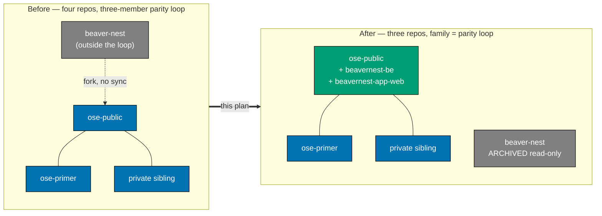
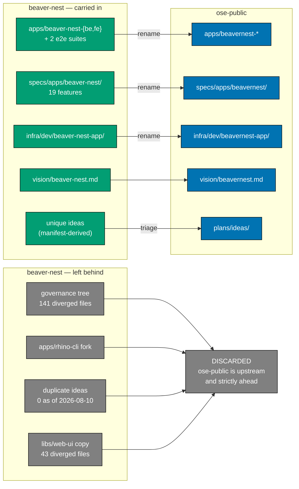
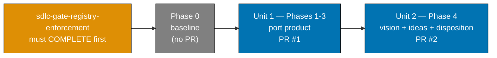
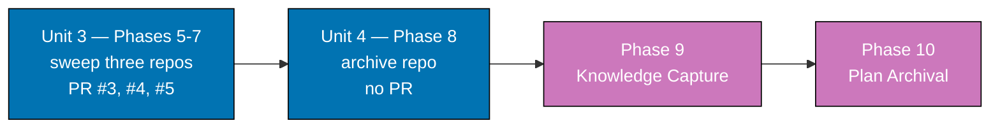
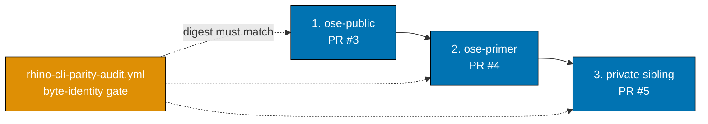

# Technical Documentation: BeaverNest Repository Consolidation

## Architecture Overview

### Diagram 1 — Repository topology, before and after



### Diagram 2 — What crosses the boundary, and what does not



### Diagram 3 — Delivery-unit dependency DAG

The spine is strictly serial — every stage reads what the previous stage wrote. Split into two
blocks so each stays within the four-node width budget the
[Diagrams Convention](../../../repo-governance/conventions/formatting/diagrams.md) sets for mobile
rendering.



Continuing from Unit 2:



### Diagram 4 — Why the `rhino-cli` sweep serializes

The one-line change in `src/application/parity.rs` (dropping `", and beaver-nest"`) and the
regenerated `parity-manifest.sha256` must land in all three repos with an identical digest, so the
three sweep PRs are ordered rather than parallel.



## Design Decisions

| ID  | Decision                                                                                                                                                                                                                                                                                                                                                                                                                                                                | Rationale                                                                                                                                                                                                                                                                                                                                                                                                                                                                                                                                                                                                                                                                                                                                                                                                                                                                                                                                                                                                                                                                                                                                                                                        |
| --- | ----------------------------------------------------------------------------------------------------------------------------------------------------------------------------------------------------------------------------------------------------------------------------------------------------------------------------------------------------------------------------------------------------------------------------------------------------------------------- | ------------------------------------------------------------------------------------------------------------------------------------------------------------------------------------------------------------------------------------------------------------------------------------------------------------------------------------------------------------------------------------------------------------------------------------------------------------------------------------------------------------------------------------------------------------------------------------------------------------------------------------------------------------------------------------------------------------------------------------------------------------------------------------------------------------------------------------------------------------------------------------------------------------------------------------------------------------------------------------------------------------------------------------------------------------------------------------------------------------------------------------------------------------------------------------------------ |
| D1  | Selective file port; no git-history merge, no `git subtree`, no `nx import`.                                                                                                                                                                                                                                                                                                                                                                                            | The repos diverged cleanly at `32ec0270f` (2026-07-30) with 317 / 137 commits since (re-measured 2026-08-10; supersedes an earlier inconsistent "252/127" figure) [Repo-grounded]. A history merge imports ~5,340 commits of mostly-renamed scaffolding to preserve blame on ~1,300 lines of inert product code. `nx import` would preserve filtered history but still leaves _"dependency conflicts"_ and _"code outside the source project's root folder"_ as manual work [Web-cited, Nx docs, accessed 2026-08-06].                                                                                                                                                                                                                                                                                                                                                                                                                                                                                                                                                                                                                                                                           |
| D2  | Discard `beaver-nest`'s governance tree, `rhino-cli` fork, `libs/web-ui` copy, and its idea two-pagers (35 duplicates at the 2026-08-06 baseline, 0 as of 2026-08-10 — see Rationale).                                                                                                                                                                                                                                                                                  | `ose-public` is upstream and strictly ahead on each: roughly 50-58 post-fork `rhino-cli` commits vs 8 (re-measured 2026-08-10, up from 46/8; the exact count is `--no-merges`-sensitive, so this is a range, not a point figure), and the idea-duplicate overlap this decision originally cited has since resolved itself via cross-repo grooming (43/35 duplicates at 2026-08-06 → 8/0 at 2026-08-10 — see README.md finding 2). Every observed genuine rule divergence still has `beaver-nest` behind [Repo-grounded]. **Exception carved out in D8.**                                                                                                                                                                                                                                                                                                                                                                                                                                                                                                                                                                                                                                         |
| D3  | Single-token domain `beavernest`; apps become `beavernest-be`, `beavernest-app-web`, `beavernest-be-e2e`, `beavernest-app-web-e2e`.                                                                                                                                                                                                                                                                                                                                     | `fe` is not in [`file-naming.md`](../../../repo-governance/conventions/structure/file-naming.md)'s type table (`www`/`app-web`/`be`/`cli`/`e2e`). Single-token matches `ayokoding`, `organiclever`, `wahidyankf`.                                                                                                                                                                                                                                                                                                                                                                                                                                                                                                                                                                                                                                                                                                                                                                                                                                                                                                                                                                                |
| D4  | Archive the GitHub repo; do not delete or rename it.                                                                                                                                                                                                                                                                                                                                                                                                                    | Archiving is reversible and keeps the repo cloneable, browsable, forkable, and starrable at the same URL [Web-cited, GitHub Docs, accessed 2026-08-06]. Deleting breaks links in `plans/done/**` and published LinkedIn posts.                                                                                                                                                                                                                                                                                                                                                                                                                                                                                                                                                                                                                                                                                                                                                                                                                                                                                                                                                                   |
| D5  | Hard `blockedBy` on `sdlc-gate-registry-enforcement`; no partial unblock.                                                                                                                                                                                                                                                                                                                                                                                               | That plan's File-Impact tree edits **every** sweep target — `related-repositories.md`, `sdlc-gate-standard.md`, `AGENTS.md`, `repo-config.yml`, all three `workflows/plan/*` files, and `apps/rhino-cli/**` — and it is scoped to all four repos, so it needs `beaver-nest` writable. Chosen after explicitly weighing a rescope-to-three and a partial-unblock alternative.                                                                                                                                                                                                                                                                                                                                                                                                                                                                                                                                                                                                                                                                                                                                                                                                                     |
| D6  | The ported frontend consumes **`ose-public`'s** `libs/web-ui`, not `beaver-nest`'s.                                                                                                                                                                                                                                                                                                                                                                                     | The two copies differ across 43 files (re-verified 2026-08-10, unchanged), including a `@storybook/nextjs-vite` → `@storybook/react-vite` swap that is mutually exclusive per workspace [Repo-grounded]. `ose-public` still hosts Next.js apps, so its framework choice wins; the app absorbs the difference.                                                                                                                                                                                                                                                                                                                                                                                                                                                                                                                                                                                                                                                                                                                                                                                                                                                                                    |
| D7  | Do **not** port `ROADMAP.md`, `main-ci.yml`, `deps-audit.yml`, or `beaver-nest.sln`.                                                                                                                                                                                                                                                                                                                                                                                    | `ROADMAP.md` vs `roadmap.md` is a case-only collision, hazardous on this repo's case-insensitive macOS filesystem, and its content is stale (still claims a retired `hello` API). `main-ci.yml` is self-declared deprecated in `beaver-nest`'s own `AGENTS.md`, and `sdlc-gate-registry-enforcement` deletes it. `deps-audit.yml` is `ose-public`'s `dependency-vulnerability-audit.yml` under an older name. `beaver-nest.sln`'s three F# projects merge into `open-sharia-enterprise.sln` instead.                                                                                                                                                                                                                                                                                                                                                                                                                                                                                                                                                                                                                                                                                             |
| D8  | Harvest — not silently drop — the two genuinely _forward_ patches in `beaver-nest`'s `rhino-cli` fork.                                                                                                                                                                                                                                                                                                                                                                  | D2 discards the fork, but the survey found two changes where `beaver-nest` is ahead, not behind: the wider git-env scrub in `src/infrastructure/git/root.rs` (also scrubs `GIT_INDEX_FILE`, `GIT_OBJECT_DIRECTORY`, `GIT_COMMON_DIR`) and the `ROADMAP.md`/`SECURITY.md` kebab-case exemptions in `src/application/docs/naming.rs`. Each is filed as a `plans/ideas/` brief **only if it survives an Integrate-Before-You-Add scan at execution time** — the naming-exemption patch in particular is already partly upstreamed by the blocking plan's own Step 3 and is already targeted by the existing brief `contributing-md-trunk-guidance-and-naming-exemption.md` in [`plans/ideas/`](../../ideas/README.md) (located by name, not path — the `plans/ideas/` tree is being reorganized into quadrant subfolders), so by the time this plan runs it may be stale, a duplicate, or both. The other two divergences (hardcoded Amazon Q agent name, hardcoded frontmatter-audit exclusions) are simplifications that would regress `ose-public` and are correctly dropped.                                                                                                                    |
| D9  | Record and triage `beaver-nest`'s uncommitted working-tree modifications before reading from it — never port or commit them — whatever their count is at execution time.                                                                                                                                                                                                                                                                                                | The survey found `beaver-nest` dirty on 2026-08-06 across 5 agent/skill files, 5 governance/workflow files, and `package-lock.json` (11 files at survey time); re-verified 2026-08-10, the tree is now **clean** (0 uncommitted files) [Repo-grounded]. All are governance files this plan discards, so the safe handling is to verify they are discardable — not to port them — but Phase 0 must record the live tree state (`evidence/phase-0-beaver-nest-status.txt`) so nothing is read from an unreviewed dirty file; the plan never hardcodes the file count since the working tree is expected to drift before execution begins.                                                                                                                                                                                                                                                                                                                                                                                                                                                                                                                                                          |
| D10 | `app-web` is accepted for the SPA despite there being no `app.*` subdomain.                                                                                                                                                                                                                                                                                                                                                                                             | The SPA is co-served by `beavernest-be` on one origin (port 19300). No tier suffix fits a co-served SPA better, and inventing one for a single app costs more than the imprecision. Recorded as a known naming caveat, not a defect.                                                                                                                                                                                                                                                                                                                                                                                                                                                                                                                                                                                                                                                                                                                                                                                                                                                                                                                                                             |
| D11 | **Superseded** — the plan folder's `git mv` to `plans/done/` (Phases 9-10) lands inside a new, dedicated final `ose-public` PR, **not** a direct push under the Plan-Docs-Only Carve-Out and **not** committed inside the last product PR (Phase 5, PR #3).                                                                                                                                                                                                             | Archival-in-PR assumes the delivering PR **is** the plan's completion boundary. Here it is not: Phase 5's PR closes only the `ose-public` sweep, and Phases 6-8 still have to land — in `ose-primer`, in the private sibling, and against `beaver-nest` on GitHub — none of which are `ose-public` PRs. No `ose-public` PR remains open at the point the plan is actually done, so there is no PR left to carry the archival commit into. That diagnosis still holds; what changed is the resolution. Originally resolved via the Plan-Docs-Only Carve-Out (a direct push), that carve-out is retired in `ose-public` per [Per-Repository Delivery Mode Restrictions](../../../repo-governance/conventions/structure/plans/per-repository-delivery-mode-restrictions.md#per-repository-delivery-mode-restrictions-hard-rule) — `main` is branch-protected there, so a direct push is not merely deprecated but unavailable. The resolution is now to open one more PR (Phases 9-10's own delivery unit) rather than to push directly; see `delivery.md`'s Phase 9/10 sections and `### Delivery Boundaries` table.                                                                               |
| D12 | **Restructured 2026-08-10** — Phases 1-5 collapse into a single `ose-public` PR (Unit 1, opened at Phase 5), instead of three separate PRs at Phases 3, 4, and 5. `ose-public`'s total PR count for this plan is **2**, not 1: Unit 1 (Phases 1-5) plus the sweep unit (Phase 8's `ose-public` boundary, per the existing Phase 5→6→7 serialization).                                                                                                                   | User-directed: minimize worktree/PR churn for speed. A literal "1 PR per repo across the whole plan" was evaluated and rejected — it collides with the byte-identity merge-before-sync dependency: `ose-primer`/the private sibling sync `apps/rhino-cli/src/application/parity.rs` and `parity-manifest.sha256` byte-identically from `ose-public`'s **merged** `main`, so the `ose-public` sweep (old Phase 5) must merge before the primer/private sweeps (Phases 6-7) begin — those two are already separate downstream PRs by necessity, not by choice. Collapsing only the earlier, purely-additive Phases 1-5 (product port, narrative, sweep — none of which gate a downstream repo) into one PR is safe because nothing outside `ose-public` depends on an intermediate merge between them; Phase 8 (retiring `beaver-nest` on GitHub) still cannot fold into Unit 1 because it depends on Phases 6-7 (primer/private) landing first. Phases 3 and 4 are redesignated non-boundary (push-only, same branch/worktree, no PR/CI/merge) and their gate checks are absorbed into Phase 5's now-expanded Gate. See `delivery.md`'s `### Delivery Boundaries` table and Phase 3/4/5 headings. |
| D13 | **Plan-local deviation 2026-08-10** — the PR-Review Maker→Fixer Cycle for every PR in this plan runs up to **N=7** sequential CI-gated cycles instead of the documented hard ceiling of 3, and **early-exits** once a cycle's consolidated findings contain 0 CRITICAL, 0 HIGH, and 0 MEDIUM — both deviating from [`pr-review-quality-gate.md`](../../../repo-governance/workflows/pr/pr-review-quality-gate.md)'s documented "no early exit, no extension" hard rule. | User-directed, explicitly weighed against the documented anti-gaming rationale before acceptance. The documented rule exists because an earlier "escape valve" allowing cycle-count extension was deliberately removed, and this very plan's predecessor PR (#163, merged 2026-08-10) surfaced a concrete counterexample at cycle 3 — findings can still be live at the fixed ceiling. Raising N to 7 gives more headroom to actually reach a clean cycle rather than stopping at an arbitrary 3; early-exiting at 0 CRITICAL/HIGH/MEDIUM (LOW findings may remain open) avoids burning all 7 cycles once the PR is materially clean. This is recorded as a **plan-local exception**, not a change to the global workflow doc — `pr-review-quality-gate.md` itself is untouched by this plan. Accepted risk: a future cycle could in principle regress after an early exit if a later push reintroduces a MEDIUM+ finding outside the reviewed cycle; mitigated by CI still gating every push and by the fixer replying to every thread before any exit.                                                                                                                                         |

## File-Impact Analysis

Paths are root-relative. `[N]` new, `[E]` edit, `[D]` delete, `[G]` generated, `[N?]` conditionally
new — created only if the Integrate-Before-You-Add scan in Phase 4 returns the "file" verdict. The
`plans/ideas/` paths below are shown flat, but that tree is being reorganized into Eisenhower
quadrant subfolders; briefs are addressed by **name** at execution time, and each new brief lands in
the quadrant its priority warrants. The
`apps/beavernest-*` and `specs/apps/beavernest/` families are bounded: their exact members are the
179 `beaver-nest`-only tracked paths, enumerated with
`git -C ../beaver-nest ls-files apps/beaver-nest-be apps/beaver-nest-fe apps/beaver-nest-be-e2e apps/beaver-nest-fe-e2e specs/apps/beaver-nest infra/dev/beaver-nest-app`
during Phase 0 and recorded in the file-touch ledger before any copy.

```text
.
├── apps/
│   ├── beavernest-be/** [N] — 58 files ported from apps/beaver-nest-be, F# namespaces renamed
│   ├── beavernest-app-web/** [N] — 31 files ported from apps/beaver-nest-fe (Vite/React)
│   ├── beavernest-app-web/next-env.d.ts [D] — stale artifact of the abandoned Next.js migration
│   ├── beavernest-be-e2e/** [N] — 17 files
│   ├── beavernest-app-web-e2e/** [N] — 12 files
│   ├── beavernest-be/README.md [E] — drop the nonexistent `specs:coverage` target claim
│   └── README.md [E] — add the two new apps to the inventory table
├── libs/
│   └── web-ui-token/src/beavernest.css [N] — brand token sheet the app imports
├── specs/apps/beavernest/** [N] — 35 files: 19 features, openapi.yaml, C4 scaffold, contracts project.json
├── infra/dev/beavernest-app/** [N] — 26 files: compose, 4 scripts, 16-file shell test harness
├── .github/workflows/
│   ├── beavernest-app-test-local-deploy-stag.yml [N] — renamed staging caller
│   └── README.md [E] — index the new caller
├── open-sharia-enterprise.sln [E] — add the three BeaverNestBe F# projects
├── repo-config.yml [E] — coverage projects, specs config, env-contract surfaces for the two apps
├── package.json [E] — add the `beavernest:dev` script
├── repo-governance/vision/
│   ├── beavernest.md [N] — child product vision, ported and renamed
│   └── README.md [E] — register the child vision alongside the parent
├── plans/
│   ├── ideas/beavernest-first-deploy.md [N] — product brief; see More Detail for triage
│   ├── ideas/beavernest-first-llm-integration.md [N]
│   ├── ideas/beavernest-persistence-layer.md [N]
│   ├── ideas/beavernest-be-nullbyte-path-error-envelope.md [N]
│   ├── ideas/<generic-governance-briefs> [N?] — UNBOUNDED, re-derived in Phase 0; see note below
│   ├── ideas/rhino-cli-git-env-scrub-widening.md [N?] — D8 harvest, only if the scan says "file"
│   ├── ideas/rhino-cli-uppercase-root-file-naming-exemption.md [N?] — D8 harvest, likely stale/duplicate
│   ├── ideas/README.md [E] — index every added brief
│   ├── done/2026-XX-XX__beavernest-app-setup/** [N] — carried, closed delivered-as-descoped
│   ├── done/README.md [E] — index the carried plan
│   └── backlog/README.md [E] — remove this plan's entry on promotion
├── .claude/agents/
│   ├── apps-beavernest-be-deployer.md [N]
│   ├── apps-beavernest-app-web-deployer.md [N]
│   ├── social-linkedin-post-maker.md [E] — four repos to three
│   └── README.md [E] — catalog the two new deployers
├── .opencode/agents/** [G] — regenerated by `npm run generate:bindings`
├── .cursor/agents/** [G] — regenerated
├── .amazonq/** [G] — regenerated
├── AGENTS.md [E] — Related Repositories: four to three; Web Sites table gains two rows
├── README.md [E] — sibling-repository list: four to three
├── docs/reference/
│   ├── related-repositories.md [E] — remove the fourth member and the "all four" terminology block
│   ├── README.md [E] — index line names three repos
│   ├── sdlc-gate-standard.md [E] — byte-identity boundary stated as three, resolving the contradiction
│   ├── monorepo-structure.md [E] — add the two apps
│   └── system-architecture/applications.md [E] — add the two apps
├── repo-governance/
│   ├── development/practice/file-touch-discipline.md [E] — drop beaver-nest from the repo list
│   └── workflows/plan/
│       ├── multi-plans-execution.md [E] — three-repo byte-identity examples
│       ├── plan-multi-repo-parity-planning.md [E] — default input value drops beaver-nest
│       └── plan-multi-repo-parity-planning-and-execution.md [E] — same, plus the downstream-node prose
└── apps/rhino-cli/
    ├── src/application/parity.rs [E] — two four-repo strings become three
    ├── tests/gate_specs.rs [E] — matching assertion
    └── parity-manifest.sha256 [G] — regenerated by `rhino-cli parity manifest generate`
```

The same `docs/reference/`, `repo-governance/`, `AGENTS.md`, `README.md`, `.claude/`, and
`apps/rhino-cli/` edits above are applied again, per-repo, in `ose-primer` and the private sibling during
Phases 6 and 7 — adapted to each repo's actual footprint, since a file this repo has may be absent
or differently-worded there. The exact per-repo target list is discovered with
`grep -rln 'beaver-nest' AGENTS.md README.md docs repo-governance .claude apps/rhino-cli` at the
start of each of those phases and recorded in that phase's ledger.

### More Detail

**The generic-brief set is unbounded and must be re-derived, not read off this plan.** The
2026-08-06 baseline measured 43 total `beaver-nest` briefs with 35 name-duplicates and 8
`beaver-nest`-unique (4 product-specific, 4 generic governance). Re-verified 2026-08-10: the drift
this section already anticipated has happened — `beaver-nest` now carries only 8 total briefs, all 8
name-unique, 0 duplicates. The 4 product briefs are the same names as the baseline
(`beaver-nest-be-nullbyte-path-error-envelope`, `beaver-nest-first-deploy`,
`beaver-nest-first-llm-integration`, `beaver-nest-persistence-layer`); the 4 generic ones
(`orphaned-harness-binding-artifacts`, `unvalidated-cross-repo-citations`,
`vitest-include-glob-silent-false-pass`, `web-ui-reuse-existing-server-residual`) are **not** the
same 4 the 2026-08-06 baseline would have named — the grooming commit cited below replaced them, as
predicted. The **4 product briefs remain the stable half**: they describe BeaverNest itself and exist
nowhere else. The **4 generic ones remain volatile** — both repos' `plans/ideas/` trees are still
under active cross-repo grooming (`beaver-nest` commit `4e9076c61`, "groom plans/ideas into
Eisenhower quadrants across all four repos", is the grooming pass that produced the 2026-08-10 set
above), so the set may differ again by execution time. Phase 0 therefore still freezes a fresh
unique-brief manifest with `comm -13` over the two sorted basename listings, exactly as it freezes
the product source manifest, and Phase 4 triages **that** manifest. Do not treat the number 8, the
0-duplicate count, or any brief name in this document as an execution input — re-derive at Phase 0
regardless of how current this section reads today.

**Idea triage is not a blind copy.** Each brief on the frozen manifest is checked against
`plans/ideas/README.md` and the existing briefs under Integrate-Before-You-Add. Where an existing
brief covers the same underlying problem, the incoming thought is folded into it and no new file is
created — so the tree above lists a maximum set, not a guaranteed file count.

**The four product briefs are renamed** from `beaver-nest-*` to `beavernest-*` to match D3's domain
token, keeping brief names aligned with the app names they describe.

**The `beaver-nest-app-setup` disposition.** That plan is 72.5% complete (279/385 checkboxes) with a
documented, unsatisfiable Unit 3 — Phases 4-6 reached `main` by direct push, so no PR #3 exists, the
review cycles never ran, and the branch and worktrees are gone. It is carried into
`plans/done/` and closed **delivered-as-descoped**, with a dated note naming what shipped
(governance rules, SQLite + readiness backend, the Vite CSR migration) and what did not (Phase 6
runtime attestation, Phase 7 knowledge capture, Phase 8 archival). Its remaining substantive work is
already represented by the four carried product briefs, so nothing is lost by closing it.

**Sweep discovery is grep-driven, per repo, not copied from this tree.** `ose-primer` and
the private sibling have different footprints; the file list above is `ose-public`'s. Each sweep phase
enumerates its own targets first, so a file that does not exist in a given repo is a non-event
rather than a failed edit.

## Dependencies

- **Hard plan dependency**: `blockedBy`
  [`plans/done/2026-08-07__sdlc-gate-registry-enforcement`](../../done/2026-08-07__sdlc-gate-registry-enforcement/README.md).
  See D5.
- **Toolchain**: .NET 10 SDK and F# tooling for `beavernest-be`; Node 24.13.1 / npm 11.10.1 via
  Volta; Docker/Compose for the `infra/dev/beavernest-app/` stack; `gh` CLI for the archive step.
  Note `beaver-nest`'s root `package.json` pins Volta to node 24.16.0 / npm 11.11.0 — **`ose-public`'s
  pin wins**; the ported apps must build under it.
- **Dependency drift to absorb**: `beaver-nest` is ahead on several root and lib dependencies
  (`nx` 22.7.8 vs 22.5.4, Storybook 10.5.5 vs 10.2.10, `markdownlint-cli2` 0.23.2 vs 0.21.0). None
  is bumped by this plan — the ported apps adopt `ose-public`'s versions, and any genuine
  incompatibility is fixed in the app or filed under the existing
  [`post-cutoff-dependency-migrations`](../../ideas/q2-not-urgent-important/post-cutoff-dependency-migrations.md) brief.
- **Preserve from `ose-public`**: the `.vercel/` rule in `.gitignore`, which `beaver-nest` dropped.
  Nothing from `beaver-nest`'s `.gitignore` or `.prettierignore` is imported.

## Testing / Verification Strategy

| Layer               | How it is verified                                                                                                                                                                                                                                                                                                                               |
| ------------------- | ------------------------------------------------------------------------------------------------------------------------------------------------------------------------------------------------------------------------------------------------------------------------------------------------------------------------------------------------ |
| Ported unit tests   | `nx run beavernest-be:test:unit` (51 xUnit facts/theories) and `nx run beavernest-app-web:test:unit` (9 Vitest cases) pass unchanged.                                                                                                                                                                                                            |
| Coverage            | `nx run beavernest-be:test:coverage` holds the ported 90% line threshold.                                                                                                                                                                                                                                                                        |
| Specs coverage      | `nx run-many -t specs:coverage -p beavernest-be,beavernest-app-web` counts the 19 ported features rather than skipping them.                                                                                                                                                                                                                     |
| E2E                 | `nx run beavernest-be-e2e:test:e2e` and `nx run beavernest-app-web-e2e:test:e2e` against the compose stack.                                                                                                                                                                                                                                      |
| Runtime (API)       | `curl http://127.0.0.1:19300/api/v1/readiness` returns 200 with `"status":"ready"` — evidence inlined in `delivery.md`.                                                                                                                                                                                                                          |
| Manual UI (visual)  | Playwright MCP against the running `beavernest-app-web` — DOM snapshot, zero console errors, and mobile/tablet/desktop screenshots saved to `evidence/` (see `delivery.md` Phase 3). Guards against a mounting-but-visually-broken tree from the [D6](#design-decisions) `libs/web-ui` version gap, which unit and E2E tests alone cannot catch. |
| Rename completeness | `grep -rn 'beaver-nest-fe' apps libs specs infra .github .claude repo-config.yml` returns zero matches.                                                                                                                                                                                                                                          |
| Sweep completeness  | Per repo, `grep -rn 'beaver-nest' AGENTS.md README.md docs repo-governance .claude apps/rhino-cli` returns only `plans/done/**` hits or explicitly-marked historical references.                                                                                                                                                                 |
| Byte-identity       | `rhino-cli parity manifest validate` exits 0 in all three repos with a matching digest; `rhino-cli-parity-audit.yml` green.                                                                                                                                                                                                                      |
| Archive             | `gh repo view wahidyankf/beaver-nest --json isArchived` reports `true`.                                                                                                                                                                                                                                                                          |

**Rule-15 and Rule-16 applicability.** The three-tester UI retest (EWT/UWT/DWT) and the API
exploratory retest (AET) are **not triggered** by this plan: it changes no screen, no endpoint, and
no behaviour. The ported app renders and serves exactly what it did before the move. That
no-feature-change exemption covers the retest triad only — it does not exempt the plan from the
baseline [Manual Behavioral Verification](../../../repo-governance/development/quality/manual-behavioral-verification.md)
requirement, which has no "no-behavior-change" carve-out. The Manual UI row above satisfies that
baseline requirement.

## Rollback

Each delivery unit rolls back independently, and every step before Phase 8 is fully reversible.

| Unit                  | Rollback                                                                                                                                                                                                               |
| --------------------- | ---------------------------------------------------------------------------------------------------------------------------------------------------------------------------------------------------------------------- |
| Unit 1 (port)         | Revert PR #1. The new paths are all `[N]`; nothing existing is deleted, so the revert is clean. `beaver-nest` is untouched and still live.                                                                             |
| Unit 2 (narrative)    | Revert PR #2. Same property — additive files plus index edits.                                                                                                                                                         |
| Unit 3a/3b/3c (sweep) | Revert the per-repo PR. If only some of the three landed, the `rhino-cli` byte-identity gate goes red and names the mismatch, which is the intended detector — resolve by completing or reverting the remaining repos. |
| Unit 4 (archive)      | `gh repo unarchive wahidyankf/beaver-nest` restores write access. GitHub documents archiving as reversible [Web-cited, accessed 2026-08-06].                                                                           |

**Point of no easy return**: none. Even after Phase 8, the archived repository retains full history
and can be unarchived. The only genuinely lossy element is per-file `git blame` continuity for the
ported product inside `ose-public` — accepted knowingly under D1, and mitigated by the archived
repository remaining the readable record of that history.

## Related Documentation

- [README.md](./README.md) — context, scope, resolved design decisions
- [brd.md](./brd.md) — business rationale, baseline, prior art
- [prd.md](./prd.md) — user stories and Gherkin acceptance criteria
- [delivery.md](./delivery.md) — phased delivery checklist
- [File Naming Convention](../../../repo-governance/conventions/structure/file-naming.md)
- [Related Repositories](../../../docs/reference/related-repositories.md)
- [SDLC Gate Standard](../../../docs/reference/sdlc-gate-standard.md)
- [Multi-Plans Execution workflow](../../../repo-governance/workflows/plan/multi-plans-execution.md)
- [Accessible Diagrams skill](../../../.claude/skills/docs-creating-accessible-diagrams/SKILL.md)
