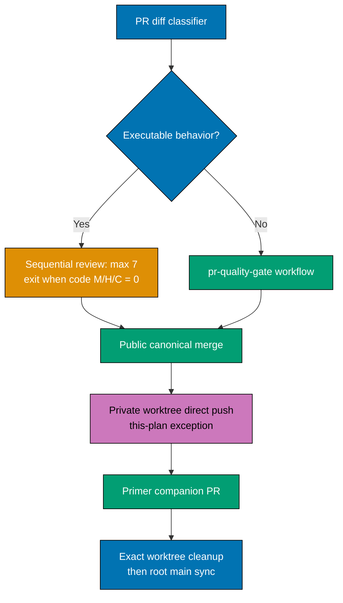

# Technical Design: PR Review Rule Convergence

## Architecture



## Implementation Approach

The PR-review scout becomes the sole classifier. It records the head SHA, changed paths, the
behavioral reason for every eligible path, and the chosen route before any specialist is invoked.
Uncertainty fails safe into the eligible route. The plan updates every duplicate policy statement to
refer to this workflow as the single algorithm owner.

For eligible PRs, cycles are strictly sequential and cap at seven. Each completed cycle evaluates
unresolved findings whose subject is executable behavior or code affected by the diff. Low findings
receive a reasoned disposition and a deduplicated idea entry. Starting at cycle six, the orchestrator
adds sanitized convergence evidence to the owning plan's `learnings.md` and a deduplicated idea when
the PR belongs to a plan; ad-hoc work creates or updates the appropriate idea directly. A clean code
M/H/C evaluation exits early. Every still-open PR is reclassified under this policy at its next review
or merge action; no legacy route is retained.

## Design Decisions

- The behavior-based classifier, rather than a path allowlist, keeps newly introduced executable
  configuration in scope without waiting for rule maintenance.
- Seven cycles are a hard ceiling for review activity, not permission to merge unresolved code M/H/C
  findings.
- Low findings become deduplicated ideas because they are non-blocking but still useful maintenance
  signals.
- The direct OSE-private push is a user-authorized, plan-local delivery exception. It is deliberately
  absent from the canonical policy propagation set.

The retrofit pass treats every live plan as a consumer of the canonical workflow. A deterministic
reference inventory identifies candidates in `plans/backlog/` and `plans/in-progress/`; each matching
plan receives a semantic review, not a blind textual substitution. It updates only future-facing
requirements, delivery steps, and merge instructions. Completed plans and append-only execution
records retain historical facts, but an active plan's remaining unchecked steps must use the new rule.

For non-eligible PRs, the specialist loop and surface tester gates are skipped. The orchestrator
verifies the current-head run of the `pr-quality-gate` workflow defined at
`.github/workflows/pr-quality-gate.yml`, then merges. Secret scanning and incident response remain
universal and are never classified away.

Every PR route uses the CI-monitoring contention rule. A queued or apparently stalled run first
triggers a cross-repository runner-contention check, then cadence-based polling and root-cause
investigation. It is not evidence that the current goal should be cancelled. The policy will extend
the CI-monitoring workflow and every applicable agent-facing entry point in OSE-public, OSE-private,
and OSE Primer without weakening the required-check gate.

The OSE-private companion in this specific plan is the sole delivery exception: the user has
authorized a worktree-based commit and direct push to `origin/main`, with no private PR or
PR-quality wait. The executor still verifies the intended post-public base, secret-safety status, and
public/private byte-identity manifest. The exception is written in this plan rather than in canonical
governance so it expires with this plan and cannot alter other work.

The concurrently active OSE-private PR-quality remediation is foreign work. This plan neither reads
its uncommitted state nor waits for its checks; it provisions a separate, exact private worktree from
`origin/main`. If foreign commits reach `origin/main` before this plan pushes, the plan follows the
integration-diff-review rule before continuing.

Every task in this plan has an AI-executable command path. No phase uses a `[HUMAN]` review, approval,
or manual-check gate; provider operations that would normally need human involvement are either
automated through the available repository/hosting interfaces or explicitly outside this plan's
delivery scope.

After a repository's final delivery unit has landed, cleanup is a direct terminal operation. The
executor resolves the explicit plan worktree path, verifies that every delivery unit is complete and
the worktree has no uncommitted or unpushed plan state, then runs `git worktree remove <exact-path>`.
It never uses a broad path, glob, repository root, or `rm` command. The root checkout is excluded so
the final `git fetch origin` and fast-forward to `origin/main` can still run.

## Secret-Incident Algorithm

1. Stop further distribution; revoke or rotate the credential through its owning service without
   putting its value in tracked files, terminal output, comments, or evidence.
2. Identify every reachable affected branch, tag, pull-request branch/ref, and hosting artifact using
   a sanitized incident record.
3. Rewrite all affected reachable refs, delete contaminated branches/tags where appropriate, and force
   update the rewritten refs under the user's standing authorization.
4. Close the contaminated PR, create a clean branch from sanitized history, and open a replacement PR.
5. Request hosting-provider cache and object purge support; document only request/result status and
   the limitation that external clones/forks cannot be erased.

No secret value, matching substring, raw diff, private path, or service-specific credential detail is
committed during any step.

## Cross-Repository Propagation

`ose-public` is the canonical content source. Before its PR merges, prepare the corresponding
the private sibling change and record a portable-file manifest of paths and byte hashes without private
facts. Every manifest file is byte-identical in public and private; private-only operational files are
explicitly excluded rather than silently allowed to drift. After the public merge, commit and push the
private worktree directly to `origin/main` under this plan's user-authorized exception; record the
temporary skew and closure.

This plan also delivers an OSE Primer companion after public/private reconciliation. Its governed
portable files must implement the same routing, convergence, and secret-response semantics; a separate
manifest names any documented Primer-specific wording or path exceptions. It receives the same
live-plan retrofit inventory so a future Primer plan cannot retain the retired fixed-cycle rule.

## File-Impact Analysis

```text
.
├── AGENTS.md [E] — make plan-independent routing and merge rules discoverable to every agent
├── repo-governance/
│   ├── development/workflow/pr-merge-protocol.md [E] — replace universal cycle precondition
│   ├── workflows/pr/pr-review-quality-gate.md [E] — own classifier, bounded loop, exits, learnings
│   ├── development/quality/pr-review-disciplines.md [E] — align specialist scope and severity use
│   ├── development/workflow/git-push-safety.md [E] — reference incident rewrite authorization safely
│   ├── development/workflow/ci-monitoring.md [E] — make patient contention investigation explicit
│   ├── development/workflow/worktree-and-artifact-cleanup.md [E] — require direct exact-path cleanup
│   ├── conventions/structure/plans.md [E] — apply routing to planned and ad-hoc execution rules
│   └── workflows/plan/plan-execution.md [E] — remove plan worktrees after final repository delivery
├── docs/reference/related-repositories.md [E] — state public-first private governance reconciliation
├── .claude/agents/repo-rules-maker.md [E] — require manual canonical propagation and generated sync
├── .opencode/agents/repo-rules-maker.md [G] — generated binding
├── .cursor/agents/repo-rules-maker.md [G] — generated binding when emitted by the harness
├── .amazonq/agents/repo-rules-maker.md [G] — generated binding when emitted by the harness
├── plans/
│   ├── in-progress/pr-review-rule-convergence/ [E] — this control plan and sanitized learnings
│   ├── in-progress/repository-onboarding-readme-refresh/ [E] — amend only remaining forward delivery
│   │   steps that encode the retired review rule
│   ├── backlog/ayokoding-learning-path-{06..18}-*/ [E] — retrofit every matching future plan document
│   ├── ideas/README.md [E] — index any new Low-finding or non-convergence idea
│   └── ideas/<deduplicated-topic>.md [N] — only when no existing two-pager owns the learning
├── <private-sibling> manifest-matched canonical paths [E] — byte-identical real-time governance delivery
│   in its own repo
└── ose-primer applicable canonical paths and live plans [E] — companion policy delivery and retrofit
    in its own repo
```

The execution discovery step may adjust this tree only after an exact reference search proves another
canonical duplicate exists. Generated surfaces are never edited manually.

## Dependencies

- Git and GitHub CLI access for branches, PRs, workflow state, and exact worktree inspection.
- The repository's existing `pr-quality-gate.yml`, `rhino-cli` gate registry, and binding generator.
- Authorized local access to the OSE-private and OSE Primer repositories; their concurrent working
  trees remain out of scope unless this plan explicitly creates its own worktree.

## Testing Strategy

- Use a documented path matrix containing executable, non-executable, ambiguous, and mixed-diff cases
  to exercise the classifier's selected route.
- Validate documentation and generated bindings with the exact registry commands recorded in
  `delivery.md`.
- Verify PR routes from GitHub's current head status; for the one-plan private direct push, verify the
  post-push revision and manifest instead of a PR workflow.

## Rollback

Policy changes are Markdown and generated binding changes. Before each public/Primer merge, a failed
delivery is rolled back by a follow-up corrective PR that restores the last known-good canonical text
and regenerates bindings. The user-authorized private direct push is corrected by a new forward commit
on `origin/main`; never rewrite history unless a confirmed secret incident invokes the separately
defined secret-remediation algorithm.

## Verification Strategy

- Use path-matrix fixtures or a deterministic classifier test if an existing test harness supports it;
  otherwise use checked-in documented examples and an audited dry-run command.
- Run `npm run generate:bindings` followed by `npm run validate:sync` after canonical agent edits.
- Verify Markdown structure, links, and Mermaid diagrams using the registry-selected commands.
- Open a draft PR and confirm the named workflow is green on the final head SHA before merge.
- Compare the public/private governed-path manifest before and after the private companion merge.
- Validate the OSE Primer applicable-policy manifest and its own live-plan retrofit before its PR merges.
- Simulate or inspect a queued CI state and verify that the documented response preserves the active
  goal and uses the contention-monitoring cadence.
- Verify each worktree path against `git worktree list` immediately before the direct removal command;
  confirm the repository root is not a cleanup target.
- Re-run the live-plan reference inventory and manually inspect every remaining match; only historical
  execution evidence may retain a description of the retired behavior.
