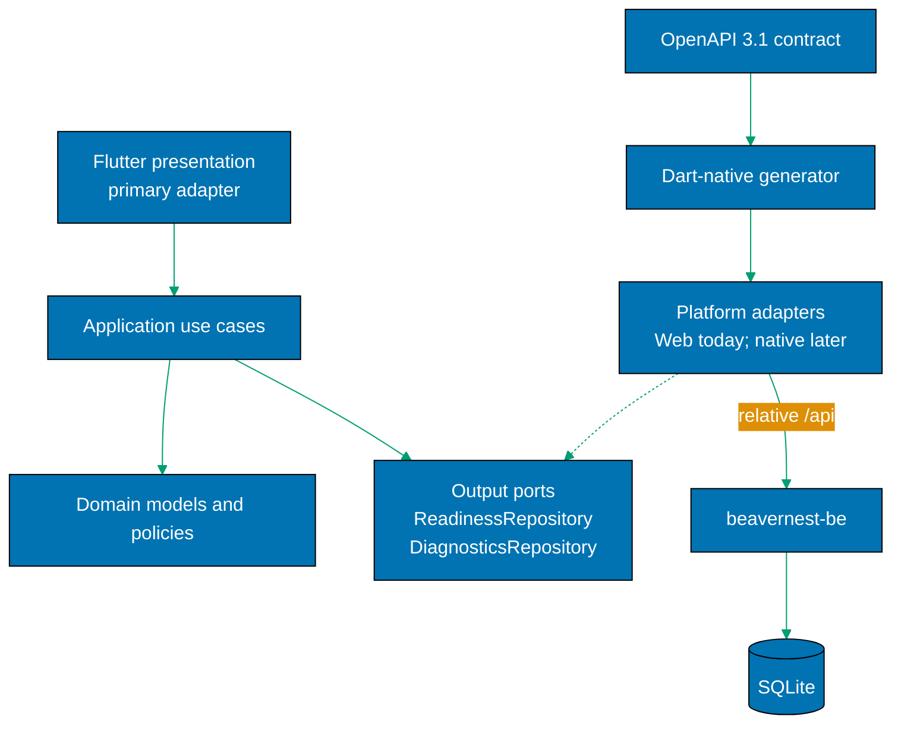
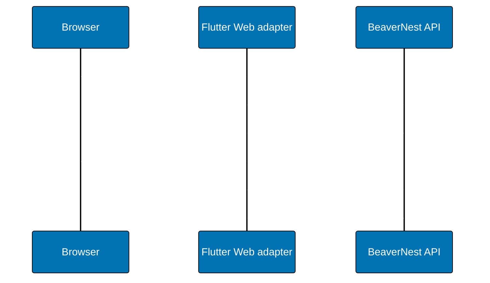

# Technical Design — BeaverNest Flutter Web Client

## Architecture





## Lightweight Hexagonal Architecture

`beavernest-app` uses ports-and-adapters architecture, deliberately kept small for this status and
diagnostics slice. It is not a package-per-layer framework or a requirement to wrap every Flutter
API behind an interface.

- The **domain** is pure: immutable business models, state transitions, and policies. It imports no
  Flutter package, Web API, HTTP client, generated OpenAPI DTO, or adapter.
- The **application** owns input use cases and the small set of output-port contracts they need:
  `ReadinessRepository` and `DiagnosticsRepository`. A use case depends on those contracts, never on
  an HTTP client or generated type.
- Flutter **presentation** is the primary adapter. Widgets and route-independent view models invoke
  use cases; they never issue HTTP requests or consume generated DTOs.
- `platform/web` is the current secondary adapter. It implements the two repositories using
  same-origin HTTP and translates generated transport DTOs into domain models. Generated types and
  HTTP clients belong in the outer `platform/**` ring; browser-only APIs belong only in
  `platform/web`. A later native adapter may use the same generated transport types without
  widening any inner boundary.
- Browser-shortcut guidance remains a presentational, static Web capability in this slice. It has no
  port because it does not vary across a current use case and no native implementation is being
  delivered. Introduce a port only when a later platform has genuinely different behavior.

Dependencies point inward: `presentation -> application -> domain`; `platform/**` depends on the
application port contracts and domain models while implementing the ports at composition time. The
generated client is a transport detail behind a platform adapter, not part of the application API.

## Future-Ready Structure

The app uses package-private boundaries that a later native plan extends rather than replaces:

- `lib/domain/`: immutable readiness and diagnostics models, URI-free result states, and pure
  reducers; no Flutter, Web, HTTP, generated-contract, or adapter imports.
- `lib/application/`: input use cases for refresh and diagnostics plus `ports/` containing
  `ReadinessRepository` and `DiagnosticsRepository`; depends only on domain models and port
  contracts.
- `lib/presentation/`: responsive Flutter widgets and route-independent view models; no
  `dart:html`, browser storage, HTTP client, or generated-contract imports.
- `lib/presentation/theme/beavernest_theme.dart`: a `ThemeExtension` for surveyed semantic
  readiness, surface, and focus tokens; it translates design intent without copying React/CSS.
- `lib/platform/web/`: current same-origin HTTP repository adapters and browser integration; the
  only layer with browser-specific APIs and the current generated-DTO-to-domain mapping location.
- `lib/platform/{android,macos}/`: deliberately absent in this delivery; later secondary adapters
  may implement the same repository ports and translate generated DTOs without importing an inner
  layer.
- `lib/generated/`: Dart OpenAPI transport types generated from the bundled contract; never
  handwritten and never imported by domain, application, or presentation; outer platform adapters
  may import them.
- `test/`: pure domain/application tests, adapter mapping tests, widget tests, and an architecture
  boundary test; `integration_test/`: browser flow.

A later Android/macOS plan may add `lib/platform/android/` and `lib/platform/macos/` implementations
of the existing ports, native endpoint configuration, and packaging. It must not change shared status
widgets, domain models, use cases, or generated-contract boundary unless a new feature requires it.

## Design Decisions

| Decision                           | Rationale                                                                                                                                                                                                                              |
| ---------------------------------- | -------------------------------------------------------------------------------------------------------------------------------------------------------------------------------------------------------------------------------------- |
| Flutter Web now, native later      | Removes the legacy UI risk without bundling platform provisioning, security, and device validation into the first migration.                                                                                                           |
| Mobile-first responsive Web        | Browser phone/tablet layouts prove adaptable information hierarchy before a native plan exists.                                                                                                                                        |
| Lightweight hexagonal architecture | Keeps only real variability behind ports: readiness and diagnostics repositories. Flutter is a primary adapter, Web HTTP/generated DTO mapping is a secondary adapter, and dependencies point inward without framework-heavy ceremony. |
| Same-origin relative API           | Preserves the current combined-runtime security/deployment boundary and avoids CORS expansion.                                                                                                                                         |
| Dart-native code-generation spike  | The user selected generated OpenAPI types; the candidate must prove OpenAPI 3.1 union compatibility before it enters the toolchain.                                                                                                    |
| Safe snapshot endpoint             | Adds operational context while retaining the backend's safe-response posture; it is live and non-persistent.                                                                                                                           |
| Strict atomic cutover              | User-approved exception to the default feature-flag rollout: retaining a legacy Vite/React bundle would violate the selected no-parallel-client requirement.                                                                           |
| `beavernest-app` name exception    | User-approved future-multiplatform exception to the normal `[domain]-app-web` naming tier; P2 updates `AGENTS.md` and reference inventories to record that this product identity is Flutter Web now with later native adapters.        |

## Validated Build and Test Facts

| Fact                                                                                       | Evidence                                                                                                                                                                            |
| ------------------------------------------------------------------------------------------ | ----------------------------------------------------------------------------------------------------------------------------------------------------------------------------------- |
| Flutter Web release assets are emitted by `flutter build web` to `build/web`.              | [Web-cited: Flutter documentation](https://docs.flutter.dev/platform-integration/web/building), accessed 2026-08-12; excerpt: "populates a `build/web` directory" with built files. |
| Flutter distinguishes unit, widget, and integration tests.                                 | [Web-cited: Flutter testing overview](https://docs.flutter.dev/testing/overview), accessed 2026-08-12; excerpt: Flutter documents tests at those separate layers.                   |
| Browser integration testing is supported by Flutter.                                       | [Web-cited: Flutter integration tests](https://docs.flutter.dev/testing/integration-tests), accessed 2026-08-12; excerpt: browser instructions run `flutter drive ... -d chrome`.   |
| The current repository has Flutter 3.41.5 installed but no Flutter application or FVM pin. | [Repo-grounded] `flutter --version` and repository file search on 2026-08-12.                                                                                                       |

## Dependency and Toolchain Policy

Phase 1 selects an exact Dart-native OpenAPI generator only after validating OpenAPI 3.1 input, the
`ready`/`not-ready` union, reproducible regeneration, supported Dart SDK, license, and the
repository dependency-bump safety policy. It records the selected package/version, lock evidence,
CVE review, and rejected candidates in `learnings.md`.

Commit only the FVM project configuration `.fvmrc` and any generator lock metadata; do not commit
the `.fvm/flutter_sdk` cache/symlink. All Flutter project commands call `fvm flutter` or `fvm dart`;
CI and the Docker builder run `fvm install` from the committed pin before analysis, test, and build.
Phase 1 records the selected digest-pinned Flutter builder image and its verification in
`plans/in-progress/beaver-flutter/evidence/flutter-builder-lock.md`. Extend `rhino-cli doctor` and
`repo-config.yml` only when the compatibility spike proves FVM validation can join the canonical
doctor gate without bypassing it.

## Cross-Repository Execution Dependency

This plan depends on the private sibling's
`restrict-env-access-to-prod-and-stag` plan completing first.
[Repo-grounded: checked 2026-08-13] Its Phase 8 changes the same
`ose-public` BeaverNest application identities while it establishes the tiered `APP_ENV` contract and
agent access restrictions. The Flutter migration must start from that finished state, not compete
with it or absorb a half-applied environment convention.

The predecessor's archive path on `private-sibling/main` is necessary but not sufficient evidence of
completion. Phase 0 must query the archived README for a recognized terminal status
(`**Status**: Done`, `**Status**: Complete`, or `**Status**: Completed`), reject any unchecked
delivery items, and verify the archive has no
remaining `plans/in-progress/` counterpart. It must then verify the linked `ose-public` implementation
PR is merged and that its merge commit is reachable from `origin/main`; the evidence records both
repository SHAs, the private archive path, and public PR/merge commit. Any failed predicate is a hard
stop: do not create a delivery branch, edit application code, or open a Flutter PR.

This plan does not duplicate or amend the predecessor's environment-tier behavior. It preserves
`beavernest-be`'s `APP_ENV` composition-root loader: `loadEnvTier ()` remains the first operation in
`Program.fs`, before any database or listener configuration, and process environment continues to
override an optional `.env.<APP_ENV>` file. Flutter remains same-origin and does not recreate Vite
mode or `.env` loading; `APP_ENV` is a backend and CI tier concern unless a later client requirement
creates a concrete build-time configuration need.
The only retirement is the legacy Vite guard and its frontend-specific spec identity, never the
backend loader, its `fsharp-env-loader` `ProjectReference`, or backend configuration Gherkin and
tests.

## API Contract

Add `GET /api/v1/diagnostics` to the current OpenAPI 3.1 source and bundle.

- 200 `DiagnosticsReady`: a closed object (`additionalProperties: false`) with `status: "ready"`,
  string `version`, integer `uptimeSeconds` rounded down to a whole second, RFC 3339
  `serverTimeUtc`, and the existing closed readiness-component object.
- 503 `DiagnosticsUnavailable`: a closed object (`additionalProperties: false`) with
  `status: "unavailable"`, the same named readiness-component keys, and no internal cause.

Both responses set `Cache-Control: no-store`. The handler uses injected clock/version/uptime seams
for deterministic tests. The OpenAPI examples use only that allow-list, and decoder/handler tests
reject extra fields. It never returns configuration paths, exceptions, SQL, host names/addresses,
migration IDs, or stored history.

## Static Hosting

Replace the frontend Docker stage with a digest-pinned Flutter/FVM builder selected and recorded in
Phase 1. It runs `fvm install`, then the committed `fvm flutter build web`, and copies
`apps/beavernest-app/build/web/` into `wwwroot`. Before implementing cache policy, inventory the
actual `build/web` output in `evidence/flutter-web-asset-inventory.md`; only a filename proven
content-addressed receives immutable caching. `index.html`, bootstrap/loader/main scripts, manifests,
and un-hashed assets revalidate. Update `StaticContent.fs` fallback classification from this inventory.
Browser E2E must deploy v1 then v2 to the F# hosted bundle and prove a normal navigation obtains a
coherent v2 bundle, not only Flutter's development server. Both `Dockerfile` and
`Dockerfile.integration` must retain the shared loader's project/source copy before restore/build,
because `BeaverNestBe.fsproj` references `libs/fsharp-env-loader`; neither image may copy a real
staging or production environment file. In `Dockerfile` (`WORKDIR /src`), copy
`libs/fsharp-env-loader/fsharp-env-loader.fsproj` to `libs/fsharp-env-loader/` before restore and
`libs/fsharp-env-loader/src/` to `libs/fsharp-env-loader/src/` before publish. In
`Dockerfile.integration` (`WORKDIR /build`), copy the project to `/libs/fsharp-env-loader/` before
restore and its source to `/libs/fsharp-env-loader/src/` before build, matching that image's existing
relative project reference. The Compose/runtime boundary forwards caller `APP_ENV` to every service
that invokes `BeaverNestBe.dll` (`beavernest-app`, backup, integrity, restore, and the CI override),
without operation-specific `environment` mappings replacing it. `run-e2e.sh` exports
`APP_ENV=${APP_ENV:-test}` before constructing or starting Compose so browser E2E exercises the
intended tier.

## Browser Installation and Update Boundary

[Web-cited] A production PWA promoted for installation requires HTTPS (localhost/loopback is the
development exception), and Flutter no longer generates or manages a service worker by default.
Sources: [MDN installable PWA guidance](https://developer.mozilla.org/en-US/docs/Web/Progressive_web_apps/Guides/Making_PWAs_installable),
accessed 2026-08-12, excerpt: "must be served using the `https` protocol"; and
[Flutter Web FAQ](https://docs.flutter.dev/platform-integration/web/faq), accessed 2026-08-12,
excerpt: "no longer generates or manages a service worker by default."

Because the current production runtime is intentionally HTTP inside a VPN, this plan must not add a
manifest/service worker or claim PWA/offline/immediate auto-update. It adds only browser-specific
install guidance where the user agent offers it. Static bootstrap/scripts receive a revalidation cache
policy so a normal navigation can obtain a newer deployed bundle. A future private-HTTPS plan owns
the real PWA manifest, service worker, cache lifecycle, and the user-selected immediate reload
strategy.

## Test Strategy

| Layer               | Coverage                                                                                                                                                |
| ------------------- | ------------------------------------------------------------------------------------------------------------------------------------------------------- |
| Unit                | pure reducers/use cases with fake repositories, generated-response-to-domain mapping, safe snapshot decoder, and architecture-boundary regression test. |
| Widget              | loading/ready/unavailable/retry, diagnostics, semantics, phone/tablet/desktop reflow.                                                                   |
| Backend integration | OpenAPI bundle, handler 200/503/no-store, forbidden-field regressions, and `APP_ENV=test` loader-order regression proof.                                |
| Browser integration | same-origin hosted Flutter bundle, refresh recovery, diagnostics, and responsive viewport proof.                                                        |
| Build               | `fvm flutter build web`.                                                                                                                                |

## File-Impact Analysis

Scan-first scope is every explicit path below. P1 is non-deployed and non-routable; atomicity
applies to the live runtime/project/spec ownership at P2, not to the isolated foundation artifact.

```text
.
├── AGENTS.md [E] app catalog and platform facts
├── apps/
│   ├── README.md [E] application inventory
│   ├── beavernest-app-web/ [D] legacy React/Vite client, tests, Docker inputs
│   ├── beavernest-app-web-e2e/ [D] legacy Playwright identity and steps
│   ├── beavernest-app/ [N] Flutter Web: lib/{domain,application/{ports,use_cases},presentation/theme,platform/web,generated}; platform adapters implement the two repository ports and map generated DTOs, while platform/web alone owns browser APIs in this delivery; test/, integration_test/, web/, project.json
│   ├── beavernest-app-e2e/ [N] renamed Playwright hosted-bundle suite, targets, steps, coverage baseline, reports
│   └── beavernest-be/
│       ├── README.md [E] Flutter Web local/runtime instructions
│       ├── src/BeaverNestBe/Api/DiagnosticsHandlers.fs [N] safe snapshot handler
│       ├── src/BeaverNestBe/Application/DiagnosticsPort.fs [N] injected snapshot boundary
│       ├── src/BeaverNestBe/{Program,WebApp}.fs [E] composition and route registration; preserve first-operation `APP_ENV` loader
│       ├── src/BeaverNestBe/Infrastructure/EnvTierLoader.fs [E] existing tier-loader adapter retained unchanged in behavior
│       ├── src/BeaverNestBe/Api/StaticContent.fs [E] Flutter cache/fallback policy
│       ├── src/BeaverNestBe/BeaverNestBe.fsproj [E] source order and retained fsharp-env-loader ProjectReference
│       ├── tests/unit/Tests/{DiagnosticsHandlerTests,StaticRoutingTests}.fs [N/E] safe API and cache regression tests
│       ├── tests/integration/{BeaverNestBe.IntegrationTests.fsproj,DiagnosticsHttpTests,EnvTierCompositionTests.fs} [E/N] compile entry, 200/503/no-store, and composition-root loader-order proof
│       ├── Dockerfile [E] Flutter Web build/copy and shared-loader restore inputs
│       ├── Dockerfile.integration [E] integration image shared-loader restore inputs
│       └── scripts/run-e2e.sh [E] renamed frontend suite and pre-Compose APP_ENV=test default
├── apps/beavernest-be-e2e/ [E] safe diagnostics browser assertions and APP_ENV=test container proof
├── docs/reference/{monorepo-structure.md,system-architecture/applications.md} [E] application identity
├── specs/apps/beavernest/
│   ├── containers/contracts/{openapi.yaml,generated/openapi-bundled.yaml} [E] diagnostics contract
│   ├── behavior/beavernest-app-web/ [D] Vite/React behavior identity
│   ├── behavior/beavernest-app/ [N] Flutter Web Gherkin identity
│   ├── behavior/beavernest-be/ [E] diagnostics endpoint Gherkin
│   ├── {README.md,behavior/README.md,product/README.md,components/{README.md,overview.md}} [E] names and scope
│   ├── containers/{README.md,container.md,contracts/README.md} [E] combined runtime contract
│   └── system-context/{README.md,context.md} [E] Flutter Web architecture
├── specs/README.md [E] BeaverNest product/spec inventory link
├── infra/dev/beavernest-app/{README.md,scripts/**,tests/**,docker-compose.yml,docker-compose.ci.yml} [E] local runtime and migration assertions
├── .github/workflows/{beavernest-app-test-local-deploy-stag.yml,publish-images.yml} [E] PR trigger, FVM setup, identity and artifacts
├── repo-governance/vision/beavernest.md [E] product application identity
├── {repo-config.yml,package.json,package-lock.json,.fvmrc} [E/N] project registry, dependency removal, exact FVM pin
├── <private-sibling>@main:plans/{in-progress,done}/ [G] external predecessor README/delivery validation only; no file is edited from this worktree
├── plans/in-progress/README.md [E] active-plan index
└── plans/in-progress/beaver-flutter/{README.md,brd.md,prd.md,tech-docs.md,delivery.md,learnings.md,assets/**,evidence/**} [E] plan, visual contract, and evidence
```

## Rollback

Before merge, rollback is a normal PR revert. After the atomic replacement, restore the last
known-good image/commit; there is no retained legacy runtime client or feature flag. This plan stores
no client configuration, so no data migration constrains rollback.
