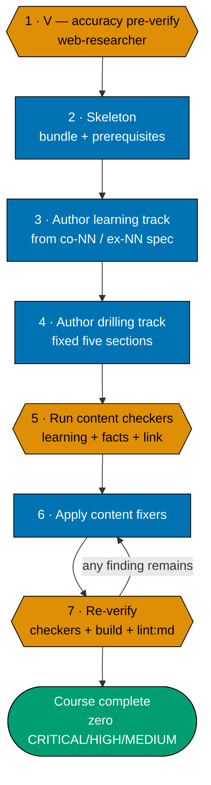
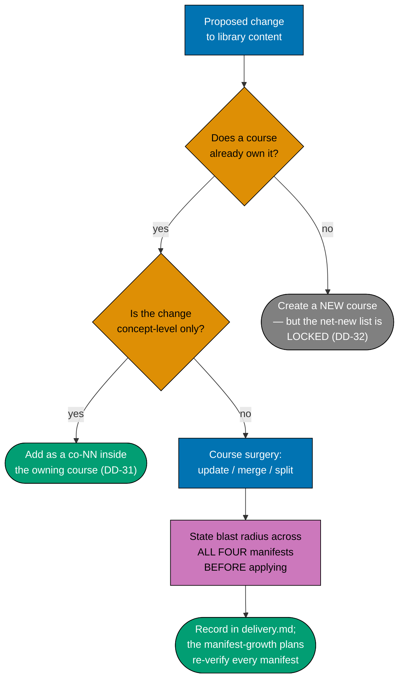
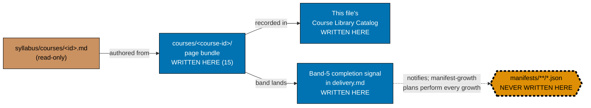
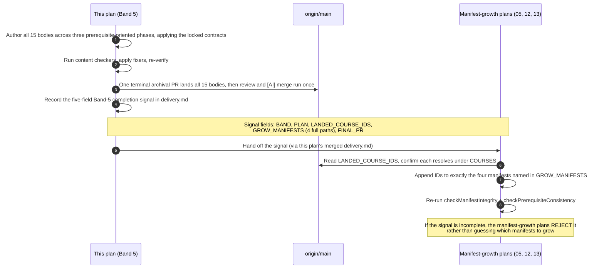
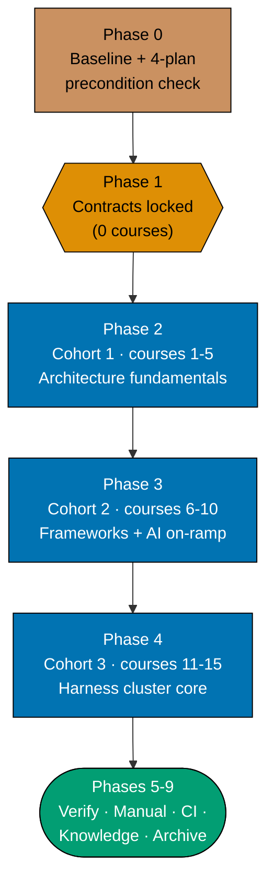

# Technical Docs — Course Authoring: Architecture, Distributed & AI/Harness (Band 5)

## Corpus Custody

`custodied-by:ayokoding-learning-path-02-schema-and-prerequisite-dag` — this plan **reads** the
shared course corpus custodied by that plan but never edits, copies, or forks any file under it. Any
needed change to that corpus is routed to its own `delivery.md` as a change request, per the
[Learning-Plan Syllabus Convention §Custody Rule](../../../repo-governance/conventions/structure/learning-plan-syllabus/custody-rule.md#custody-rule).

## Overview

This plan produces **content artefacts only**: 15 page bundles under
`apps/ayokoding-www/content/en/learn/courses/<course-id>/`, plus one documentation-only phase that
locks three scope contracts governing how those bodies must be written. It writes no TypeScript, no
JSON manifest data file, no route, no component, and no redirect rule. Its "architecture" is therefore an
**authoring architecture**, inherited unchanged from the parent plan
[`ayokoding-learning-path-04-course-authoring`](../../done/2026-08-02__ayokoding-learning-path-04-course-authoring/tech-docs.md):
where each body's authoritative spec lives, what shape the produced bundle takes, how scope
contracts are locked before their target bodies exist, and how the landed band is handed to the
manifest-growth plans.

## The manifest ownership invariant (binding)

> **This plan never edits a manifest file.** Every file under
> `apps/ayokoding-www/src/features/course-paths/manifests/` is owned by
> [`ayokoding-learning-path-12-careers-se-manifests`](../../backlog/ayokoding-learning-path-12-careers-se-manifests/README.md)
> and [`ayokoding-learning-path-13-careers-ai-manifest`](../../backlog/ayokoding-learning-path-13-careers-ai-manifest/README.md),
> the successor manifest-growth plans. A step here that creates, appends to, reorders, or re-verifies
> a `.json` manifest is a **boundary violation**, not a convenience.

### What the invariant permits and forbids, concretely

| Action                                                              | Permitted here?                                                                                 |
| ------------------------------------------------------------------- | ----------------------------------------------------------------------------------------------- |
| Create `<COURSES><course-id>/` and author its bundle (15 total)     | **Yes**                                                                                         |
| Declare `prerequisites` in a course's own `_index.md`               | **Yes**                                                                                         |
| Add a course's row to the Course Library Catalog in this file       | **Yes**                                                                                         |
| List a course in `<COURSES>_index.md`                               | **Yes**                                                                                         |
| Record the Band-5 completion signal in this plan's `delivery.md`    | **Yes**                                                                                         |
| Read a `.json` manifest to check what a path expects                | **Yes** (read-only)                                                                             |
| Append a course ID to any `<MANIFESTS>**/*.json`                    | **No**                                                                                          |
| Re-order any `courseOrder`                                          | **No**                                                                                          |
| Re-run manifest integrity / prerequisite-consistency as a gate here | **No** — the manifest-growth plans re-verify their own artefacts                                |
| Assert the full 127-course catalog total                            | **No** — that is the parent plan's / catalog's terminal total; this plan asserts its own **15** |

## Cross-plan `syllabus/` reference rule (binding)

The 128-file `syllabus/` detail layer lives **only** in
[`ayokoding-learning-path-02-schema-and-prerequisite-dag`](../../done/2026-07-24__ayokoding-learning-path-02-schema-and-prerequisite-dag/README.md).
This plan reads 15 of its files and **never copies** them.

- Every reference uses the **full cross-plan relative path**:
  `../../done/2026-07-24__ayokoding-learning-path-02-schema-and-prerequisite-dag/syllabus/<rest>`.
- **Copying is forbidden.** A copy forks the source of truth for 121 course specs, so a later spec
  correction lands in one copy only.
- This plan carries a pre-archival gate check (see `delivery.md` Phase 9) that catches a broken
  reference in its own files.

## Authoring architecture

### The course page bundle

Every authored course is a page bundle at `<COURSES><course-id>/` with a fixed anatomy, unchanged
from the parent plan:

```text
<COURSES><course-id>/
├── _index.md                 declares `prerequisites: [course-id, ...]` (contracted shape)
├── overview.md               purpose + `## Prerequisites` (earlier library courses only)
│                             + register + the explicit scope boundary against confusable siblings
├── learning/
│   ├── _index.md
│   ├── <concept + example pages, exhaustive `co-NN` / `ex-NN` coverage>
│   ├── code/                 colocated runnable examples (code-bearing courses only)
│   └── capstone/             the course's own intra-course capstone
└── drilling/
    ├── _index.md              lists the drilling sections, links to `overview.md`
    └── overview.md            the fixed five-section drilling order
```

The `course-id` slug, the prerequisite chain, the concept-coverage floor, and the worked-example
volume are all **settled** in the matching `syllabus/courses/<course-id>.md` spec. Authoring
transcribes them; it does not re-decide them.

### The per-course authoring convention (maker-checker-fixer, not code TDD)



**This is deliberately not a Red→Green→Refactor cycle.** See
[§TDD exemption](#tdd-exemption-this-plan-ships-no-application-code) below.

### Licensing posture (programme A8)

Programme `A8` (strict clean-room licensing, programme-wide — inherited from the parent plan's own
folded programme decisions) binds every course body this plan authors. **Describe, cite, and link;
never reproduce.** Concrete hazards mapped to where the maker-checker-fixer pipeline must catch them:

- **Code examples.** Every `learning/code/` worked example is authored originally, never copied from
  a framework's docs, a tutorial, a blog post, or Stack Overflow (CC-BY-SA — a licence course material
  generally cannot satisfy).
- **Documentation prose.** A concept explanation restates the idea in this course's own words with a
  citation — never a paraphrase-by-substitution of the official docs' own sentences.
- **Figures, diagrams and screenshots.** Any diagram is authored (Mermaid), never a screenshot or
  image lifted from a vendor or project site.
- **Book and course structure.** Authored from the `syllabus/courses/<course-id>.md` spec's `co-NN`
  concept order, never from reproducing a well-known book's chapter progression or a paid course's
  module sequence.
- **Trademarks.** Language, framework, and vendor names appear nominatively only.
- **Datasets and sample data.** Authored for the example, not lifted from an unexamined-licence
  source.

### The `prerequisites` frontmatter contract (consumed, not owned)

Every authored `_index.md` declares:

```yaml
prerequisites: [course-id, course-id, ...]
```

The canonical statement of this field's shape is owned by
[`ayokoding-learning-path-02-schema-and-prerequisite-dag`](../../done/2026-07-24__ayokoding-learning-path-02-schema-and-prerequisite-dag/tech-docs.md).
This plan **consumes** it. The list's contents are transcribed from the course's own spec file, never
re-derived — an invented edge adds a false edge to the library DAG whose failure surfaces far
downstream with no trace back to the authoring pass that caused it.

## Course-surgery scope contracts (this plan's own Phase 1 — locked before authoring begins)

These three contracts are reproduced **verbatim** from the parent plan's own tech-docs.md and
delivery.md, per the task instruction that they are binding scope contracts constraining exact
authoring behaviour — not a paraphrase. They govern how this plan's own Phase 2–4 authoring of the
evals-donor courses (`creating-ai-powered-apps`, `agentic-ai`,
`agent-orchestration-subagents-and-observability`) and the harness cluster
(`agent-context-and-memory`, `agent-tools-and-mcp`, `agent-permissions-and-sandboxing`,
`the-agent-loop`, `agent-orchestration-subagents-and-observability`) must be written.

### DD-29 · Context and harness engineering: name and cite in existing courses, do not add or rename any course (D9)

> Research verdict, verified against the actual course files: both disciplines are already taught,
> concept-for-concept, by the existing library — they are simply never named.
> `agent-context-and-memory` maps onto what the industry began calling **context engineering** in
> June 2025 (Lütke 2025-06-19, Karpathy 2025-06-25, Willison 2025-06-27, and Anthropic's Effective
> Context Engineering methodology, 2025-09-29); the six-course harness cluster (`the-agent-loop`,
> `agent-tools-and-mcp`, `agent-context-and-memory`, `agent-permissions-and-sandboxing`,
> `agent-orchestration-subagents-and-observability`, `capstone-build-your-own-coding-agent`)
> satisfies all four necessary conditions in the only academic definition of an agent harness (arXiv
> 2606.10106), which the industry began calling **harness engineering** from late 2025 (Anthropic
> 2025-11-26; OpenAI; Böckeler/Thoughtworks 2026-02-17). A naming/lineage line citing this is added
> to `agent-context-and-memory` and to the harness cluster + `capstone-build-your-own-coding-agent`,
> so a learner connects the material to job-market vocabulary. The OpenAI/Anthropic-vs-HumanLayer
> containment dispute (whether harness is the umbrella containing context management, or the
> reverse) is cited as **unresolved**, not resolved or adopted as structure. **No course is renamed
> and no course is added** — "harness engineering" is roughly five months old and contested among
> named practitioners; building durable course structure on terminology this unsettled ages the
> curriculum badly.

**Citations** (matching the sourcing style used throughout `syllabus/courses/`):

- [Web-cited] Tobi Lütke, X/Twitter, 2025-06-19 — "I really like the term 'context engineering' over
  prompt engineering… the art of providing all the context for the task to be plausibly solvable by
  the LLM." <https://x.com/tobi/status/1935533422589399127> (accessed 2026-07-21).
- [Web-cited] Andrej Karpathy, X/Twitter, 2025-06-25 — "+1 for 'context engineering' over 'prompt
  engineering'…" <https://x.com/karpathy/status/1937902205765607626> (accessed 2026-07-21).
- [Web-cited] Simon Willison, "Context engineering," 2025-06-27 — "The term context engineering has
  recently started to gain traction as a better alternative to prompt engineering. I like it."
  <https://simonwillison.net/2025/jun/27/context-engineering/> (accessed 2026-07-21).
- [Web-cited] Anthropic, "Effective context engineering for AI agents" — "Context engineering refers
  to the set of strategies for curating and maintaining the optimal set of tokens (information)
  during LLM inference, including all the other information that may land there outside of the
  prompts." <https://www.anthropic.com/engineering/effective-context-engineering-for-ai-agents>
  (accessed 2026-07-21; the specific 2025-09-29 publication date cited above was not independently
  re-verified against the live page).
- [Web-cited] arXiv 2606.10106, "What makes a harness a harness: necessary and sufficient conditions
  for an agent harness" — the abstract defines a harness as "the layer that wraps a language model
  and turns it into a coding agent able to act on a repository," then proposes "a constitutive
  definition that states the necessary and sufficient conditions for a system to be an agent
  harness" — confirmed real via WebSearch during the audit that produced this finding.
  <https://arxiv.org/abs/2606.10106> (accessed 2026-07-22). The id is well-formed, not anomalous
  (arXiv YYMM prefix: `26` = 2026, `06` = June).
- [Web-cited] Anthropic, "Effective harnesses for long-running agents," 2025-11-26 — "We developed a
  two-fold solution to enable the Claude Agent SDK to work effectively across many context windows:
  an initializer agent that sets up the environment on the first run, and a coding agent that is
  tasked with making incremental progress in every session, while leaving clear artifacts for the
  next session." <https://www.anthropic.com/engineering/effective-harnesses-for-long-running-agents>
  (accessed 2026-07-21).
- [Web-cited] Birgitta Böckeler / Thoughtworks (via martinfowler.com), "Harness Engineering — first
  thoughts," 2026-02-17 — "I like 'harness' as a word to describe the tooling and practices we can
  use to keep AI agents in check."
  <https://martinfowler.com/articles/exploring-gen-ai/harness-engineering-memo.html> (accessed
  2026-07-21).
- [Unverified] "OpenAI" — a candidate OpenAI publication exists at
  <https://openai.com/index/harness-engineering/> ("Harness engineering: leveraging Codex in an
  agent-first world," reported 2026-02-11), but the primary page returned **HTTP 403** and was not
  read at verification time (2026-07-22); the date and content rest on third-party summaries only.
  This stays **`[Unverified]`** pending a primary-source read — do not upgrade to a verified fact.
  The reported date is **early 2026**, later than the surrounding "late 2025" framing above (that
  framing is grounded on Anthropic 2025-11-26); the OpenAI attribution's contribution to a "late
  2025" onset is therefore **conditional**, not established. This plan's own authoring cites
  Anthropic and Böckeler only, and omits the OpenAI attribution unless the primary page is read and
  a specific URL confirmed.

### DD-30 · The coding-agent capstone teaches the METR-vs-Scale-AI dispute as durable epistemic content (D10)

> Not this plan's own authoring target (`capstone-build-your-own-coding-agent` is authored by
> `ayokoding-learning-path-11-course-authoring-capstones`), but reproduced here because the harness
> cluster this plan authors is the material that capstone assembles, and the cited evidence
> (METR/Scale-AI) informs how this plan's own harness-cluster courses frame harness-quality claims:
> `capstone-build-your-own-coding-agent` teaches the contested evidence on whether harness quality
> even matters, as content that survives whatever happens to the vocabulary: **METR** (independent,
> no vendor stake, 2026-02-13) found Claude Code ahead of a generic ReAct scaffold in 50.7% of
> bootstrap samples on Opus 4.5 — a coin flip; **Scale AI / SWE Atlas** reports large scaffold-driven
> swings, with native scaffolds exploring roughly 1.5-2× more; the **competence-floor
> reconciliation** — METR compared against a competently built generic baseline while Scale compared
> against naive ones, implying harness quality matters enormously below a competence floor and then
> flattens — is explicitly labelled a **synthesis no single source makes**, not a finding either
> source reports. The unsourced 42%→78% scaffold-swing claim is a **do-not-cite**: it traces to no
> primary source.

**Citations**:

- [Web-cited] METR, "Measuring Time Horizon using Claude Code and Codex," 2026-02-13.
  <https://metr.org/notes/2026-02-13-measuring-time-horizon-using-claude-code-and-codex/> (accessed
  2026-07-21) — confirms Claude Code beats a ReAct scaffold in 50.7% of bootstrap samples on Opus
  4.5.
- [Web-cited] Scale AI, "SWE Atlas is Complete: Measuring Coding Agents Across the Engineering Loop."
  <https://scale.com/blog/swe-atlas-complete> (accessed 2026-07-22) — verbatim: "Models running in
  their native scaffolds (Claude Code, Codex CLI) perform 1.5x to 2x more exploration, search, and
  execution than the same models on a generic harness, and they score noticeably higher."
- The 42%→78% scaffold-swing figure remains a **do-not-cite** per this DD's own text — no primary
  source was found for it.

### DD-31 · Four concept-level additions land inside existing courses, never as new courses (D11)

> Verified absent by direct file read at decision time, now confirmed present as `co-NN` entries in
> the corresponding course files (each already had mandated example/concept headroom): **cache-aware
> prefix ordering** → `agent-context-and-memory` co-23 (order context by staleness, not logical
> grouping — framed as the vendor-neutral stable-before-variable principle, not tied to Anthropic's
> explicit breakpoints or OpenAI's automatic threshold); **tool-count degradation** →
> `agent-tools-and-mcp` co-23 (tool-selection accuracy declines as available tool count rises, per
> the Berkeley Function-Calling Leaderboard and a GeoEngine benchmark finding a model failing at 46
> tools and succeeding at 19 `[Needs Verification]` — re-verify both benchmark citations at
> authoring time, see `syllabus/courses/agent-tools-and-mcp.md`; governs when to split a tool surface
> across subagents); **tool-result token efficiency** → `agent-tools-and-mcp` co-24 (a tool's result
> shape is a context-budget decision; promotes the prior unquantified ex-27 aside to a named
> concept); **train-vs-production permission asymmetry** → `agent-permissions-and-sandboxing` co-23
> (a training/exploration harness is permissive, a production harness restrictive — the distinction
> is about risk, not model capability, which is why it stays durable as models improve). None of the
> four introduces a new course.

### DD-25 / DD-28 · The evals forward-link contract (the third surgery target this plan applies)

> **DD-25 · Evals split: an early light gate plus a later deep-evals course (D5).** A separate **deep
> evals course** (`evaluating-ai-systems-in-depth`, authored in the parent plan's own Phase 1, already
> merged per this plan's start precondition) absorbs the three scattered evals treatments currently
> duplicated across `creating-ai-powered-apps`, `agentic-ai`, and
> `agent-orchestration-subagents-and-observability` — all three authored **in this plan**. Those three
> donor courses are trimmed to **forward-links** rather than gaining a fourth treatment. The scope
> boundary between the deep-evals course and each donor is explicit, in the style of the library's
> existing AI-band scope-guard (DD-11).
>
> **DD-28 · Course surgery (update / merge / split / create) now permitted (D8, amends the
> create-only half of DD-7).** **Binding rule — course surgery is a four-path change.** Courses are
> shared; any edit, split, or merge to a course ripples to every manifest carrying that course ID.
> Each surgery **must state its blast radius** across all four manifests before it is applied, and
> every affected manifest must be **re-verified prerequisite-consistent** afterward (enforced as a
> gate, performed by the manifest-growth plans, never by this plan). Concretely: the library's evals
> content is extracted into the already-authored deep-evals course and the three donor courses this
> plan authors are trimmed to forward-links — a surgery, not a fourth treatment.

**DD-7's surviving half still binds here**, restated so a reader of this plan alone cannot read
"surgery permitted" as "forking permitted": _a path omits a course that does not fit and creates a
new shared course only for a genuine gap; per-path framing is a lightweight intro/outro callout
around the shared body. Single source of truth per course._ **No body is ever forked per path.**

### The four-path blast radius (DD-28's binding rule, stated for this plan's own three surgeries)

- **The evals extraction** touches `evaluating-ai-systems-in-depth` (already authored in the parent
  plan's own Phase 1) plus the three donor courses this plan authors
  (`creating-ai-powered-apps`, `agentic-ai`, `agent-orchestration-subagents-and-observability`), and
  the `fundamentally-strong` and `immediately-effective` software-engineer manifests plus the AI-path
  manifest that will carry those donors once grown by the downstream manifest-growth plans.
- **The D9 naming/citation additions** touch only the harness cluster
  (`the-agent-loop`, `agent-tools-and-mcp`, `agent-context-and-memory`,
  `agent-permissions-and-sandboxing`, `agent-orchestration-subagents-and-observability`) plus
  `capstone-build-your-own-coding-agent` (authored in the sibling capstones plan) and every manifest
  carrying those IDs — the three software-engineer-role manifests plus the fourth path's manifest
  once this band's signal grows it to include the harness cluster.
- **The D11 concept additions** touch only `agent-context-and-memory`, `agent-tools-and-mcp`, and
  `agent-permissions-and-sandboxing` — no manifest is touched by the concept additions themselves;
  they ride the same manifests as the D9 additions once those courses' IDs are already present.

**Naming a manifest here is not editing one** — the growth is performed exclusively by
`ayokoding-learning-path-12-careers-se-manifests` and `ayokoding-learning-path-13-careers-ai-manifest`,
the successor manifest-growth plans.



**Accessibility note.** Node kind is carried by **shape** (diamond = decision, rectangle = action,
stadium = terminal) and every edge carries an explicit `yes` / `no` label. Fills use the repo's
verified accessible palette per the
[Color Accessibility Convention](../../../repo-governance/conventions/formatting/color-accessibility.md).

## Manifest-ownership diagram (who writes what)



## Band-completion signal (the handoff to the manifest-growth plans)



## Delivery flow across this plan's own phases



**Internal phase-ordering fact.** Phase 1 (the contract lock) must complete before Phase 2 (the first
authoring cohort) begins — the contracts govern how Cohort 2's `creating-ai-powered-apps` /
`agentic-ai` and Cohort 3's entire harness cluster must be written. Cohort ordering within Phases 2–4
is itself constrained: `agentic-ai` (Cohort 2) is a hard prerequisite of `the-agent-loop` (Cohort 3),
and `the-agent-loop` is a hard prerequisite of the other four Cohort-3 courses.

## Design Decisions

This plan cites the parent plan's own `DD-11` (AI-band scope-guard) and `DD-25`/`DD-28`/`DD-29`/
`DD-30`/`DD-31` (the three course-surgery contracts, reproduced verbatim above) as **inherited**
decisions it applies, never re-decides. It introduces no new design-decision IDs of its own — every
authoring choice in this band traces to a decision already locked upstream.

## Course Library Catalog (this plan's 15 rows)

The full 127-course catalog is owned by the parent plan's own tech-docs.md. This plan's rows are the
"Architecture, distributed & AI / harness" subset it authors — reproduced here as this plan's own
catalog record:

| Course ID                                         | Origin | Format            | Primary language | Prerequisites                                                  | One-line scope                             |
| ------------------------------------------------- | ------ | ----------------- | ---------------- | -------------------------------------------------------------- | ------------------------------------------ |
| `software-architecture`                           | T(42)  | Annotated-concept | Python           | `backend-essentials`, `object-oriented-design-and-patterns`    | Styles, tradeoffs, structuring             |
| `domain-driven-design`                            | T(43)  | By Example        | Python           | `object-oriented-design-and-patterns`, `software-architecture` | Bounded contexts, modeling                 |
| `system-design`                                   | T(44)  | Annotated-concept | Python           | `backend-at-scale`, `networking-essentials`                    | Designing for scale/availability           |
| `event-driven-architecture`                       | T(45)  | By Example        | Python           | `software-architecture`, `backend-essentials`                  | Events, brokers, EDA                       |
| `distributed-systems`                             | T(46)  | By Example        | Python           | `networking-essentials`, `concurrency-and-parallelism`         | Consensus, replication, CAP                |
| `build-your-own-web-framework`                    | T(40)  | By Example        | Python           | `backend-essentials`, `networking-essentials`                  | WSGI/ASGI, router, middleware              |
| `build-your-own-reactive-ui`                      | T(48)  | By Example        | TypeScript       | `advanced-frontend`                                            | Reactive UI lib + virtual DOM              |
| `creating-ai-powered-apps`                        | T(56)  | By Example        | Python           | `backend-essentials`, `api-design`                             | Use an LLM in an app (scope-guard head)    |
| `agentic-ai`                                      | T(57)  | By Example        | Python           | `creating-ai-powered-apps`                                     | Survey; forward-links the harness cluster  |
| `browser-automation-with-cdp`                     | N      | By Example        | Python (CDP)     | `just-enough-python`, `networking-essentials`                  | CDP automation (`remotebrowser` skill)     |
| `the-agent-loop`                                  | N      | By Example        | Python           | `agentic-ai`                                                   | LLM read-eval-act loop, streaming, stops   |
| `agent-tools-and-mcp`                             | N      | By Example        | Python           | `the-agent-loop`                                               | Tool/function schemas; MCP server + client |
| `agent-context-and-memory`                        | N      | Annotated-concept | Python           | `the-agent-loop`                                               | Context budgeting, compaction, memory      |
| `agent-permissions-and-sandboxing`                | N      | By Example        | Python           | `the-agent-loop`                                               | Approval models, sandboxing, guardrails    |
| `agent-orchestration-subagents-and-observability` | N      | Annotated-concept | Python           | `agent-tools-and-mcp`, `agent-context-and-memory`              | Subagents, hooks/skills, evals, tracing    |

**Count check**: 9 transferred-native (T) + 6 new (N) = **15**, all authored in this plan. Zero
merges — this band contains no course-surgery target of its own beyond the three contracts applied
to already-scoped courses.

## Productive in Target Codebases (proof-of-transfer outcome-anchor, inherited)

**Philosophy (DD-18, inherited unchanged).** The library teaches durable **PRINCIPLES**; target
codebases are **evidence the principles transfer**, never subject matter. For this band's courses,
the relevant illustrative targets are:

- **`remotebrowser`** [Web-cited — <https://github.com/remotebrowser/remotebrowser>, accessed
  2026-07-18] — async-Python/FastAPI browser-fleet orchestration over CDP + MCP; illustrates
  `browser-automation-with-cdp` and the harness cluster.
- **`ose-public` / `ose-primer` / the private sibling** [Repo-grounded — `AGENTS.md`] — illustrates
  `software-architecture`, `domain-driven-design`, `distributed-systems`, and
  `event-driven-architecture` patterns already in use in this workspace.

## UI-gate and API-gate posture (R9)

### UI gate — **exempt**

`swe-ui-checker` validates component **source** — it globs for `.tsx` files. This plan's entire
output is 15 markdown page bundles under `apps/ayokoding-www/content/en/learn/courses/<course-id>/`.
It writes no TypeScript, no route, no component. A checker run scoped to this plan's diff finds no
`.tsx` file to validate.

### API gate — **exempt**

This plan changes no REST or GraphQL endpoint and ships no API contract.

## Exemptions (stated explicitly, not silently taken)

### UI-design-funnel exemption (not UI-bearing)

A plan is UI-bearing when it **adds or changes user-facing screens or components** under `apps/` or
`libs/`. This plan does neither — every artefact is a markdown page bundle rendered by components
this plan does not touch. The complete UI-design-funnel is owned by
`ayokoding-learning-path-03-navigation-ui`. **This plan carries no `assets/` folder and produces no
render.**

### Specs & Gherkin (app-code) exemption

The [Feature Change Completeness Convention](../../../repo-governance/development/quality/feature-change-completeness.md)
binds app/lib code changes to companion `specs/` Gherkin. This plan changes **no app or lib code** —
it adds content, which the parent plan explicitly classifies as "largely content (exempt from
`specs:coverage`)". The six Gherkin scenarios in [`prd.md`](./prd.md#acceptance-criteria-gherkin) are
**content-level** acceptance criteria, bound to delivery steps and verified by grep-checkable
assertions plus the ayokoding content checkers — not by `specs:behavior:coverage`. This plan still
runs `npm exec nx affected -t specs:behavior:coverage` in its verification phase to prove it introduced no
regression against the existing feature tree.

### TDD exemption (this plan ships no application code)

The [Test-Driven Development Convention](../../../repo-governance/development/workflow/test-driven-development.md)
mandates an explicit RED → GREEN → REFACTOR three-substep shape for every **code**-delivery step.
This plan has none. Its delivery steps produce prose, worked examples, and colocated runnable `code/`
samples that are **course material**, not application code. Their correctness is established by the
maker-checker-fixer pipeline documented above, per the parent plan's own verbatim ruling:

> _Content authoring is a maker-checker-fixer cycle, not code TDD — no RED/GREEN/REFACTOR labels._

**If any step in this plan ever needs to touch app or lib code, that step is out of scope and must be
routed to the owning plan.**

### Rule-15 three-tester retest exemption

Recorded with reasons in
[README §Rule-15](./README.md#rule-15-three-tester-retest--exemption-recorded). The exemption is
narrow: manual behavioural verification via Playwright MCP remains **mandatory and performed**, with
committed screenshot evidence. Only the three-tester triad is waived.

### Rule-16 API exploratory retest — not applicable

This plan changes no REST or GraphQL endpoint and ships no API contract.

## File-Impact Analysis

Root-relative annotated tree — the scan-first source of truth for this plan's scope. **[E]** edit,
**[N]** new file/pattern, **[D]** delete, **[G]** generated/regenerated.

```text
.
├── apps/ayokoding-www/content/en/learn/courses/
│   ├── _index.md [E] — append one list entry per landed course ID
│   └── <course-id>/ [N] — 15 bundles, one per slug in README §Exact scope; bounded family,
│       │                  members enumerated verbatim in evidence/authored-body-slugs.txt
│       │                  (written in Phase 0) and never discovered by glob
│       ├── _index.md [N] — declares `prerequisites: [course-id, ...]`
│       ├── overview.md [N] — purpose, prerequisites, register, scope boundary
│       ├── learning/
│       │   ├── _index.md [N]
│       │   ├── <co-NN / ex-NN concept and example pages> [N] — count fixed by the course's spec
│       │   ├── code/ [N] — colocated runnable examples (code-bearing courses only)
│       │   └── capstone/ [N] — the course's own intra-course capstone
│       └── drilling/
│           ├── _index.md [N]
│           └── overview.md [N] — the fixed five-section drilling order
├── plans/in-progress/ayokoding-learning-path-06-course-authoring-architecture-and-ai-harness/
│   ├── tech-docs.md [E] — this file; §Course Library Catalog already carries all 15 rows
│   ├── delivery.md [E] — checkbox ticks + the five-field Band-5 completion signal
│   ├── learnings.md [E] — running log, drained by Phase 8
│   └── evidence/ [N] — phase-0-snapshot.txt, authored-body-slugs.txt, Playwright screenshots
└── apps/ayokoding-www/src/features/course-paths/ — NOT TOUCHED (see §Never touched below)
```

### More Detail

The 15 `<course-id>/` bundles are the only `*`-shaped family in the tree, and they are bounded by
construction: the exact member list is written to `evidence/authored-body-slugs.txt` during Phase 0
and every later assertion reads that register rather than globbing the directory, so a slug that
drifted into the tree from another plan can never be silently adopted as this plan's work.

`apps/ayokoding-www/content/en/learn/courses/_index.md` is generated from course directories. After each course cohort, run `npm exec nx run ayokoding-www:generate-indexes` and then `npm exec nx run ayokoding-www:validate-indexes`; no plan manually edits this generated index.

Nothing under `apps/ayokoding-www/src/` appears with an action annotation because this plan writes
no application code at all — the zero-diff gate in every phase asserts that absence rather than
trusting it. The manifest subtree is called out separately below because reading it is permitted and
writing it is a boundary violation, a distinction the tree alone cannot carry.

**Existing files modified per cohort** (this plan edits these; it never creates them):

| File                                                                                               | Change                                                                                            |
| -------------------------------------------------------------------------------------------------- | ------------------------------------------------------------------------------------------------- |
| `apps/ayokoding-www/content/en/learn/courses/_index.md`                                            | regenerated from course directories; verify with `npm exec nx run ayokoding-www:validate-indexes` |
| `tech-docs.md` (this file) — [§Course Library Catalog](#course-library-catalog-this-plans-15-rows) | already lists all 15 rows; no further append needed once this plan lands                          |
| `delivery.md` (this plan's own file)                                                               | the five-field Band-5 completion signal, appended once all 15 land                                |

**Never touched, by construction** (verified by a zero-diff gate check at every phase):

- `<FEAT>` (`apps/ayokoding-www/src/features/course-paths/`) — no application code.
- `<MANIFESTS>` (`<FEAT>manifests/`) — every `.json` manifest is read-only from this plan.
- `<PATHS>` and `<SE_OLD>` — read-only reference paths this plan reads but never writes.
- `<SYLLABUS>` — the cross-plan authoring source; consumed, never copied or edited.

**No package-manifest changes**: this plan adds no entry to `package.json`, `go.mod`, `Cargo.toml`, or
any other dependency manifest.

## Execution dependency

This plan has one direct execution prerequisite: `ayokoding-learning-path-05-course-authoring-platform-and-concurrency`, fully merged and archived on `origin/main`. Course-level source citations and repository facts are implementation context, not extra plan dependencies.

## Rollback

Every artefact this plan produces is an **additive** new directory under `<COURSES>`. Nothing is
moved, renamed, or deleted, so rollback is subtractive and total:

- **Per course**: `git rm -r <COURSES><course-id>/` plus removing its row from the catalog and its
  entry from `<COURSES>_index.md`. Safe **only** if no manifest already references the ID.
- **Whole plan**: revert the sole terminal merge commit.

**The one-way door**: once a manifest references a course ID, deleting that body breaks
`checkManifestIntegrity` downstream — this is why bodies land first and manifests grow after, and why
this plan may never grow a manifest itself.

## Testing / Verification Strategy

| Level                     | What it verifies                                                                         | Mechanism                                                                   |
| ------------------------- | ---------------------------------------------------------------------------------------- | --------------------------------------------------------------------------- |
| Per-course content checks | concept coverage, register, format, worked-example volume, scope boundary                | matching `apps-ayokoding-www-*-checker`                                     |
| Per-course fact checks    | version-pinned / market / pre-1.0-stack facts; volatile facts confined to dated sidebars | `apps-ayokoding-www-facts-checker`                                          |
| Per-course link checks    | intra-course and cross-course links resolve                                              | `apps-ayokoding-www-link-checker`                                           |
| Contract assertions       | forward-link / citation / concept-addition contracts stated in the body                  | grep-checkable acceptance clauses on the authoring steps                    |
| Structural                | bundle anatomy present; `prerequisites` declared                                         | `test -d` / `test -f` + frontmatter grep                                    |
| Section build             | the authored tree renders                                                                | `npm exec nx run ayokoding-www:build`                                       |
| Markdown quality          | markdownlint, link validation, heading hierarchy                                         | `npm run lint:md` + the two `rhino-cli md` subcommands                      |
| Regression                | no existing project's gates broke                                                        | `npm exec nx affected -t typecheck lint test:quick specs:behavior:coverage` |
| Manual behavioural        | a sample of authored course pages renders correctly at three breakpoints in `en`         | Playwright MCP + committed `evidence/` screenshots                          |

**Deliberately absent**: unit, integration, and e2e tests for this plan's own artefacts. There is no
application code here to test.
