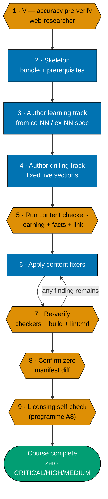
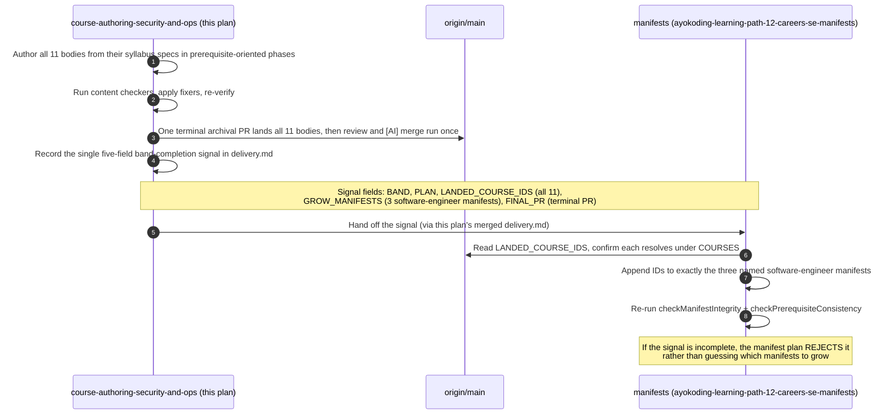

# Technical Docs — Learning Path Course Authoring: Security, Ops & Delivery (Band 7)

## Corpus Custody

`custodied-by:ayokoding-learning-path-02-schema-and-prerequisite-dag` — this plan **reads** the shared
course corpus custodied by that plan but never edits, copies, or forks any file under it. Any needed
change to that corpus is routed to plan 02's own follow-up mechanism as a change request, per the
[Learning-Plan Syllabus Convention §Custody Rule](../../../repo-governance/conventions/structure/learning-plan-syllabus/custody-rule.md#custody-rule).

## Overview

This plan produces **content artefacts only**: eleven page bundles under
`apps/ayokoding-www/content/en/learn/courses/<course-id>/`. It writes no TypeScript, no JSON manifest data
file, no route, no component, and no redirect rule. Its "architecture" is therefore an **authoring
architecture**, identical in shape to plan 04's own (from which this band was carved): where each
body's authoritative spec lives, what shape the produced bundle takes, and how a landed band is handed
to the plan that composes it.

## Programme decisions (cited, not owned)

This plan cites the same shared programme decisions plan 04 cites, at the same status: **programme-scope
decisions, not governance rule ids** — nothing under `../../repo-governance/` defines them, and they
bind only this programme's plans.

| Id  | Decision                                                                                                                                      | Why it applies here                                                                                                                                  |
| --- | --------------------------------------------------------------------------------------------------------------------------------------------- | ---------------------------------------------------------------------------------------------------------------------------------------------------- |
| R9  | Every plan declares its **UI-gate and API-gate posture explicitly**; a plan bearing neither surface is _not_ thereby exempt                   | See [§UI-gate and API-gate posture](#ui-gate-and-api-gate-posture-r9) below.                                                                         |
| A8  | **Strict clean-room licensing, programme-wide** — nothing copyrighted is reproduced, every concept restated in original words with a citation | Binds every worked example, concept explanation, diagram, and dataset this plan authors — see [§Licensing posture](#licensing-posture-programme-a8). |

## The manifest ownership invariant (binding)

> **This plan never edits a manifest file.** Every file under
> `apps/ayokoding-www/src/features/course-paths/manifests/` is owned by
> [`ayokoding-learning-path-12-careers-se-manifests`](../../backlog/ayokoding-learning-path-12-careers-se-manifests/README.md). A step
> here that creates, appends to, reorders, or re-verifies a `.json` manifest is a **boundary
> violation**, not a convenience — the identical invariant plan 04 carries.

### What the invariant permits and forbids, concretely

| Action                                                              | Permitted here?                                          |
| ------------------------------------------------------------------- | -------------------------------------------------------- |
| Create `<COURSES><course-id>/` and author its bundle (11 IDs only)  | **Yes**                                                  |
| Declare `prerequisites` in a course's own `_index.md`               | **Yes**                                                  |
| Add a course's row to the Course Library Catalog in this file       | **Yes**                                                  |
| List a course in `<COURSES>_index.md`                               | **Yes**                                                  |
| Record the band-completion signal in this plan's `delivery.md`      | **Yes** (once, covering all eleven IDs)                  |
| Read a `.json` manifest to check what a path expects                | **Yes** (read-only)                                      |
| Append a course ID to any `<MANIFESTS>**/*.json`                    | **No**                                                   |
| Re-order any `courseOrder`                                          | **No**                                                   |
| Re-run manifest integrity / prerequisite-consistency as a gate here | **No** — the manifest plan re-verifies its own artefacts |
| Author any course outside this band's eleven IDs                    | **No** — that is plan 04's own remaining scope           |

## Cross-plan `syllabus/` reference rule (binding)

The 128-file `syllabus/` detail layer lives **only** in
[`ayokoding-learning-path-02-schema-and-prerequisite-dag`](../../done/2026-07-24__ayokoding-learning-path-02-schema-and-prerequisite-dag/README.md),
identically to plan 04's own rule.

- Every reference uses the **full cross-plan relative path**:
  `../../done/2026-07-24__ayokoding-learning-path-02-schema-and-prerequisite-dag/syllabus/<rest>`.
- **Copying is forbidden.** A copy forks the source of truth for the shared course specs, so a later
  spec correction lands in one copy only.
- **The immediate-ancestor reference is provisional, not fixed.**
  `ayokoding-learning-path-04-course-authoring` is `in-progress` at the time this plan is authored;
  every reference to it currently reads `../../done/2026-08-02__ayokoding-learning-path-04-course-authoring/`.
  [delivery.md Phase 0](./delivery.md#phase-0-environment-setup--baseline) resolves the actual archived
  path (if plan 04 has archived by execution time) and re-points every reference in this plan's own
  files before authoring begins — mirroring plan 04's own reciprocal-repoint pattern for its Wave-1
  upstream.

**Link-validation mechanics (identical to plan 04's own, verified against the binary).**
`md links validate` accepts **no positional path** and cannot be scoped by `cd`-ing into a folder.
Use the repo-wide form with the pre-push hook's own excludes and filter to this plan's own paths:

```bash
apps/rhino-cli/scripts/rhino-bin.sh md links validate \
  --quiet \
  --exclude plans/done \
  --exclude apps/ayokoding-www/content \
  --exclude apps/ose-www/content 2>&1 | grep -F "ayokoding-learning-path-08-course-authoring-security-and-ops"
```

Acceptance: the `grep` finds **no** matching line (exits 1). Falsifiable the other way too —
introduce one bad `../../done/2026-07-24__ayokoding-learning-path-02-schema-and-prerequisite-dag/syllabus/`
link and the same command prints that file and exits 0.

## Authoring architecture

### The course page bundle

Every authored course is a page bundle at `<COURSES><course-id>/` with a fixed anatomy, identical to
plan 04's own and mirroring the sibling bundles already on disk:

```text
<COURSES><course-id>/
├── _index.md                 declares `prerequisites: [course-id, ...]` (contracted shape)
├── overview.md               purpose + `## Prerequisites` (earlier library courses only)
│                             + register + the explicit scope boundary against confusable siblings
├── learning/
│   ├── _index.md
│   ├── <concept + example pages, exhaustive `co-NN` / `ex-NN` coverage>
│   ├── code/                 colocated runnable examples (code-bearing courses only)
│   └── capstone/             the course's own intra-course capstone
└── drilling/
    ├── _index.md              lists the drilling sections, links to `overview.md`
    └── overview.md            the fixed five-section drilling order
```

The `course-id` slug, the prerequisite chain, the concept-coverage floor, and the worked-example volume
are all **settled** in the matching `syllabus/courses/<course-id>.md` spec. Authoring transcribes
them; it does not re-decide them.

### The per-course authoring convention (maker-checker-fixer, not code TDD)

Reproduced verbatim from plan 04's own tech-docs (this plan inherits the identical pipeline; the steps
are shared authoring methodology across every split-plan folder, not owned by plan 04 alone):



**Accessibility note.** Stage kind is carried by node **shape** (hexagon = verify, rectangle = produce,
stadium = terminal) and by the numbered step labels; the retry edge carries an explicit label. Colour
is redundant throughout.

**This is deliberately not a Red→Green→Refactor cycle.** Content authoring is a maker-checker-fixer
workflow: there is no failing test to write first, because the artefact under production is prose and
worked examples validated by domain checkers, not application behaviour validated by assertions. See
[§TDD exemption](#tdd-exemption-this-plan-ships-no-application-code) below.

### Licensing posture (programme A8)

Programme [`A8`](#programme-decisions-cited-not-owned) binds every plan that authors teaching material. Six concrete
hazards apply to each of this band's course bodies, each mapped to where the maker-checker-fixer
pipeline above must catch it:

- **Code examples.** Every `learning/code/` worked example is authored originally for this course,
  never copied from vendor SIEM/security-tool documentation, a tutorial, a blog post, or Stack
  Overflow (CC-BY-SA, a licence course material generally cannot satisfy). Step-5 content checkers are
  the enforcement point.
- **Documentation prose.** A concept explanation restates the idea in this course's own words with a
  citation — never a paraphrase-by-substitution of a vendor's (e.g. Wazuh's, Elastic's) own sentences.
- **Figures, diagrams and screenshots.** Any diagram in a course body is authored (Mermaid), never a
  screenshot lifted from a SIEM vendor dashboard or a security-tool project site.
- **Book and course structure.** A course's own module/example progression is authored from the
  `syllabus/courses/<course-id>.md` spec's `co-NN` concept order, never from reproducing a well-known
  security-certification curriculum's module sequence (e.g. an OSCP-style or SANS-style progression).
- **Trademarks.** Vendor and tool names (Wazuh, Sigma, ELK/OpenSearch, Proxmox, Kubernetes) appear
  nominatively only — never in a course title, path segment, or phrasing implying endorsement or
  affiliation.
- **Datasets and sample data.** Any log sample, detection rule, or attack scenario a worked example
  touches is authored for the example, not lifted from a source whose licence was not examined.

### The `prerequisites` frontmatter contract (consumed, not owned)

Every authored `_index.md` declares:

```yaml
prerequisites: [course-id, course-id, ...]
```

The canonical statement of this field's shape is owned by
[`ayokoding-learning-path-02-schema-and-prerequisite-dag`](../../done/2026-07-24__ayokoding-learning-path-02-schema-and-prerequisite-dag/tech-docs.md).
This plan **consumes** it. The list's contents are transcribed from the course's own spec file, never
re-derived.

### The Band-7 reconciliation rulings (reproduced from plan 04, binding here)

Plan 04's decisions-locked register carries two entries that directly govern this band's eleven
bodies. Both are reproduced **verbatim** below, per the shared-split convention that a cross-cutting
decision travels with the plan that now authors the bodies it governs, rather than being paraphrased.

> **DL-9 · detection-engineering kept distinct + topic-60 label fix.**
> `detection-engineering-and-siem-operations` stays distinct from `defensive-security` (60);
> `defensive-security` is re-labelled **hands-on By-Example** (the catalog's "concept-level" label was
> wrong); explicit scope lines are drawn (generalist Sigma/ELK breadth vs deep Wazuh SIEM-ops).
> **Decided.**
>
> — verbatim from
> [`ayokoding-learning-path-04-course-authoring`'s README.md](../../done/2026-08-02__ayokoding-learning-path-04-course-authoring/README.md#decisions-locked-inherited)

Plan 04's own tech-docs expresses the same reconciliation as a design decision (its own `DD-12`), with
additional authoring detail this plan also inherits: `defensive-security` (60) is **hands-on
By-Example** (Sigma-on-ELK/OpenSearch + IR-lifecycle + hardening, as generalist blue-team breadth) —
the catalog's original "concept" label was wrong and is corrected.
`detection-engineering-and-siem-operations` owns the **Wazuh-specific deep tier** (decoders,
correlation-rule authoring, FP tuning, dashboards) and declares `defensive-security` as its
prerequisite. Explicit scope lines are drawn in both bodies. This plan applies DL-9/DD-12 **by
construction**: both courses are authored in the same delivery cohort (Cohort A — see
[delivery.md](./delivery.md#phase-1-cohort-a--security-core-5-bodies)), so each body's stated scope
boundary is written against the other body's actual, current text.

Two further reconciliation lines this band's bodies must state, also inherited from plan 04 (its
`DD-14` two-altitude splits and `DD-26` evals-statistics scope, respectively):

- `bare-metal-virtualization` names `self-hosting-essentials` (plan 04's Band 2) as its lighter-altitude
  sibling and covers the Proxmox/hypervisor depth the light on-ramp deliberately excludes.
- `analytics-and-experimentation` names `statistics-for-evaluation` (plan 04's Phase 1 AI-engineering
  course) as its scope-boundary sibling: classical product metrics and A/B testing here, evals-only
  judge concordance and significance testing there.

### Band-completion signal (the handoff to the manifest plan)



## Course Library Catalog

This plan authors **11 of the shared library's 127 courses** — Band 7, "Security, ops, quality &
delivery." Each row lists **course-id · origin · format · primary language · prerequisites · one-line
scope**. **Origin**: `T(n)` = transferred FS-SE topic `n` (authored here, native), `N` = net-new
(authored here). No row in this band is `E` (re-homed) or `Ecap` (existing capstone) — every one of
these eleven bodies has no legacy home.

Full per-course detail is the cross-plan
[`syllabus/courses/` catalog](../../done/2026-07-24__ayokoding-learning-path-02-schema-and-prerequisite-dag/syllabus/courses/README.md).

| Course ID                                   | Origin | Format            | Primary language            | Prerequisites (exact delivered frontmatter)                                             | One-line scope                                                                                                                  |
| ------------------------------------------- | ------ | ----------------- | --------------------------- | --------------------------------------------------------------------------------------- | ------------------------------------------------------------------------------------------------------------------------------- |
| `it-and-application-security`               | T(58)  | Annotated-concept | Python                      | `security-essentials`, `backend-at-scale`, `just-enough-python`                         | CIA, STRIDE, OWASP, crypto, identity                                                                                            |
| `offensive-security`                        | T(59)  | By Example        | Python + shell              | `it-and-application-security`, `security-essentials`, `just-enough-bash`                | Recon, scanning, exploitation (lab-local)                                                                                       |
| `defensive-security`                        | T(60)  | **By Example**    | Python + shell              | `offensive-security`, `it-and-application-security`, `just-enough-bash`                 | **Hands-on** generalist blue-team: Sigma-on-ELK/OpenSearch + IR lifecycle + hardening (label fixed — NOT "concept", DL-9/DD-12) |
| `detection-engineering-and-siem-operations` | N      | By Example        | XML/rules + config + Python | `defensive-security`, `security-essentials`, `offensive-security`, `just-enough-python` | **Wazuh-specific deep tier**: decoders, correlation rules, FP tuning, dashboards (specialist — DL-9/DD-12)                      |
| `vulnerability-management-and-assessment`   | T(61)  | By Example        | Python                      | `security-essentials`, `it-and-application-security`, `defensive-security`              | Scanning, triage, remediation at scale, SBOM                                                                                    |
| `it-governance-grc`                         | T(62)  | Annotated-concept | none                        | `it-and-application-security`, `defensive-security`, `project-management`               | Governance, risk, compliance, audit                                                                                             |
| `bare-metal-virtualization`                 | T(52)  | By Example        | HCL/YAML/shell              | `containers-and-orchestration`, `cloud-and-iac`, `networking-essentials`                | Proxmox, hypervisors (full-depth sibling of `self-hosting-essentials`)                                                          |
| `self-managed-kubernetes-and-gitops`        | T(53)  | By Example        | YAML/CLI                    | `containers-and-orchestration`, `bare-metal-virtualization`, `distributed-systems`      | Self-owned prod K8s + GitOps                                                                                                    |
| `platform-engineering-and-devex`            | T(93)  | Annotated-concept | none                        | `containers-and-orchestration`, `cloud-and-iac`, `cicd-and-release-engineering`         | Internal platforms, golden paths                                                                                                |
| `site-reliability-engineering`              | T(94)  | Annotated-concept | Python                      | `backend-at-scale`, `containers-and-orchestration`, `system-design`                     | SLOs, observability, IR                                                                                                         |
| `analytics-and-experimentation`             | T(63)  | By Example        | Python                      | `sql-essentials`, `software-testing`                                                    | Metrics, A/B testing                                                                                                            |

**Cross-band prerequisite note.** Every ID in the exact frontmatter column resolves to an existing
course bundle at delivery time. The security, systems, platform, data, and project-management
foundations remain owned by their respective prior bands; this plan only consumes their stable IDs.
No unresolved-prerequisite tolerance is used here.

**Count check**: 10 transferred (T) + 1 net-new (N) = **11** total, the whole of Band 7.

## Productive in Target Codebases (proof-of-transfer outcome-anchor, inherited)

This plan inherits plan 04's `DD-18` proof-of-transfer outcome-anchor verbatim in spirit: courses teach
durable **principles**; target codebases are evidence the principles transfer, never subject matter.
For this band specifically:

- **`wazuh/wazuh`** [Web-cited — <https://github.com/wazuh/wazuh>, accessed 2026-07-18, per plan 04's
  own citation — repo tagline: "Wazuh - The Open Source Security Platform. Unified XDR and SIEM
  protection for endpoints and cloud workloads."] — the deep-Wazuh worked examples in
  `detection-engineering-and-siem-operations` are grounded against this publicly verified target;
  version-sensitive specifics are re-verified via `apps-ayokoding-www-facts-checker` at authoring time,
  never written as fixed facts in the stable spine.
- **`ose-public` / `ose-primer` / the private sibling** — this workspace family's own CI/CD, IaC, and
  operational practice is an illustrative target for `self-managed-kubernetes-and-gitops`,
  `platform-engineering-and-devex`, and `site-reliability-engineering`.

## UI-gate and API-gate posture (R9)

Both postures are declared explicitly, identically to plan 04's own reasoning (this plan's surface is a
strict subset of plan 04's).

### UI gate — **exempt**

`swe-ui-checker` validates component **source** — it globs for `.tsx` files. This plan writes no
TypeScript, no JSON manifest data file, no route, no component, and no redirect rule; its entire output is
eleven markdown page bundles. A checker run scoped to this plan's diff would scan **zero** `.tsx` files
and return zero findings — a vacuous pass, recorded as an exemption rather than a claimed one. The
components that render these bodies are owned and gated by `ayokoding-learning-path-03-navigation-ui`.

**The exemption is narrow.** It covers `ui-quality-gate` only. Because this plan ships eleven
user-visible pages, manual behavioural verification via Playwright MCP is **mandatory and performed**
(see [delivery.md Phase 4](./delivery.md#phase-4-manual-content-verification-playwright-mcp)). The
**Rule-15 three-tester retest is separately and already exempted**, with its own stated reasons, in
[README §Rule-15](./README.md#rule-15-three-tester-retest--exemption-recorded).

### API gate — **exempt**

This plan **never edits a manifest file** — forbidden outright by
[§The manifest ownership invariant](#the-manifest-ownership-invariant-binding) — and ships no code, no
JSON manifest data, no route. Its one piece of structured data, the `prerequisites` frontmatter this plan writes
into each of the eleven `_index.md` files, is **inert until a downstream consumer reads it**:
`checkManifestIntegrity` / `checkPrerequisiteConsistency` run against it only once
`ayokoding-learning-path-12-careers-se-manifests` grows a manifest to include these courses.

**Rule-16 API exploratory retest — not applicable.** No REST or GraphQL endpoint changes;
`api-exploratory-tester` has nothing to exercise.

## Exemptions (stated explicitly, not silently taken)

### UI-design-funnel exemption (not UI-bearing)

A plan is UI-bearing when it **adds or changes user-facing screens or components** under `apps/` or
`libs/`. This plan does neither. Every artefact it produces is a markdown page bundle under
`apps/ayokoding-www/content/`, rendered by components this plan does not touch. The complete
UI-design-funnel is owned by
[`ayokoding-learning-path-03-navigation-ui`](../../done/2026-07-25__ayokoding-learning-path-03-navigation-ui/prd.md)
and `ayokoding-learning-path-01-url-restructure`. **This plan carries no `assets/` folder and produces
no render.**

### Specs & Gherkin (app-code) exemption

The [Feature Change Completeness Convention](../../../repo-governance/development/quality/feature-change-completeness.md)
binds app/lib code changes to companion `specs/` Gherkin. This plan changes **no app or lib code** — it
adds content under `apps/ayokoding-www/content/`, exempt from `specs:coverage`. The five Gherkin
scenarios in [`prd.md`](./prd.md#acceptance-criteria-gherkin) are **content-level acceptance criteria**,
bound to delivery steps and verified by grep-checkable assertions plus the ayokoding content checkers —
not by `specs:behavior:coverage`. The plan still runs `npm exec nx affected -t specs:behavior:coverage` in
its verification phase to prove it introduced no regression.

### TDD exemption (this plan ships no application code)

The [Test-Driven Development Convention](../../../repo-governance/development/workflow/test-driven-development.md)
mandates an explicit RED → GREEN → REFACTOR three-substep shape for every **code**-delivery step. This
plan has none. Its delivery steps produce prose, worked examples, and colocated runnable `code/`
samples that are course material, not application code: no importable module, no test target, no
runtime behaviour the app depends on. Their correctness is established by the maker-checker-fixer
pipeline documented above. **If any step in this plan ever needs to touch app or lib code, that step is
out of scope and must be routed to the owning plan.**

### Rule-15 three-tester retest exemption

Recorded with reasons in [README §Rule-15](./README.md#rule-15-three-tester-retest--exemption-recorded).
The exemption is narrow: manual behavioural verification via Playwright MCP remains mandatory and
performed, with committed screenshot evidence. Only the `web-exploratory-tester` /
`web-usability-tester` / `web-design-tester` triad is waived.

### Rule-16 API exploratory retest — not applicable

This plan changes no REST or GraphQL endpoint and ships no API contract.

## File-Impact Analysis

Root-relative annotated tree — the scan-first source of truth for this plan's scope. **[E]** edit,
**[N]** new file/pattern, **[D]** delete, **[G]** generated/regenerated.

```text
.
├── apps/ayokoding-www/content/en/learn/courses/
│   ├── _index.md [E] — append one catalog row per landed course ID
│   └── <course-id>/ [N] — 11 bundles; bounded family, members enumerated verbatim in
│       │                  evidence/authored-body-slugs.txt (written in Phase 0), never by glob
│       ├── _index.md [N] — declares `prerequisites: [course-id, ...]`
│       ├── overview.md [N] — purpose, prerequisites, register, scope boundary
│       ├── learning/ [N] — `_index.md`, co-NN/ex-NN pages, `code/`, `capstone/`
│       └── drilling/ [N] — `_index.md` + `overview.md` (fixed five-section order)
├── apps/ayokoding-www/content/en/learn/_index.md [E] — regenerate the English learning index
├── plans/
│   ├── backlog/README.md [E] — remove this plan's promoted entry
│   ├── backlog/ayokoding-learning-path-11-course-authoring-capstones/README.md [E] — repoint its
│   │   dependency link to the archived plan location
│   ├── in-progress/README.md [E] — remove this plan after archival
│   ├── done/README.md [E] — add the completed-plan index entry
│   └── done/YYYY-MM-DD__ayokoding-learning-path-08-course-authoring-security-and-ops/ [N] — archive
│       the plan with updated `README.md`, `tech-docs.md`, `delivery.md`, and `learnings.md`, plus
│       the phase-0 register and Playwright MCP screenshot evidence under `evidence/`
└── apps/ayokoding-www/src/features/course-paths/ — NOT TOUCHED (zero-diff gate every phase)
```

### More Detail

The `<course-id>/` bundles are the only `*`-shaped family in the tree, and they are bounded by
construction: the exact member list is written to `evidence/authored-body-slugs.txt` during Phase 0,
and every later assertion reads that register rather than globbing the directory — so a slug that
drifted into the tree from a sibling band plan can never be silently adopted as this plan's work.

`apps/ayokoding-www/content/en/learn/courses/_index.md` is generated from course directories; this plan does not edit it manually outside
its own plan folder. It is **appended to**, never rewritten, so a concurrent sibling band plan adding
its own rows produces a mergeable diff rather than a conflict.

Nothing under `apps/ayokoding-www/src/` carries an action annotation because this plan writes no
application code at all. That absence is **asserted** by the zero-diff manifest gate in every phase,
not merely assumed — the manifest subtree is named separately below because reading it is permitted
and writing it is a boundary violation, a distinction the tree alone cannot carry.

Every artefact this plan writes is additive under `apps/ayokoding-www/content/en/learn/courses/` (the
`<COURSES>` shorthand defined in delivery.md's Path constants block); nothing under `<FEAT>` or
`<MANIFESTS>` is ever touched.

**New directories created** (11 total, one per authored body, zero overlap with plan 04's 90 bodies or
the 37 pre-existing re-homed bundles):

- `apps/ayokoding-www/content/en/learn/courses/<course-id>/` — the fixed course-page bundle anatomy
  (`_index.md`, `overview.md`, `learning/`, `drilling/`), one per slug in
  `evidence/authored-body-slugs.txt`.

**Existing files modified** (this plan edits these; it never creates them):

| File                                                                            | Change                                                                                               |
| ------------------------------------------------------------------------------- | ---------------------------------------------------------------------------------------------------- |
| `apps/ayokoding-www/content/en/learn/courses/_index.md` (`<COURSES>_index.md`)  | regenerated from course directories; verify with `npm exec nx run ayokoding-www:validate-indexes`    |
| `tech-docs.md` (this file) — [§Course Library Catalog](#course-library-catalog) | catalog rows already listed above (all 11 landed in one pass since this plan authors only this band) |
| `delivery.md` (this plan's own file)                                            | the five-field band-completion signal appended once, at the close of Phase 2                         |

**Never touched, by construction**:

- `<FEAT>` (`apps/ayokoding-www/src/features/course-paths/`) — no application code
- `<MANIFESTS>` (`<FEAT>manifests/`) — every `.json` manifest is read-only from this plan
- `<PATHS>` (`apps/ayokoding-www/content/en/learn/paths/`) — read-only reference, never written
- `<SYLLABUS>` (`../../done/2026-07-24__ayokoding-learning-path-02-schema-and-prerequisite-dag/syllabus/`) —
  consumed, never copied or edited
- Any of plan 04's other bands' own subtrees — this plan writes only its own 11 course IDs

**No package-manifest changes**: this plan adds no entry to `package.json`, `go.mod`, `Cargo.toml`, or
any other dependency manifest.

## Execution dependency

This plan has one direct execution prerequisite: `ayokoding-learning-path-07-course-authoring-low-level-systems`, fully merged and archived on `origin/main`. Course-level source citations and repository facts are implementation context, not extra plan dependencies.

## Rollback

Every artefact this plan produces is an **additive** new directory under `<COURSES>`. Nothing is
moved, renamed, or deleted, so rollback is subtractive and total:

- **Per course**: `git rm -r <COURSES><course-id>/` plus removing its row from the catalog and its
  entry from `<COURSES>_index.md`. Safe **only** if no manifest already references the ID — check with
  the manifest plan first.
- **Whole plan**: revert the sole terminal merge commit. The `courses/` bucket returns to whatever
  plan 04 had already landed before this plan started.

**The one-way door**: once a manifest references a course ID, deleting that body breaks
`checkManifestIntegrity` downstream. That is why the ordering is bodies-first, manifest-after — and why
this plan may never grow a manifest itself.

## Testing / Verification Strategy

| Level                     | What it verifies                                                                              | Mechanism                                                                   |
| ------------------------- | --------------------------------------------------------------------------------------------- | --------------------------------------------------------------------------- |
| Per-course content checks | concept coverage, register, format, worked-example volume, scope boundary                     | matching `apps-ayokoding-www-*-checker`                                     |
| Per-course fact checks    | version-pinned / SIEM-platform / security-tooling facts; volatile facts confined to sidebars  | `apps-ayokoding-www-facts-checker`                                          |
| Per-course link checks    | intra-course and cross-course links resolve                                                   | `apps-ayokoding-www-link-checker`                                           |
| Contract assertions       | DL-9/DD-12 distinctness, both two-altitude boundaries, offensive-security rules of engagement | grep-checkable acceptance clauses on the authoring steps                    |
| Structural                | bundle anatomy present; `prerequisites` declared                                              | `test -d` / `test -f` + frontmatter grep                                    |
| Section build             | the authored tree renders                                                                     | `npm exec nx run ayokoding-www:build`                                       |
| Markdown quality          | markdownlint, link validation, heading hierarchy                                              | `npm run lint:md` + the two `rhino-cli md` subcommands                      |
| Regression                | no existing project's gates broke                                                             | `npm exec nx affected -t typecheck lint test:quick specs:behavior:coverage` |
| Manual behavioural        | a sample of authored course pages renders correctly at three breakpoints in `en`              | Playwright MCP + committed `evidence/` screenshots                          |

**Deliberately absent**: unit, integration, and e2e tests for this plan's own artefacts. There is no
application code here to test. `ayokoding-www:test:e2e` and `ayokoding-www:test:integration` are no-op
echo targets in this workspace and are therefore never cited as evidence.
