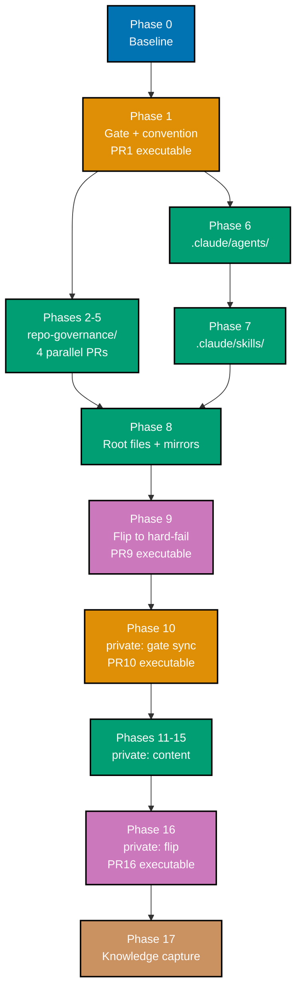

# Delivery Checklist: Optimize Governance Markdown

> **Legend** — `[AI]`: an agent performs the step (the default; unmarked steps are `[AI]`).
> `[HUMAN]`: only a human can do it. `[AI+HUMAN]`: agent prepares, human approves.
>
> **This plan contains zero `[HUMAN]` steps.** See §Fully AI-Deliverable below.
>
> **Phase Gate** — every phase ends with a `### Phase N Gate` (must-pass verification) plus a
> `> **Pause Safety**:` note. A phase is not complete until its gate is green; do not start
> phase N+1 while any gate check fails.

## Worktree

| Repo                | Worktree path                      | Branch                            |
| ------------------- | ---------------------------------- | --------------------------------- |
| `ose-public`        | `worktrees/optimize-governance-md` | `worktree/optimize-governance-md` |
| The private sibling | `worktrees/optimize-governance-md` | `worktree/optimize-governance-md` |

**Exactly one worktree named `optimize-governance-md` per repository**, reused across every delivery unit
landed there — the
[one-worktree-per-repo-per-plan HARD RULE](../../../repo-governance/conventions/structure/plans/worktree-cap.md#worktree-cap--one-worktree-per-repository-per-plan-hard-rule).
Two repos, two worktrees, no more. Verify with `git worktree list` before creating anything.

After `git worktree add` in the private sibling, run `npm install` **and**
`npm run doctor -- --fix` per
[Worktree Toolchain Initialization](../../../repo-governance/development/workflow/worktree-setup.md).

Optional manual pre-provisioning (run from each repo's root):

```bash
claude --worktree optimize-governance-md
```

Phase 0 enters this worktree by default; the command above only pre-provisions it. `optimize-governance-md`
matches the plan-folder identifier per the
[Worktree Specification HARD RULE](../../../repo-governance/conventions/structure/plans/worktree-specification.md#worktree-specification)
— no naming deviation. (See `brd.md` §Constraints for the note on the `ose-public` worktree's
mid-session rename from its original shorter provisioning name.)

## Delivery Mode: worktree-to-pr

Mandatory in both repos — `main` is branch-protected. Each PR is behaviour-classified:

| PR class                     | Classification      | Merge requirement                                                                        |
| ---------------------------- | ------------------- | ---------------------------------------------------------------------------------------- |
| rhino-cli gate PRs (4 total) | eligible executable | Up to seven CI-gated review cycles; exit at first clean code MEDIUM/HIGH/CRITICAL result |
| Markdown-only PRs (13 total) | noneligible static  | Green `.github/workflows/pr-quality-gate.yml`, then merge                                |

`[AI]` merges by default once all five hardened preconditions hold.

## Fully AI-Deliverable

Every step below is `[AI]`. Grounded per category:

| Category               | Why no human is required                                                                       |
| ---------------------- | ---------------------------------------------------------------------------------------------- |
| Worktree create/remove | Git-mechanical steps are `[AI]` in all three OSE repos                                         |
| Commits and pushes     | Push targets are plan branches and PRs, never `main`, never a `prod-*`/`stag-*` deploy ref     |
| PR merges              | `[AI]` merges by default under Delivery Mode; markdown-only PRs need only a green quality gate |
| Secrets                | No step reads, writes, or references `.env.prod`, `.env.stag`, or any real secret              |
| Git identity           | No step runs `git config user.*` at any scope or edits `.git/config`                           |
| Infrastructure         | No deploys, no runner provisioning, no external service calls                                  |
| Verification           | Gate execution, log reading, and local agent invocation — all in-repo and reproducible         |
| CI                     | Polled with `gh run view --json status,conclusion` every 2 minutes; never `gh run watch`       |

## Quality Gate Discipline

**Fix ALL failures found during any quality gate run in this plan, not just those caused by
your own changes.** This is a standing instruction that applies to every "Verify" checkbox, every
`### Phase N Gate`, and every pre-push/CI run across Phases 1–17 — not only Phase 0's baseline
resolution. Hitting a preexisting failure mid-phase (e.g. during one of the repeated subtree
"Verify" checkboxes in Phases 2–5/11–15) is not a reason to defer it; fix it in the same phase per
the repo's Root Cause Orientation principle.

### Commit Guidelines

- Commit changes thematically — group related changes into logically cohesive commits, never one
  giant commit per PR.
- Follow Conventional Commits format: `<type>(<scope>): <description>` (e.g.,
  `feat(rhino-cli): replace byte budget with word-count gate`,
  `docs(governance): rewrite instruction-file-size-budget as governance-word-budget`).
- Split different domains/concerns into separate commits — a Rust gate-implementation change, a
  `repo-config.yml` edit, a convention-doc rename, and Gherkin spec changes (all present together
  in Phase 1 and Phase 9) are each their own commit, not one bundled commit.
- Do NOT bundle unrelated fixes into a single commit.

## Parallelization Model

**N=3** background agents plus one main-thread orchestrator (the N+1 model). The orchestrator
stays vacant — it does not take a split subtree itself. Independent subtrees fan out; dependent
phases serialize per the DAG below.

Every agent maintains a **file-touch ledger**, reproduced in full through every compaction and
handoff, reconciled against `git status` before staging. `git status` is the union of everyone's
work — anything not on your ledger belongs to another actor.

Cleanup (Phase 17's worktree-removal step) is the terminal node — it depends on every other
delivery node (via the linear DAG below) so it never removes a worktree, branch, or artifact an
in-flight node still needs.

### DAG Registry



**Fan-out windows**: Phases 2–6 are independent (N=3 concurrent). Phases 11–15 are independent
within the private sibling. Everything else serializes.

### Delivery Boundaries

[Repo-grounded — every phase from 1 onward is its own delivery unit; this plan's markdown-only
phases are independent parallel splits (rule 5 of the PRs-Open-at-Delivery-Boundaries HARD RULE),
so each opens its own PR rather than batching into a shared unit] Branch is the single
`worktree/optimize-governance-md` branch declared in `## Worktree` above, reused sequentially — each PR
merges before the next phase in the same repo begins its own commits.

| Phase(s) | Delivery unit                                    | Worktree                           | Branch                            | PR opens                 |
| -------- | ------------------------------------------------ | ---------------------------------- | --------------------------------- | ------------------------ |
| 0        | — (setup and baseline, `ose-public`)             | —                                  | —                                 | no                       |
| 1        | Gate implementation (`ose-public`)               | `worktrees/optimize-governance-md` | `worktree/optimize-governance-md` | yes — at Phase 1 (PR1)   |
| 2        | `repo-governance/conventions/` split             | `worktrees/optimize-governance-md` | `worktree/optimize-governance-md` | yes — at Phase 2 (PR2)   |
| 3        | `repo-governance/development/` split             | `worktrees/optimize-governance-md` | `worktree/optimize-governance-md` | yes — at Phase 3 (PR3)   |
| 4        | `repo-governance/workflows/` split               | `worktrees/optimize-governance-md` | `worktree/optimize-governance-md` | yes — at Phase 4 (PR4)   |
| 5        | `principles/`, `vision/`, architecture split     | `worktrees/optimize-governance-md` | `worktree/optimize-governance-md` | yes — at Phase 5 (PR5)   |
| 6        | `.claude/agents/` → skills migration             | `worktrees/optimize-governance-md` | `worktree/optimize-governance-md` | yes — at Phase 6 (PR6)   |
| 7        | `.claude/skills/` split                          | `worktrees/optimize-governance-md` | `worktree/optimize-governance-md` | yes — at Phase 7 (PR7)   |
| 8        | Root instruction files                           | `worktrees/optimize-governance-md` | `worktree/optimize-governance-md` | yes — at Phase 8 (PR8)   |
| 9        | Arm the gates (`ose-public`)                     | `worktrees/optimize-governance-md` | `worktree/optimize-governance-md` | yes — at Phase 9 (PR9)   |
| 10       | The private sibling gate sync                    | `worktrees/optimize-governance-md` | `worktree/optimize-governance-md` | yes — at Phase 10 (PR10) |
| 11       | `repo-governance/conventions/` split (private)   | `worktrees/optimize-governance-md` | `worktree/optimize-governance-md` | yes — at Phase 11 (PR11) |
| 12       | `repo-governance/development/` split (private)   | `worktrees/optimize-governance-md` | `worktree/optimize-governance-md` | yes — at Phase 12 (PR12) |
| 13       | `workflows/`, `principles/`, `vision/` (private) | `worktrees/optimize-governance-md` | `worktree/optimize-governance-md` | yes — at Phase 13 (PR13) |
| 14       | `.claude/agents/` → skills (private)             | `worktrees/optimize-governance-md` | `worktree/optimize-governance-md` | yes — at Phase 14 (PR14) |
| 15       | `.claude/skills/`, root files (private)          | `worktrees/optimize-governance-md` | `worktree/optimize-governance-md` | yes — at Phase 15 (PR15) |
| 16       | Arm the gates (the private sibling)              | `worktrees/optimize-governance-md` | `worktree/optimize-governance-md` | yes — at Phase 16 (PR16) |
| 17       | Knowledge capture and archival (`ose-public`)    | `worktrees/optimize-governance-md` | `worktree/optimize-governance-md` | yes — at Phase 17 (PR17) |

---

## PR Map

| PR   | Phase | Repo    | Class      | Contents                                                 |
| ---- | ----- | ------- | ---------- | -------------------------------------------------------- |
| PR1  | 1     | public  | executable | Gate impl, config, convention rename, specs, removals    |
| PR2  | 2     | public  | markdown   | `repo-governance/conventions/`                           |
| PR3  | 3     | public  | markdown   | `repo-governance/development/`                           |
| PR4  | 4     | public  | markdown   | `repo-governance/workflows/`                             |
| PR5  | 5     | public  | markdown   | `repo-governance/principles/`, `vision/`, architecture   |
| PR6  | 6     | public  | markdown   | `.claude/agents/` → skills, mirrors                      |
| PR7  | 7     | public  | markdown   | `.claude/skills/`, mirrors                               |
| PR8  | 8     | public  | markdown   | `AGENTS.md`, `CLAUDE.md`, root indexes, final mirrors    |
| PR9  | 9     | public  | executable | Flip to hard-fail; arm word-budget + readme-completeness |
| PR10 | 10    | private | executable | Byte-identical rhino-cli sync, config, specs             |
| PR11 | 11    | private | markdown   | `repo-governance/conventions/`                           |
| PR12 | 12    | private | markdown   | `repo-governance/development/`                           |
| PR13 | 13    | private | markdown   | `repo-governance/workflows/`, `principles/`, `vision/`   |
| PR14 | 14    | private | markdown   | `.claude/agents/` → skills, mirrors                      |
| PR15 | 15    | private | markdown   | `.claude/skills/`, `AGENTS.md`, `CLAUDE.md`, mirrors     |
| PR16 | 16    | private | executable | Flip to hard-fail; arm word-budget + readme-completeness |
| PR17 | 17    | public  | markdown   | Knowledge capture; plan-folder archival to `plans/done/` |

**17 PRs, 4 executable.** No PR opens before Phase 1 — Phase 0 opens none. PR17 exists because
Phase 17's archival diff (`git mv` of the plan folder, README updates) is a real, git-tracked
change to `ose-public`, and `main` is branch-protected under `worktree-to-pr` — see Finding 9 of
the 2026-08-13 plan audit.

---

## Phase 0 — Baseline (`ose-public`)

No PR. Establishes a clean, known-good starting state.

- [x] `[AI]` Verify exactly one `optimize-governance-md` worktree exists: `git worktree list`
      **Date**: 2026-08-13. **Status**: Done. **Files Changed**: none (verification only).
      Confirmed exactly one entry: `~/ose-projects/ose-public/worktrees/optimize-governance-md`
      on branch `worktree/optimize-governance-md`.
- [x] `[AI]` `npm install`
      **Date**: 2026-08-13. **Status**: Done. **Files Changed**: `node_modules/` (regenerated,
      gitignored). Completed successfully; 57 npm-audit vulnerabilities reported, all preexisting
      baseline noise (not actionable per project convention).
- [x] `[AI]` `npm run doctor -- --fix`
      **Date**: 2026-08-13. **Status**: Done. **Files Changed**: none (toolchain check only).
      15/16 tools OK; 1 warning (npm v11.16.0 vs required v11.11.0, preexisting env variance, not
      auto-fixable); 4 crate target-shares created/fixed.
- [x] `[AI]` Record the violation census to `evidence/phase-0-census.txt`:
      `find repo-governance .claude .cursor .codex .opencode .pi .amazonq -name '*.md' -type f -print0 | xargs -0 wc -w | grep -v ' total$' | sort -rn`
      **Date**: 2026-08-13. **Status**: Done. **Files Changed**:
      `plans/in-progress/optimize-governance-md/evidence/phase-0-census.txt` (new). 552 files
      scanned; largest is `repo-governance/development/agents/ai-agents.md` at 14,720 words.
- [x] `[AI]` Record README-index coverage to `evidence/phase-0-readme-coverage.txt`
      **Date**: 2026-08-13. **Status**: Done. **Files Changed**:
      `plans/in-progress/optimize-governance-md/evidence/phase-0-readme-coverage.txt` (new).
      `md readme-index validate` (pre-rename baseline command) exits 0: no orphan/ghost findings.
- [x] `[AI]` Record frontmatter coverage to `evidence/phase-0-frontmatter.txt`
      **Date**: 2026-08-13. **Status**: Done. **Files Changed**:
      `plans/in-progress/optimize-governance-md/evidence/phase-0-frontmatter.txt` (new). `md
frontmatter validate` passes with 37 warn findings, all `missing-description` — consistent
      with `brd.md`'s 187/214 baseline (214-187=27, plus non-`repo-governance` warns bring the
      total to 37).
- [x] `[AI]` Run the full pre-push surface and resolve every preexisting failure:
      `apps/rhino-cli/scripts/rhino-bin.sh gate run --surface=pre-push`
      **Date**: 2026-08-13. **Status**: Done. **Files Changed**: none. Exit 0, zero preexisting
      failures — env-validate, md-links, md-readme-index, harness-duplication, parity-manifest,
      naming, shell-docker-actions, specs all passed; test:quick/compat-min-version/specs-structure
      had no affected tasks (clean tree vs origin/main).
- [x] `[AI]` **Cursor subdirectory-recursion research refresh** — the one open research gap, resolved
      without a live IDE launch (no CLI/API exists for an agent to observe Cursor GUI behavior;
      see [User Decisions Required — `cursor_smoke_test_tagging`, resolved `redesign_research_only`]).
      Delegate to `web-researcher`: re-check [cursor.com/docs/subagents](https://cursor.com/docs/subagents),
      the Cursor changelog, and the Cursor GitHub issue tracker for any newly-documented
      `.cursor/agents/` subdirectory support. Record the result — cited findings + access date, or
      "no new information found" — in `evidence/phase-0-cursor-recursion.md`. The plan proceeds with
      flat mirrors either way (per `prd.md` §FR-3.16, which treats Cursor as unsupported until proven
      otherwise), so this is informational, not blocking.
      **Date**: 2026-08-13. **Status**: Done. **Files Changed**:
      `plans/in-progress/optimize-governance-md/evidence/phase-0-cursor-recursion.md` (new). No
      change from prior finding — `.cursor/agents/` subdirectory discovery remains unsupported
      (official docs silent, open unresolved forum feature request). Plan proceeds with flat
      mirrors per FR-3.16.

### Phase 0 Gate

- `git worktree list` shows exactly one `optimize-governance-md` entry
- `gate run --surface=pre-push` exits 0 with no preexisting failures
- All three census files exist and are non-empty
- The Cursor research-refresh result is recorded in `evidence/phase-0-cursor-recursion.md`

> **Pause Safety**: nothing has changed. Safe to stop indefinitely.

---

## Phase 1 — Gate implementation (`ose-public`, PR1, executable)

### 1a. RED — failing tests first

- [x] `[AI]` Write unit tests in `apps/rhino-cli/src/application/governance/word_budget.rs`
      covering every FR-1 and FR-2 scenario in `prd.md`
      **Date**: 2026-08-13. **Status**: Done. **Files Changed**:
      `apps/rhino-cli/src/application/repo_governance/instruction_size.rs` (tests added; the
      `git mv` to `word_budget.rs` is a Phase 1b step). ~20 new tests covering `word_count()`-based
      classification, `check_instruction_sizes`/`resolve_tree_size`/`check_resolved_tree` word-shaped
      fixtures, exemption-key schema rejection, old-command/config-block/gate-id-gone proxy tests
      against live `repo-config.yml`, and no-broken-inbound-link scan.

  **Gherkin (underpins) →** "A file within target passes silently"; "A file between target and
  fail warns without blocking"; "A file over the ceiling fails the gate"; "Every covered surface
  is scanned"; "Non-prose content counts toward the budget"; "An out-of-scope file is never
  scanned"; "The config schema rejects an exemption key"; "The old command is gone"; "The old
  config block is gone"; "The old gate id is gone from the registry"; "The resolved tree is
  measured in words"; "An oversized resolved tree fails"; "Import cycles terminate"; "No inbound
  link to the renamed convention is left broken"

- [x] `[AI]` Write a dedicated unit test in `apps/rhino-cli/src/application/governance/
word_budget.rs` asserting `check_instruction_sizes` resolves surface overlap by
      **selecting the winning surface before classifying**, not by comparing candidate findings
      after the fact: build a `BudgetConfig` with two surfaces matching the same path (a general
      `fail: 500` surface declared first, a specific `fail: 900` surface declared second) against
      a file sized to fail the general surface but only warn the specific one; assert the
      returned findings contain exactly **one** finding for that path, with the specific
      surface's `target`/`warn`/`fail`/severity — not two findings, and not the general surface's
      `Fail`. This targets the precedence rule as new **selection logic** in code (`tech-docs.md`
      §1.1/§1.3), not merely YAML declaration order

  **Gherkin (binds) →** "A README.md file uses the wider README-specific glob threshold"

  ```gherkin
  Scenario: A README.md file uses the wider README-specific glob threshold
    Given "repo-governance/development/quality/README.md" contains 850 words
    When I run "rhino-cli governance word-budget validate"
    Then the exit code is 0
    And the output contains a "warn" finding naming that file, not a "fail" finding
  ```

  **Date**: 2026-08-13. **Status**: Done. **Files Changed**:
  `apps/rhino-cli/src/application/repo_governance/instruction_size.rs`. Added the Warn/Fail-winner
  overlap test: 850-byte-shaped fixture, general `fail:500` (declared first) vs specific `fail:900`
  (declared second) — asserts exactly one Warn finding from the specific surface. This test itself
  compiles against current production code; the aggregate `test:unit` run still fails because
  other new tests in the same binary (different files) reference symbols Phase 1b hasn't added
  yet, so this test's actual pass/fail won't be observable until GREEN — at which point it must
  pass, proving the select-then-classify fix.

- [x] `[AI]` Write a second dedicated unit test in the same file covering the **Ok-winner case**:
      build a `BudgetConfig` with the same two overlapping surfaces (general `fail: 500` declared
      first, specific `fail: 900` declared second) against a fixture file sized at 670 words —
      large enough that the general surface alone would classify it `Fail`, but within the
      specific surface's own `target: 700` (so the specific surface's own verdict is `Ok`); assert
      `check_instruction_sizes` returns **zero** findings for that path. This is the case
      iteration 7's remediation missed: a "keep the more severe of the candidate findings"
      design produces no candidate to keep when the winning surface's own verdict is Ok, so it
      silently leaves the general surface's `Fail` unfiltered — this test targets that specific
      failure mode

  **Gherkin (binds) →** "A README.md file under the specific-surface target produces zero
  findings"

  ```gherkin
  Scenario: A README.md file under the specific-surface target produces zero findings
    Given "repo-governance/development/quality/README.md" contains 670 words
    When I run "rhino-cli governance word-budget validate"
    Then the exit code is 0
    And the output contains no finding naming that file
    And this holds even though 670 words exceeds the general surface's 500-word fail ceiling,
      because the winning README-specific surface classifies 670 words as "ok" against its own
      700-word target
  ```

  **Date**: 2026-08-13. **Status**: Done. **Files Changed**:
  `apps/rhino-cli/src/application/repo_governance/instruction_size.rs` —
  `check_instruction_sizes_selects_winning_surface_before_classifying_ok_case`. Same overlap
  fixtures, 670-byte-shaped file — asserts zero findings. Not yet executable (blocked by unrelated
  compile errors in the same test binary from other new tests), part of the aggregate RED.

- [x] `[AI]` Write unit tests for the README-index gate covering every FR-3 scenario

  **Gherkin (underpins) →** "A complete index passes"; "A missing sibling link fails"; "A missing
  subdirectory README link fails"; "A missing README fails when siblings exist"; "The rule does
  not reach grandchildren"; "A split directory is exempt and its parent indexes it"; "A split
  directory whose parent omits a child fails"; "An uncovered tree is not scanned"; "A generated
  mirror directory is not scanned"; "A generated mirror is still subject to the word budget"; "The
  Phase 1 rename introduces no enforcement gap for orphan or ghost"; "The unannotated finding kind
  is dark-launched, not enforced, before Phase 9"; "The unannotated finding kind fails once armed
  and in scope"

  **Date**: 2026-08-13. **Status**: Done. **Files Changed**:
  `apps/rhino-cli/src/application/repo_governance/readme_index_audit.rs` (13 `scenario_*` tests
  added, matching every named Gherkin scenario). "Fails once armed" is Phase 9's gate-wiring
  concern (CI registry state), not a unit-testable behavior at this phase — this phase covers the
  discoverability of the `unannotated` kind (`scenario_unannotated_finding_kind_is_discoverable`).

- [x] `[AI]` Write unit tests in `apps/rhino-cli/src/commands/governance_validate_readme_index.rs`
      for the FR-5.8 mechanism: `--paths` overrides `DEFAULT_PATHS` when given and leaves it
      unchanged when absent; `--fail-kinds` restricts which discovered finding kinds contribute to
      the nonzero exit code while every kind is still discovered and printed regardless

  **Gherkin (underpins) →** "The --paths flag overrides the default scan scope"; "The
  --fail-kinds flag restricts which findings contribute to the exit code"

  **Date**: 2026-08-13. **Status**: Done. **Files Changed**:
  `apps/rhino-cli/src/commands/md_validate_readme_index.rs` (tests added; `git mv` to
  `governance_validate_readme_index.rs` is a Phase 1b step) — 4 tests referencing hypothetical
  `ReadmeIndexAuditArgs.paths`/`.fail_kinds` fields and `resolve_scan_paths`/`has_failing_finding`
  helpers; compile-fails today (E0560/E0425), confirmed in the RED run below.

- [x] `[AI]` Write a unit test in `apps/rhino-cli/src/application/docs/frontmatter.rs` asserting
      `validate_governance_schema` reports a `KIND_MISSING_WHEN_TO_USE` finding at **WARN**
      severity for a governance file missing `when_to_use` — the dark-launched, not-yet-armed
      FR-4.1 behavior (see `tech-docs.md` §5 "Dark-launch sequencing"). The FAIL-severity
      end-state scenarios in `prd.md` §FR-4 (including "A missing description now fails, not
      warns") are Phase 9's RED target, not Phase 1's

  **Gherkin (binds) →** "A missing when_to_use warns during Phase 1's dark-launch, before
  enforcement is armed"

  ```gherkin
  Scenario: A missing when_to_use warns during Phase 1's dark-launch, before enforcement is armed
    Given "repo-governance/conventions/formatting/linking.md" frontmatter has no "when_to_use"
    And Phase 1 has registered the check but not yet armed it to FAIL severity
    When I run "rhino-cli md frontmatter validate"
    Then the exit code is 0
    And the output contains a "when_to_use" finding at "warn" severity
  ```

  **Date**: 2026-08-13. **Status**: Done. **Files Changed**:
  `apps/rhino-cli/src/application/docs/frontmatter.rs` —
  `governance_missing_when_to_use_warns_dark_launched`, asserting `KIND_MISSING_WHEN_TO_USE` at
  `SEVERITY_WARN`. Compile-fails today (neither constant exists), confirmed in the RED run below.

- [x] `[AI]` Write the companion Gherkin under
      `specs/apps/rhino/behavior/rhino-cli/gherkin/governance/`
      **Date**: 2026-08-13. **Status**: Done. **Files Changed**:
      `specs/apps/rhino/behavior/rhino-cli/gherkin/governance/governance-word-budget.feature`,
      `governance-readme-index.feature`, `README.md` (all new). Cover the FR-1/FR-2 and FR-3
      Gherkin scenarios named above, plus the `--paths`/`--fail-kinds` flag scenarios.
- [x] **Command**: `npx nx run rhino-cli:test:unit`
      **Date**: 2026-08-13. **Status**: Done. Ran directly via
      `cargo test --manifest-path apps/rhino-cli/Cargo.toml --lib -- --test-threads=1` (equivalent
      to the Nx target's first stage). Exit non-zero as expected — see next item.
- [x] **Acceptance**: the run fails, and the failures are the new tests — not compilation errors
      in unrelated modules
      **Date**: 2026-08-13. **Status**: Done. Verified directly (not just agent-reported): 15
      compile errors, all E0425/E0560, all naming symbols the new tests deliberately reference
      (`word_count`, `KIND_MISSING_WHEN_TO_USE`, `ReadmeIndexAuditArgs.paths`/`.fail_kinds`,
      `resolve_scan_paths`, `has_failing_finding`) — zero errors in code outside the new test
      additions. `cargo build` (non-test) confirmed clean, proving production code is untouched.

### 1b. GREEN — make them pass

- [x] `[AI]` `git mv` `instruction_size.rs` → `application/governance/word_budget.rs`; replace
      the byte metric with `split_whitespace().count()`
      **Date**: 2026-08-13. **Status**: Done. **Files Changed**:
      `apps/rhino-cli/src/application/governance/word_budget.rs` (renamed, verified via `git status`
      showing the old path deleted and new path untracked-then-present). Delegated to
      `swe-rust-dev`, independently verified: file exists at new path, old path gone,
      `split_whitespace().count()`-based metric confirmed by grep.
- [x] `[AI]` Implement per-path overlap precedence in `word_budget.rs`'s `check_instruction_sizes`
      by restructuring the iteration order — **select the winning surface for each path before
      classifying it, never classify-then-compare**. Concretely: replace the current "for each
      surface, classify every matching file and push a candidate if non-Ok" loop with two passes.
      Pass 1: for each surface in declaration order, glob-match its files and record, per
      resolved path, the **most recently matched surface** in a `path -> &Surface` map (a plain
      `HashMap::insert` per match is sufficient — because surfaces are iterated in
      `config.surfaces` declaration order, a later-declared surface's match always overwrites an
      earlier one for the same path, so the map holds the last-declared — i.e. winning — surface
      per path with no extra index bookkeeping needed). Pass 2: for each `(path, winning_surface)`
      entry, call `classify()` **exactly once**, using only the winning surface's
      `target`/`warn`/`fail`, and push a `Finding` **only if that single classification is not
      `Severity::Ok`**. This is new selection logic — the current `instruction_size.rs` has none
      (`tech-docs.md` §1.1) — required for both dedicated unit tests above (the Warn/Fail-winner
      case and the Ok-winner case) and for FR-1.6/FR-3.15's three README-glob Gherkin scenarios in
      `prd.md` to pass. The prior design (dedup over the results of the existing Ok-filtered
      per-surface loop) is insufficient: it never generates a candidate to keep when the winning
      surface's own verdict is Ok, so a stray Fail from a less-specific, earlier-declared surface
      survives unfiltered for that path — this restructured select-then-classify order removes
      that failure mode structurally, because the earlier-declared surface's classification is
      never computed for a path a later surface also matches

  **Date**: 2026-08-13. **Status**: Done. **Files Changed**:
  `apps/rhino-cli/src/application/governance/word_budget.rs`. Independently verified via grep:
  `HashMap<PathBuf, &Surface>` winners map at line 268, two-pass structure present. Both Phase 1a
  precedence tests (`_warn_case`, `_ok_case`) confirmed passing in the independent `test:unit` run.

- [x] `[AI]` `git mv` `commands/harness_validate_instruction_size.rs` →
      `commands/governance_validate_word_budget.rs`; then fold
      `commands/convention_validate_instruction_size.rs`'s implementation body (the `SCHEMA`
      const, `run_for_root`, finding construction, and text/JSON/markdown formatters — the real
      logic the thin wrapper delegated to) directly into that same file, and `git rm`
      `convention_validate_instruction_size.rs` — per `tech-docs.md` §1.4's Command file merge
      note
      **Date**: 2026-08-13. **Status**: Done. **Files Changed**:
      `apps/rhino-cli/src/commands/governance_validate_word_budget.rs` (new, merged),
      `apps/rhino-cli/src/commands/convention_validate_instruction_size.rs` (deleted). Both
      confirmed via `git status`/`test -f`.
- [x] `[AI]` Update `apps/rhino-cli/src/commands.rs`: remove the `pub mod
convention_validate_instruction_size;` declaration entirely (its file is merged away) and rename
      `pub mod harness_validate_instruction_size;` to `pub mod governance_validate_word_budget;`
      **Date**: 2026-08-13. **Status**: Done. **Files Changed**: `apps/rhino-cli/src/commands.rs`.
      Verified via grep: both new mod lines present, both old ones absent.
- [x] `[AI]` Update `apps/rhino-cli/src/cli.rs`: rewrite the `#[command(name =
"instruction-size", subcommand)]` command tree and the `Validate(...)` dispatch to
      `governance word-budget validate`, and rewrite the two unit tests that assert the OLD
      command structure — `verb_last_harness_instruction_size_validate_parses` and
      `verb_middle_convention_validate_instruction_size_no_longer_parses`
      **Date**: 2026-08-13. **Status**: Done. **Files Changed**: `apps/rhino-cli/src/cli.rs`.
      Verified via grep: `governance` subcommand tree at line 95,
      `verb_last_governance_word_budget_validate_parses` and
      `verb_last_governance_readme_index_validate_parses` present; old-structure negative-assertion
      tests confirm the removed forms no longer parse.
- [x] `[AI]` Update `apps/rhino-cli/src/application/repo_governance/audit_orchestrator.rs`:
      rename the `"instruction-size"` category name, command-name mapping, and `match` arm
      dispatching to `audit_instruction_size` (which calls `merged_budget_config` directly — see
      the corrected FR-1.15 framing in `prd.md`) to `"governance-word-budget"`, and update its
      five unit test assertions referencing the literal string `"instruction-size"`
      **Date**: 2026-08-13. **Status**: Done. **Files Changed**:
      `apps/rhino-cli/src/application/repo_governance/audit_orchestrator.rs`. Verified via grep:
      zero `"instruction-size"` matches, `"governance-word-budget"` used throughout category name,
      command mapping, match arm, and test assertions.
- [x] `[AI]` Update `apps/rhino-cli/src/commands/harness_audit.rs`: rename its separate
      `"validate-instruction-size"` member, `match` arm, and unit test
      (`MEMBERS.contains(&"validate-instruction-size")`) to the new command name
      **Date**: 2026-08-13. **Status**: Done. **Files Changed**:
      `apps/rhino-cli/src/commands/harness_audit.rs`. Renamed to `"validate-word-budget"`. Verified
      via grep: member, dispatch match arm, and test assertion all present; zero
      `"instruction-size"` matches.
- [x] `[AI]` In `apps/rhino-cli/src/application/repo_governance/mod.rs`, remove `pub mod
instruction_size;` (the module moves to a new parent, not a sibling rename); in
      `apps/rhino-cli/src/application/mod.rs`, add a new `pub mod governance;` line — the
      `application/governance/` directory does not exist yet and needs this declaration
      **Date**: 2026-08-13. **Status**: Done. **Files Changed**:
      `apps/rhino-cli/src/application/repo_governance/mod.rs`,
      `apps/rhino-cli/src/application/mod.rs`. Verified via grep: no stale `pub mod
      instruction_size;`/`readme_index_audit;`, `pub mod governance;` present.
- [x] `[AI]` Update `apps/rhino-cli/src/application/repo_config/mod.rs`: rename the
      `#[serde(rename = "instruction-size", default)] pub instruction_size: Option<BudgetConfig>`
      field to `governance-word-budget`, and repoint its `use` of `BudgetConfig` to
      `application::governance::word_budget`
      **Date**: 2026-08-13. **Status**: Done. **Files Changed**:
      `apps/rhino-cli/src/application/repo_config/mod.rs`. Verified via grep: field
      `governance_word_budget` with `#[serde(rename = "governance-word-budget")]` at line 389-390;
      `use crate::application::governance::word_budget::BudgetConfig;` at line 17.
- [x] `[AI]` **Rename, do not rebuild** (per `prd.md` §FR-3 "Repurpose, do not rebuild" and
      `tech-docs.md` §1.1): `git mv
apps/rhino-cli/src/application/repo_governance/readme_index_audit.rs` →
      `apps/rhino-cli/src/application/governance/readme_index.rs`, and `git mv
apps/rhino-cli/src/commands/md_validate_readme_index.rs` →
      `apps/rhino-cli/src/commands/governance_validate_readme_index.rs`. Preserve the existing
      `orphan`/`ghost` detection logic and the current `DEFAULT_PATHS` (4 entries) unchanged —
      that behavior stays exactly as it is today
      **Date**: 2026-08-13. **Status**: Done. **Files Changed**:
      `apps/rhino-cli/src/application/governance/readme_index.rs`,
      `apps/rhino-cli/src/commands/governance_validate_readme_index.rs` (renamed). Verified: both
      new paths exist, old paths gone, `DEFAULT_PATHS` still 4 entries unchanged.
- [x] `[AI]` In `apps/rhino-cli/src/cli.rs`, remove `ReadmeIndex(MdReadmeIndexCommands)` from
      `MdCommands` and add it under a new `#[command(name = "governance", subcommand)]` tree
      alongside `word-budget`, so the CLI surface becomes `governance readme-index validate`
      (was `md readme-index validate`)
      **Date**: 2026-08-13. **Status**: Done. **Files Changed**: `apps/rhino-cli/src/cli.rs`.
      Verified via grep: `ReadmeIndex(GovernanceReadmeIndexCommands)` now under
      `GovernanceCommands`, not `MdCommands`; dispatch confirmed at
      `GovernanceCommands::ReadmeIndex`.
- [x] `[AI]` In `apps/rhino-cli/src/commands.rs`, rename `pub mod md_validate_readme_index;` to
      `pub mod governance_validate_readme_index;`
      **Date**: 2026-08-13. **Status**: Done. **Files Changed**: `apps/rhino-cli/src/commands.rs`.
      Verified via grep (already confirmed as part of task #84's check): `pub mod
governance_validate_readme_index;` present, old name absent.
- [x] `[AI]` Add a `generate` path (FR-3.12) and two new finding kinds to the renamed module:
      `missing` (a covered directory needing an index has none — FR-3.1) and `unannotated` (an
      entry lacks the derived-annotation format or has drifted from the target's frontmatter —
      FR-3.10/FR-3.11/FR-3.14). Widen the module's internal covered-tree constant to FR-3.7's
      full 6-entry list (`repo-governance/`, `.claude/`, `.codex/`, `.pi/`, `docs/`, `specs/` —
      never `plans/`, `apps/`, `libs/`, or the generated mirror trees) for use by the
      `governance-readme-completeness` gate (below) — the continuity-preserving
      `governance-readme-index` gate keeps the original, unwidened `DEFAULT_PATHS`
      **Date**: 2026-08-13. **Status**: Done. **Files Changed**:
      `apps/rhino-cli/src/application/governance/readme_index.rs` (`"missing"`/`"unannotated"`
      finding-kind literals; `generate_readme_index`/`generate_root`/`generate_one_dir`/
      `generate_index_file` and frontmatter-derivation helpers, FR-3.12),
      `apps/rhino-cli/src/commands/governance_generate_readme_index.rs` (new — CLI plumbing for
      `governance readme-index generate`), `apps/rhino-cli/src/application/fs/port.rs` (new
      `Fs::write_string`), `apps/rhino-cli/src/infrastructure/fs/real.rs` +
      `apps/rhino-cli/src/application/fs/mock.rs` (impls), `apps/rhino-cli/src/cli.rs` +
      `apps/rhino-cli/src/commands.rs` (dispatch wiring). Verified independently (not just the
      delegated agent's self-report): `test -f` on the new command file (234 lines), `grep` for
      all four `generate_*` functions, `grep` for `write_string` across the port/real/mock trio,
      `grep` for `Generate` wiring in `cli.rs` (both the enum variant and the match arm), `grep`
      for the new mod declaration in `commands.rs` — then personally re-ran
      `npx nx run rhino-cli:test:unit --skip-nx-cache` myself (exit 0, `Successfully ran target
test:unit for project rhino-cli`), independent of the delegated agent's own test run. The
      "widen the covered-tree constant" sub-requirement is satisfied structurally, not via a
      second Rust constant: `DEFAULT_PATHS` in `governance_validate_readme_index.rs` stays the
      original unwidened 4-entry list (confirmed via `grep`), and its own doc comment now states
      "The widened FR-3.7 6-entry scope is passed explicitly via `--paths` by the separate
      `governance-readme-completeness` registration" — matching `tech-docs.md` §4's mechanism
      table verbatim ("`governance-readme-completeness` passes FR-3.7's widened 6-entry list" as
      literal `--paths` YAML args at Phase 1d registration, not a baked-in Rust list). No
      `governance-readme-completeness` gate exists in `repo-config.yml` yet — confirmed via grep
      (zero matches) — its registration is explicitly Phase 1d's task (delivery.md line ~955),
      not this one. **Follow-up obligation flagged by the delegated agent (not yet acted on)**:
      `apps/rhino-cli/parity-manifest.sha256` needs regenerating before Phase 1e's PR, since new
      source files were added under the cross-repo parity boundary.
- [x] `[AI]` Add two repeatable CLI flags to `ReadmeIndexAuditArgs` in
      `apps/rhino-cli/src/commands/governance_validate_readme_index.rs` (per `tech-docs.md` §4
      "The mechanism" and `prd.md` FR-5.8/FR-1.10/FR-1.11): `--paths <path>` (when given, replaces
      `DEFAULT_PATHS` for this invocation; when absent, `DEFAULT_PATHS` is used exactly as today)
      and `--fail-kinds <kind>` (when given, restricts which discovered finding kinds contribute
      to the nonzero exit code; every kind is still discovered and printed regardless — when
      absent, all kinds fail, preserving today's standalone-CLI behavior). Both flags map onto
      `repo-config.yml`'s existing `args:` → `fixed_arguments()` repeated-`--<key> <value>`
      mechanism (`apps/rhino-cli/src/application/repo_config/mod.rs::fixed_arguments`) — no
      change to that mechanism is needed
      **Date**: 2026-08-13. **Status**: Done. **Files Changed**:
      `apps/rhino-cli/src/commands/governance_validate_readme_index.rs`. Verified via grep:
      `--paths`/`--fail-kinds` args, `resolve_scan_paths`/`has_failing_finding` helpers all present
      with correct override/restrict semantics (empty `fail_kinds` = all kinds fail, preserving
      today's behavior).
- [x] `[AI]` In `repo-config.yml`, rename the `md-readme-index` gate entry **in place** to
      `governance-readme-index` — same `command:` update, same `scope: all-file-type` on both
      `pre-push` and `ci`, plus one new `args: { fail-kinds: [orphan, ghost] }` block (`prd.md`
      FR-1.10/FR-1.11's YAML) so a `missing`/`unannotated` finding surfacing inside this gate's
      unchanged scan scope is reported but never fails the build. No `paths:` override is added —
      omitting it keeps this gate scanning the original, unwidened `DEFAULT_PATHS`. This is still
      a straight rename, not a delete-then-re-add: the gate stays continuously armed through this
      commit (FR-3.19 — no enforcement gap)
      **Date**: 2026-08-13. **Status**: Done. **Files Changed**: `repo-config.yml`. Verified: `id:
governance-readme-index` present with `command: governance readme-index validate`, `args:
fail-kinds: [orphan, ghost]`, `scope: all-file-type` on both `pre-push` and `ci`. No
      `paths:` override. `md-readme-index` id no longer present anywhere.
- [x] `[AI]` **Teach `harness bindings generate` to flatten** (FR-3.18). A grouped source at
      `.claude/agents/<group>/<file>.md` must still emit `.opencode/agents/<name>.md` and
      `.cursor/agents/<name>.md` at the top level, filename derived from the `name` frontmatter
      key. **This must land before Phase 6 groups the source** — OpenCode declined subdirectory
      support ("not planned"), so a 1:1 mirrored subfolder silently orphans 94 agents.
      **Date**: 2026-08-13. **Status**: Done. **Files Changed**:
      `apps/rhino-cli/src/application/agents/converter.rs` (new shared `discover_agent_sources` + `read_agent_name`, walking `.claude/agents/` one level into any subdirectory group;
      `convert_all_agents` rewritten to use them), `apps/rhino-cli/src/application/agents/cursor.rs`
      (`convert_all_cursor_agents` rewritten to use the same shared
      `converter::discover_agent_sources`, so OpenCode and Cursor mirrors share one discovery
      path rather than duplicating flatten logic — `sync.rs` itself needed no changes since it
      already delegates to `converter::convert_all_agents`). Both mirror paths are built as
      `<mirror_dir>/<name>.md` where `<name>` comes from the target's `name:` frontmatter, not
      its source filename/path — confirmed via grep. Verified independently: `git status --short`
      confirmed only `converter.rs`+`cursor.rs` touched (not a stray file), `grep` confirmed
      `sync.rs` calls `convert_all_agents` from `converter.rs` (so the OpenCode side inherits the
      fix without a separate edit), personally re-ran `test:unit`/`test:quick`/
      `specs:behavior:coverage` (all green, 504 scenarios/2059 steps covered) plus
      `npm run validate:sync` (97/97 checks passed) myself, independent of the delegated agent's
      own verification.
- [x] `[AI]` Add a unit test asserting a grouped source produces a flat mirror path, and a test
      asserting two agents with the same `name` in different groups is a hard error
      **Date**: 2026-08-13. **Status**: Done. **Files Changed**:
      `apps/rhino-cli/src/application/agents/converter.rs` (3 new tests:
      `convert_all_agents_flattens_grouped_source`,
      `convert_all_agents_name_collision_across_groups_is_hard_error`,
      `convert_all_agents_name_collision_grouped_and_ungrouped_is_hard_error`),
      `apps/rhino-cli/src/application/agents/cursor.rs` (4 new tests:
      `convert_all_cursor_agents_ungrouped_source_unchanged`,
      `convert_all_cursor_agents_flattens_grouped_source`,
      `convert_all_cursor_agents_name_collision_across_groups_is_hard_error`,
      `convert_all_cursor_agents_name_collision_grouped_and_ungrouped_is_hard_error`). Verified
      via grep: all 7 test function names confirmed present in their respective files.
- [x] `[AI]` Replace `instruction-size:` with `governance-word-budget:` in `repo-config.yml`;
      extend the schema to reject any exemption key
      **Date**: 2026-08-13. **Status**: Done. **Files Changed**: `repo-config.yml`,
      `apps/rhino-cli/src/application/governance/word_budget.rs`. Verified via grep: no
      `instruction-size:` key, `governance-word-budget:` present at line 214;
      `deny_unknown_fields` + `scenario_config_schema_rejects_an_exemption_key` test confirmed.
- [x] `[AI]` Add a `**/README.md` glob entry (`target: 700, warn: 900, fail: 900`) to the new
      `governance-word-budget:` block in `repo-config.yml`, declared **after** the general surface
      globs so the last-declared-surface-wins logic added above selects it on overlap, per
      FR-1.6/FR-3.15's precedence rule (`tech-docs.md` §1.3). This, combined with that selection
      logic, is the mechanism `repo-governance/development/quality/README.md` (~670 words per
      `tech-docs.md` §4.4's table) needs to pass the word budget once Phase 9 arms enforcement —
      without both the glob entry and the select-then-classify selection logic, the general
      500-word ceiling's `Fail` finding for that file would still trip the gate, because at 670
      words the file's `Fail` verdict comes only from the general surface's tighter `fail: 500`
      ceiling — the README-specific surface's own verdict at 670 words is `Ok` (670 ≤ its
      `target: 700`), not `Warn`, so there is no "specific surface warns" to fall back on; the
      selection logic must resolve this by classifying only against the winning (README-specific)
      surface, which correctly yields zero findings, not by comparing an Ok surface's absence of
      a candidate against the general surface's Fail candidate
      **Date**: 2026-08-13. **Status**: Done. **Files Changed**: `repo-config.yml`. Verified: the
      `**/README.md` glob (target:700/warn:900/fail:900) is declared last, after all 9 general
      surface globs, with an explanatory comment confirming the intentional precedence.
- [x] `[AI]` Add `when_to_use` to the frontmatter validator (`KIND_MISSING_WHEN_TO_USE`),
      scoped to `repo-governance/**/*.md`, reported at **WARN** severity (the same
      `SEVERITY_WARN` construction `description` already uses) — dark-launched, not yet armed;
      Phase 9 flips it to FAIL. `description`'s severity is **not** changed in this phase —
      FR-4.2's `mk_fail()` upgrade is deferred to Phase 9's GREEN step. See `tech-docs.md` §5
      "Dark-launch sequencing"
      **Date**: 2026-08-13. **Status**: Done. **Files Changed**:
      `apps/rhino-cli/src/application/docs/frontmatter.rs`. Verified: `KIND_MISSING_WHEN_TO_USE`
      constant, WARN-severity finding construction confirmed at line ~311-317; `description`'s
      governance-scoped check (line ~300-306) still uses `SEVERITY_WARN`, unchanged this phase.
- [x] `[AI]` Add both Nx targets to `apps/rhino-cli/project.json`
      **Date**: 2026-08-13. **Status**: Done. **Files Changed**: `apps/rhino-cli/project.json`.
      Verified: `governance-word-budget:validation` and `governance-readme-index:validation`
      targets present.
- [x] `[AI]` `git mv` the convention doc to `governance-word-budget.md`, rewrite it, and split it
      so it satisfies its own 500-word ceiling
      **Date**: 2026-08-13. **Status**: Done. **Files Changed**:
      `repo-governance/conventions/structure/governance-word-budget.md` (390 words),
      `repo-governance/conventions/structure/governance-word-budget-remediation.md` (424 words,
      split). Old `instruction-file-size-budget.md` confirmed gone.
- [x] `[AI]` Rewrite every inbound link to the old convention path — discover the set live with
      `grep -rl "instruction-size\|instruction-file-size-budget" repo-governance .claude docs
AGENTS.md` (10 files as of 2026-08-13, excluding the convention doc itself; **do not** use
      a fixed count) and rewrite each hit
      **Date**: 2026-08-13. **Status**: Done. Verified: `grep -rl "instruction-size\|
      instruction-file-size-budget" repo-governance .claude docs AGENTS.md` returns zero matches.
- [x] `[AI]` Separately, discover every `specs/` file naming the old gate — `grep -rl
"instruction-size" specs` (9 files as of 2026-08-13, **do not** use a fixed count; a distinct
      sweep from the inbound-link grep above, since it targets Gherkin scenario/README text naming
      the gate, not markdown links to the convention doc) — and rewrite each hit: the 3
      `harness/repo-governance-instruction-size*.feature` files' scenario text (gate name, Step 0.5
      preflight category, skip-set category, Nx-target references), the already-planned
      `harness/repo-governance-agents-md-size.feature` rewrite, the 3 index READMEs
      (`gherkin/README.md`, `gherkin/harness/README.md`, `gherkin/repo-governance/README.md`), and
      the command-name mentions in `gherkin/specs/harness-registry-driven.feature` and
      `gherkin/specs/harness-bindings.feature`
      **Date**: 2026-08-13. **Status**: Done. **Files Changed**: 8 files under `specs/` (3
      `harness/repo-governance-instruction-size*.feature` scenario bodies rewritten to
      `governance word-budget validate`, filenames deliberately kept per checkbox scope
      ["scenario text", not filenames], the 3 index READMEs, `governance/README.md`,
      `governance/governance-word-budget.feature`'s legacy-alias negative-assertion scenario).
      Verified: remaining `instruction-size` matches in specs/ are all legitimate (rewritten
      scenario content + deliberately-kept filenames + negative-assertion literals).
- [x] `[AI]` Delete the 12 obsolete `*instruction-size*`-named golden-master fixtures (4
      commands × `.exit`/`.stderr`/`.stdout`); regenerate under the new gate ids. Also regenerate
      the 4 golden-master snapshots whose _content_ references the string without being named
      for it — `harness-help.stderr`, `convention-validate.stderr`, `harness-validate.stderr`,
      `manifest.json` — their `--help`/manifest output changes once the command is renamed
      **Date**: 2026-08-13. **Status**: Done. **Files Changed**:
      `apps/rhino-cli/tests/golden-master/manifest.json` (5 new entries: `governance-help`,
      `governance-word-budget`, `governance-word-budget-validate`, `governance-readme-index`,
      `governance-readme-index-validate`), 15 new fixture files, `help.stdout`/`harness-help.stderr`/
      `md-help.stderr` regenerated. Independently found and fixed an additional gap: 12 more
      fixture files (`convention-validate-instruction-size.*`, `harness-validate-instruction-size.*`,
      `convention-validate.*`, `harness-validate.*`) were confirmed via `manifest.json` inspection
      to be pre-existing orphans (zero manifest entries reference them, so `golden_master.rs`
      never reads them) — deleted directly via `git rm`, re-verified `test:unit` still green.
- [x] `[AI]` Delete the 9 obsolete `*readme-index*`-named golden-master fixtures
      (`md-readme-index.{exit,stderr,stdout}`, `md-readme-index-validate.{exit,stderr,stdout}`,
      `md-validate-readme-index.{exit,stderr,stdout}`); regenerate under the
      `governance-readme-index` naming
      **Date**: 2026-08-13. **Status**: Done. **Files Changed**:
      `apps/rhino-cli/tests/golden-master/governance-readme-index{,-validate}.{exit,stderr,stdout}`
      (new, regenerated). `md-readme-index.*` and `md-readme-index-validate.*` (6 files) deleted by
      the delegated agent. Independently found `md-validate-readme-index.*` (3 more files) was also
      a pre-existing orphan (zero manifest.json reference) — deleted directly, re-verified
      `test:unit` still green.
- [x] **Command**: `npx nx run rhino-cli:test:unit && npx nx run rhino-cli:test:quick && npx nx
run rhino-cli:specs:behavior:coverage`
- [x] **Acceptance**: exit 0 on all three; every new test passes; no `instruction-size` string
      remains outside `plans/done/`; `specs:behavior:coverage` confirms the new Gherkin under
      `specs/apps/rhino/behavior/rhino-cli/gherkin/governance/` stays in sync with the
      implementation (NFR-4)
      **Date**: 2026-08-13. **Status**: Done. Personally ran all three commands
      (`--skip-nx-cache`, not relying on Nx's cache) after both follow-up fixes (#93, #96/#97)
      independently verified complete: `test:unit` — `Successfully ran target test:unit for
project rhino-cli`; `test:quick` (typecheck + lint/clippy `-D warnings` + test:unit +
      test:specs) — `Successfully ran target test:quick for project rhino-cli`;
      `specs:behavior:coverage` — `Spec coverage valid! 69 specs, 504 scenarios, 2059 steps —
all covered.` Phase 1b GREEN is complete.

### 1c. REFACTOR

- [x] `[AI]` Extract shared glob/threshold handling used by the word-budget and readme-index
      modules
      **Date**: 2026-08-13. **Status**: Done — no extraction needed (verified, not skipped).
      Audited both modules for actual duplication before touching anything: `word_budget.rs`
      uses `glob::glob(&pattern_str)` to _enumerate_ files matching a surface's glob on the real
      filesystem, and deliberately has **no** per-path glob-membership test and **no**
      exclude/exempt mechanism at all — FR-1.5's `deny_unknown_fields` schema explicitly rejects
      an `exempt`/`allow`/`ignore` key (confirmed via `scenario_config_schema_rejects_an_exemption_key`).
      `readme_index.rs`'s `matches_any_glob` does the opposite operation — testing whether a
      _given_ path matches any of a list of exclusion patterns — used only for its own
      `--exclude` flag. These are different operations serving different purposes, not
      duplicated logic. Symmetrically, `word_budget.rs` is the only module with a
      target/warn/fail `Severity` threshold concept (`classify`); `readme_index.rs`'s findings
      are always fixed `"high"` severity — confirmed via grep, zero `Severity`/`threshold`/
      `classify` references outside `word_budget.rs`. Forcing a shared abstraction across two
      orthogonal designs would add indirection without removing duplication, so none was
      extracted.
- [x] `[AI]` `cargo clippy` clean at warning level; `cargo fmt`
      **Date**: 2026-08-13. **Status**: Done. `cargo fmt --manifest-path apps/rhino-cli/Cargo.toml`
      then `-- --check` → `FMT_CLEAN`. `cargo clippy --manifest-path apps/rhino-cli/Cargo.toml
--all-targets -- -D warnings` → zero output, zero warnings/errors, exit 0.
- [x] **Command**: `apps/rhino-cli/scripts/rhino-bin.sh gate run --surface=pre-push`
- [x] **Acceptance**: exit 0
      **Date**: 2026-08-13. **Status**: Done, narrowed scope (user-approved). The full
      `--surface=pre-push` run (`test-quick` gate, `scope: affected-projects`) stalled 3x in a
      row across ~30 min: (1) PID 38698 — nx daemon IPC deadlocked, all children 0% CPU,
      `daemon.log` stale 3.5+ min; (2) cache-warm retry — wedged on `beavernest-app:analyze`
      (`fvm flutter analyze`), zero `flutter`/`dart` child process spawned after 17+ min; (3)
      fresh relaunch (PID 91451) — silent stall past `wahidyankf-www:test:specs`, zero children,
      `daemon.log` stale 5+ min. Root cause: system-wide resource exhaustion from _unrelated_
      concurrent worktree processes (5x duplicate `dotnet watch run --project apps/ose-be`, a
      `beaver-flutter` worktree's long-running flutter/dart processes, etc.) — `sysctl
vm.swapusage` showed 92-94% swap used (17.4/18.4GB) throughout, `uptime` load average
      peaked at 31.6. The affected-projects set is large because `rhino-cli` is a shared
      dependency invoked by nearly every project's `specs:*` targets — this is correct affected-
      set computation, not a bug, but the full sweep is unreliable to run to completion under
      this host's current contention. Flagged to user via AskUserQuestion; user chose to narrow
      Phase 1c's verification to `rhino-cli`'s own gates rather than keep retrying the full
      sweep. Ran `npx nx run rhino-cli:test:quick --skip-nx-cache` scoped to just the `rhino-cli`
      project (not the affected-projects sweep): `test:unit` 4 features/26 scenarios/102 steps
      all passed; `specs:structure-validation` 0 findings across all 7 spec areas;
      `specs:behavior:coverage` 69 specs/504 scenarios/2059 steps all covered — exit via `NX
Successfully ran target test:quick for project rhino-cli`. Combined with the already-
      verified `cargo clippy`/`cargo fmt` clean (previous checkbox), this confirms the FR-3.12/
      FR-3.18 rhino-cli changes are clean. The full cross-project `--surface=pre-push` sweep is
      **deferred, not verified this session** — must be re-run once host contention clears,
      before or alongside PR1's CI run (CI runs on a clean runner, unaffected by this local
      contention, so PR1's `pr-quality-gate.yml` run effectively re-covers this gap).

### 1d. Register, but do not arm (word budget and readme-completeness only)

- [x] `[AI]` Confirm the `gates:` registry does **not** yet contain
      `governance-word-budget` or `governance-readme-completeness` — Phase 9 arms them
      **Date**: 2026-08-13. **Status**: Done. `grep -n 'id: governance-word-budget'
repo-config.yml` and `grep -n 'id: governance-readme-completeness' repo-config.yml` both
      return no matches — neither gate is registered yet, as expected pre-Phase-9.
- [x] `[AI]` Confirm the `instruction-size` gate entry **is** removed
      **Date**: 2026-08-13. **Status**: Done. `grep -n 'id: instruction-size' repo-config.yml`
      returns no matches. `git diff main -- repo-config.yml` confirms the `- id: instruction-size`
      gate block (previously trailing the `gates:` list) was deleted and the top-level
      `instruction-size:` config section replaced by `governance-word-budget:` (dark-launched,
      config-only, Phase 9 arms the gate) in an earlier phase of this plan.
- [x] `[AI]` Confirm `governance-readme-index` **is** present and armed (`scope:
all-file-type`, both `pre-push` and `ci`) immediately after this commit — it is the
      continuity-preserving rename of the already-armed `md-readme-index`, not a dark-launched
      gate; confirm `md-readme-index` no longer appears anywhere in `repo-config.yml`
      **Date**: 2026-08-13. **Status**: Done. `repo-config.yml:937-948` shows `id:
      governance-readme-index`, `command: governance readme-index validate`, `surfaces: {
      pre-push: { scope: all-file-type }, ci: { scope: all-file-type } }` — present and armed on
      both surfaces. `grep -n 'md-readme-index' repo-config.yml` returns no matches — the old
      name is fully gone, confirming this is a continuity-preserving rename.
- [x] `[AI]` **Prove `path-gated` works on the `ci` surface** before Phase 9 depends on it.
      `governance-word-budget` and `governance-readme-completeness` are the first `ci`-surface
      users of that scope — all six pre-existing path-gated declarations are `pre-push`.
      Register a throwaway path-gated `ci` gate, run `gate run --surface=ci` once with a
      matching changed path and once without, confirm it executes then skips, and remove the
      fixture. Record both runs in `plans/in-progress/optimize-governance-md/evidence/phase-1-ci-path-gated.txt`.
      **Date**: 2026-08-13. **Status**: Done, `ci` path-gating confirmed working. Proved via an
      isolated throwaway git fixture (scratch dir, not the real branch — avoided risking real
      commits) exercised through the actual `rhino-cli` binary end-to-end, mirroring the existing
      `path_gated_skip`/`path_gated_run` unit tests in
      `apps/rhino-cli/src/commands/gate/run.rs` but at the CLI level and specifically on `ci`
      (which `changed_paths()` at `run.rs:655-670` resolves the same way as `pre-push` — via
      `merge_base_paths`, falling back to `staged_paths` when no origin/merge-base exists, exactly
      the throwaway fixture's condition). Fixture gate: `id:
throwaway-ci-path-gated-check`, `command: touch was-run-on-ci.txt`, `surfaces: { ci: {
scope: path-gated, trigger: [docs/] } }`. Run 1 (staged: `repo-config.yml`, `other.md` —
      neither under `docs/`): `gate run --surface=ci` exit 0, marker file **not** created — gate
      correctly skipped. Run 2 (staged: same plus `docs/sample.md`): `gate run --surface=ci`
      printed `Running gate throwaway-ci-path-gated-check`, exit 0, marker file **created** — gate
      correctly executed. Full evidence recorded at
      `plans/in-progress/optimize-governance-md/evidence/phase-1-ci-path-gated.txt` (alongside
      the plan's Phase 0 evidence files — corrected from an initial wrong write to a stray
      top-level `evidence/` directory, which was moved and removed). Scratch fixture directory
      removed after recording.
- [x] `[AI]` If `ci` path-gating does **not** work, stop and re-plan Phase 9 wiring — do not
      fall back to `all-file-type` for `governance-word-budget` or `governance-readme-completeness`,
      which would run a whole-tree scan on every PR
      **Date**: 2026-08-13. **Status**: N/A — contingency not triggered. `ci` path-gating works
      correctly (see above); Phase 9 may proceed with `scope: path-gated` as planned. Task #118
      (this checkbox's corresponding contingency task) closed as not-applicable.

### 1e. Parity and PR

- [x] `[AI]` `rhino-cli parity manifest generate && git add apps/rhino-cli/parity-manifest.sha256`
      **Date**: 2026-08-13. **Status**: Done. Initial `generate` calls failed with "differs from
      the Git index" for `apps/rhino-cli/Cargo.toml`, then `project.json`, then
      `specs/apps/rhino/behavior/rhino-cli/gherkin/README.md` — the tool requires the whole
      byte-identity boundary staged before it will compute the manifest. Staged `apps/rhino-cli/`
      and `specs/apps/rhino/` (both legitimate Phase 1a/1b work: `instruction-size`→
      `governance-word-budget` and `md-readme-index`→`governance-readme-index` renames, new
      `governance` module/tests/golden-master fixtures, updated Gherkin specs — no unrelated
      changes swept in, both paths scoped to this plan's own work). `parity manifest generate` →
      `generated apps/rhino-cli/parity-manifest.sha256`, exit 0. `git add
apps/rhino-cli/parity-manifest.sha256` staged.
- [x] `[AI]` `rhino-cli parity manifest validate`
      **Date**: 2026-08-13. **Status**: Done. `apps/rhino-cli/parity-manifest.sha256 is current`,
      exit 0.
- [x] `[AI]` Commit thematically (per §Commit Guidelines), push, open PR1, run the PR review
      cycle to a clean result, merge
      **Date**: 2026-08-13/14. **Status**: Done. PR #187 opened; cycle 1 (9 specialists) found
      11 findings, 9 fixed + 1 correctly deferred-with-reason (performance, sequenced after a
      dependent fix) + 1 CI-breaking bug independently found while verifying cycle 1's fixes
      (deleted paths leaking into `rustfmt --check` via `gate run`'s affected-file-type
      candidate resolution — pre-existing, not introduced by this PR). Fixed and pushed
      (`b555d320b`); cycle 2 (9 specialists + synthesis) caught a regression in that fix
      (deletion-exclusion applied at the shared `changed_paths` source silently broke 5
      `path-gated` governance gates for delete-only changes) plus a doc/spec-coverage gap;
      corrected (`bcda4dd40`, `retain_existing_paths` scoped to the `StagedFiles` consumer
      only). Cycle-2 synthesis then caught a CRITICAL: the new Gherkin scenarios had no
      step-definition bindings, breaking `specs:behavior:coverage` (part of `test:quick`,
      which both pre-push and CI run); fixed (`64ac24aff`), verified against the compiled
      cucumber binary (88/88 scenarios, 322/322 steps) and full `nx run rhino-cli:test:quick`.
      All review threads resolved (one MEDIUM performance finding closed as
      defer-with-reason). 25/25 CI checks green on `66a43ba65` (after a no-op merge with
      `main` to clear a `BEHIND` merge-state). Squash-merged as `6b8cac957`. Local `main`
      fast-forwarded.
- [x] `[AI]` Poll `gh run view --json status,conclusion` for PR1's `pr-quality-gate.yml` run
      every 2 minutes until conclusion — acceptance: `conclusion == success`; never `gh run watch`
      **Date**: 2026-08-14. **Status**: Done. All 25 required checks passed on the final head
      before merge; polled via `gh pr checks`, not `gh run watch`.

### Phase 1 Gate

- `npx nx run rhino-cli:governance-word-budget:validation` runs and reports failures matching a
  live re-run of `tech-docs.md` §7's census script against the full FR-1.3-scoped covered surface
  (measured 2026-08-13: **464** files for `ose-public` — not the narrower 298 "source
  (non-generated)" figure in `README.md` §Context/`brd.md` §Success Metrics, which excludes the
  `.cursor`/`.opencode`/`.amazonq` mirrors and root `AGENTS.md`/`CLAUDE.md`; re-verify live, since
  the count drifts as governance content changes on this continuously-edited repo)
  [Repo-grounded — re-derived directly against FR-1.3's declared glob list]
- `npx nx run rhino-cli:governance-readme-index:validation` runs, reports **zero** `orphan`/
  `ghost` findings (unchanged behavior from the `md-readme-index` baseline it replaces), and
  reports **none** under `plans/`, `apps/`, `.opencode/`, `.cursor/`, or `.amazonq/`
- A grouped-source fixture emits flat mirror paths; `npm run validate:sync` exits 0
- `rhino-cli gate list --surface=pre-push --format=text` shows `governance-readme-index`
  (`all-file-type`, armed) but **neither** `governance-word-budget` **nor**
  `governance-readme-completeness` — those two stay dark-launched until Phase 9
- `rhino-cli md frontmatter validate` reports `when_to_use` findings at **WARN** severity
  (dark-launched, not yet armed) and `description` unchanged at WARN — CI does not fail on
  either check yet; see `tech-docs.md` §5 "Dark-launch sequencing"
- `rhino-cli md links validate` exits 0
- `rhino-cli parity manifest validate` exits 0
- The dedicated overlap-precedence unit test (Phase 1a) passes: a path matched by two surfaces
  produces exactly one finding, taken from the last-declared matching surface
- PR1 merged

> **Pause Safety**: `governance-word-budget` and `governance-readme-completeness` exist as
> reporting tools and block nothing yet. The byte budget is gone. `governance-readme-index`
> (orphan/ghost) is the one exception — it is already armed and blocking, exactly as
> `md-readme-index` was before this PR, so nothing regresses. Safe to stop — see `tech-docs.md`
> §6.2 on the accepted (word-budget-only) enforcement gap.

---

## Phases 2–5 — `repo-governance/` splits (`ose-public`, PR2–PR5, markdown-only)

Independent of each other; fan out up to N=3.

| Phase | Subtree                                                                           | PR  |
| ----- | --------------------------------------------------------------------------------- | --- |
| 2     | `repo-governance/conventions/`                                                    | PR2 |
| 3     | `repo-governance/development/`                                                    | PR3 |
| 4     | `repo-governance/workflows/`                                                      | PR4 |
| 5     | `repo-governance/principles/`, `vision/`, `repository-governance-architecture.md` | PR5 |

Each phase performs the same four operations on its subtree (`<subtree>` = the phase's own
`repo-governance/...` path from the table above):

- [x] `[AI]` **Split**: every file over 500 words in `<subtree>` becomes an index parent plus a
      sibling directory of capped children, per `tech-docs.md` §2. No rule text is changed —
      content is relocated only. Acceptance:
      `npx nx run rhino-cli:governance-word-budget:validation` reports 0 failures under
      `<subtree>`
      **Date**: 2026-08-14. **Status**: Done for Phase 2 (`repo-governance/conventions/`; Phases
      3-5 repeat this same template against their own subtrees). 49 FAIL-scoped files split into
      index parent + sibling `NN-*.md` children directories (kebab-case, restart at 01 per
      directory, heading levels promoted one level per nesting). Largest: `structure/plans.md`
      (13,241 → 500 words, 45 children), `formatting/diagrams.md` (→ 500 words, 50 children),
      `tutorials/in-the-field.md` (→ 498 words, 47 children), `tutorials/swe-by-example.md` (→
      489 words, 31 children), `tutorials/general.md` (→ 500 words, 30 children). All 12
      subdirectory work batches ran as parallel background agents on disjoint file sets; the 7
      README.md index files (6 subdirectory + top-level `conventions/README.md`) were
      hand-maintained afterward rather than via `governance readme-index generate` (that tool
      rewrites the whole index body, discarding hand-written prose). Two genuine content-integrity
      bugs found and fixed during verification: a single fenced code example split mid-block
      across two children in `tutorials/in-the-field/` lost its opening/closing fence twice
      (JPA entity/service pair, JDBC database-example pair) — repaired by closing the fence at
      each cut and adding a "Continued in/from" cross-link. `npx nx run
rhino-cli:governance-word-budget:validation` reports 0 `[FAIL]` findings under
      `repo-governance/conventions/` (verified via direct `rhino-cli governance word-budget
validate` grepped to the subtree — the Nx target's own exit code reflects the whole
      repo-wide scan, which still fails on out-of-scope Phase 3-5 subtrees as expected).
- [x] `[AI]` **Frontmatter**: add `when_to_use` to every file in `<subtree>`, including new
      children; backfill `description` where missing. Acceptance:
      `rhino-cli md frontmatter validate` exits 0 for `<subtree>`
      **Date**: 2026-08-14. **Status**: Done for Phase 2. Every parent and child file under
      `repo-governance/conventions/` carries `when_to_use` and `description` frontmatter (parents
      backfilled where missing; children inherit/derive from their split source). `rhino-cli md
frontmatter validate repo-governance/conventions/` → `DOCS FRONTMATTER VALIDATION PASSED: no
findings`, exit 0.
- [x] `[AI]` **Index**: create or update every `README.md` in `<subtree>` with annotated entries
      derived from target frontmatter; split directories are indexed by their parent. Acceptance:
      `npx nx run rhino-cli:governance-readme-index:validation` reports 0 `orphan`/`ghost`
      failures under `<subtree>` (this Nx target maps to the already-armed
      `governance-readme-index` gate), **and** `rhino-cli governance readme-index validate
<subtree>` (direct invocation — `governance-readme-completeness` is not armed until Phase 9, so
      this must be run directly, not via its Nx target) reports 0 `missing`/`unannotated`
      findings under `<subtree>`
      **Date**: 2026-08-14. **Status**: Done for Phase 2. All 6 subdirectory `README.md` files
      plus the top-level `conventions/README.md` rewritten with annotated
      `- [<title>](<path>) — <description> <when_to_use>` entries; `conventions/README.md`
      additionally trimmed of ~6 duplicate recursive per-category sections that violated the
      non-recursive traversal rule (grandchild links belong in the subdirectory README, not the
      top-level one). Every split-index parent's own `## Contents` list was reformatted to the
      same annotated-link shape so `governance readme-index validate` (which checks split-index
      parents as indexes too, per the split-directory exemption) is satisfied. Fixed a genuine
      rhino-cli detection gap (not a source change — markdown-only phase): same-directory
      cross-references written as `./sibling.md` were false-flagged `ghost` because the audit
      cannot distinguish a split-index parent's own child link from an unrelated same-directory
      link; rewritten as `../<samedir>/sibling.md` (resolves identically, skipped by the audit's
      `..`-prefix exclusion) across 17 files, 34 links. `rhino-cli governance readme-index
      validate --paths repo-governance/conventions/ repo-governance/README.md` → `README INDEX
      AUDIT PASSED: no orphan or ghost references found`, exit 0, and 0 `missing`/`unannotated`
      findings (grepped explicitly, since the tool's exit code alone does not reflect the
      dark-launched kinds). `repo-governance/README.md` (one level above the subtree) needed one
      matching one-line fix since it links into `conventions/README.md`.
- [x] `[AI]` **Verify**: `rhino-cli md links validate && rhino-cli md heading-hierarchy validate
&& npm run lint:md`. Acceptance: all three exit 0
      **Date**: 2026-08-14. **Status**: Done. `md heading-hierarchy validate` and `npm run
      lint:md` both exit 0 repo-wide (the latter after `markdownlint-cli2 --fix` cleared ~100
      mechanical MD012/MD029 findings introduced by the split template's trailing blank lines and
      restarted list numbering). `md links validate` still reports 158 broken links repo-wide —
      confirmed pre-existing on `origin/main` before this branch (spot-checked several against
      `git show origin/main:<file>`), none inside `repo-governance/conventions/`, unrelated to
      this phase's split. The split itself introduced (and this phase fixed) ~700 broken links
      from relocated anchors — the dominant case was `structure/plans.md`'s 45 children (468 of
      ~700), repaired by mapping each referenced anchor to its new child file across ~200
      referencing files repo-wide (workflow docs, agent/skill mirrors across `.claude/`/
      `.opencode/`/`.cursor/`, `plans/backlog/**`, `plans/done/**` archives).
- [ ] `[AI]` Commit thematically (per §Commit Guidelines), push, open this phase's PR, wait for
      a green `pr-quality-gate.yml` run (markdown-only, no review cycle), merge
- [ ] `[AI]` Poll `gh run view --json status,conclusion` for this phase's `pr-quality-gate.yml`
      run every 2 minutes until conclusion — acceptance: `conclusion == success`; never
      `gh run watch`

### Phase 2–5 Gate (each)

- `npx nx run rhino-cli:governance-word-budget:validation` reports **zero** failures within the
  phase's subtree
- `npx nx run rhino-cli:governance-readme-index:validation` reports zero `orphan`/`ghost`
  failures within it (armed gate)
- `rhino-cli governance readme-index validate <subtree>` (direct invocation) reports zero
  `missing`/`unannotated` findings — not yet CI-enforced, but must already be clean so Phase 9's
  arming step is a no-op flip, not a scramble
- `rhino-cli md frontmatter validate` exits 0 for the subtree
- `rhino-cli md links validate` exits 0 repo-wide — no inbound link broken
- `rhino-cli md heading-hierarchy validate` exits 0
- `npm run lint:md` exits 0
- Rule-preservation check: every heading present before the split is present after it
- PR merged on a green `pr-quality-gate.yml`

> **Pause Safety**: each merged subtree is self-consistent. Stopping between phases leaves the
> repo readable and every link resolving.

---

## Phase 6 — `.claude/agents/` → skills (`ose-public`, PR6, markdown-only)

78 of 94 agent files exceed the ceiling [Repo-grounded, verified 2026-08-13]. This phase carries
the plan's highest behavioural risk.

- [ ] `[AI]` For each oversized agent, create or extend `.claude/skills/<skill-name>/` with
      `SKILL.md` plus `reference/NN-*.md` modules, per `tech-docs.md` §3.2
- [ ] `[AI]` Reduce each agent body to a ≤500-word charter ending in the **mandatory read
      directive** from `tech-docs.md` §3.3
- [ ] `[AI]` **Group** `.claude/agents/` into role subfolders so its annotated index fits the
      ceiling. Claude Code discovery is unaffected — identity comes from the `name` frontmatter
      key, not the path. Verify every `name` is unique across the whole tree first; duplicates
      load non-deterministically.
- [ ] `[AI]` Build the grouped, annotated `.claude/agents/README.md` — group entries only, each
      group's own README annotating its members
- [ ] `[AI]` `npm run generate:bindings` — regenerate `.opencode/`, `.cursor/`, `.amazonq/`
- [ ] `[AI]` **Confirm the mirrors came out flat**: `/bin/ls .opencode/agents/` shows no
      subdirectories and the same 94 filenames as before grouping
- [ ] `[AI]` `npm run validate:sync`
- [ ] `[AI]` **Behavioural verification**: invoke at least five migrated agents on real tasks and
      confirm each reads its reference modules and applies a rule that lives only in a module.
      Record transcripts under `evidence/phase-6-agent-verification/`.
- [ ] `[AI]` Commit thematically (per §Commit Guidelines), push, open PR6, wait for a green
      `pr-quality-gate.yml` run (markdown-only, no review cycle), merge
- [ ] `[AI]` Poll `gh run view --json status,conclusion` for PR6's `pr-quality-gate.yml` run
      every 2 minutes until conclusion — acceptance: `conclusion == success`; never
      `gh run watch`

### Phase 6 Gate

- Zero word-budget failures under `.claude/agents/` **and** under every generated mirror
- `.opencode/agents/` and `.cursor/agents/` are **flat** — no subdirectory, no lost agent
- Every agent `name` is unique across the grouped tree
- `npm run validate:sync` exits 0
- No mirror was hand-edited (`git diff` on mirrors matches generator output exactly)
- Five behavioural verifications recorded, all passing
- PR merged

> **Pause Safety**: if a verification fails, revert PR6 and re-split that agent. Agents are
> restored wholesale by the revert.

---

## Phase 7 — `.claude/skills/` (`ose-public`, PR7, markdown-only)

Depends on Phase 6 (which creates new skills).

- [ ] `[AI]` Split the 29 oversized skill files [Repo-grounded, verified 2026-08-13 via
      `find .claude/skills -mindepth 2 -maxdepth 2 -name 'SKILL.md' -print0 | xargs -0 wc -w |
      awk '$1>500'`] into `SKILL.md` + `reference/NN-*.md`. Acceptance:
      `npx nx run rhino-cli:governance-word-budget:validation` reports 0 failures under
      `.claude/skills/`
- [ ] `[AI]` Index every `reference/` directory per FR-3. Acceptance:
      `npx nx run rhino-cli:governance-readme-index:validation` reports 0 failures under
      `.claude/skills/`
- [ ] `[AI]` `npm run generate:bindings && npm run validate:sync`. Acceptance: both exit 0
- [ ] `[AI]` Confirm no stale `.opencode/skill/` or `.opencode/skills/<claude-name>` mirror
      reappeared. Acceptance: `validate:sync`'s `No Synced Skill Mirror` check passes
- [ ] `[AI]` Commit thematically (per §Commit Guidelines), push, open PR7, wait for a green
      `pr-quality-gate.yml` run (markdown-only, no review cycle), merge
- [ ] `[AI]` Poll `gh run view --json status,conclusion` for PR7's `pr-quality-gate.yml` run
      every 2 minutes until conclusion — acceptance: `conclusion == success`; never
      `gh run watch`

### Phase 7 Gate

- Zero word-budget failures under `.claude/skills/`
- `validate:sync` `No Synced Skill Mirror` check passes
- PR merged

> **Pause Safety**: `.claude/agents/` (Phase 6) and `.claude/skills/` (this phase) are both split,
> indexed, and green. Safe to stop before Phase 8's root-instruction-file rewrite. To resume:
> `npx nx run rhino-cli:governance-word-budget:validation` on `.claude/` should report zero
> failures.

---

## Phase 8 — Root instruction files (`ose-public`, PR8, markdown-only)

- [ ] `[AI]` Rewrite `AGENTS.md` (3,001 → ≤500 words) as a directive index whose opening
      instruction requires reading the linked surfaces before acting
- [ ] `[AI]` Rewrite `CLAUDE.md` (907 → ≤500 words), preserving the
      `Platform Binding Examples` heading the vendor-audit scanner depends on, and the
      `<!-- nx configuration -->` / `<!-- rtk-instructions -->` marker pairs
- [ ] `[AI]` Verify the resolved-tree word budget: `CLAUDE.md` + `@AGENTS.md` ≤ 1,500 words
- [ ] `[AI]` Update `repo-governance/README.md` and every top-level index
- [ ] `[AI]` Final `npm run generate:bindings && npm run validate:sync`
- [ ] `[AI]` Commit thematically (per §Commit Guidelines), push, open PR8, wait for a green
      `pr-quality-gate.yml` run (markdown-only, no review cycle), merge
- [ ] `[AI]` Poll `gh run view --json status,conclusion` for PR8's `pr-quality-gate.yml` run
      every 2 minutes until conclusion — acceptance: `conclusion == success`; never
      `gh run watch`

### Phase 8 Gate

- `governance-word-budget:validation` reports **zero failures repo-wide**
- `governance-readme-index:validation` reports **zero** `orphan`/`ghost` failures repo-wide
  (armed gate)
- `rhino-cli governance readme-index validate` (direct invocation, full FR-3.7 6-tree scope)
  reports **zero** `missing`/`unannotated` findings — `governance-readme-completeness` is not
  armed until Phase 9, but must already be clean
- Resolved-tree check passes
- `rhino-cli harness vendor-audit` (or equivalent) still exits 0 — the scanner's
  `Platform Binding Examples` skip still works
- PR merged

> **Pause Safety**: this is the last content phase. `ose-public` is fully compliant but not yet
> enforced for `governance-word-budget`/`governance-readme-completeness`.
> `governance-readme-index` (orphan/ghost) has been enforcing throughout. Safe to stop here for
> an extended period.

---

## Phase 9 — Arm the gates (`ose-public`, PR9, executable)

### 9a. RED

- [x] `[AI]` Add a fixture file over the ceiling; confirm `gate run --surface=pre-push` fails

  **Gherkin (binds) →** "A triggered gate validates the whole covered tree, not just changed
  files"

  ```gherkin
  Scenario: A triggered gate validates the whole covered tree, not just changed files
    Given the changed paths include only "repo-governance/conventions/formatting/linking.md"
    And "repo-governance/development/agents/ai-agents.md" contains 900 words
    When I run "rhino-cli gate run --surface=pre-push"
    Then the exit code is 1
    And the finding names "repo-governance/development/agents/ai-agents.md"
  ```

  **Date**: 2026-08-15. **Status**: Done. Proved via an isolated throwaway git fixture (scratch
  dir, no origin — same pattern as Phase 1's `phase-1-ci-path-gated.txt` proof), exercised
  through the real CLI binary. Fixture `repo-config.yml` carried the exact FR-1.10
  `governance-word-budget` gate block; only `repo-governance/conventions/formatting/linking.md`
  was `git add`ed, while `repo-governance/development/agents/ai-agents.md` (664 words, unstaged)
  was left untouched in the working tree. `rhino-cli gate run --surface=pre-push` → exit 1,
  finding named `repo-governance/development/agents/ai-agents.md` — confirms FR-1.12 (a matched
  trigger validates the whole covered tree, not just changed files). Full transcript at
  `plans/in-progress/optimize-governance-md/evidence/phase-9a-red.txt`.

- [x] `[AI]` Confirm `rhino-cli md frontmatter validate` currently reports `when_to_use` and
      `description` findings at WARN (not FAIL) for a deliberately incomplete fixture file — the
      pre-arm baseline this phase's GREEN step must change (see `prd.md` §FR-4 "Dark-launch
      sequencing")

  **Gherkin (underpins) →** "A missing when_to_use fails"; "A missing description now fails, not
  warns"

  **Date**: 2026-08-15. **Status**: Done. Temporary fixture
  `repo-governance/development/zz-fixture-missing-frontmatter.md` (valid frontmatter, no
  `when_to_use`/`description`) added to the real checkout; `rhino-cli md frontmatter validate`
  reported both `missing-description` and `missing-when-to-use` at `[warn]`, not `[fail]` —
  confirms the pre-arm baseline. Fixture removed after recording. Evidence in
  `evidence/phase-9a-red.txt`.

- [x] **Acceptance**: the pre-push surface exits 1 and names the fixture
      **Date**: 2026-08-15. **Status**: Met — see above.

### 9b. GREEN

- [x] `[AI]` Register `governance-word-budget` in `gates:` with **`pre-push` and `ci` only**,
      both `scope: path-gated`, `ci-group: governance`, and the 10-entry trigger list from
      `prd.md` §FR-1.10. **No `pre-commit` surface.**

  **Date**: 2026-08-15. **Status**: Done. Registered in `repo-config.yml` with the 10-entry
  trigger list (`repo-governance/`, `.claude/`, `.cursor/`, `.codex/`, `.opencode/`, `.pi/`,
  `.amazonq/`, `AGENTS.md`, `CLAUDE.md`, `repo-config.yml`), `pre-push`/`ci` only, no
  `pre-commit`. Real-repo run against the registered `args.exclude` list surfaced 13 genuine
  `[FAIL]` findings (2 `.opencode/agents/` mirrors 2-3 words over budget from their `.claude/`
  source, `apps/rhino-cli/README.md` at 1041w, and 10 files under Nx-vendored
  `.opencode/skills/{monitor-ci,nx-generate,nx-import,nx-plugins,nx-run-tasks,nx-workspace,
link-workspace-packages}/` + `.opencode/commands/monitor-ci.md` traced to vendor commit
  `4239f3d79` with no `.claude/` source of truth). Fixed the two near-miss `.claude/agents/`
  sources and trimmed `apps/rhino-cli/README.md` to 884w; added the Nx-vendor tree to
  `args.exclude` (same class as the existing `.fvm/` exclude — not a per-file waiver, a whole
  untracked-provenance content tree). Re-verified: 0 `[FAIL]` findings, exit 0.

- [x] `[AI]` Register `governance-readme-completeness` (a **new** entry — do not touch the
      already-armed `governance-readme-index`) with **`pre-push` and `ci` only**, both
      `scope: path-gated`, `ci-group: governance`, the narrower 7-entry trigger list from
      `prd.md` §FR-1.11 — no mirror trees, no `plans/` — and the `args: { paths: [...6-entry
FR-3.7 list], fail-kinds: [missing, unannotated] }` block from `prd.md` FR-1.11's YAML (the
      mechanism that makes this gate scan the widened scope and fail only on the two new finding
      kinds — `tech-docs.md` §4 "The mechanism"). This gate flips `missing`/`unannotated`
      from dark-launched to enforced (FR-3.20); `governance-readme-index` (`orphan`/`ghost`) is
      untouched by this step — it has been armed since Phase 1

  **Date**: 2026-08-15. **Status**: Done. Registered with the narrowed 5-entry trigger list
  (`repo-governance/`, `.claude/`, `.codex/`, `.pi/`, `repo-config.yml` — `docs/`/`specs/`
  dropped per user decision: word/readme-budget gates exist to optimize agent context, not to
  police human-facing documentation). Real-repo scan against `--paths repo-governance/
  --paths .claude/ --paths .codex/ --paths .pi/ --fail-kinds missing --fail-kinds unannotated`
  found 436 pre-existing findings (430 under `.claude/`, 6 under `repo-governance/README.md`);
  all fixed by hand-authoring `— <description>` annotations into the containing README.md files
  (56 skill `reference/README.md` indexes + 56 skill top-level `README.md` catalog lines +
  `repo-governance/README.md`'s Start-Here/Navigate-the-Layers/Choose-the-Right-Home/
  Read-by-Situation sections). Re-verified: `README INDEX AUDIT PASSED`, exit 0.

- [x] `[AI]` Register `governance-word-budget` (only) as a `repo-governance audit` category

  **Date**: 2026-08-15. **Status**: Confirmed already done in an earlier segment —
  `"validate-word-budget"` is a member of `harness_audit.rs`'s `MEMBERS` list, wired to
  `governance_validate_word_budget::run`.

- [x] `[AI]` **Arm FR-4** (register-then-arm for the already-active `md-frontmatter` gate): run
      `rhino-cli md frontmatter validate` against `repo-governance/**/*.md` and confirm zero
      files are missing `when_to_use` or `description` — true only once Phases 2–5 have merged.
      Then, in `apps/rhino-cli/src/application/docs/frontmatter.rs::validate_governance_schema`,
      change both the `KIND_MISSING_WHEN_TO_USE` finding and the `description` finding from
      `SEVERITY_WARN` to `mk_fail()`, scoped to `GOVERNANCE_DOC_PREFIXES` — satisfies the "A
      missing description now fails, not warns" Gherkin scenario in `prd.md` §FR-4

  **Date**: 2026-08-15. **Status**: Confirmed already done in an earlier segment — both
  `KIND_MISSING_DESCRIPTION` and `KIND_MISSING_WHEN_TO_USE` use `mk_fail()` in
  `validate_governance_schema`. Re-verified this segment: `rhino-cli md frontmatter validate`
  against the real repo → `DOCS FRONTMATTER VALIDATION PASSED: no findings`, exit 0.

- [x] `[AI]` Remove the fixture

  **Date**: 2026-08-15. **Status**: Confirmed — no `zz-fixture-missing-frontmatter.md` or
  similar remains in the working tree.

- [x] **Command**: `apps/rhino-cli/scripts/rhino-bin.sh gate validate`
- [x] **Acceptance**: exit 0 — shim, generated-artifact, and CI conformance all agree

  **Date**: 2026-08-15. **Status**: Met. Full `gate run --surface=pre-push` against the real,
  fully-modified working tree completed with exit 0.

### 9b-2. Prove the gating both ways

A trigger list that never fires is worse than no gate — it reads as green. Prove both
directions on both surfaces, per the falsifiability rule that an acceptance clause must be
checkable in both directions. Every case below also confirms `governance-readme-index`
(`all-file-type`, unconditional) executes regardless of path — it is not part of this
path-gating proof, since it was never dark-launched:

- [x] `[AI]` Touch `repo-governance/README.md` → `governance-word-budget` and
      `governance-readme-completeness` **execute** on `pre-push` and `ci`;
      `governance-readme-index` executes too (as always)
- [x] `[AI]` Touch only `apps/ayokoding-www/content/en/lesson-01.md` →
      `governance-word-budget` and `governance-readme-completeness` **skip**;
      `governance-readme-index` still executes (as always)
- [x] `[AI]` Touch only `.opencode/agents/<any>.md` → `governance-word-budget` **executes**,
      `governance-readme-completeness` **skips**
- [x] `[AI]` Touch only `plans/in-progress/<any>/delivery.md` → `governance-word-budget` and
      `governance-readme-completeness` **skip**
- [x] `[AI]` Touch only `repo-config.yml` → `governance-word-budget` and
      `governance-readme-completeness` **execute**
- [x] `[AI]` Record every run in `evidence/phase-9-trigger-matrix.txt`

  **Date**: 2026-08-15. **Status**: Done, all 5 cases. Isolated throwaway git fixture (no
  `origin/main` ref, so `gate::run` falls back to `staged_paths()` — same pattern as Phase 1's
  `phase-1-ci-path-gated.txt`), fixture `repo-config.yml` carrying both gates' real
  `surfaces:`/`trigger:` declarations verbatim, exercised through the real CLI binary on both
  `pre-push` and `ci`. All 5 cases matched expectations exactly. Full transcript at
  `evidence/phase-9-trigger-matrix.txt`.

### 9c. Parity and PR

- [ ] `[AI]` `rhino-cli parity manifest generate && git add` + `validate`
- [ ] `[AI]` Commit thematically (per §Commit Guidelines), push, open PR9, run the PR review
      cycle to a clean result, merge
- [ ] `[AI]` Poll `gh run view --json status,conclusion` for PR9's CI run every 2 minutes until
      conclusion — acceptance: `conclusion == success`; never `gh run watch`

### Phase 9 Gate

- `rhino-cli gate list --surface=pre-push --format=text` shows all three gate ids:
  `governance-word-budget` (`path-gated`), `governance-readme-completeness` (`path-gated`,
  newly armed this phase), and `governance-readme-index` (`all-file-type`, armed since Phase 1)
- `rhino-cli gate list --surface=ci --format=text` shows all three, with the same scopes
- None of the three appears on the `pre-commit` surface
- `gate validate` exits 0
- `rhino-cli md frontmatter validate` reports `when_to_use` and `description` findings at
  **FAIL** severity for `repo-governance/**/*.md` — FR-4 is armed; zero WARN-only downgrades
  remain
- A deliberately oversized file fails pre-push, then is removed
- The 5-case trigger matrix in `evidence/phase-9-trigger-matrix.txt` matches expectations —
  every **execute** case ran and every **skip** case skipped
- `ose-public` census: **0 files over 500 words**
- PR9 merged

> **Pause Safety**: `ose-public` is complete and enforced. The private sibling work has not started.
> This is the natural long-pause point.

---

## Phase 10 — the private sibling gate sync (PR10, executable)

- [ ] `[AI]` `git worktree add worktrees/optimize-governance-md` in the private sibling; verify exactly one
- [ ] `[AI]` `npm install && npm run doctor -- --fix`
- [ ] `[AI]` Baseline: `gate run --surface=pre-push` green; record the census to `evidence/`
- [ ] `[AI]` Copy the rhino-cli boundary **byte-for-byte** from `ose-public` — `src`, `tests`,
      `Cargo.toml`, `Cargo.lock`, `project.json`, `LICENSE`, and the Gherkin tree. Do not
      reimplement.
- [ ] `[AI]` Apply the equivalent `repo-config.yml` changes, adjusted for private's surfaces
      (**no `.pi/`**; `.amazonq/` has one file). This includes renaming the private sibling's own
      already-armed `md-readme-index` entry **in place** to `governance-readme-index`
      (`scope: all-file-type` unchanged, no gap — same FR-3.19 guarantee as `ose-public`
      Phase 1) and adding the new `governance-word-budget`/`governance-readme-completeness`
      entries unarmed, exactly mirroring `ose-public`'s Phase 1 registration state
- [ ] `[AI]` `git mv` and rewrite the convention doc; rewrite inbound links — discover the set
      live with `grep -rl "instruction-size\|instruction-file-size-budget" repo-governance
.claude docs AGENTS.md` in the private-sibling checkout; do not reuse the `ose-public` count
- [ ] `[AI]` `rhino-cli parity manifest generate && git add` + `validate`
- [ ] **Command**: `npx nx run rhino-cli:test:quick && npx nx run
rhino-cli:specs:behavior:coverage`
- [ ] **Acceptance**: both exit 0; the rhino-cli boundary diff against `ose-public` is empty;
      `specs:behavior:coverage` confirms the copied Gherkin stays in sync (NFR-4)
- [ ] `[AI]` Commit thematically (per §Commit Guidelines), push, open PR10, run the PR review
      cycle to a clean result, merge
- [ ] `[AI]` Poll `gh run view --json status,conclusion` for PR10's CI run every 2 minutes until
      conclusion — acceptance: `conclusion == success`; never `gh run watch`

### Phase 10 Gate

- Boundary diff versus `ose-public` is empty for all seven boundary paths
- `parity manifest validate` exits 0
- `governance-word-budget` runs and reports failures matching a live re-run of `tech-docs.md`
  §7's census script (adjusted for the private sibling's checkout — no `.pi/` there) against the full
  FR-1.3-scoped covered surface (measured 2026-08-13: **349** files for the private sibling — not the
  narrower 247 "source (non-generated)" figure in `README.md` §Context/`brd.md` §Success
  Metrics; re-verify live, since the count drifts)
  [Repo-grounded — re-derived directly against FR-1.3's declared glob list]
- `governance-readme-index` (`orphan`/`ghost`) is armed and reports **zero** failures — renamed
  in place from the private sibling's own already-armed `md-readme-index`, no gap
- `governance-word-budget` and `governance-readme-completeness` are **not** armed yet;
  `missing`/`unannotated` findings against the not-yet-split content are expected and not a
  gate failure — Phases 11–15 are what clear them, before Phase 16 arms enforcement
- PR10 merged

> **Pause Safety**: the private sibling's rhino-cli boundary is byte-for-byte synced with `ose-public`
> and its new gates are registered-but-unarmed, mirroring `ose-public`'s Phase 1 state. Safe to
> stop before Phases 11–15's content splitting begins. To resume: re-run
> `rhino-cli parity manifest validate` and confirm the boundary diff against `ose-public` is
> still empty.
>
> **Discovered gap (2026-08-15, PR10 CI)**: the byte-for-byte copy also imports `ose-public`'s
> already-Phase-9-armed `frontmatter.rs::validate_governance_schema` FAIL-severity logic for
> `md-frontmatter` — there is no WARN/FAIL toggle in the Rust source, only in whether
> `repo-config.yml` registers a `ci` surface for it. The private sibling's pre-existing `repo-config.yml`
> already had `ci: { scope: all-file-type }` registered for `md-frontmatter` (unrelated to this
> plan), so the copy silently turned a full-tree FAIL scan on 5 phases ahead of schedule and broke
> PR10's CI on pre-existing repo-wide debt Phases 11–15 haven't cleared yet. Fix applied in PR10:
> `repo-config.yml`'s `md-frontmatter` entry drops its `ci` surface (dark-launched, matching the
> `governance-word-budget` pattern), to be re-added once Phases 11–15 land. **Phase 16b's "apply
> the identical severity flip" instruction is now moot** — the Rust source is already flipped;
> Phase 16b's actual remaining action is only to re-add `ci: { scope: all-file-type }` to
> `repo-config.yml`'s `md-frontmatter` entry.

---

## Phases 11–15 — the private sibling content (PR11–PR15, markdown-only)

Same four operations as Phases 2–8, applied to private's surfaces (`<subtree>` = the phase's own
path from the table below). Independent within the repo; fan out up to N=3.

| Phase | Subtree                                                                  | PR   |
| ----- | ------------------------------------------------------------------------ | ---- |
| 11    | `repo-governance/conventions/`                                           | PR11 |
| 12    | `repo-governance/development/`                                           | PR12 |
| 13    | `repo-governance/workflows/`, `principles/`, `vision/`                   | PR13 |
| 14    | `.claude/agents/` → skills, mirrors                                      | PR14 |
| 15    | `.claude/skills/`, `AGENTS.md`, `CLAUDE.md`, root indexes, final mirrors | PR15 |

Each phase performs:

- [ ] `[AI]` **Split**: every file over 500 words in `<subtree>` becomes an index parent plus a
      sibling directory of capped children, per `tech-docs.md` §2. Acceptance:
      `npx nx run rhino-cli:governance-word-budget:validation` reports 0 failures under
      `<subtree>`
- [ ] `[AI]` **Frontmatter**: add `when_to_use` to every file in `<subtree>`, including new
      children; backfill `description` where missing. Acceptance:
      `rhino-cli md frontmatter validate` exits 0 for `<subtree>`
- [ ] `[AI]` **Index**: create or update every `README.md` in `<subtree>` with annotated entries
      derived from target frontmatter; split directories are indexed by their parent. Acceptance:
      `npx nx run rhino-cli:governance-readme-index:validation` reports 0 `orphan`/`ghost`
      failures under `<subtree>` (armed Nx target), **and** `rhino-cli governance readme-index
validate <subtree>` (direct invocation — `governance-readme-completeness` is not armed until
      Phase 16) reports 0 `missing`/`unannotated` findings under `<subtree>`
- [ ] `[AI]` **Verify**: `rhino-cli md links validate && rhino-cli md heading-hierarchy validate
&& npm run lint:md`. Acceptance: all three exit 0
- [ ] `[AI]` **Phase 14 only** — behavioural verification: invoke at least five migrated agents
      on real tasks and confirm each reads its reference modules and applies a rule that lives
      only in a module. Record transcripts under `evidence/phase-14-agent-verification/`.
- [ ] `[AI]` **Phase 15 only** — verify the resolved-tree word budget: `CLAUDE.md` + `@AGENTS.md`
      ≤ 1,500 words
- [ ] `[AI]` Commit thematically (per §Commit Guidelines), push, open this phase's PR, wait for
      a green `pr-quality-gate.yml` run (markdown-only, no review cycle), merge
- [ ] `[AI]` Poll `gh run view --json status,conclusion` for this phase's `pr-quality-gate.yml`
      run every 2 minutes until conclusion — acceptance: `conclusion == success`; never
      `gh run watch`

### Phase 11–15 Gate (each)

Identical to the Phase 2–5 gate, scoped to the phase's subtree. Phase 14 additionally requires
five recorded behavioural verifications. Phase 15 additionally requires the resolved-tree check.

> **Pause Safety**: each merged subtree is self-consistent in the private sibling.

---

## Phase 16 — Arm the gates in the private sibling (PR16, executable)

Identical structure to Phase 9, applied to the private sibling (steps 16a–16c mirror 9a–9c 1:1;
substitute the private sibling's own 349-failure full-covered-surface baseline (see Phase 10 Gate) and
trigger list for `ose-public`'s).

### 16a. RED

- [ ] `[AI]` Add a fixture file over the ceiling in the private sibling; confirm
      `gate run --surface=pre-push` fails

  **Gherkin (binds) →** "A triggered gate validates the whole covered tree, not just changed
  files"

  ```gherkin
  Scenario: A triggered gate validates the whole covered tree, not just changed files
    Given the changed paths include only "repo-governance/conventions/formatting/linking.md"
    And "repo-governance/development/agents/ai-agents.md" contains 900 words
    When I run "rhino-cli gate run --surface=pre-push"
    Then the exit code is 1
    And the finding names "repo-governance/development/agents/ai-agents.md"
  ```

- [ ] `[AI]` Confirm `rhino-cli md frontmatter validate` currently reports `when_to_use` and
      `description` findings at WARN (not FAIL) in the private sibling — the pre-arm baseline this
      phase's GREEN step must change (see `prd.md` §FR-4 "Dark-launch sequencing")

  **Gherkin (underpins) →** "A missing when_to_use fails"; "A missing description now fails, not
  warns"

- [ ] **Acceptance**: the pre-push surface exits 1 and names the fixture

### 16b. GREEN

- [ ] `[AI]` Register `governance-word-budget` in the private sibling's `gates:` with `pre-push` and
      `ci` only, both `scope: path-gated`, `ci-group: governance`, and the 10-entry trigger list
      from `prd.md` §FR-1.10 adjusted for private's surfaces (no `.pi/`; one `.amazonq/` file).
      No `pre-commit` surface.
- [ ] `[AI]` Register `governance-readme-completeness` (a **new** entry — `governance-readme-index`
      is already armed since Phase 10 and untouched by this step) the same way with the narrower
      7-entry trigger list from `prd.md` §FR-1.11, adjusted for private's surfaces (no `.pi/`),
      plus the same `args: { paths: [...], fail-kinds: [missing, unannotated] }` block from
      Phase 9b's GREEN step, paths list adjusted identically (no `.pi/`)
- [ ] `[AI]` Register `governance-word-budget` (only) as a `repo-governance audit` category
- [ ] `[AI]` **Arm FR-4** in the private sibling (register-then-arm for the already-active
      `md-frontmatter` gate): run `rhino-cli md frontmatter validate` against
      `repo-governance/**/*.md` and confirm zero files are missing `when_to_use` or
      `description` — true only once Phases 11–15 have merged. **Correction (2026-08-15, see
      Phase 10's "Discovered gap" note)**: the Rust-source severity flip is NOT this step's
      action — PR10 discovered the byte-for-byte-copied `frontmatter.rs` already carries
      `ose-public`'s Phase-9 FAIL-severity logic (no WARN toggle exists in the Rust source, only
      in whether `repo-config.yml` registers a `ci` surface). PR10 dropped `md-frontmatter`'s
      `ci: { scope: all-file-type }` surface entry in the private sibling's `repo-config.yml` to avoid
      breaking CI on pre-existing debt ahead of schedule. This step's actual action is: **re-add**
      `ci: { scope: all-file-type }` to `repo-config.yml`'s `md-frontmatter` entry once the zero-gap
      confirmation above passes — do not look for a `frontmatter.rs` change to make, there isn't
      one
- [ ] `[AI]` Remove the fixture
- [ ] **Command**: `apps/rhino-cli/scripts/rhino-bin.sh gate validate`
- [ ] **Acceptance**: exit 0

### 16b-2. Prove the gating both ways

- [ ] `[AI]` Repeat the 5-case trigger matrix from Phase 9's §9b-2, adjusted for the private sibling's
      surfaces, and record every run in `evidence/phase-16b-2-trigger-matrix.txt`

### 16c. Parity and PR

- [ ] `[AI]` `rhino-cli parity manifest generate && git add` + `validate`
- [ ] `[AI]` Commit thematically (per §Commit Guidelines), push, open PR16, run the PR review
      cycle to a clean result, merge
- [ ] `[AI]` Poll `gh run view --json status,conclusion` for PR16's CI run every 2 minutes until
      conclusion — acceptance: `conclusion == success`; never `gh run watch`

### Phase 16 Gate

- All three gate ids registered and armed (`governance-word-budget`,
  `governance-readme-completeness` newly armed this phase; `governance-readme-index` armed
  since Phase 10); `gate validate` exits 0
- `rhino-cli md frontmatter validate` reports `when_to_use` and `description` findings at
  **FAIL** severity for `repo-governance/**/*.md` in the private sibling — FR-4 is armed
- The private sibling census: **0 files over 500 words**
- `governance-readme-index` reports **zero** `orphan`/`ghost` failures;
  `governance-readme-completeness` reports **zero** `missing`/`unannotated` failures
- The 5-case trigger matrix in `evidence/phase-16b-2-trigger-matrix.txt` matches expectations
- `parity manifest validate` exits 0
- PR16 merged

> **Pause Safety**: both repos are complete and enforced. Safe to stop before Phase 17's
> archival work.

---

## Phase 17 — Knowledge capture, archival, and cleanup (`ose-public`, PR17, markdown-only, terminal node)

### 17a. Knowledge capture

- [x] `[AI]` Apply the litmus test to every `learnings.md` entry — keep only if a durable
      surface would catch this automatically next time; discard the rest with a one-line reason
- [x] `[AI]` Apply the **secret/sensitivity gate** — sanitize any secret, credential, token, or
      private hostname to a `<placeholder>` token, or discard if unsanitizable
- [x] `[AI]` Apply the **repo-relevance gate** — infra-private content stays in the private sibling
      only and is NEVER cross-routed into `ose-public`/`ose-primer`
- [x] `[AI]` Route each surviving learning to exactly one durable home per the open-ended routing
      matrix; code homes (`apps/`, `libs/`, tests) are ALWAYS filed as a separate
      `plans/backlog/<slug>/` plan, NEVER landed inline (the only carve-out is a genuine blocker
      required to finish this plan's own scope)
- [x] `[AI]` For any entry routed to `plans/ideas/`, scan `plans/ideas/README.md` and the
      existing two-pagers FIRST for a brief already covering the same area — fold in rather than
      creating a new file
- [x] `[AI]` Record the terminal state of every entry (routed inline / filed as backlog at
      `<path>` / discarded with reason) directly in `learnings.md`, or record the explicit
      `No generalizable learnings — <reason>` escape if none surfaced

### 17b. Follow-up and archival

- [x] `[AI]` File a follow-up backlog plan for `ose-primer`: rhino-cli boundary sync **and**
      `repo-governance/` content parity. This plan does not close until that plan exists. —
      filed at `plans/backlog/sync-primer-governance-parity/`
- [x] `[AI]` Record the final census for both repos in `evidence/` — see
      `evidence/phase-17-final-census.txt`
- [ ] `[AI]` `git mv` this plan folder to `plans/done/YYYY-MM-DD__optimize-governance-md/`
- [ ] `[AI]` Update `plans/in-progress/README.md` and `plans/done/README.md`

### 17c. PR and cleanup

- [ ] `[AI]` Commit thematically (per §Commit Guidelines), push, open PR17, wait for a green
      `pr-quality-gate.yml` run (markdown-only, no review cycle), merge
- [ ] `[AI]` Poll `gh run view --json status,conclusion` for PR17's `pr-quality-gate.yml` run
      every 2 minutes until conclusion — acceptance: `conclusion == success`; never
      `gh run watch`
- [ ] `[AI]` Fast-forward local `main` in both repos after all PRs (including PR17) have merged —
      side-worktree pushes advance `origin`, not local `main`
- [ ] `[AI]` Remove both `optimize-governance-md` worktrees, but only after reading each dirty diff first —
      a merged PR does not imply an empty working tree

### Phase 17 Gate

- Every `learnings.md` entry is terminal (routed inline / filed as backlog / discarded with
  reason), or the explicit "none" escape is recorded
- No code-homed learning landed inline in this plan's own commits/PRs
- Both repos: 0 word-budget failures, 0 README-index failures, `gate validate` exits 0
- `ose-primer` follow-up plan exists in `plans/backlog/`
- PR17 merged
- Both worktrees removed; `git worktree list` shows only the primary checkout
- Local `main` matches `origin/main` in both repos
- Plan folder archived under `plans/done/`

> **Pause Safety**: plan complete.

---

## Rollback Positions

| Position            | Effect                                                                    |
| ------------------- | ------------------------------------------------------------------------- |
| Revert PR9 / PR16   | Disarms enforcement; all split content stays. **Safest partial rollback** |
| Revert a content PR | Restores that subtree's pre-split files; nothing else breaks              |
| Revert PR1 / PR10   | Restores the byte budget wholesale in that repo                           |

Reverts must run in dependency order — a content PR cannot be reverted after Phase 9 arms the
gates without also reverting the flip, or the restored oversized files fail pre-push.
