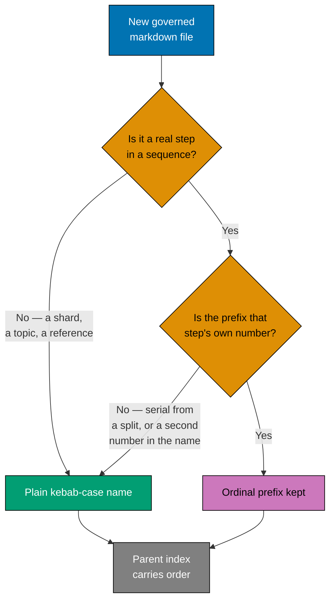
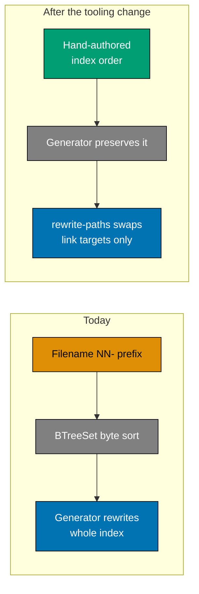
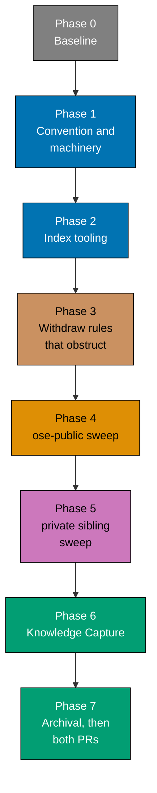

# 🛠️ Technical Documentation: Repo Rules Sweep

> **Workstream scope** — sections 1–11 are **WS-A (ordinal filename prefixes)**. WS-B adds its own
> numbered sections here before it becomes executable.

## 1. Problem Statement in Mechanical Terms

Three mechanisms interact, and the interaction is what makes numbering load-bearing today.

**1.1 The word-budget gate produces shards.** `repo-governance/**/*.md` fails at 500 words. The
sanctioned remediation is progressive disclosure: split into a `<topic>.md` hub plus a `<topic>/`
directory of slices. The slices inherited serial numbers from a document that no longer exists.

**1.2 The index generator owns order today.** In
`apps/rhino-cli/src/application/governance/readme_index.rs`, `generate_index_file` iterates
`targets.sorted_names()`, which collects into a `BTreeSet<String>` — byte order on filenames — and
then writes the whole index file. The `NN-` prefix is currently the only thing making a generated
index come out in reading order.

**1.3 The completeness gate enforces annotation, not order.** `governance-readme-completeness`
requires every child linked and annotated; it says nothing about sequence.

So removing prefixes without changing the generator reorders every index to alphabetical. The
generator must become order-preserving **before** any rename.

## 2. The Rule

A markdown filename in a governed tree may carry a leading ordinal **only when the file is a real
step in an ordered sequence and the ordinal is that step's own number**. A basename never carries two
numbering systems. Failing that, the file takes a plain lowercase kebab-case name and the parent
index carries the order.



_Accessibility_: a new file passes two questions. Blue is the input, orange the two decisions, teal
the plain-name outcome, purple the ordinal-kept outcome, gray the index both rely on for order.

**Worked cases:**

| Filename                                        | Verdict                                                                                                                                            |
| ----------------------------------------------- | -------------------------------------------------------------------------------------------------------------------------------------------------- |
| `29-common-syntax-errors-special-characters.md` | **Fails** — serial position from a word-budget split → `common-syntax-errors-special-characters.md`                                                |
| `04-phase-1-system-package-manager.md`          | **Fails** — two numbering systems → `01-system-package-manager.md`                                                                                 |
| `01b-inherited-and-specialized-requirements.md` | **Fails** — insert escape → `inherited-and-specialized-requirements.md`                                                                            |
| `02-step-1-and-2-maker-and-checker.md`          | **Fails** — ordinal 02 labels steps 1–2, so the two systems disagree → `02-maker-and-checker.md`, keeping the ordinal because the file _is_ a step |
| `04-step-4-fixer.md`                            | **Keeps its ordinal, sheds the redundant token** → `04-fixer.md`                                                                                   |
| `04-fixer.md` (post-rename)                     | **Passes** — a real step in an ordered sequence whose ordinal is that step's own number                                                            |

**The keep-clause is not vacuous.** Genuine ordered step sequences exist in
`repo-governance/workflows/**/*-quality-gate/`. In
`ayokoding-web-swe-by-example-quality-gate/`, `03-step-3-user-review.md` and `04-step-4-fixer.md`
have an ordinal that already equals the step's own number; they fail today only on the redundant
second token, which the rule strips to yield `03-user-review.md` and `04-fixer.md`. Those are the
convention's positive worked cases.

Verify before relying on it:

```bash
find repo-governance/workflows -name '*.md' | grep -E '/[0-9]{2}-' | grep -E 'step-[0-9]+' | while read f; do
  b=$(basename "$f"); ord=$(echo "$b" | grep -oE '^[0-9]{2}' | sed 's/^0//')
  emb=$(echo "$b" | grep -oE 'step-[0-9]+' | grep -oE '[0-9]+$' | head -1)
  [ "$ord" = "$emb" ] && echo "$f"
done
```

This distinction is load-bearing. If the Passes condition had no instances, tie-breaker 1 (**strip
unless proven ordered**) would strip every ordinal in the repository and the rule would collapse
into the blanket ban that was explicitly rejected when this plan was scoped. The sweep must
**preserve** these ordinals while removing their redundant `step-N` token.

## 3. Where Index Order Comes From



_Accessibility_: today the filename prefix drives a byte sort and the generator rewrites the whole
index. Afterwards the hand-authored order is authoritative, the generator preserves it and only
appends what is missing, and a separate `rewrite-paths` mode swaps link targets during the sweep.

## 4. Tooling Change in Detail

**4.1 `generate` becomes additive.** When an index already exists, parse its existing entry list,
keep every entry's position and annotation text verbatim, and append only targets that appear on
disk but not in the index. When no index exists, behave exactly as today.

**4.2 New `rewrite-paths --map <file>` mode.** Reads a TSV of `old-relative-path<TAB>new-relative-path`,
and for every markdown file in scope rewrites matching link targets in place. It touches link targets
only — never link text, annotation text, entry order, or surrounding prose. This is what updates the
176 `README.md` indexes and every sibling `<topic>.md` hub list during the sweep.

**4.3 Scope of the rename map.** The map is generated once per repository from the rename plan, and
`rewrite-paths` is run over the whole tracked markdown corpus, not just indexes — hubs, agents,
skills, and conventions all link numbered shards.

## 5. Design Decisions

| #   | Decision                                                                                                    | Rationale                                                                                                                                                                                                                                                                                                                                                                                                                                                                                                                                                                                              | Rejected alternative                                                                                                                                                                                                                                 |
| --- | ----------------------------------------------------------------------------------------------------------- | ------------------------------------------------------------------------------------------------------------------------------------------------------------------------------------------------------------------------------------------------------------------------------------------------------------------------------------------------------------------------------------------------------------------------------------------------------------------------------------------------------------------------------------------------------------------------------------------------------ | ---------------------------------------------------------------------------------------------------------------------------------------------------------------------------------------------------------------------------------------------------- |
| D1  | Prefix allowed only when it is a real step number                                                           | Preserves genuine step sequences — `repo-governance/workflows/**/*-quality-gate/` holds several whose ordinal already equals the step's own number (`03-step-3-user-review.md`, `04-step-4-fixer.md`), which the rule keeps while stripping the redundant `step-N` token — while excluding shard serials, offset phase/step files, and insert escapes                                                                                                                                                                                                                                                  | Blanket ban — strips a number that is real; status quo — leaves the insert problem                                                                                                                                                                   |
| D2  | Hand-authored index is authoritative; generator preserves order                                             | Order is editorial judgment, not derivable from filenames once prefixes are gone                                                                                                                                                                                                                                                                                                                                                                                                                                                                                                                       | A frontmatter `order:` field — a second source of truth to keep in sync; alphabetical — loses reading order                                                                                                                                          |
| D3  | Full sweep of both repositories                                                                             | Half a sweep leaves the two trees divergent and the contradiction alive in the untouched one                                                                                                                                                                                                                                                                                                                                                                                                                                                                                                           | Prospective-only; pilot-one-directory                                                                                                                                                                                                                |
| D4  | One atomic PR per repository                                                                                | Directed by the maintainer; see §10 for the stated deviation                                                                                                                                                                                                                                                                                                                                                                                                                                                                                                                                           | One PR per subtree; one PR per directory                                                                                                                                                                                                             |
| D5  | The rule is prose only — no gate, no detector, no audit category                                            | Directed by the maintainer; the check is qualitative and a mechanical gate would report thousands of legacy findings with no owner                                                                                                                                                                                                                                                                                                                                                                                                                                                                     | A warn-tier `md naming` gate plus a fifth `repo-governance audit` category                                                                                                                                                                           |
| D6  | `repo-rules-checker` carries it as an AI-only category                                                      | A prose rule nothing consults is exactly how `file-naming.md` drifted across 2092 files                                                                                                                                                                                                                                                                                                                                                                                                                                                                                                                | Convention document only; maker-side only                                                                                                                                                                                                            |
| D7  | Continuation shards get boundary rework, not just renames                                                   | The ordinal was the only cohesion signal for "rules 1-2" / "rule 3" runs; renaming alone leaves fragments                                                                                                                                                                                                                                                                                                                                                                                                                                                                                              | Rename in place; keep numbers where prose is continuous                                                                                                                                                                                              |
| D8  | Word budget wins collisions; re-split on a topic seam                                                       | The budget is gate-enforced and protects auto-load truncation; the naming rule is prose                                                                                                                                                                                                                                                                                                                                                                                                                                                                                                                | Raise the threshold; leave merged files over budget                                                                                                                                                                                                  |
| D9  | `plans/`, `docs/`, `specs/`, `apps/` excluded                                                               | `plans/`'s 127 numbered files are all immutable `done/` archives; `docs/` and `specs/` are already unnumbered; `apps/` numbering is test fixtures and public content URLs                                                                                                                                                                                                                                                                                                                                                                                                                              | Sweeping every tree uniformly                                                                                                                                                                                                                        |
| D10 | The machinery sweep is driven by a discovery command with per-file verdicts                                 | A rule stated in 251 places goes stale if only the obvious files are edited                                                                                                                                                                                                                                                                                                                                                                                                                                                                                                                            | Editing the named files only                                                                                                                                                                                                                         |
| D11 | The agent-role and workflow-type suffix rules are withdrawn, tooling and all                                | Both check only a basename's last token against a closed vocabulary. Neither prevents a defect, and both force a rename whenever a genuinely new kind of agent or workflow appears                                                                                                                                                                                                                                                                                                                                                                                                                     | Keep the rules but widen the vocabularies — the next new role reopens the same problem; downgrade to warn-tier — a warning nobody can act on                                                                                                         |
| D12 | Existing agent and workflow filenames are **not** renamed                                                   | The complaint is the constraint, not the names. `repo-rules-checker.md` is a good name and stays; it merely stops being mandatory                                                                                                                                                                                                                                                                                                                                                                                                                                                                      | A companion rename pass — churn with no beneficiary                                                                                                                                                                                                  |
| D15 | Ambiguity tie-breaker: **strip unless proven ordered**                                                      | The burden of proof is on keeping a number. A directory keeps ordinals only where the prose explicitly calls the files steps or phases and they are read in order                                                                                                                                                                                                                                                                                                                                                                                                                                      | Keep-unless-proven-unordered — leaves an ambiguous tail numbered with no way to tell which rule applied; sweep-nothing-ambiguous — ends the tree in three states instead of two                                                                      |
| D16 | Boundary rework is **conservative merge only**                                                              | An unsupervised agent gets the narrowest editorial mandate that still fixes the defect: merge only where titles continue each other and the combined text fits the budget. Everything else is renamed in place                                                                                                                                                                                                                                                                                                                                                                                         | Merge-wherever-it-fits — broad editorial authority over governance text with no human reviewer; rename-only — leaves fragments whose sole cohesion signal was the number                                                                             |
| D17 | The private sibling gets its own PR and full review cycle                                                   | The `rhino-cli` command deletions there deserve the same scrutiny as `ose-public`'s, and symmetry keeps the two repos' histories legible                                                                                                                                                                                                                                                                                                                                                                                                                                                               | Direct push to `origin main` — lands deletions unreviewed; defer to a follow-up plan — leaves the repos divergent and `parity-manifest` reporting drift indefinitely                                                                                 |
| D18 | The sweep commits **one commit per top-level subtree**                                                      | About six commits, each independently revertible and reviewable as a unit; bisect lands in a tree that can be reasoned about                                                                                                                                                                                                                                                                                                                                                                                                                                                                           | One commit for everything — a bad rename anywhere forces reverting all 2092; one per directory — 176 commits nobody reads                                                                                                                            |
| D22 | Evidence placement is guarded by a `.gitignore` anchor only                                                 | Maintainer's explicit choice over the recommended staged-path gate. One root-anchored `/evidence/` line, no code, no gate. **Known limits, accepted**: blocks only the repo root, `git add -f` bypasses it, and it hides rather than reports — an agent writing there gets no signal                                                                                                                                                                                                                                                                                                                   | A staged-path guard modeled on `env-staged-guard` — deterministic, zero legacy findings after the deletion, but costs a command, specs, and a gate entry; prose plus an AI-only checker category — prose alone already failed to hold this rule once |
| D23 | Both plan worktrees are removed at plan end, and the `ose-public` root checkout is fast-forwarded           | Explicit user authorization, superseding the earlier reasoning that `worktrees/optimize-gov` predates the plan and is therefore not the plan's to remove. The root fast-forward is not redundant: pushing from a side worktree advances `origin/main` while the root checkout's local `main` silently stays behind                                                                                                                                                                                                                                                                                     | Leave `optimize-gov` in place — declined; remove without the root fast-forward — leaves the primary checkout stale on a tree that just changed 2000+ filenames                                                                                       |
| D19 | PR review is scoped to artifacts, not renames                                                               | Nine specialists × 3 cycles over 2092 near-identical rename hunks buries real findings in volume. The renames are gate-verified; the reviewable artifacts are the `rhino-cli` diff, the convention text, `repo-config.yml`, and the rename maps                                                                                                                                                                                                                                                                                                                                                        | Full-diff review — mostly wasted attention; one cycle instead of three — weakens review depth on a PR that also deletes real code                                                                                                                    |
| D20 | Phases 4 and 5 run strictly serial, no fan-out                                                              | Renaming and link rewriting are one coupled operation over a shared corpus; links cross every subtree boundary, so concurrent `git mv` plus `rewrite-paths` is a race no acceptance clause here would catch                                                                                                                                                                                                                                                                                                                                                                                            | Fan out across top-level subtrees — faster, but the rewrite pass still shares state across the boundary that was supposed to isolate the agents                                                                                                      |
| D21 | Iron Rule 3 applies in full — fix every preexisting failure, unscoped                                       | Maintainer's explicit choice over the recommended alternative of scoping fixes to this plan's own surfaces. Accepted cost: an unattended run may spend substantial budget provisioning a toolchain this plan never uses                                                                                                                                                                                                                                                                                                                                                                                | Scope to Rust/markdown/config and record the rest — declined; halt and surface — reintroduces the human-in-the-loop stop this plan exists to remove                                                                                                  |
| D14 | The `plans/` word-budget exclusion is documented, not changed                                               | `plans/`, `docs/`, and `specs/` are already excluded by path prefix on both the gate and a bare CLI run. Nothing to remove — the defect is that `governance-word-budget.md` publishes the `**/README.md` row as universal and never mentions the exclude list, so authors trim plan READMEs against a budget nothing measures                                                                                                                                                                                                                                                                          | Deleting the `**/README.md` surface — would drop the budget on `repo-governance/` READMEs too, which do need it; adding a redundant `plans/**/README.md` surface — a second mechanism for an exclusion that already works                            |
| D13 | No new gate is added for mirror-drift; the already-declared `harness-bindings` gate is confirmed sufficient | `harness naming validate` also carried a `mirror-drift` check, but it duplicated coverage the `harness-bindings` gate already provides via `validate_sync` (`.opencode/`) and `validate_cursor_sync` (`.cursor/`), and which is already `pre-push` path-gated and unconditional in `ci`. An earlier draft of this decision conflated "`harness sync validate` is not a declared gate id" with "the coverage is not gated" — `harness-bindings` is a declared gate and already exercises the equivalent checks, so deleting `harness naming validate` removes a redundant check, not the only gated one | Promote `harness sync validate` to a new declared `harness-sync` gate — rejected once the coverage was reverified: it would gate the same duty twice, once under `harness-bindings` and once under a new id, with no coverage gained                 |

## 6. File-Impact Analysis

```text
.
├── repo-governance/
│   ├── conventions/structure/
│   │   ├── ordinal-filename-prefixes.md [N] — the new convention
│   │   ├── file-naming.md [E] — reconcile the "no prefixes" rationale, cross-link the new rule
│   │   ├── governance-word-budget-remediation.md [E] — shard filenames carry no ordinal
│   │   ├── workflow-naming.md [E] — compose with the ordinal rule rather than contradict it
│   │   └── README.md [E] — index the new convention
│   ├── conventions/**, development/**, workflows/**, principles/**, vision/**, glossary/** [E] —
│   │   the sweep: every non-qualifying file renamed, boundaries reworked, indexes path-rewritten
│   ├── development/quality/evidence-capture/02-the-rule.md [E] — state the placement rule
│   ├── conventions/structure/governance-word-budget.md [E] — publish the exclude list
│   ├── conventions/structure/agent-naming.md + agent-naming/ (7 files) [D] — rule withdrawn
│   ├── conventions/structure/workflow-naming.md + workflow-naming/ (6 files) [D] — rule withdrawn
│   ├── workflows/repo/repo-rules-quality-gate/ [E] — the AI-only category, skip-list key, changelog
│   └── development/infra/temporary-files/08-report-file-naming-standard.md [E] — exempt-or-not
├── .claude/
│   ├── agents/repo/repo-rules-checker.md [E] — ordinal-prefix as an AI-only validation category
│   ├── agents/repo/repo-rules-fixer.md [E] — rename-and-relink recipe, mirror refusal condition
│   ├── agents/repo/repo-rules-maker.md [E] — author new conventions and shards under the rule
│   ├── skills/repo-validating-governance-rules/** [E] — the category and its criticality
│   ├── skills/repo-rules-fixing/** [E] — the fix recipe
│   ├── skills/repo-defining-workflows/SKILL.md [E] — workflow shard and step-file naming
│   ├── skills/docs-managing-file-operations/reference/01-when-to-use-and-naming.md [E]
│   └── **/*.md [E] — the sweep across agents and skill reference modules
├── .opencode/, .cursor/, .amazonq/ [G] — regenerated via npm run generate:bindings
├── apps/rhino-cli/
│   ├── src/application/governance/readme_index.rs [E] — order-preserving generate,
│   │                                                    rewrite-paths mode
│   ├── src/commands/harness_validate_naming.rs [D], src/commands/workflows_validate_naming.rs [D]
│   ├── src/internal/naming.rs [D], src/application/naming/ [D] — used only by the two above
│   ├── src/cli.rs [E], src/commands.rs [E] — subcommands, dispatch arms, three stale parser tests
│   ├── tests/agent_naming_validator.rs [D] and 18 golden-master fixtures [D] — md-naming* kept
│   └── (build proves the deletion: no dangling module reference)
├── .gitignore [E] — root-anchored /evidence/ guard
├── repo-config.yml [E] — drop harness-naming + workflows-naming gates (no gate added — see D13)
├── AGENTS.md [E] — drop the `<domain>-<role>` naming claim
├── specs/apps/rhino/behavior/rhino-cli/gherkin/governance/governance-readme-index.feature [E]
├── specs/apps/rhino/behavior/rhino-cli/gherkin/{harness,workflows,agent-naming}/*naming*.feature [D]
└── plans/in-progress/repo-rules-sweep/ [E] → plans/done/<date>__repo-rules-sweep/ [E] — archival
```

### More Detail

**Class-not-sites discovery.** Two commands define the sweep's edges; execution re-runs them and
records a per-file verdict rather than trusting the authoring-time list:

- Files stating a filename-naming rule:
  `grep -rln "kebab-case\|[Ff]ile [Nn]aming" --exclude-dir=node_modules .claude repo-governance docs`
  — 251 matches at authoring time, each classified `states-the-rule` or `merely-links-it`.
- Files hard-linking a numbered governance shard:
  `grep -rEln '\]\([^)]*/[0-9]{2}-[a-z0-9-]+\.md' --exclude-dir=node_modules --exclude-dir=.git .`
  — 1106 matches at authoring time. The large majority are hand-authored `repo-governance/` source
  files linking their own numbered shards (e.g. `repo-governance/workflows/web/web-ux-test-fixing-planning/README.md`
  linking its own numbered children), not generated harness mirrors.

**Rename-map construction.** The map is built per directory, not globally, so a reviewer can audit one
directory's decisions in isolation even though the PR is atomic. Each row records old path, new path,
and one of three dispositions: `renamed` (prefix stripped), `merged-into` (boundary rework), or
`kept` (a real step number).

**Mirror discipline.** `.opencode/`, `.cursor/`, `.amazonq/` are never hand-edited. Every `.claude/`
rename is followed by `npm run generate:bindings` in the same commit, verified with
`npm run validate:sync`.

**Parity discipline.** The `apps/rhino-cli/` change opens a byte-identity obligation with
the private sibling; its acceptance check is the `parity-manifest` gate, not a visual diff.

## 7. Delivery Flow



_Accessibility_: a single serial chain, no branches. Phase 0 (gray) baselines in the existing
worktree. The blue phases land the ordinal-prefix rule, the rules machinery, and the order-preserving
index tooling. The brown phase withdraws the two suffix rules, deletes their tooling, and publishes the
word-budget exclude list. The orange
phase sweeps `ose-public` and the purple phase repeats both the withdrawal and the sweep in
the private sibling. The green phases capture knowledge and archive the plan; both PRs open in the last
one.

## 8. Dependencies

- Phase 2 must land before Phase 4: renaming before the generator is order-preserving would reorder
  every index.
- Phase 4 depends on Phase 1 for the rule that rename decisions are made against.
- Phase 3 must land before Phase 4: it deletes thirteen numbered shards the sweep would otherwise
  rename and then discard.
- Within Phase 3, the already-declared `harness-bindings` gate's `.opencode/` and `.cursor/`
  mirror-drift coverage must be reconfirmed live (deleting and restoring a mirror file, not just
  trusted from this document) **before** `harness naming validate` is deleted — see D13.
- Phase 5 copies finished `rhino-cli` changes from Phases 2 and 3, so both must be complete.
- The private sibling must be reachable and on a clean `main` before Phase 5.
- The `ose-public` worktree already exists and is already checked out; no provisioning step is
  required.

## 9. Rollback

| Phase | Rollback                                                                                                                                                                                                                                                      |
| ----- | ------------------------------------------------------------------------------------------------------------------------------------------------------------------------------------------------------------------------------------------------------------- |
| 1     | Revert the convention and machinery commits; no filename or tooling behaviour depends on them yet.                                                                                                                                                            |
| 2     | Revert the `readme_index.rs` commit. Indexes are untouched at this point, so nothing regenerates differently.                                                                                                                                                 |
| 3     | Revert the deletion commits. Restoring the two commands, the shared `naming` modules, the two gate entries, and the two convention trees returns enforcement exactly as it was. No new gate was added, so there is nothing extra to keep or remove on revert. |
| 4     | Revert the sweep commits. Renames are `git mv` plus a `rewrite-paths` pass in the same commits, so a revert restores both sides. Because the PR is atomic, reverting it returns `ose-public` wholly to its pre-sweep state.                                   |
| 5     | Revert in the private sibling only. `ose-public` is unaffected, and the `parity-manifest` gate then reports the drift it exists to report.                                                                                                                    |
| 6–7   | Revert the capture and archival commits; the plan folder returns to `plans/in-progress/`.                                                                                                                                                                     |

## 10. Stated Deviation — One Atomic PR

[PRs Open at Delivery Boundaries](../../../repo-governance/conventions/structure/plans/prs-open-at-delivery-boundaries-boundary-test.md)
requires a delivery boundary to be a **reviewable whole**. A single PR carrying ~2092 renames plus
editorial boundary rework across 176 directories fails that clause, and it is chosen anyway at the
maintainer's explicit direction after the alternatives (per-subtree, per-directory) were presented
and declined.

This is recorded so `plan-checker` reads it as a decision rather than a defect. The compensating
controls, since human diff-reading cannot carry the review load:

- `rhino md links validate` — every link resolves after the rewrite.
- `rhino governance readme-index validate` — no index lost, gained, or orphaned a child.
- `rhino governance word-budget validate` — no merged file busts the budget.
- `npm run validate:sync` — every mirror matches its `.claude/` source.
- The per-directory rename map, with a `renamed` / `merged-into` / `kept` disposition per file, is
  the auditable artifact a reviewer reads instead of the diff.

## 11. Autonomy Preconditions Verified at Authoring Time

These were checked against the live tree while writing the plan, so execution does not have to
discover them. Each carries a re-verification checkbox in `delivery.md`.

| Fact                                                                  | Command                                                                | Value at authoring                   |
| --------------------------------------------------------------------- | ---------------------------------------------------------------------- | ------------------------------------ |
| No agent definition carries an ordinal                                | `find .claude/agents -name '*.md' \| grep -cE '/[0-9]{2}-'`            | 0                                    |
| No `SKILL.md` carries an ordinal                                      | `find .claude/skills -name 'SKILL.md' \| grep -cE '/[0-9]{2}-'`        | 0                                    |
| All numbered `.claude/` files are skill reference modules             | `find .claude -name '*.md' \| grep -E '/[0-9]{2}-'`                    | 232, all under `skills/*/reference/` |
| `internal/naming.rs` and `application/naming/` have no other consumer | `grep -rln 'internal::naming\|application::naming' apps/rhino-cli/src` | only the two commands being deleted  |
| `plans/` is already outside the word budget                           | `governance-word-budget` gate `args.exclude`                           | `plans/` present                     |

The first two matter most: agent and skill names are **identities** (frontmatter `name` must equal
the filename stem or directory name), while reference modules are reached only by link. Because no
identity-bearing file is numbered, the sweep cannot break agent resolution. If a re-verification
returns non-zero, that reasoning no longer holds — stop rather than proceed.

## 12. Follow-Ups Recorded, Not Done

- **WS-B** — the File Naming Convention rework, specified only after this workstream's Knowledge
  Capture records what `file-naming.md` still gets wrong.
- **Whether the AI-only category should ever become mechanical** — deliberately unresolved; revisit
  if `repo-rules-checker` proves unable to hold the rule.
