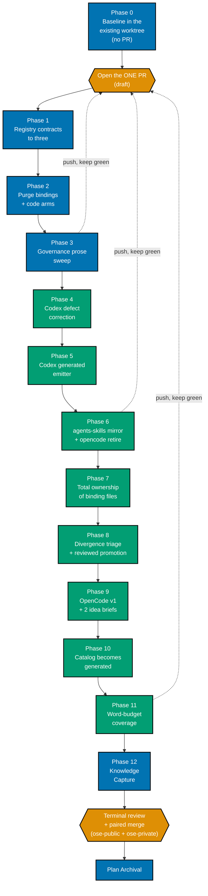

# Update Harness Support

**Status**: In Progress
**Delivery Mode**: `worktree-to-pr`
**Worktree**: `worktrees/update-harness-support/`
**Repositories**: `ose-public` (primary), `ose-private` (paired `apps/rhino-cli/**` twin)

## Context

This repository declares support for **eleven** coding-agent harnesses in the `harness:` registry of
`repo-config.yml` [Repo-grounded — 11 entries verified at `repo-config.yml` §harness]. Eight of them
are aspirational: they carry a registry row, catalog prose, and in three cases a generated binding
directory, but nobody drives this repository through them. Every one of those eight rows is a
maintenance liability — governance prose that must stay accurate, a vendor row that must be
re-verified, and (for Cursor and Amazon Q) generated output that must stay byte-stable through a
pre-push guard.

Meanwhile the three harnesses actually in use are unequal and, in one case, actively wrong:

- **Claude Code** is the source of truth and is correctly modelled.
- **OpenCode** is fully generated from `.claude/` and correctly modelled, but its upstream canonical
  repository moved from `sst/opencode` to `anomalyco/opencode` and this repository still cites the
  old path.
- **OpenAI Codex CLI** is modelled as a hand-maintained `source-config` tier with a
  `forbid-dir: .codex/agents` assertion. That assertion is **factually wrong**. Official Codex custom
  subagents ARE standalone `.toml` files in `.codex/agents/`. What was never official is
  `.codex/agents/*.md` — markdown. A correct observation about one file extension was generalized
  into a validator that now forbids the officially-correct surface.

The drift is not an accident of attention. It is structural: the catalog's own top-of-file stamp
reads **"Verified 2026-05-24"** [Repo-grounded — `docs/reference/platform-bindings.md` line 25],
roughly three months stale as of authoring, and **nothing in the repository fails when it rots**. The
`repo-harness-compatibility-quality-gate` workflow already performs web-research-backed external
drift detection, and its own `when_to_use` names "a scheduled hygiene audit" — but no scheduled
workflow invokes it [Repo-grounded — twelve `schedule:`-bearing workflows in `.github/workflows/`,
none for harness drift]. A claim can be arbitrarily old and CI stays green.

## Scope

### In scope

1. **Full purge of eight harnesses** — `amazonq`, `copilot`, `cursor`, `windsurf`, `junie`,
   `antigravity`, `pi`, `aider`. Binding directories, registry entries, rhino-cli code arms, catalog
   rows, gate trigger lists, Gherkin specs, and governance references.
2. **Codex raised to generated parity with OpenCode** — a `.claude/agents/` → `.codex/agents/*.toml`
   emitter wired into `rhino-cli harness bindings generate`, guarded byte-for-byte by
   `rhino-cli harness bindings validate`.
3. **`.agents/skills/` becomes a generated real-file mirror** of the canonical `.claude/skills/`
   tree — the only skills directory Codex reads. Real files, no symlinks in either direction, with
   the eight vendored third-party plugin directories already living there declared in the registry
   and left byte-identical.
4. **`.opencode/skills/` and `.opencode/commands/` are deleted** as a deliberate accepted capability
   loss: OpenCode does not read Claude Code plugins and no `nx-mcp` equivalent covers the gap, so
   OpenCode users may genuinely lose Nx skill access and the `/monitor-ci` command.
5. **The platform-bindings catalog becomes generated** from structured data extending the existing
   `harness:` registry, rather than hand-maintained prose.
6. **Total ownership of binding files** — every tracked file under every surviving binding directory
   is declared GENERATED, VENDORED, or SOURCE in the registry, and a validator fails naming any file
   it cannot classify. This is the plan's automation spine: cheap, deterministic, offline, and it
   would have caught `.opencode/skills/` the day it appeared. **No** automated external-drift
   detection ships — no freshness gate, no cron, no agentic audit, no upstream fingerprinting;
   vendor re-verification stays manual and on-demand.
7. **Word-budget coverage extended** to every instruction entry point the three survivors actually
   read, at the existing 500-word fail threshold.
8. **Divergence triage with human-reviewed promotion** — generation stays one-way, but a hand edit in
   a mirror is detected by content (never by timestamp) and can be promoted back into canonical
   source through a proposed diff that lists the fields at risk of loss. Both sides diverged is a
   hard stop, never a guess.
9. **OpenCode v1 conformance corrections**, with two deferred moves filed as idea briefs: the
   OpenCode v2-beta migration, and moving canonical source out of `.claude/` to a vendor-neutral
   location.
10. **Paired `ose-private` twin branches** so `apps/rhino-cli/**` byte-identity never breaks.

### Out of scope

- **OpenCode v2-beta migration.** Filed as `plans/ideas/q2-not-urgent-important/opencode-v2-migration.md`;
  this plan targets v1 stable only.
- **Adopting `.claude/rules/*.md`**, the 29-event hook surface, or the merged Skills/slash-command
  mechanism. All are newly-available Claude Code surfaces; adopting them is separate product work.
- **Restructuring `.claude/agents/` frontmatter** to use the newly-available fields
  (`permissionMode`, `maxTurns`, `isolation`, and the rest).
- **Deleting the vendor-neutrality token table** in `vendor_audit.rs`. It detects vendor leakage in
  governance prose; a dropped harness's name in vendor-neutral prose remains a violation. See
  `tech-docs.md` DD-3.
- **Re-homing the `apps/` false-positive "cursor" mentions** — 441 tracked files under `apps/`
  mention "cursor" [Repo-grounded], overwhelmingly as database cursors, text cursors, and the CSS
  `cursor` property. None are harness references and none are touched.

## Approach Summary

Thirteen phases in **one worktree and one PR per repository**. This overrides the default rule that
would split the work across several PRs: the entire plan lands in exactly one `ose-public` PR paired
with exactly one `ose-private` PR, merged together — two PRs total. Phases remain the unit of
sequencing and each keeps its own gate, but no phase opens a PR of its own.

The keystone is Phase 1: contract the registry to three entries first, because every downstream
validator, gate trigger, and generated artifact reads that registry. Purge follows, then Codex is
raised, then the catalog is mechanized, then the anti-drift gate is armed. Because the single PR is
large, per-phase gating is strict — every phase leaves the branch green before the next begins.

**Execution location**: the already-existing worktree at `worktrees/update-harness-support/` on
branch `worktree/update-harness-support`. Phase 0 locates and reuses it; it creates nothing.

**Palette**: blue `#0173B2` (contraction work), teal `#029E73` (construction work), orange `#DE8F05`
(the single PR and its merge). Every node carries a text label; colour is supplementary. Dotted
edges are pushes to the already-open PR, not new PRs.

## Navigation

| Document                       | What it answers                                                      |
| ------------------------------ | -------------------------------------------------------------------- |
| [brd.md](./brd.md)             | WHY — business goal, affected roles, success signals, business risks |
| [prd.md](./prd.md)             | WHAT — personas, user stories, Gherkin acceptance criteria, scope    |
| [tech-docs.md](./tech-docs.md) | HOW — architecture, design decisions, file-impact tree, rollback     |
| [delivery.md](./delivery.md)   | DO — the phased checklist with gates, executor tags, and TDD cycles  |
| [learnings.md](./learnings.md) | Running Knowledge-Capture log, triaged in Phase 12 before archival   |

## Related

- [Platform Bindings Catalog](../../../docs/reference/platform-bindings.md) — the artifact this plan
  mechanizes
- [Multi-Harness Binding Convention](../../../repo-governance/conventions/structure/multi-harness-binding.md) —
  the two-tier binding model and no-shadowing rule
- [Repository Harness Compatibility Quality Gate](../../../repo-governance/workflows/repo/repo-harness-compatibility-quality-gate.md) —
  the existing drift-detection workflow nothing schedules
- [harness-binding-catalog-drift](../../ideas/q2-not-urgent-important/harness-binding-catalog-drift.md) —
  the idea brief this plan supersedes for the three surviving harnesses
- [Governance Word Budget Convention](../../../repo-governance/conventions/structure/governance-word-budget.md) —
  the 500-word fail threshold this plan extends coverage of

> Home prefix normalised: absolute home-directory paths in this plan's files were rewritten to a portable form (such as `~/`, `$HOME/`, or a `<placeholder>`), so captured output here is not byte-verbatim.
