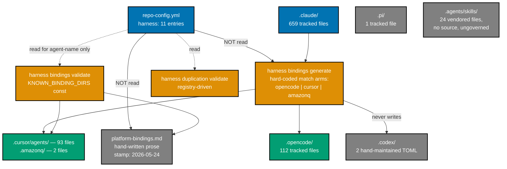
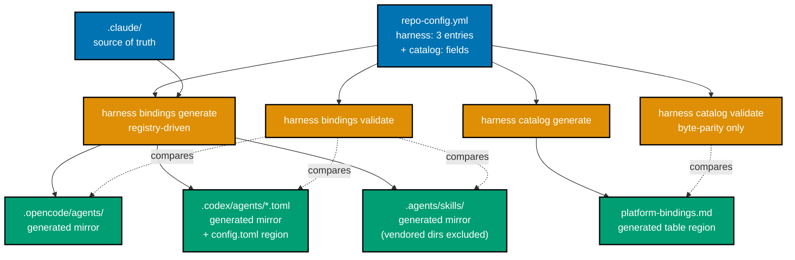
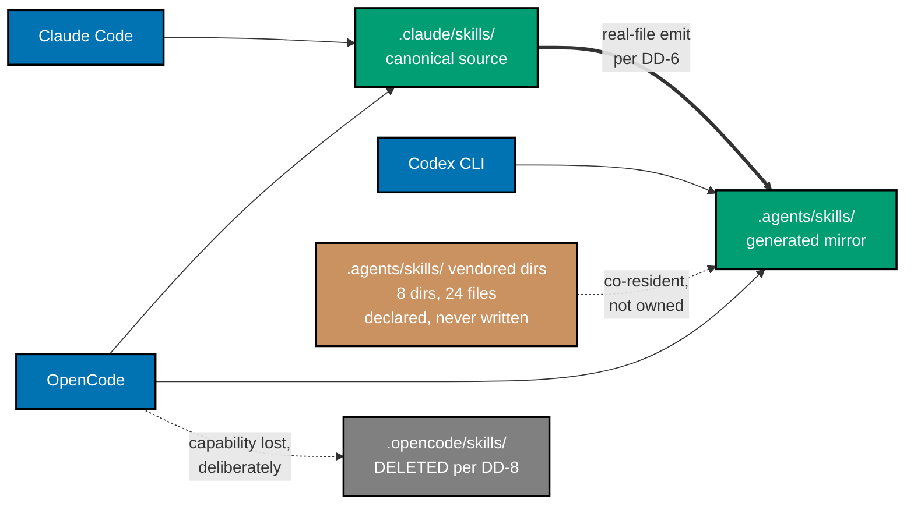

# Technical Documentation — Update Harness Support

## Architecture

### Current state

The harness system has three layers, and they are inconsistently coupled to their data source.



Two structural problems are visible in that graph. First, the catalog has **no inbound data edge** —
it is prose that happens to describe the registry. Second, `harness bindings generate` reads the
source tree but not the registry: its harness set lives in `match` arms on the string literals
`"opencode"`, `"cursor"`, and `"amazonq"` [Repo-grounded —
`apps/rhino-cli/src/commands/harness_generate_bindings.rs` lines 63-86].

### Target state



Every arrow now originates at `repo-config.yml`. Adding, dropping, or re-verifying a harness is a
data edit; only adding a _generated_ tier still costs an emitter.

### Skills-surface discovery matrix

No single directory serves all three survivors [Web-cited — four `web-researcher` reports, Aug 2026;
carried forward from the plan brief]:

| Directory           | Claude Code | OpenCode | Codex CLI | Fate under this plan                         |
| ------------------- | ----------- | -------- | --------- | -------------------------------------------- |
| `.claude/skills/`   | reads       | reads    | does NOT  | canonical source, unchanged                  |
| `.opencode/skills/` | does NOT    | reads    | does NOT  | **deleted** (DD-8, accepted capability loss) |
| `.agents/skills/`   | does NOT    | reads    | reads     | **generated real-file mirror** (DD-6, DD-7)  |

Two directories therefore cover all three survivors after this plan: Claude Code and OpenCode read
the canonical `.claude/skills/`, and OpenCode and Codex read the generated `.agents/skills/` mirror.
OpenCode reads both and sees identical content by construction.

`.agents/skills/` is not part of the agentskills.io specification — that specification defines only
the `SKILL.md` file format, with exactly six legal frontmatter fields (`name`, `description`,
`license`, `compatibility`, `metadata`, `allowed-tools`). Directory discovery is per-vendor
convergence, and `AGENTS.md` stewardship (Agentic AI Foundation) has no relationship to the skills
specification's community governance.



The thick edge is a real-file generation step, not a link. The brown node is content the emitter is
declared not to own. The grey node is removed by this plan and its OpenCode edge is a deliberate,
accepted loss.

What keeps this target state honest is total ownership of binding files
([DD-12](#dd-12--total-ownership-of-binding-files-is-the-plans-automation-spine)): every file above is
declared GENERATED, VENDORED, or SOURCE, and an unclassified file fails the build. Vendor-side change
is handled manually by deliberate choice — see
[§External Drift Is Handled Manually](#external-drift-is-handled-manually-by-deliberate-choice).

## Design Decisions

### DD-1 — Contract the registry before touching anything else

**Decision**: Phase 1 rewrites `repo-config.yml` `harness:` to three entries, and every validator,
gate trigger, and Gherkin feature is brought into agreement in the same phase, before any binding
directory is deleted.

**Rationale**: `harness duplication validate` is already registry-driven [Repo-grounded —
`specs/apps/rhino/behavior/rhino-cli/gherkin/specs/harness-registry-driven.feature`], so contracting
the registry changes its behaviour immediately. Deleting directories first would leave the registry
pointing at absent paths and produce failures that mask real ones.

**Alternative rejected**: delete directories first, fix the registry after. Rejected because it makes
every intermediate state red, violating the Phase-Gate pause-safety rule.

### DD-2 — `harness bindings generate` becomes registry-driven

**Decision**: replace the three `match` arms on `"opencode" | "cursor" | "amazonq"` with a lookup
against the loaded `harness:` registry, so `--harness <name>` accepts exactly the generated-tier
entries the registry declares.

**Rationale**: the registry's own comment promises "Adding a 12th harness = one entry here; every
harness command picks it up automatically" [Repo-grounded — `repo-config.yml` line 32]. That promise
is currently false for the generator. Raising Codex to the generated tier is the moment to make it
true, because otherwise Codex costs another hard-coded arm.

**Alternative rejected**: add a fourth `"codex"` arm alongside the others. Rejected — it repeats the
defect this plan exists to remove.

### DD-3 — `vendor_audit.rs` keeps its dropped-harness tokens

**Decision**: the forbidden-token table in
`apps/rhino-cli/src/application/repo_governance/vendor_audit.rs` retains `Cursor`, `Windsurf`,
`Junie`, `Amazon Q`, `Antigravity`, `Aider`, `pi.dev`, and the corresponding `.cursor/`, `.windsurf/`,
`.junie/`, `.amazonq/`, `.pi/` path tokens.

**Rationale**: that table detects **vendor leakage into vendor-neutral governance prose** — it is not
a support declaration. A dropped harness's name appearing in `repo-governance/` prose is still a
vendor-independence violation, arguably more clearly so after the drop. Removing the tokens would
weaken the gate that keeps governance vendor-neutral.

**Status**: user-resolved. This is a definite keep, not an open question. It is the one place where
"purge every rhino-cli code arm" is deliberately not applied.

**Note for a future reader tempted to tidy these away**: after the eight harnesses are dropped, these
tokens will look like dead references to unsupported tools. They are not. The table's job is to catch
a vendor name appearing in prose that is required to be vendor-neutral, and the eight dropped names
are exactly as forbidden in `repo-governance/` prose after the drop as before it — arguably more so,
since there is no longer even a binding directory to justify naming them. Deleting a row here does
not remove a stale claim; it removes a check. The rationale is recorded inline in the source
(`delivery.md` Phase 2 item 2.6) precisely so this reasoning survives without a trip to the plan
archive.

### DD-4 — Codex agents are emitted as standalone TOML, model field omitted

**Decision**: emit one `.codex/agents/<name>.toml` per `.claude/agents/` agent, carrying `name`,
`description`, and `developer_instructions`. Deliberately **omit** `model`, `model_reasoning_effort`,
`sandbox_mode`, and `mcp_servers`.

**Rationale**: `name`, `description`, and `developer_instructions` are the required trio [Web-cited].
The optional fields have no verified Claude-to-Codex translation table. `convert_cursor_model` exists
because Cursor's model IDs are known and pinned deliberately; no equivalent verified mapping exists
for Codex, and inventing one would be anti-pattern AP-4. Omitting a field means Codex inherits its
own default, which is the correct behaviour absent a deliberate pin.

**Precedent**: `apps/rhino-cli/src/application/agents/cursor.rs` already models exactly this shape — a
`FieldPolicy` table with `Preserve` / `Translate` / `DropWarn` actions and a fixed emitted-field
order [Repo-grounded — `CURSOR_FIELD_POLICY_TABLE`, `CURSOR_EMITTED_FIELDS`]. The Codex emitter is a
sibling module, `codex.rs`, following that structure with a TOML encoder instead of a YAML-frontmatter
encoder.

**Naming**: agent identity comes from the `name` frontmatter key, not the source subfolder — the same
flattening rule the OpenCode and Cursor mirrors already apply, since `.claude/agents/` nests into role
subfolders and Claude Code derives identity from `name` alone.

### DD-5 — `.codex/config.toml` gains a delimited generated region

**Decision**: `harness bindings generate` rewrites only the region of `.codex/config.toml` between
two marker comments, emitting one `[agents.<name>]` table per generated agent. Everything outside the
markers — `[mcp_servers.nx-mcp]`, `[features]`, and the hand-maintained
`[agents.ci-monitor-subagent]` table — is preserved byte-for-byte.

**Rationale**: `.codex/config.toml` has non-generated provenance (Nx tooling supplied the `nx-mcp`
server block) and the catalog explicitly records the `ci-monitor-subagent` entry as hand-maintained.
Wholesale generation would clobber both.

**Marker-first hazard**: the region rewriter MUST check for the already-present end marker **before**
searching for an insertion anchor. An anchor-first implementation appends a fresh region on every run
— the exact duplication class recorded in this repository's own re-runnable-substitution guidance.
Phase 5's gate asserts idempotence by running the generator twice and requiring
`git diff --quiet .codex/` to exit 0.

### DD-6 — `.agents/skills/` is a real-file generated mirror of `.claude/skills/`

**Decision**: `.claude/skills/` remains the hand-authored source of truth.
`harness bindings generate` emits `.agents/skills/<name>/` as **real files**, copied and where
necessary converted from `.claude/skills/<name>/`, exactly the way `.opencode/agents/` mirrors
`.claude/agents/` today via the registry's `mirrors:` key. No symlinks are created in either
direction.

**Rationale**: this removes the symlink dependency on both sides at once. Nothing rests on
unverified Codex symlink-following behaviour, and nothing rests on teaching Rust directory walkers
to follow symlinks. `.claude/` stays canonical, which every governance document already asserts. All
three gates that walk `.claude/` — `governance word-budget validate`,
`governance readme-index validate`, `harness duplication validate` — keep working unchanged, because
nothing moves out of `.claude/`. And the mirror is guarded by the byte-parity validator this
repository already runs on every generated binding, so drift between source and mirror is a gate
failure rather than a discovery.

**Alternatives rejected**:

- _Symlink `.agents/skills/<name>` → `../../.claude/skills/<name>`_ — rests on unverified Codex
  behaviour; would have required a manual behavioural assertion and a fallback plan.
- _The officially-documented direction (`.agents/` canonical, `.claude/skills/<name>` symlinked)_ —
  relocates 59 skill directories and 545 tracked files out of `.claude/`, and every `.claude/`-walking
  gate then sees an empty skills tree because Rust walkers do not follow symlinks by default.

**Accepted cost**: roughly 545 additional tracked files. This is the same order as the
`.codex/agents/` tree DD-4 adds and the `.opencode/agents/` tree already carried; it is a known,
bounded cost of the mirror model this repository already uses.

**Consequences to wire**:

- The `codex` registry entry declares `.agents/skills` as a mirror target of `.claude/skills`, using
  the same `mirrors:` mechanism the OpenCode agent mirror uses.
- `.agents/` joins the generated-mirror byte-parity guard (`harness bindings validate`).
- `.agents/` is added to `.prettierignore` if — and only if — measurement shows Prettier would
  otherwise reformat the emitted files. This repository has been bitten before by Prettier breaking a
  generated byte-equality guard; the `.amazonq/` entry already in `.prettierignore` is that scar.
  Phase 6 measures the round trip before deciding, exactly as DD-9 does for the catalog.
- `npm run generate:bindings` emits it and `npm run validate:sync` covers it. Neither script gains a
  new flag — both already delegate to the registry-driven commands.

### DD-7 — The emitter owns only the directories it generates; vendored skills are declared and untouched

**Decision**: the harness registry gains an explicit **vendored-subdirectory declaration** for
`.agents/skills/`. The emitter owns exactly the subdirectories it generates from `.claude/skills/`
and treats every declared vendored subdirectory as out of its ownership: it never writes into one,
never deletes one during stale-mirror cleanup, and never reports one as an orphan.

**The conflict this resolves**: `.agents/skills/` is **not empty today**. It already holds 24 tracked
files across eight vendored third-party plugin skill directories — `cavecrew/`, `caveman/`,
`caveman-commit/`, `caveman-compress/`, `caveman-help/`, `caveman-review/`, `caveman-stats/`,
`compress/` — several carrying `scripts/*.py` payloads [Repo-grounded — `git ls-files .agents` = 24].
None has a `.claude/skills/` source and none can be regenerated. A generator that owned
`.agents/skills/` wholesale would clobber all of them on its first run.

**Why a declared list rather than a heuristic**: the alternative — infer ownership by checking
whether a matching `.claude/skills/<name>/` exists — silently changes meaning the moment someone adds
a repository skill whose name collides with a vendored one, and gives no place to record _why_ a
directory is exempt. An explicit declaration is auditable, fails loudly when a vendored directory
appears undeclared, and matches this repository's standing preference for explicit configuration over
convention-derived behaviour.

**Provenance consistency with DD-8**: the vendored `.agents/skills/` directories and the
`.opencode/skills/` tree are the same provenance class — third-party or tool-generated content with
no `.claude/` source that this repository's governance system can neither produce nor regenerate. The
two treatments differ because the situations differ: the `.agents/` vendored skills are actively used
and sit inside a tree the emitter now owns, so they are declared and protected; the `.opencode/`
tree is superseded and sits in a tree nothing needs, so it is deleted (DD-8). Both outcomes are
recorded as deliberate, and neither is a silent default.

**Acceptance obligation**: a regeneration run must leave all 24 vendored files **byte-identical**.
Phase 6 carries that as an explicit check with a recorded pre-run and post-run hash comparison.

### DD-8 — `.opencode/skills/` and `.opencode/commands/` are deleted, accepting a capability loss

**Decision**: delete the entire `.opencode/skills/` tree — all 7 directories and 16 tracked files
(`link-workspace-packages/`, `monitor-ci/`, `nx-generate/`, `nx-import/`, `nx-plugins/`,
`nx-run-tasks/`, `nx-workspace/`) — and delete `.opencode/commands/monitor-ci.md` with it. This
matches the earlier `.github/skills/` nx-\* removal precedent already recorded in the catalog.

**Provenance**: both trees arrived in the same commit, `4239f3d79`
("chore: add Nx-generated AI agent configs for Copilot, Codex, and OpenCode") [Repo-grounded —
`git log -- .opencode/skills/monitor-ci` and `git log -- .opencode/commands/monitor-ci.md` both
terminate at that commit]. They are tool-generated, have no `.claude/` source, and cannot be
regenerated by this repository's governance system. `.opencode/commands/` therefore shares the fate
of `.opencode/skills/` rather than being left unmentioned: same origin commit, same class, same
outcome.

**DELIBERATE ACCEPTED CAPABILITY LOSS — stated plainly**: OpenCode does **not** read Claude Code
plugins. Unlike the `.github/skills/` case, where the `nx-mcp` plugin covered the gap for Copilot,
there is no equivalent fallback here. Deleting these files means **OpenCode users may genuinely lose
Nx skill access and the `/monitor-ci` command**. The user was told this explicitly and chose deletion
anyway. This is not a silent cleanup and must not be described as one in any downstream document; if
the loss proves painful, the remedy is to restore the files deliberately or author `.claude/`-sourced
equivalents, not to be surprised.

**What the deletion buys**: the tree was ungoverned by construction — its files run 397 to 2,293
words each against a 500-word fail threshold [Repo-grounded — measured per file], so it could never
be brought under the word budget and survived only via a tree-level exclusion. Removing the tree
removes the exclusion, removes the latent shadowing hazard (`.opencode/skills/` wins on name
collision with `.claude/skills/`), and leaves `.opencode/` containing only generated mirrors plus
`opencode.json`.

**Consequences to wire**: the `.opencode/skills/` and `.opencode/commands/` prefixes leave the
`governance-word-budget` gate's `args.exclude` list in `repo-config.yml`, because the trees they
excluded no longer exist. No collision guard is added — with the tree gone there is nothing to
collide, and `.claude/skills/` ↔ `.agents/skills/` name equality is expected by construction under
DD-6 and is guarded by byte-parity instead.

### DD-9 — Catalog generation covers the table region only

**Decision**: `harness catalog generate` renders the Platform Binding Directories table and the
verification stamp between markers. Explanatory prose, the no-shadowing note, the translation-artifact
sections, and the "Adding a New Platform Binding" instructions stay hand-written.

**Rationale**: the table is the part that goes stale, because it is the part that mirrors registry
data. The prose is genuine explanation with no data source. Generating it would require inventing a
templating layer for content that changes rarely and deliberately.

**Prettier hazard**: a generated markdown region inside a Prettier-formatted file is the exact class
of failure recorded in the 2026-05-03 Amazon Q post-mortem. Phase 10 measures the round trip
(`generate` → `prettier --write` → `git diff --quiet`) before wiring the guard, and takes one of two
outcomes: make the emitter produce Prettier-stable output, or add the catalog to `.prettierignore`
alongside the existing `.amazonq/` entry. The measurement decides; neither is pre-committed.

### DD-10 — Withdrawn

A 60-day catalog-freshness budget with no waiver mechanism was designed and then **withdrawn by user
decision** before execution. The number is recorded here only so the idea is not re-proposed without
reading why it went: the gate would have timed out this repository's own claims without ever
inspecting a vendor, making it a nag with a maintenance cost and no detection value. See
[DD-11](#dd-11--external-drift-detection-is-manual-not-automated).

### DD-11 — External-drift detection is manual, not automated

**Decision**: no scheduled workflow, no agentic audit, no upstream documentation fingerprinting, no
CLI version assertion, and no freshness or expiry gate. Checking whether a vendor has moved is a
manual activity run on demand.

**Rationale**: user-resolved — "I can always check it manually, cheaply." Every automated option
considered either fails to inspect the vendors at all (a freshness timer) or pays a recurring cost in
tokens, credentials, or false positives for a signal that arrives rarely. Meanwhile the plan's real
drift reduction is structural: eleven declared harnesses become three, so there are two thirds fewer
upstream conventions to track in the first place.

**What remains automated**: generation integrity only. `harness catalog validate` guards that the
generated catalog region matches the registry that produced it (DD-9). It makes no claim about
whether the registry's contents are still true upstream.

See [§External Drift Is Handled Manually](#external-drift-is-handled-manually-by-deliberate-choice)
for the procedure and the full rejected-alternatives table.

### DD-12 — Total ownership of binding files is the plan's automation spine

**Decision**: every tracked file under every binding directory of the three surviving harnesses must
fall into **exactly one declared class**, recorded in the `harness:` registry in `repo-config.yml`.
A validator enumerates every such file, classifies it against the registry, and **fails naming any
file it cannot classify**. There is no fourth class and no unclassified residue.

| Class         | Meaning                                                                  | Invariant                                                              | Examples here                                                                          |
| ------------- | ------------------------------------------------------------------------ | ---------------------------------------------------------------------- | -------------------------------------------------------------------------------------- |
| **GENERATED** | Emitted from `.claude/` source or from registry data                     | Regenerating reproduces it byte-for-byte; a hand edit fails validation | `.opencode/agents/`, `.codex/agents/`, the emitter-owned part of `.agents/skills/`     |
| **VENDORED**  | Third-party or tooling content with no in-repo source, never regenerable | The generator must never clobber it; requires a declared **reason**    | the 8 caveman skill dirs, `.codex/ci-monitor-subagent.toml`, `.opencode/opencode.json` |
| **SOURCE**    | Hand-authored and canonical — what everything else is generated FROM     | The emitter never writes to it                                         | `.claude/**`, `AGENTS.md`, `CLAUDE.md`                                                 |

**The defect this generalizes.** `.opencode/skills/` sat ungoverned for months because it belonged to
no category: not generated from `.claude/`, not declared vendored, simply _present_ — and excluded
from the word budget with a comment explaining that it existed. The 24 vendored files in
`.agents/skills/` and the 2 tooling-provided files in `.codex/` have the same shape. Every one of
them is a place where reality and our declarations can diverge with nothing failing. That is the
actual root cause behind this plan, and it is not specific to any vendor.

**Why this is the right automation, and the freshness gate was not.** This check is cheap,
deterministic, offline, and needs no vendor knowledge whatsoever — everything the withdrawn freshness
gate was not (DD-10). It would have caught `.opencode/skills/` **the day it appeared**, rather than
timing out a claim about it 60 days later. It also composes: any future binding file, from any
future harness, is either declared or a failure.

**Half-ownership is the failure mode to avoid.** `.codex/config.toml` is the sharp case: Phase 5 gives
it a delimited generated region while its `[mcp_servers.nx-mcp]`, `[features]`, and
`[agents.ci-monitor-subagent]` tables stay tooling-maintained. It is therefore declared **VENDORED
with a delimited generated region** — the validator guards byte-parity of the region only, never of
the whole file, and that boundary is proven in both directions (an edit inside the markers fails, an
equivalent edit outside them passes). A file that is vaguely "mostly generated" is worse than either
extreme.

**Path-gating is correct here**, unlike for a time-based check: this validator's result genuinely
depends on which paths changed, so `pre-push` and `ci` both declare `path-gated` on the binding
directories plus `repo-config.yml`.

**Consequence for the vendored word-budget exclusions**: the exclusion list stops being where a
vendored file's status is recorded. The class declaration is the record; the exclusion becomes a
consequence of the class.

### DD-13 — Divergence triage detects by content, and promotion writes a reviewable diff

**Decision**: generation stays **one-way** as the normal path. On top of it, `harness sync triage`
detects divergence between canonical source and generated mirrors, and `harness sync promote` offers
a **human-reviewed** path to carry a mirror-side hand edit back into canonical source. Neither
command changes the default: a hand-edited mirror still **fails** `harness bindings validate`.

#### Detection is by content, never by timestamp

The original proposal was that corresponding files should share an updated time. **Timestamps cannot
carry that signal in a git repository**, and this is recorded here so nobody reintroduces them:

- Git does not store mtimes. A fresh clone stamps **every** file with checkout time, so the signal is
  destroyed the first time anyone clones.
- `git checkout`, rebase, and every CI runner do the same thing on every branch switch.
- The result is not merely a weak signal but an actively wrong one: after a clone, an mtime-based
  design reports every file as simultaneously modified.

The content-hash approach delivers the **same intent** — "are these two in sync?" — through a signal
that survives routine git operations. **Mechanism**: regenerate the mirrors into a scratch directory
and compare the generated output against what is committed.

#### Three outcomes, exhaustively

| Outcome                   | Meaning                            | Behaviour                                                   |
| ------------------------- | ---------------------------------- | ----------------------------------------------------------- |
| Nothing differs           | Source and mirrors agree           | Exit 0                                                      |
| Exactly one side diverged | That side was hand-edited          | Report it; **offer** promotion of the edit back into source |
| **Both** sides diverged   | No correct automatic answer exists | **HARD STOP**, exit non-zero naming **both** files          |

The both-diverged case never guesses and never picks a side. The outcome type has exactly three
variants, so a fourth behaviour is a compile error rather than a runtime fallthrough.

#### Promotion writes a reviewable diff, never a silent overwrite

This is a hard constraint, not a preference. **Cross-harness translation is lossy and not
bijective.** Canonical Claude-shaped definitions carry fields — `permissionMode`, `isolation`,
`maxTurns`, `memory`, `effort`, and others — that OpenCode's schema and Codex's TOML shape have no
equivalent for; [DD-4](#dd-4--codex-agents-are-emitted-as-standalone-toml-model-field-omitted)
already records that no verified Claude-to-Codex mapping exists for the optional fields. Promoting an
OpenCode edit blindly would delete **every canonical field OpenCode never carried**.

So `harness sync promote` emits a **proposed diff** for a human to accept, and that output must
explicitly **list the canonical fields at risk of loss** — those present in the canonical file but
unrepresentable in the editing harness's schema. The at-risk set is computed by intersecting the
canonical frontmatter keys with that harness's `DropWarn` field-policy entries, so it stays correct
as fields are added. **A promote that silently drops fields is a data-loss event and is impossible by
construction**: the command never writes to canonical source at all.

#### Scope — the intersection with DD-12

The ownership model and the triage model must not read as conflicting, so state the intersection
plainly:

| Class         | Participates in triage? | Role                                                                |
| ------------- | ----------------------- | ------------------------------------------------------------------- |
| **GENERATED** | **Yes**                 | The only files compared for divergence and the only ones promotable |
| **VENDORED**  | **No**                  | Never compared, never promoted — the generator does not own them    |
| **SOURCE**    | No — it is the target   | Where a promoted edit lands, after human review                     |

#### Discoverability

The `harness bindings validate` failure message is improved to name **both** the canonical file to
edit **and** the promote command as an alternative. That message is where a developer actually learns
this capability exists, so its content is asserted in the test suite rather than left to chance.

## External Drift Is Handled Manually, by Deliberate Choice

This plan ships **no automated external-drift detection**. Re-verifying the three surviving harnesses
against upstream vendor documentation is a **manual, on-demand activity**, and that is a decision
rather than a gap.

**What this plan mechanizes instead** is synchronization: every binding file the three harnesses read
is generated from a single source of truth, and nothing can sit in a binding directory unowned and
unnoticed. That is [DD-12](#dd-12--total-ownership-of-binding-files-is-the-plans-automation-spine),
and it is the plan's real anti-drift answer. We do not automatically detect that a vendor changed;
we do guarantee that everything we ship is in sync with `.claude/` and that every file has a declared
owner.

**The procedure already exists.** Run
[repo-governance/workflows/repo/repo-harness-compatibility-quality-gate.md](../../../repo-governance/workflows/repo/repo-harness-compatibility-quality-gate.md).
Its **Phase 1** performs the web-research-backed external-conformance check — comparing what each
vendor currently documents against what this repository's catalog claims. It accepts a `scope` input,
so a single harness can be re-checked without running all three. Phase 0's deterministic parity
invariants are already covered continuously by `harness bindings validate` and
`harness catalog validate`.

**What this plan does about drift instead**: it removes the drift surface. Going from eleven declared
harnesses to three cuts the number of upstream conventions anyone must track by roughly two thirds.
That is this plan's substantive drift reduction, and it is structural rather than procedural.

### Rejected alternatives

Recorded so their absence reads as a choice, not an oversight:

| Rejected                      | Why                                                                                                                                                                                                                            |
| ----------------------------- | ------------------------------------------------------------------------------------------------------------------------------------------------------------------------------------------------------------------------------ |
| CI freshness / expiry gate    | It times out **our own claims** without ever inspecting the vendors. No detection value, a real maintenance cost, and a recurring nag that blocks unrelated PRs. Manual checking is cheap and the maintainer prefers to own it |
| Scheduled agentic drift audit | Token cost on every run, a CI credential requirement, and nondeterministic findings that vary run to run                                                                                                                       |
| Upstream doc fingerprinting   | Vendor documentation sites carry no per-page timestamps and render via JavaScript, so a hash-based watch would be noise-dominated                                                                                              |
| Harness CLI version assertion | Not chosen — the version a contributor happens to have installed says nothing about whether the catalog's claims are current                                                                                                   |

**Still guarded automatically**: generation integrity. `harness catalog validate` continues to verify
that the generated region of `docs/reference/platform-bindings.md` byte-matches what
`repo-config.yml` produces, so the catalog and its data source can never disagree and a hand edit
inside the generated region still fails. That is a different problem from vendor drift — see
[DD-9](#dd-9--catalog-generation-covers-the-table-region-only) — and it stays.

## Detection Traps (binding on every sweep and acceptance clause)

These are repository-verified hazards, not general advice. Every sweep step and every acceptance
clause in `delivery.md` is written against them.

1. **`grep` here routes to ugrep, not ripgrep.** `-L` means _files-without-match_ and **exits 0**, so
   an acceptance clause built on `grep -L` certifies nothing. `--glob` is unsupported; use
   `--exclude-dir`. Prefer `git grep` with pathspec exclusions for tracked-file sweeps.
2. **Line-oriented greps miss wrapped markdown checklist items.** A `- [ ]` item wrapped across three
   lines will not match a single-line pattern. Accumulate the whole item before matching. A silent
   zero reads as a pass.
3. **Re-runnable substitution scripts must check the already-applied marker BEFORE the anchor.** An
   anchor-first script duplicates its insertion on every re-run. This binds DD-5's config.toml region
   rewriter directly.
4. **`ls` is `eza`-aliased and emits OSC-8 hyperlinks.** Use `/bin/ls` whenever `ls` output feeds
   another command.
5. **Every acceptance clause must be falsifiable in both directions.** State what the check returns
   before the change _and_ after. "Returns 0 after" is half a check.
6. **`grep -F` for literals containing backticks.** Pattern metacharacters in governance prose are
   common.
7. **`zsh` in the Bash tool does not word-split an unquoted variable.** A loop over an unquoted blob
   runs once on the whole string. Assert a processed-file count.

## Dependencies

**External**: none. No new crates, no new npm packages. The TOML encoder uses the workspace's
existing serialization stack; if a TOML writer is not already a dependency, the emitter formats the
three-field document by hand, exactly as `agent_definition_content` in `bindings.rs` hand-formats
Amazon Q's JSON today [Repo-grounded].

**Internal**:

- `apps/rhino-cli` byte-identity spans `ose-public` and the private sibling only [Repo-grounded —
  `AGENTS.md` §Related Repositories]. Every phase touching `apps/rhino-cli/` obligates a paired twin.
- `apps/rhino-cli/parity-manifest.sha256` holds 579 entries [Repo-grounded — measured] and must be
  regenerated whenever a manifest-covered file changes. All eight `harness_*.rs` command files are
  covered.
- `.github/workflows/rhino-cli-parity-audit.yml` runs nightly and diffs the private sibling's manifest
  against `ose-public` `main` with a hard `exit 1`. An unpaired merge turns it red.

**Ordering**: Phase 1 → 2 → 3 must be sequential (registry, then removal, then prose). Phases 4-6 must
follow Phase 1 (the Codex entry must exist at the generated tier before the emitter is wired). Phase 10
must follow Phases 1-9 (the catalog generator renders whatever the registry finally declares). Phases
11 and 12 are independent of each other.

## File-Impact Analysis

Legend: `[E]` edited, `[N]` new, `[D]` deleted, `[G]` generated.

```text
repo-config.yml                                                          [E] harness: 11 -> 3; codex gains skills-dir + .agents/skills mirror target (DD-6)
                                                                             + vendored-subdirectory declaration (DD-7); + catalog fields;
                                                                             word-budget surfaces/triggers; .opencode/skills/
                                                                             and .opencode/commands/ leave args.exclude (DD-8); + per-path ownership classes
                                                                             with reasons (DD-12); gate triggers + new harness-ownership gate

.claude/
├── agents/
│   ├── README.md                                                        [E] drop dropped-harness rows from the binding notes
│   └── repo/
│       ├── repo-harness-compatibility-checker.md                        [E] three-harness scope
│       └── repo-harness-compatibility-fixer.md                          [E] three-harness scope
└── skills/
    ├── repo-harness-compatibility-protocol/
    │   ├── SKILL.md                                                     [E] three-harness scope
    │   └── reference/
    │       ├── phase0-parity-invariants.md                              [E] invariant 3 drops .amazonq/; add .codex/
    │       ├── phase1-drift-dimensions-d1-d3.md                         [E] drop dropped-harness dimensions
    │       └── phase1-drift-dimensions-d4-d7.md                         [E] drop dropped-harness dimensions
    ├── repo-validating-governance-rules/reference/core-validation-and-agent-duplication.md  [E]
    └── pr-review-scout-classification/reference/shared-context-and-prior-cycle-read.md      [E]

.opencode/
├── agents/                                                              [G] regenerated; agents unchanged in count
├── opencode.json                                                        [E] confirm no deprecated theme/keybinds/tui keys (Phase 9)
├── skills/                                                              [D] entire tree, 7 dirs / 16 files (DD-8, accepted capability loss)
└── commands/                                                            [D] monitor-ci.md, same provenance commit (DD-8)

.codex/
├── config.toml                                                          [E] + delimited generated [agents.*] region (DD-5)
├── ci-monitor-subagent.toml                                             [-] untouched, hand-maintained
└── agents/                                                              [N][G] one <name>.toml per .claude/agents/ agent (DD-4)

.agents/skills/
├── cavecrew/ caveman/ caveman-commit/ caveman-compress/                  [-] 8 vendored dirs, 24 files, incl. scripts/*.py;
├── caveman-help/ caveman-review/ caveman-stats/ compress/                [-]   declared vendored in the registry; emitter never writes here (DD-7)
└── <one dir per .claude/skills/ skill>                                  [N][G] REAL FILES mirrored from .claude/skills/ (DD-6); ~545 files

.cursor/                                                                 [D] entire tree (93 tracked files)
.amazonq/                                                                [D] entire tree (2 tracked files)
.pi/                                                                     [D] entire tree (1 tracked file)

.prettierignore                                                          [E] drop .amazonq/; add .agents/ if Phase 6 measurement shows drift;
                                                                             possibly add the catalog (Phase 10 measurement)

apps/rhino-cli/
├── parity-manifest.sha256                                               [E] regenerated once, before the terminal paired merge
├── src/
│   ├── cli.rs                                                           [E] harness subcommand tree: + catalog noun; drop amazonq emit wiring
│   ├── application/
│   │   ├── agents/
│   │   │   ├── bindings.rs                                              [E] KNOWN_BINDING_DIRS -> survivors; Amazon Q emitter removed; Codex expected-bindings added
│   │   │   ├── cursor.rs                                                [D] Cursor emitter and field policy
│   │   │   ├── codex.rs                                                 [N] Codex emitter + CODEX_FIELD_POLICY_TABLE + TOML encoder (DD-4)
│   │   │   ├── catalog.rs                                               [N] catalog region rendering + byte-parity comparison (DD-9)
│   │   │   ├── ownership.rs                                             [N] binding-file classification: GENERATED/VENDORED/SOURCE (DD-12)
│   │   │   ├── triage.rs                                                [N] content-hash divergence detection + reviewed promotion (DD-13)
│   │   │   ├── detect_duplication.rs                                    [E] registry-derived target set follows the three-entry registry
│   │   │   ├── sync_validator.rs                                        [E] mirror-set expectations follow the registry
│   │   │   ├── field_policy.rs                                          [E] shared policy reused by codex.rs
│   │   │   └── mod.rs                                                   [E] module wiring
│   │   ├── governance/word_budget.rs                                    [E] surface handling for the new/removed globs
│   │   ├── repo_config/mod.rs                                           [E] HarnessEntry + catalog fields, skills-mirror target, vendored-subdirs
│   │   └── repo_governance/vendor_audit.rs                              [E] inline rationale comment only (DD-3) — token table retained
│   └── commands/
│       ├── harness_generate_bindings.rs                                 [E] registry-driven harness selection (DD-2)
│       ├── harness_emit_bindings.rs                                     [D] Amazon Q emit command
│       ├── harness_validate_bindings.rs                                 [E] validates the survivors
│       ├── harness_validate_duplication.rs                              [E] registry-derived surface
│       ├── harness_catalog.rs                                           [N] harness catalog generate | validate
│       ├── harness_validate_ownership.rs                                [N] harness ownership validate (DD-12)
│       ├── harness_sync_triage.rs                                       [N] harness sync triage | promote (DD-13)
│       ├── harness_audit.rs                                             [E] aggregate includes the catalog validator
│       └── repo_config_validate.rs                                      [E] new field validation
└── tests/
    ├── agents.rs                                                        [E] Codex emitter + .agents/ mirror + vendored-preservation coverage
    ├── cursor_binding.rs                                                [D] Cursor emitter integration tests
    ├── codex_binding.rs                                                 [N] Codex emitter integration tests
    ├── harness_catalog.rs                                               [N] catalog generation + byte-parity integration tests
    ├── harness_ownership.rs                                              [N] classification + unclassified-residue integration tests
    ├── harness_sync_triage.rs                                            [N] three-outcome triage + promote at-risk-field integration tests
    ├── repo_config_data_driven.rs                                       [E] three-entry registry expectations
    ├── repo_config_validate.rs                                          [E] new-field validation
    └── governance.rs                                                    [E] word-budget surface expectations

specs/apps/rhino/behavior/rhino-cli/gherkin/
├── specs/harness-bindings.feature                                       [E] "all 11 harnesses" -> the three survivors at their tiers
├── specs/harness-registry-driven.feature                                [E] generator is registry-driven too (DD-2)
├── harness/agents-bindings.feature                                      [E] Codex generated tier replaces Amazon Q
├── harness/agents-detect-duplication.feature                            [E] three-entry registry target set
├── harness/agents-sync.feature                                          [E] mirror set follows the registry
├── harness/harness-audit.feature                                        [E] aggregate includes catalog validation
├── harness/governance-word-budget-thresholds.feature                    [E] surface list
├── harness/codex-binding.feature                                        [N] Codex emitter behaviour
├── harness/agents-skills-mirror.feature                                 [N] .agents/skills real-file mirror + vendored preservation (US-4, US-4b)
├── harness/opencode-skills-removal.feature                              [N] deliberate accepted capability loss (US-4c)
├── harness/harness-catalog.feature                                      [N] catalog generation + generated-region byte-parity
├── harness/harness-ownership.feature                                    [N] three-class ownership + unclassified-file failure (US-8)
├── harness/harness-sync-triage.feature                                  [N] content-hash triage + reviewed promotion (US-9)
├── harness/README.md                                                    [E] annotated index for the two new features
├── cursor-binding/                                                      [D] entire folder incl. README.md
├── gate/parity-manifest.feature                                         [E] paired cross-repo landing (US-10)
├── governance/governance-word-budget.feature                            [E] surface list
├── repo-config/data-driven.feature                                      [E] three-entry registry
├── repo-governance/repo-governance-vendor-audit.feature                 [E] DD-3 rationale recorded
└── README.md                                                            [E] annotated index

docs/reference/
├── platform-bindings.md                                                 [E][G] table region generated; prose region hand-written (DD-9)
├── README.md                                                            [E] catalog entry annotation notes it is generated
├── rhino-cli-command-triage.md                                          [E] harness command inventory
└── sdlc-gate-standard.md                                                [E] gate inventory (surviving harness gates only)

repo-governance/
├── conventions/structure/multi-harness-binding.md                       [E] three-harness model + the three ownership classes (DD-12)
│                                                                            + one-way generation, reviewed promotion, content-not-timestamp (DD-13)
├── conventions/structure/multi-harness-binding/platform-binding-examples.md   [E]
├── conventions/structure/governance-word-budget.md                      [E] surface list
├── conventions/structure/governance-readme-completeness.md              [E] path list drops .pi/
├── conventions/structure/governance-vendor-independence/
│   ├── forbidden-vendor-terms-names-and-paths.md                        [E] DD-3 rationale: dropped names stay forbidden
│   ├── forbidden-vendor-terms-models-and-concepts.md                    [E]
│   ├── platform-binding-directory-pattern-and-migration.md              [E]
│   ├── purpose-and-scope.md                                             [E]
│   └── vocabulary-map.md                                                [E]
├── development/agents/ai-agents/multi-harness-binding-directory-hierarchy-format.md  [E]
├── development/agents/ai-agents/tool-access-patterns-writing-to-platform-binding-directories.md [E]
├── development/agents/model-selection.md                                [E] drop Cursor tier-collapse table
├── development/agents/model-selection/platform-binding-examples.md      [E]
├── development/practice/file-touch-discipline/agent-checklist-and-related-docs.md   [E]
├── development/practice/file-touch-discipline/standard-9.md             [E]
├── development/practice/mechanize-cross-file-invariants/prior-art-in-this-repository.md [E]
├── development/workflow/no-destructive-git-operations/whole-tree-staging-is-forbidden.md [E]
├── development/infra/nx-target-naming/cli-command-naming.md             [E]
├── development/infra/nx-targets/domain-work-naming-for-governance-targets.md [E]
├── workflows/plan/plan-execution/iron-rules-6-11.md                     [E]
└── workflows/repo/repo-harness-compatibility-quality-gate.md            [E] three-harness scope
    └── repo-harness-compatibility-quality-gate/step-1-initial-validation.md [E]

AGENTS.md                                                                [E] multi-harness paragraph -> three harnesses (487 words today; must stay under 500)
CLAUDE.md                                                                [E] multi-harness section -> three harnesses (423 words today)
package.json                                                             [E] npm script set follows the surviving commands

plans/ideas/q2-not-urgent-important/opencode-v2-migration.md             [N] the deferred OpenCode v2 brief
plans/ideas/q2-not-urgent-important/vendor-neutral-canonical-source.md   [N] the deferred move of canonical source out of .claude/
plans/ideas/README.md                                                    [E] Q2 section gains both new briefs
plans/ideas/q2-not-urgent-important/harness-binding-catalog-drift.md     [E] narrowed: superseded for the three survivors
plans/in-progress/README.md                                              [E] add this plan
plans/done/README.md                                                     [E] at archival
```

### More Detail

**Discovery criteria for the governance sweep.** The sweep set is not "every file matching a harness
name". It is the union of two measured sets, each computed with `git grep -il` restricted to
`repo-governance`, `docs`, `.claude`, `specs`, `AGENTS.md`, `CLAUDE.md`, `repo-config.yml`,
`.github`, `package.json`:

- the `Cursor` set: 43 files;
- the union set for `windsurf|junie|antigravity|aider|copilot|pi.dev|amazonq|Amazon Q|Kiro`: 45 files.

Overlap is substantial; the deduplicated set is roughly 60 files. Seven of the `Cursor` matches are
under `docs/explanation/software-engineering/` and are **false positives** (text cursors, CSS
`cursor`, database cursors) — each requires a recorded per-file verdict, not a silent skip. The 441
`apps/` matches are excluded by pathspec, not by judgement.

**Proving vendored preservation (DD-7).** The acceptance obligation is a hash comparison, not an
eyeball: record `git ls-files .agents | xargs shasum -a 256` before the first emitter run and again
after, and require the 24 vendored entries to be byte-identical across both captures. A count-only
check is not sufficient — an emitter that rewrote a vendored file in place would leave the count
unchanged.

**Deleting `.opencode/skills/` is safe to sequence anywhere after Phase 1.** Unlike the `.cursor/`
and `.amazonq/` trees, nothing regenerates `.opencode/skills/` — it has no emitter, which is exactly
why it was ungoverned. The pre-commit mutation-gate recreation hazard that binds Phase 2 does not
apply to it.

**Historical-record carve-out.** `docs/explanation/post-mortems/` and `plans/done/` keep their
dropped-harness references verbatim. A post-mortem that renames the product it is about stops being a
record. `plans/done/**` is already markdownlint-ignored [Repo-grounded — `.markdownlint-cli2.jsonc`].

**Ordering inside Phase 2.** Delete `.cursor/`, `.amazonq/`, and `.pi/` in one commit together with
the Rust arms that emit them. Deleting the directories without the emitters leaves
`harness bindings generate` recreating them on the next pre-commit run, because
`harness-bindings-generate` is a `pre-commit` mutation gate with `restages: true` [Repo-grounded —
`repo-config.yml` gates registry]. This is the single most likely way for this phase to appear to
fail mysteriously.

**`.pi/` and the README-completeness gate.** `governance-readme-completeness` declares `paths:` of
`repo-governance/`, `.claude/`, `.codex/`, `.pi/` and the same four as `pre-push`/`ci` triggers
[Repo-grounded]. Removing `.pi/` from both lists is required; leaving it makes the gate walk a
non-existent path.

**Archival follow-up.** At archival, `plans/ideas/q2-not-urgent-important/harness-binding-catalog-drift.md`
is narrowed rather than deleted: its Windsurf/Devin and Copilot findings become moot with those
harnesses dropped, but its cautionary note about the audit's summary disagreeing with its body is
durable and moves into the Knowledge-Capture routing.

## Testing Strategy

**Level**: unit and integration, per the coverage registry — `rhino-cli` declares
`levels: [unit, integration]` with `specs: "specs/apps/rhino/behavior/rhino-cli/**"`
[Repo-grounded — `repo-config.yml` coverage section]. There is no e2e level for this project, so
every Gherkin scenario in `prd.md` carries `@unit` or `@integration` and none carries `@e2e`.

**TDD shape**: every Rust behaviour change lands RED → GREEN → REFACTOR as separate checkboxes. Fixture
repositories under `apps/rhino-cli/tests/fixtures/` are the mechanism for exercising registry
variations without mutating the real `repo-config.yml`.

**Feature-change completeness**: the Gherkin files listed in the impact tree land in the **same PR**
as the Rust changes they describe. `specs/apps/rhino/behavior/rhino-cli/gherkin/gate/parity-manifest.feature`
is explicitly included because US-10 changes the cross-repo landing expectation it documents.

**Vendored preservation is an integration-level assertion**, not a unit one: US-4b's byte-identity
scenario runs a real double regeneration against a fixture tree and compares SHA-256 digests, because
the failure it guards against (an emitter rewriting a file in place) is invisible to any check that
only counts files.

**Both-direction falsifiability**: each acceptance clause names the pre-change observation and the
post-change observation. Where a clause asserts "returns zero matches", it also states the count the
same command returned before the change.

## Rollback

Every phase is a separate commit inside a PR branch; no phase writes outside the repository.

| Phase | Rollback                                                                                                                                                                                                                   |
| ----- | -------------------------------------------------------------------------------------------------------------------------------------------------------------------------------------------------------------------------- |
| 1     | Revert the `repo-config.yml` commit; validators return to eleven-entry expectations                                                                                                                                        |
| 2     | Revert the deletion commit; `git` restores the 96 deleted binding files and the Rust arms together                                                                                                                         |
| 3     | Revert the prose commit; no code depends on it                                                                                                                                                                             |
| 4-5   | Revert; `.codex/` returns to two hand-maintained files and `forbid-dir` is restored. Note this restores a known-false assertion — prefer forward fix                                                                       |
| 6     | Revert the commit; `git` restores the 16 deleted `.opencode/` files and removes the ~545 emitted `.agents/skills/` mirror files together. The 24 vendored `.agents/` files were never touched, so they need no restoration |
| 7     | Remove the ownership gate entry and the class declarations; binding files return to being undeclared                                                                                                                       |
| 8     | Remove the triage and promote commands; generation was already one-way, so nothing else changes — no data can have been lost, since promote never wrote to canonical source                                                |
| 9     | Revert; the idea brief is additive and can simply be deleted                                                                                                                                                               |
| 10    | Revert; the catalog returns to hand-written prose with its stale stamp                                                                                                                                                     |
| 11    | Revert the surface list; the word budget returns to its previous surface set at the same threshold                                                                                                                         |

**Cross-repo rollback**: the whole plan lands as one PR per repository, so a post-merge revert is a
single revert of that PR — performed in **both** repositories in the same session. A one-sided revert
breaks parity exactly as a one-sided merge does. The per-phase table above still applies while the
branch is unmerged, because each phase is its own commit on that branch.

## Related

- [README.md](./README.md) — plan context and phase map
- [prd.md](./prd.md) — Gherkin acceptance criteria realized by these decisions
- [delivery.md](./delivery.md) — the executable checklist
- [Multi-Harness Binding Convention](../../../repo-governance/conventions/structure/multi-harness-binding.md)
- [Mechanize Cross-File Invariants](../../../repo-governance/development/practice/mechanize-cross-file-invariants/prior-art-in-this-repository.md) —
  the pattern DD-7's declared vendored-subdirectory list follows
