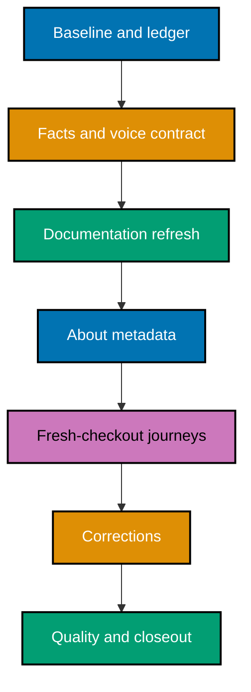

# 🌱 README and Onboarding Refresh

## Context

`ose-public` has rich product, engineering, and governance documentation, but a newcomer must
currently reconcile contradictory setup commands, outdated project inventories, dead-end tutorial
routes, and repository-specific terminology before they can understand the product or run it.
[Repo-grounded] A read-only inventory on 2026-08-20 found 1,004 tracked `README.md` files and 9,294
tracked Markdown files. Many are historical, generated, or educational content rather than living
onboarding surfaces, so a trustworthy refresh needs an explicit disposition for every file rather
than a blind rewrite.

This plan covers exactly one repository: `ose-public`, the public platform and upstream source of
truth. Its sibling repositories are described accurately in the documentation this plan touches, but
no work is delivered into them.

The outcome is a welcoming reader journey, not a mass-produced documentation template. Product
people should understand what the platform is and where product truth lives. Early-level engineers
should be able to set up a clean checkout, see a representative product run, understand the expected
result, and recover from common failures without guessing.

> 🔐 **Sensitivity boundary**: This plan and every artifact it produces must remain safe to commit
> publicly. Never copy a real hostname, username, IP address, credential, token, certificate,
> connection string, or real `.env*` value into plan files, documentation, evidence, commit
> messages, or GitHub metadata. Use named environment variables and `<placeholder>` values only.
> Read `.env.example` when needed; never read or edit a real `.env*` file.

## Scope

### In scope

- Exhaustively inventory every tracked `README.md` plus every tracked Markdown document related to
  current onboarding, setup, architecture, navigation, security, contribution, or repository
  relationships. Record one terminal disposition for every resolved document; treat
  `follow-up-required` as a blocking non-terminal state.
- Refresh living reader-facing READMEs and directly related onboarding, contribution, setup,
  architecture, repository-relationship, and navigation documentation when the audit finds a
  concrete need.
- Create a dedicated onboarding tutorial that carries a newcomer from clone to a visible first run.
- Give readers two distinct paths after a shared orientation: **Understand the product** and **Run
  OSE locally**.
- Keep external contributions closed while making maintainer and invited-contributor guidance
  accurate, kind, and consistent with `worktree-to-pr`.
- Add a narrow staged-Markdown exemption for the conventional `CONTRIBUTING.md` filename, with a
  negative control proving other invalid uppercase names remain rejected.
- Validate macOS and Ubuntu Linux onboarding paths. Mention Windows through WSL2 as potentially
  workable but unsupported and unverified.
- Update the GitHub description, homepage, and safe topics, plus the root `package.json`
  description.
- Use purposeful emojis for wayfinding in allowed Markdown surfaces without replacing clear labels.
- Apply a human voice contract: product purpose first, second person, plain verbs, explained terms,
  short paragraphs, concrete outcomes, and varied prose that sounds like a welcoming teammate.

### Out of scope

- Any delivery into the private sibling, `ose-primer`, or `beaver-nest`. Documentation here may describe
  those repositories accurately; no branch, PR, metadata change, or file edit lands in them.
- The `apps/rhino-cli/` tree and its bound Gherkin under `specs/apps/rhino/behavior/rhino-cli/`.
  Most of those paths are byte-identical with the private sibling, and changing one would open a
  cross-repository obligation this plan explicitly does not carry. The plan declines the whole of
  both trees rather than only the byte-identical subset, so the rule is simple to check. They are
  recorded in the ledger as `identity-bound` and audited without being edited.
- Rewriting completed plans under `plans/done/` or changing historical claims merely to match the
  present.
- Clearing the pre-existing README-index completeness backlog in `docs/` and `specs/`. Those trees
  sit outside the `governance-readme-completeness` gate and belong to a separate follow-up plan.
- Hand-editing generated harness bindings or other generated READMEs.
- Any durable container artifact. The Ubuntu journey uses a disposable upstream `ubuntu:24.04`
  container; no Dockerfile, compose file, devcontainer, or built image is committed, and the base
  image is removed after the journey unless it predated it.
- Opening external contributions or promising response/review times.
- Native Windows support or a verified WSL2 support commitment.
- Production infrastructure changes, live deployments, or real-secret handling.
- UI redesign of any application. This is a documentation and repository-metadata program.

## Status

**Done** — archived 2026-08-21.

All ten phases executed. Five pull requests merged into `main`: [#236](https://github.com/wahidyankf/ose-public/pull/236)
(plan rescope), [#237](https://github.com/wahidyankf/ose-public/pull/237) (documentation contract and
corpus ledger), [#238](https://github.com/wahidyankf/ose-public/pull/238) (the reader-facing refresh),
and [#239](https://github.com/wahidyankf/ose-public/pull/239) plus
[#240](https://github.com/wahidyankf/ose-public/pull/240) (two correction iterations the fresh-checkout
journeys and the reconciliation reviews exposed).

The reconciliation phase ran longer than planned. Its factual-accuracy review took nine rounds and its
voice review seven before each met its termination criterion, producing corrections `C-06` through
`C-97`. Roughly half of those rounds found genuine pre-existing defects; a few found defects this
plan's own repairs had introduced. Both patterns are analysed in
[`artifacts/execution-record-fixes.md`](./artifacts/execution-record-fixes.md) rather than left as an
unexplained round count.

## Approach Summary

The plan first establishes a fact map, reader-journey contract, and disposition ledger. It then
delivers one cohesive documentation refresh, applies repository metadata, proves the journey from
clean checkouts on both supported operating systems, corrects whatever those journeys expose, and
finishes with a full-corpus reconciliation and archival.

## Resolved Design Decisions

1. Review every living reader-facing README; edit only where evidence requires it.
2. Deliver the refresh in `ose-public` alone; sibling repositories receive no change.
3. Give readers distinct product-understanding and local-run paths after a shared orientation.
4. Lead with product purpose; present technology as an enabling capability.
5. Add a dedicated onboarding tutorial instead of turning the root README into a manual.
6. Keep external contributions closed.
7. Use a `CONTRIBUTING.md` lint exemption instead of changing `rhino-cli` for that filename alone.
8. Verify onboarding from fresh checkouts on macOS and Ubuntu Linux; label WSL2 as unsupported.
9. Use `ose-www` as the first-success milestone.
10. Update complete GitHub About metadata with accurate public positioning.
11. Use purposeful emojis and enforce a natural, non-robotic editorial voice.
12. Stay outside the `rhino-cli` byte-identity boundary so no cross-repository obligation opens.
13. Keep all plan content and evidence free of secrets and private paths.
14. Run the Ubuntu journey in a disposable upstream `ubuntu:24.04` container, commit no
    container artifact, and delete the pulled image afterwards.

## Worktree and Delivery Mode

**Delivery mode**: `worktree-to-pr`. The plan uses one worktree for the whole program —
`worktrees/repository-onboarding-readme-refresh/` — and switches branches per delivery unit, as the
[Worktree Cap](../../../repo-governance/conventions/structure/plans/worktree-cap.md#worktree-cap--one-worktree-per-repository-per-plan-hard-rule)
requires. Phase 0 opens no PR and pushes no branch.

The documentation refresh is one cohesive delivery unit because its entry points, link graph,
contribution posture, related docs, and corpus ledger must agree at merge. Correction units and the
closeout are separate.

See [delivery.md](./delivery.md#parallelization-model) for the DAG, branches, and delivery
boundaries.

## Plan Documents

- [Business requirements](./brd.md) — why this matters, evidence, outcomes, and risks.
- [Product requirements](./prd.md) — personas, reader journeys, voice contract, and Gherkin.
- [Technical design](./tech-docs.md) — corpus rules, information architecture, security, and file
  impact.
- [Delivery checklist](./delivery.md) — granular phases, commands, gates, and PR boundaries.
- [Learnings](./learnings.md) — transient, sensitivity-gated execution log.

## Related Documentation

- [README Quality Convention](../../../repo-governance/conventions/writing/readme-quality.md)
- [Content Quality Principles](../../../repo-governance/conventions/writing/quality.md)
- [Diátaxis Framework](../../../repo-governance/conventions/structure/diataxis-framework.md)
- [Plans Organization Convention](../../../repo-governance/conventions/structure/plans.md)
- [Related Repositories](../../../docs/reference/related-repositories.md)
- [Secrets and Environment Standards](../../../repo-governance/conventions/security/secrets-and-env-standards.md)
