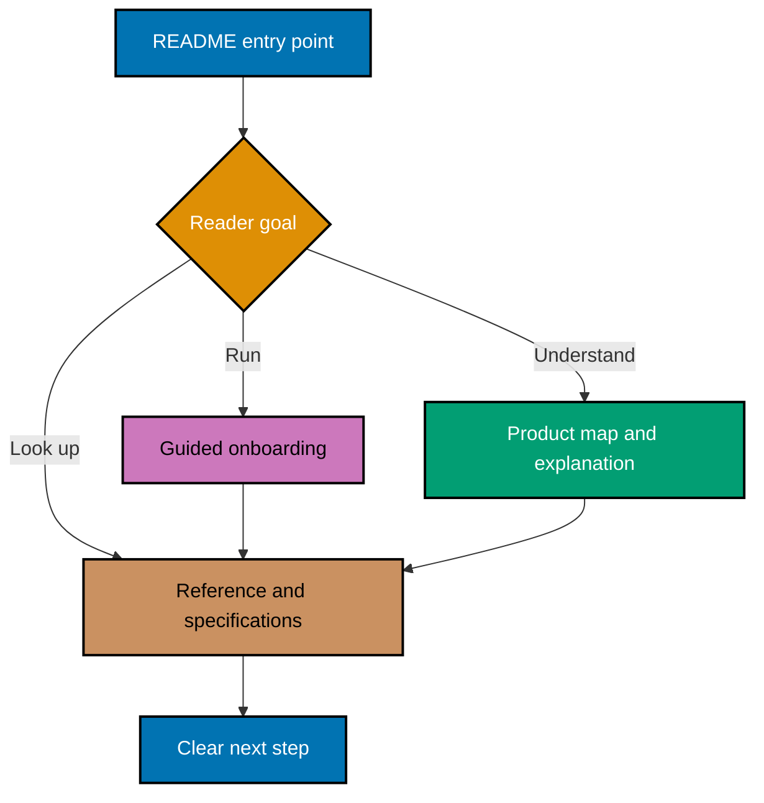
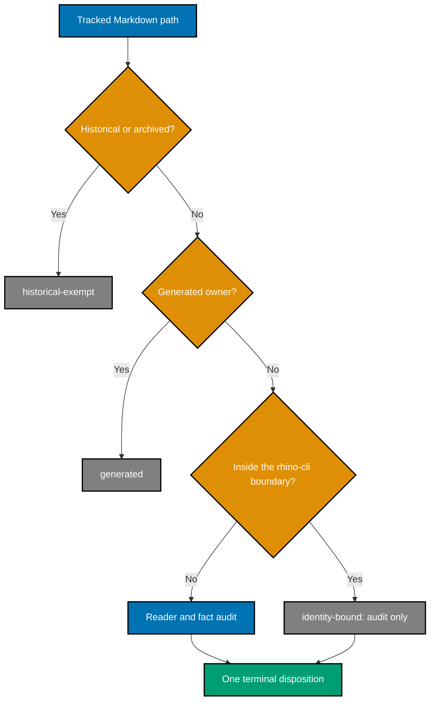

# 🏗️ Technical Design: Reader Documentation System

## Architecture Overview

The plan treats documentation as a routed system with four layers:

1. **Entry points** choose the reader path.
2. **Guided onboarding** produces the first meaningful outcome.
3. **Reference and specifications** own durable facts.
4. **Disposition and validation artifacts** prove coverage without becoming reader documentation.



## Source-of-Truth Matrix

| Fact class                 | Authoritative source                            | README treatment                                                                    | Validation                                                     |
| -------------------------- | ----------------------------------------------- | ----------------------------------------------------------------------------------- | -------------------------------------------------------------- |
| Node/npm versions          | `package.json` `volta` object                   | Link or show a command that reads the manifest; avoid copied pins unless essential. | `jq '.volta' package.json`                                     |
| Project inventory          | Resolved Nx workspace                           | Describe only current projects.                                                     | `npm exec nx show projects -- --json`                          |
| Project targets and ports  | `npm exec nx show project <project> -- --json`  | Use package-manager-prefixed commands and state expected behavior.                  | Parse `targets` before smoke-running.                          |
| Product status and roadmap | `roadmap.md` and product specifications         | Summarize purpose; link for detail.                                                 | Cross-read the named canonical file.                           |
| Behavior and architecture  | `specs/` and focused reference/explanation docs | README links rather than duplicating design.                                        | Link and readme-index validation.                              |
| Contribution posture       | Root policy plus `CONTRIBUTING.md`              | State closed external intake consistently.                                          | Repository-wide phrase and link audit.                         |
| Delivery mode              | Plans and trunk/worktree governance             | Teach `worktree-to-pr` for authorized contributors.                                 | Link check plus workflow review.                               |
| Repository relationships   | Canonical ecosystem instructions                | Distinguish content parity from `rhino-cli` byte identity.                          | Relationship text audit.                                       |
| GitHub About metadata      | GitHub repository fields                        | Root README and About panel must agree in intent.                                   | `gh repo view --json description,homepageUrl,repositoryTopics` |
| Package description        | Exact PRD package metadata contract             | Package tooling and repository positioning must agree.                              | `jq -r '.description' package.json`                            |

## Design Decisions

| Decision                                                                            | Why                                                                                                                                                                                                                                            |
| ----------------------------------------------------------------------------------- | ---------------------------------------------------------------------------------------------------------------------------------------------------------------------------------------------------------------------------------------------- |
| Inventory all tracked Markdown, but require every README to receive a reader audit. | This catches directly related non-README docs without turning historical records or educational content into rewrite targets.                                                                                                                  |
| Re-verify the prior audit's findings before acting on them.                         | Findings recorded on 2026-08-06 may already be fixed; acting on a stale finding would manufacture churn.                                                                                                                                       |
| Leave the whole `rhino-cli` tree untouched, not only its byte-identical subset.     | Most of those paths are byte-identical with the private sibling, and editing one would create a sibling-repository obligation this single-repository plan excludes. Declining the wider tree keeps the rule simple and fires the guard sooner. |
| Resolve versions, commands, projects, and ports from live configuration.            | Copied facts drift; commands tied to their owning manifests can be retested.                                                                                                                                                                   |
| Expand the corpus ledger into one executable row per document after inventory.      | Per-file accountability stays granular and reviewable instead of hiding behind a family-level checkbox.                                                                                                                                        |
| Keep code changes outside this documentation program unless the change blocks it.   | A required code change becomes a separately planned prerequisite — unless it blocks this program, in which case it is delivered under the regression-test mandate.                                                                             |

## Corpus Discovery and Disposition Algorithm

The path-complete Markdown ledger lives under this plan's `artifacts/` folder. No ledger quotes
document bodies, command output, configuration values, or credentials.

1. Record the repository's `origin/main` SHA, then run
   `git ls-tree -r --name-only <recorded-origin-main-sha> | grep -E '\.md$'` and sort paths bytewise.
   This prevents another actor's staged changes from contaminating the inventory. Filter with `grep`
   rather than a `-- '*.md'` pathspec: `git ls-tree` does not support glob pathspec magic, so the
   pathspec form matches nothing and returns an empty list without erroring — a silent zero that a
   completeness check would read as success.
2. Mark every `README.md` as audit-required. For every other Markdown path, record whether it is a
   living repository-facing document related to onboarding, setup, architecture, navigation,
   security, contribution, or repository relationships; otherwise assign `not-reader-doc` with a
   reason.
3. Classify ownership before reading prose:
   - `plans/done/` and archived trees → `historical-exempt`.
   - Generated harness surfaces → `generated`.
   - `apps/rhino-cli/` and `specs/apps/rhino/behavior/rhino-cli/` → `identity-bound`.
   - Active plans → navigation/index audit; bodies remain planning records.
   - Specs navigation → product-reader and link audit; no manufactured prose.
   - Educational content trees → inventoried, but owned by their own content conventions and not
     rewritten by this plan.
   - Living root/app/lib/docs/infra/governance indexes → full reader/fact/voice audit.
4. For every audit-required or reader-related file, record intended audience and one-sentence
   purpose.
5. Check facts, commands, links, navigation, ownership, and voice.
6. Assign exactly one terminal disposition and a brief evidence note.
7. Reconcile the baseline against the recorded tree with `git ls-tree`; reconcile a proposed unit
   against `git ls-files --cached --others --exclude-standard -- '*.md'`; and reconcile post-merge
   state against current `origin/main` with `git ls-tree`. Reject missing, duplicate, or unexplained
   extra paths at every stage.



## Information Architecture

- Root README: product purpose, maturity, closed contribution posture, sibling-repository lines, and
  the two reader paths.
- Product path: roadmap → product specifications → app/spec indexes.
- Engineering path: onboarding walkthrough → `ose-www` first run → app README → authorized
  contribution workflow.
- App and library READMEs: local run/build/test/map only; detailed behavior stays in specs.

## Bootstrap Design

The audit found a circular prerequisite claim: `npm run doctor -- --fix` is invoked through the Rust
toolchain, so a clean machine cannot use that command to install Rust if Cargo is absent. The
onboarding tutorial must tell the truth about bootstrap order.

The implementation must:

1. Read the current `package.json` scripts.
2. Determine the minimum bootstrap tools required to invoke doctor on macOS and Ubuntu.
3. Document those prerequisites before `npm install` and doctor.
4. Use manifest-derived version checks rather than duplicated stale values.
5. State the expected output after each bootstrap command.
6. Provide recovery for missing Cargo, Volta, Docker, and project-specific generated artifacts.
7. Avoid empty commits, resets, force pushes, production apply commands, or real-secret steps as
   onboarding verification.

WSL2 receives a short note: the Linux path may work under WSL2, but this program does not verify or
support it.

## Ubuntu Verification Environment

The macOS journey runs on the host. The Ubuntu journey runs inside one disposable container started
from the upstream official `ubuntu:24.04` image.

This plan deliberately produces no durable container artifact:

- No Dockerfile, compose file, or devcontainer is authored or committed.
- No image is built, tagged, or published; the upstream image is used unmodified.
- The container starts detached with a keep-alive process
  (`docker run --rm -d --name ose-onboarding-ubuntu-check ... ubuntu:24.04 sleep infinity`), mounts no
  host path, and publishes only a loopback port; every in-container command runs through
  `docker exec ose-onboarding-ubuntu-check <command>` against that running container, never an implied
  interactive shell.
- The dev target started inside the container binds to all interfaces (`0.0.0.0`), not the container's
  own loopback, so the published `127.0.0.1:<port>` on the host can reach it. If the documented
  onboarding command cannot be made reachable without an undocumented flag, that is a documentation
  defect to record, not a quiet fix to the run command.
- Packages installed inside come only from the onboarding documentation's own prerequisite list. A
  package the journey needs but the docs never mention is a documentation defect, not a fix applied
  quietly inside the container.
- The container is stopped explicitly with `docker stop ose-onboarding-ubuntu-check`, which `--rm` then
  removes; the base image is removed afterwards unless it already existed on the machine before the
  phase.
- The phase opens and closes with the same four Docker listings — images, containers, volumes,
  networks — and the diff between them must be empty.

Running the journey in a stock upstream image is also the point: it proves the documented
prerequisites are complete, because nothing else is present to paper over a gap.

## Command Validation Design

Every living reader-facing shell block receives one of four command classifications:

- **Executable onboarding** — run from a fresh checkout on the supported platforms.
- **Safe smoke check** — run locally without mutating external state.
- **Reference-only mutation** — validate syntax and prerequisites, but do not execute live state
  changes.
- **Remove/replace** — unsafe, obsolete, incomplete, or misleading.

Nx commands must use `npm exec nx`. For each documented project/target pair, run
`npm exec nx show project <project> -- --json` and confirm the target before execution. Never infer a
target from another repository.

## CONTRIBUTING.md Exemption Design

`CONTRIBUTING.md` is a conventional GitHub community file but fails the repository's general
lowercase Markdown naming gate when touched. This plan uses a narrow lint-staged exemption rather
than changing the shared validator:

The exemption already exists in two places on `origin/main`: the `lint-staged` Markdown command in
`package.json` passes `--exempt "CONTRIBUTING.md"` to `md naming validate`, and `repo-config.yml`
carries the matching gate-registry entry. Execution therefore verifies rather than authors:

1. Read the Markdown `lint-staged` command in `package.json` and the corresponding `repo-config.yml`
   entry.
2. Confirm both declare the exact `CONTRIBUTING.md` exemption and that neither widens the match.
3. Verify the naming validator accepts the real root file.
4. Verify a temporary non-exempt uppercase path such as `<temp-dir>/Some-Doc.md` still fails.
5. Remove the temporary fixture immediately after the negative check.

Only a missing or divergent declaration is edited. The change must stay inside repository
configuration: if it would require an edit under `apps/rhino-cli/`, it stops and becomes a separate
plan, because that tree is outside this plan's scope.

## GitHub Metadata Design

Metadata updates use authenticated `gh repo edit` commands. Before mutation, record only
`nameWithOwner`, `description`, `homepageUrl`, `repositoryTopics`, `url`, and `visibility`. Never
record collaborator, security, environment, or workflow-secret data.

The executor applies the exact description and homepage from
[prd.md](./prd.md#github-about-metadata-contract), then uses the GitHub topics API's replace
operation so the final topic array equals the contract instead of accumulating stale topics.
Authenticated CLI/API output is authoritative; browser inspection is supplementary.

Rollback captures the prior safe field values in the plan evidence and restores them with
`gh repo edit` if verification fails.

## Byte-Identity Boundary Guard

Content parity and byte identity are different, and this plan touches neither:

- Generic content parity: `ose-public` → the private sibling, adapted rather than blindly copied.
- `rhino-cli` byte identity: `ose-public` = the private sibling, zero carve-outs, across exactly seven
  pathspecs — `apps/rhino-cli/{src,tests,Cargo.toml,Cargo.lock,project.json,LICENSE}` and
  `specs/apps/rhino/behavior/rhino-cli/gherkin`. Read them from `BOUNDARY_PATHS` in
  `apps/rhino-cli/src/application/parity.rs`, never from memory. This plan's own no-edit scope is
  wider than that boundary: it declines the whole `apps/rhino-cli/` and
  `specs/apps/rhino/behavior/rhino-cli/` trees, so a path can be out of scope here without being
  byte-identical — `apps/rhino-cli/README.md` is exactly that case.
- `beaver-nest`: a fork outside both sets.

The repository already enforces this boundary with a registered gate, `rhino-cli parity manifest
validate`, wired to pre-push and CI against `apps/rhino-cli/parity-manifest.sha256`. This plan adds an
earlier, cheaper tripwire: because no sibling delivery exists here, every delivery unit asserts a
zero-diff guard for the identity boundary before commit:

```bash
git diff --cached --name-only -- apps/rhino-cli specs/apps/rhino/behavior/rhino-cli | head -1
```

An empty result is the acceptance criterion. A non-empty result stops the unit: the change either
moves to a separate cross-repository plan or is reverted. The parity gate stays authoritative — the
staged guard only catches the mistake sooner.

Reader documentation may still describe these relationships; describing a boundary is not editing
it.

## Secret and Sensitivity Architecture

The plan uses three gates:

1. **Read gate** — never read real `.env*`; use `.env.example`, manifests, project configuration,
   safe tracked docs, and sanitized command output only.
2. **Write gate** — plan files, docs, metadata, reports, evidence, and commit messages use variable
   names or `<placeholder>` tokens, never values.
3. **Pre-commit gate** — scan staged content with the deterministic gates and require an independent
   AI sensitivity review of the staged diff before every delivery boundary.

Evidence must not include full environment dumps, GitHub authentication state, remote URLs with
embedded credentials, process environments, or screenshots exposing sensitive browser/session data.

## Corpus Disposition

The guided onboarding document is an operational setup walkthrough, not a course or curriculum. It
lives in `docs/tutorials/` because it guides a newcomer through a complete first-success journey, but
it does not create a syllabus, course catalog, learning path, or reusable educational corpus. The
learning-plan `syllabus/` convention therefore does not apply.

## File-Impact Analysis

The exact members are discovered by the tracked-Markdown ledger algorithm before editing. Bounded
families are eligible only after expansion into one exact per-document task row in the ledger.

```text
.
├── README.md [E] — product-first entry and reader paths
├── CONTRIBUTING.md [E] — closed intake and authorized delivery
├── AGENTS.md [E] — factual onboarding claims only when evidence requires
├── package.json [E] — description truth and filename exemption
├── roadmap.md [E] — product-map drift only
├── docs/**/*.md [E] — exact reader-related rows only
├── docs/tutorials/getting-started-with-ose-public.md [E] — first-success walkthrough
├── {apps,libs,specs,infra}/**/README.md [E] — every README receives a row
├── repo-governance/**/README.md [E] — living navigation indexes
├── {plans,social-media-posts}/**/README.md [E] — catch-all living indexes
├── .claude/{agents,skills}/README.md [E] — canonical catalogs
├── {.opencode,.codex,.agents}/** [G] — generated from canonical `.claude/` sources
├── local-tmp/repository-onboarding-readme-refresh/execution-record-phase-0.md [N] — gitignored baseline record
├── local-tmp/repository-onboarding-readme-refresh/execution-record-verification-program.md [N] — gitignored safe-status record
└── plans/in-progress/repository-onboarding-readme-refresh/
    ├── {README,brd,prd,tech-docs,delivery,learnings}.md [E] — control plan
    ├── artifacts/reader-doc-disposition-ose-public.md [N] — path ledger
    ├── artifacts/execution-record-{contract,public,fixes,closeout}.md [N] — durable task records
    └── evidence/README.md [N] — sanitized evidence index
```

### More Detail

`[E]` on a bounded family means “eligible for evidence-based editing,” not “every member must
change.” The ledger is the exact file list. Paths assigned `verified-unchanged`, `generated`,
`historical-exempt`, or `identity-bound` remain untouched.

Two trees are deliberately absent from the tree above because this plan edits nothing inside them:
`apps/rhino-cli/` and `specs/apps/rhino/behavior/rhino-cli/gherkin/`. They receive a ledger row and
an `identity-bound` audit verdict, and the staged guard in `delivery.md` proves no unit changed them.

The three generated harness trees are the current registry's complete set — `repo-config.yml`'s
`harness:` list is authoritative, and the repository supports exactly three harnesses.

## Vercel MCP Capability Declaration

`ose-www` is deployed through Vercel and this repository tracks `vercel.json` files, so the Vercel
capability rule applies. **No Vercel MCP capability is required by this plan and no step contacts
Vercel.** Every `ose-www` interaction here is a local `dev` run in a disposable checkout; the plan
performs no deployment, no environment-variable change, no domain or DNS work, no firewall or WAF
change, and no billing, usage, or Observability query. Phase 0 therefore runs no availability probe.
If execution ever discovers that a documented claim can only be verified against a live Vercel
deployment, that verification stops as out of scope and becomes a separate plan rather than being
attempted here.

## README-Index Completeness Carve-Out

The `governance-readme-completeness` gate is scoped to `repo-governance/`, `.claude/`, and `.codex/`.
`docs/` and `specs/` are deliberately outside it: they carry a large pre-existing backlog of
missing/unannotated index entries that a separate follow-up plan owns. This plan does not adopt that
backlog. A `docs/` or `specs/` README this plan edits must not _introduce_ a new unannotated index
link, but bringing those two trees up to the annotated-completeness bar is out of scope, and the
repo-wide `governance readme-index validate` baseline is recorded in Phase 0 rather than driven to
zero.

## Dependencies

- Repository access and GitHub CLI authorization for `ose-public`.
- One worktree in `ose-public`, branch-switched per delivery unit.
- macOS for the host fresh-checkout journey, and Docker for the disposable Ubuntu journey.
- Browser automation for the documented first-success page.
- `readme-maker` → `readme-checker` → `readme-fixer` and the strict documentation quality gate.
- PR Review Maker→Fixer execution for every `worktree-to-pr` delivery unit.

## Testing and Verification Strategy

- **Inventory completeness** — compare the baseline ledger with its recorded `origin/main` tree, then
  compare proposed and merged inventories; require one row per path and one state per row, including
  planned-new files.
- **Per-document acceptance** — execute the command, fact, link, reader-route, and voice checks
  recorded in that exact ledger row; a family gate cannot substitute for a row result.
- **Mechanical quality** — run Prettier, markdownlint, Rhino Mermaid, heading, link, naming,
  frontmatter, and README-index validators through repository-authoritative commands.
- **Behavioral onboarding** — run the journey independently on macOS and Ubuntu, then inspect the
  expected page with browser tooling.
- **Boundary** — assert the staged zero-diff guard at every commit and let the registered
  `parity manifest validate` gate confirm the committed byte state at pre-push and in CI.
- **Privacy** — run the discovered canonical secret gate and an independent AI semantic review.
- **Repository-wide truth** — compare contribution, platform-support, repository-relationship, and
  byte-identity claims after the documentation PR merges.

## Rollback

- Documentation PRs remain independently revertible by document family.
- Metadata rollback restores the captured safe prior description, homepage, and topics.
- Generated bindings roll back by reverting the canonical source and regenerating.
- If fresh-checkout proof fails, keep the owning PR open, correct the docs or the blocking root
  cause, and rerun the journey; never weaken the acceptance criterion.
