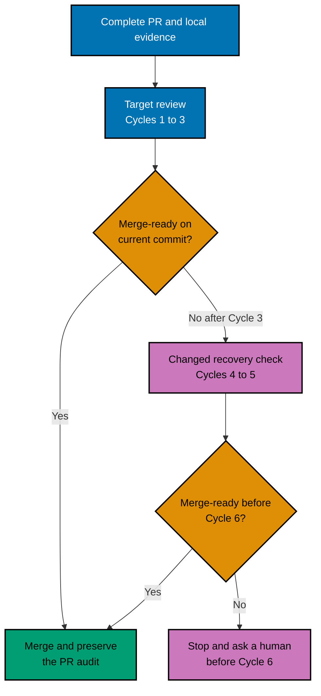
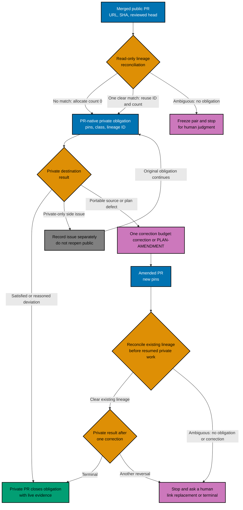

# Technical Design: Optimize the Pull Request Process

## Design Decisions

[Judgment call] GitHub remains the system of record. Repository prose defines the durable contract;
no bot, parser, database, registry, or new CI gate is the default. A mechanism may enter optional
Wave C only after repeated measurable failure, no adequate existing gate, a reversible tested
design, clear ownership, and benefit greater than maintenance cost. Evidence labels follow
[README.md](./README.md#evidence-labels-and-sources).

The plan changes sources before consumers. A public source PR merges before its private adaptation;
hand-authored `.claude/**` content changes before generated bindings; rules change before code; and
each PR starts from then-current `origin/main` in the one owned worktree for that repository.

## Review State Model



Equivalent prose: prepare a complete PR once, aim to converge in Cycles 1–3, and merge as soon as
the exact current commit is green, scope is stable, no blocking thread remains, and the PR audit is
complete. If Cycle 3 misses, Cycles 4–5 name the remaining defect family and use a materially
different focused check. Stop before Cycle 6; no extra clean cycle or earlier human checkpoint is
required.

## Human PR Artifact Contract

The PR body is a short reading aid, not an academic paper. It leads with outcome and motivation,
then gives scope/non-goals, a path-ordered reading guide, verification, review focus, dependencies,
integration safety, stable-main proof, and rollback. Deep evidence is linked. Mermaid is optional
and appears only when it makes a multi-step relationship easier to understand; equivalent prose is
mandatory.

The synthesizer posts one concise consolidated review. Each blocking finding uses the narrowest
relevant line and teaches the claim, severity, evidence, impact, bounded remedy, and safe refutation.
The fixer independently revalidates it and replies in the same native thread with `fix`,
`reject-with-reason`, `defer-with-reason`, or `clarify`. A fixed reply links the pushed commit;
a rejection cites contrary evidence; a deferral links a real follow-up; clarification remains open
until answered. Every AI-authored body, review, reply, and summary ends with `Generated by AI`.

## File-Impact Analysis

This scan-first tree is the public-repository source of truth. Every `[E]` or `[D]` leaf is an
admitted public path or closed path pattern. A literal `[N]` leaf is an equally admitted, finite
creation target only: it authorizes no existing-file edit and never expands through a glob. `[N] no
private path` remains an explicit no-authority record. A label does not make a directory an edit
authorization. A unit records its exact before/after ledger. Program/script lines (`P`) are at most
400; when program/script and non-program lines (`N`) are both present, `P + N` is at most 900
(`N ≤ 900 − P`); 1,000 handwritten lines is the absolute ceiling; and there are at most 20
hand-authored files.

```text
.
├── [E] plans/in-progress/optimize-pr-process/{README,brd,prd,tech-docs,delivery,idea-disposition-map,learnings}.md
│       # control-plan sources for pre-move edits; no other in-progress plan is admitted
├── [D] plans/in-progress/optimize-pr-process/{README,brd,prd,tech-docs,delivery,idea-disposition-map,learnings}.md
│       # CLOSURE removes these seven files only after those reviewed pre-move edits
├── [E] plans/in-progress/README.md
│       # CLOSURE removes only this control-plan entry after its reviewed archive move
├── [E] plans/done/README.md
│       # CLOSURE adds only the archived control-plan entry after its reviewed archive move
├── [E] plans/ideas/q2-not-urgent-important/{actions-cache-eviction-policy,shared-cargo-target-lock-contention,deploy-targets-registry}.md
│       # the three PUB-IDEAS-6 repairs admitted only by merged PR #282 at 56e5fa6c
├── [E] repo-governance/development/workflow/bare-repo-landing-method/when-this-applies.md
│       # the fourth PUB-IDEAS-6 repair admitted only by merged PR #282 at 56e5fa6c
├── [E] repo-governance/conventions/structure/plans/execution-grade-clarity.md
│       # PLAN-STATE-CORRECTION: canonical finite cross-repository runbook exception only
├── [E] .claude/skills/plan-validating-quality/reference/{delivery-checklist-validation-part1,rule11-execution-grade-clarity-validation}.md
│       # PLAN-STATE-CORRECTION: exact checker sources only
├── [E] .claude/skills/plan-creating-project-plans/reference/execution-grade-clarity.md
│       # PLAN-STATE-CORRECTION: exact plan-maker source only
├── [E] .claude/skills/plan-applying-fixes/reference/execution-grade-clarity-fixes.md
│       # PLAN-STATE-CORRECTION: exact plan-fixer source only
├── [E] .agents/skills/plan-validating-quality/reference/{delivery-checklist-validation-part1,rule11-execution-grade-clarity-validation}.md
│       # PLAN-STATE-CORRECTION: generated checker mirrors only
├── [E] .agents/skills/plan-creating-project-plans/reference/execution-grade-clarity.md
│       # PLAN-STATE-CORRECTION: generated plan-maker mirror only
├── [E] .agents/skills/plan-applying-fixes/reference/execution-grade-clarity-fixes.md
│       # PLAN-STATE-CORRECTION: generated plan-fixer mirror only; never hand-edit and require binding validation
└── [N] plans/done/<recorded-YYYY-MM-DD>__optimize-pr-process/{README,brd,prd,tech-docs,delivery,idea-disposition-map,learnings}.md
        # CLOSURE archive targets only; record the runtime date before the move
```

Completed PUB-IDEAS-4 sources
`plans/ideas/q1-urgent-important/deletion-authorized-by-absence.md` and
`plans/ideas/q2-not-urgent-important/class-sweep-completeness.md` are historical evidence only:
they are absent and never re-admitted. The former PUB-IDEAS-6–8 idea briefs are also retired
historical receipts and are deliberately absent from this active file-impact tree. Completed PUB-IDEAS-5 sources
`plans/ideas/q1-urgent-important/plan-checker-forward-reference-detection.md` and
`plans/ideas/q2-not-urgent-important/merge-queue-adoption.md`, plus their PR #281 backlink repair,
are historical evidence only and are never re-admitted.

### External Repository — the private sibling (Record Only; No Edit Authority)

The private sibling is a separate repository and is deliberately outside this public file-impact tree.
Its own plan, worktree, branch, before-ledger, PR, and explicit deviation record decide any private
edit. A public PR may record only a sibling obligation and public-safe semantic deviation; neither
that record nor a public propagation manifest grants private-file authority.

### Amendment-Only Admission for Later Rule Waves

No A1, A2, A3, B, or optional-C source/mirror path is admitted by a generic family or by a
discovery result. The scheduled `PRE-A1-ADMISSION` plan-only PR is the one explicit route for known
A1/A2/A3/B public paths: it must add each exact source path, every generated mirror (if any), its
owning unit, and bounded before-ledger to this tree and matching delivery ledger before `PUB-A1`
starts. PR #289 is public provenance only. Its paired private plan-only `PRIV-ADMISSION` completed
in private PR #64 (private, not linked) at
`db40c969f8c6a554837efab1cf266c8d505c02a6`; it supplied the private-safe counterpart and historically
released `PRIV-A1`, completed by private PR #65 at `71c8a0f1f318bf856141f1067a31f15f307b7f3b`.
Neither admission edits a rule. A propagation manifest may recommend placement but cannot itself
expand scope. Optional Wave C remains `N/A` unless its separately human-approved necessity case
first supplies exact paths through the ordinary amendment route.

### Bounded Delivery Ledger

| Unit                   | Hand-authored source boundary                                                                                | Generated or retirement boundary                             | Done state                                                                            |
| ---------------------- | ------------------------------------------------------------------------------------------------------------ | ------------------------------------------------------------ | ------------------------------------------------------------------------------------- |
| PUB-IDEAS / PRIV-IDEAS | Only paths pinned in the [idea map](./idea-disposition-map.md) and each repository's `plans/ideas/README.md` | No bindings                                                  | Mapped briefs absent, indexes reconciled, historical links preserved                  |
| A1/A2/A3/B public      | Exact paths only after merged `PRE-A1-ADMISSION`; private scope remains external to this tree                | Exact mirrors only after that same public admission          | Each later row cites the admitted owner and predecessor pin                           |
| A1 private             | Exact private paths only after merged `PRIV-ADMISSION`                                                       | Exact private mirrors only after that same private admission | Completed by #65; historical receipt only                                             |
| A2/A3/B private        | A small `PRIV-<wave>-ADMIT` PR records exact paths after its public predecessor terminal handoff             | Exact mirrors only after that admission PR merges            | The following source PR records semantic counterpart/deviation without public leakage |
| C public/private       | `N/A` unless a human-approved amendment supplies exact paths                                                 | `N/A` unless that amendment names exact generated mirrors    | Recorded no-change decision, or necessity evidence plus reversible implementation     |
| Closure                | Public plan folder/index and private obligation thread                                                       | No bindings                                                  | Both mains green on recorded pins; final public PR archives the control plan          |

Use one PR for as much of each natural, independently stable row as fits. Split into named cohesive
sub-units only if it would exceed 400 handwritten program/script lines, 900 handwritten lines when
both categories are present, 1,000 handwritten lines in total, or 20 hand-authored files. The
table's owned subtrees are discovery boundaries, not blanket permission; the PR body publishes the
exact file ledger and both line categories.

### PRE-A1-ADMISSION Public Ledger

The strict dry run used public pin `70dbe4187dd720d8fe344960d227c44cf3d549f5`. The tracked table
and exact records below, plus the PR-native admission comment, are the authority; the ignored
`generated-reports/**` manifest is only a local working aid. Public `PUB-A1` paths were edited only
by PR #289; all other listed public paths remain candidates for their named future unit. No private
path is admitted here.

| Unit    | Exact hand-authored candidate paths                                                                                                                                                                                                                                                                                                                                                                                                                                                                                                                                                                                                                                                                                                                                                                                                                                                                                                                                                                                                                                                                        | Generated paths                                                         | Owner and bounded outcome                                                                                                                 |
| ------- | ---------------------------------------------------------------------------------------------------------------------------------------------------------------------------------------------------------------------------------------------------------------------------------------------------------------------------------------------------------------------------------------------------------------------------------------------------------------------------------------------------------------------------------------------------------------------------------------------------------------------------------------------------------------------------------------------------------------------------------------------------------------------------------------------------------------------------------------------------------------------------------------------------------------------------------------------------------------------------------------------------------------------------------------------------------------------------------------------------------- | ----------------------------------------------------------------------- | ----------------------------------------------------------------------------------------------------------------------------------------- |
| PUB-A1  | Compact summary only — see the following **Exact Source, Hunk, and Mirror Records** for literal paths and hunk ownership.                                                                                                                                                                                                                                                                                                                                                                                                                                                                                                                                                                                                                                                                                                                                                                                                                                                                                                                                                                                  | None                                                                    | Completed in PR #289: update the human PR-size policy and direct reader prompts only; no new enforcement.                                 |
| PRIV-A1 | The native private admission receipt is complete in PR #64 at `db40c969f8c6a554837efab1cf266c8d505c02a6`; PR #289 pin `539cda50e6aa48079d347ae6131b81901120cd84` is provenance only.                                                                                                                                                                                                                                                                                                                                                                                                                                                                                                                                                                                                                                                                                                                                                                                                                                                                                                                       | None                                                                    | It must publish a private-safe semantic adaptation, reasoned deviation, or `N/A`; it cannot infer edit authority from PUB-A1.             |
| PUB-A2  | Exact sources are listed in the records below; this compact row is a summary only.                                                                                                                                                                                                                                                                                                                                                                                                                                                                                                                                                                                                                                                                                                                                                                                                                                                                                                                                                                                                                         | Exact generated mirrors are listed below.                               | Add one pre-fan-out route record and bounded-cycle policy without widening the existing scope guard.                                      |
| PUB-A3  | Exact sources are listed in the records below; this compact row is a summary only.                                                                                                                                                                                                                                                                                                                                                                                                                                                                                                                                                                                                                                                                                                                                                                                                                                                                                                                                                                                                                         | Exact generated mirrors are listed below.                               | Make bodies and native review conversations human-readable without duplicating compatible scope/marker rules.                             |
| PUB-B   | `repo-governance/development/quality/pr-review-disciplines/quality-gate-enhancements-critical-reproduction-and-seven-cycle-maximum.md`; `repo-governance/workflows/pr/README.md`; `repo-governance/conventions/structure/plans/delivery-mode-merge-authority-and-precedence.md`; `repo-governance/development/workflow/pr-merge-protocol/the-worktree-to-pr-terminal-step.md`; `repo-governance/workflows/plan/plan-execution/finalization-pr-review-gate.md`; `repo-governance/workflows/plan/plan-quality-gate/termination-criteria-and-delivery-mode-relationship.md`; `repo-governance/workflows/pr/pr-review-quality-gate/convergence-measurement.md`; `.claude/skills/pr-review-synthesis-coordination/reference/machine-readable-audit-record.md`; `.claude/skills/plan-creating-project-plans/reference/delivery-mode.md`; `.claude/skills/plan-applying-fixes/reference/pr-review-cycle-and-merge-tag-fixes.md`; `.claude/skills/plan-verifying-execution/reference/delivery-mode-pr-review-cycle.md`; `.claude/skills/plan-verifying-execution/reference/delivery-mode-phase0-and-boundaries.md` | Generated counterparts of the five listed `.claude` skill sources only. | Supersede live seven-cycle, two-clean, extensible-ceiling, scope-expanding, and agent-only wording; retain historical evidence unchanged. |

PR #289 supplies public provenance only. The native private admission receipt is complete in
private PR #64 at `db40c969f8c6a554837efab1cf266c8d505c02a6`; it classified the counterpart at
public provenance pin `539cda50e6aa48079d347ae6131b81901120cd84` and historically released
`PRIV-A1`, now completed by private PR #65 at `71c8a0f1f318bf856141f1067a31f15f307b7f3b`.

#### Exact Source, Hunk, and Mirror Records

`PUB-A1` owns only these direct public rule and reader surfaces:

- `repo-governance/conventions/structure/plans/prs-open-at-delivery-boundaries-pr-size.md`
- `repo-governance/conventions/structure/plans/prs-open-at-delivery-boundaries-pr-size-atomicity.md`
- `repo-governance/workflows/plan/plan-execution/per-phase-quality-gate-push-targets.md`
- `.github/pull_request_template.md` — only the `- **Size:**` comment under `## Reading Guide`
- `package.json` (the existing staged Markdown naming command’s required GitHub-template exemption)

It changes the human policy to `P ≤ 400`; where both categories occur, `P + N ≤ 900`
(`N ≤ 900 − P`); and `P + N ≤ 1,000` in all cases. It adds no enforcement. `PRIV-A1` must
independently decide whether its semantic counterpart needs the same prose change.

`PUB-A2` owns the routing hunks, and only those hunks, in these exact sources:

- `repo-governance/workflows/pr/pr-review-quality-gate/steps-0-1-classify-and-scout.md`
- `repo-governance/workflows/pr/pr-review-quality-gate/loop-algorithm.md`
- `repo-governance/workflows/pr/pr-review-quality-gate/loop-exit-and-block-rules.md`
- `repo-governance/workflows/pr/pr-review-quality-gate/purpose-execution-mode-and-classifier.md`
- `repo-governance/workflows/pr/pr-review-quality-gate/route-specific-done-definition.md`
- `repo-governance/workflows/pr/pr-review-quality-gate/probe-variation-and-exit.md`
- `repo-governance/workflows/pr/pr-review-quality-gate/notes.md`
- `.claude/agents/pr-review/pr-review-scout-maker.md`
- `.claude/skills/pr-review-scout-classification/reference/shared-context-and-prior-cycle-read.md`
- `.claude/skills/pr-review-scout-classification/reference/risk-tier-and-specialist-selection.md`

Its exact generated mirrors are `.opencode/agents/pr-review-scout-maker.md`,
`.codex/agents/pr-review-scout-maker.toml`,
`.agents/skills/pr-review-scout-classification/reference/shared-context-and-prior-cycle-read.md`,
and `.agents/skills/pr-review-scout-classification/reference/risk-tier-and-specialist-selection.md`.
`PUB-B` owns only the cadence and terminal-state hunks in the six shared A2 workflow sources;
that hunk division prevents overlapping edits.

`PUB-A3` owns the exact body, teaching, GitHub-conversation, and fixer-triage sources:

- `repo-governance/conventions/structure/plans/prs-open-at-delivery-boundaries-pr-body.md`
- `.github/pull_request_template.md` — every line except the `- **Size:**` comment, which remains
  PUB-A1-owned
- `repo-governance/development/quality/pr-review-disciplines/review-as-teaching.md`
- `repo-governance/workflows/pr/pr-review-quality-gate/github-reviews-api-mechanics-part-1.md`
- `repo-governance/workflows/pr/pr-review-quality-gate/github-reviews-api-mechanics-part-2.md`
- `.claude/skills/pr-review-fixer-resolution/reference/four-way-triage.md`
- `.claude/skills/pr-review-fixer-resolution/reference/reply-resolve-discipline.md`
- `.claude/skills/pr-review-fixer-resolution/reference/identity-and-quality-gates.md`
- `.claude/skills/plan-creating-project-plans/SKILL.md`
- `.claude/skills/plan-creating-project-plans/reference/mandatory-grilling.md`
- `.claude/skills/plan-creating-project-plans/reference/plan-lifecycle-and-git-workflow.md`

Its exact generated mirrors are `.agents/skills/pr-review-fixer-resolution/reference/four-way-triage.md`,
`.agents/skills/pr-review-fixer-resolution/reference/reply-resolve-discipline.md`, and
`.agents/skills/pr-review-fixer-resolution/reference/identity-and-quality-gates.md`, plus the
same relative three plan-creating-project-plans paths under `.agents/skills/`. `PUB-B` owns only
the cadence hunk in `reply-resolve-discipline.md`.

`PUB-B` owns the remaining exact sources and the named cadence/terminal hunks above:

- `repo-governance/workflows/pr/pr-review-quality-gate.md`
- `repo-governance/workflows/pr/pr-review-quality-gate/step-2-fan-out-and-synthesis.md`
- `repo-governance/workflows/pr/pr-review-quality-gate/steps-3-5-fixer-ci-gate-done-check.md`
- `repo-governance/development/quality/pr-review-disciplines/quality-gate-enhancements-critical-reproduction-and-seven-cycle-maximum.md`
- `repo-governance/workflows/pr/README.md`
- `repo-governance/conventions/structure/plans/delivery-mode-merge-authority-and-precedence.md`
- `repo-governance/development/workflow/pr-merge-protocol/the-worktree-to-pr-terminal-step.md`
- `repo-governance/workflows/plan/plan-execution/finalization-pr-review-gate.md`
- `repo-governance/workflows/plan/plan-quality-gate/termination-criteria-and-delivery-mode-relationship.md`
- `repo-governance/workflows/pr/pr-review-quality-gate/convergence-measurement.md`
- `.claude/skills/pr-review-synthesis-coordination/reference/machine-readable-audit-record.md`
- `.claude/skills/plan-creating-project-plans/reference/delivery-mode.md`
- `.claude/skills/plan-applying-fixes/reference/pr-review-cycle-and-merge-tag-fixes.md`
- `.claude/skills/plan-verifying-execution/reference/delivery-mode-phase0-and-boundaries.md`

The five exact `PUB-B` generated mirrors are the same relative five `.claude/skills/**` paths under
`.agents/skills/**`. A unit’s before-ledger must list all 20 or fewer hand-authored paths it will
actually edit; this admission inventory is a maximum discovery boundary, never an instruction to
change every listed path.

### Propagation and Generated-Parity Contract

Every rule wave invokes
[`repo-rules-propagation.md`](../../../repo-governance/workflows/repo/repo-rules-propagation.md)
with `isolation=current` in the already-owned worktree. Its placement manifest records surface,
layer, disposition, and supersessions; its sibling obligation remains a separate output. The
PR-native unit ledger records each normalized rule, authoritative source, consumer, enforcement
disposition, and the two output references.

Hand-authored `.claude/**` sources are edited directly. Run `npm run generate:bindings` once after
source edits; never hand-edit paths that the destination `repo-config.yml` classifies as generated,
including `.agents/skills/**`, `.opencode/agents/**`, and `.codex/agents/**`. Source and vendored
paths remain with their registered owners. Record the source and generated path sets plus tracked
content before staging, run `npm run validate:sync`, then rerun generation and prove both the file
ledger and tracked bytes are unchanged. Generated parity is done only when the checked-in mirrors
match the hand-authored sources in the same commit and the destination repository independently
passes the same checks.

## Cross-Repository Transaction



Equivalent prose: a portable public rule reconciles sealed/correction-pending lineage before obligation:
no match allocates count 0, one clear match reuses ID/count, and ambiguity freezes the pair with no
obligation or correction pending human judgment. The first two outcomes create the obligation with its
URL, merge SHA, reviewed commit, checks, rule class, lineage ID, and destination. Private records
satisfaction, reasoned deviation, or N/A; a private-only issue is separate. A portable defect permits
one public correction, then reconciliation again before resumed private work. A cross-repository
`PLAN-AMENDMENT` for an existing lineage is that correction: it is not a reset or a parallel escape.
Its native obligation record says `correction-kind: correction` or `correction-kind: plan-amendment`,
preserves the lineage ID, and consumes the shared `correction-count: 0 → 1` budget. At reconciled
count 1, neither kind may start; the pair remains frozen for human judgment. A relabel keeps its
lineage and count. This is human-auditable PR evidence, not synchronization automation. Byte-identical
surfaces retain their existing authority.

## Delivery and Rollback DAG

### Historical Delivery and Rollback Receipt

```mermaid
%% Color Palette: Blue #0173B2, Orange #DE8F05, Teal #029E73, Purple #CC78BC, Brown #CA9161
flowchart TD
    accTitle: Historical delivery and reverse dependency rollback receipt
    accDescr: Completed historical sequence retained for audit only; it grants no delivery authority.
    A["ACTIVATE<br/>approved plan"]:::blue --> PUB_BASE{"PUB-BASE<br/>baseline result"}:::orange
    PUB_BASE -->|Clean direct| I4["PUB-IDEAS-4"]:::brown --> I5["PUB-IDEAS-5"]:::brown --> I6["PUB-IDEAS-6"]:::brown --> I7["PUB-IDEAS-7"]:::brown --> I8["PUB-IDEAS-8"]:::brown
    PUB_BASE -->|Baseline failure| PUB_REPAIR["PUB-REPAIR<br/>bounded repair"]:::purple
    PUB_REPAIR -->|Clean repair| I4
    PUB_REPAIR -->|Failed recheck| PUB_FROZEN["PUB-IDEAS frozen<br/>one repair spent; human stop"]:::gray
    I8 --> T["Terminal public proof<br/>landed pin and obligation"]:::teal --> PRIV_BASE{"PRIV-BASE<br/>baseline result"}:::orange
    PRIV_BASE -->|Clean| I2["PRIV-IDEAS"]:::brown
    PRIV_BASE -->|Baseline failure| PRIV_REPAIR["PRIV-REPAIR<br/>bounded repair"]:::purple
    PRIV_REPAIR -->|Clean repair| I2
    PRIV_REPAIR -->|Failed or ambiguous| PRIV_FROZEN["PRIV-IDEAS frozen<br/>repair path or human stop"]:::gray
    I2 --> ADMIT_PUB["PRE-A1-ADMISSION<br/>exact public paths"]:::teal --> PA1["PUB-A1<br/>plan-making rules"]:::blue --> ADMIT_PRIV["PRIV-ADMISSION<br/>exact private paths"]:::purple --> VA1["PRIV-A1<br/>plan-making rules"]:::purple
    VA1 --> PA2["PUB-A2<br/>review routing"]:::blue --> VA2["PRIV-A2<br/>review routing"]:::purple
    VA2 --> PA3["PUB-A3<br/>PR and reply rules"]:::blue --> VA3["PRIV-A3<br/>PR and reply rules"]:::purple
    VA3 --> PUB_B["PUB-B<br/>legacy cleanup"]:::blue --> VB["PRIV-B<br/>legacy cleanup"]:::purple
    VB --> C{"Wave C optional mechanism<br/>necessary?"}:::orange
    C -->|No, record no change| Z["Public closure<br/>archive plan"]:::teal
    C -->|Yes| PC["PUB-C<br/>optional mechanism"]:::blue --> VC["PRIV-C<br/>optional mechanism"]:::purple --> Z
    Z -. "If Wave C merged" .-> VC
    Z -. "If Wave C absent" .-> VB
    VC -.-> PC -.-> VB -.-> PUB_B -.-> VA3 -.-> PA3
    PA3 -.-> VA2 -.-> PA2 -.-> VA1 -.-> PA1 -.-> ADMIT_PRIV -.-> ADMIT_PUB -.-> I2
    I2 -. "if private repair used" .-> PRIV_REPAIR -.-> PRIV_BASE
    I2 -. "if private baseline was clean" .-> PRIV_BASE
    PRIV_BASE -.-> T -.-> I8 -.-> I7 -.-> I6 -.-> I5 -.-> I4
    I4 -. "if public repair used" .-> PUB_REPAIR -.-> PUB_BASE -.-> A
    I4 -. "if public baseline was clean" .-> PUB_BASE
    classDef blue fill:#0173B2,stroke:#000000,color:#FFFFFF,stroke-width:2px
    classDef orange fill:#DE8F05,stroke:#000000,color:#000000,stroke-width:2px
    classDef teal fill:#029E73,stroke:#000000,color:#000000,stroke-width:2px
    classDef purple fill:#CC78BC,stroke:#000000,color:#000000,stroke-width:2px
    classDef brown fill:#CA9161,stroke:#000000,color:#000000,stroke-width:2px
    classDef gray fill:#808080,stroke:#000000,color:#FFFFFF,stroke-width:2px
```



Historical receipt only: PUB-BASE cleanly authorized PUB-IDEAS-4; failure received one PUB-REPAIR attempt, whose
clean recheck authorizes -4 and whose failed recheck freezes ideas for a human, with no second repair.
Successor pins carried -4 through -8; the rest is preserved for audit and grants no future unit,
path, branch, PR, or merge authority. The completed private A1 receipt releases public `PUB-A2`;
its merged terminal handoff is private PR #65 at `71c8a0f1f318bf856141f1067a31f15f307b7f3b`. After
public A2, a distinct private admission PR records its exact source ledger before private A2 begins.

The lightest-fit “feature flag” is recorded per unit: dormant plan or idea text, ordered rule
activation, a compatibility bridge, a tested runtime flag, or an atomic change. This plan expects
dormant text and ordered activation; a runtime flag is not justified unless later code introduces
independently observable behavior. Rollback never depends on unpublished local state.

### Controlled Cross-Repository Runbook Binding

The public plan cannot safely enumerate private paths before native private admission, and repeating
the same lifecycle shell commands in every public/private checkbox would create a second source of
truth. `delivery.md` therefore binds only its finite lifecycle IDs to a same-document packet that
lists record-field sources, copyable commands, private-safe path treatment, and pass/fail evidence.
The binding is human-readable and auditable from the PR artifact; it is not a synchronization tool,
does not authorize a new path, and cannot weaken an existing merge gate.

## Validation

The historical ACTIVATE audit in `delivery.md` gave every pinned numbered rule, bullet, sub-bullet,
and conditional check its own evidence or uncovered disposition. Only a catalog-defined conditional
could use reasoned `N/A`, with its applicability condition and proof; a nonconditional row was never
`N/A`. Only uncovered rows read the five plan documents. PR #290 merged at
`1c916103e75e48c939439d381e8f3ddb9ea3dd54` and its reader receipt, PR #291, at
`92fb921ac9ea5b875f0a83c7a525d82c8af17e1b`. The later native private-admission receipt merged in
private PR #64 (private, not linked) at
`db40c969f8c6a554837efab1cf266c8d505c02a6`, releasing `PRIV-A1` only.

It records every blocker first: zero authorizes ACTIVATE; exactly one proven unique blocker may use the
sole separately gated `PLAN-AMENDMENT`; multiple or uncertain blockers freeze for human judgment. After
that amendment, record its merge pin, re-open and re-evaluate only affected rows once, and human-stop on
any remainder. No amendment rides in a rule wave or starts a general loop.

Every later delivery uses exact-path staged gates, file-ledger reconciliation, post-commit pre-push
gates, native review/fix conversations, current-head CI, merge proof, and full landed-diff resync.
