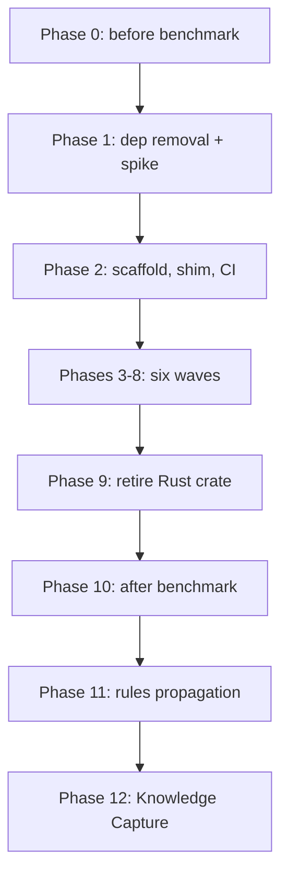

# Rewrite rhino-cli: Rust to F# port

**Status**: In Progress
**Scope**: `ose-public` **and** the private sibling — replace `apps/rhino-cli/` (Rust) with a
behavior-equivalent F# binary, namespace by namespace behind a dispatch shim, then retire the Rust
crate, tear down the Rust CI surface, and re-establish the byte-identity parity boundary across both
repos.
**Created**: 2026-08-25
**Started**: 2026-08-25
**Plan docs**: single-sourced here in `ose-public`. The private sibling carries **no** copy of this
folder — the work lands in both repos, the document lives in one, so the two can never drift.

## Context

`rhino-cli` is the platform's repository-hygiene binary — 13 command namespaces sitting on the
critical path of `.husky/pre-commit`, `.husky/pre-push`, `.husky/commit-msg`, every app's
`test:quick` / `specs:*` Nx targets, and the whole `pr-quality-gate.yml` matrix
[Repo-grounded — `apps/rhino-cli/src/cli.rs`, `.husky/`, `.github/workflows/pr-quality-gate.yml`].

It was rewritten from Go to Rust in
[`2026-05-23__rhino-cli-rust-rewrite`](../../done/2026-05-23__rhino-cli-rust-rewrite/README.md).
That BRD explicitly considered and rejected F#:

> **Port to F#**: discriminated unions + railway-oriented error handling are an excellent fit for
> the validator-style commands. But .NET runtime startup penalty rules it out for a hook-fired CLI

That objection was measured for this plan and turns out to be smaller than either BRD assumed: the
penalty is **0.41 s per commit**, not a disqualifier.

**The rewrite is the decision. The numbers are the record, not the gate.** This plan does not
contain a "stop if F# turns out worse" clause, because the maintainer has already weighed the
trade-off. What it does contain is a disciplined before/after measurement — Phase 0 captures nine
"before" figures, every wave gate appends a running figure, and Phase 10 publishes the comparison
with a better/worse/unchanged verdict on every row, including the unflattering ones.

### What was measured before writing this plan

All figures below were measured on 2026-08-25 on an Apple-silicon workstation, `rustc 1.95.0` /
`dotnet 10.0.300`, comparing today's Rust `rhino-cli` against `apps/crane-cli` (the repo's existing
F# CLI) [Repo-grounded — measurement commands recorded in `tech-docs.md` §Measured Baseline]. They
are **projections for a plan**, not the plan's outcome; Phase 10 replaces them with the real thing.

| Axis                                    | Rust `rhino-cli`  | F# `crane-cli`           | Comparable?               | Better            |
| --------------------------------------- | ----------------- | ------------------------ | ------------------------- | ----------------- |
| Source size measured                    | 65,858 src lines  | 3,770 src lines          | — context row             | —                 |
| Marginal compile throughput             | **~5,900 LOC/s**  | **~1,500 LOC/s**         | **Yes — size-normalized** | **Rust** (~4x)    |
| Startup per invocation                  | **5.2 ms**        | **46.0–53.0 ms**         | **Yes**                   | **Rust** (~9–10x) |
| CI artifact, moved 9x per run           | **4.5 MB** static | **45 MB** fd / 128 MB sc | **Yes — but weakly**      | **Rust**          |
| Warm no-op build                        | 1.7 s             | 0.77 s                   | **Yes — fixed overhead**  | **F#** (0.9 s)    |
| Cold build                              | 78.8 s (debug)    | 7.35 s                   | No — 17.5x size gap       | n/c               |
| Whole-unit rebuild after a source touch | 11.1 s            | 2.13 s                   | No — 17.5x size gap       | n/c               |

`n/c` = **not comparable**, and nothing about it is deferred: the bottom two rows put a 65,858-line
project beside a 3,770-line one, so they are size statements, not language statements. Phase 10
finally makes those two rows comparable, because it measures the same behavior in both languages.

F# startup was measured in three non-AOT configurations — Debug JIT 46.0 ms, Release
framework-dependent 46.8 ms, Release self-contained 53.0 ms. Optimisation level does not move it, so
NativeAOT is the only lever that moves it further — but the aggregate penalty is 0.41 s per
pre-commit and 0.82 s per CI run against a ~380 s run, so a self-contained non-AOT publish is an
acceptable fallback. See [tech-docs.md](./tech-docs.md) DD-1.

The binary is never shipped or published anywhere; the artifact row measures only intra-CI transfer
(1 upload + 8 downloads per run), where the byte count costs seconds. Its real weight is that a
framework-dependent .NET build would force a toolchain install into 8 jobs that currently need none
— see [tech-docs.md](./tech-docs.md) §Measured Baseline.

**Read ratios as felt cost.** Of the axes Rust wins, startup (+0.41 s per commit) and artifact size
(seconds of intra-CI transfer) are too small to matter. Only one projected regression is genuinely
felt: the edit-rebuild loop, 11.1 s today against a projected 20–33 s in F#. On the other side,
92.7% of a cold Rust build is dependency crates F# never compiles, so CI build time may improve. See
[tech-docs.md](./tech-docs.md) §Felt cost in perspective for the full per-axis breakdown.

**Compile speed is explicitly NOT a goal of this plan.** The measurements above show F# is ~4x
slower per line of first-party code. Any acceptance criterion phrased as "builds faster" would fail.
See [brd.md](./brd.md) §Non-Goals.

### Why the LOC argument is the real one

The Go→Rust port is the only same-behavior datapoint this repo has. At the archival commit
`6d3fd6128`: Go 21,885 non-test LOC → Rust 27,990 non-test LOC, **+28%**
[Repo-grounded — `git ls-tree` over `6d3fd6128^` and `6d3fd6128`].

Today's crate is 65,858 src lines, of which **9,563 are `///` doc comments mandated by
`missing_docs = "deny"` and `missing_docs_in_private_items = "deny"`** in `Cargo.toml`, 11,364 are
comments in total, and 5,034 are blank — leaving **49,460 actual code lines**
[Repo-grounded — line counts over `apps/rhino-cli/src/`]. F# is expected to express validator-shaped
logic in materially fewer lines via discriminated unions, pattern matching, and pipelines. Phase 10
counts both sides with the same command shape and records the real ratio, whatever it is.

## Scope

**In scope**:

- New F# implementation of all 13 namespaces: `convention`, `parity`, `git`, `repo-config`, `env`,
  `doctor`, `test-coverage`, `md`, `governance`, `harness`, `specs`, `repo-governance`, `gate`
- All **524 Gherkin scenarios** across **70 feature files**, one RED→GREEN→REFACTOR cycle each
  [Repo-grounded — counted over `specs/apps/rhino/behavior/rhino-cli/gherkin/`]
- Dispatch shim in `apps/rhino-cli/scripts/rhino-bin.sh` routing per namespace during migration, and
  a `shadow-diff.sh` differential runner proving byte-identity before each flip
- Dual-binary CI wiring while both implementations exist, then the full Rust CI teardown
- Retirement of the Rust crate and regeneration of the parity manifest in each repo
- A nine-row before/after benchmark record, published to a durable home outside `plans/`
- Propagation of the four rules this plan decides, and a sweep of the ~52 files that describe
  `rhino-cli` as a Rust project
- Identical landing in the private sibling, delivery unit by delivery unit

**Out of scope**:

- Any behavior change, new command, new flag, or changed output. Byte-identity with the Rust binary
  is the acceptance bar throughout. The single exception is Phase 9a, which retires the scenarios
  whose subject is the Rust toolchain itself — with a recorded per-scenario verdict table.
- `apps/crane-cli` and the F# backends — untouched.

## Approach Summary

Each wave is an independently shippable delivery unit: port its scenarios, prove byte-identity
against the still-present Rust binary, flip those namespaces in the shim, ship. A wave that fails
its gate is reverted by removing entries from `FSHARP_NAMESPACES` — no partial-rewrite state ever
reaches `main`.

### Wave map

| Wave  | Phase | Spec directories                                                           | Scenarios | Feature files | Namespaces flipped                    |
| ----- | ----- | -------------------------------------------------------------------------- | --------- | ------------- | ------------------------------------- |
| A     | 3     | `convention`                                                               | 11        | 3             | `convention`, `parity`                |
| B     | 4     | `repo-config`, `repo-config-validate`, `env`, `env-contract`               | 62        | 8             | `repo-config`, `env`                  |
| C     | 5     | `system`, `test-coverage`                                                  | 53        | 6             | `doctor`, `test-coverage`             |
| D     | 6     | `md`, `governance`, `git` (resequenced)                                    | 130       | 11            | `md`, `governance`, `git`             |
| E     | 7     | `harness`, `specs`, `spec-coverage`, `contracts`, `repo-governance`, `ddd` | 179       | 35            | `harness`, `specs`, `repo-governance` |
| F     | 8     | `gate`                                                                     | 89        | 7             | `gate`                                |
| Total |       |                                                                            | **524**   | **70**        | all 13                                |

> **Waves A and D differ from a naive spec-directory split.** `git/git-pre-commit.feature` sits
> under `git/` but its five scenarios drive `md` commands — its own header records that the
> `git pre-commit` CLI command was removed in 2026-06-26 — so those cycles were resequenced into
> Wave D as integration-tier tests, and `git` flips there rather than in Wave A. The real `git`
> surface (`commands/git/lockfile.rs`) had no Gherkin at all; Phase 3 authored
> `git/git-lockfile.feature` (3 scenarios) and Wave D implements it. The current measured baseline
> is 524 scenarios across 70 feature files after later governance-spec consolidation and the
> split-document traceability regression case.

`gate` is last because it is the registry every CI job reads. The PR seam is stated once and holds
throughout: **one feature file is one PR**, so the six waves are roughly 70 implementation PRs plus
the scaffolding, flip, retirement, benchmark, and propagation PRs.

## Navigation

- [brd.md](./brd.md) — why: goal, driver, non-goals, risks
- [prd.md](./prd.md) — what: personas, user stories, Gherkin acceptance criteria
- [tech-docs.md](./tech-docs.md) — how: architecture, measured baseline, CI impact, file-impact tree,
  rollback
- [delivery.md](./delivery.md) — do: 13 phases and the bound execution checklist
- [learnings.md](./learnings.md) — Knowledge Capture running log

## Dependencies

- **Blocks nothing.** No other backlog plan depends on this.
- **Blocked by nothing**, but see [brd.md](./brd.md) §Risks — this plan competes for the same
  surface as
  [`rhino-cli-governance-tooling-defects`](../../ideas/q1-urgent-important/rhino-cli-governance-tooling-defects.md)
  and
  [`rhino-cli-byte-identity-drift-reconciliation`](../../ideas/q1-urgent-important/rhino-cli-byte-identity-drift-reconciliation.md).
  Landing either against the Rust crate mid-migration creates rework; sequence them before or after,
  never during.

> Home prefix normalised: absolute home-directory paths in this plan's files were rewritten to a portable form (such as `~/`, `$HOME/`, or a `<placeholder>`), so captured output here is not byte-verbatim.
