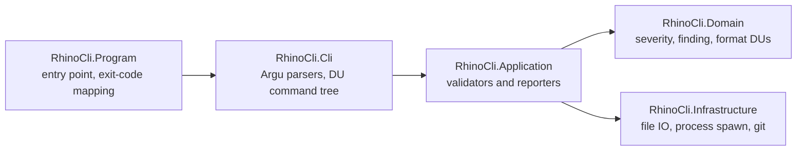
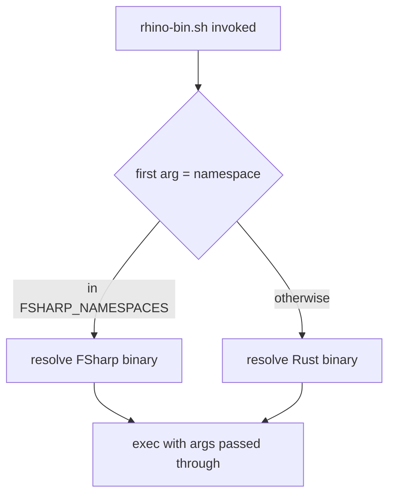
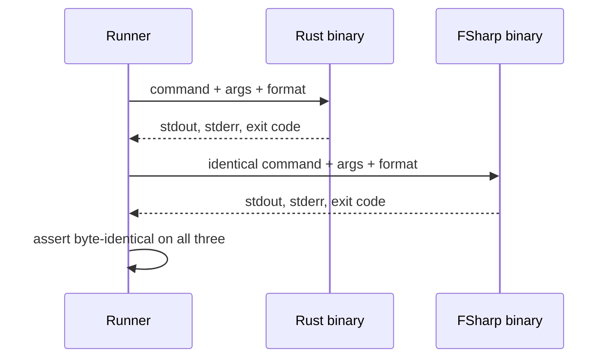

# Technical Documentation — rhino-cli F# port

## Phase 10 — Measured Outcome (2026-08-30)

The table below **supersedes every row in the "Measured Baseline" projection table beneath it**.
That table was built from a `crane-cli` spike (3,770 LOC, a prototype, not the real port) measured
2026-08-25; the real port that actually shipped is 19,710 F# lines across five projects. Full
commands, both repositories' figures, and the per-row verdict rationale live in
[`benchmark.md`](./benchmark.md); this table exists to mark, per row, which spike-era projection
turned out right, wrong, or unmeasurable at spike time. `ose-public` figures shown; the private sibling's
are in `benchmark.md` and track the same directions.

| Original projected axis                  | Projection (spike)                      | Phase 10 actual (real port)                                                      | Verdict                                                                                                                                                                                               |
| ---------------------------------------- | --------------------------------------- | -------------------------------------------------------------------------------- | ----------------------------------------------------------------------------------------------------------------------------------------------------------------------------------------------------- |
| Source size measured                     | 3,770 lines (prototype)                 | 19,710 lines (real port)                                                         | **not comparable to the projection** — the spike was never feature-complete; see B-Size below                                                                                                         |
| Dependency compile cost                  | ~0, F# decisive win                     | Gate build 10.82 s vs. Rust 21.09 s (B2)                                         | **confirmed** — F# still wins decisively once first-party code dominates                                                                                                                              |
| Marginal compile throughput, first-party | Rust ~4x faster per line                | not re-measured in LOC/s form at Phase 10                                        | **not re-validated** — no equivalent figure was captured this phase                                                                                                                                   |
| Startup, per invocation                  | ~9-10x slower (F#)                      | 71.2 ms vs. 7.47 ms, ~9.5x slower (B5)                                           | **confirmed** — ratio landed almost exactly where the spike projected                                                                                                                                 |
| Startup, aggregated per run              | negligible Rust win                     | full hook **faster** for F#: 4.19 s vs. 14.24 s (B6)                             | **wrong** — once the whole Rust toolchain was retired (not just per-invocation startup), the real full-hook cost fell, not rose, because most of the hook's cost was never rhino-cli invocation count |
| Warm no-op build                         | F# wins by 0.9 s                        | 1.15 s vs. 0.18 s, raw Δ +0.97 s (B3)                                            | **wrong** — the real delta sits inside this page's own documented noise floor; recorded as unchanged, not a clear F# win                                                                              |
| CI artifact, moved 9x per run            | Rust wins weakly (4.5 MB vs. 45-128 MB) | 92,996,313 B (~89 MB) full payload vs. 4,489,568 B (B8)                          | **confirmed**, and starker than projected — ~20.7x, at the upper end of the projected range                                                                                                           |
| Cold build, whole project                | n/c (17.5x size gap)                    | 10.38 s vs. 17.59 s (B1) — now comparable, 2.5x size gap                         | **now comparable, and F# wins** — the real port's size gap narrowed enough to score                                                                                                                   |
| Rebuild after one source touch           | n/c (17.5x size gap)                    | 10.37 s vs. 0.37 s, ~28x worse (B4)                                              | **now comparable, and this is the plan's worst regression** — the projection's `n/c` hedge could not have surfaced this; F# has no per-file incremental compilation within one `.fsproj`              |
| Test compile, warm deps                  | not measured                            | not measured at Phase 10 either                                                  | **still not measured** — carried forward as a genuine gap, not silently dropped                                                                                                                       |
| Build directory after a full build       | not scored (shared cache)               | `dist/` payload 92,996,313 B, in the range the CI-artifact row already projected | **roughly confirmed** by the adjacent artifact figure                                                                                                                                                 |

**The single biggest miss**: the two rows marked `n/c` because the spike was too small to compare
hid the plan's most severe real finding — B4's ~28x edit-rebuild regression. A projection that
declines to score a row because the available prototype is too small is not the same as that row
being safe; Phase 0/1's own honesty about `n/c` meaning "no verdict possible yet," not "fine," held
up exactly as documented once the real port existed to measure.

**The two biggest wins**: B1/B2 cold and gate-profile builds beat Rust outright once real first-party
code dominated the build (matching the dependency-compile-cost row's original logic), and B6's full
pre-commit hook came in faster for F# than for Rust — a genuine surprise the aggregated-startup
projection got backwards, because it modeled only per-invocation overhead and could not anticipate
that retiring the Rust toolchain would remove other, larger costs from the hook.

## Measured Baseline

Recorded 2026-08-25 on an Apple-silicon workstation, `rustc 1.95.0` / `cargo 1.95.0` /
`dotnet 10.0.300`. Every figure below is reproducible with the command shown; Phase 0 re-records
them on the executing machine before any porting begins, because the thresholds in
[prd.md](./prd.md) are relative to this baseline.

| Axis                                     | Rust `rhino-cli`                                       | F# `crane-cli`                                               | Comparable?                     | Better               |
| ---------------------------------------- | ------------------------------------------------------ | ------------------------------------------------------------ | ------------------------------- | -------------------- |
| Source size measured                     | 65,858 src lines                                       | 3,770 src lines                                              | — context row                   | —                    |
| **Dependency compile cost**              | **234.8 unit-s** (92.7% of the gate build, 183 crates) | **~0** (prebuilt NuGet DLLs)                                 | **Yes — ecosystem property**    | **F#**, decisively   |
| Marginal compile throughput, first-party | ~5,900 LOC/s                                           | ~1,500 LOC/s                                                 | **Yes — size-normalized**       | **Rust** (~4x)       |
| Startup, per invocation                  | **5.2 ms**                                             | **46.0 ms** Debug JIT / 46.8 fd / 53.0 self-contained        | **Yes — per-invocation**        | **Rust** (~9–10x)    |
| **Startup, aggregated per run**          | baseline                                               | **+0.41 s** pre-commit (10 calls), **+0.82 s** CI (20 calls) | **Yes — what is actually felt** | **Rust**, negligibly |
| Warm no-op build                         | 1.7 s                                                  | 0.77 s                                                       | **Yes — fixed overhead**        | **F#** (0.9 s)       |
| CI artifact, moved 9x per run            | 4.5 MB static binary                                   | 45 MB fd / 128 MB self-contained                             | **Yes — see artifact note**     | **Rust**, weakly     |
| Cold build, whole project                | 78.8 s debug / 44.5 s gate                             | 3.2 s restore + 7.35 s build                                 | No — 17.5x size gap             | n/c                  |
| Rebuild after one source touch           | 11.1 s (whole crate)                                   | 2.13 s                                                       | No — 17.5x size gap             | n/c                  |
| Test compile, warm deps                  | 50.0 s (26 test binaries)                              | not measured                                                 | No — F# side never measured     | n/c                  |
| Build directory after a full build       | 1.6 GB `target/`                                       | 45 MB `bin/Debug/`                                           | No — see build-dir note         | n/c                  |

**Legend for the Better column**: a language name means that side wins on that axis, measured.
**`n/c` means "not comparable — no verdict is possible from these two projects"**, not "to be
determined later". Nothing in this table is deferred to execution; every row is already measured.
The only genuinely deferred question in this plan is the source-size ratio, which has no row here
because it cannot exist until the rewrite does. Phase 0 captures the Rust side, Phase 10 captures
the F# side with the same command shape, and Phase 10 folds the finished comparison back into this
section — marking which of the projections above turned out wrong (see [prd.md](./prd.md) AC-5).

**The two headline rows point in opposite directions.** F# wins dependency compile decisively —
92.7% of a cold Rust gate build is the 183 dependency crates, and NuGet ships prebuilt DLLs so F#
pays essentially nothing there [Repo-grounded — `cargo build --profile gate --timings`, 234.8 of
253.5 unit-seconds outside `rhino-cli` itself]. Rust wins first-party throughput by ~4x. Which
dominates depends entirely on the ratio of dependency code to first-party code, and at 49,460
first-party code lines this project is unusually first-party-heavy — which is why the `Cold build,
whole project` row is marked `n/c` rather than scored for F#.

**On the startup rows, read the aggregated line, not the ratio.** 9–10x is a dramatic multiple of a
small number. In practice the binary is invoked 10 times per pre-commit and 20 times per CI run
[Repo-grounded — `rhino-cli gate list --surface=<s> --format=json`, counting entries whose command
begins with a rhino namespace], so the whole penalty is **0.41 s per commit and 0.82 s per CI run**
against gate jobs that take 22–253 s and a full run of ~380 s. That is under 0.25% of a CI run. The
ratio is real; the felt cost is not large. [DD-1](#dd-1--nativeaot-is-preferred-not-mandatory)
revises the AOT requirement accordingly.

**Tally on the comparable rows: Rust wins all but one.** The F# win is 0.9 s of fixed
MSBuild-versus-cargo overhead on a no-op build, which no contributor will notice. Of the three Rust
wins, two carry real weight — per-line compile cost and per-invocation startup — and the third is
weak, for the reason in the artifact note below. This is the plan's honest starting position: it
proceeds on the source-size hypothesis alone, and that hypothesis has no row in this table because
nothing in this repository can measure it until the rewrite exists. The plan does not gate on it —
it records it, at Phase 10, in whichever direction it falls.

**Note on the CI-artifact row.** The binary is **never shipped, published, or distributed** — no
release, registry, or container step references it anywhere in `.github/workflows/`
[Repo-grounded]. Its only transfer cost is internal to one CI run: `build-rhino` uploads it once and
it is downloaded by the `format` job, the `enumerate` job, and each of the 6 `gate` matrix groups —
9 transfers per run [Repo-grounded — `.github/workflows/pr-quality-gate.yml` lines 183, 228, 250,
298; `rhino-cli gate list --surface=ci --by-group` reports 6 groups]. At 4.5 MB that is ~40 MB per
run; at 45 MB it would be ~405 MB. Inside GitHub's own network those bytes cost seconds, not
minutes, so **size itself is not the real risk**. The real risk is that a 45 MB framework-dependent
build also forces `actions/setup-dotnet` into all 8 consumer jobs, which today install no toolchain
at all and simply `chmod +x` a static binary. Both a NativeAOT single-file publish and a plain
self-contained publish avoid that; a framework-dependent one does not. That is the operational
constraint [DD-1](#dd-1--nativeaot-is-preferred-not-mandatory) turns on — the CI _shape_, never the
byte count.

**Note on the build-directory row.** `rhino-cli doctor` already redirects each crate's `target/` to
a symlink into a shared per-repo cache, so every worktree of a repo shares one physical build
directory [Repo-grounded — `apps/rhino-cli/src/application/doctor/target_share.rs`]. The 1.6 GB is
therefore paid once per repo, not once per worktree, which is why this row is not scored.

**Read the "Comparable?" column before quoting any row.** Only four rows compare like with like:
startup, marginal throughput, CI artifact, and warm no-op. The raw build-time rows put a
65,858-line project beside a 3,770-line one, so "F# cold-builds in 7 s" is a statement about
`crane-cli`'s size, not about F#. The size-normalized rows are the ones that carry the argument, and
they say F# compiles **~4x slower per line** and starts **~9x slower per invocation**.

### Reproduction commands

Rust, from `apps/rhino-cli/`:

```bash
CARGO_TARGET_DIR=<scratch> cargo build --offline          # cold debug
cargo build --profile gate --offline                      # cold gate profile
cargo build --offline                                     # warm no-op
touch src/lib.rs && cargo build --offline                 # whole-crate rebuild
cargo test --offline --no-run                             # test compile
ls -l target/gate/rhino-cli && du -sh target              # artifact + build dir
for i in $(seq 50); do rhino-cli --help >/dev/null; done  # startup
```

F#, from the repo root:

```bash
dotnet restore apps/crane-cli/crane-cli.fsproj
dotnet build apps/crane-cli/crane-cli.fsproj --no-restore                        # cold, 3,770 LOC
dotnet build libs/fsharp-crane-core/fsharp-crane-core.fsproj --no-restore        # cold, 2,048 LOC
dotnet build apps/crane-cli/crane-cli.fsproj --no-restore                        # warm no-op
touch apps/crane-cli/src/Program.fs && dotnet build apps/crane-cli/crane-cli.fsproj --no-restore
dotnet publish apps/crane-cli/crane-cli.fsproj -c Release -o <dir>               # framework-dependent
dotnet publish apps/crane-cli/crane-cli.fsproj -c Release -r osx-arm64 --self-contained true -o <dir>
for i in $(seq 50); do crane --version >/dev/null; done                          # startup
```

Every timing above was taken under `/usr/bin/time -p`, and every startup loop asserts exit code 0
per iteration so a crashing binary cannot report a false-fast figure. The Phase 0 (B1–B8) and Phase
10 (A1–A8) steps carry that same exit-code assertion on every timed step, not only the startup
loops.

**Derived**: F# marginal compile throughput ≈ 1,500 LOC/s — `2048 / (2.13 − 0.77) = 1,506`, where
both inputs come from the table above: **2.13 s** is `crane-cli`'s rebuild after one source touch
and **0.77 s** is its warm no-op build, so their difference is the marginal cost of recompiling its
2,048 source lines. Rust crate rebuild throughput ≈ 5,900 LOC/s (`65858 / 11.1`). [Judgment call] A
66k-LOC F# project therefore rebuilds in roughly 44 s against Rust's 11.1 s — treat as an
order-of-magnitude expectation, not a measurement, since no F# project in this repo exceeds 2,048
lines. Phase 10 re-derives the F# side with the same two measurements (A3 warm no-op, A4
edit-rebuild) over the real line count, which is what makes the figure reproducible rather than
inherited.

**Per-crate build cost** from `cargo build --profile gate --timings`: 253.5 unit-seconds total
across 123 units, of which `rhino-cli` itself is 17.8 s and `tree-sitter` is 13.4 s. `tree-sitter`
is declared in `Cargo.toml` but has zero references in any `.rs` file
[Repo-grounded — `grep -rn 'tree.sitter' --include='*.rs' apps/rhino-cli/` returns nothing]. Phase 1
removes it so the retired-crate comparison is honest.

### Felt cost in perspective

Ratios in the table above are easy to over-read. This section converts every scored axis into the
cost a person or a CI run actually experiences, and says plainly where that cost is too small to
matter — including where that verdict works against the case for Rust.

| Axis                           | Winner | Felt cost of losing it                                               | Significant?                  |
| ------------------------------ | ------ | -------------------------------------------------------------------- | ----------------------------- |
| Startup                        | Rust   | +0.41 s per commit, +0.82 s per CI run (~380 s)                      | **No** — under 0.25% of a run |
| CI artifact size               | Rust   | 9 intra-CI transfers; seconds even at 128 MB                         | **No**                        |
| Warm no-op build               | F#     | 0.9 s, on a target Nx usually serves from cache                      | **No**                        |
| Build directory on disk        | —      | 1.6 GB per repo (shared across worktrees), so ~3.2 GB for both repos | **Modest**                    |
| Dependency compile             | F#     | 234.8 unit-s of the Rust cold build that F# never pays               | **Possibly yes** — see below  |
| First-party compile throughput | Rust   | Full rebuild ~11.1 s today, projected ~20–33 s in F#                 | **Yes** — the one that bites  |

#### The only regression that is genuinely felt: the edit-rebuild loop

Rust rebuilds the whole crate in **11.1 s** after a `lib.rs`-level touch and **3.9 s** after a
`main.rs` touch [Repo-grounded — measured]. [Judgment call] At F#'s measured 1,500 LOC/s marginal
throughput, an F# implementation would take **~33 s if it lands at the same 49,460 code lines,
~20 s if it comes out 40% smaller** — the range depends entirely on the source-size hypothesis this
plan exists to test. Splitting into five projects ([DD-3](#dd-3--project-per-layer-not-one-giant-fsproj))
bounds it, since a touch inside one project rebuilds that project and its dependents rather than
everything.

**Be honest about this one**: a 3.9–11.1 s inner loop becoming a **20–33 s** inner loop is a change
a contributor will notice on every edit, unlike the 0.41 s startup delta they never will. It is the
strongest practical argument against this plan and it is not mitigated anywhere — it is accepted.

The 20–33 s is the **whole-project** figure derived above (`49,460 / 1,500` and `29,676 / 1,500`).
The DD-3 five-project split lowers it, because touching one project rebuilds that project and its
dependents rather than everything — but **by how much is not yet measurable**, since it depends on
the dependency shape of code that does not exist. No smaller number is quoted here on purpose: an
unsourced figure in the plan's most load-bearing paragraph would be worse than an honest upper
bound. Phase 10's A4 measures the real edit-rebuild loop and replaces this range with it.

#### The one where F# may win the number that matters most

`build-rhino` takes **69–74 s** with a warm `Swatinem/rust-cache`, and it gates `enumerate` plus the
entire `gate` matrix [Repo-grounded — 3 sampled runs of `pr-quality-gate.yml`]. Because 92.7% of
that build is dependency crates and F# pays essentially nothing for dependencies, **F# could
plausibly shorten the single job that everything else waits on** — and unlike the inner loop, that
saving is felt on every PR by everyone.

`[Unverified]` — this is not a prediction. The AOT publish step is measured for the first time at
Phase 1, and public reporting suggests ILCompiler can be slow enough to erase the gain entirely.
Phase 1 records the AOT publish duration precisely so this row can be settled with a number rather
than an argument.

#### Net

Two of the three Rust wins (startup, artifact size) are **not worth counting**. The third
(first-party compile) is real and is the plan's genuine cost. On the F# side, the warm-no-op win is
noise, but the dependency-compile win could turn into the plan's only measurable CI-time benefit —
pending Phase 1. Neither side's ratio table should be quoted without this section.

## Architecture

### Target layout

The F# implementation follows the same functional-core / imperative-shell split the repo's other F#
projects use, with one project per architectural layer so no single `.fsproj` carries all 49k lines
— F# compiles file-ordered within a project, so project splitting is also the compile-time
mitigation.



**Source root — `apps/rhino-cli/src/`, resolved at Phase 9c.** The tree started at
`apps/rhino-cli/src-fsharp/` (Phase 2); Phase 9c flattened it to `apps/rhino-cli/src/` once the Rust
tree that previously occupied `apps/rhino-cli/src/` was deleted in the same sub-phase. This is the
durable record of that decision — `learnings.md#fsharp-source-root` also carries it, but
`learnings.md` is a transient running log a future date may delete, per
[the transient-log caveat](../../../repo-governance/development/quality/knowledge-capture/the-transient-log-caveat.md),
so this line, not that one, is what Phase 9d and Phase 10 should be read as depending on.

### Dispatch shim during migration

`apps/rhino-cli/scripts/rhino-bin.sh` gains a namespace routing table. Its three existing
resolution tiers — explicit `RHINO_CLI_BIN`, a fresh prebuilt gate binary, then build-on-demand —
are preserved per implementation [Repo-grounded — `apps/rhino-cli/scripts/rhino-bin.sh` header].



Reverting a wave is a one-line edit removing a namespace from `FSHARP_NAMESPACES`.

The F# side gets its own three tiers mirroring the Rust ones: an explicit `RHINO_CLI_FSHARP_BIN`,
then a prebuilt published binary under `apps/rhino-cli/src-fsharp/dist/`, then `dotnet run` as the
last resort. CI always sets the first, because the third would need an SDK in jobs that install
none — which is why `build-rhino` must publish and upload the F# binary from Phase 2 onward. See
§CI Impact.

### Byte-identity harness

Each wave proves AC-2 with a differential runner that executes both binaries over the same
arguments and compares stdout, stderr, and exit code. This mirrors the shadow-diff approach the
Go→Rust port used [Repo-grounded — `plans/done/2026-05-23__rhino-cli-rust-rewrite/`].



## Design decisions

### DD-1 — NativeAOT is preferred, not mandatory

An earlier draft of this plan called NativeAOT mandatory and made Phase 1 a kill gate on startup.
**Both claims are withdrawn**; the measurements below do not support either. The correction is
recorded rather than quietly edited, because the same overstatement is what the Go→Rust BRD used to
reject F# in the first place — with no measurement at all behind it.

#### What AOT is actually worth

Startup is worth **0.41 s per pre-commit and 0.82 s per CI run** [Repo-grounded — 10 and 20 rhino
invocations respectively per `rhino-cli gate list --surface=<s>`, times a 40.8 ms delta]. Against
gate jobs of 22–253 s and a full CI run of ~380 s, that is under 0.25%. Real, but not a reason to
gate a plan on.

**Which delta those figures use, stated plainly, because it is easy to misread.** The 40.8 ms is
`46.0 ms (F# Debug JIT) − 5.2 ms (Rust)` — the **best** of the four measured F# configurations
against Rust. Debug JIT is not a shipping candidate; it is the floor, and it is quoted here because
it is the most conservative possible statement of the penalty.

If the plan ships the **self-contained non-AOT fallback** — an explicitly allowed Phase 1 outcome —
the delta is `53.0 − 5.2 = 47.8 ms`, giving **0.478 s per commit and 0.956 s per CI run**, about 17%
worse than the headline figures. Still under 0.25% of a CI run, so the conclusion is unchanged, but
the larger pair is the honest one to plan against.

AOT's unique contribution **over** the self-contained fallback cannot be stated yet at all: AOT's
own startup is `TBD` in the ranking table below, so the AOT-versus-self-contained delta is exactly
what Phase 1 measures. Until then, "AOT saves 0.41 s" would be an unmeasured claim — what is
measured is that F# costs at most ~0.48 s per commit in the worst allowed shipping mode.

#### The toolchain-free CI shape does not require AOT

`build-rhino` uploads one binary and 8 downstream jobs download it — `format`, `enumerate`, and each
of the 6 `gate` matrix groups [Repo-grounded — `.github/workflows/pr-quality-gate.yml` lines 183,
228, 250, 298]. Those jobs install no toolchain: they `chmod +x` and run. Preserving that shape
rules out a framework-dependent publish, which would force `actions/setup-dotnet` into all 8 — but a
**self-contained** publish bundles the runtime and is equally toolchain-free at 128 MB. AOT is one
way to keep the shape; it is not the only way.

#### Resulting publish-mode ranking

| Mode                    | Startup | Toolchain needed in the 8 consumer jobs | Verdict                         |
| ----------------------- | ------- | --------------------------------------- | ------------------------------- |
| NativeAOT single file   | TBD     | None                                    | **Preferred** if it works       |
| Self-contained, non-AOT | 53.0 ms | None                                    | **Acceptable fallback**         |
| Framework-dependent     | 46.8 ms | `setup-dotnet` x8                       | **Rejected** — changes CI shape |

Phase 1 therefore **selects a publish mode**; it no longer kills the plan. The plan only fails at
Phase 1 in the implausible case that both AOT and self-contained publishing are unusable, which
would indicate something broken well beyond this plan's scope.

#### What is NOT a reason for AOT: artifact size

The binary is never shipped, published, or distributed — no release, registry, or container step
references it anywhere in `.github/workflows/` [Repo-grounded]. Its only transfer is 9 hops inside a
single CI run, where even a 128 MB payload costs seconds on GitHub's own network. Do not cite size
in support of any publish mode.

#### What Phase 1 still establishes

`[Unverified]` — F# + `FSharp.Core` NativeAOT compatibility, ILCompiler publish duration, and
resulting binary size for this workload are all unverified. Public reporting on a medium ASP.NET
Core app puts NativeAOT publish at minutes rather than seconds, but that is C#, a different app
shape, and a different SDK generation. Phase 1 measures all three in this repo instead of citing
anything, and records a publish-mode decision with its reasoning.

No fixed startup threshold is set in advance. Phase 1 measures AOT startup, self-contained startup,
and the Rust baseline on the same machine in the same session, then takes the first mode in the
order NativeAOT, self-contained, framework-dependent that produces a runnable binary. That choice
binds every later wave gate — a wave that regresses past the accepted figure fails.

Framework-dependent is the guaranteed floor, so Phase 1 cannot fail, only choose worse. Choosing it
carries a stated, costed consequence rather than a silent one: `./.github/actions/setup-dotnet` must
be added to the eight CI jobs that currently install no toolchain, and Phase 1's gate schedules that
work into Phase 2 rather than discovering it later.

**There is no source-size kill gate.** An earlier draft made Phase 2 one — first wave smaller or the
plan is abandoned. The maintainer directed the full rewrite regardless, so source size moves from a
gate to a **record**: Phase 0 counts the Rust side, Phase 10 counts the F# side with the same command
shape, and the ratio is published whatever it turns out to be. See [brd.md](./brd.md) §Measurement
policy.

### DD-2 — Reuse the Gherkin, replace only the harness

The 71 `.feature` files are the behavior contract and are not edited, with the plan's two
sanctioned exceptions: Phase 3 adds the one new `git/` lockfile feature file for a CLI surface that
has no Gherkin today, and Phase 9a retires the scenarios whose subject is the Rust toolchain itself,
bounded by a committed verdict table. No other phase touches `specs/apps/rhino/`. `TickSpec` 2.0.5 is already a
production dependency in this repo [Repo-grounded —
`apps/crane-cli/tests/unit/crane-cli-unit-tests.fsproj`], alongside `xunit.v3` 3.2.2 and `coverlet`
8.0.1. Where TickSpec cannot express a step the Rust `cucumber` harness supported, the fallback is a
plain `xunit.v3` test asserting the same scenario, recorded in `learnings.md` — never a weakened or
deleted scenario.

### DD-3 — Project-per-layer, not one giant fsproj

F# type-checks in file order within a project, so a single 49k-line project would be the worst case
for both compile time and review. Four projects plus an entry point bound the damage and let the
graph-based type checker parallelize across independent projects.

### DD-4 — Namespace waves ordered by risk, `gate` last

`gate` drives every other namespace through the registry and is the largest single area at 6,043
lines under `commands/gate/` [Repo-grounded]. It ports last, when every namespace it dispatches to
is already proven. Wave ordering by measured size:

| Wave | Namespaces                            | Rust command LOC | Scenarios | Rationale                                                     |
| ---- | ------------------------------------- | ---------------- | --------- | ------------------------------------------------------------- |
| A    | `convention`, `parity`                | ~735             | 11        | Smallest; proves the shim, the harness, and the CI wiring     |
| B    | `repo-config`, `env`                  | ~1,598           | 62        | Self-contained, well-specified by feature files               |
| C    | `doctor`, `test-coverage`             | ~650             | 53        | External-process heavy; exercises the shell layer             |
| D    | `md`, `governance`, `git`             | ~3,344           | 130       | Largest parser surface; also absorbs the resequenced `git`    |
| E    | `harness`, `specs`, `repo-governance` | ~5,000           | 179       | Highest coupling to `repo-config.yml`; generates the mirrors  |
| F    | `gate`                                | ~6,043           | 89        | Depends on every namespace above; drives the six-group matrix |

Note the ordering is by **risk and dependency**, not by scenario count — wave C is smaller than
wave B in scenarios but ports the external-process layer that later waves rely on. The scenario
column is the volume of delivery work; the LOC column is the volume of code being replaced. They do
not track each other, and neither is the ordering criterion on its own.

### DD-5 — Both repos in the same delivery units

`apps/rhino-cli/` is byte-identical across `ose-public` and the private sibling: both parity manifests
list the same 603 paths and the file lists diff empty [Repo-grounded — `diff` over both
`parity-manifest.sha256` path columns on 2026-08-25]. Splitting the migration across two plans would
leave the boundary red for the whole migration. Each wave therefore lands in both repos before its
gate passes.

### DD-6 — Accepted regression: no borrow-checked fixture ownership

The Go→Rust BRD named `tempfile::TempDir` RAII ownership as one of five bug classes Rust made
compile-time. F# offers `IDisposable` with `use`, which is a runtime convention, not a compile-time
proof. This is a genuine regression against the previous rewrite's stated goal and is recorded
rather than argued away.

### DD-7 — One plan, six waves, seventy-one PR seams

Two repo rules set the shape of this plan's delivery checklist.

**Rule 1 — one Gherkin scenario per behavior cycle.** Every RED→GREEN→REFACTOR cycle binds exactly
one scenario, with that scenario inlined verbatim
[Repo-grounded — `repo-governance/conventions/structure/plans/execution-grade-clarity.md`
§One scenario per behavior cycle, which states plainly that "long checklists are expected"]. The
rhino spec tree holds **525 scenarios**, so `delivery.md` carries 525 cycles and 1,868 checkboxes
[Repo-grounded — `grep -c '^ *- \[ \]' delivery.md`, which is the only figure of
record; restate it from that command, never from memory].
That is the rule working as designed, not an authoring accident.

**Rule 2 — PR size.** At most 400 handwritten program/script lines per PR, 900 when program and
non-program lines mix, an absolute 1,000-line ceiling, and 20 hand-authored files
[Repo-grounded — `prs-open-at-delivery-boundaries-pr-size.md` rule 4, tightened 2026-08-25].

**Every ceiling counts added lines only; deletions count toward none of them.** The 49,460
first-party Rust lines this plan removes therefore do **not** set the PR floor — what sets it is the
volume of F# **added**, which this plan expects to be materially smaller (see §Why the LOC argument
is the real one). Taking the Rust figure as an upper bound on the F# written, the implementation
floor is **at most** roughly 124 PRs and realistically fewer; the seam below, not this arithmetic,
is what actually decides the count. The corollary matters at the other end of the plan: Phase 9's
crate deletion is nearly pure subtraction and is comfortably inside rule 4, so its five-PR split is
driven by divergent failure modes, not by line count.

**Decision — the seam is the feature file.** One `.feature` file is one PR. This is stated once and
holds for the whole plan, which makes the seam mechanical rather than a judgment call at every step:
70 feature files, 70 implementation PRs, plus one flip PR per wave and the scaffolding, retirement,
benchmark, and propagation PRs. A feature file whose cycles would exceed the line ceiling splits
further at the scenario boundary, and that is the only permitted deviation.

**Decision — six waves in one plan, not six plans.** An earlier draft of this document proposed
delivering only wave A as a pilot and spawning five successor plans on a source-size verdict. That
is superseded: the maintainer directed the full rewrite, so the waves are phases of one plan and
there is no kill gate between them. The wave boundaries survive as pause points and shim-flip
seams, which is what they were actually good for.

Measured scenario inventory, by wave — these are the counts `delivery.md` generates its cycles from,
and the Phase 2 gate re-measures them:

| Wave      | Spec directories                                                           | Feature files | Scenarios |
| --------- | -------------------------------------------------------------------------- | ------------- | --------- |
| A         | `convention`                                                               | 3             | 11        |
| B         | `repo-config`, `repo-config-validate`, `env`, `env-contract`               | 8             | 62        |
| C         | `system`, `test-coverage`                                                  | 6             | 53        |
| D         | `md`, `governance`, `git` (resequenced)                                    | 11            | 130       |
| E         | `harness`, `specs`, `spec-coverage`, `contracts`, `repo-governance`, `ddd` | 35            | 179       |
| F         | `gate`                                                                     | 7             | 89        |
| **Total** |                                                                            | **70**        | **524**   |

> **Waves A and D differ from a naive spec-directory split.** `git/git-pre-commit.feature` sits
> under `git/` but its five scenarios drive `md` commands — its own header records that the
> `git pre-commit` CLI command was removed in 2026-06-26 — so those cycles were resequenced into
> Wave D as integration-tier tests, and `git` flips there rather than in Wave A. The real `git`
> surface (`commands/git/lockfile.rs`) had no Gherkin at all; Phase 3 authored
> `git/git-lockfile.feature` (3 scenarios) and Wave D implements it. The current measured baseline
> is 524 scenarios across 70 feature files after later governance-spec consolidation and the
> split-document traceability regression case.
>
> **Wave B also differs from a naive split, the other direction.** `specs/env-staged-guard.feature`
> sits under `specs/` — a directory otherwise wholly Wave E's — but its three scenarios drive
> `env staged-guard validate`, and `env_staged_guard.rs`'s 210 lines are already summed into this
> row's ~1,598 above. `rhino-bin.sh` routes `FSHARP_NAMESPACES` on argv[0] only, so `env` cannot
> flip at Wave B's integration PR without `staged-guard` ported alongside it — the pre-commit
> hook's real-`.env`-file guard would otherwise silently route to an F# binary that does not
> implement it. An earlier delivery.md draft filed this feature's cycles under Wave E by directory;
> corrected during Wave B's own integration PR once the shadow-diff harness's namespace walk
> surfaced the gap.

[Repo-grounded — counted over `specs/apps/rhino/behavior/rhino-cli/gherkin/`. `doctor` is specified
under `system/` (`doctor.feature`, `cargo-target-share.feature`, `fsharp-tool-invocation.feature`),
and `parity` has no dedicated feature directory — it is exercised through the shadow-diff harness and
the `parity manifest validate` gate entry, which is why wave A flips two namespaces on 11
scenarios.]

The mapping from these 17 spec directories to the 13 CLI namespaces was **`[Unverified]` for six
directories** — `contracts`, `ddd`, `env-contract`, `spec-coverage`, `system`, and
`repo-config-validate` are named after their subject rather than after a namespace. Phase 2 produces
the authoritative 17-row mapping by reading each namespace's `--help`, and corrects the wave map if
it disagrees. The wave assignment above is grouped so that every directory feeding one namespace
lands in the same wave, which is what makes a shim flip possible at each wave boundary.

#### Spec-directory to CLI-namespace mapping (Phase 2, authoritative)

Produced by walking each namespace's subcommand tree (`rhino-bin.sh <namespace> [<subcommand>...]`,
bare invocation, which prints a `Commands:` list when a further subcommand is required) and matching
each leaf's behavior against the corresponding feature file's `When`/`Then` steps. Eleven of the
seventeen directories share their CLI namespace's name outright; the other six — flagged
`[Unverified]` above — resolve as follows, each grounded in the cited source:

| Spec directory         | CLI namespace     | Grounding                                                                                                                                                                                                                                                           |
| ---------------------- | ----------------- | ------------------------------------------------------------------------------------------------------------------------------------------------------------------------------------------------------------------------------------------------------------------- |
| `contracts`            | `specs`           | `contracts/contracts-dart-scaffold.feature`'s "runs contracts dart-scaffold" step is `specs scaffold dart` [Repo-grounded — `cli.rs:548-550`, `SpecsScaffoldCommands::Dart`].                                                                                       |
| `convention`           | `convention`      | Name match.                                                                                                                                                                                                                                                         |
| `ddd`                  | `specs`           | `ddd-bc.feature`/`ddd-ul.feature`'s bounded-context/ubiquitous-language checks are Layers 4-5 of `specs structure validate`, gated on `is_ddd_area` [Repo-grounded — `commands/specs_structure_validate.rs:112-115`].                                               |
| `env`                  | `env`             | Name match.                                                                                                                                                                                                                                                         |
| `env-contract`         | `env`             | `iac-env-validation.feature`'s "When env validate runs" step names the namespace directly.                                                                                                                                                                          |
| `gate`                 | `gate`            | Name match.                                                                                                                                                                                                                                                         |
| `git`                  | `git`             | Name match — but see the Wave A/D note above: this directory's one committed feature file (`git-pre-commit.feature`) is the resequenced `md`-surface one; the real `git lockfile` command's behavior is now covered by `git-lockfile.feature`, authored in Phase 3. |
| `governance`           | `governance`      | Name match.                                                                                                                                                                                                                                                         |
| `harness`              | `harness`         | Name match.                                                                                                                                                                                                                                                         |
| `md`                   | `md`              | Name match.                                                                                                                                                                                                                                                         |
| `repo-config`          | `repo-config`     | Name match.                                                                                                                                                                                                                                                         |
| `repo-config-validate` | `repo-config`     | `repo-config-validate.feature`'s subject is the `repo-config validate` subcommand — same namespace, distinct spec-directory name for legacy reasons.                                                                                                                |
| `repo-governance`      | `repo-governance` | Name match.                                                                                                                                                                                                                                                         |
| `spec-coverage`        | `specs`           | `spec-coverage-validate.feature`'s "runs spec-coverage validate" is `specs behavior-coverage validate`, implemented in `commands/specs_coverage.rs` (module comment: "Port of `cmd/spec_coverage_validate.go`").                                                    |
| `specs`                | `specs`           | Name match.                                                                                                                                                                                                                                                         |
| `system`               | `doctor`          | Already stated above: `system/` holds `doctor.feature`, `cargo-target-share.feature`, `fsharp-tool-invocation.feature` — all `doctor` namespace scenarios.                                                                                                          |
| `test-coverage`        | `test-coverage`   | Name match.                                                                                                                                                                                                                                                         |

`parity` (Wave A's second namespace) has no dedicated spec directory, as already noted — it is
exercised through the shadow-diff harness and the `parity manifest validate` gate entry, not through
`.feature` files.

**No row above contradicts the wave map.** Every directory's resolved namespace already sits in the
same wave the directory itself was assigned to (e.g. `system` → `doctor` is Wave C, matching
`doctor, test-coverage`; `spec-coverage`/`contracts`/`ddd` → `specs` are all Wave E, matching
`harness, specs, ...`; `repo-config-validate` → `repo-config` is Wave B, matching `repo-config, env`),
so no correction to the wave map is triggered by this mapping.

### DD-8 — The `deps:audit` narrowing and the SDK floor

Two Phase 9c consequences that earlier drafts recorded as no-ops. Both are real changes in what the
repository enforces, so both are decided here rather than discovered during execution.

**The `deps:audit` narrowing.** `apps/rhino-cli/deny.toml` declares three independent controls:
`[advisories]` (known vulnerabilities), `[licenses]` (an allowlist of MIT, Apache-2.0, ISC,
BSD-2-Clause, BSD-3-Clause, Unicode-3.0), and `[sources]`/`[bans]` (deny unknown registries, deny
unknown git sources, warn on duplicate versions). **What it declares and what it enforces are not
the same set, and the difference inverts the conclusion.** The target does not call `cargo deny`
directly — it runs `apps/rhino-cli/scripts/deny-check.sh`, which executes
`cargo deny check bans licenses sources` and deliberately **skips `[advisories]`**, because upstream
RUSTSEC-2026-0124 ships a malformed advisory that breaks database load
[Repo-grounded — `apps/rhino-cli/project.json` `deps:audit.options.command`, and the
`deny-check.sh` header dated 2026-06-14]. So the enforced set today is bans + licenses + sources.
The replacement command, `dotnet list package --vulnerable --include-transitive`, covers only
advisories — the one control that is currently **off** — and drops all three that are **on**. The
regression is therefore larger than a reading of `deny.toml` alone suggests, not smaller. Keeping
the target's name while it checks none of what it used to is worse than renaming it, because every
caller and every reader takes "audit" at face value. A second hazard compounds it:
`dotnet list package --vulnerable` **reports** rather than gates, so an unwrapped replacement may
exit 0 on a finding; Phase 9c proves the exit code against a known-vulnerable scratch project before
treating it as a gate.

**Decision (resolved at Phase 9c execution)**: deferred, not closed — recorded as an accepted
regression in `learnings.md`, dated and attributed. `dotnet list package --include-transitive
--format json` carries no license field at all, so a `[licenses]` equivalent would require a bespoke
`.nuspec`-parsing scanner with no precedent anywhere in this repo; building and proving one to this
plan's own break-restore standard is disproportionate net-new scope for a crate-retirement
sub-phase. A `nuget.config` for `[sources]`/`[bans]` alone was considered and also rejected: no
other F# project in this repo (`ose-be`, `organiclever-be`) carries one, and it does not satisfy this
decision's "restore" branch without the license check beside it. **The target keeps the name
`deps:audit`**, reversing this DD's original "rename it" recommendation — discovered at execution
time: `.github/workflows/dependency-vulnerability-audit.yml` runs
`npx nx run-many --all -t deps:audit` across every project that defines the target, including the
five other F# apps that ship the exact same bare-vulnerability-only command
(`apps/crane-cli`, `apps/ose-be`, `apps/organiclever-be`, `libs/fsharp-crane-core`,
`libs/fsharp-env-loader`) — a repository-wide weakness this plan inherits, not a precedent that
makes it correct, but real enough that renaming only `rhino-cli`'s target would
silently drop it from that sweep entirely — a strictly worse outcome than a truthfully-narrower
`deps:audit` — rather than just narrowing what it checks, so the name stays and the narrowing is
documented instead.

**The SDK floor.** Removing `compat:min-version` is correct — it asserts a Rust MSRV and cannot
outlive the crate. The justification that a .NET floor already exists is not. `repo-config.yml`
pins `dotnet-global-json: apps/ose-be/global.json`; `apps/ose-be/` is a sibling of
`apps/rhino-cli/`, and .NET resolves `global.json` by walking upward from the working directory,
never sideways. No repo-root `global.json` exists in `ose-public`, and the private sibling has none at
all — as this plan's own the private sibling delta table already states.

**Decision (resolved)**: `apps/rhino-cli/global.json` (SDK `10.0.204`, `rollForward: latestMinor`,
matching `apps/ose-be/global.json` and `apps/organiclever-be/global.json` verbatim), placed at
`apps/rhino-cli/` — the narrowest ancestor that covers `apps/rhino-cli/src/` under .NET's
upward-only walk. The acceptance is behavioural, not existential, but not literally "reports the
pinned version" either: on the machine this was proved on, `dotnet --version` from
`apps/rhino-cli/src/` prints `10.0.300` both with and without the file present, because
`rollForward: latestMinor` accepts any installed SDK `>= 10.0.204` in the same major — the identical
behavior `apps/ose-be` already has today. Proved the file is actually read from that directory
instead: temporarily pinned an unsatisfiable `99.0.0`/`rollForward: disable`, and the resulting
SDK-not-found error named this exact `global.json` path, confirming the ancestor-walk reaches it
from `apps/rhino-cli/src/`. `test -f` alone would not have caught a file that exists but does not
scope, which is why this proof exists.

### DD-9 — the private sibling's cross-phase gate baseline lives in the app tree, transiently

Phase 2's before/after gate-list comparison (`delivery.md:645-668`) must survive from Phase 2
through Phase 8's Wave F check (`delivery.md:14466-14470`) — six phases, six separate PRs — so it
cannot live in `local-tmp/` (`AGENTS.md`'s Plans & Temporary Files rule permits sweeping that at
any time) and must be a **committed, tracked** artifact in each repo's own tree.

`ose-public`'s copy follows the ordinary
[evidence-capture convention](../../../repo-governance/development/quality/evidence-capture/the-rule.md#where-the-folder-lives):
`plans/in-progress/rewrite-rhino-cli-to-fsharp/evidence/gate-before-ose-public.json`, inside the
plan's own folder, travelling to `plans/done/` on archival like any other plan evidence.
The private sibling cannot receive the same treatment — this plan's own Plan Archival section
deliberately keeps the private sibling carrying **no** copy of this plan's folder, so the plan-folder
`evidence/` location the convention names does not exist there to receive anything.

**Decision**: the private sibling's baseline is committed instead at
`apps/rhino-cli/evidence/gate-before-private-sibling.json` — the app tree is the only location
committable from that repo's own worktree without a cross-repo read of `ose-public`'s plan folder.
This is a deliberate, scoped exception to the convention's plan-folder rule, for this one artifact,
and it is **temporary, not permanent**: Phase 8's Gate removes `apps/rhino-cli/evidence/` from
the private sibling immediately once the Wave F check — its last consumer — has run, so nothing survives
into the private sibling's tree past that phase and nothing is left for a future reader to mistake for a
stray misplacement.

## File-Impact Analysis

Legend: `[E]` edited, `[N]` new, `[D]` deleted, `[G]` generated. Every phase number below is a phase
of **this** plan; nothing here is deferred to another plan.

```text
apps/rhino-cli/
├── Cargo.toml                                                [E] Phase 1: drop unused tree-sitter dep; [D] Phase 9c
├── Cargo.lock                                                [E] Phase 1 regen; [D] Phase 9c
├── src/                                                      [D] Phase 9c, after all 13 namespaces flip
├── tests/                                                    [D] Phase 9c, 25 cucumber suites retired
├── deny.toml                                                 [D] Phase 9c, cargo-deny no longer applicable
├── rust-toolchain.toml                                       [D] Phase 9c
├── project.json                                              [E] Phase 9c: tags lang:rust -> lang:fsharp, 20 targets -> 19, only compat:min-version removed
├── parity-manifest.sha256                                    [G] Phase 1 (tree-sitter drop regen), Phase 2 (src-fsharp/ enters the boundary) and Phase 9c (Rust leaves it)
├── scripts/
│   ├── rhino-bin.sh                                          [E] Phase 2: FSHARP_NAMESPACES table, shipped empty; [E] once per wave; [E] Phase 9c: collapsed to one resolution path
│   ├── shadow-diff.sh                                        [N] Phase 2: differential runner comparing both binaries
│   └── deny-check.sh                                         [D] Phase 9c: the cargo-deny wrapper deps:audit actually runs; all four of its inputs are deleted
├── evidence/                                                 [N] Phase 2, `<private-sibling>` only — see DD-9; [D] Phase 8 Gate, torn down once Wave F's check consumes it; never present in `ose-public`, where the equivalent capture lives in the plan's own `evidence/` folder instead
└── src-fsharp/                                               [N] Phase 2, see below

apps/rhino-cli/src-fsharp/
├── project.json                                              [N] Phase 2: Nx project rhino-cli-fsharp, tags type:app platform:cli lang:fsharp domain:tooling
├── RhinoCli.Domain/RhinoCli.Domain.fsproj                    [N] severity, finding, output-format DUs
├── RhinoCli.Infrastructure/RhinoCli.Infrastructure.fsproj    [N] file IO, process spawn, git helpers
├── RhinoCli.Application/RhinoCli.Application.fsproj          [N] one module per spec directory family, filled wave by wave
├── RhinoCli.Cli/RhinoCli.Cli.fsproj                          [N] Argu parsers mirroring the clap command tree
├── RhinoCli.Program/RhinoCli.Program.fsproj                  [N] entry point, publish mode chosen at Phase 1, exit-code mapping
└── tests/
    ├── unit/RhinoCli.UnitTests.fsproj                        [N] TickSpec + xunit.v3, consumes specs/apps/rhino feature files
    └── integration/RhinoCli.IntegrationTests.fsproj          [N] real-filesystem fixtures replacing the Rust tests/ tree

.github/
├── workflows/pr-quality-gate.yml                             [E] Phase 2: build-rhino publishes F# alongside Rust; [E] Phase 9d: rust job, has-rust, and the Rust build all removed
├── workflows/rhino-cli-parity-audit.yml                      [ ] UNCHANGED — it diffs the manifest file, not the source tree
├── workflows/validate-env.yml                                [E?] Phase 9d: per-file remove-or-retain verdict, not a pre-decided removal
├── workflows/dependency-vulnerability-audit.yml              [E?] Phase 9d: per-file remove-or-retain verdict, not a pre-decided removal
├── workflows/_reusable-www-test-local-deploy.yml             [E?] Phase 9d: per-file remove-or-retain verdict, not a pre-decided removal
├── workflows/_reusable-app-test-local-deploy-stag.yml        [E?] Phase 9d: per-file remove-or-retain verdict, not a pre-decided removal
├── actions/setup-dotnet/action.yml                           [ ] UNCHANGED — reused as-is by build-rhino
├── actions/setup-rust/action.yml                             [ ] UNCHANGED in ose-public — the format job still needs it for the 198 course examples; [D] in <private-sibling> only
└── actions/README.md                                         [ ] UNCHANGED in ose-public — the setup-rust row stays; [E] in <private-sibling>, where the action is deleted

repo-config.yml                                               [E] Phase 9d: rhino-cli gate entries rustfmt/clippy -> fantomas/F# analyzers
docs/reference/system-architecture/{technology-stack,applications,components}.md  [E] Phase 9e: the three files under this directory matching the enumerating grep
docs/reference/system-architecture/ci-cd.md                   [E] Phase 9e: mentions rhino-cli but does NOT match the Rust-coupling grep; edited for the rust-job teardown, found by hand
docs/reference/{monorepo-structure,project-dependency-graph}.md  [E] Phase 9e: two more matching the grep, outside system-architecture/
docs/explanation/software-engineering/programming-languages/rust/  [E] Phase 9e: fourteen files whose worked example is rhino-cli; disposition recorded, not assumed
repo-governance/development/quality/code/rust-cli-linting.md  [E] Phase 9e: describes a toolchain the repo no longer provisions
repo-governance/workflows/infra/development-environment-setup/phase-7-rust-ecosystem.md  [E] Phase 9e: same
specs/apps/rhino/behavior/rhino-cli/gherkin/git/<lockfile>.feature  [N] Phase 3 — the `git lockfile` surface has no Gherkin today; authored before Wave D implements it
specs/apps/rhino/                                             [E] Phase 9a — Rust-toolchain scenarios retired against a committed verdict table; untouched by every phase except that retirement and the Phase 3 addition above
.claude/skills/ci-standards/SKILL.md                          [E] Phase 9e: calls rhino-cli "the only Rust CLI app today"
.agents/skills/ci-standards/SKILL.md                          [G] Phase 9e: generated mirror of the line above; regenerated by `npm run generate:bindings`, never hand-edited
.husky/{pre-commit,pre-push,commit-msg}                       [ ] UNCHANGED — they call rhino-bin.sh, which absorbs the routing
```

## CI Impact

`rhino-cli` is the **only** project in either repo carrying `tag:lang:rust`
[Repo-grounded — `grep -rl '"lang:rust"' --include=project.json` returns exactly
`apps/rhino-cli/project.json` in `ose-public` and in the private sibling]. Three consequences follow, and
this plan owns all three.

**Phases 2-8 — CI carries both binaries.** From the first shim flip, every job that runs
`rhino-bin.sh` needs the F# binary too, or it falls back to compiling on demand inside a job that
installs no SDK. The change is confined to `pr-quality-gate.yml`:

| Job           | Line (today)                                | Phase 2 change                                                                                                                                                                                                                                                                                                                    |
| ------------- | ------------------------------------------- | --------------------------------------------------------------------------------------------------------------------------------------------------------------------------------------------------------------------------------------------------------------------------------------------------------------------------------- |
| `build-rhino` | `cargo build --profile gate`                | Keep it, add `./.github/actions/setup-dotnet`, a `dotnet publish` step, and a second `upload-artifact` named `rhino-cli-fsharp-binary`.                                                                                                                                                                                           |
| `format`      | downloads `rhino-cli-gate-binary`           | Add a second `download-artifact`; export `RHINO_CLI_FSHARP_BIN` alongside `RHINO_CLI_BIN`.                                                                                                                                                                                                                                        |
| `enumerate`   | downloads `rhino-cli-gate-binary`           | Same. `gate list` stays Rust until wave F, but the shim must be able to resolve both.                                                                                                                                                                                                                                             |
| `gate`        | downloads `rhino-cli-gate-binary`           | Same, across all six matrix groups.                                                                                                                                                                                                                                                                                               |
| `detect`      | maps `lang:fsharp` to `has-dotnet-projects` | `ose-public`: no edit — the mapping already exists, so the existing `dotnet` job picks up the new project's tests. The private sibling: not true there — that repo's `detect` job had no `has-dotnet-projects` output or `lang:fsharp`/`lang:csharp` case at all, so both were added new (see `delivery.md`'s Phase 2 checklist). |

`build-rhino` measured 69-74 s and gates every other job, so the added publish step lands directly
on the critical path. Every wave gate re-measures it into `benchmark.md`. This is the cost of a
dual-implementation window, it is visible at every wave, and it ends at Phase 9d.

**Phase 9d — the teardown.** Once the crate is deleted, `has-rust` goes permanently false, the
`rust` quality-gate job never runs again, and `.github/actions/setup-rust` loses its rhino-cli
consumers. It does **not** become dead in `ose-public`: the `format` job still invokes
`format-rustfmt` over the 198 Rust course examples under `apps/ayokoding-www/content/`, so both the
action directory and that one in-file use survive. Phase 9d gives each of the five referencing
workflows (`pr-quality-gate.yml`, `validate-env.yml`, `dependency-vulnerability-audit.yml`,
`_reusable-www-test-local-deploy.yml`, `_reusable-app-test-local-deploy-stag.yml`) an explicit
remove-or-retain verdict rather than deleting them as a set. In the private sibling, which has zero Rust
course examples, all six in-file uses go to zero and the action directory is deleted. `build-rhino` drops the `cargo build` step and renames
its single remaining artifact back to `rhino-cli-gate-binary`, so consumer jobs need no further
edit.

**Phase 9d — the coverage that teardown would otherwise silently drop.** The `rust` job is the only
place that sets `RHINO_REQUIRE_ELIXIR: "1"` and provisions Erlang/Elixir via `erlef/setup-beam`,
which is what turns `apps/rhino-cli/tests/gate_format_verify_wrappers.rs` from a quietly-skipping
opt-in into real coverage [Repo-grounded — `.github/workflows/pr-quality-gate.yml` `rust` job]. It
is also the only job running `nx affected -t test:coverage` for this project. Deleting the job
without re-homing both is a coverage regression disguised as cleanup, so Phase 9d re-homes each into
the `dotnet` job **and proves it with a deliberate temporary break that must turn CI red**. A green
CI after re-homing proves nothing on its own — the assertion may simply have stopped running.

### More Detail

- **`project.json` target rewiring happens at Phase 9c**, once no namespace still routes to Rust.
  Its shape is already known [Repo-grounded — the existing file names all 20 targets]: `deps:audit`
  is **retained** with its name unchanged, its command swapped from `cargo-deny` to
  `dotnet list package --vulnerable --include-transitive` — a **narrowing**, not a like-for-like
  swap. `deny.toml` declares three controls (`[advisories]`, `[licenses]`, `[sources]`/`[bans]`) but
  `deny-check.sh` enforces only the last two families — advisories is deliberately skipped — so the
  replacement covers the one control already off and drops the three in force. Phase 9c must either
  restore license and source-provenance checking on the NuGet side or record the drop as an accepted
  regression, and must prove the replacement can fail at all. See
  [DD-8](#dd-8--the-depsaudit-narrowing-and-the-sdk-floor). `compat:min-version` is **removed**,
  but not because a .NET floor already exists — `repo-config.yml` pins
  `dotnet-global-json: apps/ose-be/global.json`, which is a **sibling** of `apps/rhino-cli/` and so
  cannot scope to it (.NET resolves `global.json` upward only), and the private sibling has no
  `global.json` at all. Phase 9c therefore establishes a `global.json` that actually covers
  `apps/rhino-cli/src-fsharp/` in both repos. `compat:min-version` is the **only** target removed,
  so of the 20 the other **19** keep their names and no downstream caller changes — `deps:audit`
  among them, since it is retained under its own name with a swapped command.
- **The new F# tree gets its own Nx project during the migration, merged back at retirement.**
  Without one, `nx affected` never sees it and the `dotnet` CI job never runs its tests — the suite
  would be green because it never ran. Phase 2 creates `apps/rhino-cli/src-fsharp/project.json` as
  `rhino-cli-fsharp` with `tag:lang:fsharp`. **Decided at Phase 9c: merged.**
  `apps/rhino-cli/src-fsharp/project.json` (by then `apps/rhino-cli/src/project.json`, after the
  same sub-phase's flatten) is deleted; its targets fold into `apps/rhino-cli/project.json`, which
  becomes the sole Nx project for this app. `repo-config.yml`'s `coverage.projects` collapses from
  two entries to one for the same reason. `nx show project rhino-cli --json` is the one name every
  caller uses from Phase 9c onward.
- **Parity manifest regeneration order** — regenerate in `ose-public` first, then reproduce the
  _semantic_ change in the private sibling by re-running the generator there. Never copy the manifest
  file between repos; each repo's generator must produce it from its own tree.
- **`setup-rust` removal is still conditional** — Phase 9a re-runs
  `grep -rl '"lang:rust"' --include=project.json` rather than trusting this document's measurement,
  because a Rust project added between authoring and execution would make the deletion wrong.

## Dependencies

- .NET SDK `net10.0`, already required by `apps/ose-be`, `apps/organiclever-be`, `apps/crane-cli`
  [Repo-grounded — `repo-config.yml` `dotnet-global-json: apps/ose-be/global.json`].
- `TickSpec` 2.0.5, `xunit.v3` 3.2.2, `Microsoft.NET.Test.Sdk` 18.3.0, `coverlet` 8.0.1 — all
  already in use [Repo-grounded — `apps/crane-cli/tests/unit/crane-cli-unit-tests.fsproj`].
- `Argu` 6.2.5 for argument parsing [Repo-grounded — `apps/crane-cli/crane-cli.fsproj`].
  `[Unverified]` — whether `Argu` is NativeAOT-safe. Phase 1 tests it; the fallback is
  `System.CommandLine`, tested in the same spike.
- G-Research F# analyzers 0.22.0, already wired in `crane-cli` [Repo-grounded].

## Rollback

| Stage                                       | Rollback                                                                                                                                                                                                                                 |
| ------------------------------------------- | ---------------------------------------------------------------------------------------------------------------------------------------------------------------------------------------------------------------------------------------- |
| Phase 1 finds no AOT or self-contained mode | Not a rollback. Framework-dependent publish is the guaranteed floor; the cost is `setup-dotnet` in eight CI jobs, scheduled into Phase 2 as explicit work.                                                                               |
| Phase 2 CI wiring breaks a gate             | Revert the Phase 2 PR. `FSHARP_NAMESPACES` shipped empty and no namespace routed to F#, so `main` is functionally identical before and after.                                                                                            |
| A namespace fails its wave gate             | Remove that namespace from `FSHARP_NAMESPACES` in `rhino-bin.sh` — one line. The Rust crate is still present and still built, so routing reverts instantly. This holds for every wave from A through F.                                  |
| A whole wave has to be withdrawn            | Revert that wave's flip PR and leave the implementation PRs in place. The F# code is inert while its namespaces are unflipped, so nothing needs deleting to make `main` correct again.                                                   |
| Phase 9a retires the wrong scenario         | Revert 9a alone. It is deliberately a separate PR from the crate deletion precisely so a spec mistake is not entangled with a 65,858-line removal.                                                                                       |
| Phase 9b (CI decouple) goes wrong           | Cheapest rollback in Phase 9: revert one workflow-only PR. The Rust crate is untouched and still builds, so `main` returns to the dual-binary steady state with nothing else to unwind. This is precisely why 9b exists as its own seam. |
| Phase 9c or 9d goes wrong                   | The first genuinely expensive rollback: reverting restores the whole Rust crate. This is why Phase 9 is last, why it is five separate PRs, and why every namespace must already be flipped and green before it starts.                   |
| 9e goes wrong                               | Cheapest rollback in Phase 9, cheaper even than 9b: 9e touches documentation and `.claude/skills` only — no source, no workflow — so reverting it is an ordinary doc-PR revert with no build, gate, or crate-state implications at all.  |
| Phase 9d re-homing turns out to be a no-op  | Caught before the `rust` job is deleted, because the gate requires a deliberate temporary break to turn CI red. If it stays green, the re-homed assertion is not running and the deletion does not proceed.                              |
| Parity divergence between repos             | `rhino-cli parity` validation fails loudly on both `main` branches; fix forward by re-running the generator in the lagging repo.                                                                                                         |
