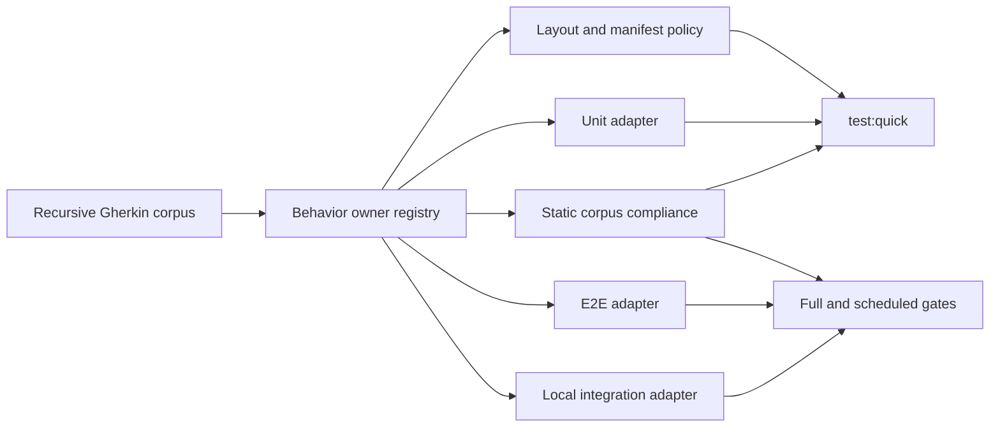

# Technical Documentation

[Judgment call] A directory is used because the plan has six distinct reader jobs. This README is
the only technical-form entry point and maps every companion; no parallel `tech-docs.md` exists.

## Reader Contract

This selected technical form is a primary execution surface for a junior engineer fresh from a
bootcamp, with no professional work experience and no repository or stack context. Read the files
in index order: they teach the current state and vocabulary, compare alternatives, define the target
contracts and design, explain the DDD/specs/C4 migration, bound every affected file family, and
connect each decision to verification and recovery. When an exact implementation path or symbol can
only be known from the execution base, Phase 0 performs bounded discovery and records it under a
stable ledger ID; the executor must not infer or invent it.

## Document Map

- [Current State and Decisions](./current-state-and-decisions.md) — OSE evidence, BeaverNest prior
  art, substantive alternatives, and selected architecture.
- [Target Contract and Project Matrix](./target-contract-and-project-matrix.md) — target semantics,
  physical test roots, `project.json` attachment, package-manifest policy, and all-project migration
  classification.
- [Gherkin Coverage and Adapter Design](./gherkin-coverage-and-adapter-design.md) — ownership,
  recursive discovery, exact 100% binding, applicability, and runtime/static separation.
- [Specs Structure and C4 Contract](./specs-structure-and-c4.md) — logical corpus layout,
  migration map, canonical as-built models, and architecture synchronization.
- [DDD Engineering-Surface Retirement](./ddd-retirement.md) — deletion boundary, preserved content,
  recovery, and revisit trigger.
- [File-Impact Analysis](./file-impact-analysis.md) — annotated root-relative scope tree and
  reconciliation obligations.

## Architecture Summary

The diagram applies independently in `ose-public` and the private sibling: one repository-local
specification corpus feeds static compliance and applicable runtime adapters. Quick receives unit
runtime plus static proof; full/scheduled gates add integration and E2E runtime. Shared Rhino
sources and enforcement remain byte-identical where the parity contract applies.

## Cross-Cutting Declarations

- **Schema/migration:** [Judgment call] Applicable to the repository-owned registry/config schema,
  not persisted product data. Phase 4 introduces explicit per-project migration state; Phase 20
  removes compatibility only after every owner is terminal.
- **UI design funnel:** [Judgment call] Not applicable because the approved scope changes test and
  governance contracts, not a user-facing screen or component.
- **Vercel MCP:** [Judgment call] Provisionally not applicable because no deployment-observation
  criterion is planned. Phase 0 probes actual capability and records the declaration; later diff
  evidence can make the surface gate applicable.
- **Learning-bearing syllabus:** [Judgment call] Not applicable because AyoKoding content is
  preserved rather than authored as a learning corpus.
- **Manual UI/API verification:** [Judgment call] No product UI/API behavior changes. Instead,
  controlled negative fixtures and representative CLI/Nx invocations manually confirm failure
  diagnostics; existing product manual gates remain unchanged.
- **C4:** [Judgment call] Applicable to specs organization and as-built documentation, while deployed
  topology remains unchanged. Move and reconcile existing C4 content with each logical corpus,
  repair links, and prove diagrams remain accurate; never invent a topology change.
