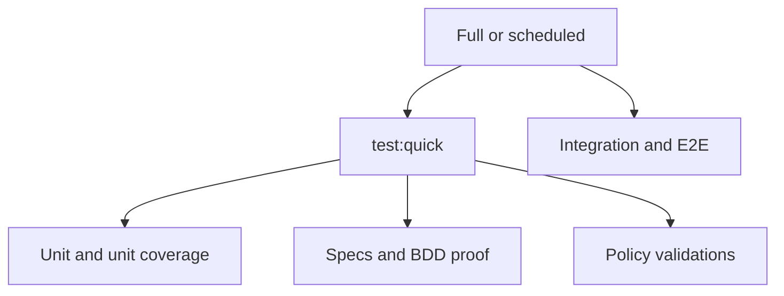

# Target Contract and Project Matrix

## Test-Layer Vocabulary

| Layer       | Runtime boundary                                                           | Allowed dependencies                                                              | Prohibited shortcut                                                  |
| ----------- | -------------------------------------------------------------------------- | --------------------------------------------------------------------------------- | -------------------------------------------------------------------- |
| Unit        | One pure module/component/handler through in-memory doubles                | Deterministic memory and framework test utilities                                 | Filesystem, database, network, server, or spawned production process |
| Integration | Multiple real modules plus an isolated local resource owned by the project | Temp filesystem, local process, local database/container when explicitly governed | Public network or production-like browser/API journey                |
| E2E         | Public production-like boundary                                            | Browser, HTTP API, or executable process through the shipped interface            | Calling internal implementation as the assertion path                |

[Repo-grounded] These boundaries preserve OSE's existing three-level standard. The migration adds
explicit applicability and behavior coverage; it does not redefine integration as network testing.

## Required Physical Layout

Every project that owns executable tests uses this layout:

```text
<project-root>/
├── project.json
└── tests/
    ├── unit/          # executable unit tests and unit-only bindings
    ├── integration/   # executable local-boundary tests and bindings
    ├── e2e/           # executable public-boundary tests; usually in a dedicated E2E project
    ├── fixtures/      # optional non-executable data
    └── support/       # optional non-executable shared helpers
```

[Judgment call] A layer directory is created only when that project owns the layer. A dedicated E2E
project therefore normally has `tests/e2e/` without empty unit/integration placeholders. No
executable test may remain in `src/**`, a generic `test/`, `__tests__/`, `tests/support/`, or
`tests/fixtures/`. Native runner include/exclude rules and Nx inputs must select exactly one layer;
the same test file cannot satisfy two runtime targets.

## Required Target Semantics

| Target                               | Meaning                                                                                                  | Quick? | Runtime? |
| ------------------------------------ | -------------------------------------------------------------------------------------------------------- | -----: | -------: |
| `test:unit`                          | Execute unit tests, including unit Gherkin adapter                                                       |    Yes |      Yes |
| `test:integration`                   | Execute isolated local integration adapter when applicable                                               |     No |      Yes |
| `test:e2e`                           | Execute public-boundary adapter or delegated E2E harness when applicable                                 |     No |      Yes |
| `test:coverage:unit`                 | Native unit-slice code coverage, minimum 99% lines                                                       |    Yes |      Yes |
| `test:coverage:integration`          | Native integration-slice code coverage when applicable, minimum 99% lines                                |     No |      Yes |
| `test:coverage`                      | Aggregate every applicable numeric slice; never an echo                                                  |    Yes |      Yes |
| `specs:behavior:coverage`            | Recursive corpus integrity and global shared-step validity                                               |    Yes |       No |
| `test:behavior:coverage:unit`        | Prove complete unit-adapter corpus/driver/binding contract                                               |    Yes |       No |
| `test:behavior:coverage:integration` | Prove complete integration-adapter contract or governed inapplicability                                  |    Yes |       No |
| `test:behavior:coverage:e2e`         | Prove complete public-boundary contract or delegated harness                                             |    Yes |       No |
| `test:behavior:coverage`             | Aggregate all applicable static adapter checks                                                           |    Yes |       No |
| `test:specs`                         | Aggregate specification integrity checks; DDD domain coverage removed                                    |    Yes |       No |
| `coverage:policy:validation`         | Reject lower/missing/conflicting thresholds, placeholders, invalid exclusions, and incomplete aggregates |    Yes |       No |
| `test:layout:validation`             | Reject executable tests outside or across their declared physical layer roots                            |    Yes |       No |
| `package-manifest:policy:validation` | Require a direct consumer for each project-local manifest and reject proxy manifests/scripts             |    Yes |       No |
| `test:quick`                         | typecheck → lint → unit → unit coverage → coverage policy → specs → behavior aggregate                   |    Yes |    Mixed |
| `test`                               | Quick plus applicable integration/E2E runtime and artifact checks                                        |     No |    Mixed |

## `project.json` Attachment

[Judgment call] Project files attach standard commands to the central manifest rather than copying
corpus roots. Representative application wiring:

```json
{
  "targets": {
    "test:unit": {
      "executor": "nx:run-commands",
      "inputs": ["default", "{projectRoot}/tests/unit/**/*"],
      "options": {
        "command": "<native runner constrained to tests/unit>"
      }
    },
    "test:integration": {
      "executor": "nx:run-commands",
      "inputs": ["default", "{projectRoot}/tests/integration/**/*"],
      "options": {
        "command": "<native runner constrained to tests/integration>"
      }
    },
    "test:behavior:coverage:unit": {
      "executor": "nx:run-commands",
      "inputs": ["default", "{workspaceRoot}/specs/apps/<family>/**/*.feature"],
      "options": {
        "command": "apps/rhino-cli/scripts/rhino-bin.sh test behavior-coverage validate --project=<project> --adapter=unit"
      }
    },
    "test:coverage:unit": {
      "executor": "nx:run-commands",
      "outputs": ["{projectRoot}/coverage/unit"],
      "options": {
        "command": "<native unit coverage command with a 99% line threshold>"
      }
    },
    "test:coverage:integration": {
      "executor": "nx:run-commands",
      "outputs": ["{projectRoot}/coverage/integration"],
      "options": {
        "command": "<native integration coverage command with a 99% line threshold>"
      }
    },
    "test:behavior:coverage:integration": {
      "executor": "nx:run-commands",
      "inputs": ["default", "{workspaceRoot}/specs/apps/<family>/**/*.feature"],
      "options": {
        "command": "apps/rhino-cli/scripts/rhino-bin.sh test behavior-coverage validate --project=<project> --adapter=integration"
      }
    },
    "test:behavior:coverage:e2e": {
      "executor": "nx:run-commands",
      "inputs": ["default", "{workspaceRoot}/specs/apps/<family>/**/*.feature"],
      "options": {
        "command": "apps/rhino-cli/scripts/rhino-bin.sh test behavior-coverage validate --project=<project> --adapter=e2e"
      }
    },
    "test:behavior:coverage": {
      "executor": "nx:run-commands",
      "dependsOn": ["test:behavior:coverage:unit", "test:behavior:coverage:integration", "test:behavior:coverage:e2e"]
    },
    "coverage:policy:validation": {
      "executor": "nx:run-commands",
      "options": {
        "command": "apps/rhino-cli/scripts/rhino-bin.sh test coverage-policy validate --project=<project>"
      }
    },
    "test:layout:validation": {
      "executor": "nx:run-commands",
      "options": {
        "command": "apps/rhino-cli/scripts/rhino-bin.sh test layout validate --project=<project>"
      }
    },
    "package-manifest:policy:validation": {
      "executor": "nx:run-commands",
      "options": {
        "command": "apps/rhino-cli/scripts/rhino-bin.sh workspace package-manifest validate --project=<project>"
      }
    }
  }
}
```

The command namespace is marked new in the file-impact analysis and must be finalized against
Rhino's existing CLI grammar before implementation. Inapplicable adapter targets still invoke the
validator; it reads the explicit registry disposition and returns a structured `not-applicable`
result rather than an ungoverned echo.

The snippets are target-shape contracts, not permission to create a package script indirection.
Commands run the native tool directly from `project.json`.

## Exact 100% Gherkin/BDD Enforcement

The compliance report emits integer totals and covered counts for files, expanded examples,
scenarios, steps, and owner-adapter pairs. Every equation must hold exactly:

```text
covered feature files = canonical feature files
covered expanded examples = canonical expanded examples
covered scenarios = canonical scenarios
covered steps = canonical steps
covered applicable owner-adapter pairs = total applicable owner-adapter pairs
uncovered items = 0
```

The gate requires `covered == total` in every category and may display `100%` only after equality is
true. It never compares a rounded floating-point percentage. A required or delegated adapter covers
its entire declared corpus partition; feature-, scenario-, example-, and step-level exemptions are
invalid. Only a whole layer or predeclared corpus partition may be inapplicable, with boundary
evidence validated before the denominator is built.

## 99% Coverage Enforcement

`repo-config.yml` owns the immutable repository minimum (`testing.coverage.minimum-line: 99`). The
native target remains the runtime enforcement source; Rhino's policy validator proves the wiring
cannot weaken it.

For each code-owning app/library, the validator checks:

- every applicable numeric slice exists and invokes a real coverage collector;
- every native line threshold is `>= 99` and no runner config declares a lower/conflicting value;
- `test:coverage` aggregates every applicable numeric slice;
- `test:quick` includes `test:coverage:unit` and policy validation;
- no echo/no-op target claims numeric coverage;
- coverage outputs are declared and isolated per slice; and
- exclusions are narrow, explicitly listed, documented in the project README, and name an alternate
  runtime/behavior proof target.

Generated code, test scaffolding, a thin process entry, or an adapter exercised at another boundary
may be excluded only through that governed record. A wildcard source-directory exclusion, an
exclusion whose only reason is reaching 99%, or an exclusion with no alternate proof fails policy.

The implementation migration for a project is tests-first: capture the current report, add
behavior-valued tests and any justified slice, observe the 98-or-lower negative fixture fail, then
raise the native threshold to 99 in the same project-family delivery unit.

## Owner RED Fixture Injection Contract

Owner-migration RED steps do not assume that a not-yet-wired Nx target can discover an arbitrary
JSON file. Phase 4 adds one explicit Rhino leaf, following the repository's existing
`apps/rhino-cli/scripts/rhino-bin.sh <namespace> <verb>` dispatch pattern:

```text
apps/rhino-cli/scripts/rhino-bin.sh test-contract validate \
  --owner <stable-owner-id> \
  --check <layout|coverage|bdd|manifest> \
  --fixture apps/rhino-cli/tests/fixtures/test-contract/owners/<stable-owner-id>/<case>.json
```

`--fixture` is optional only for normal repository validation. When present, Rhino resolves the
repository-relative path, rejects absolute paths and traversal, and accepts files only below
`apps/rhino-cli/tests/fixtures/test-contract/owners/<stable-owner-id>/`. The CLI verifies that the
path's owner, the document's `ownerId`, and `--owner` are identical, and that the document's `check`
equals `--check`. Exit `2` means malformed fixture/arguments and is an invalid RED; exit `1` with the
fixture's named policy diagnostic is the valid RED; exit `0` means the selected contract passed.

Every owner fixture uses this exact versioned shape:

```json
{
  "schema": "ose-test-contract-owner-fixture/v1",
  "ownerId": "O-PUB-CRANE",
  "check": "coverage",
  "mutation": {
    "kind": "coverage-threshold",
    "slice": "unit",
    "threshold": 98,
    "coveredLines": 98,
    "totalLines": 100
  },
  "expectedDiagnostic": {
    "code": "coverage.threshold.too-low",
    "fields": ["owner", "project", "expected", "actual"]
  }
}
```

The loader starts from the real Phase-0-recorded owner registry/project/corpus snapshot and applies
exactly one closed, typed `mutation` in memory; unknown keys or kinds exit 2. These are the only four
allowed files and mutation payloads:

| File                    | `kind`               | Required mutation fields and exact RED effect                                                                                                               |
| ----------------------- | -------------------- | ----------------------------------------------------------------------------------------------------------------------------------------------------------- |
| `layout-misplaced.json` | `layout-overlap`     | `path: "src/tests/owner-red.test"`, `layers: ["unit", "integration"]`; the same executable path is discovered twice.                                        |
| `coverage-98.json`      | `coverage-threshold` | `slice: "unit"`, `threshold: 98`, `coveredLines: 98`, `totalLines: 100`; policy reports expected 99 and actual 98.                                          |
| `bdd-missing-step.json` | `bdd-remove-binding` | `feature: "fixtures/owner-red.feature"`, `scenario: "owner red scenario"`, `step: "Then owner red step"`, `adapter: "unit"`; one applicable pair is absent. |
| `manifest-proxy.json`   | `manifest-forwarder` | `path: "package.json"`, `directConsumers: []`, `scriptName: "test:quick"`, `script: "npm --prefix . run test"`; policy names the proxy and no consumer.     |

The validator derives the owner project/root from the real registry and prefixes relative fixture
paths with that recorded root. It never edits `repo-config.yml`, `project.json`, specs, tests, or the
working tree. After the RED succeeds, the owner `project.json` wires its normal no-fixture target to
the same `test-contract validate --owner ... --check ...` leaf, so RED and GREEN exercise one
validator rather than two test-only implementations.

## Project-Local `package.json` Policy

Phase 0 inventories the 20 current direct project manifests in these bounded groups:

| Group                  | Current manifests | Expected execution disposition                                                                                                                      |
| ---------------------- | ----------------: | --------------------------------------------------------------------------------------------------------------------------------------------------- |
| Web applications       |                 6 | Retain only where install/build/deploy or local dependency resolution directly consumes the manifest; move Nx-owned task commands to `project.json` |
| Dedicated E2E projects |                11 | Remove unless a runner/tool proves it directly requires a local package boundary; move dependencies to the narrowest retained manifest              |
| TypeScript libraries   |                 3 | Retain only where workspace package identity, exports, peer dependencies, or package resolution directly consumes it                                |

For every retained manifest, the execution ledger records the direct consumer, required fields, and
verification command. “Nx project discovery,” “convenient npm script,” and “compatibility proxy” are
not valid consumers. For every removed manifest:

1. attach the native command directly to the existing `project.json` target;
2. move dependencies without broadening runtime ownership unnecessarily;
3. update `package-lock.json` and root workspace discovery when needed;
4. remove npm scripts/callers instead of leaving forwarding aliases; and
5. prove clean install, Nx project discovery, focused build/test, and applicable deployment config.

`package-manifest:policy:validation` rejects an unclassified project manifest, a retained manifest
without a direct consumer, any script that merely calls the same project's Nx target, and any
deleted-manifest project whose commands still depend on `npm --prefix` or a missing local script.

## Aggregate Composition



## `ose-public` Project Matrix

| Project                            | Profile                         | Behavior owner / corpus                                                    | Unit                   | Integration                                                | E2E                                         |
| ---------------------------------- | ------------------------------- | -------------------------------------------------------------------------- | ---------------------- | ---------------------------------------------------------- | ------------------------------------------- |
| `ayokoding-www`                    | application, multi-surface site | `specs/apps/ayokoding/www/behaviors/**`                                    | required               | local app integration                                      | delegated to `ayokoding-www-{fe,be}-e2e`    |
| `ayokoding-www-fe-e2e`             | dedicated E2E                   | owner is `ayokoding-www`                                                   | N/A                    | N/A                                                        | required, frontend corpus                   |
| `ayokoding-www-be-e2e`             | dedicated E2E                   | owner is `ayokoding-www`                                                   | N/A                    | N/A                                                        | required, backend corpus                    |
| `crane-cli`                        | executable tool                 | `specs/apps/crane/cli/behaviors`                                           | required               | required for filesystem/process resources                  | required through CLI process                |
| `rhino-cli`                        | executable tool                 | `specs/apps/rhino/cli/behaviors`                                           | required               | required for repository/process boundaries                 | required through compiled CLI process       |
| `organiclever-app-web`             | application                     | `specs/apps/organiclever/app-web/behaviors`                                | required               | local component/application integration                    | delegated to `organiclever-app-web-e2e`     |
| `organiclever-app-web-e2e`         | dedicated E2E                   | owner is `organiclever-app-web`                                            | N/A                    | N/A                                                        | required                                    |
| `organiclever-be`                  | application/backend             | `specs/apps/organiclever/be/behaviors`                                     | required               | local service/database boundary                            | delegated to `organiclever-be-e2e`          |
| `organiclever-be-e2e`              | dedicated E2E                   | owner is `organiclever-be`                                                 | N/A                    | N/A                                                        | required                                    |
| `organiclever-www`                 | application, multi-surface site | `specs/apps/organiclever/www/behaviors`                                    | required               | local app integration                                      | delegated to `organiclever-www-{fe,be}-e2e` |
| `organiclever-www-fe-e2e`          | dedicated E2E                   | owner is `organiclever-www`                                                | N/A                    | N/A                                                        | required, frontend corpus                   |
| `organiclever-www-be-e2e`          | dedicated E2E                   | owner is `organiclever-www`                                                | N/A                    | N/A                                                        | required, backend corpus                    |
| `ose-app-web`                      | application                     | `specs/apps/ose/app-web/behaviors`                                         | required               | local component/application integration                    | delegated to `ose-app-web-e2e`              |
| `ose-app-web-e2e`                  | dedicated E2E                   | owner is `ose-app-web`                                                     | N/A                    | N/A                                                        | required                                    |
| `ose-be`                           | application/backend             | `specs/apps/ose/be/behaviors`                                              | required               | local service/database boundary                            | delegated to `ose-be-e2e`                   |
| `ose-be-e2e`                       | dedicated E2E                   | owner is `ose-be`                                                          | N/A                    | N/A                                                        | required                                    |
| `ose-www`                          | application, multi-surface site | `specs/apps/ose/www/behaviors`                                             | required               | local app integration                                      | delegated to `ose-www-{fe,be}-e2e`          |
| `ose-www-fe-e2e`                   | dedicated E2E                   | owner is `ose-www`                                                         | N/A                    | N/A                                                        | required, frontend corpus                   |
| `ose-www-be-e2e`                   | dedicated E2E                   | owner is `ose-www`                                                         | N/A                    | N/A                                                        | required, backend corpus                    |
| `wahidyankf-www` (descoped)        | application/site                | `specs/apps/wahidyankf/www/behaviors`                                      | required               | local app integration                                      | delegated to `wahidyankf-www-fe-e2e`        |
| `wahidyankf-www-fe-e2e` (descoped) | dedicated E2E                   | owner is `wahidyankf-www`                                                  | N/A                    | N/A                                                        | required                                    |
| `fsharp-crane-core`                | library                         | `specs/libs/fsharp-crane-core/behaviors`                                   | required               | only if current filesystem boundary is confirmed           | delegated to `crane-cli` E2E                |
| `fsharp-env-loader`                | library                         | `specs/libs/fsharp-env-loader/behaviors/environment-loading.feature` (new) | required               | conditional local env/filesystem boundary                  | delegated to consuming apps                 |
| `ts-env-loader`                    | library                         | `specs/libs/ts-env-loader/behaviors`                                       | required               | conditional local env/process boundary                     | delegated to consuming apps                 |
| `web-ui`                           | library                         | `specs/libs/web-ui/behaviors`                                              | required               | component integration when browser-like boundary is needed | delegated to consuming web-app E2E          |
| `web-ui-token`                     | library                         | `specs/libs/web-ui-token/behaviors`                                        | required               | N/A unless a local resource is introduced                  | delegated to consuming web-app E2E          |
| `organiclever-contracts`           | inferred contract library       | consuming OrganicLever API corpus                                          | schema/unit validation | N/A                                                        | delegated to API E2E                        |
| `ose-contracts`                    | inferred contract library       | consuming OSE API corpus                                                   | schema/unit validation | N/A                                                        | delegated to API E2E                        |

`fsharp-crane-core` integration applicability is a Phase 1 evidence gate, not a free executor choice:
inspect its public API and current integration tests, then record `required` or a governed
`not-applicable` reason before its target migration. The same rule applies to conditional library
rows; no runtime target is added merely to satisfy symmetry.

### Behavior lifecycle matrix

Every behavior owner enters owner migration as `active`, except the one explicit seed below. A
delegate inherits the owner's resolved state and cannot independently bootstrap.

| Project             | Phase 4 state | Seed target          | Seed driver                                                                   | Activation delivery | Required terminal proof                                                               |
| ------------------- | ------------- | -------------------- | ----------------------------------------------------------------------------- | ------------------- | ------------------------------------------------------------------------------------- |
| `fsharp-env-loader` | `bootstrap`   | `test:behavior:seed` | `libs/fsharp-env-loader/tests/unit/Behavior/FsharpEnvLoaderBehaviorDriver.fs` | Phase 8B            | active row, non-empty `environment-loading.feature`, green driver, mapping `verified` |
| All other owners    | `active`      | absent               | adapter driver declared in the project row                                    | owning phase        | non-empty resolved corpus and every applicable adapter green                          |

The Phase 8B activation is ordered before coverage, BDD, specs, or closure validation. It creates
the canonical feature and driver, proves the target consumes that feature, changes only
`bootstrap -> active`, removes the seed object, and updates the canonical half of the compatibility
map in the same edit. A failed driver, empty normalized corpus, missing feature, reverse transition,
or mapping mismatch restores the last green bootstrap configuration and blocks dependent tasks.

## The private sibling Project Matrix

| Project            | Profile                                                      | Behavior owner / corpus                              | Unit                  | Integration                                                 | E2E                                                      |
| ------------------ | ------------------------------------------------------------ | ---------------------------------------------------- | --------------------- | ----------------------------------------------------------- | -------------------------------------------------------- |
| `rhino-cli`        | executable tool, shared parity surface                       | `specs/apps/rhino/cli/behaviors`                     | required              | required for repository/process boundaries                  | required through compiled CLI process                    |
| `rhino-cli-fsharp` | migration implementation, if still present on current `main` | consumes the same Rhino corpus; never a second owner | required while active | required while active                                       | delegated to the active Rhino public boundary            |
| `ts-ui`            | private UI library                                           | `specs/libs/ts-ui/behaviors`                         | required              | component integration where browser-like boundary is needed | delegated to consuming private applications when present |
| `ts-ui-tokens`     | private token library                                        | `specs/libs/ts-ui-tokens/behaviors`                  | required              | N/A unless a local resource is introduced                   | delegated to consuming private applications when present |

Phase 0 replaces transitional status with evidence from current `origin/main`. If
`rhino-cli-fsharp` has superseded or merged into `rhino-cli`, only the actual project remains; both
implementations can never claim independent ownership of the same corpus. Shared `apps/rhino-cli`
changes remain byte-identical across repositories.

## New-Project Rule

[Judgment call] A new `apps/` or `libs/` project cannot pass governance until it has one profile,
owner/corpus disposition, applicable adapter declarations, target wiring, and explicit delegated or
inapplicable boundaries. Observable behavior requires a corpus before production implementation.
Executable tests use the standard physical roots. A local `package.json` is forbidden unless its
direct consumer and required fields are recorded; task forwarding is never a retention reason.
