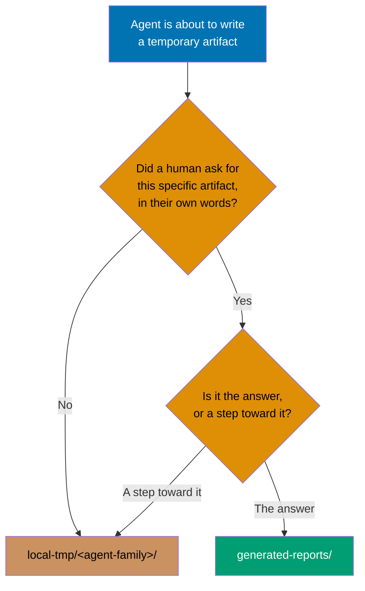
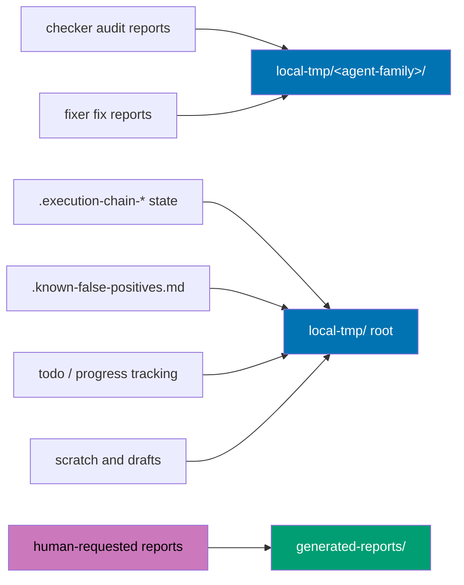

# Technical Documentation — Update Temporary Folders

## Who This Is For

You are executing this plan with no prior context on this repository. Everything you need to
understand the change is below. Read this file before opening `delivery.md`.

## Concepts You Need First

**Convention shard.** This repository does not keep one long convention file. It splits a convention
into small Markdown files ("shards") under a folder with a `README.md` index that links each shard
with a one-line annotation. Editing a convention means editing shards, and adding a shard means
adding index links — a new shard needs a link in its folder `README.md` _and_ in the parent
flattened convention, or the README-completeness gate fails the push as an orphan.

**Agent family.** Agents come in `maker` / `checker` / `fixer` triples. `docs-checker` and
`docs-fixer` share the family token `docs`. A token also appears as the first component of every
report filename — `{agent-family}__{uuid-chain}__{timestamp}__{type}.md` — but that one is typed
freehand and has drifted; see [§D-3a](#d-3a-the-family-token-is-declared-never-derived). Do not
treat it as authoritative.

**Harness mirror.** Agent definitions are hand-authored under `.claude/`. Copies for other tools
(`.opencode/`, `.codex/`, `.agents/skills/`) are _generated_ by `npm run generate:bindings` and must
never be hand-edited. `npm run validate:sync` fails if a mirror does not match its source.

**Parity boundary.** `apps/rhino-cli/` is byte-identical between `ose-public` and the private sibling.
`apps/rhino-cli/parity-manifest.sha256` lists 123 file hashes, and a nightly GitHub Actions job in
each repository downloads `ose-public`'s manifest from `main` and fails on any diff. Changing a file
inside that boundary in one repository obligates the same change in the other.

## Current State

### The convention as written

`repo-governance/development/infra/temporary-files/` holds 15 shards. The operative rule, in
`overview-and-the-rule.md`, is:

- `generated-reports/` — "For validation, audit, and check reports"
- `local-tmp/` — "For miscellaneous temporary files and scratch work"

`generated-reports-and-progressive-writing.md` then lists what belongs in `generated-reports/`,
ending with "Todo lists and progress tracking". `mandatory-report-generation.md` names 17
`*-checker` families and requires them all to write there under a "**NO EXCEPTIONS**" heading.

### The measured consequence

| Location                                           | Entries |
| -------------------------------------------------- | ------- |
| `ose-public` primary checkout `generated-reports/` | 471     |
| `ose-public` primary checkout `local-tmp/`         | 7       |
| The private sibling `generated-reports/`           | 96      |
| The private sibling `local-tmp/`                   | 22      |

`generated-reports/` is per-checkout, not shared: this plan's own worktree holds three further
entries of its own. Cleanup is therefore per-checkout, discovered at runtime, not a single path.

Among the `ose-public` entries are 15 hidden `.execution-chain-*` files — parent/child execution
tracking state shared between agent invocations — and `.known-false-positives.md`.

### Asymmetric retention care

`local-tmp-directory.md` carries a five-predicate reclamation rule, a seven-day mtime floor, and a
dated-quarantine procedure with a proof step. `generated-reports/` has no retention rule anywhere.
The directory that accumulated 567 files is the unguarded one.

### `.known-false-positives.md`

A suppression ledger. Fixer agents append accepted false positives to it; checker agents read it
before reporting, which is what stops the checker → fixer loop from re-reporting settled findings.
It is agent-written and agent-read — no human maintains it.

`rhino-cli` reads it at
`apps/rhino-cli/src/RhinoCli.Application/src/RepoGovernance.fs`, in `loadKnownFalsePositives`:

```fsharp
let path =
    opts.KnownFalsePositivesPath
    |> Option.defaultValue (Path.Combine(opts.RepoRoot, "generated-reports", ".known-false-positives.md"))
```

The path is overridable, but the default is the hardcoded string above. `RepoGovernance.fs` is entry
15 of the parity manifest.

## The New Rule

Replace the type axis with an intent axis.

> `generated-reports/` holds artifacts a human asked for and will read.
> `local-tmp/` holds everything an agent produces for itself or for another agent.

Applied as a two-question test before writing any artifact:

1. Did a human ask for this specific artifact, in their own words?
2. Is it the answer, rather than a step toward the answer?

Both yes → `generated-reports/`. Anything else → `local-tmp/`.

**Layout.** Agent artifacts go to `local-tmp/<agent-family>/`. Each agent **declares** its own family
in its Markdown body; the token is never derived from a filename, a folder, or the agent's own name
(see [§D-3a](#d-3a-the-family-token-is-declared-never-derived)). Agents create the directory
themselves with `mkdir -p` before their first write
(see [§D-3b](#d-3b-agents-create-their-own-family-directory)).

Cross-family state that belongs to no single family stays at `local-tmp/` root:
`local-tmp/.known-false-positives.md`.

**Unchanged.** Report filenames, UUID chains, timestamps, and the progressive-writing requirement.
Only the parent directory moves.



## Where Artifacts Move

Every arrow below starts at an artifact that lives in `generated-reports/` today, except
"scratch and drafts", which is already where it belongs.



## Design Decisions

### D-1: Intent axis instead of type axis

**Chosen.** The type axis fails because "report" describes shape, and machine output is shaped like
a report. The intent axis asks a question about provenance, which an agent can answer at write time
without classifying the artifact.

**Alternative rejected — keep the type axis and add sub-buckets.** `generated-reports/agent/` and
`generated-reports/requested/` would preserve every existing path prefix. Rejected: it keeps two
meanings in one directory name, so the maintainer's outbox is still a subdirectory of the machine's
scratch space, and the same drift resumes at the next level down.

### D-2: All checker output moves, not just the automated subset

**Chosen** by explicit maintainer decision, over a narrower option that would have kept audits in
`generated-reports/` when the human invoked the checker directly.

The narrower option requires each of the 17 checker families to branch on how it was invoked —
behavior an agent cannot reliably observe, and 17 two-branch code paths to keep correct. The chosen
option is one unconditional path per agent.

**Consequence, stated plainly:** `mandatory-report-generation.md`'s "**NO EXCEPTIONS**" requirement
is superseded, not softened. That shard is rewritten to point at `local-tmp/<agent-family>/`. The
`Write` + `Bash` tool requirement it carries survives unchanged — the reason for `Bash` is timestamp
generation, which is independent of destination.

### D-3: One directory per agent family

**Chosen** by maintainer decision.

**Alternatives rejected.** A flat `local-tmp/` re-creates the original problem one directory over —
471 historical artifacts would have buried the seven scratch files. A single `local-tmp/reports/`
subfolder keeps scratch and reports apart but leaves all families in one bucket.

### D-3a: The family token is declared, never derived

The obvious move — reuse component one of the existing report filename standard — does not work.
That token is typed freehand by each agent at write time and has never been validated. The 471
historical artifacts carry **38 distinct prefixes** for roughly 20 real families:

| Real family              | Prefixes actually used                                                 |
| ------------------------ | ---------------------------------------------------------------------- |
| ayokoding link checking  | `apps-ayokoding-www-link`, `ayokoding-www-link`, `ayokoding-www-links` |
| ayokoding facts checking | `ayokoding-facts`, `ayokoding-web-facts`                               |
| pr-review logic          | `pr-review-logic`, `pr-review-logic-maker`                             |
| plan takeover execution  | `plan-take-over-execution`, `plan-takeover-execution`                  |

Promoting that token to a **directory** name would turn a messy filename convention into 38
directories for 20 families — which is the failure D-3 exists to prevent, one level deeper.

**Chosen: each agent declares its own family explicitly, in its Markdown body.** A checker or fixer
states, in prose its own definition carries:

> Report family: `docs`. Write reports to `local-tmp/docs/`.

One declaration per agent, in the file that agent already reads. No derivation from a filename, a
folder, or an agent name.

**Alternative rejected — a `family:` frontmatter field.** Machine-readable, and the obvious choice
if a validator were coming. It is not: `validClaudeAgentFields` (`Harness.fs:2842`) would flag
`family` as an unknown field, and `walkFrontmatterFields` would **drop** it during mirror generation
with reason `unknown claude code field` — so `.opencode/`, `.codex/`, and `.agents/` would lose the
declaration entirely. Making it work means editing `Harness.fs`, which is parity manifest entry 11,
byte-identically in both repositories. That triples this plan's code surface to buy machine
readability that D-5's no-gate decision means nothing will read.

**Alternative rejected — a central `agent-family:` registry in `repo-config.yml`.** Explicit and
single-sourced, but a new `repo-config.yml` key needs a correct ownership class or the Rust-side
`repo_config_validate` fails while `repo-config validate` passes, and it separates the declaration
from the agent it describes.

Since no gate reads either form, a body declaration and a frontmatter field are equally binding —
both are instructions the agent reads. The body form costs nothing.

The filename keeps its own family prefix, so a report stays self-identifying if it is ever moved out
of its directory. Where a historical prefix and the declared family disagree, **the declaration
wins**; the historical artifacts are deleted in Phase 6 anyway.

### D-3b: Agents create their own family directory

`local-tmp/`'s tracked `.gitkeep` exists so that "a tool that writes here never has to create it
first and never fails on a missing path." That guarantee covers `local-tmp/` itself and does **not**
extend to the new per-family subdirectories.

**Chosen:** each agent runs `mkdir -p local-tmp/<family>/` before its first write. Zero new tracked
files, no `.gitignore` change.

**Alternative rejected — pre-create ~20 directories with committed `.gitkeep` files** and a
`!local-tmp/*/.gitkeep` re-inclusion in `.gitignore`. It preserves the path-always-exists guarantee,
but commits ~20 files into a directory whose whole purpose is holding things that are never
committed, and every new agent family then owes a new tracked file.

The rule text must state this limit explicitly rather than leaving a reader to assume the `.gitkeep`
guarantee reaches one level down.

### D-4: `.known-false-positives.md` moves to `local-tmp/` root

**Chosen.** It is agent-written and agent-read, so the intent test places it in `local-tmp/`
unambiguously. It is cross-family — every checker reads it, every fixer appends to it — so it does
not belong under any one family directory.

**Alternative rejected — promote it to tracked configuration** under `repo-governance/` or
`docs/metadata/`. That was considered while it looked human-maintained. It is not: fixer agents
generate every entry. Tracking it would put machine-appended content under review and into commits.

**Alternative rejected — leave it in place as a documented carve-out.** Zero code change, but it
leaves one permanent config-shaped file in a directory the new rule defines as holding only
human-requested deliverables. That is exactly the shape of exception that eroded the previous rule.

**Cost this decision imposes:** an F# default-path change inside the parity boundary, its unit
tests, a manifest regeneration, and the same change in the private sibling within the same window. This is
the only code in the plan.

### D-5: No enforcement gate

**Chosen** by explicit maintainer decision: documented rule only.

**What this means honestly.** Nothing mechanically prevents the drift from recurring. The
mitigation is that the new rule states a _test_ rather than a _taxonomy_, so an agent facing a novel
artifact has something to apply instead of a category to guess at. A future validator is a
legitimate follow-up and is recorded as one.

`Harness.fs`'s `validateGeneratedReportsTools` is an existing check that gates on
`agentPath.Contains "generated-reports"` — where `agentPath` is always under `.claude/agents/`, so
the condition is never true and the check never runs. It is unreachable today and stays unreachable;
this plan neither depends on it nor fixes it. Recorded so a later reader does not mistake it for
live enforcement.

### D-6: Both repositories in one plan

**Chosen** by maintainer decision, over delivering `ose-public` and recording a sibling obligation.

The two repositories shard this convention under different filenames (15 shards in `ose-public`, 18
in the private sibling), so propagation is semantic — the same rule restated into each repository's own
shard structure. Files are never copied between the two repositories. The single exception is
`RepoGovernance.fs`, which is inside the byte-identity boundary and must match exactly.

**Ordering constraint.** `.github/workflows/rhino-cli-parity-audit.yml` runs at 02:00 UTC daily and
compares each repository's manifest against `ose-public`'s `main`. `ose-public` lands first as
canonical; the private sibling must follow before the next scheduled run, or that run reports drift.

### D-7: This plan is two `rules-propagation` runs, not a documentation edit

This work supersedes an existing repository rule and rewrites an enforcement mandate, so it falls
squarely inside the
[rules-propagation workflow](../../../repo-governance/workflows/rules/rules-propagation.md). That
workflow is not optional here and is not satisfied by editing the shards directly: it normalizes
each rule into a falsifiable statement, scans for conflicts under layer-aware precedence, applies
the instruction-surface admission-and-eviction test, and — the step most often skipped — assigns
every rule one of three **enforcement dispositions**, none of which may be silence.

`delivery.md` therefore carries the workflow's ten steps as explicit `RP-` checkboxes rather than a
link to it. **One run touches one repository**, so the steps appear twice: Phase 1–3 execute the
`ose-public` run, Phase 5 executes an independent the private sibling run against that repository's own
shard set and its own conflict corpus. Nothing in the private-sibling run is satisfied by the
`ose-public` run having happened.

Four falsifiable statements are propagated: the destination test, the `local-tmp/<agent-family>/`
layout, the cross-family root case for the suppression ledger, and the supersession of the
`generated-reports/` mandate for all 17 checker families.

Two consequences worth naming up front:

- **The expected disposition for all four is `unenforced by decision`**, following D-5. That is a
  legitimate outcome, but the workflow requires the reason to be written onto the rule itself, where
  a reader will find it — not left implicit. `Harness.fs`'s unreachable check must not be cited as
  `covered`; a check verified in only one direction is half a check.
- **The workflow's own declared output points at the wrong directory.** Its frontmatter sets
  `pattern: generated-reports/rules-propagation__*__manifest.md`. A placement manifest is
  agent-produced working state, so the new rule moves it to `local-tmp/rules-propagation/`. The plan
  applies that retarget to the workflow that governs it — and to any other workflow whose `outputs:`
  block names `generated-reports/`.

Both runs must terminate at `final-status: landed`. A `partial` or `halted` run is a blocked plan,
not a shipped one.

## File-Impact Analysis

```text
.
├── plans/in-progress/update-tmp-folders/
│   ├── README.md [N] — plan context and navigation
│   ├── brd.md [N] — business goal, metrics, risks
│   ├── prd.md [N] — user stories and Gherkin acceptance criteria
│   ├── tech-docs.md [N] — this file
│   ├── delivery.md [N] — phased executable checklist
│   └── learnings.md [N] — Knowledge Capture running log
├── repo-governance/development/infra/temporary-files/
│   ├── overview-and-the-rule.md [E] — replace the type-based rule with the two-question test
│   ├── generated-reports-and-progressive-writing.md [E] — restrict to human-requested reports; drop "Todo lists and progress tracking"
│   ├── local-tmp-directory.md [E] — add the <agent-family>/ layout and the cross-family root case
│   ├── mandatory-report-generation.md [E] — retarget all 17 families to local-tmp/<agent-family>/
│   ├── usage-and-implementation.md [E] — retarget the report-generating-agent instructions
│   ├── status-exceptions-and-related.md [E] — gitignore statement and exception list
│   ├── report-file-naming-standard.md [E] — state that the standard names files, not their parent directory
│   ├── report-file-naming-early-report-types.md [E] — path prefix in examples
│   ├── report-file-naming-content-and-plan-reports.md [E] — path prefix in examples
│   ├── fixer-reports-universal-pattern.md [E] — path prefix in examples
│   ├── uuid-chain-generation.md [E] — .execution-chain-* location
│   ├── uuid-chain-startup-and-tracking.md [E] — .execution-chain-* location
│   ├── progressive-writing-requirements-and-implementation.md [E] — destination in the implementation pattern
│   └── README.md [E] — index annotations for every re-scoped shard
├── repo-governance/development/infra/
│   ├── temporary-files.md [E] — flattened parent convention; the one-line rule statement
│   ├── build-artifact-sweeper/principles-and-scope.md [E] — sweeper exclusion wording
│   ├── build-artifact-sweeper/reconciliation-and-related-documentation.md [E] — same
│   ├── anti-patterns/*.md [E] — 3 files; example paths in anti-pattern snippets (discovered by grep)
│   └── best-practices/*.md [E] — 3 files; example paths in best-practice snippets (discovered by grep)
├── repo-governance/workflows/rules/rules-propagation.md [E] — outputs.pattern → local-tmp/rules-propagation/
├── repo-governance/workflows/**/*.md [E] — any other outputs: block naming generated-reports/; discovered by grep
├── repo-governance/ (remaining) [E] — ~110 further files carrying a path mention; each classified before editing
├── repo-governance/glossary/content-trees.md [E] — the two-directory sentence
├── AGENTS.md [E] — the "Plans & Temporary Files" line
├── .claude/agents/**/*.md [E] — 24 files naming generated-reports; retarget write destinations
├── .claude/skills/**/*.md [E] — 31 files naming generated-reports; retarget write destinations
├── .opencode/agents/*.md [G] — regenerated mirror
├── .codex/agents/*.md [G] — regenerated mirror
├── .codex/config.toml [G] — regenerated delimited agent region only
├── .agents/skills/**/*.md [G] — regenerated non-vendored Skill mirrors
├── .prettierignore [E] — add local-tmp/
├── apps/rhino-cli/src/RhinoCli.Application/src/RepoGovernance.fs [E] — default ledger path → local-tmp/.known-false-positives.md
├── apps/rhino-cli/tests/**/RepoGovernance*.fs [E] — assert the new default path (exact file discovered from the test project)
├── apps/rhino-cli/parity-manifest.sha256 [G] — regenerated after the RepoGovernance.fs edit
├── specs/apps/rhino/**/*.feature [E] — only if a scenario names the ledger path; discovered by grep, may be zero
├── generated-reports/** [D] — all accumulated artifacts, per checkout, via dated quarantine
└── docs/how-to/add-programming-language.md [E] — one path mention
```

### More Detail

**Discovery, not a fixed edit list.** The `repo-governance/` line covering ~110 files is a bounded
family discovered by one command, not an unbounded "update related files". Every occurrence is
classified into exactly one of four verdicts before any edit:

| Verdict        | Meaning                                                               | Action                       |
| -------------- | --------------------------------------------------------------------- | ---------------------------- |
| `RULE`         | Text defining what the directory is for                               | Rewrite to the new rule      |
| `WRITE-TARGET` | An instruction telling an agent to write output there                 | Retarget to `local-tmp/`     |
| `INFRA`        | Ignore-file entry, tool skip-list, sweeper exclusion                  | Leave; both dirs still exist |
| `HISTORICAL`   | A record of what was done under the old rule (`plans/done/`, ledgers) | Leave verbatim               |

The classification is recorded to a file under `local-tmp/` — itself an interim artifact under the
new rule — so a reviewer can audit the verdict per file rather than trusting a diff.

**`plans/done/` is never rewritten.** Completed plans record what was true when they ran. AC-6
counts them as `HISTORICAL`.

**Mirror ordering.** Every `.claude/` edit lands in the same commit as its regenerated mirror.
Mirrors are regenerated with `npm run generate:bindings`, never hand-edited. `.codex/config.toml`
has hand-authored tables outside its delimited region that must survive regeneration untouched.

**Ordering across repositories.** `ose-public` PRs merge first. The private-sibling delivery follows
in the same session because of the nightly parity audit window described in D-6.

**Two writing hazards specific to this repository.** Markdown written by a script or heredoc skips
the formatter hook and then fails `format-verify-prettier`; every plan and governance file here is
written with an editor tool. And governance index files sit near a 500-word FAIL ceiling, so
`wc -w` is checked before committing any `README.md` annotation rewrite under `repo-governance/`.

## Dependencies

- No new runtime dependency, package, or tool.
- Depends on existing commands only: `npm run generate:bindings`, `npm run validate:sync`,
  `npm run harness:bindings-validation`, `nx run rhino-cli:test:quick`, `nx affected -t build`.
- The private sibling delivery depends on `ose-public`'s `rhino-cli` change being on `main` first, because
  `ose-public` is the canonical manifest source.

## Rollback

| Change                     | Rollback                                                                                                                      |
| -------------------------- | ----------------------------------------------------------------------------------------------------------------------------- |
| Governance / agent / skill | `git revert` the delivery commit. Docs-only; no runtime state.                                                                |
| Harness mirrors            | Reverted with their source, then `npm run generate:bindings` re-run to confirm the tree is clean.                             |
| `RepoGovernance.fs` path   | `git revert`, then regenerate the manifest. The ledger file is moved back with `git mv`-equivalent `mv`; it is untracked.     |
| Deleted artifacts          | Not recoverable after the final delete, which is why the quarantine step and its proof gate precede it. Until then, one `mv`. |

The two repositories roll back independently, except the `rhino-cli` path change, which must be
reverted in both or the nightly parity audit fails.

## Follow-Ups Recorded, Not Delivered

1. A retention or expiry policy for `generated-reports/`, mirroring `local-tmp/`'s predicate rule.
   Without one, the directory can re-accumulate; the maintainer chose a one-time clear for now.
2. A validator that classifies writes to either directory. Explicitly out of scope per D-5.
3. `Harness.fs`'s unreachable `validateGeneratedReportsTools`, described in D-5.
