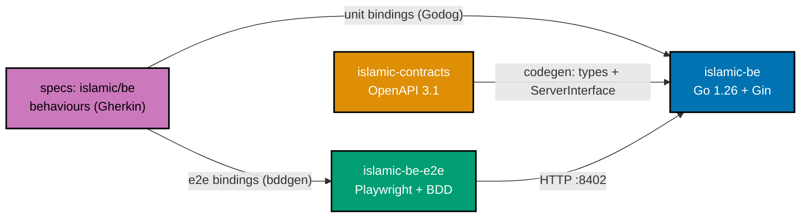
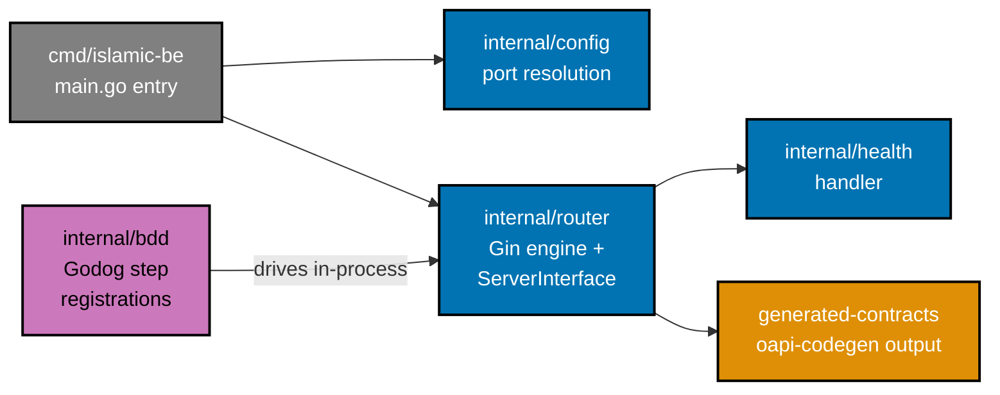
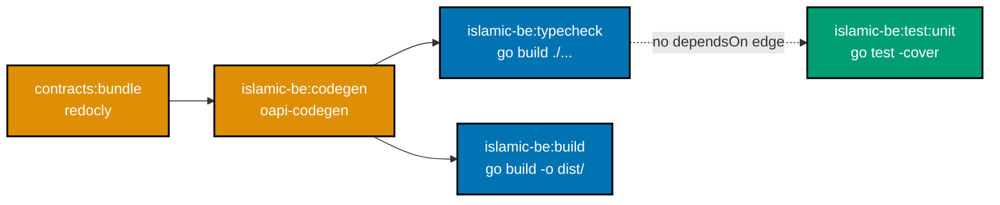
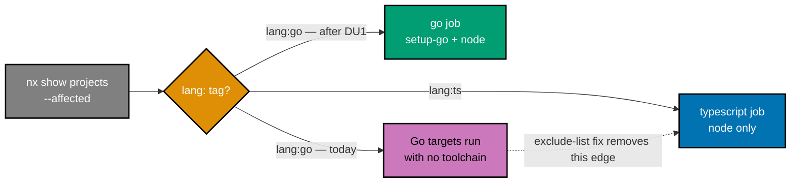
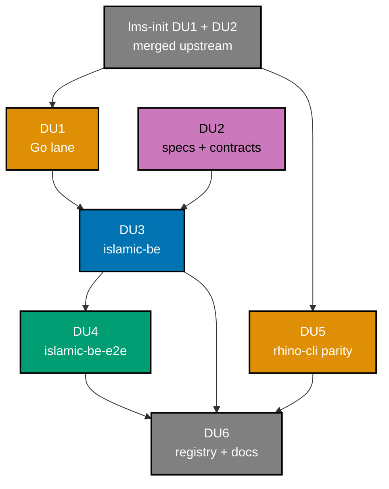

# Technical Documentation — islamic-be-init

## 1. Architecture

### 1.1 Project Topology

`islamic-be` follows the same three-project shape as `ose-be`: an application, a dedicated E2E
project, and a contracts project rooted in the spec corpus. The corpus — not the code — is the
source of truth for behaviour.

<!-- Uses colors: blue (#0173B2), orange (#DE8F05), teal (#029E73), purple (#CC78BC) for accessibility -->



### 1.2 Internal Package Layout

Go's convention places tests beside the code they cover, and `go test ./... -coverprofile` assumes
it. The Gherkin step registrations are the exception: they are concentrated in one `internal/bdd/`
package so the behaviour-coverage extractor scans a single known root.



`internal/bdd` uses `net/http/httptest` against the in-process Gin engine. No socket is bound, so
every scenario stays inside the Unit boundary as the BDD contract defines it — the test replaces the
network rather than crossing it.

### 1.3 Codegen Dependency Chain

`islamic-be` mirrors `ose-be`'s chain exactly: `codegen` gates `typecheck` and `build`, never the
test targets.



Unlike Rust, Go compiles the generated package as an ordinary import, and `go test` compiles its
dependencies itself. The dashed edge records that `test:unit` deliberately carries no `dependsOn`
on `codegen`, matching the Codegen Dependency Chain convention's default.

### 1.4 CI Job Routing — the Defect This Plan Fixes

`pr-quality-gate.yml`'s `detect` job classifies affected projects by `lang:` tag
[Repo-grounded — `.github/workflows/pr-quality-gate.yml:102`]. Today a `lang:go` project matches no
`case` arm, so no `has-go` output is ever set. Worse, every language job selects by _excluding_
known `lang:` tags rather than by including its own, so an unrecognised tag is swept into **all
four**:

| Job                       | `--exclude` list today         | Excludes `go`? |
| ------------------------- | ------------------------------ | -------------- |
| `typescript` (`:306`)     | `fsharp,csharp,rust,dart,java` | no             |
| `dotnet` (`:335`, `:338`) | `ts,dart,java`                 | no             |
| `flutter` (`:362`)        | `ts,fsharp,csharp,rust,java`   | no             |
| `java` (`:377`)           | `ts,fsharp,csharp,rust,dart`   | no             |

[Repo-grounded — all four jobs read from the current commit, after `lms-init` DU2 merged as #493.]

The exclusion style is a fail-open default: a new language is included everywhere until it is
explicitly named. **`lms-init` DU2 demonstrated the defect rather than fixing it.** Adding Java
closed the Java leak in three jobs and simultaneously opened a fourth leak for every future
language, because the new `java` job also selects by exclusion and names no `go`. The defect is
structural, not per-language: each language added makes the next language's leak one job wider.

This plan adds `tag:lang:go` to all four and inherits the same weakness for language number six.
Inverting the selection to an allowlist would fix it permanently and is **out of scope here** —
changing the selection strategy for five existing jobs is not this plan's delivery. It is recorded
in `learnings.md` for routing at Phase 7.



The `typescript` job's `if:` is `has-ts == 'true'` [Repo-grounded — `:291`], and `islamic-be-e2e` is
`lang:ts`. Any change touching the app pair therefore satisfies that condition, so this is not a
theoretical leak — it fires on the first PR that adds the app. The `quality-gate` aggregate job's
`needs` list must also gain `go`, or the aggregate can report success while the Go job failed
[Repo-grounded — `:392`, which `lms-init` DU2 has already extended with `java`].

### 1.5 Delivery Dependency Position



DU1 and DU2 are independent of each other and may proceed in either order or concurrently. DU5 is
independent of DU1–DU4 and gates only DU6.

Two edges run to `lms-init`. DU1 waits on **DU2 of `lms-init`**, which generalizes
`behaviour-coverage.mjs`, establishes the `has-<lang>` CI pattern and the `setup-<lang>` composite
action, and adds `tag:lang:java` to the three exclude lists. DU5 waits on **DU1 of `lms-init`**,
which lands the config-driven doctor inventory — and, critically, must have its parity PR pair
**merged and closed in both repositories** before this plan opens its own pair. Two concurrent
parity pairs would race on the same `apps/rhino-cli/parity-manifest.sha256`, and a one-sided landing
is exactly what `rhino-cli-parity-audit.yml` is built to catch
[Repo-grounded — `specs/apps/rhino/cli/behaviours/gate/parity-manifest.feature:42`].

## 2. Decision Records

### D-0 — Build on `lms-init`, rather than beside it or before it

**Decision**: `islamic-be-init` declares a hard dependency on `lms-init` DU1 and DU2, both merged,
before its own DU1 begins.

> **Status: satisfied.** DU1 merged as `c6fffc3` and DU2 as #493. Phase 0's Upstream Verification
> has been run against the tree and every check passes — see `evidence/phase-0-upstream.md`. The
> dependency is now historical; it is retained here because it explains the plan's shape.

Both plans are the same shape — teach the monorepo a language, then ship an app on it — and they
touch an overlapping set of shared files. Measured against the current commit:

| Shared file                                            | `lms-init`              | this plan            | Overlap                                   |
| ------------------------------------------------------ | ----------------------- | -------------------- | ----------------------------------------- |
| `scripts/behaviour-coverage.mjs:20` `BINDING_FILE`     | adds `java`             | adds `go`            | same regex literal                        |
| `scripts/behaviour-coverage.mjs:374` `extractBindings` | adds a `.java` arm      | adds a `.go` arm     | same dispatch                             |
| `pr-quality-gate.yml` detect + 3 exclude lists         | adds `java`             | adds `go`            | same blocks                               |
| `repo-config.yml` `gates:`                             | adds `format-java` pair | adds `lint-golangci` | same list                                 |
| tag vocabulary `lang:`                                 | adds `java`             | adds `go`            | same table                                |
| `apps/rhino-cli/parity-manifest.sha256`                | DU1 regenerates it      | DU5 regenerates it   | **same generated file, two repositories** |

**Alternatives considered**:

- _Fully independent, resolve conflicts on merge._ Fastest to start. Rejected on the last row: two
  parity PR pairs open simultaneously across two repositories can produce a transient one-sided
  state that turns the nightly parity audit red for reasons unrelated to either change. The other
  five rows are mechanical rebases; that one is not.
- _Serialize only the parity delivery._ Removes the dangerous race and keeps everything else
  parallel. Rejected as a middle option that still duplicates the seam work in the five mechanical
  rows, and still leaves whichever plan lands second rebasing them.
- _Fold both languages into one enablement plan._ Cleanest end state. Rejected because `lms-init` is
  already authored, reviewed, and merged as PR #487; re-cutting it would discard that work.

**What the dependency buys**, concretely:

1. **The doctor becomes free.** `go` is absent from the hardcoded `doctorToolInventory`
   [Repo-grounded — `apps/rhino-cli/src/RhinoCli.Application/src/RepoConfig.fs:172`], and the
   `format-gofmt` gates declare no `doctor-tools:` [Repo-grounded — `repo-config.yml:547`]. Without
   `lms-init` DU1, registering `go` would mean a **second** byte-identical `rhino-cli` edit in this
   plan. With it, `go` is a `repo-config.yml` entry (D-7).
2. **The extractor is an arm, not a refactor.** `lms-init` DU2 routes a fourth language and factors
   the shared quoted-literal feature-reference scan into one helper. `extractGoBindings` reuses it.
3. **The CI pattern is established.** `setup-java` fixes the composite-action shape and the
   `has-<lang>` detect/job/exclude/aggregate quintet; `setup-go` copies it rather than deriving it.

**Accepted cost, and how it resolved**: this plan could not start until `lms-init` executed two
delivery units. That cost was real but short — both landed before this plan began, so the wait was
zero. The escape hatch is no longer needed: the dependency was a **sequencing** choice, not a
technical one, and it is now discharged.

**What the wait actually bought**, measured against the merged tree: `featureReferences(source,
literalPattern)` exists to reuse [Repo-grounded — `scripts/behaviour-coverage.mjs:302`],
`doctorToolInventoryFor (config)` exists [Repo-grounded — `RepoConfig.fs:284`], `setup-java`
exists as the composite-action model, and the private sibling already carries `extra-tools: []` so no key
set changes. Every claim in this decision record now checks out against real code rather than a
prediction.

**Revisit when**: `lms-init` DU1 or DU2 is abandoned, or a third language lane is proposed before
either lands.

### D-1 — A standalone service, not a bounded context in `ose-be`

**Decision**: Ship `islamic-be` as its own deployable under a new `domain:islamic` product line.

**Alternatives considered**:

- _A bounded context inside `ose-be`_ (`Contexts/PrayerTimes/`). Zero new toolchain, zero CI work,
  reuses the existing contract and E2E suite; deliverable in days. Rejected because it couples a
  broadly-consumed stateless utility to a regulated compliance product's release cadence and blast
  radius, and because `ose-be` owns Postgres, NATS, and an LLM client that this workload needs none of.
- _A standalone service tagged `domain:ose`_. Avoids one convention amendment. Rejected because
  `nx affected` scoping and `nx graph --focus` would conflate two genuinely different products.

**Prior art**: `organiclever-be` and `ose-be` are already separate deployables serving separate
products from one repository, with separate spec corpora and separate E2E projects. This follows that
established split rather than inventing one.

### D-2 — Go and Gin, with a first-class language lane

**Decision**: Implement in Go 1.26 with Gin, and build the missing platform lane in the same plan.

**Alternatives considered**:

- _F# and Giraffe_, copying `ose-be`. Zero platform work — CI, behaviour coverage, tag vocabulary,
  linting, and `rhino-cli` already handle it. Rejected on the explicit instruction to use Go; the
  cost was surfaced and accepted before this plan was written.
- _Two plans — lane first, apps second_. Rejected because a platform lane with no consumer ships
  enablement nothing exercises, which this repository's cost/benefit and anti-echo rules push back on.

**Prior art**: `plans/done/2026-04-15__demo-be-golang-gin` built a Go/Gin backend here before. Its
app was deleted with the demo suite, but its residue is load-bearing evidence that this works:
`Brewfile`'s `brew "go"`, `repo-config.yml`'s `format-gofmt` and `format-verify-gofmt` gates,
`scripts/verify-gofmt.sh`, and `rhino-cli`'s `TestCoverage.Format.Go` `cover.out` parser all survive
and are reused unchanged. That plan also used Godog for Gherkin binding, which this plan repeats.

### D-3 — `oapi-codegen` rather than `openapi-generator-cli`

**Decision**: Generate Go types and a Gin `ServerInterface` with `oapi-codegen` v2
(`github.com/oapi-codegen/oapi-codegen/v2`, verified v2.6.0 on the development machine).

**Alternatives considered**:

- _`openapi-generator-cli` with `go-gin-server`, models only_ — the exact structural mirror of
  `ose-be`, using a devDependency already present. Rejected on two grounds: it produces models only,
  so nothing binds a route to the contract; and its JAR needs a JRE, which would force the new Go CI
  job to provision Java for a job that otherwise needs only Go.
- _`openapi-generator-cli` with the plain `go` client generator, models only_. Same two objections.

**Rationale**: `oapi-codegen` emits a `ServerInterface` the router must satisfy. A handler that
drifts from the published contract fails compilation at `typecheck`, which is strictly stronger than
the models-only enforcement `ose-be` gets. This is a deliberate, documented divergence from `ose-be`
in the direction of a tighter gate, not a weaker one.

**Consequence**: `apps/islamic-be` pins `oapi-codegen` to the module so the generator version is
locked by `go.mod`/`go.sum` rather than by a developer's `PATH`. Delivered as a Go 1.24+ `tool`
directive in `go.mod` rather than the older `tools.go` blank-import file — see DU3's implementation
note for why the file shape had to change.

### D-4 — Idiomatic Go test layout with centralised BDD bindings

**Decision**: Unit tests co-located as `*_test.go` beside their package; every Godog step
registration in `internal/bdd/`.

**Alternatives considered**:

- _Repository layout_ (`tests/unit/steps/` + `tests/unit/tests/`, mirroring `ose-be`). Rejected
  because it forces external test packages, which cannot reach unexported identifiers and makes the
  99% line floor materially harder to reach honestly.
- _Fully idiomatic, with step registrations scattered beside their subjects_. Rejected because the
  behaviour-coverage extractor would have to scan the entire module rather than one directory,
  widening the surface where a stray regex literal could be misread as a binding.

**Consequence**: `behaviour-coverage.json` points the `unit` adapter's `bindings` at `internal/bdd`
and its `driver` at `go.mod`.

### D-5 — Stateless: no Integration adapter

**Decision**: Omit `test:integration` and `test:coverage:integration` entirely, and explain the
omission in the project README.

**Rationale**: the BDD contract admits an Integration adapter only where a project owns a real
local-resource boundary. `islamic-be` owns no database, no message bus, no filesystem state, and no
child process. Port resolution reads environment variables, which Unit replaces with injected values.
The convention is explicit that projects without the boundary omit both targets, and that echo,
no-op, and success-sentinel targets are forbidden because they falsely claim a quality boundary
exists.

**Consequence**: `integration-loopback:` in `repo-config.yml` stays `[]`. The health scenario needs
no `@integration-exempt` tag, because there is no Integration adapter for it to be exempt from —
unlike `ose-be`, which carries that tag precisely because it _does_ have the adapter.

### D-6 — Container image, but no continuous deployment

**Decision**: Ship `Dockerfile` and `infra/dev/islamic-be/docker-compose.yml`; add no
`publish-images.yml` entry, no `islamic-be-build-deploy-stag.yml`, and no `stag-islamic-be` branch.

**Rationale**: the image is buildable and runnable locally, which proves the packaging works and
matches the `ose-be` file inventory. The deploy half is deliberately withheld because the k3s rollout
lives in the private sibling's coralpolyp and there is no manifest for this service; wiring GHCR publication
to a rollout that does not exist would produce images nothing consumes.

### D-7 — Full `env-contract` registration via a paired `rhino-cli` change

**Decision**: Add a `scanGoReads` scanner to `apps/rhino-cli/src/RhinoCli.Application/src/Env.fs`
and register `apps/islamic-be` in `repo-config.yml`'s `env-contract:` surfaces with `lang: go`.

**Alternatives considered**:

- _Omit `islamic-be` from `env-contract:` for v1_. The registry is opt-in with no completeness check,
  so omission validates clean and costs no cross-repo work. Rejected in favour of full parity — no
  app should be the one app whose env keys go undrift-checked.
- _Register with `lang: typescript` as a stopgap_. Rejected as actively misleading: the TypeScript
  scanner reads `root/src` for TS idioms, finds nothing in Go source, and reports every declared key
  as `DeclaredNotRead` — a green gate proving nothing.

**Cost, stated plainly**: `Env.fs` currently dispatches `"typescript"` and `"fsharp"`, returning
`Error "unsupported lang: %s"` otherwise [Repo-grounded — `Env.fs:1590`–`:1592`]. `Env.fs` is line 9
of `apps/rhino-cli/parity-manifest.sha256`, so `apps/rhino-cli/src` is held byte-identical across
`ose-public` and the private sibling with zero carve-outs, and rhino-cli behaviour must be
cucumber-covered in both repositories. This decision therefore converts DU5 into a cross-repository
parity delivery with a recorded shared identity.

**The manifest is part of the change, not a follow-up.** Editing `Env.fs` invalidates
`parity-manifest.sha256`; the regenerated manifest lands in the **same commit** as the source edit,
in both repositories. The command is `rhino-cli parity manifest generate`
[Repo-grounded — `apps/rhino-cli/src/RhinoCli.Application/src/Parity.fs:22`,
`specs/apps/rhino/cli/behaviours/gate/parity-manifest.feature:10`]; hand-editing hashes is never
correct. Note that `apps/rhino-cli/project.json` declares no target named `parity` — the CLI
subcommand is the entry point.

**Prior art**: `scanFsharpReads` (`Env.fs:1516`) is the model — a regex pair over source files under
`root/src`, filtered through `frameworkOwnedEnvironmentKeys`, marked `[<ExcludeFromCodeCoverage>]`
with a documented coverage boundary. `scanGoReads` follows that shape, matching `os.Getenv("VAR")`
and `os.LookupEnv("VAR")`.

### D-8 — Lane-first delivery-unit sequencing

**Decision**: Land the Go lane before any Go code, in six `ose-public` delivery units plus one
the private sibling parity PR paired with DU5.

**Rationale**: landing `islamic-be` before the lane is not merely untidy — it is red CI, because the
Go targets execute in three toolchain-less jobs (§1.4). The lane must precede or accompany the app.
Lane-first was chosen over a combined lane-and-app PR because the Go binding extractor is provable
standalone through `scripts/behaviour-coverage.test.mjs` fixtures, so DU1 is genuinely
self-verifying rather than inert.

**Accepted weakness**: the `go` CI job itself has no Go project to run against until DU3. If
`setup-go` or module resolution is misconfigured, DU3 discovers it. This is bounded — the fix lands
in the same delivery unit that surfaces it.

### D-9 — Register `go` through `doctor.extra-tools`, not a hardcoded inventory entry

**Decision**: Declare `go` under `repo-config.yml`'s `doctor.extra-tools`, using the schema
`lms-init` DU1 shipped. The `DoctorExtraTool` record is `Name`, `Binary`, `VersionArgs`,
`VersionStream`, `RequiredVersion`, `Install` [Repo-grounded — `RepoConfig.fs:214`–`:224`], and the
YAML below matches it field for field.

```yaml
doctor:
  extra-tools:
    - name: go
      binary: go
      version-args: ["version"]
      version-stream: stdout
      required-version: "1.26"
      install:
        brew: ["install", "go"]
```

`version-stream: stdout` is the ordinary case — `go version` writes to stdout, unlike the
`java -version` stderr trap that motivated the field. Declaring it explicitly rather than relying on
a default keeps the two entries symmetric and reviewable side by side.

**Alternatives considered**:

- _Add `"go"` to the hardcoded `doctorToolInventory`_ [Repo-grounded — `RepoConfig.fs:172`]. This is
  what every existing tool did. Rejected because it is a second byte-identical `rhino-cli` edit in a
  plan that already carries one, doubling this plan's parity exposure to buy nothing `lms-init` DU1
  does not already provide.
- _No doctor entry at all._ Go is installed by `Brewfile` and by CI `setup-go`, so a missing
  toolchain surfaces as a build failure. Rejected because it surfaces with no diagnosis, and because
  `format-gofmt` already runs `gofmt` at pre-commit [Repo-grounded — `repo-config.yml:547`] — a
  contributor without Go gets an opaque hook failure rather than a doctor row.

**Consequence**: parity rule 4 holds both repositories' `repo-config.yml` top-level key sets
identical. `lms-init` DU1 added the `doctor.extra-tools` key to **both** repositories — `ose-public`
carries the `java` entry, the private sibling carries `extra-tools: []`
[Repo-grounded — the private sibling `repo-config.yml:272`] — so this plan adds a list item under an
existing key and changes no key set. DU5's gate verifies that explicitly.

## 3. File-Impact Analysis

```text
.
├── .github/
│   ├── actions/setup-go/action.yml [N] — pin Go from apps/islamic-be/go.mod, cache modules
│   └── workflows/pr-quality-gate.yml [E] — add has-go detect case + output, add go job, add
│                                           tag:lang:go to the typescript, dotnet, and flutter
│                                           exclude lists, add go to quality-gate needs
├── apps/
│   ├── README.md [E] — add islamic-be to the product map and islamic-be-e2e to the E2E table
│   ├── islamic-be/
│   │   ├── go.mod [N] — module github.com/wahidyankf/ose-public/apps/islamic-be, go 1.26
│   │   ├── go.sum [N] — dependency checksums
│   │   ├── (no tools.go) — the generator is pinned by a go.mod `tool` directive instead
│   │   ├── .golangci.yml [N] — golangci-lint v2 schema (version: "2")
│   │   ├── .env.example [N] — ISLAMIC_BE_PORT=8402
│   │   ├── .editorconfig [N] — mirror apps/ose-be/.editorconfig
│   │   ├── .gitignore [N] — dist/, cover.out, generated-contracts/
│   │   ├── .dockerignore [N] — build-context exclusions
│   │   ├── Dockerfile [N] — multi-stage build on the pinned Go version
│   │   ├── LICENSE [N] — MIT, copied from apps/ose-be/LICENSE
│   │   ├── README.md [N] — corpus, adapters, targets, and the Integration omission rationale
│   │   ├── project.json [N] — Nx targets and the four-dimension tag set
│   │   ├── behaviour-coverage.json [N] — corpus + unit and e2e adapters (no integration adapter)
│   │   ├── cmd/islamic-be/main.go [N] — entry point; excluded from the coverage denominator
│   │   ├── internal/config/port.go [N] — flag → ISLAMIC_BE_PORT → default 8402
│   │   ├── internal/config/port_test.go [N] — port-resolution unit tests
│   │   ├── internal/health/health.go [N] — health handler
│   │   ├── internal/health/health_test.go [N] — health handler unit tests
│   │   ├── internal/router/router.go [N] — Gin engine satisfying the generated ServerInterface
│   │   ├── internal/router/router_test.go [N] — routing and 404 unit tests
│   │   └── internal/bdd/steps.go [N] — every Godog step registration, httptest-driven
│   └── islamic-be-e2e/
│       ├── package.json [N] — playwright + playwright-bdd, mirroring ose-be-e2e
│       ├── playwright.config.ts [N] — bddgen wiring against the islamic corpus
│       ├── tsconfig.json [N] — mirror apps/ose-be-e2e/tsconfig.json
│       ├── .gitignore [N] — test-results, .features-gen
│       ├── README.md [N] — how to run the suite and what it covers
│       ├── project.json [N] — E2E targets and tags
│       ├── behaviour-coverage.json [N] — corpus + e2e adapter
│       ├── steps/health.steps.ts [N] — health scenario bindings
│       ├── steps/backend-process.ts [N] — start and stop the islamic-be process
│       └── utils/response-store.ts [N] — per-scenario response capture
├── infra/dev/islamic-be/docker-compose.yml [N] — local dev stack for the service alone
├── specs/apps/islamic/
│   ├── README.md [N] — product-level corpus index
│   ├── overview.md [N] — PM-first framing of the Islamic tools product
│   └── be/
│       ├── README.md [N] — corpus contents and related projects
│       ├── architecture.md [N] — C4 context → container → component
│       ├── behaviours/health/README.md [N] — health bounded-context index
│       ├── behaviours/health/health.feature [N] — the three US-1 scenarios
│       ├── behaviours/config/README.md [N] — configuration bounded-context index
│       ├── behaviours/config/port-resolution.feature [N] — the five US-3 scenarios
│       └── contracts/
│           ├── README.md [N] — contract index
│           ├── project.json [N] — islamic-contracts: lint, bundle, docs
│           ├── .spectral.yaml [N] — ruleset copied from the ose-be contract
│           ├── openapi.yaml [N] — OpenAPI 3.1 root
│           ├── paths/README.md [N] — path-fragment index
│           ├── paths/health.yaml [N] — GET /api/v1/health
│           ├── schemas/README.md [N] — schema index
│           ├── schemas/health.yaml [N] — HealthResponse
│           ├── schemas/error.yaml [N] — Error
│           └── generated/README.md [N] — explains that bundles are generated, not authored
├── scripts/
│   ├── behaviour-coverage.mjs [E] — add extractGoBindings; dispatch .go in extractBindings
│   ├── behaviour-coverage.test.mjs [E] — fixtures for each Godog registration form
│   └── lint-golangci.sh [N] — DU1 wrapper: group the gate's flat file list by owning Go module
│                              and run golangci-lint once per module from that module's root
├── repo-config.yml [E] — DU1 registers the lint-golangci gate and declares both go and
│                        golangci-lint under doctor.extra-tools; DU6 adds the islamic-be
│                        env-contract surface
├── apps/rhino-cli/
│   ├── src/RhinoCli.Application/src/Env.fs [E] — add scanGoReads; dispatch "go" (both repos)
│   └── parity-manifest.sha256 [G] — regenerated by `rhino-cli parity manifest generate`, in the
│                                    same commit as the Env.fs edit, in both repositories
├── specs/apps/rhino/cli/behaviours/env/*.feature [E] — Gherkin for the Go scanner (bounded family:
│                                                       the exact files are discovered from the
│                                                       existing env behaviour folder before editing)
├── docs/reference/
│   ├── web-sites.md [E] — add islamic-be (port 8402) and ISLAMIC_BE_PORT to both tables
│   ├── monorepo-structure.md [E] — add both projects to Current Apps
│   └── system-architecture/applications.md [E] — add the service to the application map
├── repo-governance/development/infra/nx-targets/
│   ├── tag-convention-four-dimension-scheme.md [E] — admit lang:go, platform:gin, domain:islamic
│   └── tag-convention-current-tags-and-examples.md [E] — add the three new project rows
└── plans/in-progress/README.md [E] — list this plan under Active Plans
```

### More Detail

**Bounded family discovery.** The only `*` pattern above is
`specs/apps/rhino/cli/behaviours/env/*.feature`. Its exact members are enumerated with a directory
listing at the start of DU5 and recorded in the execution ledger before any edit, per the
file-impact convention.

**Generated paths.** `apps/islamic-be/generated-contracts/` and
`specs/apps/islamic/be/contracts/generated/` carry no `[N]` entries because both are already covered
by root `.gitignore` rules (`**/generated-contracts/`) or regenerated by their own targets. They are
build output, not planned files.

**Ordering constraint.** `repo-config.yml` is edited three times — the `lint-golangci` gate and the
`doctor.extra-tools` `go` entry in DU1, and the `env-contract` surface in DU6. All three are list
items under top-level keys that already exist (`doctor.extra-tools` itself is added to both
repositories by `lms-init` DU1, per D-9), so none changes the key set the cross-repo schema-parity
gate compares. DU5's gate re-verifies that explicitly.

**The parity manifest is generated, not authored.** `apps/rhino-cli/parity-manifest.sha256` carries
`[G]`, not `[E]`. It is produced by `rhino-cli parity manifest generate` from the staged boundary
bytes, so it must be regenerated **after** the `Env.fs` edit is staged and committed alongside it.
Regenerating before staging, or hand-editing a hash, produces a manifest that describes a tree that
does not exist.

**Every Nx-registered project declares `namedInputs.specs`.** This is rule 2 of the byte-identity
standard and it applies to all three new projects, including `islamic-contracts` rooted under
`specs/`, which a directory-only `apps`/`libs` scan cannot see.

## 4. Mechanics

### 4.1 Nx Target Surface

| Target                       | `islamic-be`                                          | `islamic-be-e2e`            |
| ---------------------------- | ----------------------------------------------------- | --------------------------- |
| `codegen`                    | `oapi-codegen` from the bundled contract              | —                           |
| `typecheck`                  | `go build ./...`                                      | `bddgen && tsc --noEmit`    |
| `build`                      | `go build -o dist/islamic-be ./cmd/islamic-be`        | —                           |
| `lint`                       | `golangci-lint run`                                   | `oxlint .`                  |
| `dev` / `run`                | `go run ./cmd/islamic-be`                             | —                           |
| `test:unit`                  | `go test ./... -coverprofile=cover.out` + 99% floor   | — (E2E project)             |
| `test:integration`           | **omitted** — no local-resource boundary (D-5)        | **omitted**                 |
| `test:e2e`                   | —                                                     | `scripts/run-e2e.sh`        |
| `test:coverage:unit`         | behaviour-coverage `--adapter unit`                   | —                           |
| `test:coverage:e2e`          | behaviour-coverage `--adapter e2e`                    | same                        |
| `test:coverage:behaviour`    | behaviour-coverage `--adapter behaviour`              | same                        |
| `test:coverage`              | aggregates the applicable validators                  | same                        |
| `test:quick`                 | typecheck → lint → unit → specs validation → coverage | typecheck → lint → coverage |
| `specs:structure-validation` | `rhino-cli specs structure validate`                  | same                        |
| `deps:audit`                 | `go list -json -deps` piped to `govulncheck`          | `npm audit`                 |
| `compat:min-version`         | assert the `go` directive in `go.mod` matches the pin | echo (no TS floor)          |

`compat:min-version` is a **real check** for `islamic-be`, not an echo. Go has a genuine minimum-version
declaration in `go.mod`; asserting it is cheap and avoids adding another stub to the set that
`plans/backlog/remove-stale-compat-min-version-stubs` already wants removed.

### 4.2 The Go Binding Extractor

`extractBindings` in `scripts/behaviour-coverage.mjs` reads, on the current commit
[Repo-grounded — `:374`–`:377`]:

```javascript
return resourceName.toLowerCase().endsWith(".fs")
  ? extractFsharpBindings(resourceName, source)
  : extractTypescriptBindings(resourceName, source);
```

`lms-init` DU2 replaces this two-way ternary with a language-keyed dispatch carrying a `.java` arm,
and factors the shared quoted-literal feature-reference scan used by the F# and Java extractors into
one helper. **This plan therefore adds an arm and reuses that helper; it does not perform the
refactor.** If `lms-init` DU2 has not landed when DU1 executes, the executor must stop and report
rather than doing the refactor here — that is the concrete failure mode D-0 trades against.

`BINDING_FILE` [Repo-grounded — `:20`] gains `go` in the same edit. `extractGoBindings` must recognise the registration forms Godog accepts:

| Form                                          | Pattern shape                                     |
| --------------------------------------------- | ------------------------------------------------- |
| `sc.Step("a plain string", fn)`               | Cucumber expression in an interpreted string      |
| ``sc.Step(`^a regexp$`, fn)``                 | Backtick raw string carrying a regular expression |
| ``sc.Step(regexp.MustCompile(`^x$`), fn)``    | Explicit `regexp.MustCompile` wrapper             |
| `sc.Given(...)` / `.When(...)` / `.Then(...)` | Keyword-sensitive registrations                   |

Keyword sensitivity matters: the existing F# and TypeScript extractors already set
`keywordSensitive` per binding, and the Go extractor sets it the same way — `true` for
`Given`/`When`/`Then`, `false` for the generic `Step`. Go's backtick raw strings need their own
handling because the existing comment-stripping logic is written for `//` and `/* */` in a context
where backticks are not string delimiters.

### 4.3 The Go Env Scanner

`scanGoReads` mirrors `scanFsharpReads`: walk `root` for `*.go`, apply two compiled regexes, filter
through `frameworkOwnedEnvironmentKeys`, return the deduplicated key set. Note the path difference —
`scanFsharpReads` scans `root/src`, but a Go module has no `src/` directory, so `scanGoReads` scans
from the module root while skipping `generated-contracts/`.

```go
os.Getenv("ISLAMIC_BE_PORT")
os.LookupEnv("ISLAMIC_BE_PORT")
```

Both forms are matched. The scanner is marked `[<ExcludeFromCodeCoverage>]` with the same documented
coverage-boundary comment its siblings carry, and its behaviour is cucumber-covered in both
repositories per byte-identity rule 3.

### 4.4 Port Resolution

Resolution order is flag → `ISLAMIC_BE_PORT` → default `8402`, with a malformed value failing at
startup rather than silently falling back. A bare `PORT` is deliberately not honoured, matching the
repository-wide rule that one exported `PORT` must not retarget every app at once.

## 5. Dependencies

Every version below is **[Machine-verified]** — read from the development machine, not from a
changelog. The three pending at authoring time were resolved during Phase 0 with
`go list -m -versions` against the live module proxy on 2026-09-08.

| Dependency                                | Version         | Provenance                                                                | Role                             |
| ----------------------------------------- | --------------- | ------------------------------------------------------------------------- | -------------------------------- |
| Go toolchain                              | 1.26.1          | [Machine-verified — `go version`, 2026-09-08]                             | Language; pinned via `go.mod`    |
| `github.com/oapi-codegen/oapi-codegen/v2` | 2.6.0           | [Machine-verified — `oapi-codegen --version`, 2026-09-08]                 | Contract-to-Go generation        |
| `golangci-lint`                           | 2.11.3          | [Machine-verified — `golangci-lint --version`, 2026-09-08]                | Linting; **v2 config schema**    |
| `github.com/gin-gonic/gin`                | v1.12.0         | [Machine-verified — `go list -m -versions`, 2026-09-08]                   | HTTP framework                   |
| `github.com/cucumber/godog`               | v0.16.0         | [Machine-verified — `go list -m -versions`, 2026-09-08]                   | Gherkin runner for unit bindings |
| `golang.org/x/vuln/cmd/govulncheck`       | v1.7.0          | [Machine-verified — `go list -m -versions golang.org/x/vuln`, 2026-09-08] | `deps:audit`                     |
| `@redocly/cli`, `@stoplight/spectral-cli` | already present | [Repo-grounded — root `package.json`]                                     | Contract bundling and linting    |
| `playwright`, `playwright-bdd`            | already present | [Repo-grounded — `apps/ose-be-e2e/package.json`]                          | E2E suite                        |

`golangci-lint` 2.x uses a different configuration schema from 1.x — `.golangci.yml` must declare
`version: "2"` and nest linters under `linters:`. A 1.x-shaped config fails to parse. DU1 pins
the version in the `setup-go` action so CI and developer machines agree.

## 6. Risks and Mitigations

| Risk                                                                                                           | Mitigation                                                                                                                                                                                          |
| -------------------------------------------------------------------------------------------------------------- | --------------------------------------------------------------------------------------------------------------------------------------------------------------------------------------------------- |
| The Go binding extractor misreads a Go regex literal and reports a false binding, masking an unbound scenario. | Fixtures in `behaviour-coverage.test.mjs` cover each registration form plus negative cases; a false positive is a test failure.                                                                     |
| `oapi-codegen` output shape changes across versions and breaks the `ServerInterface` contract.                 | The generator version is pinned by a `tool` directive in `go.mod`, not resolved from `PATH`.                                                                                                        |
| `rhino-cli` byte-identity drifts while the paired PRs are open in two repositories.                            | Shared parity identity recorded before the first mutation; `rhino-cli-parity-audit.yml` gates convergence.                                                                                          |
| Two plans hold parity PR pairs open at once, racing on the same `parity-manifest.sha256`.                      | DU5's preflight asserts `lms-init` DU1's pair is merged in both repositories and the audit is green before the first mutation.                                                                      |
| `lms-init` DU1 or DU2 stalls, and this plan stalls with it.                                                    | Accepted (D-0). The dependency is sequencing, not technique: every inherited seam is buildable here at the cost of duplication. DU0's gate reports the upstream state rather than proceeding blind. |
| `lms-init` DU2 lands a dispatch shape this plan did not anticipate, so the Go arm does not slot in.            | DU1's first step reads the merged `extractBindings` and `BINDING_FILE` before editing; a shape mismatch stops the unit and is reported, not worked around.                                          |
| The `go` CI job is misconfigured and only discovered in DU3.                                                   | Accepted and bounded (D-8). DU3's gate includes a CI run showing the `go` job green and the `typescript`, `dotnet`, and `flutter` jobs skipping Go.                                                 |
| The 99% unit coverage floor is unreachable because `main.go` is untestable.                                    | `cmd/islamic-be/main.go` is excluded from the denominator, mirroring `ose-be`'s exclusion of `Program.fs`.                                                                                          |
| Adding an `env-contract` surface changes `repo-config.yml`'s key set and trips the schema-parity gate.         | All three edits are list items under existing top-level keys; DU5's gate verifies the key set is unchanged.                                                                                         |

## 7. Rollback

Every delivery unit is independently revertible, and nothing in this plan persists data or publishes an
artifact outside the repository.

| Unit | Rollback                                                                                                                                                               |
| ---- | ---------------------------------------------------------------------------------------------------------------------------------------------------------------------- |
| DU1  | Revert the PR. The `go` job, extractor arm, `lint-golangci` gate, and `doctor.extra-tools` `go` entry become dormant; no other project references them.                |
| DU2  | Revert the PR. `islamic-contracts` deregisters from Nx when its `project.json` is removed.                                                                             |
| DU3  | Revert the PR. Requires reverting DU4 first if it landed, since `islamic-be-e2e` declares an implicit dependency.                                                      |
| DU4  | Revert the PR. `islamic-be` is unaffected.                                                                                                                             |
| DU5  | Revert **both** repositories' PRs together, then regenerate `parity-manifest.sha256` in both. A one-sided revert breaks byte-identity and turns the nightly audit red. |
| DU6  | Revert the PR. The service keeps running; only registry documentation and env drift-checking regress.                                                                  |

Full-plan rollback is deleting `apps/islamic-be/`, `apps/islamic-be-e2e/`, `specs/apps/islamic/`, and
`infra/dev/islamic-be/`, then reverting the registry, CI, and `rhino-cli` edits in reverse
delivery-unit order. No external state, no published image, and no consumer depends on any of it.

## See Also

- [prd.md](./prd.md) — acceptance criteria implemented here.
- [delivery.md](./delivery.md) — the execution checklist.
- [Cross-Repo rhino-cli Byte-Identity Standard](../../../repo-governance/development/infra/nx-targets/cache-cross-repo-byte-identity.md)
- [Behaviour-Driven Development](../../../repo-governance/development/behaviour-driven-development.md)
