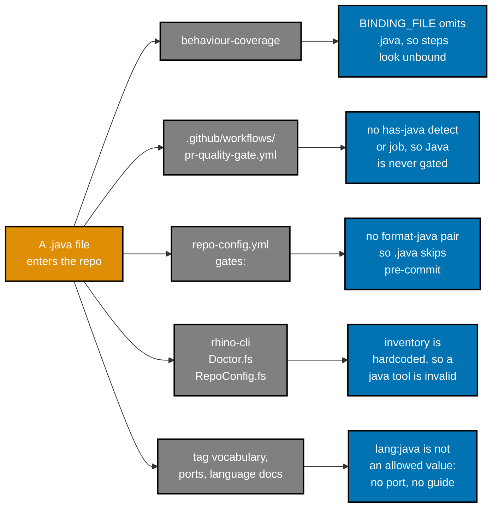
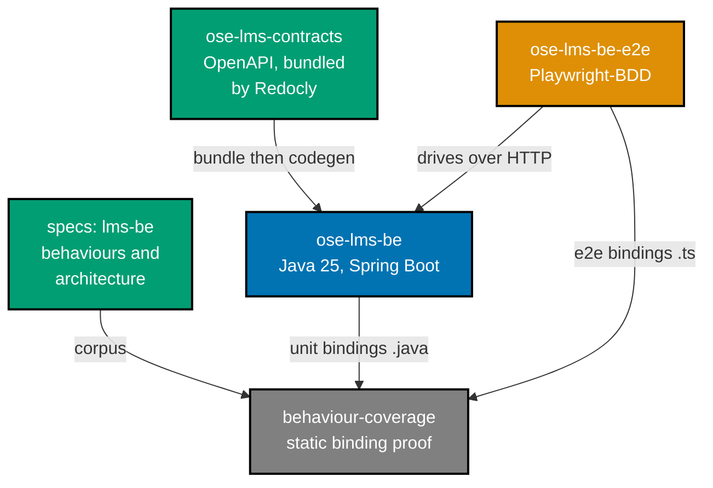
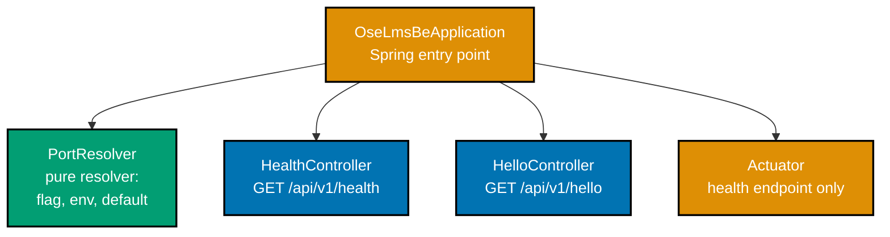
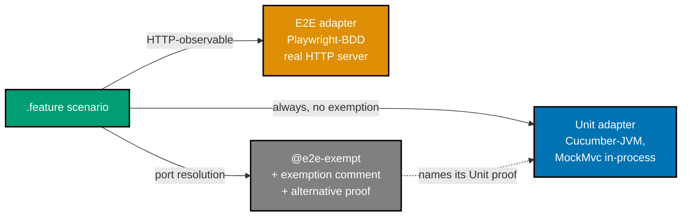
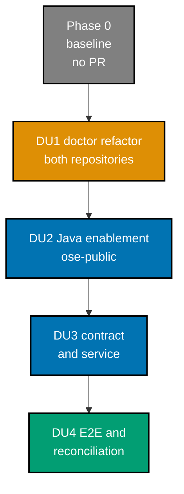

# Technical Design — OSE LMS Backend Initialization

This document is written for an engineer fresh from a bootcamp with no prior context on this
repository, on Java, or on Nx. It explains the current state first, then what changes and why, then
every alternative that was considered and rejected.

## 1. Current State

### 1.1 What a backend looks like here today

There are two backends, both F#/Giraffe on ASP.NET: `ose-be` and `organiclever-be`
[Repo-grounded: `apps/ose-be/project.json`, `docs/reference/web-sites.md`]. Each one is an **Nx
project**: a folder with a `project.json` that declares named commands, called _targets_, which Nx
runs and caches. A backend declares targets like `build`, `typecheck`, `lint`, `test:unit`, and a
composite `test:quick` that chains them.

Each backend's observable behaviour is written as Gherkin `.feature` files under `specs/`, and a
static validator proves every scenario step has exactly one test binding in every applicable test
layer. That validator is `scripts/behaviour-coverage.mjs`.

### 1.2 The five surfaces that assume a closed set of languages

Nothing in the repository is hostile to Java. Several things simply do not know it exists, and each
one fails quietly rather than loudly.



Concretely, verified in the current commit:

- `scripts/behaviour-coverage.mjs:20` reads
  `const BINDING_FILE = /\.(?:ts|tsx|fs)$/iu;`. Java step definitions are never opened, so every
  scenario would report `undefined Unit binding` [Repo-grounded].
- `.github/workflows/pr-quality-gate.yml` has a `detect` job emitting `has-ts`,
  `has-dotnet-projects`, `has-dart`, and `has-markdown`. Its per-tag `case` statement has no
  `lang:java` arm. The `typescript` job excludes `tag:lang:fsharp,tag:lang:csharp,tag:lang:rust,tag:lang:dart`
  — a Java project matches none of those exclusions, so it would be swept into the TypeScript job
  [Repo-grounded].
- `repo-config.yml` registers formatter mutation/verify pairs for Prettier, rustfmt, Fantomas, Ruff,
  gofmt, Elixir, CSharpier, Dart, shfmt, tofu, StyLua, clang-format, and buildifier. There is no
  Java pair [Repo-grounded].
- The doctor tool inventory is a hardcoded `string list` in **two** files —
  `apps/rhino-cli/src/RhinoCli.Application/src/Doctor.fs:779` and
  `.../RepoConfig.fs:172`. `RepoConfig.fs:1242` rejects any gate whose `doctor-tools:` names a tool
  outside that list. Both files appear in `apps/rhino-cli/parity-manifest.sha256`, which the nightly
  `rhino-cli-parity-audit.yml` diffs against `ose-public` `main` [Repo-grounded].

### 1.3 What already works in our favour

- `specs/` corpora are discovered by folder walk. `specs structure validate` takes no arguments and
  finds every directory under `specs/apps/`, so a new owner corpus needs no registration
  [Repo-grounded].
- `repo-config.yml` already has a `doctor:` section carrying `dotnet-global-json` and `skip-tools`,
  and `doctor.feature` already specifies "A repo-config-declared tool is skipped from the check".
  The config-to-doctor wiring exists; it only reads, never extends [Repo-grounded].
- Playwright-BDD E2E projects are TypeScript, so `ose-lms-be-e2e` needs no Java support at all.

## 2. Target Architecture

### 2.1 Projects and their relationships



Node labels are abbreviated to stay inside the 20-character-per-line render limit. In full: `SPEC`
is `specs/apps/ose/lms-be/`, `VAL` is `scripts/behaviour-coverage.mjs`, and the contract corpus
lives at `specs/apps/ose/lms-be/contracts/`.

### 2.2 Service internals

Four production classes, deliberately. Anything more is domain modelling this plan does not do.



`PortResolver` is a pure function with no Spring dependency. That is deliberate: it makes AC-PORT-01
through AC-PORT-03 provable in-process without starting a server, which is what keeps them inside
the Unit boundary the BDD standard defines.

### 2.3 Test layers and how a scenario is proven



There is **no Integration adapter**. The service owns no local resource boundary — no database, no
filesystem state, no child process. The BDD standard says to omit an inapplicable target and explain
the omission in the project README, and explicitly forbids adding an echo or no-op target for
symmetry [Repo-grounded].

### 2.4 Delivery-unit dependency order



The order is forced, not stylistic. DU2 declares `doctor-tools`-adjacent configuration that DU1's
refactor must accept first. DU3 creates `.java` files whose bindings only count once DU2 taught the
validator to read them. DU4's E2E project needs a service to drive.

## 3. Pinned Versions

Every version below carries a confidence label. `[Web-cited]` entries were verified on
**2026-09-07** at the URL shown. Phase 0 re-resolves each one before use rather than trusting this
document, because all of them move.

| Component                             | Version | Confidence      | Source                                                                                                                          |
| ------------------------------------- | ------- | --------------- | ------------------------------------------------------------------------------------------------------------------------------- |
| Java LTS                              | 25      | [Web-cited]     | <https://openjdk.org/projects/jdk/25/> — JDK 25 shipped Sept 2025 as the current LTS; JDK 29 is the next                        |
| Spring Boot                           | 4.1.1   | [Web-cited]     | <https://github.com/spring-projects/spring-boot/releases> — published 2026-08-20                                                |
| Gradle                                | 9.7.1   | [Web-cited]     | <https://github.com/gradle/gradle/releases> — published 2026-08-19; Java 25 daemon support landed in 9.1.0                      |
| Spotless Gradle plugin                | 8.10.2  | [Web-cited]     | <https://plugins.gradle.org/plugin/com.diffplug.spotless> — published 2026-09-04                                                |
| google-java-format                    | 1.36.1  | [Web-cited]     | <https://github.com/google/google-java-format/releases> — published 2026-07-30                                                  |
| Cucumber-JVM                          | 7.34.8  | [Web-cited]     | <https://github.com/cucumber/cucumber-jvm/releases> — published 2026-09-06                                                      |
| JaCoCo                                | 0.8.15  | [Web-cited]     | <https://github.com/jacoco/jacoco/releases> — published 2026-06-05; officially supports Java 26, so Java 25 bytecode is covered |
| OpenAPI Generator                     | 7.20.0  | [Repo-grounded] | `openapitools.json` `generator-cli.version`                                                                                     |
| `@openapitools/openapi-generator-cli` | 2.30.2  | [Repo-grounded] | `package.json`                                                                                                                  |

Spring Boot 4 baselines on Java 17 while providing first-class Java 25 support, and runs on Spring
Framework 7 with Jakarta EE 11 [Web-cited, accessed 2026-09-07]. Compiling at Java 25 is therefore a
choice this plan makes, not a framework requirement — see D-2.

## 4. Design Decisions

Each decision names what was chosen, what was rejected and why, and the observable signal that
should make someone revisit it.

### D-1 — Java and Spring Boot for a repository standardized on F#/Giraffe

**Chosen:** Java 25 + Spring Boot, as directed by the user.

**Rejected — F#/Giraffe, matching `ose-be`.** Costs nothing to enable: the CI job, formatter,
doctor entry, coverage extractor, and style guide all already exist. Rejected because the user
decided the LMS runs Java. This is recorded rather than argued: the decision is the user's to make,
and the cost of it is what §1.2 enumerates.

**Rejected — Kotlin on Spring Boot.** Would still need every surface in §1.2 taught a new language,
plus ktlint instead of google-java-format. No reduction in the governance tail, and it is not what
was asked for.

**Consequence:** the repository maintains two backend stacks. Dependency bumps, CVE response, and CI
maintenance for backends roughly double.

**Revisit when:** the LMS is cancelled or absorbed into `ose-be`, or a second Java project makes the
tail worth amortizing further.

### D-2 — Compile and run at Java 25 rather than the Spring Boot 17 baseline

**Chosen:** `java.toolchain.languageVersion = 25`.

**Rejected — target Java 17, Spring Boot's actual baseline.** Safer against tooling lag, but the
explicit instruction was "latest Java LTS", and pinning to 17 would make the repository's own
language documentation immediately inaccurate.

**Rejected — Java 26 (non-LTS, current at time of writing).** Loses LTS support windows and forces a
major bump within six months.

**Revisit when:** JDK 29 becomes the LTS in September 2027.

### D-3 — Gradle with the Kotlin DSL, not Maven

**Chosen:** Gradle 9.7.1 via the wrapper, `build.gradle.kts`, with `distributionSha256Sum` set.

**Rejected — Maven.** Fully viable; `mvnw` also supports checksum verification. Rejected because
Gradle's toolchain block, Spotless integration, and JaCoCo verification task are more compact, and
incremental builds behave better under repeated Nx target invocation.

**Rejected — Gradle with the Groovy DSL.** An untyped build script with no advantage over Kotlin DSL
for a greenfield project.

**Why the checksum matters:** the repository already pins its compute broker by checksum
(`hippo.lock`). A Gradle wrapper without `distributionSha256Sum` fetches a distribution over the
network with no integrity check, which would be the least-verified step in the whole build.

### D-4 — Config-driven doctor tool inventory, not a hardcoded `"java"` entry

**Chosen:** extend `repo-config.yml`'s existing `doctor:` section with an `extra-tools:` list.
`Doctor.fs` and `RepoConfig.fs` keep a built-in inventory and append the configured names to it.

**Rejected — add `"java"` to both hardcoded lists.** This is what every existing tool did, and it is
simpler. Rejected on the user's decision: it pays the two-repository parity cost once per language
forever, whereas the refactor pays it once in total.

**Rejected — no doctor entry at all, Gradle toolchain plus CI `setup-java` only.** Zero
`rhino-cli` change and zero the private sibling involvement. Rejected because `npm run doctor` would then
give no JDK signal, and a fresh clone would fail at build time with no diagnosis.

**Honest cost, stated plainly:** the refactor is still a two-repository change. Both F# files sit in
the parity manifest, and parity rule 4 holds both `repo-config.yml` key sets identical, so
the private sibling gains the same `doctor.extra-tools` key with an empty list. The saving is on every
_future_ language, not on this one.

**Revisit when:** a third consumer of `extra-tools` appears and the schema proves too narrow — for
example, a tool needing a version comparator the schema cannot express.

### D-5 — `doctor.extra-tools` schema shape

A configured tool must carry everything a built-in `ToolDef` carries: a name, a binary, a version
probe, a required version, and per-platform install commands.

```yaml
doctor:
  dotnet-global-json: apps/ose-be/global.json
  skip-tools: []
  extra-tools:
    - name: java
      binary: java
      version-args: ["-version"]
      version-stream: stderr # `java -version` writes to stderr, not stdout
      required-version: "25"
      install:
        brew: ["install", "--cask", "temurin@25"]
        apt: ["apt-get", "install", "-y", "temurin-25-jdk"]
```

`version-stream` exists because of a real trap: `java -version` writes its output to **stderr**. A
probe that reads stdout only sees an empty string and reports an installed JDK as missing. Every
existing built-in tool reads stdout, so this field is new capability, not configuration noise.

**Rejected — name-only entries, with probes still hardcoded.** Smaller schema, but then adding a
language still needs an F# edit, which defeats the entire purpose of D-4.

**Rejected — a free-form shell command per tool.** Maximum flexibility, but `repo-config.yml` would
start carrying arbitrary shell for the doctor to execute. The existing `gates:` entries do carry
commands, but they are declared as `kind: external` and run through a reviewed path; extending that
to the doctor's `--fix` path would widen what a config edit can execute.

### D-6 — Spotless plus google-java-format, wired through a wrapper script

**Chosen:** Spotless applies google-java-format inside Gradle. `scripts/format-java.sh` wraps
`./gradlew spotlessApply` / `spotlessCheck`, and `repo-config.yml` registers `format-java`
(mutation, pre-commit, `restages: true`) and `format-verify-java` (check, CI,
`ci-group: formatting-verify`).

**Rejected — the Nx `lint` target only, with no `repo-config.yml` gate.** Less machinery, and
`spotlessCheck` would still run in `test:quick` and therefore in PR CI. Rejected because `.java`
would then be the only source language escaping the pre-commit formatter pass.

**Rejected — Checkstyle.** Reports but cannot fix, so it cannot fill the `type: mutation` half of
the gate pair the registry expects.

**Precedent:** `scripts/format-elixir.sh` already wraps a build-tool-driven formatter behind the
same gate shape, including the `--check` flag convention [Repo-grounded].

### D-7 — Contract-first with models-only codegen

**Chosen:** `ose-lms-contracts` owns `openapi.yaml`; Redocly bundles it; OpenAPI Generator emits
**models only** into `apps/ose-lms-be/generated-contracts`; controllers are hand-written.

This mirrors `ose-be` exactly, which passes
`--global-property=models,modelDocs=false,apiDocs=false` [Repo-grounded]. The Java invocation adds
`useJakartaEe=true`, because Spring Boot 4 requires `jakarta.*` packages and the generator does not
default to them reliably [Web-cited, accessed 2026-09-07].

**Rejected — the full `spring` generator with delegate-pattern API interfaces.** A drifting path or
status code would fail at compile time, which is stronger. Rejected because OpenAPI Generator
7.20.0's Spring templates target Spring Boot 3, and validating the generated controller layer
against Spring Boot 4 is a research task disproportionate to two endpoints.

**Rejected — code-first with springdoc generating the YAML from controllers.** No generator
toolchain and no drift possible, but it inverts contract-first: the specification becomes an output.
`ose-be` is contract-first and consistency matters more than convenience here.

**Fallback, pre-authorized:** if models-only output does not compile against Spring Boot 4 (the risk
recorded in `prd.md`), replace the generated models with hand-authored Java records and add a test
asserting each record's JSON shape matches the bundled contract. Record the swap in `learnings.md`.

### D-8 — Actuator restricted to health

**Chosen:** `management.endpoints.web.exposure.include: health`, `show-details: never`, on the
default `/actuator` path and the default (application) port.

**Rejected — health plus info.** Useful for deploy verification, but exposing build metadata is a
security decision this plan should not make on the side.

**Rejected — a separate management port.** Correct for a real deployment. Rejected because there is
no deployment, and it would claim a second port in a registry for a service that is not deployed.

AC-ACT-02 exists precisely to prevent this decision from silently regressing: it asserts that a
non-exposed Actuator endpoint is not reachable.

### D-9 — `specs/apps/ose/lms-be/` rather than a new product family

**Chosen:** a fourth owner corpus inside the existing `ose` product tree.

**Rejected — `specs/apps/ose-lms/be/`.** Cleaner if the LMS grows several surfaces. Rejected because
the `ose` product directory already holds two distinct products across three owners, and the
convention groups by product family with one corpus per deployed surface. Adding a family for one
surface splits the OSE index for no reader benefit today.

**Revisit when:** an `ose-lms-web` or `ose-lms-app-web` owner appears, at which point promoting to
its own family is a folder move plus index edits.

### D-10 — Four style-guide documents, not sixteen

**Chosen:** `README.md`, `coding-standards.md`, `testing-standards.md`,
`error-handling-standards.md` under
`docs/explanation/software-engineering/programming-languages/java/`.

**Rejected — full parity with `c-sharp/` (18 files) and `typescript/` (25 files)**
[Repo-grounded: file counts verified]. Rejected because most of those documents describe code
patterns this plan does not write; documenting concurrency and DDD standards for a service with two
endpoints and no domain would be writing fiction.

**Rejected — no Java documentation.** The languages README states that all code in the languages
documented there MUST follow those standards; an active language with no guide leaves
`swe-code-checker` nothing to measure against.

**Revisit when:** the LMS gains real domain logic, at which point the missing domains are written
against code that exists.

## 5. File-Impact Analysis

`R-PUB:` denotes `ose-public`; `R-PRI:` denotes the private sibling. Both trees are root-relative to their
own repository.

```text
.
├── plans/in-progress/lms-init/
│   ├── README.md [N] — plan index and navigation
│   ├── brd.md [N] — business requirements
│   ├── prd.md [N] — product requirements and canonical Gherkin
│   ├── tech-docs.md [N] — this document
│   ├── delivery.md [N] — the execution checklist
│   ├── learnings.md [N] — Knowledge Capture running log
│   └── evidence/ [N] — curl output and gate-trigger proof captured during execution
├── plans/in-progress/README.md [E] — add this plan to the Active Plans list
│
├── apps/rhino-cli/                                    # DU1 — byte-identical in R-PUB and R-PRI
│   ├── src/RhinoCli.Application/src/Doctor.fs [E] — inventory reads config; extra-tool ToolDefs; stderr-capable version probe
│   ├── src/RhinoCli.Application/src/RepoConfig.fs [E] — DoctorSection.ExtraTools DTO + record; inventory-aware doctor-tools validation
│   ├── tests/**/Doctor*.fs [E] — discovered from the RhinoCli test project file; new cases for config-declared tools
│   └── parity-manifest.sha256 [G] — regenerated by `rhino-cli parity manifest` after the source edits
├── specs/apps/rhino/cli/behaviours/system/doctor.feature [E] — AC-DOCTOR-01, AC-DOCTOR-02 (both repos)
│
├── repo-config.yml [E] — DU1 `doctor.extra-tools` key (both repos, empty in R-PRI);
│                          DU2 `format-java` + `format-verify-java` gates and the `java` entry (R-PUB only)
│
├── scripts/                                           # DU2 — R-PUB only
│   ├── behaviour-coverage.mjs [E] — .java in BINDING_FILE; extractJavaBindings; Java feature references
│   ├── behaviour-coverage.test.mjs [E] — AC-COV-01..03 node:test cases
│   └── format-java.sh [N] — Spotless wrapper, `--check` flag, mirrors format-elixir.sh
│
├── .github/
│   ├── actions/setup-java/action.yml [N] — Temurin 25 + Gradle cache composite action
│   └── workflows/pr-quality-gate.yml [E] — has-java output, lang:java detect arm, Java job,
│                                            tag:lang:java added to the three existing job excludes,
│                                            java added to the quality-gate needs list
│
├── docs/
│   ├── explanation/software-engineering/programming-languages/
│   │   ├── README.md [E] — add Java to the pattern list, decision table, and platform guidance
│   │   └── java/
│   │       ├── README.md [N] — index plus the Rule-3 prerequisite statement
│   │       ├── coding-standards.md [N]
│   │       ├── testing-standards.md [N]
│   │       └── error-handling-standards.md [N]
│   └── reference/
│       ├── web-sites.md [E] — ose-lms-be row, port 8303, OSE_LMS_BE_PORT
│       ├── monorepo-structure.md [E] — ose-lms-be and ose-lms-be-e2e in Current Apps
│       └── platform-bindings.md [E] — only if the new agent changes a catalog claim
│
├── repo-governance/development/infra/nx-targets/
│   ├── tag-convention-four-dimension-scheme.md [E] — lang:java, platform:springboot allowed values
│   └── tag-convention-current-tags-and-examples.md [E] — the ose-lms-be tag set as a copyable example
│
├── .claude/
│   ├── agents/swe/swe-java-dev.md [N] — Java developer agent
│   ├── agents/swe/README.md [E] — annotated index entry
│   ├── skills/swe-programming-java/SKILL.md [N] — sources the four style-guide documents
│   └── skills/README.md [E] — annotated index entry
├── .opencode/agents/swe-java-dev.md [G] — emitted by `npm run generate:bindings`
├── .codex/agents/swe-java-dev.toml [G] — emitted by the same command
├── .codex/config.toml [G] — delimited agent region only
├── .agents/skills/swe-programming-java/SKILL.md [G] — mirrored skill
│
├── specs/apps/ose/
│   ├── README.md [E] — add the LMS BE owner to Contents
│   ├── overview.md [E] — add an OSE LMS product section
│   └── lms-be/                                        # DU3 + DU4
│       ├── README.md [N] — corpus index
│       ├── architecture.md [N] — as-built C4 context, containers, components
│       ├── contracts/
│       │   ├── README.md [N]
│       │   ├── project.json [N] — the ose-lms-contracts Nx project
│       │   ├── openapi.yaml [N]
│       │   ├── .spectral.yaml [N]
│       │   ├── paths/*.yaml [N] — one file per endpoint: health, hello
│       │   ├── schemas/*.yaml [N] — one file per response body: HealthResponse, HelloResponse
│       │   └── generated/ [G] — Redocly bundle output, gitignored like the ose-be sibling
│       └── behaviours/
│           ├── README.md [N] — corpus index with per-file scenario counts
│           ├── health/README.md [N]
│           ├── health/health.feature [N] — AC-HEALTH-01
│           ├── health/actuator.feature [N] — AC-ACT-01, AC-ACT-02
│           ├── hello/README.md [N]
│           ├── hello/hello.feature [N] — AC-HELLO-01
│           ├── config/README.md [N]
│           └── config/port-resolution.feature [N] — AC-PORT-01..03
│
├── apps/ose-lms-be/                                   # DU3
│   ├── project.json [N] — Nx targets and the four-dimension tag set; [E] at DU4 to add test:coverage:e2e
│   ├── behaviour-coverage.json [N] — unit adapter at DU3; [E] to add the e2e adapter at DU4
│   ├── build.gradle.kts [N]
│   ├── settings.gradle.kts [N]
│   ├── gradle.properties [N]
│   ├── gradle/wrapper/gradle-wrapper.properties [N] — with distributionSha256Sum
│   ├── gradlew [N] and gradlew.bat [N] — generated by `gradle wrapper`
│   ├── .gitignore [N] — build/, .gradle/, generated-contracts/
│   ├── .editorconfig [N]
│   ├── .env.example [N] — OSE_LMS_BE_PORT only
│   ├── LICENSE [N] — MIT, matching the ose-be sibling
│   ├── README.md [N] — corpus, adapters, target names, and why Integration is inapplicable
│   ├── src/main/java/com/oseplatform/lms/
│   │   ├── OseLmsBeApplication.java [N]
│   │   ├── config/PortResolver.java [N]
│   │   ├── health/HealthController.java [N]
│   │   └── hello/HelloController.java [N]
│   ├── src/main/resources/application.yaml [N] — Actuator exposure and server port binding
│   ├── src/test/java/com/oseplatform/lms/
│   │   ├── RunCucumberTest.java [N] — JUnit Platform suite entry point
│   │   ├── steps/CucumberSpringConfiguration.java [N] — @CucumberContextConfiguration
│   │   ├── steps/HttpSteps.java [N] — shared MockMvc request and assertion bindings
│   │   └── steps/PortResolutionSteps.java [N] — AC-PORT-01..03 bindings
│   └── generated-contracts/ [G] — OpenAPI model output, gitignored
│
├── apps/ose-lms-be-e2e/                               # DU4
│   ├── project.json [N]
│   ├── package.json [N]
│   ├── tsconfig.json [N]
│   ├── playwright.config.ts [N]
│   ├── behaviour-coverage.json [N]
│   ├── e2e-coverage-baseline.json [N]
│   ├── .gitignore [N]
│   ├── README.md [N]
│   ├── steps/backend-process.ts [N] — starts and stops the Gradle-built jar
│   ├── steps/http.steps.ts [N] — AC-HEALTH-01, AC-HELLO-01, AC-ACT-01, AC-ACT-02 bindings
│   └── utils/response-store.ts [N]
│
└── local-tmp/rules-propagation/ [G] — placement manifests, one per repository, gitignored
```

### More Detail

**Discovery before editing.** Three bounded families above are named by pattern rather than exact
path, and each is discovered the same way before any edit:

- `apps/rhino-cli/tests/**/Doctor*.fs` — enumerate from the `RhinoCli.UnitTests` project file's
  `Compile Include` list, not by guessing filenames.
- `specs/apps/ose/lms-be/contracts/paths/*.yaml` and `schemas/*.yaml` — exactly one file per
  endpoint and per response body listed in `openapi.yaml`; the bounded set is health and hello.
- `.opencode/`, `.codex/`, and `.agents/` entries — never hand-edited. They are emitted by
  `npm run generate:bindings` and must land in the same commit as their `.claude/` source.

**Ordering that is not obvious from the tree.** `repo-config.yml` is edited in both DU1 and DU2, for
different keys, in different repositories. DU1 adds `doctor.extra-tools` to _both_ repositories
(empty in the private sibling, satisfying the identical-key-set parity rule). DU2 adds the Java gate pair
and the populated `java` entry to `ose-public` only. Attempting DU2's entry before DU1's schema
change makes `rhino-cli repo-config validate` fail on an unknown key.

**Archival follow-up.** `apps/ose-lms-be/generated-contracts/` and
`specs/apps/ose/lms-be/contracts/generated/` are build outputs, gitignored to match their `ose-be`
siblings. They are regenerated, never protected, and never committed.

## 6. Dependencies

**Repository-internal.** `ose-lms-be` declares `implicitDependencies: ["ose-lms-contracts"]` and its
`codegen` target declares `dependsOn: ["ose-lms-contracts:bundle"]`, mirroring `ose-be`
[Repo-grounded]. `ose-lms-be-e2e` depends on `ose-lms-be`'s build output.

**External, new to the repository.** A JDK 25 distribution; Gradle 9.7.1 via wrapper; the Spring
Boot BOM; Spotless and google-java-format; Cucumber-JVM with `cucumber-spring` and
`cucumber-junit-platform-engine`; JaCoCo. All are resolved by Gradle from Maven Central except the
JDK, which the doctor now checks for.

**Dependency-bump policy.** New third-party dependencies land pinned to the exact versions in §3.
The repository's existing dependency-audit surface (`deps:audit`) gains a Java implementation via
Gradle's dependency verification report rather than an echo placeholder.

## 7. Verification Design

| Claim                                             | How it is proven                                                                                             |
| ------------------------------------------------- | ------------------------------------------------------------------------------------------------------------ |
| The service answers both endpoints correctly      | Cucumber Unit bindings via MockMvc, plus Playwright-BDD E2E against a started process                        |
| Every scenario is bound in every applicable layer | `ose-lms-be:test:coverage:behaviour` and the per-adapter validators, run inside `test:quick`                 |
| Java code is 99% line-covered                     | JaCoCo `jacocoTestCoverageVerification` at `LINE 0.99`, failing the `test:unit` target below it              |
| The validator genuinely reads `.java`             | `scripts/behaviour-coverage.test.mjs` AC-COV-01..03, run by `npm run test:validators`                        |
| The formatter gates fire on `.java`               | Gate-trigger proof in an isolated no-origin git fixture, confirming `Running gate format-java` in the output |
| CI routes Java correctly                          | A PR touching only `apps/ose-lms-be/**` shows the Java job running and the other three language jobs skipped |
| Cross-repository parity holds                     | `rhino-cli parity manifest validate` in both repositories, plus a manual `rhino-cli-parity-audit` dispatch   |
| The API behaves under adversarial input           | The rule-16 `api-exploratory-tester` retest against the running service before archival                      |

## 8. Rollback

Each delivery unit is independently revertible, in reverse order.

| Unit | Revert action                                                                     | What survives                                                             |
| ---- | --------------------------------------------------------------------------------- | ------------------------------------------------------------------------- |
| DU4  | Revert the merge commit; delete `apps/ose-lms-be-e2e/`                            | The service still builds and its Unit adapter still proves every scenario |
| DU3  | Revert the merge commit; delete `apps/ose-lms-be/` and the `lms-be` specs corpus  | Java enablement remains, harmlessly, with no Java project to act on       |
| DU2  | Revert the merge commit                                                           | The doctor refactor remains; `doctor.extra-tools` is simply unpopulated   |
| DU1  | Revert in **both** repositories, then regenerate `parity-manifest.sha256` in both | Nothing; this is the base of the stack                                    |

**The one asymmetric risk:** reverting DU1 in only one repository turns the nightly parity audit red
in the other. The revert step for DU1 is therefore paired across repositories in `delivery.md`, and
the manifest is regenerated in both before either PR closes.

No database, no migration, and no persisted state exists anywhere in this plan, so no rollback needs
a data step.

## 9. Related

- [`prd.md`](./prd.md) — the acceptance criteria this design satisfies
- [`delivery.md`](./delivery.md) — the ordered execution of this design
- [BDD standard](../../../repo-governance/development/behaviour-driven-development.md) — adapters,
  boundaries, and exemptions
- [Nx Target Standards](../../../repo-governance/development/infra/nx-targets.md) — the target
  contract every project in §5 must satisfy
- [Cross-Repo rhino-cli Byte-Identity Standard](../../../repo-governance/development/infra/nx-targets/cache-cross-repo-byte-identity.md)
  — the four rules DU1 operates under
