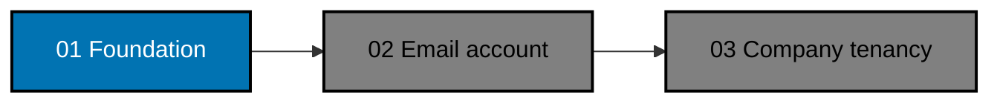

# OSE ID Init 01 — Local Foundation

> **Status:** In Progress — first delivery in the OSE ID initialization chain. The lifecycle move to
> `plans/in-progress/ose-id-init-01-foundation/` has landed; execution starts at Phase 0.

Create the smallest safe OSE ID platform foundation: four registered Nx projects, an ASP.NET Core
backend, a Next.js web shell, PostgreSQL schema ownership, health/readiness contracts, and one
deterministic local runner. This slice deliberately exposes no account, sign-in, OIDC, company, or
product authorization behavior.

## Position in the Delivery Chain

The dependency is contractual. Plans 02 and 03 must observe the delivered project names, ports,
runtime guard, database ownership, health model, and local-runner interface instead of recreating them.

## Scope

- Create `ose-id-be`, `ose-id-be-e2e`, `ose-id-web`, and `ose-id-web-e2e` as standard Nx projects.
- Target ASP.NET Core 10 and C# 14 for the backend; use the repository's current Next.js/TypeScript
  conventions for the web shell.
- Establish a pragmatic hexagonal/DDD backend dependency boundary: Domain and Application remain
  transport-neutral; the Plan 01 REST health adapter and Plan 04 OIDC adapter enter through inbound
  ports, while persistence and providers are outbound adapters.
  Preserve an explicitly tested seam for separately planned GraphQL or Model Context Protocol adapters.
- Establish that OSE-authored source and documentation inherit the repository root MIT license; verify
  and preserve each third-party component's own license and notice obligations before merge.
- Add PostgreSQL, forward-only migrations, least-privilege application/migration roles, and a schema
  ownership boundary without account or company tables.
- Establish SqlKata plus `SqlKata.Execution`/Npgsql as the OSE-owned runtime data-access path: explicit
  projections and parameter binding, with no EF change tracking, LINQ-to-entities, or generic repository.
  EF remains migration-time tooling only; Plan 04 implements OpenIddict custom stores over the same
  query-builder/Npgsql boundary so protocol records obey the universal audit and soft-delete contract.
- Expose distinct liveness, readiness, and startup diagnostics. Readiness depends on PostgreSQL and
  migration compatibility; liveness does not.
- Keep backend and web process instances stateless: no correctness state in process memory or local disk.
- Supply a readiness-driven, collision-safe, fully cleaned local stack runner and backend E2E harness.
- Reserve local defaults consistently: `http://127.0.0.1:3500` (`OSE_ID_WEB_PORT=3500`),
  `http://127.0.0.1:8501` (`OSE_ID_BE_PORT=8501`), and PostgreSQL `127.0.0.1:5438`
  (`OSE_ID_POSTGRES_PORT=5438`).
- Reject non-local runtime modes because production deployment, secrets, networking, HA, and Kubernetes
  integration belong to a later plan blocked at minimum on the private sibling
  `plans/backlog/start-infra-04-deploy-tencent-lighthouse-k3s-cluster` plus then-current platform handoff gates.

## Non-Goals

- Registration, email delivery, password credentials, login, recovery, sessions, OIDC/OAuth, tokens,
  Google, passkeys, TOTP, companies, memberships, invitations, entitlements, RLS tenant policies, or admin UI.
- Production deployment, Kubernetes manifests, domains, TLS, cloud PostgreSQL, production key custody,
  observability backends, or CI/CD promotion.
- GraphQL schemas/resolvers/runtime and Model Context Protocol servers/tools/resources/prompts. The
  architecture permits later adapters, but Init 01–09 do not deliver or register them.
- An identity-vendor dependency or an operational claim that MIT licensing makes hosting free.
- Editing the LMS integration plan or any later OSE ID slice.

## Resulting Main State

The merged state is safe and inert. It builds and runs locally, reports health, owns an empty
versioned database schema, and fails closed when configured as staging or production. No endpoint can
create a principal or authorize a product.

## Navigation

- [Business requirements](brd.md)
- [Product requirements](prd.md)
- [Technical design](tech-docs/README.md)
- [Execution checklist](delivery.md)
- [Execution learnings](learnings.md)
- [Next plan: local email account](../../backlog/ose-id-init-02-local-email-account/README.md)
