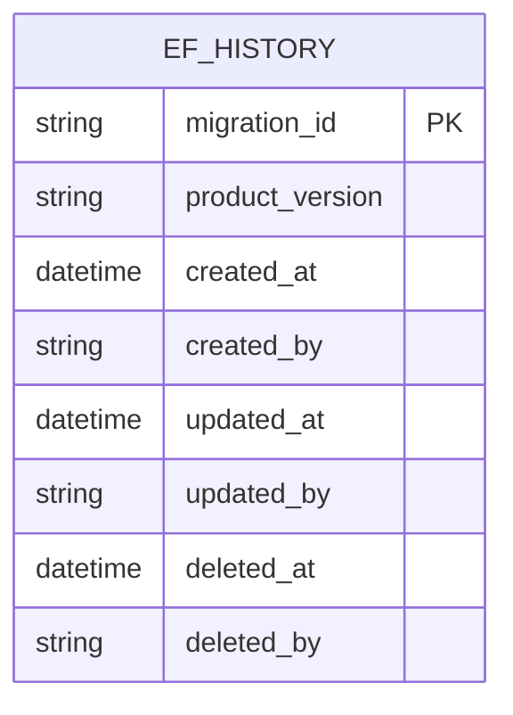
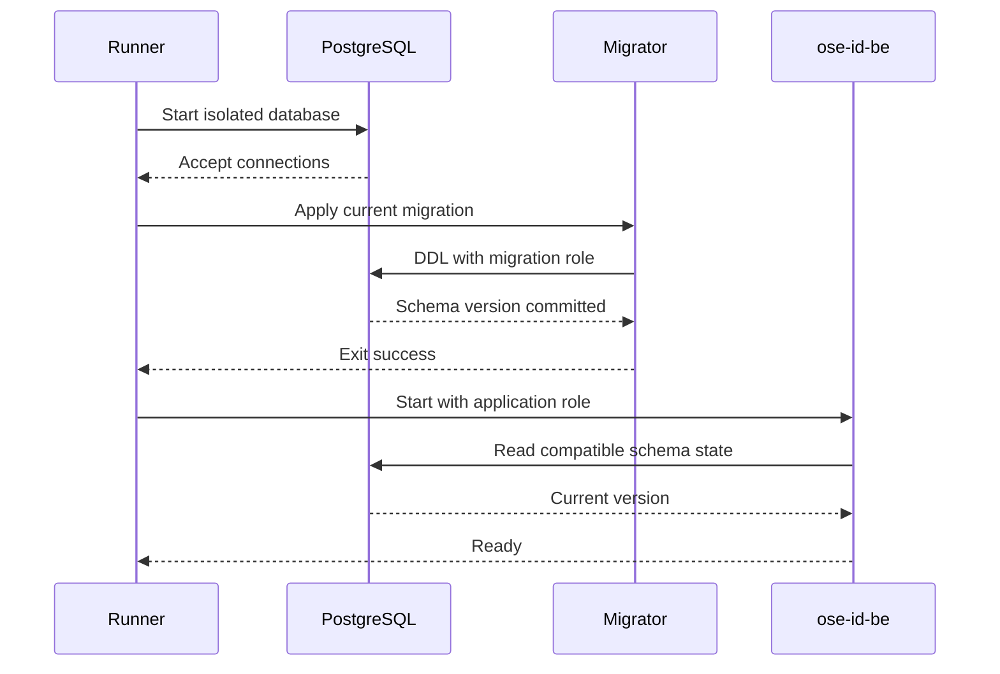

# Runtime, Persistence, and Statelessness

## Meaning of Stateless

The backend and web **process instances** are stateless. The identity system will be stateful. A process
may cache immutable configuration or public metadata, but restarting it cannot lose, invent, or change a
security result. Correctness-critical data belongs in shared durable storage or a later explicit shared
provider.

In this foundation, PostgreSQL stores only migration history in EF Core's conventional history table.
The table is extended with the universal six-column audit envelope and hard-delete guard defined in
[Database audit and soft-delete contract](007-database-audit-and-soft-delete-contract.md). The table and
EF migration assembly are migration-time tooling, not authorization for EF runtime ORM access. Later
slices add people, credentials, sessions, companies, grants, and OpenIddict records through the runtime
SqlKata/Npgsql contract below without changing the instance contract.

## Forbidden Instance State

- Mutable dictionaries that decide readiness or future authentication.
- Local-disk database, keys, sessions, uploads, migration locks, or Data Protection rings.
- A callback or request that must return to the instance where it started.
- Sticky routing as a correctness dependency.
- Security decisions based only on a process cache.
- Background initialization whose result is neither shared nor observable.

## Persistence Roles

| Role                     | Capability                                                             | Prohibited capability            |
| ------------------------ | ---------------------------------------------------------------------- | -------------------------------- |
| Database owner/bootstrap | Create database and roles in owned E2E environment                     | Used by application process      |
| Migration role           | Apply/revert-free forward migrations and manage owned schema           | Handle HTTP/runtime traffic      |
| Application role         | Connect, read schema version, and later execute explicitly granted DML | DDL, role changes, policy bypass |

Runtime configuration supplies only the application role to the backend. The migration command is an
explicit runner stage with separate credentials. Evidence redacts all connection strings/passwords.

## Runtime SQL Contract

OSE-owned tables use SqlKata `Query` objects compiled with `PostgresCompiler` and executed through
`SqlKata.Execution` after `NpgsqlDataSource.OpenConnectionAsync()` returns the Npgsql connection used
by the operation's `QueryFactory` and explicit transaction. Each use-case-shaped adapter must:

- name every selected column and map it to an explicit immutable projection; `SELECT *`, EF change
  tracking, LINQ-to-entities, `DbContext`, EF Identity stores, and `UserManager` persistence are forbidden;
- take table/column/order identifiers only from closed code-owned allowlists and bind every external value
  as a parameter; a request value is never interpolated as SQL or used as an identifier;
- propagate the application cancellation token and use a finite five-second runtime command timeout;
  migration commands use a separately configured maximum of 60 seconds;
- keep all reads, writes, audit inserts, and later tenant `SET LOCAL` statements for one use case on the
  same explicit Npgsql connection and transaction; the application use case owns commit/rollback;
- translate PostgreSQL uniqueness/concurrency results to typed application outcomes and never infer an
  invariant solely from an optimistic pre-query.

The foundation readiness lookup is a point/set compatibility query with explicit history columns. Its
contract test snapshots normalized compiled SQL plus parameter names/types, forbids wildcard projection,
executes against real PostgreSQL, and proves the runtime role reads only the history table. It carries
no `ORDER BY`: the caller compares the result against the compiled compatible set by membership, never
by position, so an ordering would buy nothing but an extra sort on every read.

A synthetic database with 10,000 synthetic history rows records `EXPLAIN (ANALYZE, BUFFERS, FORMAT
JSON)` for this read-only query. Measured evidence corrects an earlier draft of this contract: with the
table's only index being `PK___EFMigrationsHistory` (on `MigrationId`, unrelated to the `deleted_at`
filter this query applies) and the table itself only a few hundred KiB even at 10,000 rows, PostgreSQL's
planner correctly and consistently chooses a sequential scan over an index scan — walking the index
would touch as many pages while adding random access, so the planner is right to prefer it, and adding
an index over `deleted_at` to change that would violate the "primary key is the only index" contract
above. The provable, checked property is therefore not the scan node's name but its cost: the query
returns no more rows than the compiled compatible-set size, and its buffer/timing profile stays bounded
and small (double-digit millisecond-scale planning, sub-millisecond execution, low-hundreds of shared
buffer hits) at 10,000 synthetic rows — a size this table, which records one row per migration ever
authored, will not approach in the plan family's lifetime. Later plans add a query manifest with an
exact result/fetch bound per operation (point query: at most one row; page query: API limit plus one
cursor sentinel, never an unbounded materialization). Use `EXPLAIN` without `ANALYZE` for mutations
unless the operation is safely contained in an always-rolled-back transaction.

## Physical Schema Contract

### Old schema before this plan

No `ose_id` PostgreSQL schema, OSE ID table, database role, migration, or persistent row exists. Phase 0
must prove absence on both a fresh database and the repository's clean local stack. If an OSE ID schema
already exists, stop and reconcile ownership rather than adopting or dropping it.

### New schema after this plan

Create login roles `ose_id_migrator` and `ose_id_app` as `NOSUPERUSER NOCREATEDB NOCREATEROLE
NOINHERIT NOBYPASSRLS`; secret credentials exist only in local runtime configuration. Create schema
`ose_id`, owned by `ose_id_migrator`. The `ose_id_app` role receives `USAGE` on the schema
and `SELECT` on the migration-history table only. It owns no schema/table/sequence and has no DDL,
`BYPASSRLS`, role-management, or default public-schema create privilege.

The solitary entity is intentional: this slice establishes migration compatibility without inventing
placeholder identity rows or a relationship that later plans would need to undo.

| Table / column                                | PostgreSQL type            | Null / default                       | Key, check, index, and lifecycle                                                                                      |
| --------------------------------------------- | -------------------------- | ------------------------------------ | --------------------------------------------------------------------------------------------------------------------- |
| `ose_id.__EFMigrationsHistory.MigrationId`    | `character varying(150)`   | `NOT NULL`; no default               | Primary key `PK___EFMigrationsHistory`; immutable migration identifier; migration role writes, application role reads |
| `ose_id.__EFMigrationsHistory.ProductVersion` | `character varying(32)`    | `NOT NULL`; no default               | Records the EF Core version that authored the migration; append-only with its row                                     |
| `created_at`                                  | `timestamp with time zone` | `NOT NULL DEFAULT CURRENT_TIMESTAMP` | Immutable creation instant                                                                                            |
| `created_by`                                  | `character varying(255)`   | `NOT NULL DEFAULT 'system'`          | Immutable migration actor                                                                                             |
| `updated_at`                                  | `timestamp with time zone` | `NOT NULL DEFAULT CURRENT_TIMESTAMP` | Equals creation for append-only history                                                                               |
| `updated_by`                                  | `character varying(255)`   | `NOT NULL DEFAULT 'system'`          | Equals creator for append-only history                                                                                |
| `deleted_at`                                  | `timestamp with time zone` | nullable; no default                 | Remains null; migration history is never removed                                                                      |
| `deleted_by`                                  | `character varying(255)`   | nullable; no default                 | Null exactly with `deleted_at`                                                                                        |

The table owner is exactly `ose_id_migrator`. Constraints `PK___EFMigrationsHistory`,
`ck_ef_migrations_history_soft_delete_pair`, `ck_ef_migrations_history_update_time`, and
`ck_ef_migrations_history_delete_time` are present, plus the named hard-delete guard trigger from the
universal contract. The primary key is the only index. `PUBLIC` has no privilege on schema `ose_id` or the table. `ose_id_app` has exactly
`USAGE` on the schema and `SELECT` on the table; it has no `INSERT`, `UPDATE`, `DELETE`, `TRUNCATE`,
`REFERENCES`, `TRIGGER`, `CREATE`, or ownership privilege. There are no sequences because both columns
are supplied strings.

The quoted `MigrationId`/`ProductVersion` names intentionally match EF Core's migration-history
contract; the lowercase audit columns are additive fields with safe defaults, so EF's two-column insert
remains compatible. No placeholder domain table is created. Readiness compares the applied immutable
active `MigrationId` set (`deleted_at IS NULL`) with the application's compiled compatible set; it does
not update a readiness row.

### Physical migration artifacts

- New generated migration pair under
  `apps/ose-id-be/src/OseId.Infrastructure/Persistence/Migrations/*_CreateIdentityFoundation.cs` and
  `*_CreateIdentityFoundation.Designer.cs`, plus the exact sibling model snapshot selected by the
  delivered C# project convention.
- The initial migration alters the already-created history table before EF records the migration: add
  all six audit fields, checks, and hard-delete guard. E2E proves the subsequent EF history insert omits
  those fields safely and receives the documented defaults.
- EF Core is invoked only by the explicit migration stage to generate/apply schema evolution. Serving
  code does not register a runtime `DbContext`; migration-time EF is not the runtime ORM.
- Migration SQL/role bootstrap owned by `apps/ose-id-be-e2e/` under its delivered database fixture
  directory; runtime source never contains bootstrap or migration credentials.
- No backfill: the old state has no OSE ID table or row. The executor records `0` domain rows before and
  after and exactly one applied migration-history row after first migration.

### Expand, verify, contract, and compatibility

1. **Expand:** create the schema and migration-history table through the migration role; grant only the
   explicit application read privilege.
2. **Verify:** compare catalog schema/table/column/type/null/default/PK/index/trigger/owner/grant facts
   with the table above; apply the migration twice; test forbidden application-role DDL and a physical
   delete attempted by the migration test fixture.
3. **Contract:** none in this plan because no old OSE ID object exists. Do not add a destructive cleanup migration.
4. **Old code/new schema:** pre-OSE-ID repository code does not connect to `ose_id`; the additive schema
   is therefore compatible and may remain on rollback.
5. **New code/old schema:** readiness returns `schema_incompatible` and account/identity routes remain
   absent; the runner must migrate before admitting the backend.
6. **No-loss proof:** store before/after catalog manifests and stable digests/counts in evidence; no
   domain data is inserted, transformed, or deleted.
7. **Rollback/forward-fix:** revert code and leave the additive schema/history intact. Repair any schema,
   ownership, or grant defect with a new forward migration; never edit an applied migration or drop an
   unknown object/data to make rollback pass.

## Migration Contract

- Migrations are forward-only in shared history. Rollback restores code only when the retained schema is
  backward compatible; otherwise a forward repair migration is required.
- The app never auto-migrates on ordinary startup. This avoids races and privilege escalation when
  multiple instances start.
- A database newer or older than the compatible range makes readiness fail with a stable code.
- E2E applies migrations to empty and already-current databases twice to prove idempotent orchestration.

## Configuration

Configuration sources follow existing repository precedence. `.env.example` contains names and safe
placeholders only. Required values include runtime mode, listener, PostgreSQL application connection,
public backend URL `http://127.0.0.1:8501` for the web shell, the fixed web/backend/PostgreSQL port names
and values in the local-stack contract, and scoped run identifiers. Migration credentials are passed
only to migration/E2E processes.

Validate at startup:

- URLs are absolute loopback origins in Local/Test;
- production-like origins/modes are rejected;
- connection values are present but never logged;
- `OSE_ID_WEB_PORT=3500`, `OSE_ID_BE_PORT=8501`, and `OSE_ID_POSTGRES_PORT=5438` match the registered
  local defaults; any collision fails before resource creation;
- unknown configuration does not silently choose an insecure default.

## Multi-Instance Proof

A deterministic local reverse proxy or test dispatcher alternates requests between backend A and B.
Both use the same application role/database and report the same schema state. The test stops A, confirms
B remains ready, restarts A, and confirms no initialization side effect or local state divergence.

This is an architectural proof, not a production load-balancer plan. Kubernetes probes, replicas,
autoscaling, disruption budgets, managed database HA, and rolling-key behavior are deferred.

## Failure and Recovery

| Failure                  | Required observation                                        | Recovery                                                 |
| ------------------------ | ----------------------------------------------------------- | -------------------------------------------------------- |
| PostgreSQL not started   | Backend liveness available; readiness database-unavailable  | Start owned DB; readiness becomes ready                  |
| Migration command fails  | Backend is not started by runner; earliest failure retained | Fix migration/config, rebuild fresh DB                   |
| Schema incompatible      | Readiness schema-incompatible; no work admitted             | Apply forward migration or compatible code               |
| Application role has DDL | E2E must fail the plan gate                                 | Revoke privilege and rerun fresh privilege audit         |
| Non-local mode           | Process exits before serving                                | Use Local/Test only; production plan removes guard later |

## Security Consequences

Privilege separation and explicit migrations add setup complexity. That cost is accepted because later
RLS and credential tables cannot be safe if the runtime role can alter policies or schema. Stateless
instances add database dependency and transaction design work, but avoid affinity and hidden state.
