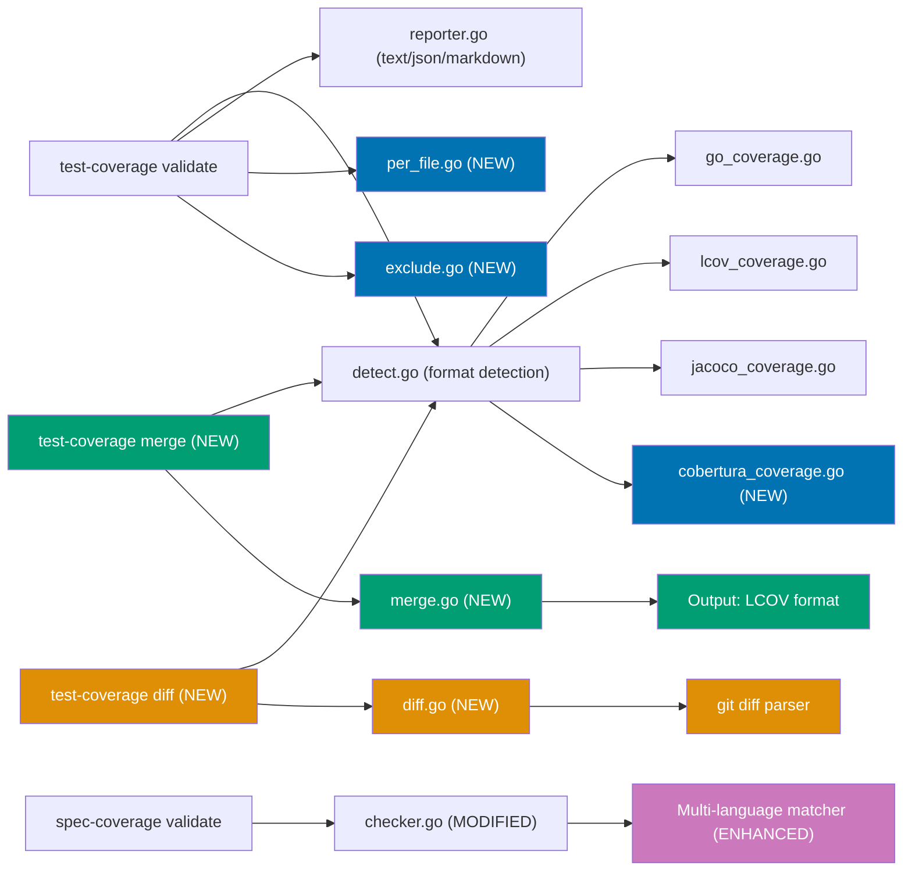

# Technical Documentation

## Architecture Overview

All changes extend the existing rhino-cli architecture without breaking backward compatibility.
New features follow the established patterns: cmd/ for CLI parsing, internal/ for logic,
dependency injection for testability.



## Design Decisions

### D1: Cobertura XML Parser

**Approach**: XML struct parsing using `encoding/xml` (same as JaCoCo parser).

**Format Detection Priority Update** (`detect.go`):

```
1. Filename-based:
   - .info → LCOV
   - .xml + "jacoco" → JaCoCo
   - .xml + "cobertura" → Cobertura
   - "lcov" in name → LCOV
   - "jacoco" in name → JaCoCo
   - "cobertura" in name → Cobertura

2. Content-based (read first ~10 lines to find root element):
   - "mode:" on first line → Go
   - "SF:" or "TN:" on first line → LCOV
   - XML with <report> root element → JaCoCo
   - XML with <coverage> root element → Cobertura   ← NEW LOGIC
   - Note: both JaCoCo and Cobertura start with "<?xml", so we must
     scan past the declaration to find the root element name

3. Fallback: Go
```

**Key distinction from JaCoCo**: Cobertura uses `<coverage>` root element with `line-rate`
attribute; JaCoCo uses `<report>` root element. Content-based detection reads the first few
lines to find the root element name.

**Kover compatibility note**: Kotlin's Kover outputs `report.xml` (no "jacoco" in filename).
Filename-based detection misses it, so it falls through to content-based detection which
correctly identifies `<report>` root as JaCoCo. The Cobertura addition must NOT break this --
ensure `<report>` → JaCoCo is checked before `<coverage>` → Cobertura in the content scan.

**XML struct mapping**:

```go
type CoberturaReport struct {
    XMLName  xml.Name          `xml:"coverage"`
    Packages []CoberturaPackage `xml:"packages>package"`
}

type CoberturaPackage struct {
    Name    string            `xml:"name,attr"`
    Classes []CoberturaClass  `xml:"classes>class"`
}

type CoberturaClass struct {
    Name     string          `xml:"name,attr"`
    Filename string          `xml:"filename,attr"`
    Lines    []CoberturaLine `xml:"lines>line"`
}

type CoberturaLine struct {
    Number            int    `xml:"number,attr"`
    Hits              int    `xml:"hits,attr"`
    Branch            bool   `xml:"branch,attr"`
    ConditionCoverage string `xml:"condition-coverage,attr"`
}
```

**Branch classification**: Parse `condition-coverage` attribute (format: `"50% (1/2)"`) to
determine partial vs covered status. If `branch="true"` and coverage < 100%, classify as partial.

### D2: Per-File Reporting

**Implementation**: Add file-level aggregation to existing `Result` type.

**New types**:

```go
type FileResult struct {
    Path    string  `json:"path"`
    Covered int     `json:"covered"`
    Partial int     `json:"partial"`
    Missed  int     `json:"missed"`
    Total   int     `json:"total"`
    Pct     float64 `json:"pct"`
}

// Extended Result (backward compatible - Files is omitted when nil)
type Result struct {
    // ... existing fields ...
    Files []FileResult `json:"files,omitempty"`
}
```

**Approach**: Each parser already processes coverage per-file internally. Surface this data in the
result when `--per-file` is requested. The parsers need minimal changes -- they already group by
file, just need to return the intermediate per-file data.

**Sorting**: Files sorted ascending by coverage percentage (worst first) to draw attention to
weakest files.

**`--below-threshold` flag**: When combined with `--per-file`, filter output to show only files
below the specified threshold.

### D3: Coverage Merging

**New command**: `test-coverage merge [flags] <file1> <file2> [file3...]`

**Flags**:

- `--out-file <path>`: Output file path (LCOV format). If omitted, print summary only.
- `--validate <threshold>`: Optionally validate merged coverage against threshold.
- `--exclude <pattern>`: Exclude files matching glob (repeatable).
- `-o, --output <format>`: Uses global output format flag (text/json/markdown) for summary display.

**Internal representation** for merging:

```go
// Normalized per-line coverage data (format-agnostic)
type LineCoverage struct {
    HitCount int
    Branches []BranchCoverage
}

type BranchCoverage struct {
    BlockID  int
    BranchID int
    HitCount int
}

// Map: filepath → line_number → LineCoverage
type CoverageMap map[string]map[int]LineCoverage
```

**Merge algorithm**:

1. Parse each input file into `CoverageMap`
2. For each file+line pair that appears in multiple inputs: `max(hit_count_a, hit_count_b)`
3. For branch data: union by (blockID, branchID), take max hit count per branch
4. Write merged result as LCOV (most universal output format)

**Why LCOV output**: LCOV is the most portable format and can be consumed by virtually every
coverage tool and CI platform. Other formats lose information (Go cover.out has no branch data)
or are more complex to generate (JaCoCo XML requires class/method structure).

### D4: Diff Coverage

**New command**: `test-coverage diff <coverage-file> [flags]`

**Flags**:

- `--base <ref>`: Git ref to diff against (default: `main`)
- `--threshold <pct>`: Fail if diff coverage below threshold
- `--staged`: Diff staged changes instead of branch diff
- `--per-file`: Show per-file diff coverage breakdown
- `--exclude <pattern>`: Exclude files matching glob
- `-o, --output <format>`: Output format

**Implementation approach**:

1. Run `git diff --unified=0 <base>...HEAD` (or `git diff --staged --unified=0`)
2. Parse diff hunks to extract changed line numbers per file
3. Cross-reference with coverage data to classify each changed line as covered/partial/missed
4. Calculate diff coverage using Codecov algorithm: `covered / (covered + partial + missed)`
   (same 3-state formula as `test-coverage validate` — partial lines count as NOT covered)

**Git diff parsing**: Parse unified diff output to extract file paths and line ranges from
`@@ -a,b +c,d @@` hunk headers. Only count added/modified lines (+ lines), not deleted lines.

**Edge cases**:

- Renamed files: Match by new filename
- Binary files: Skip (no coverage data)
- Files not in coverage report: Count as 0% coverage for those changed lines
- No changed lines: Exit 0 with "No changed lines to evaluate"

### D5: File Exclusion

**Flag**: `--exclude <glob>` (repeatable) on `validate`, `merge`, and `diff` commands.

**Implementation**: Apply `filepath.Match` after parsing coverage data, before aggregation.
Filter out files whose path matches any exclude pattern.

**Pattern matching**: Use Go's `filepath.Match` which supports `*`, `?`, and `[...]` patterns.
Note: `filepath.Match` does not support `**` recursive matching. For v0.13.0, limit to
single-segment globs. Recursive `**` support can be added later via `doublestar` library
if needed.

**Application order**: Exclusion is applied post-parse, pre-aggregate. This means:

1. Parse full coverage file
2. Filter out excluded files
3. Aggregate remaining files for percentage calculation
4. Report only non-excluded files in per-file output

### D6: spec-coverage Multi-Language and Multi-Project Support

Four layers must be addressed: shared-steps mode, file matching, scenario extraction, and step
extraction.

#### Layer 0: Shared Steps Mode (`--shared-steps`)

**Problem**: E2E projects (demo-be-e2e, demo-fe-e2e) use playwright-bdd where step files are
shared across features (e.g., `common.steps.ts` handles steps from 14 features). The current
`findMatchingTestFile` assumes 1:1 feature→test file mapping, which fundamentally doesn't work.

**Solution**: Add `--shared-steps` flag that changes the validation mode:

```go
// Default mode (existing): 1:1 file matching + scenario + step validation
// Shared-steps mode: skip file matching, validate steps across ALL files

func CheckAll(opts ScanOptions) (*CheckResult, error) {
    if opts.SharedSteps {
        return checkSharedSteps(opts) // NEW: step-only validation
    }
    return checkOneToOne(opts)        // existing behavior
}

func checkSharedSteps(opts ScanOptions) (*CheckResult, error) {
    // 1. Walk all features, collect all step texts
    // 2. Walk all source files in app-dir, extract all step definitions
    // 3. For each feature step, check if ANY step definition matches
    // 4. Report gaps for unmatched steps (not files)
}
```

**When to use**:

- `--shared-steps`: demo-be-e2e, demo-fe-e2e (playwright-bdd), any project with shared step files
- Default (no flag): demo-be-\* backends (unit tests with 1:1 file mapping), CLI apps

**playwright-bdd note**: Uses `const { Given, When, Then } = createBdd()` — the extracted
`Given("text", fn)` syntax is identical to Cucumber.js. The existing TS/JS step regex already
handles this. No new regex needed for playwright-bdd.

**Dart note**: Uses `bdd_widget_test` or custom BDD patterns with lowercase `given("text", fn)`.
Need a Dart-specific regex for lowercase step keywords.

#### Layer 1: File Matching (`findMatchingTestFile`)

**Current logic** (actual code from `checker.go:204`):

```go
// ACTUAL current code — only matches stem+"." prefix, NOT stem+"_"
if strings.HasPrefix(base, stem+".") || strings.HasPrefix(base, underscoreStem+".") ||
   base == stem || base == underscoreStem {
```

This misses `health_check_steps_test.go` (underscore separator) and `HealthCheckSteps.java`
(PascalCase). The fix adds underscore-prefix matching, PascalCase matching, and `test_` prefix.

```go
func matchesStem(base, stem string) bool {
    snake := strings.ReplaceAll(stem, "-", "_")
    pascal := toPascalCase(stem)
    testSnake := "test_" + snake  // Python convention

    // Check all prefix patterns (dot, underscore, exact)
    for _, prefix := range []string{
        stem + ".", stem + "_",           // kebab: health-check. / health-check_
        snake + ".", snake + "_",         // snake: health_check. / health_check_
        pascal,                            // PascalCase: HealthCheck (prefix)
        testSnake + ".", testSnake + "_", // Python: test_health_check. / test_health_check_
    } {
        if strings.HasPrefix(base, prefix) {
            return true
        }
    }
    return base == stem || base == snake
}
```

#### Layer 2: Test File Recognition

Extend the extension-based test file filter for new languages:

| Extension           | Test File Indicator                                                                 |
| ------------------- | ----------------------------------------------------------------------------------- |
| `.go`               | Must end in `_test.go` (existing)                                                   |
| `.ts/.tsx/.js/.jsx` | Must contain `.test.`, `.spec.`, `.steps.`, `.integration.`, or `_test.` (existing) |
| `.java`             | Must be in `test/` or `tests/` ancestor directory                                   |
| `.kt`               | Must be in `test/` or `tests/` ancestor directory                                   |
| `.py`               | Must start with `test_` OR end with `_test.py` OR be in `tests/` directory          |
| `.exs`              | Must end in `_test.exs` or `_steps.exs`                                             |
| `.rs`               | Must end in `_test.rs` or be in `tests/` directory                                  |
| `.fs`               | Must be in `Tests` project directory                                                |
| `.cs`               | Must be in `Tests` project directory or end in `Steps.cs`/`Tests.cs`                |
| `.clj`              | Must end in `_test.clj` or `_steps.clj`                                             |
| `.dart`             | Must end in `_test.dart` or be in `test/` directory                                 |

#### Layer 3: Step Extraction (`extractAllStepTexts`)

**New regex patterns** for each language:

```go
// Java/Kotlin: @Given("text") @When("text") @Then("text") @And("text") @But("text")
jvmStepRe = regexp.MustCompile(`@(?:Given|When|Then|And|But)\s*\(\s*"((?:[^"\\]|\\.)*)"\s*\)`)

// Python: @given("text") @when("text") @then("text")
pyStepRe = regexp.MustCompile(`@(?:given|when|then|step)\s*\(\s*"((?:[^"\\]|\\.)*)"\s*\)`)

// Elixir: defgiven ~r/^text$/ or defwhen ~r/^text$/ or defthen ~r/^text$/
exStepRe = regexp.MustCompile(`def(?:given|when|then|and_|but_)\s+~r/\^?(.*?)\$?/`)

// Rust: #[given("text")] #[when("text")] #[then("text")]
rsStepRe = regexp.MustCompile(`#\[(?:given|when|then)\s*\(\s*"((?:[^"\\]|\\.)*)"\s*\)\s*\]`)

// C#: [Given("text")] [When("text")] [Then("text")]
csStepRe = regexp.MustCompile(`\[(?:Given|When|Then|And|But)\s*\(\s*"((?:[^"\\]|\\.)*)"\s*\)\s*\]`)

// F#: let [<Given>] ``text`` () = (backtick-quoted method name IS the step text)
fsStepRe = regexp.MustCompile("\\[<(?:Given|When|Then)>\\]\\s+``((?:[^`]|`[^`])*)``")

// Clojure: (Given "text" ...) (When "text" ...) (Then "text" ...)
cljStepRe = regexp.MustCompile(`\((?:Given|When|Then|And|But)\s+"((?:[^"\\]|\\.)*)"\s`)

// Dart: given("text", fn) when("text", fn) then("text", fn) (lowercase from bdd_widget_test)
dartStepRe = regexp.MustCompile(`(?:given|when|then|and|but)\s*\(\s*"((?:[^"\\]|\\.)*)"\s*,`)
```

**Extraction type per language**: Java/Kotlin/Python/Rust/C#/Clojure extract exact text.
Go extracts regex patterns (compiled). Elixir extracts regex patterns (from `~r/...$/`).
F# extracts exact text from backtick-quoted method names.

#### Layer 4: Scenario Extraction (`extractScenarioTitles`)

Extend with language-specific patterns:

```go
// Java/Kotlin/C#/Rust: // Scenario: Title (same as Go comment pattern)
// Python: @scenario("feature.feature", "Title")
pyScenarioRe = regexp.MustCompile(`@scenario\s*\(\s*"[^"]*"\s*,\s*"((?:[^"\\]|\\.)*)"\s*\)`)

// Elixir, F#, Clojure: auto-bind from feature files — skip scenario extraction
// (validate only at step level for these frameworks)
```

**skipDirs expansion**: Add language-specific build directories:

```go
var skipDirs = map[string]bool{
    // Existing
    "node_modules": true, ".next": true, "build": true, "dist": true,
    "storybook-static": true, "coverage": true, ".git": true,
    // New
    "target": true,        // Java/Kotlin Maven/Gradle, Rust/Clojure
    "_build": true,        // Elixir Mix
    "deps": true,          // Elixir Mix
    "bin": true,           // .NET
    "obj": true,           // .NET
    "__pycache__": true,   // Python
    ".pytest_cache": true, // Python
    ".venv": true,         // Python
    "generated-contracts": true, // All demo apps
    "generated_contracts": true, // Python/Clojure convention
    ".dart_tool": true,        // Dart/Flutter
    ".features-gen": true,     // playwright-bdd generated files
}
```

## File Changes Summary

### New Files

| File                                               | Purpose                                 |
| -------------------------------------------------- | --------------------------------------- |
| `internal/testcoverage/cobertura_coverage.go`      | Cobertura XML parser                    |
| `internal/testcoverage/cobertura_coverage_test.go` | Unit tests                              |
| `internal/testcoverage/per_file.go`                | Per-file aggregation logic              |
| `internal/testcoverage/per_file_test.go`           | Unit tests                              |
| `internal/testcoverage/merge.go`                   | Coverage merging logic                  |
| `internal/testcoverage/merge_test.go`              | Unit tests                              |
| `internal/testcoverage/diff.go`                    | Diff coverage logic                     |
| `internal/testcoverage/diff_test.go`               | Unit tests                              |
| `internal/testcoverage/exclude.go`                 | File exclusion logic                    |
| `internal/testcoverage/exclude_test.go`            | Unit tests                              |
| `internal/testcoverage/gitdiff.go`                 | Git diff parser                         |
| `internal/testcoverage/gitdiff_test.go`            | Unit tests                              |
| `internal/speccoverage/java_steps.go`              | Java/Kotlin step+scenario extraction    |
| `internal/speccoverage/java_steps_test.go`         | Unit tests                              |
| `internal/speccoverage/python_steps.go`            | Python step+scenario extraction         |
| `internal/speccoverage/python_steps_test.go`       | Unit tests                              |
| `internal/speccoverage/elixir_steps.go`            | Elixir step extraction (regex patterns) |
| `internal/speccoverage/elixir_steps_test.go`       | Unit tests                              |
| `internal/speccoverage/rust_steps.go`              | Rust step+scenario extraction           |
| `internal/speccoverage/rust_steps_test.go`         | Unit tests                              |
| `internal/speccoverage/dotnet_steps.go`            | F# and C# step+scenario extraction      |
| `internal/speccoverage/dotnet_steps_test.go`       | Unit tests                              |
| `internal/speccoverage/clojure_steps.go`           | Clojure step extraction                 |
| `internal/speccoverage/clojure_steps_test.go`      | Unit tests                              |
| `internal/speccoverage/dart_steps.go`              | Dart step extraction                    |
| `internal/speccoverage/dart_steps_test.go`         | Unit tests                              |
| `internal/speccoverage/shared_steps.go`            | Shared-steps mode logic                 |
| `internal/speccoverage/shared_steps_test.go`       | Unit tests                              |
| `cmd/test_coverage_merge.go`                       | Merge subcommand                        |
| `cmd/test_coverage_merge_test.go`                  | Unit tests                              |
| `cmd/test_coverage_merge.integration_test.go`      | BDD integration tests                   |
| `cmd/test_coverage_diff.go`                        | Diff subcommand                         |
| `cmd/test_coverage_diff_test.go`                   | Unit tests                              |
| `cmd/test_coverage_diff.integration_test.go`       | BDD integration tests                   |

### Modified Files

| File                                             | Change                                                   |
| ------------------------------------------------ | -------------------------------------------------------- |
| `internal/testcoverage/detect.go`                | Add Cobertura detection                                  |
| `internal/testcoverage/detect_test.go`           | Add Cobertura detection tests                            |
| `internal/testcoverage/reporter.go`              | Add per-file rendering, Cobertura format name            |
| `internal/testcoverage/types.go`                 | Add `FileResult`, extend `Result`                        |
| `cmd/test_coverage_validate.go`                  | Add `--per-file`, `--below-threshold`, `--exclude` flags |
| `cmd/test_coverage_validate_test.go`             | Tests for new flags                                      |
| `cmd/test_coverage_validate.integration_test.go` | BDD scenarios for new flags                              |
| `internal/speccoverage/checker.go`               | Multi-language file matching, step/scenario dispatch     |
| `internal/speccoverage/checker_test.go`          | Tests for all language patterns                          |
| `cmd/spec_coverage_validate.go`                  | Add `--shared-steps` flag                                |
| `cmd/root.go`                                    | Version bump to 0.13.0                                   |
| `README.md`                                      | Document all new features                                |

## Testing Strategy

### Unit Tests

Every new file gets a companion `_test.go` with:

- Happy path for each scenario
- Edge cases (empty files, malformed input, no matches)
- Codecov algorithm verification with known inputs/outputs

### Integration Tests (godog BDD)

New `.feature` files in `specs/apps/rhino-cli/`:

- `test-coverage-validate-cobertura.feature`
- `test-coverage-validate-per-file.feature`
- `test-coverage-merge.feature`
- `test-coverage-diff.feature`
- `spec-coverage-validate-multilang.feature`
- `spec-coverage-validate-shared-steps.feature`

### Coverage Target

Maintain >=90% line coverage across all new and modified code.

## Dependencies

No new external dependencies required. All implementations use Go stdlib:

- `encoding/xml` for Cobertura parsing (already used for JaCoCo)
- `os/exec` for `git diff` (already used in other commands)
- `path/filepath` for glob matching (stdlib)
- `strings`, `regexp`, `strconv` for pattern matching (already imported)
