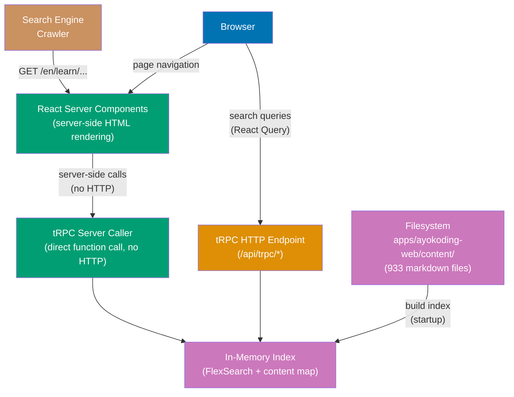

# Technical Documentation

## Architecture

The app is a single Next.js 16 server that reads markdown content from the filesystem
and renders it as **server-side HTML** for SEO. No database is needed today — all
content lives in flat markdown files. The architecture is designed to be **extensible**
for future fullstack features (auth, dashboard, database) without restructuring.

**Rendering strategy**: All content pages are rendered as **React Server Components
(RSC)** with **on-demand ISR** — HTML is generated on the server on first request,
cached, and revalidated periodically. This ensures all content is crawlable by search
engines without JavaScript execution, while avoiding build-time generation of all 933+
pages (which would slow builds as content grows). tRPC is used server-side (via server
caller) for content pages, and client-side (via React Query) only for interactive
features like search.

**Extensibility**: Routes are organized with Next.js **route groups** to separate
content-serving routes from future application routes. Adding new fullstack features
(auth, dashboard, user accounts, database-backed pages) requires only adding new route
groups — no restructuring of existing content routes.



### On-Demand ISR (Not Full SSG)

Content pages use **on-demand ISR (Incremental Static Regeneration)** instead of
full static generation at build time:

```typescript
// app/[locale]/(content)/[...slug]/page.tsx
export const dynamicParams = true; // Allow any slug (not pre-defined)
export const revalidate = 3600; // Cache for 1 hour, then re-render

// NO generateStaticParams — pages are NOT pre-built at build time
// First request: server-renders the page (full HTML for SEO)
// Subsequent requests: served from cache until revalidate period
// After revalidate: next request triggers background re-render
```

**Why not `generateStaticParams`?** With 933+ markdown files growing over time,
pre-building all pages at build time would:

- Make builds increasingly slow (minutes → tens of minutes)
- Consume excessive build resources on Vercel
- Provide no SEO benefit — ISR serves the same full HTML on first request

**SEO is preserved**: The first request to any content page triggers server-side
rendering, producing complete HTML with all content, meta tags, and structured data.
Search engine crawlers receive the same full HTML as with static generation. The
page is then cached for subsequent requests.

### Standalone Output and File Tracing

The `next.config.ts` uses `output: 'standalone'` for Docker builds. Next.js uses
`@vercel/nft` to statically analyze imports and `fs` usage to determine which files
to include in the standalone output. However, content files read via dynamic
`fs.readFile` paths are **not automatically traced** — `@vercel/nft` cannot follow
runtime-computed paths.

`outputFileTracingIncludes` explicitly tells Next.js to include the content directory:

```typescript
// next.config.ts
const nextConfig = {
  output: "standalone",
  outputFileTracingRoot: path.join(__dirname, "../../"),
  outputFileTracingIncludes: {
    "/**": ["../../apps/ayokoding-web/content/**/*"],
  },
};
```

**Without `outputFileTracingIncludes`**, the standalone build contains zero markdown
files, and every content page returns 404 in Docker. This is a known Next.js
behavior documented in [vercel/next.js#43973](https://github.com/vercel/next.js/issues/43973).

### Server-Side vs Client-Side Rendering

| Feature                                         | Rendering                          | Why                                       |
| ----------------------------------------------- | ---------------------------------- | ----------------------------------------- |
| Content pages (`/[locale]/(content)/[...slug]`) | **Server (RSC + ISR)**             | SEO: full HTML; cached after first render |
| Section index pages                             | **Server (RSC + ISR)**             | SEO: full HTML; cached after first render |
| Homepage                                        | **Server (RSC)**                   | SEO: full HTML for crawlers               |
| Navigation sidebar                              | **Server (RSC)**                   | SEO: crawlable links                      |
| Breadcrumb                                      | **Server (RSC)**                   | SEO: structured navigation                |
| Table of contents                               | **Server (RSC)**                   | SEO: heading links                        |
| Prev/Next navigation                            | **Server (RSC)**                   | SEO: crawlable links                      |
| Open Graph / meta tags                          | **Server (`generateMetadata`)**    | SEO: social sharing                       |
| JSON-LD structured data                         | **Server (RSC)**                   | SEO: rich snippets                        |
| Sitemap                                         | **Server (`app/sitemap.ts`)**      | SEO: crawler discovery                    |
| RSS feed                                        | **Server (`app/feed.xml/`)**       | SEO: content syndication                  |
| robots.txt                                      | **Server (`app/robots.ts`)**       | SEO: crawler directives + sitemap URL     |
| Google Analytics                                | **Client (`@next/third-parties`)** | Analytics: GA4 tracking                   |
| Search dialog                                   | **Client (React Query)**           | Interactive: user-driven                  |
| Theme toggle                                    | **Client (`next-themes`)**         | Interactive: preference                   |
| Mobile menu drawer                              | **Client**                         | Interactive: UI state                     |
| Tabs (shortcode)                                | **Client**                         | Interactive: tab switching                |
| YouTube embeds (shortcode)                      | **Client**                         | Dynamic: iframe embed                     |
| Mermaid diagrams                                | **Client**                         | Dynamic: JS rendering                     |
| Future app routes                               | **Server or Client**               | Depends on feature                        |

## Content Consumption (Detailed)

### Content Directory Reference

The app reads markdown files from `apps/ayokoding-web/content/` — the **same directory**
used by the Hugo site. No content is copied or duplicated. The path is resolved via the
`CONTENT_DIR` environment variable with a fallback:

```typescript
// src/server/content/reader.ts
const CONTENT_DIR = process.env.CONTENT_DIR ?? path.resolve(process.cwd(), "../../apps/ayokoding-web/content");
```

**Path resolution by environment:**

| Environment       | `CONTENT_DIR`  | Resolves To                                               |
| ----------------- | -------------- | --------------------------------------------------------- |
| Dev (`nx dev`)    | Not set        | `../../apps/ayokoding-web/content` (relative to app root) |
| Vercel            | Not set        | Same relative path (full repo cloned, app root is cwd)    |
| Docker            | `/app/content` | Content copied into image at build time                   |
| Integration tests | Not set        | Same relative path (runs from workspace)                  |

### Directory Structure on Disk

```
apps/ayokoding-web/content/
├── en/                                    # English content (809 files)
│   ├── _index.md                          # Root section index (cascade: type: docs)
│   ├── about-ayokoding.md                 # Top-level static page
│   ├── terms-and-conditions.md            # Top-level static page
│   ├── learn/                             # Main learning section
│   │   ├── _index.md                      # Section index (manual nav list)
│   │   ├── overview.md                    # Content page
│   │   └── software-engineering/          # Subdomain
│   │       ├── _index.md                  # Section index
│   │       ├── overview.md                # Content page
│   │       └── programming-languages/     # Category
│   │           ├── _index.md              # Section index
│   │           ├── overview.md            # Content page
│   │           └── golang/               # Tool/language
│   │               ├── _index.md          # Section index
│   │               ├── overview.md        # Weight: 100000
│   │               ├── by-example/        # Content type
│   │               │   ├── _index.md
│   │               │   ├── beginner.md    # Level page
│   │               │   ├── intermediate.md
│   │               │   └── advanced.md
│   │               └── in-the-field/      # Content type
│   │                   ├── _index.md
│   │                   └── *.md           # Production guides
│   └── rants/                             # Blog-style essays
│       ├── _index.md
│       └── 2023/
│           ├── _index.md
│           └── 04/
│               ├── _index.md
│               └── my-article-title.md
└── id/                                    # Indonesian content (124 files)
    ├── _index.md
    ├── syarat-dan-ketentuan.md
    ├── belajar/                           # = en/learn/
    │   ├── _index.md
    │   ├── ikhtisar.md                    # = en/learn/overview
    │   └── manusia/                       # = en/learn/human/ (partial mirror)
    ├── celoteh/                           # = en/rants/
    └── konten-video/                      # Indonesian-only (no EN equivalent)
        └── cerita-programmer/
```

### File Types and Slug Derivation

The content reader processes two types of markdown files differently:

**1. Section pages (`_index.md`):**

```
File: content/en/learn/software-engineering/_index.md
 → locale: "en"
 → slug: "learn/software-engineering"
 → isSection: true
 → children: [overview.md, programming-languages/_index.md, ...]
```

In Hugo, `_index.md` represents a "branch bundle" — a directory listing page.
The slug is the directory path (the `_index.md` filename is stripped).

**2. Regular content pages (`*.md`):**

```
File: content/en/learn/software-engineering/programming-languages/golang/overview.md
 → locale: "en"
 → slug: "learn/software-engineering/programming-languages/golang/overview"
 → isSection: false
```

The slug is the full file path minus the locale prefix and `.md` extension.

**Slug derivation algorithm:**

```typescript
function deriveSlug(filePath: string, contentDir: string): { locale: string; slug: string } {
  // filePath: "/abs/path/content/en/learn/overview.md"
  // contentDir: "/abs/path/content"
  const relative = path.relative(contentDir, filePath);
  // relative: "en/learn/overview.md"

  const parts = relative.split(path.sep);
  const locale = parts[0]; // "en"
  const rest = parts.slice(1).join("/"); // "learn/overview.md"

  let slug = rest.replace(/\.md$/, ""); // "learn/overview"
  slug = slug.replace(/\/_index$/, ""); // strip _index for sections
  if (slug === "_index") slug = ""; // root _index → empty slug

  return { locale, slug };
}
```

### Frontmatter Parsing and Validation

Every markdown file starts with YAML frontmatter. The reader extracts it with
`gray-matter` and validates it with Zod:

```typescript
// Actual frontmatter examples from content:
//
// Section index (_index.md):
//   title: "Learn"
//   date: 2025-07-07T07:20:00+07:00
//   draft: false
//   weight: 10
//
// Root index (_index.md) — has cascade:
//   title: "English Content"
//   date: 2025-03-16T07:20:00+07:00
//   draft: false
//   weight: 1
//   cascade:
//     type: docs
//   breadcrumbs: false
//
// Content page:
//   title: Overview
//   date: 2025-12-03T00:00:00+07:00
//   draft: false
//   weight: 100000
//   description: "Complete learning path from installation to expert mastery..."

const frontmatterSchema = z.object({
  title: z.string(),
  date: z.coerce.date().optional(),
  draft: z.boolean().default(false),
  weight: z.number().default(0),
  description: z.string().optional(),
  tags: z.array(z.string()).default([]),
  // Hugo-specific fields (consumed but not displayed)
  layout: z.string().optional(),
  type: z.string().optional(),
  cascade: z.record(z.unknown()).optional(),
  breadcrumbs: z.boolean().optional(),
  bookCollapseSection: z.boolean().optional(),
  bookFlatSection: z.boolean().optional(),
});
```

**Frontmatter validation error handling**: If Zod validation fails for a markdown
file, the content reader logs a `console.warn` with the file path and Zod error
details, skips the file, and continues indexing remaining files. This ensures one
malformed frontmatter does not crash the app or block 932 other pages from rendering.
In dev mode, validation warnings are also surfaced in the browser console.

**Draft handling**: Files with `draft: true` are excluded from the content index
(same behavior as Hugo's default). In dev mode, drafts can optionally be included
via `SHOW_DRAFTS=true` env var.

### Section Index Content (`_index.md` Body)

Section index pages in Hugo contain **manually-written navigation lists** in their
markdown body (not auto-generated). Example:

```markdown
---
title: "Learn"
weight: 10
---

- [Overview](/en/learn/overview)
- [Software Engineering](/en/learn/software-engineering)
  - [Overview](/en/learn/software-engineering/overview)
  - [Programming Languages](/en/learn/software-engineering/programming-languages)
    ...
```

The Next.js app handles this in two ways:

1. **Render the body as-is**: The markdown body is parsed and rendered like any
   content page. Internal links like `/en/learn/overview` are rewritten to Next.js
   routes during the rehype pass.
2. **Auto-generated child listing**: Additionally, the `content.listChildren`
   tRPC procedure returns structured child data for programmatic sidebar rendering.
   The sidebar does NOT parse the `_index.md` body — it uses the content index tree.

### Content Index Build Process

At startup (or first request), the content reader scans the entire content directory
and builds an in-memory index. This is a one-time operation:

```
Startup
  │
  ├─ 1. Glob all *.md files in content/{en,id}/
  │     → ~933 files found
  │
  ├─ 2. For each file:
  │     ├─ Read file contents (fs.readFile)
  │     ├─ Extract frontmatter (gray-matter)
  │     ├─ Validate frontmatter (Zod)
  │     ├─ Derive slug + locale
  │     ├─ Detect _index.md → isSection: true
  │     ├─ Strip markdown to plain text (for search indexing)
  │     └─ Store in ContentMeta map: key = "en:learn/overview"
  │
  ├─ 3. Build navigation tree:
  │     ├─ Group by locale
  │     ├─ Build parent-child hierarchy from slug paths
  │     ├─ Sort children by weight (ascending)
  │     └─ Store as TreeNode[] per locale
  │
  ├─ 4. Compute prev/next links:
  │     ├─ For each section, collect non-section children
  │     ├─ Sort by weight
  │     └─ Assign prev/next pointers between adjacent pages
  │
  └─ 5. Build FlexSearch index:
        ├─ Create separate index per locale
        ├─ Add each page: { id: slug, title, content: plainText }
        └─ ~933 documents indexed in ~200ms (estimated — benchmark during Phase 3)
```

**Lazy singleton**: The index is built once and cached in a module-level variable.
Subsequent requests read from the cache:

```typescript
let contentIndex: ContentIndex | null = null;

export async function getContentIndex(): Promise<ContentIndex> {
  if (!contentIndex) {
    contentIndex = await buildContentIndex(CONTENT_DIR);
  }
  return contentIndex;
}
```

**Dev mode hot-reload**: In development, the index is rebuilt when content files
change (via Next.js file watching or manual refresh). In production (Vercel/Docker),
the index is built once at startup and remains static.

### Internal Link Resolution

Hugo content uses absolute paths with locale prefix for internal links:

```markdown
See [Programming Languages Overview](/en/learn/software-engineering/programming-languages/overview)
```

These paths work as-is in the Next.js app because the URL structure is preserved:
`/en/learn/...` maps to `app/[locale]/[...slug]/page.tsx`. No link rewriting is
needed for standard internal links.

However, links to `_index.md` sections (e.g., `/en/learn/software-engineering`)
need to resolve correctly — the catch-all `[...slug]` route handles this by checking
if the slug maps to a section page.

### Static Assets

The Hugo site has static assets in `apps/ayokoding-web/static/`:

```
static/
├── favicon.ico
├── favicon.png
├── robots.txt
├── js/link-handler.js
└── images/
    └── en/takeaways/books/*/book-image.jpeg  (4 files)
```

Favicon files are copied to the Next.js `public/` directory; `robots.txt` is
excluded from `public/` and served via `app/robots.ts` instead (see Design
Decisions). Images are handled by the content pipeline (referenced in markdown).
The `link-handler.js` is not needed — Next.js handles link navigation natively.

### Bilingual Content Mapping

English and Indonesian content live in separate directory trees with **different
folder names** but equivalent structure:

| Concept       | English Path                 | Indonesian Path              |
| ------------- | ---------------------------- | ---------------------------- |
| Learning root | `en/learn/`                  | `id/belajar/`                |
| Overview page | `en/learn/overview.md`       | `id/belajar/ikhtisar.md`     |
| Human skills  | `en/learn/human/`            | `id/belajar/manusia/`        |
| Essays        | `en/rants/2023/`             | `id/celoteh/2023/`           |
| Video content | (none)                       | `id/konten-video/`           |
| About         | `en/about-ayokoding.md`      | `id/tentang-ayokoding.md`    |
| Terms         | `en/terms-and-conditions.md` | `id/syarat-dan-ketentuan.md` |

**Important**: Not all content has bilateral equivalents. Indonesian has `konten-video/`
with no English counterpart. English has extensive `learn/software-engineering/`
content that Indonesian mirrors only partially (`belajar/manusia/` only).

The tRPC API handles each locale independently — there is no requirement that a slug
exists in both locales. The language switcher checks if a corresponding page exists
in the target locale and falls back to the locale's root page if not.

## Content Pipeline (Rendering)

```
Markdown File (apps/ayokoding-web/content/en/learn/...)
  │
  ├─ gray-matter ──→ YAML frontmatter ──→ Zod validation ──→ ContentMeta
  │
  └─ unified pipeline:
       remark-parse (markdown → MDAST)
       → remark-gfm (tables, strikethrough)
       → remark-math (LaTeX: $...$ inline, $$...$$ block — set singleDollarTextMath: true explicitly)
       → custom remark plugin (Hugo shortcodes → custom nodes)
       → remark-rehype (MDAST → HAST — with allowDangerousHtml: true)
       → rehype-raw (parses raw HTML strings into proper HAST nodes)
       → rehype-pretty-code + shiki (syntax highlighting)
       → rehype-katex (math rendering)
       → rehype-slug (heading IDs)
       → rehype-autolink-headings (heading anchors)
       → rehype-stringify (HAST → HTML string — must be last)
```

### Hugo Shortcode Handling

Hugo shortcodes are converted to custom HTML during the remark pass. A custom remark
plugin matches both `` and `{}` delimiter styles and transforms them
to structured HTML nodes that map to React components. Only shortcodes actually used
in content are handled (audited via `grep -roh '{{[<%][^>%]*[>%]}}' content/ | sort -u`):

| Hugo Shortcode                              | Count | React Component                                 |
| ------------------------------------------- | ----- | ----------------------------------------------- |
| `` | 19    | `<Callout variant="...">` (shadcn Alert)        |
| ``     | 169   | `<Tabs>` (shadcn Tabs, `"use client"`)          |
| ``                               | 508   | `<TabPanel>` (child of Tabs)                    |
| ``                        | 45    | `<YouTube>` (responsive iframe, `"use client"`) |
| `{}`                             | 1     | `<Steps>` (numbered list with connectors)       |

**Tabs** are the most-used shortcode — they render multi-language code comparisons
in by-example tutorials. The `items` attribute provides tab labels (e.g.,
`"C,Go,Python,Java"`), and each `` child corresponds to one panel.

**YouTube** embeds are only in Indonesian content (`id/konten-video/`). The embed
renders a 16:9 responsive iframe with `loading="lazy"`.

**Steps** use the `{}` delimiter (not ``), which means Hugo processes
inner markdown. The remark plugin handles both delimiter styles.

### Raw HTML Handling (`rehype-raw`)

Content files contain 1,343 raw HTML occurrences across 30 files (inline `<div>`,
`<table>`, `<details>`, `<summary>`, `<kbd>`, `<sup>`, ``, etc.). Hugo renders
these via `goldmark.renderer.unsafe: true` in `hugo.yaml`.

In the unified pipeline, `remark-rehype` converts markdown AST to HTML AST, but by
default it **strips raw HTML nodes**. Two changes are required:

1. Pass `allowDangerousHtml: true` to `remark-rehype` — this preserves raw HTML as
   semistandard `raw` nodes in the HAST tree (instead of dropping them)
2. Add `rehype-raw` after `remark-rehype` — this parses the raw HTML strings into
   proper HAST element nodes so downstream rehype plugins can process them

Without both changes, all inline HTML is silently removed from rendered output.

### Math Delimiters

Hugo config (`hugo.yaml`) supports four math delimiter pairs:

| Delimiter | Type   | Used in Content                    | remark-math Default                |
| --------- | ------ | ---------------------------------- | ---------------------------------- |
| `$...$`   | Inline | 424 occurrences                    | Yes (`singleDollarTextMath: true`) |
| `$$...$$` | Block  | Yes                                | Yes                                |
| `\(...\)` | Inline | 0 (false positives — shell syntax) | No                                 |
| `\[...\]` | Block  | 0                                  | No                                 |

Only `$...$` and `$$...$$` are actually used in content. `remark-math` handles
both by default — no custom delimiter configuration is needed. The Hugo config
lists `\(...\)` and `\[...\]` for forward compatibility but content doesn't use them.

### Content Caching

Parsed HTML is cached in-memory after first render to avoid re-parsing on subsequent
requests. The cache key is `"${locale}:${slug}"`:

```typescript
const htmlCache = new Map<string, { html: string; headings: Heading[] }>();

export async function getRenderedContent(locale: string, slug: string) {
  const key = `${locale}:${slug}`;
  if (htmlCache.has(key)) return htmlCache.get(key)!;

  const raw = await readContentFile(locale, slug);
  const result = await parseMarkdown(raw.content);
  htmlCache.set(key, result);
  return result;
}
```

In production, this cache persists for the lifetime of the server process.
In dev mode, the cache is invalidated on file changes.

### HTML-to-React Rendering (`html-react-parser`)

The unified pipeline produces an HTML **string** (via `rehype-stringify`). But the
React renderer needs to map certain HTML nodes to interactive React components
(tabs need state, Mermaid needs DOM, internal links need `next/link` for SPA
navigation). Raw `dangerouslySetInnerHTML` cannot do this.

`html-react-parser` bridges the gap — it parses the HTML string into React
elements, with `replace` callbacks that swap specific nodes for React components:

```typescript
// src/components/content/markdown-renderer.tsx
import parse, { domToReact, type HTMLReactParserOptions } from "html-react-parser";
import Link from "next/link";

const options: HTMLReactParserOptions = {
  replace(domNode) {
    if (domNode.type === "tag") {
      // Shortcode components
      if (domNode.attribs?.["data-callout"]) return <Callout variant={domNode.attribs["data-callout"]}>{domToReact(domNode.children, options)}</Callout>;
      if (domNode.attribs?.["data-tabs"]) return <Tabs items={domNode.attribs["data-tabs"]}>{domToReact(domNode.children, options)}</Tabs>;
      if (domNode.attribs?.["data-youtube"]) return <YouTube id={domNode.attribs["data-youtube"]} />;
      if (domNode.attribs?.["data-steps"]) return <Steps>{domToReact(domNode.children, options)}</Steps>;

      // Internal links → next/link for SPA navigation
      if (domNode.name === "a" && domNode.attribs?.href?.startsWith("/")) {
        return <Link href={domNode.attribs.href}>{domToReact(domNode.children, options)}</Link>;
      }
    }
  },
};

export function MarkdownRenderer({ html }: { html: string }) {
  return <div className="prose dark:prose-invert max-w-none">{parse(html, options)}</div>;
}
```

**Why `html-react-parser` over `rehype-react`?** Both work, but `html-react-parser`
preserves the HTML string caching architecture — strings are serializable and
cacheable in a `Map<string, string>`. With `rehype-react`, the pipeline outputs
JSX elements directly, which cannot be cached as strings. The trade-off is parsing
HTML twice (stringify then re-parse), but the cached HTML avoids re-running the
expensive unified pipeline on every request.

### Prose Typography (`@tailwindcss/typography`)

Rendered markdown content (headings, paragraphs, lists, blockquotes, tables, code,
`<hr>`, etc.) requires the Tailwind Typography plugin for proper styling. Without
it, all HTML elements render as unstyled plain text. The plugin is enabled in CSS:

```css
/* globals.css */
@import "tailwindcss";
@plugin "@tailwindcss/typography";
```

The content wrapper uses `prose dark:prose-invert` classes for automatic light/dark
mode typography styling.

## Project Structure

```
apps/ayokoding-web-v2/
├── src/
│   ├── app/                              # Next.js App Router
│   │   ├── [locale]/                     # i18n dynamic segment
│   │   │   ├── layout.tsx                # Locale layout (header, footer)
│   │   │   ├── page.tsx                  # Homepage (locale root)
│   │   │   ├── (content)/                # ← Route group: content pages
│   │   │   │   ├── layout.tsx            # Content layout (sidebar + TOC)
│   │   │   │   ├── search/
│   │   │   │   │   └── page.tsx          # Search results page
│   │   │   │   ├── error.tsx              # Error boundary for content errors
│   │   │   │   ├── not-found.tsx         # Custom 404 for invalid slugs
│   │   │   │   └── [...slug]/            # Catch-all content (on-demand ISR)
│   │   │   │       └── page.tsx          # Server-renders markdown content
│   │   │   └── (app)/                    # ← Route group: future fullstack routes
│   │   │       └── .gitkeep              # Placeholder (e.g., dashboard/, admin/)
│   │   ├── api/
│   │   │   └── trpc/
│   │   │       └── [trpc]/
│   │   │           └── route.ts          # tRPC HTTP adapter
│   │   ├── feed.xml/
│   │   │   └── route.ts                  # RSS 2.0 feed generation
│   │   ├── robots.ts                     # Generated robots.txt with sitemap URL
│   │   ├── sitemap.ts                    # Sitemap generation from content index
│   │   ├── layout.tsx                    # Root layout (providers, fonts, KaTeX CSS, GA4)
│   │   └── page.tsx                      # / → redirect to /en
│   ├── server/                           # Server-side code
│   │   ├── trpc/
│   │   │   ├── init.ts                   # tRPC initialization (context, middleware)
│   │   │   ├── router.ts                 # Root router (merges sub-routers)
│   │   │   └── procedures/
│   │   │       ├── content.ts            # content.getBySlug, content.listChildren, content.getTree
│   │   │       ├── search.ts             # search.query
│   │   │       └── meta.ts               # meta.health, meta.languages
│   │   └── content/
│   │       ├── reader.ts                 # Filesystem reader (glob, readFile, gray-matter)
│   │       ├── parser.ts                 # Markdown → HTML (unified pipeline)
│   │       ├── index.ts                  # Content index builder (scans all files at startup)
│   │       ├── search-index.ts           # FlexSearch index management
│   │       ├── shortcodes.ts             # Hugo shortcode → custom node transformer
│   │       │                             # (callout, tabs/tab, youtube, steps)
│   │       └── types.ts                  # ContentMeta, ContentPage, TreeNode types
│   ├── components/                       # UI components
│   │   ├── ui/                           # shadcn/ui generated components
│   │   ├── layout/
│   │   │   ├── header.tsx                # Site header (title, search, lang, theme)
│   │   │   ├── sidebar.tsx               # Collapsible navigation sidebar
│   │   │   ├── breadcrumb.tsx            # Path breadcrumb
│   │   │   ├── toc.tsx                   # Table of contents (from headings)
│   │   │   ├── footer.tsx                # Site footer
│   │   │   ├── mobile-nav.tsx            # Mobile hamburger drawer
│   │   │   └── prev-next.tsx             # Bottom prev/next navigation
│   │   ├── content/
│   │   │   ├── markdown-renderer.tsx     # Renders parsed HTML with components
│   │   │   ├── callout.tsx               # Admonition/callout component
│   │   │   ├── tabs.tsx                  # Tabbed content (shadcn Tabs, "use client")
│   │   │   ├── youtube.tsx               # Responsive YouTube iframe ("use client")
│   │   │   ├── steps.tsx                 # Numbered step list with connectors
│   │   │   ├── code-block.tsx            # Syntax highlighted code block
│   │   │   └── mermaid.tsx               # Client-side Mermaid diagram
│   │   └── search/
│   │       ├── search-dialog.tsx         # Cmd+K search modal
│   │       └── search-results.tsx        # Search result list items
│   ├── lib/
│   │   ├── trpc/
│   │   │   ├── client.ts                 # tRPC React Query hooks (search only)
│   │   │   ├── server.ts                 # tRPC server caller (content pages, RSC)
│   │   │   └── provider.tsx              # TRPCProvider + QueryClientProvider (search)
│   │   ├── schemas/                      # Zod schemas
│   │   │   ├── content.ts                # Frontmatter schema, content input/output
│   │   │   ├── search.ts                 # Search query/result schemas
│   │   │   └── navigation.ts             # Tree node, breadcrumb schemas
│   │   ├── i18n/
│   │   │   ├── config.ts                 # Locale config (en, id), path mappings
│   │   │   ├── translations.ts           # UI string translations
│   │   │   └── middleware.ts             # Locale detection + redirect logic
│   │   ├── hooks/
│   │   │   ├── use-search.ts             # Search dialog state
│   │   │   └── use-locale.ts             # Current locale hook
│   │   └── utils.ts                      # Shared utilities
│   └── styles/
│       └── globals.css                   # Tailwind imports + custom styles
├── test/
│   ├── unit/
│   │   ├── be-steps/                     # BE Gherkin step definitions
│   │   │   ├── content-api.steps.ts      # content.* procedure tests
│   │   │   ├── search-api.steps.ts       # search.* procedure tests
│   │   │   ├── navigation-api.steps.ts   # Navigation tree tests
│   │   │   ├── i18n-api.steps.ts         # Locale-specific content tests
│   │   │   └── health-check.steps.ts     # meta.health tests
│   │   └── fe-steps/                     # FE Gherkin step definitions
│   │       ├── content-rendering.steps.ts
│   │       ├── navigation.steps.ts
│   │       ├── search.steps.ts
│   │       ├── responsive.steps.ts
│   │       ├── i18n.steps.ts
│   │       └── accessibility.steps.ts
│   └── integration/
│       └── be-steps/                     # Integration (real filesystem)
│           ├── content-api.steps.ts
│           ├── search-api.steps.ts
│           └── navigation-api.steps.ts
├── public/                               # Static assets (NO robots.txt — see app/robots.ts)
│   ├── favicon.ico
│   └── favicon.png
├── next.config.ts                        # Next.js config (standalone output)
├── vitest.config.ts                      # Vitest with v8 coverage
├── tsconfig.json                         # Strict TypeScript
├── postcss.config.mjs                    # PostCSS for Tailwind v4 (`.mjs` matches organiclever-web pattern)
├── components.json                       # shadcn/ui config
├── project.json                          # Nx targets
├── package.json                          # Dependencies
├── Dockerfile                            # Production container
└── cucumber.integration.js               # Integration test config
```

## Specs Structure

```
specs/apps/ayokoding-web/
├── README.md
├── be/
│   └── gherkin/
│       ├── content-api.feature           # Content retrieval via tRPC
│       ├── search-api.feature            # Search functionality
│       ├── navigation-api.feature        # Navigation tree, breadcrumbs
│       ├── i18n-api.feature              # Locale-specific content serving
│       └── health-check.feature          # Health endpoint
└── fe/
    └── gherkin/
        ├── content-rendering.feature     # Page rendering, markdown, code blocks
        ├── navigation.feature            # Sidebar, breadcrumb, TOC, prev/next
        ├── search.feature                # Search UI, results, Cmd+K
        ├── responsive.feature            # Desktop/tablet/mobile layouts
        ├── i18n.feature                  # Language switching, URL structure
        └── accessibility.feature         # WCAG AA compliance
```

## E2E Test Apps

```
apps/ayokoding-web-v2-be-e2e/            # Backend E2E (tRPC API via HTTP)
├── src/
│   └── tests/
│       ├── content-api.spec.ts           # tRPC content procedures
│       ├── search-api.spec.ts            # tRPC search procedures
│       ├── navigation-api.spec.ts        # tRPC navigation procedures
│       ├── i18n-api.spec.ts             # Locale content + invalid locale 404
│       └── health.spec.ts                # Health endpoint
├── playwright.config.ts
└── project.json

apps/ayokoding-web-v2-fe-e2e/            # Frontend E2E (Playwright browser)
├── src/
│   └── tests/
│       ├── content-rendering.spec.ts     # Page rendering
│       ├── navigation.spec.ts            # Sidebar, breadcrumb, TOC
│       ├── search.spec.ts                # Search flow
│       ├── responsive.spec.ts            # Responsive breakpoints
│       ├── i18n.spec.ts                  # Language switching
│       └── accessibility.spec.ts         # ARIA, keyboard nav
├── playwright.config.ts
└── project.json
```

## End-to-End Type Safety

Type safety flows from content files through tRPC to the React UI with **zero
unsafe casts**. Every boundary is validated by Zod.

```
Markdown File
  │
  ├─ gray-matter → raw object
  │                    │
  │           Zod frontmatterSchema.parse()  ← runtime validation
  │                    │
  │                    ▼
  │              ContentMeta (typed)
  │
  ├─ tRPC procedure (input validated by Zod)
  │         │
  │         ▼
  │   ContentPage (typed output schema)
  │
  └─ React Server Component
            │
            ├─ tRPC server caller → fully typed return
            │   (no HTTP, direct function call)
            │
            └─ tRPC React Query hooks → auto-inferred types
                (search only, client-side)
```

**Type safety enforcement points:**

| Layer              | Mechanism                                | What it guarantees                                     |
| ------------------ | ---------------------------------------- | ------------------------------------------------------ |
| Frontmatter        | Zod `frontmatterSchema.parse()`          | Every markdown file's metadata is validated at runtime |
| tRPC inputs        | Zod `.input(z.object({...}))`            | Every API call validates its parameters                |
| tRPC outputs       | Zod `.output(schema)`                    | Every API response conforms to the declared shape      |
| tRPC server caller | `createCallerFactory()`                  | RSC calls are fully typed (same types as client)       |
| tRPC React Query   | `@trpc/tanstack-react-query`             | `useQuery` returns auto-inferred types from router     |
| TypeScript         | `strict: true`, no `any`                 | Compile-time safety across entire codebase             |
| Content types      | `ContentMeta`, `ContentPage`, `TreeNode` | Typed interfaces shared between server and client      |

**No `any` allowed**: Requirements explicitly prohibit `any` escapes in production
code. TypeScript strict mode catches implicit `any` at compile time. Zod handles
the `unknown → typed` boundary at runtime (frontmatter parsing, tRPC inputs).

## Design Decisions

| Decision            | Choice                                              | Reason                                                                                                                                                             |
| ------------------- | --------------------------------------------------- | ------------------------------------------------------------------------------------------------------------------------------------------------------------------ |
| App type            | Fullstack (fs)                                      | Content API + UI in one app                                                                                                                                        |
| Framework           | Next.js 16 (App Router)                             | Proven fullstack, existing team experience                                                                                                                         |
| API layer           | tRPC v11                                            | Type-safe end-to-end, native Zod + React Query integration                                                                                                         |
| Validation          | Zod                                                 | tRPC native, frontmatter validation, input/output schemas                                                                                                          |
| Content rendering   | React Server Components (RSC)                       | SEO: full HTML for crawlers, no client JS needed                                                                                                                   |
| Data fetching       | tRPC server caller + React Query                    | Server-side for content (SEO); client-side for search only                                                                                                         |
| UI components       | shadcn/ui (Radix + Tailwind)                        | Accessible, customizable, no vendor lock-in                                                                                                                        |
| Content source      | Flat markdown files                                 | Same as Hugo, no migration needed, no database                                                                                                                     |
| Markdown parser     | unified (remark + rehype)                           | Extensible, server-side, plugin ecosystem                                                                                                                          |
| Syntax highlighting | shiki ^1.x (via rehype-pretty-code)                 | Server-side; start with 1.x (rehype-pretty-code peer dep); verify upgrade path to 2.x/3.x before pinning — v0.14.1+ supports both, but upgrade requires testing    |
| Raw HTML            | rehype-raw + allowDangerousHtml                     | 1,343 raw HTML occurrences in content; required for Hugo parity                                                                                                    |
| Math                | KaTeX (via rehype-katex)                            | $/$$ delimiters only (no \(\)/\[\] — not used in content)                                                                                                          |
| Diagrams            | Mermaid (client-side)                               | Same as Hugo site, dynamic rendering                                                                                                                               |
| Search              | FlexSearch (in-memory)                              | Same as Hugo Hextra; ~200ms cold start to rebuild index (estimated — see below)                                                                                    |
| Analytics           | GA4 via @next/third-parties                         | Same measurement ID (G-1NHDR7S3GV) as Hugo site                                                                                                                    |
| RSS                 | Route handler (`app/feed.xml/route.ts`)             | Hugo outputs RSS for home + sections; preserve for subscribers                                                                                                     |
| Theme               | next-themes                                         | Dark/light/system toggle with SSR flash prevention                                                                                                                 |
| robots.txt          | Generated (`app/robots.ts`)                         | Dynamic sitemap URL; Hugo's static copy hardcodes domain. No `public/robots.txt` — `app/robots.ts` is the source of truth; having both is untested behavior        |
| File tracing        | outputFileTracingIncludes                           | @vercel/nft can't trace dynamic fs.readFile; standalone needs this                                                                                                 |
| i18n                | [locale] route segment                              | Next.js native, no extra library                                                                                                                                   |
| CSS                 | Tailwind CSS v4                                     | shadcn/ui requirement, utility-first                                                                                                                               |
| Typography          | @tailwindcss/typography                             | `prose` classes for rendered markdown; `@plugin` in globals.css                                                                                                    |
| HTML-to-React       | html-react-parser                                   | Component mapping + next/link replacement from HTML strings                                                                                                        |
| Locale validation   | `SUPPORTED_LOCALES.includes(locale)` + `notFound()` | Custom check (no extra dependency); rejects invalid `[locale]` values like `/fr/` or `/xyz/`                                                                       |
| Canonical URLs      | `alternates.canonical` in `generateMetadata`        | Next.js does not auto-set canonical; required for SEO                                                                                                              |
| Port                | 3101                                                | Adjacent to current Hugo site (3100)                                                                                                                               |
| Coverage            | Vitest v8 + rhino-cli 80%                           | BE+FE blend: backends 90%, frontends 70%, fullstack 80%                                                                                                            |
| Linter              | oxlint                                              | Same as other TypeScript apps                                                                                                                                      |
| BDD (unit)          | @amiceli/vitest-cucumber                            | Same as demo-fs-ts-nextjs                                                                                                                                          |
| BDD (integration)   | @cucumber/cucumber                                  | Integration tests run outside Vitest (real filesystem, not mocked) — plain cucumber-js is the appropriate runner, same as demo-be backend integration test pattern |
| Docker              | Multi-stage, no DB                                  | Local dev + CI E2E (standalone + outputFileTracingRoot)                                                                                                            |
| Deployment          | Vercel                                              | Same as ayokoding-web + organiclever-web                                                                                                                           |
| Prod branch         | `prod-ayokoding-web-v2`                             | Vercel listens for pushes (never commit directly)                                                                                                                  |
| Route architecture  | Route groups `(content)` + `(app)`                  | Content isolated; future fullstack routes added without restructure                                                                                                |
| ISR strategy        | On-demand ISR (no `generateStaticParams`)           | Scales to thousands of pages without slow builds                                                                                                                   |

### FlexSearch Cold Start on Vercel

The in-memory FlexSearch index + content map is a **lazy singleton** — built once
and cached for the lifetime of the server process. On Vercel serverless, each
function instance can cold start independently, triggering a full index rebuild
(scan 933 files, parse frontmatter, build FlexSearch index, ~200ms (estimated)).

**Impact**: Vercel Pro keeps instances warm for 99.37% of requests. ISR-cached
content pages don't trigger the content index at all (served from edge cache).
Only **search queries** and **first-hit uncached pages** trigger the tRPC route
handler, which may cold start. The ~200ms (estimated) rebuild is acceptable — users don't
notice it within the overall request latency.

**Future optimization**: If cold start becomes measurable, pre-build the
FlexSearch index to a JSON file at build time via FlexSearch's
[export/import API](https://github.com/nextapps-de/flexsearch/blob/master/doc/export-import.md)
and load from disk instead of scanning the filesystem. This is not needed at
launch but documented here for future reference. Note: FlexSearch v0.8.x (latest
as of 2026) introduced significant API changes — verify the export/import API
against v0.8 docs if implementing this optimization.

## Future Extensibility

The route architecture is designed so adding fullstack features requires **zero
restructuring** of existing content routes:

```
app/[locale]/
├── (content)/                    # ← Current: markdown content
│   ├── layout.tsx                # Sidebar + TOC layout
│   ├── [...slug]/page.tsx        # Markdown renderer (ISR)
│   └── search/page.tsx           # Search results
│
├── (app)/                        # ← Future: fullstack features
│   ├── layout.tsx                # App layout (different from content)
│   ├── dashboard/page.tsx        # User dashboard
│   ├── profile/page.tsx          # User profile
│   ├── admin/page.tsx            # Admin panel
│   └── settings/page.tsx         # User settings
│
└── layout.tsx                    # Shared: header, footer, theme
```

**Route groups** (`(content)` and `(app)`) are Next.js organizational boundaries
that don't affect URLs. They allow:

1. **Different layouts**: Content pages get sidebar + TOC; app pages get their own
   layout (e.g., dashboard sidebar, breadcrumb-less pages)
2. **Different rendering strategies**: Content uses ISR; app pages can use SSR or
   client-side as needed
3. **Independent evolution**: Content routes never need to change when app routes
   are added
4. **Database addition**: When a database is added for app features, it only affects
   `(app)` routes and new tRPC procedures — content routes remain file-based

**Adding a new fullstack feature** (e.g., user authentication):

1. Add `(app)/login/page.tsx` and `(app)/dashboard/page.tsx`
2. Add tRPC procedures in `server/trpc/procedures/auth.ts`
3. Add database schema in `server/db/` (new directory)
4. Content routes are untouched

**tRPC router is already extensible**:

```typescript
// Current
const appRouter = router({
  content: contentRouter, // File-based content
  search: searchRouter, // FlexSearch
  meta: metaRouter, // Health, languages
});

// Future (just add new routers)
const appRouter = router({
  content: contentRouter, // Unchanged
  search: searchRouter, // Unchanged
  meta: metaRouter, // Unchanged
  auth: authRouter, // ← NEW: login, register, session
  user: userRouter, // ← NEW: profile, settings
  admin: adminRouter, // ← NEW: user management
});
```

## Visual Design Capture Strategy

The current ayokoding-web uses the Hextra documentation theme. To faithfully replicate
the visual design, we reverse-engineer it before writing any UI code.

### Capture Process

1. **Screenshots**: Playwright captures the live Hugo site at 4 breakpoints (1280px,
   1024px, 768px, 375px) across representative page types
2. **Theme analysis**: Extract Hextra's design tokens (colors, typography, spacing,
   breakpoints) from the theme source
3. **Component mapping**: Map each Hextra element to shadcn/ui + Tailwind equivalents

### Responsive Layout Grid

```
Desktop (≥1280px):
┌──────────┬──────────────────────────────┬──────────┐
│ Sidebar  │         Content              │   TOC    │
│  250px   │        max-w-3xl             │  200px   │
│          │                              │          │
└──────────┴──────────────────────────────┴──────────┘

Laptop (≥1024px):
┌──────────┬─────────────────────────────────────────┐
│ Sidebar  │              Content                    │
│  250px   │             (TOC hidden)                │
└──────────┴─────────────────────────────────────────┘

Tablet (≥768px):
┌────┬───────────────────────────────────────────────┐
│ ≡  │                  Content                      │
│icon│               (full width)                    │
└────┴───────────────────────────────────────────────┘

Mobile (<768px):
┌───────────────────────────────────────────────────┐
│ ☰  Site Title              🔍  🌙                  │
├───────────────────────────────────────────────────┤
│                   Content                         │
│                (full width)                       │
└───────────────────────────────────────────────────┘
```

### Component Responsive Behavior

| Component   | Desktop                | Tablet            | Mobile                    |
| ----------- | ---------------------- | ----------------- | ------------------------- |
| Sidebar     | Persistent, 250px      | Collapsed icons   | Sheet overlay (hamburger) |
| TOC         | Right column, 200px    | Hidden            | Hidden                    |
| Search      | Centered modal (Cmd+K) | Centered modal    | Full-screen overlay       |
| Breadcrumb  | Full path              | Full path         | Truncated with ellipsis   |
| Code blocks | Fixed width            | Full width        | Horizontal scroll         |
| Tables      | Normal                 | Horizontal scroll | Horizontal scroll         |
| Prev/Next   | Side-by-side           | Side-by-side      | Stacked vertically        |
| Images      | Centered, max-width    | Full width        | Full width                |

### Hextra → shadcn/ui Component Mapping

| Hextra Element      | shadcn/ui Equivalent         | Notes                                |
| ------------------- | ---------------------------- | ------------------------------------ |
| Sidebar nav tree    | ScrollArea + custom tree     | Collapsible sections, weight-ordered |
| Search (FlexSearch) | Command (cmdk)               | Cmd+K trigger, same search engine    |
| Callout admonitions | Alert (warning/info/default) | Match type→variant mapping           |
| Breadcrumb          | Breadcrumb                   | Path-based, locale-aware             |
| Theme toggle        | DropdownMenu + next-themes   | System/light/dark options            |
| Language switcher   | DropdownMenu                 | EN/ID with flag icons                |
| TOC                 | Custom component             | Extracted from heading hierarchy     |
| Code block          | Pre + custom styling         | shiki server-side highlighting       |
| Mobile menu         | Sheet                        | Slide-in from left                   |

## Key Architectural Differences from Current Hugo Site

**What changes:**

- Theme: Hextra → shadcn/ui custom components
- Build: Hugo static generation → Next.js RSC (server-rendered HTML for SEO)
- Search: Hugo FlexSearch plugin → custom FlexSearch integration via tRPC
- Routing: Hugo content paths → Next.js `[locale]/[...slug]` catch-all
- Shortcodes: Hugo template shortcodes → remark plugin + React components
- Navigation: Hugo auto-sidebar → tRPC `content.getTree` + React sidebar
- SEO: Hugo partials → Next.js Metadata API
- i18n: Hugo multilingual config → `[locale]` route segment

**What stays the same:**

- Content files: Same markdown files in `apps/ayokoding-web/content/`
- URL structure: `/en/learn/...` and `/id/belajar/...`
- Search engine: FlexSearch (same library)
- Content types: by-example, in-the-field, overview, rants, video content
- Frontmatter schema: title, date, weight, description, tags, draft
- Weight-based ordering: Same weight values control navigation order

## tRPC Router Design

```typescript
// Root router
const appRouter = router({
  content: contentRouter,
  search: searchRouter,
  meta: metaRouter,
});

// Content router
const contentRouter = router({
  getBySlug: publicProcedure
    .input(z.object({ locale: localeSchema, slug: z.string() }))
    .output(contentPageSchema)
    .query(({ input }) => /* read + parse markdown */),

  listChildren: publicProcedure
    .input(z.object({ locale: localeSchema, slug: z.string() }))
    .output(z.array(contentMetaSchema))
    .query(({ input }) => /* list child pages */),

  getTree: publicProcedure
    .input(z.object({ locale: localeSchema, rootSlug: z.string().optional() }))
    .output(z.array(treeNodeSchema))
    .query(({ input }) => /* build navigation tree */),
});

// Search router
const searchRouter = router({
  query: publicProcedure
    .input(z.object({
      locale: localeSchema,
      query: z.string().min(1).max(200),
      limit: z.number().min(1).max(50).default(20),
    }))
    .output(z.array(searchResultSchema))
    .query(({ input }) => /* FlexSearch query */),
});

// Meta router
const metaRouter = router({
  health: publicProcedure
    .query(() => ({ status: "ok" as const })),

  languages: publicProcedure
    .query(() => [
      { code: "en", label: "English" },
      { code: "id", label: "Indonesian" },
    ]),
});
```

## Zod Schemas

```typescript
// Locale
const localeSchema = z.enum(["en", "id"]);

// Content frontmatter (validated from YAML)
const frontmatterSchema = z.object({
  title: z.string(),
  date: z.coerce.date().optional(),
  draft: z.boolean().default(false),
  weight: z.number().default(0),
  description: z.string().optional(),
  tags: z.array(z.string()).default([]),
  layout: z.string().optional(),
  type: z.string().optional(),
  // Hugo-specific fields (consumed but not displayed)
  cascade: z.record(z.unknown()).optional(),
  breadcrumbs: z.boolean().optional(),
  bookCollapseSection: z.boolean().optional(),
  bookFlatSection: z.boolean().optional(),
});

// Content metadata (used in listings and navigation)
const contentMetaSchema = z.object({
  slug: z.string(),
  locale: localeSchema,
  title: z.string(),
  weight: z.number(),
  description: z.string().optional(),
  date: z.coerce.date().optional(),
  tags: z.array(z.string()),
  isSection: z.boolean(),
  hasChildren: z.boolean(),
});

// Full content page (metadata + rendered HTML)
const contentPageSchema = contentMetaSchema.extend({
  html: z.string(),
  headings: z.array(
    z.object({
      id: z.string(),
      text: z.string(),
      level: z.number(),
    }),
  ),
  prev: contentMetaSchema.nullable(),
  next: contentMetaSchema.nullable(),
});

// Navigation tree node
const treeNodeSchema: z.ZodType<TreeNode> = z.lazy(() =>
  z.object({
    slug: z.string(),
    title: z.string(),
    weight: z.number(),
    children: z.array(treeNodeSchema),
  }),
);

// Search result
const searchResultSchema = z.object({
  slug: z.string(),
  title: z.string(),
  sectionPath: z.string(),
  excerpt: z.string(),
  score: z.number(),
});
```

## i18n Content Path Mapping

The English and Indonesian content directories have different path structures.
The i18n config maps between them:

```typescript
// Segment-level mappings: translate each path segment between locales.
// Key = English segment, Value = Indonesian equivalent.
// Applied to EVERY segment in the path, not just top-level.
// EN→ID segment mappings. Segments not in this map are kept as-is.
const segmentMappings: Record<string, string> = {
  // Top-level sections
  learn: "belajar",
  rants: "celoteh",
  "about-ayokoding": "tentang-ayokoding",
  "terms-and-conditions": "syarat-dan-ketentuan",
  // Filenames that differ between locales
  overview: "ikhtisar",
  introduction: "perkenalan",
  // Subsections
  human: "manusia",
  tools: "peralatan",
};

async function mapSlugToLocale(slug: string, targetLocale: "en" | "id"): Promise<string | null> {
  const segments = slug.split("/");
  const mapped = segments.map((seg) => {
    if (targetLocale === "id") return segmentMappings[seg] ?? seg;
    // Reverse: find English key for Indonesian value
    const entry = Object.entries(segmentMappings).find(([, v]) => v === seg);
    return entry ? entry[0] : seg;
  });
  // Verify the mapped slug actually exists in the target locale's content
  const index = await getContentIndex();
  const targetSlug = mapped.join("/");
  return index.has(`${targetLocale}:${targetSlug}`) ? targetSlug : null;
}
```

**Language switcher behavior**: When the user switches locale, the switcher:

1. Translates each segment of the current slug using `segmentMappings`
2. Checks if the translated slug exists in the target locale's content index
3. If it exists → navigate to the translated page
4. If it doesn't exist → fall back to the target locale's root page (`/id` or `/en`)

This handles both path segment translation (`learn`→`belajar`) AND filename
translation (`overview`→`ikhtisar`).

### Locale Validation

The `[locale]` route segment is dynamic and accepts any string. Without
validation, requests to `/fr/learn/overview` or `/xyz/anything` would pass
through middleware and reach the content layer, producing empty results or
errors. Following the [official Next.js i18n guide](https://nextjs.org/docs/app/guides/internationalization),
the locale layout validates the parameter:

```typescript
// app/[locale]/layout.tsx
import { notFound } from "next/navigation";

const supportedLocales = ["en", "id"] as const;
type Locale = (typeof supportedLocales)[number];

const hasLocale = (locale: string): locale is Locale => (supportedLocales as readonly string[]).includes(locale);

export default async function LocaleLayout({ children, params }: LayoutProps<"/[locale]">) {
  const { locale } = await params;
  if (!hasLocale(locale)) notFound();
  // ... rest of layout
}
```

This ensures only `en` and `id` proceed to render; all other values return 404.

Content slugs in tRPC use the **filesystem path relative to the locale directory**
(e.g., `learn/overview` for English, `belajar/ikhtisar` for Indonesian). Slugs are
locale-specific because folder and file names differ between languages. The tRPC
`locale` parameter determines which content directory to read from.

## Nx Configuration

**Tags:**

```json
"tags": ["type:app", "platform:nextjs", "lang:ts", "domain:ayokoding"]
```

**Implicit dependencies:**

```json
"implicitDependencies": ["rhino-cli", "ayokoding-cli"]
```

`ayokoding-cli` is needed for `titles update` (pre-commit) and `links check`
(`test:quick`). See [ayokoding-cli Integration](#ayokoding-cli-integration) below.

**7 mandatory targets + dev + start:**

| Target             | Purpose                                             | Cacheable |
| ------------------ | --------------------------------------------------- | --------- |
| `codegen`          | No-op (no OpenAPI contract)                         | Yes       |
| `dev`              | Start dev server (port 3101)                        | No        |
| `start`            | Start production server (port 3101)                 | No        |
| `typecheck`        | `tsc --noEmit`                                      | Yes       |
| `lint`             | oxlint                                              | Yes       |
| `build`            | `next build`                                        | Yes       |
| `test:unit`        | Unit tests — BE (tRPC procedures) + FE (components) | Yes       |
| `test:quick`       | Unit tests + coverage + link validation (80%+)      | Yes       |
| `test:integration` | tRPC procedures with real filesystem                | No        |

**Cache inputs for `test:unit` and `test:quick`:**

```json
"inputs": [
  "default",
  "{workspaceRoot}/specs/apps/ayokoding-web/be/gherkin/**/*.feature",
  "{workspaceRoot}/specs/apps/ayokoding-web/fe/gherkin/**/*.feature",
  "{workspaceRoot}/apps/ayokoding-web/content/**/*.md"
]
```

Note: Content markdown files are included as cache inputs since content changes
could affect test results.

## ayokoding-cli Integration

The content directory (`apps/ayokoding-web/content/`) is **shared** between the
Hugo v1 site and the Next.js v2 app. `ayokoding-cli` operates on this shared
content — it's a content maintenance tool, not tied to either frontend.

**Backward compatibility**: `ayokoding-cli` must remain fully compatible with
the current Hugo v1 site (`apps/ayokoding-web/`) until v1 is deprecated and
removed. All 3 commands (`nav regen`, `titles update`, `links check`) must
continue working unchanged for Hugo. No breaking changes to the CLI during the
v1→v2 transition period. The v2 app consumes CLI output (titles, link validation)
but does NOT require CLI modifications.

### Commands Relevant to v2

| Command         | Used By v2? | Where               | Why                                                                                                                                       |
| --------------- | ----------- | ------------------- | ----------------------------------------------------------------------------------------------------------------------------------------- |
| `titles update` | **Yes**     | Pre-commit hook     | Keeps frontmatter `title` consistent with filename. v2 reads title via Zod schema.                                                        |
| `links check`   | **Yes**     | `test:quick` target | Same `/en/learn/...` absolute paths. If link target file exists, v2's `[...slug]` route serves it.                                        |
| `nav regen`     | **No**      | Hugo v1 only        | Writes nav lists into `_index.md` body. v2 sidebar uses `content.getTree` (filesystem scan). Still needed for Hugo v1 during coexistence. |

### test:quick Composition

```
test:quick = test:unit + coverage validation (rhino-cli) + link validation (ayokoding-cli)
```

The `test:quick` target runs `ayokoding-cli links check` as a final step to catch
broken internal links. This is the same validation that `ayokoding-web` runs, but
declared as v2's own target so it's included in `nx affected -t test:quick`.

### Pre-commit Hook

When content files change, the existing pre-commit hook (configured in
`ayokoding-web/project.json`) already runs `titles update` and `nav regen`. Since
both apps share the content directory, v2 benefits from this without additional
configuration. The v2 app does NOT need its own pre-commit script for content.

### No New CLI Commands Needed

| Considered                        | Decision       | Reason                                                                                                                                                                              |
| --------------------------------- | -------------- | ----------------------------------------------------------------------------------------------------------------------------------------------------------------------------------- |
| `content validate` (frontmatter)  | **Not needed** | v2's content reader runs `frontmatterSchema.parse()` on all files at startup. Invalid files are caught immediately. Duplicating the Zod schema in Go would create dual maintenance. |
| `content build-index` (pre-build) | **Not needed** | Content index builds in ~200ms (estimated) for 933 files. Not a bottleneck worth optimizing.                                                                                        |
| `content check-shortcodes`        | **Not needed** | Custom remark plugin handles shortcode errors gracefully at render time.                                                                                                            |

## Vercel Deployment

**Production branch**: `prod-ayokoding-web-v2` (never commit directly — merge from `main`)

**Vercel config** (`apps/ayokoding-web-v2/vercel.json`):

```json
{
  "version": 2,
  "installCommand": "npm install --prefix=../.. --ignore-scripts",
  "ignoreCommand": "[ \"$VERCEL_GIT_COMMIT_REF\" != \"prod-ayokoding-web-v2\" ]",
  "headers": [
    {
      "source": "/(.*)",
      "headers": [
        { "key": "X-Content-Type-Options", "value": "nosniff" },
        { "key": "X-Frame-Options", "value": "SAMEORIGIN" },
        { "key": "X-XSS-Protection", "value": "1; mode=block" },
        { "key": "Referrer-Policy", "value": "strict-origin-when-cross-origin" }
      ]
    }
  ]
}
```

**Key Vercel considerations:**

- Vercel's Next.js builder handles the build natively (no `output: 'standalone'` needed
  for Vercel — that's only for Docker)
- Content files are at `apps/ayokoding-web/content/` relative to workspace root. The
  `next.config.ts` must configure the content path to resolve correctly in both Vercel
  (workspace root build) and Docker (standalone build) environments via `CONTENT_DIR`
  env var with a fallback
- `installCommand` uses `--prefix=../..` to install from workspace root (same as
  organiclever-web pattern)
- `ignoreCommand` ensures Vercel only builds when the production branch is pushed

**Deployment workflow** (same pattern as `apps-ayokoding-web-deployer`):

1. Validate content on `main` (CI passes)
2. Push `main` → `prod-ayokoding-web-v2` branch
3. Vercel auto-builds and deploys

## Docker Compose (Local Dev + CI E2E)

**Local development** (`infra/dev/ayokoding-web-v2/docker-compose.yml`):

```yaml
services:
  ayokoding-web-v2:
    build:
      context: ../../../
      dockerfile: apps/ayokoding-web-v2/Dockerfile
    container_name: ayokoding-web-v2
    ports:
      - "3101:3101"
    environment:
      - PORT=3101
      - CONTENT_DIR=/app/apps/ayokoding-web/content
    healthcheck:
      test: ["CMD", "curl", "-f", "http://localhost:3101/api/trpc/meta.health"]
      interval: 30s
      timeout: 10s
      retries: 3
      start_period: 30s
    restart: unless-stopped
```

No database service needed — content is baked into the Docker image from the
markdown files.

## Dockerfile

```dockerfile
# Build context: workspace root (docker-compose sets context: ../../../)
# Stage 1: Dependencies
FROM node:24-alpine AS deps
WORKDIR /app
COPY package.json package-lock.json ./
COPY apps/ayokoding-web-v2/package.json ./apps/ayokoding-web-v2/
RUN npm ci --ignore-scripts

# Stage 2: Build
FROM node:24-alpine AS builder
WORKDIR /app
ENV NEXT_TELEMETRY_DISABLED=1
COPY --from=deps /app/node_modules ./node_modules
COPY package.json ./
COPY apps/ayokoding-web-v2/ ./apps/ayokoding-web-v2/
COPY apps/ayokoding-web/content/ ./apps/ayokoding-web/content/
WORKDIR /app/apps/ayokoding-web-v2
RUN npx next build

# Stage 3: Production
FROM node:24-alpine AS runner
WORKDIR /app
ENV NODE_ENV=production
ENV NEXT_TELEMETRY_DISABLED=1
ENV HOSTNAME=0.0.0.0
RUN addgroup --system --gid 1001 nodejs && adduser --system --uid 1001 nextjs
COPY --from=builder --chown=nextjs:nodejs /app/apps/ayokoding-web-v2/public ./apps/ayokoding-web-v2/public
COPY --from=builder --chown=nextjs:nodejs /app/apps/ayokoding-web-v2/.next/standalone ./
COPY --from=builder --chown=nextjs:nodejs /app/apps/ayokoding-web-v2/.next/static ./apps/ayokoding-web-v2/.next/static
COPY --from=builder /app/apps/ayokoding-web/content/ ./apps/ayokoding-web/content/
USER nextjs
EXPOSE 3101
ENV PORT=3101
# Note: standalone output with outputFileTracingRoot places server.js at
# apps/ayokoding-web-v2/server.js relative to WORKDIR. Verify exact path
# during Phase 12 by inspecting .next/standalone/ output structure.
CMD ["node", "apps/ayokoding-web-v2/server.js"]
```

## CI Workflow

`.github/workflows/test-ayokoding-web-v2.yml`:

- **Triggers**: 2x daily cron (WIB 06, 18) + manual dispatch
- **Jobs**:
  - `unit`: `nx run ayokoding-web-v2:test:quick` + Codecov upload
  - `e2e`: Start app via Docker, run both BE and FE E2E tests
- **Codecov**: Upload coverage from unit tests

## SEO Implementation

Next.js Metadata API replaces Hugo's custom `head-end.html` partial:

```typescript
// app/[locale]/(content)/[...slug]/page.tsx
export async function generateMetadata({ params }: Props): Promise<Metadata> {
  const { locale, slug } = await params;
  const slugPath = slug.join("/");
  const page = await getContentBySlug(locale, slugPath);
  const otherLocale = locale === "en" ? "id" : "en";
  const mappedSlug = await mapSlugToLocale(slugPath, otherLocale);
  return {
    title: page.title,
    description: page.description,
    openGraph: { title: page.title, description: page.description, type: "article" },
    alternates: {
      canonical: `/${locale}/${slugPath}`,
      languages: {
        [locale]: `/${locale}/${slugPath}`,
        ...(mappedSlug ? { [otherLocale]: `/${otherLocale}/${mappedSlug}` } : {}),
      },
    },
  };
}
```

JSON-LD structured data via `<script type="application/ld+json">` in layout.

## Validated Dependencies (March 2026)

All dependencies have been verified via web search against latest releases and docs.

| Package                    | Version | Status         | Notes                                                                                                                                       |
| -------------------------- | ------- | -------------- | ------------------------------------------------------------------------------------------------------------------------------------------- |
| Next.js                    | 16.2.1  | Stable         | Latest. Turbopack default, React 19.2                                                                                                       |
| tRPC                       | v11     | Stable         | `@trpc/tanstack-react-query` (NOT `@trpc/react-query`)                                                                                      |
| @tanstack/react-query      | ^5.62.8 | Stable         | Required by tRPC v11 TanStack integration                                                                                                   |
| Zod                        | ^3.x    | Stable         | Use v3 (tRPC v11 validated); v4 has breaking changes, migrate later                                                                         |
| shadcn/ui                  | CLI v4  | Stable         | `npx shadcn@latest init`. Tailwind v4 compatible                                                                                            |
| Tailwind CSS               | v4      | Stable         | shadcn auto-detects version                                                                                                                 |
| shiki                      | ^1.x    | **Pin to 1.x** | start with 1.x (peer dep constraint); verify upgrade path to 2.x/3.x before committing — v0.14.1+ supports both via getSingletonHighlighter |
| rehype-pretty-code         | 0.14.x  | Active         | Shiki 1.x (pinned); 2.x/3.x also supported since v0.14.1                                                                                    |
| FlexSearch                 | 0.8.x   | Active         | No SSR issues, Apache 2.0                                                                                                                   |
| gray-matter                | 4.0.3   | Active         | Industry standard (Gatsby, Astro, Netlify)                                                                                                  |
| remark-math + rehype-katex | Latest  | Active         | ESM-only, compatible with unified 6+                                                                                                        |
| next-themes                | Latest  | Active         | Requires `suppressHydrationWarning` on `<html>`                                                                                             |
| @amiceli/vitest-cucumber   | 6.3.0   | Active         | Recently updated March 2025                                                                                                                 |
| oxlint                     | v1.39+  | Stable         | 50-100x faster than ESLint, 695+ rules                                                                                                      |
| unified (remark + rehype)  | Latest  | Active         | ESM-only — use `.ts`/`.mjs` config files                                                                                                    |
| html-react-parser          | Latest  | Active         | Parses HTML string → React elements with `replace` callbacks                                                                                |
| @tailwindcss/typography    | Latest  | Active         | `prose` classes for markdown; v4 via `@plugin` in CSS                                                                                       |

### Key Caveats

1. **`@trpc/react-query` is deprecated** — Use `@trpc/tanstack-react-query` instead.
   The old package is renamed to reflect TanStack Query v5 integration.

2. **Shiki pinned to ^1.x for stability** — `rehype-pretty-code` added Shiki 2.x/3.x
   support via `getSingletonHighlighter` in v0.14.1+. We pin to ^1.x until explicit
   version testing is done with the actual content pipeline. Upgrade to 2.x is viable
   once tested.

3. **next-themes hydration** — `ThemeProvider` is a client component. The root
   `<html>` element must include `suppressHydrationWarning` to avoid React hydration
   mismatch warnings when theme class is applied.

4. **`output: 'standalone'` + Vercel** — Vercel ignores this config and uses its own
   builder. It's only needed for Docker. In monorepos, also set
   `outputFileTracingRoot: path.join(__dirname, '../../')` so the standalone build
   traces files from the workspace root.

5. **unified ecosystem is ESM-only** — All remark/rehype plugins are ESM modules.
   Since we use `next.config.ts` (not `.js`), this is handled automatically.

6. **Zod v3 (not v4)** — Use `zod@^3` for tRPC v11 compatibility. Zod v4 has
   breaking API changes and tRPC v11 has not confirmed v4 support. Migrate to v4
   once tRPC officially validates compatibility.

7. **`remark-rehype` is required** — The unified pipeline needs `remark-rehype` to
   bridge from remark AST (MDAST) to rehype AST (HAST). Without it, rehype plugins
   have no input. Also, `rehype-stringify` must be the last step (converts HAST to
   HTML string).
