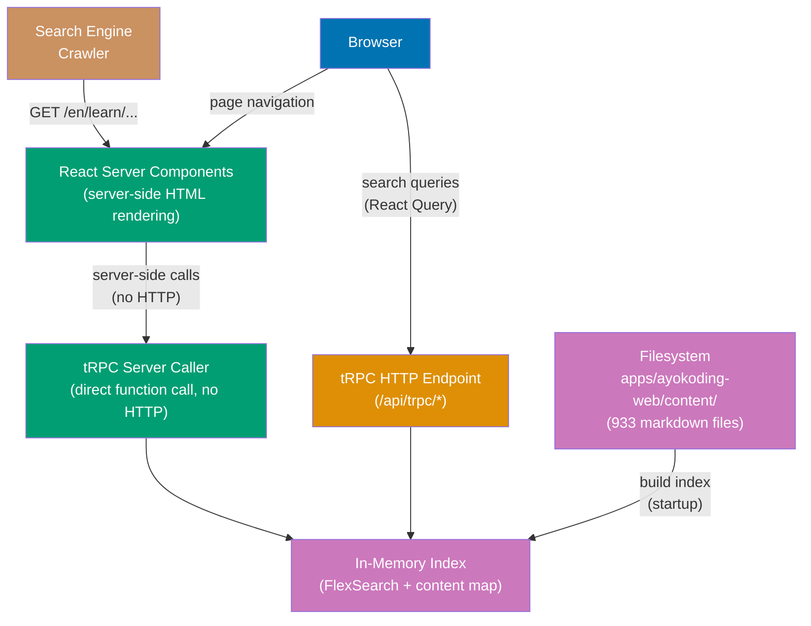

# Technical Documentation

## Architecture

The app is a single Next.js 16 server that reads markdown content from the filesystem
and renders it as **server-side HTML** for SEO. No database is needed — all content
lives in flat markdown files.

**Rendering strategy**: All content pages are rendered as **React Server Components
(RSC)** — HTML is generated on the server and sent to the browser fully rendered.
This ensures all content is crawlable by search engines without JavaScript execution.
tRPC is used server-side (via server caller) for content pages, and client-side
(via React Query) only for interactive features like search.



### Server-Side vs Client-Side Rendering

| Feature                               | Rendering                       | Why                         |
| ------------------------------------- | ------------------------------- | --------------------------- |
| Content pages (`/[locale]/[...slug]`) | **Server (RSC)**                | SEO: full HTML for crawlers |
| Section index pages                   | **Server (RSC)**                | SEO: full HTML for crawlers |
| Homepage                              | **Server (RSC)**                | SEO: full HTML for crawlers |
| Navigation sidebar                    | **Server (RSC)**                | SEO: crawlable links        |
| Breadcrumb                            | **Server (RSC)**                | SEO: structured navigation  |
| Table of contents                     | **Server (RSC)**                | SEO: heading links          |
| Prev/Next navigation                  | **Server (RSC)**                | SEO: crawlable links        |
| Open Graph / meta tags                | **Server (`generateMetadata`)** | SEO: social sharing         |
| JSON-LD structured data               | **Server (RSC)**                | SEO: rich snippets          |
| Sitemap                               | **Server (`app/sitemap.ts`)**   | SEO: crawler discovery      |
| Search dialog                         | **Client (React Query)**        | Interactive: user-driven    |
| Theme toggle                          | **Client**                      | Interactive: preference     |
| Mobile menu drawer                    | **Client**                      | Interactive: UI state       |
| Mermaid diagrams                      | **Client**                      | Dynamic: JS rendering       |

## Content Consumption (Detailed)

### Content Directory Reference

The app reads markdown files from `apps/ayokoding-web/content/` — the **same directory**
used by the Hugo site. No content is copied or duplicated. The path is resolved via the
`CONTENT_DIR` environment variable with a fallback:

```typescript
// src/server/content/reader.ts
const CONTENT_DIR = process.env.CONTENT_DIR ?? path.resolve(process.cwd(), "../../apps/ayokoding-web/content");
```

**Path resolution by environment:**

| Environment       | `CONTENT_DIR`  | Resolves To                                               |
| ----------------- | -------------- | --------------------------------------------------------- |
| Dev (`nx dev`)    | Not set        | `../../apps/ayokoding-web/content` (relative to app root) |
| Vercel            | Not set        | Same relative path (workspace root is build context)      |
| Docker            | `/app/content` | Content copied into image at build time                   |
| Integration tests | Not set        | Same relative path (runs from workspace)                  |

### Directory Structure on Disk

```
apps/ayokoding-web/content/
├── en/                                    # English content (809 files)
│   ├── _index.md                          # Root section index (cascade: type: docs)
│   ├── about-ayokoding.md                 # Top-level static page
│   ├── terms-and-conditions.md            # Top-level static page
│   ├── learn/                             # Main learning section
│   │   ├── _index.md                      # Section index (manual nav list)
│   │   ├── overview.md                    # Content page
│   │   └── software-engineering/          # Subdomain
│   │       ├── _index.md                  # Section index
│   │       ├── overview.md                # Content page
│   │       └── programming-languages/     # Category
│   │           ├── _index.md              # Section index
│   │           ├── overview.md            # Content page
│   │           └── golang/               # Tool/language
│   │               ├── _index.md          # Section index
│   │               ├── overview.md        # Weight: 100000
│   │               ├── by-example/        # Content type
│   │               │   ├── _index.md
│   │               │   ├── beginner.md    # Level page
│   │               │   ├── intermediate.md
│   │               │   └── advanced.md
│   │               └── in-the-field/      # Content type
│   │                   ├── _index.md
│   │                   └── *.md           # Production guides
│   └── rants/                             # Blog-style essays
│       ├── _index.md
│       └── 2023/
│           ├── _index.md
│           └── 04/
│               ├── _index.md
│               └── my-article-title.md
└── id/                                    # Indonesian content (124 files)
    ├── _index.md
    ├── syarat-dan-ketentuan.md
    ├── belajar/                           # = en/learn/
    │   ├── _index.md
    │   ├── ikhtisar.md                    # = en/learn/overview
    │   └── manusia/                       # = en/learn/human/ (partial mirror)
    ├── celoteh/                           # = en/rants/
    └── konten-video/                      # Indonesian-only (no EN equivalent)
        └── cerita-programmer/
```

### File Types and Slug Derivation

The content reader processes two types of markdown files differently:

**1. Section pages (`_index.md`):**

```
File: content/en/learn/software-engineering/_index.md
 → locale: "en"
 → slug: "learn/software-engineering"
 → isSection: true
 → children: [overview.md, programming-languages/_index.md, ...]
```

In Hugo, `_index.md` represents a "branch bundle" — a directory listing page.
The slug is the directory path (the `_index.md` filename is stripped).

**2. Regular content pages (`*.md`):**

```
File: content/en/learn/software-engineering/programming-languages/golang/overview.md
 → locale: "en"
 → slug: "learn/software-engineering/programming-languages/golang/overview"
 → isSection: false
```

The slug is the full file path minus the locale prefix and `.md` extension.

**Slug derivation algorithm:**

```typescript
function deriveSlug(filePath: string, contentDir: string): { locale: string; slug: string } {
  // filePath: "/abs/path/content/en/learn/overview.md"
  // contentDir: "/abs/path/content"
  const relative = path.relative(contentDir, filePath);
  // relative: "en/learn/overview.md"

  const parts = relative.split(path.sep);
  const locale = parts[0]; // "en"
  const rest = parts.slice(1).join("/"); // "learn/overview.md"

  let slug = rest.replace(/\.md$/, ""); // "learn/overview"
  slug = slug.replace(/\/_index$/, ""); // strip _index for sections
  if (slug === "_index") slug = ""; // root _index → empty slug

  return { locale, slug };
}
```

### Frontmatter Parsing and Validation

Every markdown file starts with YAML frontmatter. The reader extracts it with
`gray-matter` and validates it with Zod:

```typescript
// Actual frontmatter examples from content:
//
// Section index (_index.md):
//   title: "Learn"
//   date: 2025-07-07T07:20:00+07:00
//   draft: false
//   weight: 10
//
// Root index (_index.md) — has cascade:
//   title: "English Content"
//   date: 2025-03-16T07:20:00+07:00
//   draft: false
//   weight: 1
//   cascade:
//     type: docs
//   breadcrumbs: false
//
// Content page:
//   title: Overview
//   date: 2025-12-03T00:00:00+07:00
//   draft: false
//   weight: 100000
//   description: "Complete learning path from installation to expert mastery..."

const frontmatterSchema = z.object({
  title: z.string(),
  date: z.coerce.date().optional(),
  draft: z.boolean().default(false),
  weight: z.number().default(0),
  description: z.string().optional(),
  tags: z.array(z.string()).default([]),
  // Hugo-specific fields (consumed but not displayed)
  layout: z.string().optional(),
  type: z.string().optional(),
  cascade: z.record(z.unknown()).optional(),
  breadcrumbs: z.boolean().optional(),
  bookCollapseSection: z.boolean().optional(),
  bookFlatSection: z.boolean().optional(),
});
```

**Draft handling**: Files with `draft: true` are excluded from the content index
(same behavior as Hugo's default). In dev mode, drafts can optionally be included
via `SHOW_DRAFTS=true` env var.

### Section Index Content (`_index.md` Body)

Section index pages in Hugo contain **manually-written navigation lists** in their
markdown body (not auto-generated). Example:

```markdown
---
title: "Learn"
weight: 10
---

- [Overview](/en/learn/overview)
- [Software Engineering](/en/learn/software-engineering)
  - [Overview](/en/learn/software-engineering/overview)
  - [Programming Languages](/en/learn/software-engineering/programming-languages)
    ...
```

The Next.js app handles this in two ways:

1. **Render the body as-is**: The markdown body is parsed and rendered like any
   content page. Internal links like `/en/learn/overview` are rewritten to Next.js
   routes during the rehype pass.
2. **Auto-generated child listing**: Additionally, the `content.listChildren`
   tRPC procedure returns structured child data for programmatic sidebar rendering.
   The sidebar does NOT parse the `_index.md` body — it uses the content index tree.

### Content Index Build Process

At startup (or first request), the content reader scans the entire content directory
and builds an in-memory index. This is a one-time operation:

```
Startup
  │
  ├─ 1. Glob all *.md files in content/{en,id}/
  │     → ~933 files found
  │
  ├─ 2. For each file:
  │     ├─ Read file contents (fs.readFile)
  │     ├─ Extract frontmatter (gray-matter)
  │     ├─ Validate frontmatter (Zod)
  │     ├─ Derive slug + locale
  │     ├─ Detect _index.md → isSection: true
  │     ├─ Strip markdown to plain text (for search indexing)
  │     └─ Store in ContentMeta map: key = "en:learn/overview"
  │
  ├─ 3. Build navigation tree:
  │     ├─ Group by locale
  │     ├─ Build parent-child hierarchy from slug paths
  │     ├─ Sort children by weight (ascending)
  │     └─ Store as TreeNode[] per locale
  │
  ├─ 4. Compute prev/next links:
  │     ├─ For each section, collect non-section children
  │     ├─ Sort by weight
  │     └─ Assign prev/next pointers between adjacent pages
  │
  └─ 5. Build FlexSearch index:
        ├─ Create separate index per locale
        ├─ Add each page: { id: slug, title, content: plainText }
        └─ ~933 documents indexed in ~200ms
```

**Lazy singleton**: The index is built once and cached in a module-level variable.
Subsequent requests read from the cache:

```typescript
let contentIndex: ContentIndex | null = null;

export async function getContentIndex(): Promise<ContentIndex> {
  if (!contentIndex) {
    contentIndex = await buildContentIndex(CONTENT_DIR);
  }
  return contentIndex;
}
```

**Dev mode hot-reload**: In development, the index is rebuilt when content files
change (via Next.js file watching or manual refresh). In production (Vercel/Docker),
the index is built once at startup and remains static.

### Internal Link Resolution

Hugo content uses absolute paths with locale prefix for internal links:

```markdown
See [Programming Languages Overview](/en/learn/software-engineering/programming-languages/overview)
```

These paths work as-is in the Next.js app because the URL structure is preserved:
`/en/learn/...` maps to `app/[locale]/[...slug]/page.tsx`. No link rewriting is
needed for standard internal links.

However, links to `_index.md` sections (e.g., `/en/learn/software-engineering`)
need to resolve correctly — the catch-all `[...slug]` route handles this by checking
if the slug maps to a section page.

### Static Assets

The Hugo site has static assets in `apps/ayokoding-web/static/`:

```
static/
├── favicon.ico
├── favicon.png
├── robots.txt
├── js/link-handler.js
└── images/
    └── en/takeaways/books/*/book-image.jpeg  (4 files)
```

These are copied to the Next.js `public/` directory (favicon, robots.txt) or
handled by the content pipeline (images referenced in markdown). The `link-handler.js`
is not needed — Next.js handles link navigation natively.

### Bilingual Content Mapping

English and Indonesian content live in separate directory trees with **different
folder names** but equivalent structure:

| Concept       | English Path                 | Indonesian Path              |
| ------------- | ---------------------------- | ---------------------------- |
| Learning root | `en/learn/`                  | `id/belajar/`                |
| Overview page | `en/learn/overview.md`       | `id/belajar/ikhtisar.md`     |
| Human skills  | `en/learn/human/`            | `id/belajar/manusia/`        |
| Essays        | `en/rants/2023/`             | `id/celoteh/2023/`           |
| Video content | (none)                       | `id/konten-video/`           |
| Terms         | `en/terms-and-conditions.md` | `id/syarat-dan-ketentuan.md` |

**Important**: Not all content has bilateral equivalents. Indonesian has `konten-video/`
with no English counterpart. English has extensive `learn/software-engineering/`
content that Indonesian mirrors only partially (`belajar/manusia/` only).

The tRPC API handles each locale independently — there is no requirement that a slug
exists in both locales. The language switcher checks if a corresponding page exists
in the target locale and falls back to the locale's root page if not.

## Content Pipeline (Rendering)

```
Markdown File (apps/ayokoding-web/content/en/learn/...)
  │
  ├─ gray-matter ──→ YAML frontmatter ──→ Zod validation ──→ ContentMeta
  │
  └─ unified pipeline:
       remark-parse (markdown → AST)
       → remark-gfm (tables, strikethrough)
       → remark-math (LaTeX delimiters)
       → custom remark plugin (Hugo shortcodes → custom nodes)
       → rehype-stringify (AST → HTML)
       → rehype-pretty-code + shiki (syntax highlighting)
       → rehype-katex (math rendering)
       → rehype-slug (heading IDs)
       → rehype-autolink-headings (heading anchors)
       → HTML string
```

### Hugo Shortcode Handling

Hugo shortcodes like `...` are converted
to custom HTML during the remark pass. A custom remark plugin matches the shortcode
pattern and transforms it to a structured HTML node that maps to a React component:

| Hugo Shortcode                   | React Component                              |
| -------------------------------- | -------------------------------------------- |
| `` | `<Callout variant="warning">` (shadcn Alert) |
| ``    | `<Callout variant="info">`                   |
| ``     | `<Callout variant="tip">`                    |

### Content Caching

Parsed HTML is cached in-memory after first render to avoid re-parsing on subsequent
requests. The cache key is `"${locale}:${slug}"`:

```typescript
const htmlCache = new Map<string, { html: string; headings: Heading[] }>();

export async function getRenderedContent(locale: string, slug: string) {
  const key = `${locale}:${slug}`;
  if (htmlCache.has(key)) return htmlCache.get(key)!;

  const raw = await readContentFile(locale, slug);
  const result = await parseMarkdown(raw.content);
  htmlCache.set(key, result);
  return result;
}
```

In production, this cache persists for the lifetime of the server process.
In dev mode, the cache is invalidated on file changes.

## Project Structure

```
apps/ayokoding-web-v2/
├── src/
│   ├── app/                              # Next.js App Router
│   │   ├── [locale]/                     # i18n dynamic segment
│   │   │   ├── layout.tsx                # Locale layout (sidebar, header, footer)
│   │   │   ├── page.tsx                  # Homepage (locale root)
│   │   │   ├── search/
│   │   │   │   └── page.tsx              # Search results page
│   │   │   └── [...slug]/                # Catch-all content pages
│   │   │       └── page.tsx              # Renders markdown content
│   │   ├── api/
│   │   │   └── trpc/
│   │   │       └── [trpc]/
│   │   │           └── route.ts          # tRPC HTTP adapter
│   │   ├── layout.tsx                    # Root layout (providers, fonts)
│   │   └── page.tsx                      # / → redirect to /en
│   ├── server/                           # Server-side code
│   │   ├── trpc/
│   │   │   ├── init.ts                   # tRPC initialization (context, middleware)
│   │   │   ├── router.ts                 # Root router (merges sub-routers)
│   │   │   └── procedures/
│   │   │       ├── content.ts            # content.getBySlug, content.listChildren, content.getTree
│   │   │       ├── search.ts             # search.query
│   │   │       └── meta.ts               # meta.health, meta.languages
│   │   └── content/
│   │       ├── reader.ts                 # Filesystem reader (glob, readFile, gray-matter)
│   │       ├── parser.ts                 # Markdown → HTML (unified pipeline)
│   │       ├── index.ts                  # Content index builder (scans all files at startup)
│   │       ├── search-index.ts           # FlexSearch index management
│   │       ├── shortcodes.ts             # Hugo shortcode → custom node transformer
│   │       └── types.ts                  # ContentMeta, ContentPage, TreeNode types
│   ├── components/                       # UI components
│   │   ├── ui/                           # shadcn/ui generated components
│   │   ├── layout/
│   │   │   ├── header.tsx                # Site header (title, search, lang, theme)
│   │   │   ├── sidebar.tsx               # Collapsible navigation sidebar
│   │   │   ├── breadcrumb.tsx            # Path breadcrumb
│   │   │   ├── toc.tsx                   # Table of contents (from headings)
│   │   │   ├── footer.tsx                # Site footer
│   │   │   ├── mobile-nav.tsx            # Mobile hamburger drawer
│   │   │   └── prev-next.tsx             # Bottom prev/next navigation
│   │   ├── content/
│   │   │   ├── markdown-renderer.tsx     # Renders parsed HTML with components
│   │   │   ├── callout.tsx               # Admonition/callout component
│   │   │   ├── code-block.tsx            # Syntax highlighted code block
│   │   │   └── mermaid.tsx               # Client-side Mermaid diagram
│   │   └── search/
│   │       ├── search-dialog.tsx         # Cmd+K search modal
│   │       └── search-results.tsx        # Search result list items
│   ├── lib/
│   │   ├── trpc/
│   │   │   ├── client.ts                 # tRPC React Query hooks (search only)
│   │   │   ├── server.ts                 # tRPC server caller (content pages, RSC)
│   │   │   └── provider.tsx              # TRPCProvider + QueryClientProvider (search)
│   │   ├── schemas/                      # Zod schemas
│   │   │   ├── content.ts                # Frontmatter schema, content input/output
│   │   │   ├── search.ts                 # Search query/result schemas
│   │   │   └── navigation.ts             # Tree node, breadcrumb schemas
│   │   ├── i18n/
│   │   │   ├── config.ts                 # Locale config (en, id), path mappings
│   │   │   ├── translations.ts           # UI string translations
│   │   │   └── middleware.ts             # Locale detection + redirect logic
│   │   ├── hooks/
│   │   │   ├── use-search.ts             # Search dialog state
│   │   │   └── use-locale.ts             # Current locale hook
│   │   └── utils.ts                      # Shared utilities
│   └── styles/
│       └── globals.css                   # Tailwind imports + custom styles
├── test/
│   ├── unit/
│   │   ├── be-steps/                     # BE Gherkin step definitions
│   │   │   ├── content-api.steps.ts      # content.* procedure tests
│   │   │   ├── search-api.steps.ts       # search.* procedure tests
│   │   │   ├── navigation-api.steps.ts   # Navigation tree tests
│   │   │   ├── i18n-api.steps.ts         # Locale-specific content tests
│   │   │   └── health-check.steps.ts     # meta.health tests
│   │   └── fe-steps/                     # FE Gherkin step definitions
│   │       ├── content-rendering.steps.ts
│   │       ├── navigation.steps.ts
│   │       ├── search.steps.ts
│   │       ├── responsive.steps.ts
│   │       ├── i18n.steps.ts
│   │       └── accessibility.steps.ts
│   └── integration/
│       └── be-steps/                     # Integration (real filesystem)
│           ├── content-api.steps.ts
│           ├── search-api.steps.ts
│           └── navigation-api.steps.ts
├── public/                               # Static assets
│   ├── favicon.ico
│   ├── favicon.png
│   └── robots.txt
├── next.config.ts                        # Next.js config (standalone output)
├── vitest.config.ts                      # Vitest with v8 coverage
├── tsconfig.json                         # Strict TypeScript
├── tailwind.config.ts                    # Tailwind CSS config
├── postcss.config.ts                     # PostCSS for Tailwind
├── components.json                       # shadcn/ui config
├── project.json                          # Nx targets
├── package.json                          # Dependencies
├── Dockerfile                            # Production container
└── cucumber.integration.js               # Integration test config
```

## Specs Structure

```
specs/apps/ayokoding-web/
├── README.md
├── be/
│   └── gherkin/
│       ├── content-api.feature           # Content retrieval via tRPC
│       ├── search-api.feature            # Search functionality
│       ├── navigation-api.feature        # Navigation tree, breadcrumbs
│       ├── i18n-api.feature              # Locale-specific content serving
│       └── health-check.feature          # Health endpoint
└── fe/
    └── gherkin/
        ├── content-rendering.feature     # Page rendering, markdown, code blocks
        ├── navigation.feature            # Sidebar, breadcrumb, TOC, prev/next
        ├── search.feature                # Search UI, results, Cmd+K
        ├── responsive.feature            # Desktop/tablet/mobile layouts
        ├── i18n.feature                  # Language switching, URL structure
        └── accessibility.feature         # WCAG AA compliance
```

## E2E Test Apps

```
apps/ayokoding-web-v2-be-e2e/            # Backend E2E (tRPC API via HTTP)
├── src/
│   └── tests/
│       ├── content-api.spec.ts           # tRPC content procedures
│       ├── search-api.spec.ts            # tRPC search procedures
│       ├── navigation-api.spec.ts        # tRPC navigation procedures
│       └── health.spec.ts                # Health endpoint
├── playwright.config.ts
└── project.json

apps/ayokoding-web-v2-fe-e2e/            # Frontend E2E (Playwright browser)
├── src/
│   └── tests/
│       ├── content-rendering.spec.ts     # Page rendering
│       ├── navigation.spec.ts            # Sidebar, breadcrumb, TOC
│       ├── search.spec.ts                # Search flow
│       ├── responsive.spec.ts            # Responsive breakpoints
│       ├── i18n.spec.ts                  # Language switching
│       └── accessibility.spec.ts         # ARIA, keyboard nav
├── playwright.config.ts
└── project.json
```

## Design Decisions

| Decision            | Choice                              | Reason                                                             |
| ------------------- | ----------------------------------- | ------------------------------------------------------------------ |
| App type            | Fullstack (fs)                      | Content API + UI in one app                                        |
| Framework           | Next.js 16 (App Router)             | Proven fullstack, existing team experience                         |
| API layer           | tRPC v11                            | Type-safe end-to-end, native Zod + React Query integration         |
| Validation          | Zod                                 | tRPC native, frontmatter validation, input/output schemas          |
| Content rendering   | React Server Components (RSC)       | SEO: full HTML for crawlers, no client JS needed                   |
| Data fetching       | tRPC server caller + React Query    | Server-side for content (SEO); client-side for search only         |
| UI components       | shadcn/ui (Radix + Tailwind)        | Accessible, customizable, no vendor lock-in                        |
| Content source      | Flat markdown files                 | Same as Hugo, no migration needed, no database                     |
| Markdown parser     | unified (remark + rehype)           | Extensible, server-side, plugin ecosystem                          |
| Syntax highlighting | shiki ^1.x (via rehype-pretty-code) | Server-side; pin to 1.x (2.x incompatible with rehype-pretty-code) |
| Math                | KaTeX (via rehype-katex)            | Same as Hugo site, fast client-side rendering                      |
| Diagrams            | Mermaid (client-side)               | Same as Hugo site, dynamic rendering                               |
| Search              | FlexSearch                          | Same as Hugo Hextra, proven, in-memory                             |
| i18n                | [locale] route segment              | Next.js native, no extra library                                   |
| CSS                 | Tailwind CSS v4                     | shadcn/ui requirement, utility-first                               |
| Port                | 3101                                | Adjacent to current Hugo site (3100)                               |
| Coverage            | Vitest v8 + rhino-cli 80%           | Same blend threshold as demo-fs-ts-nextjs                          |
| Linter              | oxlint                              | Same as other TypeScript apps                                      |
| BDD (unit)          | @amiceli/vitest-cucumber            | Same as demo-fs-ts-nextjs                                          |
| BDD (integration)   | @cucumber/cucumber                  | Proven pattern                                                     |
| Docker              | Multi-stage, no DB                  | Local dev + CI E2E (standalone + outputFileTracingRoot)            |
| Deployment          | Vercel                              | Same as ayokoding-web + organiclever-web                           |
| Prod branch         | `prod-ayokoding-web-v2`             | Vercel listens for pushes (never commit directly)                  |

## Visual Design Capture Strategy

The current ayokoding-web uses the Hextra documentation theme. To faithfully replicate
the visual design, we reverse-engineer it before writing any UI code.

### Capture Process

1. **Screenshots**: Playwright captures the live Hugo site at 4 breakpoints (1280px,
   1024px, 768px, 375px) across representative page types
2. **Theme analysis**: Extract Hextra's design tokens (colors, typography, spacing,
   breakpoints) from the theme source
3. **Component mapping**: Map each Hextra element to shadcn/ui + Tailwind equivalents

### Responsive Layout Grid

```
Desktop (≥1280px):
┌──────────┬──────────────────────────────┬──────────┐
│ Sidebar  │         Content              │   TOC    │
│  250px   │        max-w-3xl             │  200px   │
│          │                              │          │
└──────────┴──────────────────────────────┴──────────┘

Laptop (≥1024px):
┌──────────┬─────────────────────────────────────────┐
│ Sidebar  │              Content                    │
│  250px   │             (TOC hidden)                │
└──────────┴─────────────────────────────────────────┘

Tablet (≥768px):
┌────┬───────────────────────────────────────────────┐
│ ≡  │                  Content                      │
│icon│               (full width)                    │
└────┴───────────────────────────────────────────────┘

Mobile (<768px):
┌───────────────────────────────────────────────────┐
│ ☰  Site Title              🔍  🌙                  │
├───────────────────────────────────────────────────┤
│                   Content                         │
│                (full width)                       │
└───────────────────────────────────────────────────┘
```

### Component Responsive Behavior

| Component   | Desktop                | Tablet            | Mobile                    |
| ----------- | ---------------------- | ----------------- | ------------------------- |
| Sidebar     | Persistent, 250px      | Collapsed icons   | Sheet overlay (hamburger) |
| TOC         | Right column, 200px    | Hidden            | Hidden                    |
| Search      | Centered modal (Cmd+K) | Centered modal    | Full-screen overlay       |
| Breadcrumb  | Full path              | Full path         | Truncated with ellipsis   |
| Code blocks | Fixed width            | Full width        | Horizontal scroll         |
| Tables      | Normal                 | Horizontal scroll | Horizontal scroll         |
| Prev/Next   | Side-by-side           | Side-by-side      | Stacked vertically        |
| Images      | Centered, max-width    | Full width        | Full width                |

### Hextra → shadcn/ui Component Mapping

| Hextra Element      | shadcn/ui Equivalent         | Notes                                |
| ------------------- | ---------------------------- | ------------------------------------ |
| Sidebar nav tree    | ScrollArea + custom tree     | Collapsible sections, weight-ordered |
| Search (FlexSearch) | Command (cmdk)               | Cmd+K trigger, same search engine    |
| Callout admonitions | Alert (warning/info/default) | Match type→variant mapping           |
| Breadcrumb          | Breadcrumb                   | Path-based, locale-aware             |
| Theme toggle        | DropdownMenu + next-themes   | System/light/dark options            |
| Language switcher   | DropdownMenu                 | EN/ID with flag icons                |
| TOC                 | Custom component             | Extracted from heading hierarchy     |
| Code block          | Pre + custom styling         | shiki server-side highlighting       |
| Mobile menu         | Sheet                        | Slide-in from left                   |

## Key Architectural Differences from Current Hugo Site

**What changes:**

- Theme: Hextra → shadcn/ui custom components
- Build: Hugo static generation → Next.js RSC (server-rendered HTML for SEO)
- Search: Hugo FlexSearch plugin → custom FlexSearch integration via tRPC
- Routing: Hugo content paths → Next.js `[locale]/[...slug]` catch-all
- Shortcodes: Hugo template shortcodes → remark plugin + React components
- Navigation: Hugo auto-sidebar → tRPC `content.getTree` + React sidebar
- SEO: Hugo partials → Next.js Metadata API
- i18n: Hugo multilingual config → `[locale]` route segment

**What stays the same:**

- Content files: Same markdown files in `apps/ayokoding-web/content/`
- URL structure: `/en/learn/...` and `/id/belajar/...`
- Search engine: FlexSearch (same library)
- Content types: by-example, in-the-field, overview, rants, video content
- Frontmatter schema: title, date, weight, description, tags, draft
- Weight-based ordering: Same weight values control navigation order

## tRPC Router Design

```typescript
// Root router
const appRouter = router({
  content: contentRouter,
  search: searchRouter,
  meta: metaRouter,
});

// Content router
const contentRouter = router({
  getBySlug: publicProcedure
    .input(z.object({ locale: localeSchema, slug: z.string() }))
    .output(contentPageSchema)
    .query(({ input }) => /* read + parse markdown */),

  listChildren: publicProcedure
    .input(z.object({ locale: localeSchema, slug: z.string() }))
    .output(z.array(contentMetaSchema))
    .query(({ input }) => /* list child pages */),

  getTree: publicProcedure
    .input(z.object({ locale: localeSchema, rootSlug: z.string().optional() }))
    .output(z.array(treeNodeSchema))
    .query(({ input }) => /* build navigation tree */),
});

// Search router
const searchRouter = router({
  query: publicProcedure
    .input(z.object({
      locale: localeSchema,
      query: z.string().min(1).max(200),
      limit: z.number().min(1).max(50).default(20),
    }))
    .output(z.array(searchResultSchema))
    .query(({ input }) => /* FlexSearch query */),
});

// Meta router
const metaRouter = router({
  health: publicProcedure
    .query(() => ({ status: "ok" as const })),

  languages: publicProcedure
    .query(() => [
      { code: "en", label: "English" },
      { code: "id", label: "Indonesian" },
    ]),
});
```

## Zod Schemas

```typescript
// Locale
const localeSchema = z.enum(["en", "id"]);

// Content frontmatter (validated from YAML)
const frontmatterSchema = z.object({
  title: z.string(),
  date: z.coerce.date().optional(),
  draft: z.boolean().default(false),
  weight: z.number().default(0),
  description: z.string().optional(),
  tags: z.array(z.string()).default([]),
  layout: z.string().optional(),
  type: z.string().optional(),
});

// Content metadata (used in listings and navigation)
const contentMetaSchema = z.object({
  slug: z.string(),
  locale: localeSchema,
  title: z.string(),
  weight: z.number(),
  description: z.string().optional(),
  date: z.coerce.date().optional(),
  tags: z.array(z.string()),
  isSection: z.boolean(),
  hasChildren: z.boolean(),
});

// Full content page (metadata + rendered HTML)
const contentPageSchema = contentMetaSchema.extend({
  html: z.string(),
  headings: z.array(
    z.object({
      id: z.string(),
      text: z.string(),
      level: z.number(),
    }),
  ),
  prev: contentMetaSchema.nullable(),
  next: contentMetaSchema.nullable(),
});

// Navigation tree node
const treeNodeSchema: z.ZodType<TreeNode> = z.lazy(() =>
  z.object({
    slug: z.string(),
    title: z.string(),
    weight: z.number(),
    children: z.array(treeNodeSchema),
  }),
);

// Search result
const searchResultSchema = z.object({
  slug: z.string(),
  title: z.string(),
  sectionPath: z.string(),
  excerpt: z.string(),
  score: z.number(),
});
```

## i18n Content Path Mapping

The English and Indonesian content directories have different path structures.
The i18n config maps between them:

```typescript
const pathMappings: Record<string, Record<string, string>> = {
  en: {
    learn: "learn",
    rants: "rants",
    "about-ayokoding": "about-ayokoding",
    "terms-and-conditions": "terms-and-conditions",
  },
  id: {
    learn: "belajar",
    rants: "celoteh",
    "about-ayokoding": "tentang-ayokoding",
    "terms-and-conditions": "syarat-dan-ketentuan",
    "konten-video": "konten-video",
  },
};
```

Content slugs in tRPC use the **filesystem path** (e.g., `learn/software-engineering/...`)
which is locale-independent. The URL uses locale-specific paths via the mapping above.

## Nx Configuration

**Tags:**

```json
"tags": ["type:app", "platform:nextjs", "lang:ts", "domain:ayokoding"]
```

**Implicit dependencies:**

```json
"implicitDependencies": ["rhino-cli"]
```

**7 mandatory targets + dev:**

| Target             | Purpose                                             | Cacheable |
| ------------------ | --------------------------------------------------- | --------- |
| `codegen`          | No-op (no OpenAPI contract)                         | Yes       |
| `dev`              | Start dev server (port 3101)                        | No        |
| `typecheck`        | `tsc --noEmit`                                      | Yes       |
| `lint`             | oxlint                                              | Yes       |
| `build`            | `next build`                                        | Yes       |
| `test:unit`        | Unit tests — BE (tRPC procedures) + FE (components) | Yes       |
| `test:quick`       | Unit tests + coverage validation (80%+)             | Yes       |
| `test:integration` | tRPC procedures with real filesystem                | No        |

**Cache inputs for `test:unit` and `test:quick`:**

```json
"inputs": [
  "default",
  "{workspaceRoot}/specs/apps/ayokoding-web/be/gherkin/**/*.feature",
  "{workspaceRoot}/specs/apps/ayokoding-web/fe/gherkin/**/*.feature",
  "{workspaceRoot}/apps/ayokoding-web/content/**/*.md"
]
```

Note: Content markdown files are included as cache inputs since content changes
could affect test results.

## Vercel Deployment

**Production branch**: `prod-ayokoding-web-v2` (never commit directly — merge from `main`)

**Vercel config** (`apps/ayokoding-web-v2/vercel.json`):

```json
{
  "version": 2,
  "installCommand": "npm install --prefix=../.. --ignore-scripts",
  "ignoreCommand": "[ \"$VERCEL_GIT_COMMIT_REF\" != \"prod-ayokoding-web-v2\" ]",
  "headers": [
    {
      "source": "/(.*)",
      "headers": [
        { "key": "X-Content-Type-Options", "value": "nosniff" },
        { "key": "X-Frame-Options", "value": "SAMEORIGIN" },
        { "key": "X-XSS-Protection", "value": "1; mode=block" },
        { "key": "Referrer-Policy", "value": "strict-origin-when-cross-origin" }
      ]
    }
  ]
}
```

**Key Vercel considerations:**

- Vercel's Next.js builder handles the build natively (no `output: 'standalone'` needed
  for Vercel — that's only for Docker)
- Content files are at `apps/ayokoding-web/content/` relative to workspace root. The
  `next.config.ts` must configure the content path to resolve correctly in both Vercel
  (workspace root build) and Docker (standalone build) environments via `CONTENT_DIR`
  env var with a fallback
- `installCommand` uses `--prefix=../..` to install from workspace root (same as
  organiclever-web pattern)
- `ignoreCommand` ensures Vercel only builds when the production branch is pushed

**Deployment workflow** (same pattern as `apps-ayokoding-web-deployer`):

1. Validate content on `main` (CI passes)
2. Push `main` → `prod-ayokoding-web-v2` branch
3. Vercel auto-builds and deploys

## Docker Compose (Local Dev + CI E2E)

**Local development** (`infra/dev/ayokoding-web-v2/docker-compose.yml`):

```yaml
services:
  ayokoding-web-v2:
    build:
      context: ../../../
      dockerfile: apps/ayokoding-web-v2/Dockerfile
    container_name: ayokoding-web-v2
    ports:
      - "3101:3101"
    environment:
      - PORT=3101
      - CONTENT_DIR=/app/content
    healthcheck:
      test: ["CMD", "curl", "-f", "http://localhost:3101/api/trpc/meta.health"]
      interval: 30s
      timeout: 10s
      retries: 3
      start_period: 30s
    restart: unless-stopped
```

No database service needed — content is baked into the Docker image from the
markdown files.

## Dockerfile

```dockerfile
# Stage 1: Dependencies
FROM node:24-alpine AS deps
WORKDIR /app
COPY package.json package-lock.json ./
RUN npm ci --ignore-scripts

# Stage 2: Build
FROM node:24-alpine AS builder
WORKDIR /app
COPY --from=deps /app/node_modules ./node_modules
COPY . .
# Copy content files into the build context
COPY apps/ayokoding-web/content ./content
RUN npx next build

# Stage 3: Production
FROM node:24-alpine AS runner
WORKDIR /app
ENV NODE_ENV=production
RUN addgroup --system --gid 1001 nodejs && adduser --system --uid 1001 nextjs
COPY --from=builder /app/public ./public
COPY --from=builder /app/.next/standalone ./
COPY --from=builder /app/.next/static ./.next/static
COPY --from=builder /app/content ./content
USER nextjs
EXPOSE 3101
ENV PORT=3101
CMD ["node", "server.js"]
```

## CI Workflow

`.github/workflows/test-ayokoding-web-v2.yml`:

- **Triggers**: 2x daily cron (WIB 06, 18) + manual dispatch
- **Jobs**:
  - `unit`: `nx run ayokoding-web-v2:test:quick` + Codecov upload
  - `e2e`: Start app via Docker, run both BE and FE E2E tests
- **Codecov**: Upload coverage from unit tests

## SEO Implementation

Next.js Metadata API replaces Hugo's custom `head-end.html` partial:

```typescript
// app/[locale]/[...slug]/page.tsx
export async function generateMetadata({ params }): Promise<Metadata> {
  const page = await getContentBySlug(params.locale, params.slug.join("/"));
  return {
    title: page.title,
    description: page.description,
    openGraph: { title: page.title, description: page.description, type: "article" },
    alternates: {
      languages: { en: `/en/${slug}`, id: `/id/${mappedSlug}` },
    },
  };
}
```

JSON-LD structured data via `<script type="application/ld+json">` in layout.

## Validated Dependencies (March 2026)

All dependencies have been verified via web search against latest releases and docs.

| Package                    | Version | Status         | Notes                                                             |
| -------------------------- | ------- | -------------- | ----------------------------------------------------------------- |
| Next.js                    | 16.2.1  | Stable         | Latest. Turbopack default, React 19.2                             |
| tRPC                       | v11     | Stable         | `@trpc/tanstack-react-query` (NOT `@trpc/react-query`)            |
| @tanstack/react-query      | ^5.62.8 | Stable         | Required by tRPC v11 TanStack integration                         |
| Zod                        | v4.3.6  | Stable         | Latest v4. No breaking changes                                    |
| shadcn/ui                  | CLI v4  | Stable         | `npx shadcn@latest init`. Tailwind v4 compatible                  |
| Tailwind CSS               | v4      | Stable         | shadcn auto-detects version                                       |
| shiki                      | ^1.x    | **Pin to 1.x** | 2.x has breaking API changes incompatible with rehype-pretty-code |
| rehype-pretty-code         | 0.14.x  | Active         | Shiki 2.x support pending (issue #255)                            |
| FlexSearch                 | 0.8.x   | Active         | No SSR issues, Apache 2.0                                         |
| gray-matter                | 4.0.3   | Active         | Industry standard (Gatsby, Astro, Netlify)                        |
| remark-math + rehype-katex | Latest  | Active         | ESM-only, compatible with unified 6+                              |
| next-themes                | Latest  | Active         | Requires `suppressHydrationWarning` on `<html>`                   |
| @amiceli/vitest-cucumber   | 6.3.0   | Active         | Recently updated March 2025                                       |
| oxlint                     | v1.39+  | Stable         | 50-100x faster than ESLint, 695+ rules                            |
| unified (remark + rehype)  | Latest  | Active         | ESM-only — use `.ts`/`.mjs` config files                          |

### Key Caveats

1. **`@trpc/react-query` is deprecated** — Use `@trpc/tanstack-react-query` instead.
   The old package is renamed to reflect TanStack Query v5 integration.

2. **Shiki must be pinned to ^1.x** — `rehype-pretty-code` uses `getHighlighter()`
   which was removed in Shiki 2.x (replaced by `createHighlighter()`). Pin until
   rehype-pretty-code releases 2.x support.

3. **next-themes hydration** — `ThemeProvider` is a client component. The root
   `<html>` element must include `suppressHydrationWarning` to avoid React hydration
   mismatch warnings when theme class is applied.

4. **`output: 'standalone'` + Vercel** — Vercel ignores this config and uses its own
   builder. It's only needed for Docker. In monorepos, also set
   `outputFileTracingRoot: path.join(__dirname, '../../')` so the standalone build
   traces files from the workspace root.

5. **unified ecosystem is ESM-only** — All remark/rehype plugins are ESM modules.
   Since we use `next.config.ts` (not `.js`), this is handled automatically.
