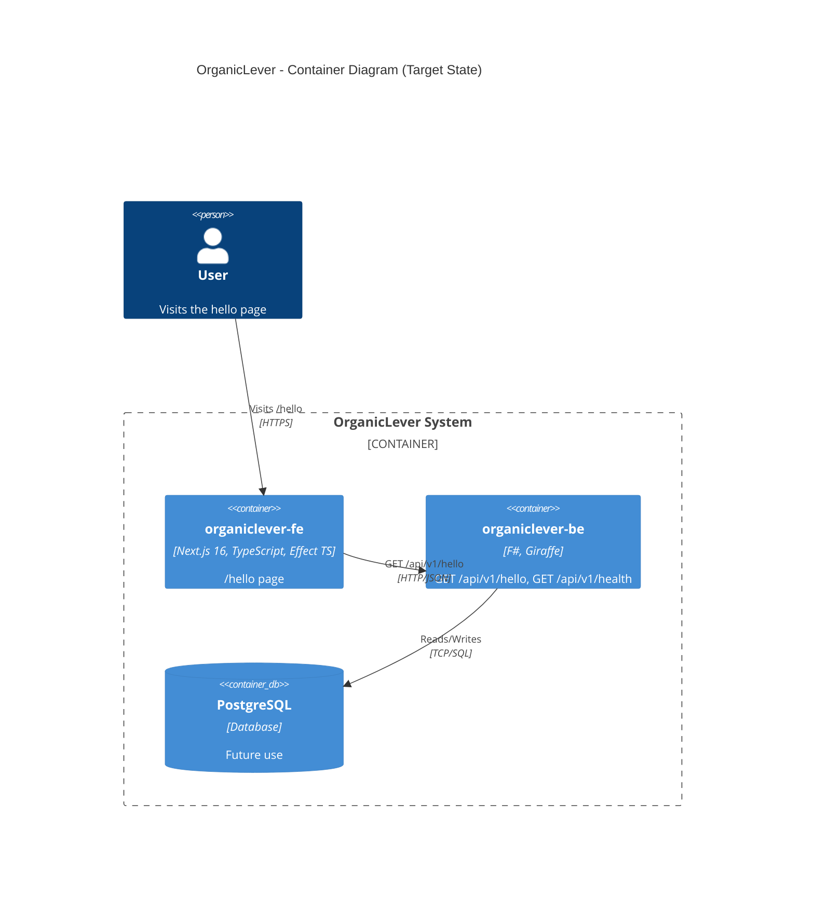

# Technical Documentation: OrganicLever Fullstack Evolution

## Architecture Overview



## Spec Structure (`specs/apps/organiclever/`)

```
specs/apps/organiclever/
├── README.md
├── c4/
│   ├── README.md
│   ├── context.md              # L1: system + user actor
│   ├── container.md            # L2: SPA, API, DB
│   ├── component-be.md         # L3: REST API internals
│   └── component-fe.md         # L3: SPA internals
├── be/
│   ├── README.md
│   └── gherkin/
│       ├── README.md
│       ├── health/
│       │   └── health-check.feature
│       └── hello/
│           └── hello-endpoint.feature
├── fe/
│   ├── README.md
│   └── gherkin/
│       ├── README.md
│       └── hello/
│           └── hello-page.feature
└── contracts/
    ├── README.md
    ├── openapi.yaml
    ├── .spectral.yaml
    ├── project.json             # Nx project: organiclever-contracts
    ├── paths/
    │   ├── hello.yaml
    │   └── health.yaml
    ├── schemas/
    │   ├── hello.yaml
    │   ├── health.yaml
    │   └── error.yaml
    └── examples/
        └── hello-response.yaml
```

### Domain Table

| Domain | BE Features | FE Features | Description              |
| ------ | ----------- | ----------- | ------------------------ |
| health | 1           | --          | Service health status    |
| hello  | 1           | 1           | Hello world endpoint/page |

### Spec Migration Map

| Existing File                                        | Action                                               |
| ---------------------------------------------------- | ---------------------------------------------------- |
| `specs/apps/organiclever-be/health/health-check.feature`    | Move to `be/gherkin/health/health-check.feature`     |
| `specs/apps/organiclever-be/hello/hello-endpoint.feature`   | Move to `be/gherkin/hello/hello-endpoint.feature`    |
| `specs/apps/organiclever-be/auth/*.feature`                 | Remove (out of scope for initial version)            |
| `specs/apps/organiclever-web/landing/*.feature`             | Remove (out of scope)                                |
| `specs/apps/organiclever-web/auth/*.feature`                | Remove (out of scope)                                |
| `specs/apps/organiclever-web/dashboard/*.feature`           | Remove (out of scope)                                |
| `specs/apps/organiclever-web/members/*.feature`             | Remove (out of scope)                                |
| (new)                                                       | Create `fe/gherkin/hello/hello-page.feature`         |

## Backend Architecture (`apps/organiclever-be`)

### Directory Structure

```
apps/organiclever-be/
├── src/
│   └── OrganicLeverBe/
│       ├── Program.fs                    # Entry point, routing, DI
│       ├── Domain/
│       │   └── Types.fs                  # Core types (HelloResponse, HealthResponse)
│       ├── Handlers/
│       │   ├── HelloHandler.fs           # GET /api/v1/hello -> {"message":"world"}
│       │   ├── HealthHandler.fs          # GET /api/v1/health -> {"status":"UP"}
│       │   └── TestHandler.fs            # Test-only utilities (reset-db)
│       ├── Infrastructure/
│       │   └── AppDbContext.fs            # EF Core DbContext (minimal, for future use)
│       └── Contracts/
│           └── ContractWrappers.fs       # CLIMutable response DTOs
├── tests/
│   └── OrganicLeverBe.Tests/
│       ├── Unit/
│       │   ├── HelloHandlerTests.fs
│       │   └── HealthHandlerTests.fs
│       └── Integration/
│           ├── HelloIntegrationTests.fs
│           └── HealthIntegrationTests.fs
├── generated-contracts/                  # From OpenAPI codegen (gitignored)
├── db/
│   └── migrations/
│       └── 001-initial-schema.sql        # Minimal schema
├── project.json
├── OrganicLeverBe.fsproj
├── docker-compose.integration.yml
├── Dockerfile.integration
├── fsharplint.json
├── dotnet-tools.json
└── README.md
```

### Routing

```fsharp
let webApp : HttpHandler =
    choose [
        subRoute "/api/v1" (choose [
            GET >=> route "/health" >=> HealthHandler.check
            GET >=> route "/hello" >=> HelloHandler.hello
        ])
    ]
```

### Hello Handler

```fsharp
module OrganicLeverBe.Handlers.HelloHandler

open Giraffe
open Microsoft.AspNetCore.Http

let hello : HttpHandler =
    fun (next: HttpFunc) (ctx: HttpContext) ->
        json {| message = "world" |} next ctx
```

### Nx Targets (project.json)

Following `demo-be-fsharp-giraffe` pattern exactly:

| Target              | Command                                    | Cacheable | Depends On          |
| ------------------- | ------------------------------------------ | --------- | ------------------- |
| `codegen`           | openapi-generator-cli generate             | Yes       | organiclever-contracts:bundle |
| `typecheck`         | dotnet build (warnings as errors)          | Yes       | codegen             |
| `lint`              | fantomas + fsharplint + fsharp-analyzers   | Yes       | --                  |
| `build`             | dotnet publish -c Release                  | Yes       | codegen             |
| `test:unit`         | dotnet test --filter Category=Unit         | Yes       | --                  |
| `test:quick`        | altcover + rhino-cli validate (90%)        | Yes       | --                  |
| `test:integration`  | docker-compose up (real PostgreSQL)        | No        | --                  |
| `dev`               | dotnet watch run (port 8202)               | No        | --                  |
| `start`             | dotnet run (port 8202)                     | No        | --                  |

## Frontend Architecture (`apps/organiclever-fe`)

### Directory Structure

```
apps/organiclever-fe/
├── src/
│   ├── app/
│   │   ├── hello/
│   │   │   └── page.tsx                  # /hello page
│   │   ├── layout.tsx
│   │   ├── page.tsx                      # Root redirect or minimal landing
│   │   ├── globals.css
│   │   └── metadata.ts
│   ├── services/
│   │   ├── errors.ts                     # Effect TS error types
│   │   ├── api-client.ts                 # Base HTTP client (Effect)
│   │   └── hello-service.ts              # Hello endpoint service
│   ├── layers/
│   │   ├── api-client-live.ts            # Live HTTP layer
│   │   └── api-client-test.ts            # Mock layer for tests
│   ├── components/
│   │   └── ui/                           # shadcn/ui components
│   └── generated-contracts/              # From OpenAPI codegen (gitignored)
├── test/
│   ├── setup.ts
│   ├── unit/
│   │   └── hello-service.unit.test.ts
│   └── integration/
│       └── hello-page.integration.test.tsx
├── project.json
├── package.json
├── next.config.mjs
├── tsconfig.json
├── vitest.config.ts
└── README.md
```

### Effect TS Service Layer

```typescript
// services/errors.ts
import { Data } from "effect"

export class NetworkError extends Data.TaggedError("NetworkError")<{
  readonly status: number
  readonly message: string
}> {}

export class ApiError extends Data.TaggedError("ApiError")<{
  readonly code: string
  readonly message: string
}> {}

// services/hello-service.ts
import { Effect, Context } from "effect"
import type { NetworkError } from "./errors"

export interface HelloResponse {
  readonly message: string
}

export class HelloService extends Context.Tag("HelloService")<
  HelloService,
  {
    readonly getMessage: () => Effect.Effect<HelloResponse, NetworkError>
  }
>() {}
```

### Hello Page

```tsx
// app/hello/page.tsx
"use client"

import { useEffect, useState } from "react"
import { Effect, Exit } from "effect"
import { HelloService } from "@/services/hello-service"
import { ApiClientLive } from "@/layers/api-client-live"

export default function HelloPage() {
  const [message, setMessage] = useState<string | null>(null)
  const [error, setError] = useState<string | null>(null)

  useEffect(() => {
    const program = Effect.gen(function* () {
      const helloService = yield* HelloService
      return yield* helloService.getMessage()
    }).pipe(Effect.provide(ApiClientLive))

    Effect.runPromiseExit(program).then((exit) => {
      if (Exit.isSuccess(exit)) {
        setMessage(exit.value.message)
      } else {
        setError("Failed to load message")
      }
    })
  }, [])

  if (error) return <div>{error}</div>
  if (!message) return <div>Loading...</div>
  return <div>{message}</div>
}
```

### Nx Targets (project.json)

Following `demo-fe-ts-nextjs` pattern:

| Target              | Command                                    | Cacheable | Depends On          |
| ------------------- | ------------------------------------------ | --------- | ------------------- |
| `codegen`           | @hey-api/openapi-ts                        | Yes       | organiclever-contracts:bundle |
| `typecheck`         | tsc --noEmit                               | Yes       | codegen             |
| `lint`              | oxlint --jsx-a11y-plugin                   | Yes       | --                  |
| `build`             | next build                                 | Yes       | codegen             |
| `test:unit`         | vitest run --project unit                  | Yes       | --                  |
| `test:quick`        | vitest coverage + rhino-cli validate (70%) | Yes       | --                  |
| `test:integration`  | vitest run --project integration (MSW)     | Yes       | --                  |
| `dev`               | next dev --port 3200                       | No        | --                  |
| `start`             | next start --port 3200                     | No        | --                  |

## E2E Test Apps

### `apps/organiclever-be-e2e/`

```
apps/organiclever-be-e2e/
├── features/                     # Generated by bddgen from specs
├── steps/                        # Step definitions
│   ├── hello.steps.ts
│   └── health.steps.ts
├── playwright.config.ts
├── project.json
├── package.json
├── tsconfig.json
└── README.md
```

Targets: `install`, `lint`, `typecheck`, `test:quick`, `test:e2e`, `test:e2e:ui`

Tags: `type:e2e`, `platform:playwright`, `lang:ts`, `domain:organiclever-be`

### `apps/organiclever-fe-e2e/`

```
apps/organiclever-fe-e2e/
├── features/                     # Generated by bddgen from specs
├── steps/                        # Step definitions
│   └── hello-page.steps.ts
├── playwright.config.ts
├── project.json
├── package.json
├── tsconfig.json
└── README.md
```

Targets: `install`, `lint`, `typecheck`, `test:quick`, `test:e2e`, `test:e2e:ui`

Tags: `type:e2e`, `platform:playwright`, `lang:ts`, `domain:organiclever-fe`

## CI/CD Pipelines

### GitHub Actions Workflows

#### `test-organiclever-be.yml` (new)

Follows `test-demo-be-fsharp-giraffe.yml` pattern:

- **Trigger**: Cron 2x daily (06:00 WIB, 18:00 WIB) + workflow_dispatch
- **Job 1 -- Integration**: Docker Compose PostgreSQL, `nx run organiclever-be:test:integration`
- **Job 2 -- E2E**: Start backend, wait for readiness, `nx run organiclever-be-e2e:test:e2e`
- **Runtimes**: .NET 10, Node.js 24

#### `test-organiclever-fe.yml` (new, replaces `test-organiclever-web.yml`)

Follows `test-demo-fe-*.yml` pattern:

- **Trigger**: Cron 2x daily + workflow_dispatch
- **Job 1 -- Integration**: `nx run organiclever-fe:test:integration`
- **Job 2 -- E2E**: Start backend + frontend, wait for readiness,
  `nx run organiclever-fe-e2e:test:e2e`
- **Runtimes**: .NET 10, Node.js 24

#### Updates to Existing Workflows

- **`main-ci.yml`**: No changes needed (`nx affected` picks up new projects automatically)
- **`pr-quality-gate.yml`**: No changes needed (same reason)
- **`test-organiclever-web.yml`**: Delete (replaced by `test-organiclever-fe.yml`)

### Vercel Deployment

- **Branch**: Rename `prod-organiclever-web` -> `prod-organiclever-fe`
  (or create new branch, update Vercel project settings)
- **Deployer agent**: Updated to reference `organiclever-fe`

## OpenAPI Contract

```yaml
# specs/apps/organiclever/contracts/openapi.yaml
openapi: "3.1.0"
info:
  title: OrganicLever API
  version: "1.0.0"
  description: REST API for OrganicLever productivity platform
servers:
  - url: http://localhost:8202
    description: Local development
paths:
  /api/v1/hello:
    $ref: "./paths/hello.yaml#/hello"
  /api/v1/health:
    $ref: "./paths/health.yaml#/health"
```

```yaml
# specs/apps/organiclever/contracts/paths/hello.yaml
hello:
  get:
    operationId: getHello
    summary: Returns a hello world message
    tags: [hello]
    responses:
      "200":
        description: Successful response
        content:
          application/json:
            schema:
              $ref: "../schemas/hello.yaml#/HelloResponse"
```

```yaml
# specs/apps/organiclever/contracts/schemas/hello.yaml
HelloResponse:
  type: object
  required: [message]
  properties:
    message:
      type: string
      description: The greeting message
      example: "world"
```

## Technology Stack

| Component          | Technology                   | Version | Notes                        |
| ------------------ | ---------------------------- | ------- | ---------------------------- |
| Backend runtime    | .NET                         | 10.0    | LTS                          |
| Backend web        | Giraffe                      | 7.x     | Functional HttpHandler       |
| Backend ORM        | EF Core (Npgsql)             | 10.x    | PostgreSQL (future use)      |
| Backend JSON       | FSharp.SystemTextJson         | Latest  | F# type serialization        |
| Backend lint       | Fantomas, FSharpLint         | Latest  | Formatting + style           |
| Backend coverage   | AltCover                     | Latest  | 90% line coverage            |
| Frontend runtime   | Node.js                      | 24.x    | LTS via Volta                |
| Frontend web       | Next.js                      | 16.x    | App Router, RSC              |
| Frontend lang      | TypeScript                   | 5.x     | Strict mode                  |
| Frontend effects   | Effect TS                    | Latest  | Error handling, DI           |
| Frontend UI        | shadcn/ui, Tailwind v4       | Latest  | Component library            |
| Frontend testing   | Vitest, MSW                  | Latest  | Unit + integration           |
| Database           | PostgreSQL                   | 17.x    | Initially minimal            |
| Contract           | OpenAPI                      | 3.1     | API-first design             |
| Codegen (BE)       | openapi-generator-cli        | Latest  | fsharp-giraffe-server        |
| Codegen (FE)       | @hey-api/openapi-ts          | Latest  | TypeScript fetch client      |
| E2E                | Playwright + bddgen          | Latest  | Gherkin-driven browser tests |

## Files to Update (Complete Inventory)

### Agents (`.claude/agents/`)

| File                                    | Action                                      |
| --------------------------------------- | ------------------------------------------- |
| `apps-organiclever-web-deployer.md`     | Rename to `apps-organiclever-fe-deployer.md`, update content |
| `README.md`                             | Update agent listings                       |
| `specs-maker.md`                        | Update example references                   |

### Skills (`.claude/skills/`)

| File/Directory                                      | Action                                      |
| --------------------------------------------------- | ------------------------------------------- |
| `apps-organiclever-web-developing-content/`         | Rename to `apps-organiclever-fe-developing-content/`, rewrite SKILL.md |

### CLAUDE.md

| Section                | Change                                              |
| ---------------------- | --------------------------------------------------- |
| Current Apps list      | Replace `organiclever-web` with `organiclever-fe` + `organiclever-be` |
| Project Structure      | Add `organiclever-be`, rename `organiclever-web`    |
| Coverage sections      | Update F# and TypeScript sections                   |
| Caching sections       | Add `organiclever-fe` MSW caching note              |
| Git Workflow           | Update production branch name                       |
| Hugo Sites section     | Rename organiclever-web section                     |
| AI Agents section      | Update deployer agent name                          |

### Governance (`governance/`)

14+ files referencing `organiclever-web` -- all need `organiclever-web` -> `organiclever-fe`
replacement and addition of `organiclever-be` where backend apps are listed.

### Docs (`docs/`)

14+ files referencing `organiclever-web` -- same replacement needed.

### GitHub Workflows (`.github/workflows/`)

| File                           | Action                                        |
| ------------------------------ | --------------------------------------------- |
| `test-organiclever-web.yml`    | Delete                                        |
| `test-organiclever-be.yml`     | Create (backend integration + E2E)            |
| `test-organiclever-fe.yml`     | Create (frontend integration + E2E)           |

### Apps

| Directory                | Action                               |
| ------------------------ | ------------------------------------ |
| `apps/organiclever-web/` | Archive to `archived/organiclever-web/` |
| `apps/organiclever-web-e2e/` | Remove (replaced by `organiclever-fe-e2e`) |
| `apps/organiclever-fe/`  | Create new                           |
| `apps/organiclever-be/`  | Create new                           |
| `apps/organiclever-fe-e2e/` | Create new                        |
| `apps/organiclever-be-e2e/` | Create new                        |

### Specs

| Directory                        | Action                             |
| -------------------------------- | ---------------------------------- |
| `specs/apps/organiclever-be/`    | Delete after migration             |
| `specs/apps/organiclever-web/`   | Delete after migration             |
| `specs/apps/organiclever/`       | Create new unified structure       |
