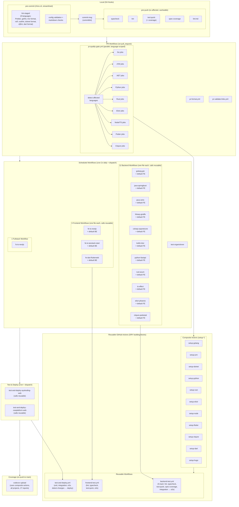

# Plan: CI/CD Standardization

**Status**: In Progress
**Created**: 2026-03-31

## Overview

This plan standardizes the entire CI/CD pipeline across the monorepo -- from local git hooks
through GitHub Actions workflows to Docker-based development and testing. The repository currently
has **22 GitHub Actions workflows**, **44 docker-compose files**, **38 Dockerfiles** (10 production, 13 integration, 13 dev, 1 CI, 1 other), a 9-step
pre-commit hook, and a 3-target pre-push gate spanning **13+ language runtimes**. Much of this
infrastructure grew organically as new backends and frameworks were added, resulting in significant
duplication, inconsistent patterns, and undocumented conventions.

**Git Workflow**: Commit to `main` (Trunk Based Development)

## Problem Statement

1. **Workflow duplication**: 11 near-identical backend test workflows (`test-a-demo-be-*.yml`)
   differ only in language setup and docker-compose paths. Adding a 12th backend means copying
   ~150 lines and making 5-10 substitutions.
2. **Monolithic PR quality gate**: A single GitHub Actions job installs 13+ language runtimes
   (Go, Java 21+25, .NET 10, Elixir, Python, Rust, Flutter, Clojure CLI, etc.) even when the PR
   only touches one app.
3. **No reusable workflow building blocks**: No composite actions or reusable workflows; every
   workflow is self-contained.
4. **Inconsistent Docker patterns**: Integration test compose files live in `apps/` while dev
   compose files live in `infra/dev/`. Dockerfiles vary in base image versions, layer ordering,
   and health check configuration.
5. **Missing CI coverage**: spec-coverage validation is implemented in rhino-cli but never invoked
   in CI. Fullstack app (`a-demo-fs-ts-nextjs`) lacks E2E workflow.
6. **Undocumented local dev workflow**: Docker Compose dev setups exist but lack a unified
   entrypoint or documentation for onboarding.
7. **No Docker layer caching in CI**: Every integration test workflow rebuilds Docker images from
   scratch.
8. **Coverage threshold rationale undocumented**: 90%/80%/75%/70% thresholds exist but the
   reasoning is implicit.

## Goals

1. **DRY CI workflows** via reusable workflows and composite actions
2. **Parallel, language-scoped PR quality gate** that only installs what's needed
3. **Standardized Docker templates** for Dockerfiles, docker-compose, and .dockerignore
4. **Spec-coverage validation** integrated into CI
5. **Documented local development** workflow with Docker Compose + autoreload
6. **Docker layer caching** in CI for faster integration/E2E test cycles
7. **Single source of truth** for CI conventions in governance docs

## Quick Links

- [Requirements](./requirements.md) -- Detailed requirements, gaps, and acceptance criteria
- [Technical Documentation](./tech-docs.md) -- Architecture, patterns, and implementation details
- [Delivery Plan](./delivery.md) -- Phased checklist with validation steps

## Scope

### In Scope

| Area                     | Description                                                                |
| ------------------------ | -------------------------------------------------------------------------- |
| Git hooks                | Pre-commit (9 steps), commit-msg, pre-push standardization                 |
| Local quality gates      | formatting, typecheck, lint, test:quick across all project types           |
| Three-level testing      | test:unit, test:integration, test:e2e for BE, FE, FS, CLI                  |
| Specs folder structure   | Directory layout, contract-driven development, Gherkin consumption         |
| GitHub Actions workflows | PR quality gate, backend/frontend test workflows, test-and-deploy, codecov |
| Local Docker development | docker-compose dev setups with autoreload for all app types                |
| CI Docker infrastructure | Integration test Dockerfiles, CI overlays, layer caching                   |
| Governance documentation | CI conventions doc in `governance/development/`                            |
| Compliance enforcement   | ci-checker/ci-fixer agents, ci-quality-gate workflow, ci-standards skill   |

### Out of Scope

- Vercel deployment configuration (covered by existing deployer agents)
- Application-level code changes (only CI/build infrastructure)
- New testing frameworks or tools (standardize what exists)
- Kubernetes deployment (future initiative)
- Monitoring/observability (separate concern)

## Workstreams

| #   | Workstream                                                                        | Phase | Dependencies                                                   |
| --- | --------------------------------------------------------------------------------- | ----- | -------------------------------------------------------------- |
| W1  | [Governance & Documentation](#w1-governance--documentation)                       | 1     | None                                                           |
| W2  | [Git Hooks Standardization](#w2-git-hooks-standardization)                        | 1     | None                                                           |
| W3  | [GitHub Actions Composite Actions](#w3-github-actions-composite-actions)          | 2     | W1                                                             |
| W4  | [PR Quality Gate Optimization](#w4-pr-quality-gate-optimization)                  | 2     | W3                                                             |
| W5  | [Backend Test Workflow DRY-up](#w5-backend-test-workflow-dry-up)                  | 3     | W3                                                             |
| W6  | [Frontend & Fullstack Test Workflows](#w6-frontend--fullstack-test-workflows)     | 3     | W3                                                             |
| W7  | [Docker Standardization](#w7-docker-standardization)                              | 2     | W1                                                             |
| W8  | [Local Development with Docker](#w8-local-development-with-docker)                | 3     | W7                                                             |
| W9  | [CI Docker Caching & Optimization](#w9-ci-docker-caching--optimization)           | 4     | W5, W7                                                         |
| W10 | [Spec-Coverage Integration](#w10-spec-coverage-integration)                       | 4     | W5                                                             |
| W11 | [Gherkin Consumption Remediation](#w11-gherkin-consumption-remediation)           | 3     | W1                                                             |
| W12 | [Specs Folder Restructuring](#w12-specs-folder-restructuring)                     | 3     | W1                                                             |
| W13 | [CLI Docker Compose Setup](#w13-cli-docker-compose-setup)                         | 3     | W7                                                             |
| W15 | [Accessibility Testing Remediation](#w15-accessibility-testing-remediation)       | 3     | W1, W11                                                        |
| W16 | [Environment Variable Standardization](#w16-environment-variable-standardization) | 3     | W7                                                             |
| W17 | [CI Compliance Enforcement](#w17-ci-compliance-enforcement)                       | 4     | W1, W14                                                        |
| W14 | [Governance Propagation](#w14-governance-propagation)                             | 4     | W1-W17 (intentionally last — depends on all other workstreams) |

## Context

### Current CI Architecture (As-Is)

```mermaid
flowchart TD
    subgraph local["Local (Git Hooks)"]
        direction LR
        subgraph precommit["pre-commit (rhino-cli, 9 steps)"]
            PC1["1. Validate .claude/.opencode config"]
            PC2["2. Validate docker-compose files"]
            PC3["3. nx affected run-pre-commit (warn only)"]
            PC4["4. Stage ayokoding-web content"]
            PC5["5. lint-staged (Prettier, gofmt, mix format)"]
            PC6["6. Sync app package-lock.json"]
            PC7["7. Validate docs file naming"]
            PC8["8. Validate markdown links"]
            PC9["9. Lint all markdown"]
            PC1 --> PC2 --> PC3 --> PC4 --> PC5 --> PC6 --> PC7 --> PC8 --> PC9
        end
        CM["commit-msg (commitlint)"]
        subgraph prepush["pre-push (nx affected, parallel)"]
            PPT["typecheck"]
            PPL["lint"]
            PPQ["test:quick"]
        end
        PPM["lint:md (sequential, after nx affected)"]
        precommit --> CM --> prepush --> PPM
    end

    subgraph pr["PR Workflows (on pull_request)"]
        direction LR
        subgraph qg["pr-quality-gate.yml (monolithic)"]
            direction LR
            QGS["Setup: 13+ runtimes in single job<br/>(Go, Java 21+25, .NET 10, Elixir,<br/>Python, Rust, Flutter, Clojure CLI,<br/>Hugo, Node/Volta)"]
            QGT["typecheck (affected)"]
            QGL["lint (affected)"]
            QGQ["test:quick (affected)"]
            QGMD["lint:md"]
            QGS --> QGT --> QGL --> QGQ --> QGMD
        end
        AF["pr-format.yml<br/>(Prettier, auto-commit)"]
        VL["pr-validate-links.yml<br/>(rhino-cli docs validate-links)"]
    end

    subgraph scheduled["Scheduled Workflows (cron 2x daily + dispatch)"]
        direction LR

        subgraph be_tests["11 Backend Test Workflows (one file each)"]
            direction LR
            BEgo["golang-gin<br/>+ default FE"]
            BEjava["java-springboot<br/>+ default FE"]
            BEjv["java-vertx<br/>+ default FE"]
            BEfs["fsharp-giraffe<br/>+ default FE"]
            BEcs["csharp-aspnetcore<br/>+ default FE"]
            BEkt["kotlin-ktor<br/>+ default FE"]
            BEpy["python-fastapi<br/>+ default FE"]
            BErs["rust-axum<br/>+ default FE"]
            BEts["ts-effect<br/>+ default FE"]
            BEex["elixir-phoenix<br/>+ default FE"]
            BEcl["clojure-pedestal<br/>+ default FE"]
        end

        subgraph be_pattern["Each Backend: integration → e2e"]
            INT["integration-tests<br/>(docker-compose + real DB)"]
            E2E["e2e<br/>(docker-compose full stack<br/>+ Playwright BE & FE)"]
            INT --> E2E
        end

        subgraph fe_tests["3 Frontend Test Workflows"]
            direction LR
            FEnx["fe-ts-nextjs<br/>+ default BE"]
            FEts["fe-ts-tanstack-start<br/>+ default BE"]
            FEdt["fe-dart-flutterweb<br/>+ default BE"]
        end

        subgraph fe_pattern["Each Frontend: e2e only"]
            FEE2E["e2e<br/>(docker-compose + Playwright)"]
        end

        subgraph fs_test["1 Fullstack Workflow"]
            FSts["fs-ts-nextjs<br/>(unit → e2e)"]
        end

        OL["test-organiclever.yml<br/>(be-integration + fe-integration<br/>→ e2e BE & FE)"]

        be_tests -.-> be_pattern
        fe_tests -.-> fe_pattern
    end

    subgraph deploy["Test & Deploy (cron + dispatch)"]
        direction LR
        subgraph aw["test-and-deploy-ayokoding-web.yml"]
            AW_U["unit"]
            AW_I["integration"]
            AW_E["e2e (docker)"]
            AW_D["detect-changes"]
            AW_DEP["deploy → prod-ayokoding-web"]
            AW_U & AW_I & AW_E & AW_D --> AW_DEP
        end
        subgraph ow["test-and-deploy-oseplatform-web.yml"]
            OW_U["unit + typecheck + lint"]
            OW_I["integration"]
            OW_E["e2e (docker)"]
            OW_D["detect-changes"]
            OW_DEP["deploy → prod-oseplatform-web"]
            OW_U & OW_I & OW_E & OW_D --> OW_DEP
        end
    end

    subgraph codecov["Coverage (on push to main)"]
        CC_S["Setup all 13+ runtimes"]
        CC_CG["Codegen all contracts"]
        CC_TC["typecheck (all, parallel)"]
        CC_TQ["test:quick (all, parallel)"]
        CC_UP["Upload 27 coverage reports<br/>(11 BE + 3 FE + 1 FS + 4 product<br/>+ 3 CLI + 3 libs + 2 content)"]
        CC_S --> CC_CG --> CC_TC --> CC_TQ --> CC_UP
    end

    local --> pr
    pr --> scheduled
    scheduled --> deploy
    deploy --> codecov
```

### Target CI Architecture (To-Be)

## Related Documentation

- [Three-Level Testing Standard](../../../governance/development/quality/three-level-testing-standard.md)
- [Code Quality](../../../governance/development/quality/code.md)
- [Markdown Quality](../../../governance/development/quality/markdown.md)
- [Nx Targets](../../../governance/development/infra/nx-targets.md)
- [Plans Organization Convention](../../../governance/conventions/structure/plans.md)
