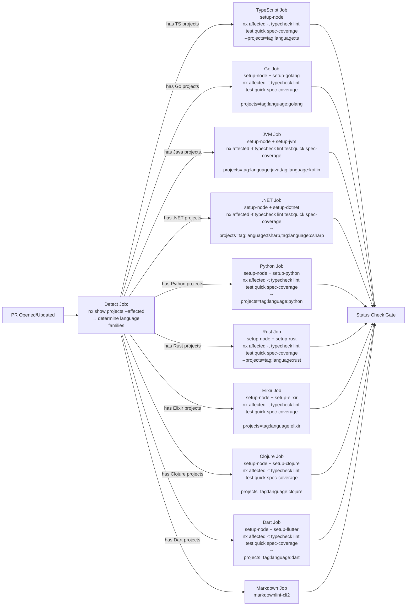

# Technical Documentation: CI/CD Standardization

## Architecture Decisions

### AD1: Reusable GitHub Actions Building Blocks

**Decision**: Create two layers of reusable GitHub Actions:

1. **Composite Actions** (`.github/actions/setup-{language}/action.yml`) -- language runtime setup
2. **Reusable Workflows** (`.github/workflows/_reusable-*.yml`) -- test orchestration patterns

**Why composite actions for language setup**: Each language requires 3-8 steps (install runtime,
install tools, configure caches, set env vars). Composite actions encapsulate this complexity and
allow independent versioning. They are called from within a job (not as a separate job), avoiding
artifact-passing overhead.

**Why reusable workflows for test orchestration**: Integration and E2E test patterns (start
Docker, wait for health, run tests, upload artifacts, teardown) are identical across backends.
Reusable workflows allow a single definition called with parameters.

#### Composite Actions Catalog

```
.github/actions/
├── setup-node/action.yml         # Node.js + npm install + Nx cache
├── setup-golang/action.yml       # Go + golangci-lint + oapi-codegen
├── setup-jvm/action.yml          # Java/Kotlin (JDK 21/25 + Maven/Gradle)
├── setup-dotnet/action.yml       # .NET 10 + Fantomas + fsharplint
├── setup-python/action.yml       # Python 3.13 + uv + datamodel-code-generator
├── setup-rust/action.yml         # Rust stable + cargo-llvm-cov
├── setup-elixir/action.yml       # Elixir 1.19 + Erlang/OTP 27
├── setup-flutter/action.yml      # Flutter stable + Dart
├── setup-clojure/action.yml      # Clojure CLI + Java 21
├── setup-playwright/action.yml   # Playwright browsers + dependencies
└── setup-docker-cache/action.yml # Docker Buildx + layer caching
```

Each composite action:

- Accepts version inputs with sensible defaults
- Configures tool-level caching (Go modules, Maven repo, pip cache, Cargo registry, Mix deps, etc.)
- Exports environment variables needed by downstream steps
- Is independently testable

#### Reusable Workflows Catalog

```
.github/workflows/
├── _reusable-backend-lint.yml          # Backend lint track
├── _reusable-backend-typecheck.yml     # Backend typecheck track
├── _reusable-backend-coverage.yml      # Backend coverage (test:quick) track
├── _reusable-backend-spec-coverage.yml # Backend spec-coverage track
├── _reusable-backend-integration.yml   # Docker-based integration tests
├── _reusable-backend-e2e.yml           # Full-stack E2E via Playwright
├── _reusable-frontend-e2e.yml          # Frontend E2E via Playwright
└── _reusable-test-and-deploy.yml       # Test + conditional deploy to prod branch
```

**Note on PR quality gate**: The per-language jobs in `pr-quality-gate.yml` run inline (using
composite actions for setup) rather than calling a separate `_reusable-quality-gate-job.yml`.
This avoids extra job-to-job artifact passing for simple `nx affected` commands.

### AD2: PR Quality Gate -- Parallel Language-Scoped Jobs

**Decision**: Replace the monolithic PR quality gate with a dynamic, multi-job workflow.

**Architecture**:



**Detection mechanism**: The first job uses a two-step approach — first get affected project names
(flat string array), then query each project's tags individually. See Pattern 4 for the complete
implementation. The single-command shortcut does NOT work because `npx nx show projects --affected
--json` returns a flat array of project name strings, not objects with tags.

Then sets GitHub Actions outputs that downstream jobs use in `if:` conditions:

```yaml
jobs:
  detect:
    outputs:
      has-ts: ${{ steps.detect.outputs.has-ts }}
      has-golang: ${{ steps.detect.outputs.has-golang }}
      # ... etc

  typescript:
    needs: detect
    if: needs.detect.outputs.has-ts == 'true'
    # ...
```

**Trade-off**: More jobs = more parallelism but more GitHub Actions overhead per job (~30s
checkout + setup). For PRs touching 1-2 languages, this is a net win. For PRs touching all
languages (rare), slightly slower due to job startup overhead but still parallel.

### AD3: Backend Test Workflow DRY-up

**Decision**: Keep 11 individual backend test workflow files (one per variant), but each calls
reusable workflows instead of duplicating ~150 lines of boilerplate. Each backend workflow pairs
with the default frontend (`a-demo-fe-ts-nextjs`) for E2E, matching the current architecture.
Similarly, each frontend workflow pairs with the default backend (`a-demo-be-golang-gin`).

**Per-variant workflow structure** (calls reusable, 5 parallel tracks per R0.4):

```yaml
# .github/workflows/test-a-demo-be-java-springboot.yml
name: "Test - Demo BE (Java/Spring Boot)"
on:
  schedule:
    - cron: "0 23 * * *" # 06:00 WIB
    - cron: "0 11 * * *" # 18:00 WIB
  workflow_dispatch:

jobs:
  # Track 1: lint (independent)
  lint:
    uses: ./.github/workflows/_reusable-backend-lint.yml
    with:
      backend-name: java-springboot
      setup-action: setup-jvm

  # Track 2: typecheck (independent)
  typecheck:
    uses: ./.github/workflows/_reusable-backend-typecheck.yml
    with:
      backend-name: java-springboot
      setup-action: setup-jvm

  # Track 3: coverage check (test:quick = test:unit + coverage validation)
  coverage:
    uses: ./.github/workflows/_reusable-backend-coverage.yml
    with:
      backend-name: java-springboot
      setup-action: setup-jvm

  # Track 4: spec-coverage (spec-to-test mapping validation)
  spec-coverage:
    uses: ./.github/workflows/_reusable-backend-spec-coverage.yml
    with:
      backend-name: java-springboot
      setup-action: setup-jvm

  # Track 5: integration → e2e (sequential chain)
  integration:
    uses: ./.github/workflows/_reusable-backend-integration.yml
    with:
      backend-name: java-springboot
      app-dir: apps/a-demo-be-java-springboot

  e2e:
    needs: integration # Sequential: integration must pass first
    uses: ./.github/workflows/_reusable-backend-e2e.yml
    with:
      backend-name: java-springboot
      compose-dir: infra/dev/a-demo-be-java-springboot
```

**5 parallel tracks**: `lint`, `typecheck`, `coverage`, and `spec-coverage` run independently.
`integration → e2e` runs as a sequential chain. A slow integration test does not block any
other track.

**Why individual files (not matrix)**: Each backend variant pairs with the default frontend for
E2E testing via its own `infra/dev/a-demo-be-{name}/docker-compose.yml`. Keeping individual
workflow files preserves clear GitHub Actions UI (one run per variant), independent failure
isolation, and straightforward dispatch for a single variant. The DRY benefit comes from
reusable workflows, reducing each caller to ~40 lines (from ~150).

### AD4: Docker Standardization

#### AD4.1: Dockerfile Templates

**Production Dockerfile template** (multi-stage):

```dockerfile
# ==============================================================================
# Stage 1: Build
# ==============================================================================
FROM {base-image} AS build

LABEL maintainer="ose-platform"
LABEL org.opencontainers.image.source="https://github.com/{repo}"

WORKDIR /app

# Copy dependency manifests first (layer caching)
COPY {dependency-files} .
RUN {install-dependencies}

# Copy source code
COPY {source-files} .
RUN {build-command}

# ==============================================================================
# Stage 2: Runtime
# ==============================================================================
FROM {runtime-image} AS runtime

# Security: non-root user
RUN addgroup -S app && adduser -S app -G app

WORKDIR /app

# Copy built artifacts
COPY --from=build --chown=app:app {build-output} .

USER app

EXPOSE {port}

HEALTHCHECK --interval=10s --timeout=3s --start-period=5s --retries=3 \
  CMD wget -qO- http://localhost:{port}/health || exit 1

ENTRYPOINT [{entrypoint}]
```

**Key standards**:

- All production Dockerfiles MUST use multi-stage builds
- All MUST create and use a non-root user (`app:app`)
- All MUST include `HEALTHCHECK` instruction
- All MUST include OCI `LABEL` metadata
- All MUST copy dependency manifests before source (layer caching)
- Health check MUST use `wget` (available in Alpine) not `curl` (requires install)

#### AD4.2: Docker Compose Conventions

**Development compose** (`infra/dev/{app}/docker-compose.yml`):

| Aspect               | Standard                                                   |
| -------------------- | ---------------------------------------------------------- |
| Database image       | `postgres:17-alpine`                                       |
| Database healthcheck | `pg_isready -U {user}` interval 2s, timeout 5s, retries 10 |
| Data volume          | Named volume `{app}-data` (persistent across restarts)     |
| Source mount         | `../../../apps/{app}:/app/apps/{app}` for hot-reload       |
| Specs mount          | `../../../specs:/app/specs:ro` (read-only)                 |
| Contracts mount      | `../../../generated-contracts:/app/generated-contracts:ro` |
| Network              | Default (no custom network unless multi-service)           |
| Port mapping         | Host port matches container port                           |

**Integration compose** (`apps/{app}/docker-compose.integration.yml`):

| Aspect           | Standard                                      |
| ---------------- | --------------------------------------------- |
| Database storage | `tmpfs: /var/lib/postgresql/data` (ephemeral) |
| Test runner      | Dedicated `Dockerfile.integration`            |
| Exit behavior    | `--abort-on-container-exit`                   |
| Cleanup          | `down -v` before `up` (clean state)           |
| Specs            | Mounted from `../../specs:/specs:ro`          |

**CI overlay compose** (`infra/dev/{app}/docker-compose.ci.yml`):

| Aspect      | Standard                                                                |
| ----------- | ----------------------------------------------------------------------- |
| Extends     | Base `docker-compose.yml`                                               |
| Environment | Production-equivalent (`GIN_MODE=release`, `NODE_ENV=production`, etc.) |
| Test API    | `ENABLE_TEST_API=true`                                                  |
| Frontend    | Adds production-built frontend service                                  |
| Database    | `tmpfs` for ephemeral data                                              |

#### AD4.3: .dockerignore Strategy

**Current**: Single root-level `.dockerignore` with re-include patterns.

**Decision**: Keep single root `.dockerignore` but standardize the pattern:

```dockerignore
# Exclude everything by default
*

# Re-include what Docker builds need
!apps/
!libs/
!specs/
!generated-contracts/
!package.json
!package-lock.json
!tsconfig*.json
!nx.json
!.npmrc

# Exclude build artifacts and caches within included dirs
**/.nx/
**/node_modules/
**/dist/
**/coverage/
**/.next/
**/target/
**/_build/
**/deps/
```

### AD5: Docker Layer Caching in CI

**Decision**: Use GitHub Actions cache with Docker Buildx for layer caching.

**Implementation**:

```yaml
# .github/actions/setup-docker-cache/action.yml
- uses: docker/setup-buildx-action@v3
- uses: actions/cache@v4
  with:
    path: /tmp/.buildx-cache
    key: docker-${{ runner.os }}-${{ hashFiles('**/Dockerfile*') }}
    restore-keys: docker-${{ runner.os }}-
```

For integration test compose files:

```yaml
# In reusable workflow
- name: Build with cache
  run: |
    docker compose -f docker-compose.integration.yml build \
      --build-arg BUILDKIT_INLINE_CACHE=1
  env:
    DOCKER_BUILDKIT: 1
    COMPOSE_DOCKER_CLI_BUILD: 1
```

**Expected impact**: 30-60% reduction in integration/E2E test times for unchanged Dockerfiles.

### AD6: Spec-Coverage Integration

**Decision**: Add `spec-coverage` Nx target to all projects that consume Gherkin specs.

**Implementation approach**:

```json
// In project.json for each testable project
{
  "targets": {
    "spec-coverage": {
      "executor": "nx:run-commands",
      "options": {
        "command": "rhino-cli spec-coverage validate specs/apps/a-demo/be/gherkin apps/a-demo-be-golang-gin"
      },
      "cache": true,
      "inputs": ["{workspaceRoot}/specs/apps/a-demo/be/gherkin/**/*.feature", "{projectRoot}/**/*.go"]
    }
  }
}
```

**CI integration**: Add `spec-coverage` to the pre-push hook and PR quality gate:

```bash
# Pre-push (amended)
npx nx affected -t typecheck lint test:quick spec-coverage --parallel="$PARALLEL"
```

**Phasing**: Start with demo backends (most mature spec coverage), then extend to frontends,
fullstack, and CLIs.

### AD7: Coverage Threshold Rationale

**Decision**: Document the rationale for coverage thresholds in governance.

See [requirements.md R0.2 Coverage Thresholds](./requirements.md#coverage-thresholds-with-rationale)
for the full rationale table. The governance doc (`ci-conventions.md`) will include this table
verbatim.

### AD8: Naming Convention Standardization

**Decision**: Formalize the existing naming patterns and fix the few inconsistencies.

**What stays the same** (already consistent):

- App directories: `{domain}-{role}-{lang}-{framework}` (e.g., `a-demo-be-golang-gin`)
- E2E apps: `{app-name}-e2e` for shared, `{parent-app}-{role}-e2e` for specific
- Workflow files: `test-{app-name}.yml`, `test-and-deploy-{app-name}.yml`, `pr-{action}.yml`
- Docker files: `Dockerfile` (production), `Dockerfile.integration` (test),
  `Dockerfile.{role}.dev` (development)
- Docker compose: `docker-compose.yml` (dev), `docker-compose.ci.yml` (CI overlay),
  `docker-compose.integration.yml` (integration test)
- infra/dev: `infra/dev/{app-name}/` (one dir per app, except OrganicLever which intentionally
  combines BE+FE in `infra/dev/organiclever/`)

**What changes**:

| Current                                                         | Proposed                                                                                                                                                 | Reason                                                                                                         |
| --------------------------------------------------------------- | -------------------------------------------------------------------------------------------------------------------------------------------------------- | -------------------------------------------------------------------------------------------------------------- |
| `test-organiclever.yml` (single workflow for BE+FE)             | Update to call reusable workflows (W6): `_reusable-backend-integration.yml` for BE integration, `_reusable-backend-e2e.yml` or custom for full-stack E2E | OrganicLever BE and FE are co-dependent; keep as a single workflow but use reusable building blocks for DRY-up |
| `docker-compose.ci-e2e.yml` (Elixir only)                       | Merge into existing `docker-compose.ci.yml`, then delete `docker-compose.ci-e2e.yml` (`ci.yml` already exists so rename is not possible)                 | Eliminate the unique naming exception                                                                          |
| CLI specs at `specs/apps/{cli}/domain/` (no `gherkin/` nesting) | Restructure to `specs/apps/{cli}/cli/gherkin/` (W12)                                                                                                     | Align with the `{role}/gherkin/` standard used by all other app types                                          |

**New artifact naming conventions**:

| Artifact                  | Pattern                                       | Prefix/Suffix                                         |
| ------------------------- | --------------------------------------------- | ----------------------------------------------------- |
| Composite action          | `.github/actions/setup-{tool}/action.yml`     | `setup-` prefix                                       |
| Reusable workflow         | `.github/workflows/_reusable-{purpose}.yml`   | `_reusable-` prefix (underscore = internal)           |
| Per-variant test workflow | `.github/workflows/test-a-demo-be-{name}.yml` | `test-` prefix, one file per variant (calls reusable) |
| npm dev script            | `dev:{app-name}`                              | `dev:` prefix                                         |

### AD9: Local Development Entrypoint

**Decision**: Create a unified `npm run dev:{app}` entrypoint for Docker-based local development.

**Implementation** in root `package.json`:

```json
{
  "scripts": {
    "dev:a-demo-be-golang-gin": "docker compose -f infra/dev/a-demo-be-golang-gin/docker-compose.yml up",
    "dev:a-demo-be-java-springboot": "docker compose -f infra/dev/a-demo-be-java-springboot/docker-compose.yml up",
    "dev:organiclever": "docker compose -f infra/dev/organiclever/docker-compose.yml up",
    "dev:a-demo-fe-ts-nextjs": "docker compose -f infra/dev/a-demo-fe-ts-nextjs/docker-compose.yml up"
  }
}
```

Complement with an updated **how-to guide** at `docs/how-to/hoto__local-dev-docker.md` covering:

- Prerequisites (Docker, Docker Compose)
- Starting a single backend
- Starting full stack (backend + frontend + database)
- Environment variable configuration
- Database seeding
- Troubleshooting common issues
- Port mapping reference

## Implementation Patterns

### Pattern 1: Composite Action Structure

```yaml
# .github/actions/setup-golang/action.yml
name: "Setup Go Environment"
description: "Install Go, golangci-lint, and oapi-codegen with caching"

inputs:
  go-version:
    description: "Go version to install"
    required: false
    default: "1.26"
  golangci-lint-version:
    description: "golangci-lint version"
    required: false
    default: "v2.10.1"

runs:
  using: "composite"
  steps:
    - name: Setup Go
      uses: actions/setup-go@v5
      with:
        go-version: ${{ inputs.go-version }}
        cache-dependency-path: "**/go.sum"

    - name: Install golangci-lint
      uses: golangci/golangci-lint-action@v6
      with:
        version: ${{ inputs.golangci-lint-version }}
        install-mode: binary
        args: --version # Just install, don't lint

    - name: Install oapi-codegen
      shell: bash
      run: go install github.com/oapi-codegen/oapi-codegen/v2/cmd/oapi-codegen@latest
```

### Pattern 2: Reusable Backend Integration Test Workflow

```yaml
# .github/workflows/_reusable-backend-integration.yml
name: "Backend Integration Tests"
on:
  workflow_call:
    inputs:
      backend-name:
        required: true
        type: string
      app-dir:
        required: true
        type: string
      compose-file:
        required: false
        type: string
        default: "docker-compose.integration.yml"

jobs:
  integration:
    name: "Integration: ${{ inputs.backend-name }}"
    runs-on: ubuntu-latest
    timeout-minutes: 15
    steps:
      - uses: actions/checkout@v4

      - name: Run integration tests
        working-directory: ${{ inputs.app-dir }}
        run: |
          docker compose -f ${{ inputs.compose-file }} down -v
          docker compose -f ${{ inputs.compose-file }} up \
            --abort-on-container-exit --build
        env:
          DOCKER_BUILDKIT: 1

      - name: Teardown
        if: always()
        working-directory: ${{ inputs.app-dir }}
        run: docker compose -f ${{ inputs.compose-file }} down -v
```

### Pattern 3: Reusable Backend E2E Test Workflow

```yaml
# .github/workflows/_reusable-backend-e2e.yml
name: "Backend E2E Tests"
on:
  workflow_call:
    inputs:
      backend-name:
        required: true
        type: string
      compose-dir:
        required: true
        type: string
      health-url:
        required: false
        type: string
        default: "http://localhost:8201/health"
      health-timeout:
        required: false
        type: number
        default: 360

jobs:
  e2e:
    name: "E2E: ${{ inputs.backend-name }}"
    runs-on: ubuntu-latest
    timeout-minutes: 20
    steps:
      - uses: actions/checkout@v4

      - uses: ./.github/actions/setup-node
      - uses: ./.github/actions/setup-golang # For contract codegen

      - name: Install dependencies & generate contracts
        run: |
          npm ci
          npx nx run a-demo-contracts:bundle
          npx nx run a-demo-be-e2e:codegen 2>/dev/null || true

      - name: Start full stack
        working-directory: ${{ inputs.compose-dir }}
        run: |
          docker compose -f docker-compose.yml -f docker-compose.ci.yml up -d --build
        env:
          DOCKER_BUILDKIT: 1

      - name: Wait for services
        run: |
          # Note: curl runs on the ubuntu-latest runner where curl is pre-installed.
          # The wget requirement in AD4.1 applies to HEALTHCHECK inside Alpine Docker
          # containers only -- not to CI runner scripts.
          timeout ${{ inputs.health-timeout }} bash -c \
            'until curl -sf ${{ inputs.health-url }}; do sleep 2; done'

      - name: Install Playwright
        run: npx nx run a-demo-be-e2e:install

      - name: Run E2E tests
        run: npx nx run a-demo-be-e2e:test:e2e

      - name: Upload test report
        uses: actions/upload-artifact@v4
        if: always()
        with:
          name: playwright-report-${{ inputs.backend-name }}
          path: apps/a-demo-be-e2e/playwright-report/
          retention-days: 7

      - name: Teardown
        if: always()
        working-directory: ${{ inputs.compose-dir }}
        run: docker compose -f docker-compose.yml -f docker-compose.ci.yml down -v
```

### Pattern 4: Detection Job for PR Quality Gate

```yaml
# Part of .github/workflows/pr-quality-gate.yml
jobs:
  detect:
    name: "Detect affected languages"
    runs-on: ubuntu-latest
    outputs:
      has-ts: ${{ steps.detect.outputs.has-ts }}
      has-golang: ${{ steps.detect.outputs.has-golang }}
      has-jvm: ${{ steps.detect.outputs.has-jvm }}
      has-dotnet: ${{ steps.detect.outputs.has-dotnet }}
      has-python: ${{ steps.detect.outputs.has-python }}
      has-rust: ${{ steps.detect.outputs.has-rust }}
      has-elixir: ${{ steps.detect.outputs.has-elixir }}
      has-clojure: ${{ steps.detect.outputs.has-clojure }}
      has-dart: ${{ steps.detect.outputs.has-dart }}
      has-markdown: ${{ steps.detect.outputs.has-markdown }}
    steps:
      - uses: actions/checkout@v4
        with:
          fetch-depth: 0 # Full history for nx affected

      - uses: ./.github/actions/setup-node

      - name: Detect affected language families
        id: detect
        run: |
          # Get all tags from affected projects
          TAGS=$(npx nx show projects --affected --json 2>/dev/null | \
            jq -r '.[]' | while read proj; do
              npx nx show project "$proj" --json 2>/dev/null | jq -r '.tags[]' 2>/dev/null
            done | sort -u)

          # Set outputs based on detected language tags
          echo "has-ts=$(echo "$TAGS" | grep -q 'language:ts' && echo true || echo false)" >> $GITHUB_OUTPUT
          echo "has-golang=$(echo "$TAGS" | grep -q 'language:golang' && echo true || echo false)" >> $GITHUB_OUTPUT
          echo "has-jvm=$(echo "$TAGS" | grep -qE 'language:(java|kotlin)' && echo true || echo false)" >> $GITHUB_OUTPUT
          echo "has-dotnet=$(echo "$TAGS" | grep -qE 'language:(fsharp|csharp)' && echo true || echo false)" >> $GITHUB_OUTPUT
          echo "has-python=$(echo "$TAGS" | grep -q 'language:python' && echo true || echo false)" >> $GITHUB_OUTPUT
          echo "has-rust=$(echo "$TAGS" | grep -q 'language:rust' && echo true || echo false)" >> $GITHUB_OUTPUT
          echo "has-elixir=$(echo "$TAGS" | grep -q 'language:elixir' && echo true || echo false)" >> $GITHUB_OUTPUT
          echo "has-clojure=$(echo "$TAGS" | grep -q 'language:clojure' && echo true || echo false)" >> $GITHUB_OUTPUT
          echo "has-dart=$(echo "$TAGS" | grep -q 'language:dart' && echo true || echo false)" >> $GITHUB_OUTPUT

          # Check for markdown changes
          CHANGED=$(git diff --name-only origin/main...HEAD)
          echo "has-markdown=$(echo "$CHANGED" | grep -q '\.md$' && echo true || echo false)" >> $GITHUB_OUTPUT
```

### Pattern 5: Lint-Staged with All Languages

Extend `lint-staged` in `package.json` to cover all languages:

```json
{
  "lint-staged": {
    "*.{js,jsx,ts,tsx,mjs,cjs}": "prettier --write",
    "*.json": "prettier --write",
    "*.go": "gofmt -w",
    "*.fs": "fantomas",
    "*.{ex,exs}": "mix format",
    "*.py": "ruff format",
    "*.rs": "rustfmt",
    "*.cs": "dotnet format whitespace --include",
    "*.clj": "cljfmt fix",
    "*.dart": "dart format",
    "*.md": "prettier --write",
    "*.{yml,yaml}": "prettier --write",
    "*.{css,scss}": "prettier --write"
  }
}
```

**Note**: Some formatters (mix format, cljfmt, dart format) may need wrapper scripts to handle
monorepo paths correctly. Test each integration before committing.

## File Inventory

### New Files to Create

| File                                                    | Purpose                                 |
| ------------------------------------------------------- | --------------------------------------- |
| `.github/actions/setup-node/action.yml`                 | Node.js + npm composite action          |
| `.github/actions/setup-golang/action.yml`               | Go composite action                     |
| `.github/actions/setup-jvm/action.yml`                  | Java/Kotlin composite action            |
| `.github/actions/setup-dotnet/action.yml`               | .NET composite action                   |
| `.github/actions/setup-python/action.yml`               | Python composite action                 |
| `.github/actions/setup-rust/action.yml`                 | Rust composite action                   |
| `.github/actions/setup-elixir/action.yml`               | Elixir composite action                 |
| `.github/actions/setup-flutter/action.yml`              | Flutter/Dart composite action           |
| `.github/actions/setup-clojure/action.yml`              | Clojure composite action                |
| `.github/actions/setup-playwright/action.yml`           | Playwright composite action             |
| `.github/actions/setup-docker-cache/action.yml`         | Docker Buildx + caching                 |
| `.github/workflows/_reusable-backend-lint.yml`          | Backend lint reusable workflow          |
| `.github/workflows/_reusable-backend-typecheck.yml`     | Backend typecheck reusable workflow     |
| `.github/workflows/_reusable-backend-coverage.yml`      | Backend coverage reusable workflow      |
| `.github/workflows/_reusable-backend-spec-coverage.yml` | Backend spec-coverage reusable workflow |
| `.github/workflows/_reusable-backend-integration.yml`   | Backend integration test workflow       |
| `.github/workflows/_reusable-backend-e2e.yml`           | Backend E2E test workflow               |
| `.github/workflows/_reusable-frontend-e2e.yml`          | Frontend E2E test workflow              |
| `.github/workflows/_reusable-test-and-deploy.yml`       | Test + deploy workflow                  |
| `governance/development/infra/ci-conventions.md`        | CI conventions governance doc           |
| `.claude/agents/ci-checker.md`                          | CI compliance checker agent             |
| `.claude/agents/ci-fixer.md`                            | CI compliance fixer agent               |
| `.claude/skills/ci-standards/SKILL.md`                  | CI standards inline skill               |
| `governance/workflows/ci/ci-quality-gate.md`            | CI compliance quality gate workflow     |

### Files to Update (existing, not new)

| File                                          | Purpose                    |
| --------------------------------------------- | -------------------------- |
| `docs/how-to/hoto__local-dev-docker.md`       | Local dev how-to guide     |
| `docs/how-to/hoto__add-new-a-demo-backend.md` | Adding a new backend to CI |

### Files to Modify

| File                                    | Change                                         |
| --------------------------------------- | ---------------------------------------------- |
| `.github/workflows/pr-quality-gate.yml` | Refactor to parallel language-scoped jobs      |
| `.github/workflows/codecov-upload.yml`  | Use composite actions for language setup       |
| `.husky/pre-commit`                     | Consolidate Elixir formatting into lint-staged |
| `package.json`                          | Extend lint-staged, add dev:\* scripts         |
| Various `project.json` files            | Add `spec-coverage` target                     |

### Files to Rewrite (refactor to call reusable workflows)

| File                                                     | Change                                                                                                                                                                                                                                                          |
| -------------------------------------------------------- | --------------------------------------------------------------------------------------------------------------------------------------------------------------------------------------------------------------------------------------------------------------- |
| `.github/workflows/test-a-demo-be-golang-gin.yml`        | Rewrite to call reusable workflows (~40 lines)                                                                                                                                                                                                                  |
| `.github/workflows/test-a-demo-be-java-springboot.yml`   | Rewrite to call reusable workflows (~40 lines)                                                                                                                                                                                                                  |
| `.github/workflows/test-a-demo-be-java-vertx.yml`        | Rewrite to call reusable workflows (~40 lines)                                                                                                                                                                                                                  |
| `.github/workflows/test-a-demo-be-python-fastapi.yml`    | Rewrite to call reusable workflows (~40 lines)                                                                                                                                                                                                                  |
| `.github/workflows/test-a-demo-be-rust-axum.yml`         | Rewrite to call reusable workflows (~40 lines)                                                                                                                                                                                                                  |
| `.github/workflows/test-a-demo-be-kotlin-ktor.yml`       | Rewrite to call reusable workflows (~40 lines)                                                                                                                                                                                                                  |
| `.github/workflows/test-a-demo-be-fsharp-giraffe.yml`    | Rewrite to call reusable workflows (~40 lines)                                                                                                                                                                                                                  |
| `.github/workflows/test-a-demo-be-csharp-aspnetcore.yml` | Rewrite to call reusable workflows (~40 lines)                                                                                                                                                                                                                  |
| `.github/workflows/test-a-demo-be-clojure-pedestal.yml`  | Rewrite to call reusable workflows (~40 lines)                                                                                                                                                                                                                  |
| `.github/workflows/test-a-demo-be-elixir-phoenix.yml`    | Rewrite to call reusable workflows (~40 lines)                                                                                                                                                                                                                  |
| `.github/workflows/test-a-demo-be-ts-effect.yml`         | Rewrite to call reusable workflows (~40 lines)                                                                                                                                                                                                                  |
| `.github/workflows/test-a-demo-fe-ts-nextjs.yml`         | Rewrite to call reusable workflows (~30 lines)                                                                                                                                                                                                                  |
| `.github/workflows/test-a-demo-fe-dart-flutterweb.yml`   | Rewrite to call reusable workflows (~30 lines)                                                                                                                                                                                                                  |
| `.github/workflows/test-a-demo-fe-ts-tanstack-start.yml` | Rewrite to call reusable workflows (~30 lines)                                                                                                                                                                                                                  |
| `.github/workflows/test-a-demo-fs-ts-nextjs.yml`         | Rewrite to call `_reusable-backend-integration.yml` + `_reusable-backend-e2e.yml` with FS-specific inputs (~30 lines); no separate fullstack reusable workflow needed since the FS app uses Next.js route handlers (same integration + E2E pattern as backends) |

### Files to Delete (out-of-standards or superseded)

| File                                                                       | Reason                                                                                          | Deleted In |
| -------------------------------------------------------------------------- | ----------------------------------------------------------------------------------------------- | ---------- |
| `infra/dev/a-demo-be-elixir-phoenix/docker-compose.ci-e2e.yml`             | Merged into `docker-compose.ci.yml` (W7); non-standard naming exception eliminated              | W7         |
| `pr-quality-gate.yml.bak`                                                  | Temporary backup created during PR quality gate refactor (W4); no longer needed post-validation | Cleanup    |
| Redundant FE `test:integration` targets in `project.json` (not file-level) | FE apps require unit + e2e only; `test:integration` removed from FE project configs             | W11        |

**Net change**: Create ~26 new files (11 composite actions + 8 reusable workflows + 3 docs +
2 agents + 1 skill + 1 workflow),
rewrite 15 workflow files from ~150 lines each to ~30-40 lines each, delete 2 files. Total
per-variant workflow YAML reduced from ~150 lines to ~40 lines (each calls reusable workflows
for the heavy lifting).

## Risks and Mitigations

| Risk                                          | Impact | Likelihood | Mitigation                                                                        |
| --------------------------------------------- | ------ | ---------- | --------------------------------------------------------------------------------- |
| Reusable workflow call overhead               | Low    | Medium     | Each reusable workflow call adds ~10s overhead; net savings from DRY far outweigh |
| Detection job adds latency to PR gate         | Low    | High       | Detection job is fast (~30s); net savings from skipping unused runtimes is 5-8min |
| Docker layer cache misses in CI               | Low    | Medium     | Use content-addressable cache keys; fall back gracefully to full rebuild          |
| lint-staged formatters fail for new languages | Medium | Medium     | Test each formatter integration in isolation before merging                       |
| Reusable workflow version pinning             | Low    | Low        | Pin to commit SHAs or branch refs within same repo                                |
| Breaking existing pre-commit/pre-push hooks   | High   | Low        | Phase changes incrementally; test locally before merging                          |
