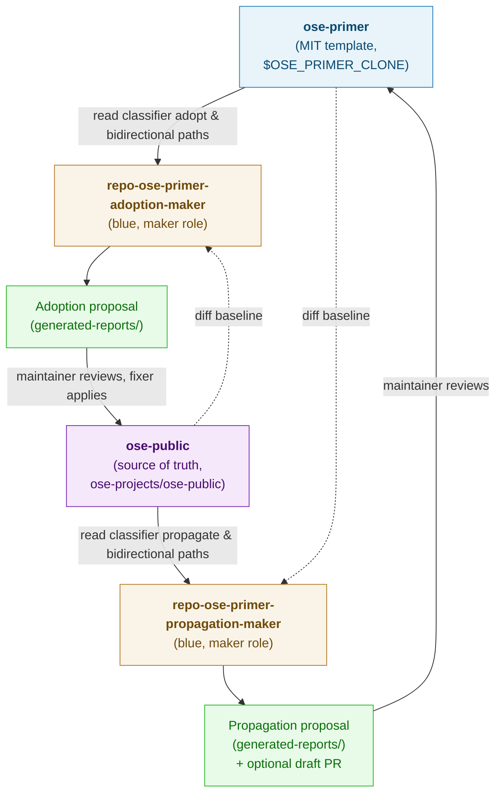

# ose-primer Separation

**Status**: In Progress
**Created**: 2026-04-18
**Structure**: Multi-file (five documents — see [Plans Organization Convention](../../../governance/conventions/structure/plans.md))

**Scope headline**: (a) extract the `a-demo-*` polyglot showcase from `ose-public` to `ose-primer`'s stewardship, sharpening `ose-public` to product + governance only; (b) stand up a bidirectional sync infrastructure (two agents, one classifier, one shared skill) so future generic changes in either repo can flow the other way with auditable, human-reviewed proposals.

## Plan Documents

- [**README.md**](./README.md) — this file; context, scope, navigation.
- [**brd.md**](./brd.md) — Business Requirements Document: why bidirectional sync matters, business impact, affected roles, business-level success metrics, business risks and mitigations.
- [**prd.md**](./prd.md) — Product Requirements Document: personas, user stories, Gherkin acceptance criteria, product scope.
- [**tech-docs.md**](./tech-docs.md) — Technical documentation: architecture, classifier, agent specs, shared skill, governance doc outline, safety rules, reporting format.
- [**delivery.md**](./delivery.md) — Sequential, ticked delivery checklist.

## Context

[`wahidyankf/ose-primer`](https://github.com/wahidyankf/ose-primer) is a public, MIT-licensed template repository derived from `ose-public`. It packages the OSE-style Nx monorepo scaffolding — the eleven polyglot backend demos, three frontend variants, the shared OpenAPI contracts layer, `rhino-cli`, the six-layer governance hierarchy, the maker/checker/fixer agent framework, the dual-mode `.claude/` / `.opencode/` configuration, and the Husky + lint-staged + commitlint quality gates — with product-specific content (OrganicLever, AyoKoding, OSE Platform site) stripped out. It is published under MIT to let downstream adopters relicense freely.

The relationship between `ose-public` and `ose-primer` is **bidirectional** but **asymmetric**:

- **Propagation (`ose-public` → `ose-primer`, majority direction)**: Generic, non-product artifacts created or updated in `ose-public` — new conventions, new workflows, new generic agents/skills, new demo apps, governance refinements, polyglot toolchain bumps — SHOULD flow to `ose-primer` to keep the template in sync with the source of truth.
- **Adoption (`ose-primer` → `ose-public`, minority direction)**: Improvements made while maintaining the template in isolation — cleaner wording freed from product context, generic abstractions extracted when pulling product references out, template-specific conventions that turn out to be generally valuable, upstream tooling bumps applied to the template first — SHOULD be surfaced back to `ose-public` for consideration.

Today, neither direction is operationalised. The template is manually maintained without tooling, and nothing inside `ose-public` even mentions `ose-primer`. This plan introduces two specialised AI agents and the supporting infrastructure to make the sync systematic, auditable, and safe.

**The separation step**: The `a-demo-*` polyglot showcase (11 backend demos spanning Go/Java/Python/Rust/Elixir/F#/Kotlin/C#/Clojure/TypeScript/Java-Vertx, 3 frontend variants, a fullstack example, the shared OpenAPI contracts spec, the demo E2E suites, and all associated GitHub Actions workflows) is the canonical reason `ose-primer` exists as a template. Keeping two copies — one in `ose-public`, one in `ose-primer` — doubles maintenance cost, doubles CI burden, and creates silent drift between the template and the source. The primer already contains the demos (it was derived from `ose-public`), so this plan **extracts the demos from `ose-public`** as a one-time event. After extraction, `ose-primer` is the authoritative home of the polyglot showcase; `ose-public` is the authoritative home of product apps (OrganicLever, AyoKoding, OSE Platform) and the governance/skills/agents layer that both repos share. The bidirectional sync then keeps the shared layer aligned; the demo layer lives in one place.

## Scope

### Affected Subrepo / App

- `ose-public` only for the scaffolding of agents, governance, skills, cross-references.
- `ose-primer` is touched as an **external target** by the propagator agent and as an **external source** by the adopter agent. Changes in `ose-primer` are surfaced via proposals/PRs reviewed by the maintainer, never auto-applied.

### In Scope

1. **Awareness layer** — Cross-references so `ose-public` contributors and AI agents know `ose-primer` exists: edits to `README.md`, `CLAUDE.md`, `AGENTS.md`; new `docs/reference/related-repositories.md`; new `governance/conventions/structure/ose-primer-sync.md` policy doc.
2. **Classifier layer** — An authoritative table (lives in the new governance doc) naming every top-level path in `ose-public` as `propagate` (goes to primer), `adopt` (comes from primer), `bidirectional` (both), or `neither` (product-specific or repo-specific).
3. **Shared skill** — A new skill under `.claude/skills/repo-syncing-with-ose-primer/` documenting the classifier, access pattern to the primer clone, report format, and safety rules. Consumed by both agents.
4. **Workflow orchestrations** — Two new workflow documents under `governance/workflows/repo/`:
   - `repo-ose-primer-sync-execution.md` — the ongoing sync cycle: primer-clone refresh → classifier parse → adopter-maker or propagator-maker dry-run → human review → optional apply → verify. Parameterised by direction (`adopt` | `propagate`) and mode (`dry-run` | `apply`). Reusable every time a sync pass is needed.
   - `repo-ose-primer-extraction-execution.md` — the one-time extraction orchestrator: parity-check gate → catch-up propagation loop on failure → Commit A–H sequence → post-extraction verification. Pattern-reusable if a future plan extracts another app family (e.g., extract product-specific content to a separate repo), though the current extraction scope is hard-coded to `a-demo-*` and `specs/apps/a-demo/`.
     Both workflows conform to the [Workflow Naming Convention](../../../governance/conventions/structure/workflow-naming.md) — scope=`repo`, qualifier=`ose-primer-sync` / `ose-primer-extraction`, type=`execution` (forward procedure per invocation, not iterative zero-finding termination). Workflow bodies follow [repo-defining-workflows](../../../.claude/skills/repo-defining-workflows/SKILL.md) patterns: YAML frontmatter (name, goal, termination, inputs, outputs), phase breakdown, agent coordination, Gherkin success criteria.
5. **Agent: `repo-ose-primer-adoption-maker`** (blue, maker, **Opus**) — Reads the local primer clone, diffs against `ose-public` for `adopt`/`bidirectional` paths, produces an **adoption proposal** report in `generated-reports/`. Does NOT auto-apply; maintainer or an existing fixer applies after review. Invoked by `repo-ose-primer-sync-execution` workflow with `direction=adopt`.
6. **Agent: `repo-ose-primer-propagation-maker`** (blue, maker, **Opus**) — Diffs `ose-public` against the local primer clone for `propagate`/`bidirectional` paths, produces a **propagation proposal** report in `generated-reports/`. Can optionally apply the proposal to a branch in the local primer clone and open a draft PR against `wahidyankf/ose-primer:main` when the maintainer authorises it. Supports a third `parity-check` mode used by the extraction workflow. Invoked by both workflows (sync with `direction=propagate`; extraction with `mode=parity-check` and later `mode=apply` for catch-ups).
7. **Model choice: Opus for both agents.** Rationale: the agents perform high-stakes cross-repo judgment (FSL-leak prevention, transform-boundary detection on `strip-product-sections`, classifier-edge-case handling, nuance-preservation during adoption). Invocation frequency is low (a few times per week at most), so token-cost premium over Sonnet is negligible. Stakes (public template repo, licensing exposure, possible demo-content loss) justify the stronger reasoning. The parity-check mode is mechanical in isolation but benefits from Opus when edge cases (line-ending normalisation, BOM differences, timestamp ambiguity) arise.
8. **Smoke-test runs** — A first-pass dry run of both agents (via the sync workflow in dry-run mode) against the current state of both repos to validate the classifier and report format; no mandatory application of findings.
9. **Demo extraction (one-time)** — Executed via `repo-ose-primer-extraction-execution` workflow. Removes from `ose-public` the 17 `a-demo-*` app directories under `apps/`, the `specs/apps/a-demo/` spec area, the 14 `test-a-demo-*.yml` GitHub Actions workflows, the demo-specific rows in `codecov.yml` and root configuration files (`go.work`, `open-sharia-enterprise.sln`, `nx.json` target defaults if any), the demo-specific reference doc (`docs/reference/demo-apps-ci-coverage.md`), all demo references from `README.md`/`CLAUDE.md`/`AGENTS.md`/`ROADMAP.md`, and any demo-scoped scripts. The primer already has the demos; `ose-public` sheds them. Pre-flight is a **primer-parity verification**: the propagation-maker confirms the primer's demos are at-least-as-current as `ose-public`'s copies before the removal commits land.
10. **Post-extraction cleanup** — Re-verify that product apps (OrganicLever, AyoKoding, OSE Platform), `rhino-cli` (trimmed), `libs/golang-commons`, and all generic governance/skills/agents remain green after the removal: `npm install`, `npm run doctor`, `nx affected -t typecheck lint test:quick spec-coverage`, product E2E, markdown lint, `nx run rhino-cli:test:quick`. Any lingering demo-reference gets caught here. Part of the extraction workflow's terminal phase.
11. **Library cleanup (Commit I of the extraction sequence)** — Delete four `libs/` entries that become orphans after demo removal: `libs/clojure-openapi-codegen/` (only consumer was the extracted Clojure backend), `libs/elixir-cabbage/`, `libs/elixir-gherkin/`, `libs/elixir-openapi-codegen/` (all three used only by the extracted Elixir backend). Update `libs/README.md`. Explicitly kept: `libs/golang-commons/` (consumed by all Go CLIs), `libs/hugo-commons/` (still imported by `ayokoding-cli` + `oseplatform-cli` despite Hugo sites being migrated — flagged for a future cleanup plan, not this one), `libs/ts-ui/` + `libs/ts-ui-tokens/` (consumed by `organiclever-fe`).
12. **`rhino-cli` trim (Commit J of the extraction sequence)** — Remove three demo-only commands and their supporting code: `java validate-annotations` (Java backends only), `contracts java-clean-imports` (Java backend OpenAPI codegen only), `contracts dart-scaffold` (Flutter/Dart frontend only). Also remove the now-empty parent grouping commands (`java`, `contracts`) and the `internal/java/` subpackage. Update `apps/rhino-cli/README.md`, `CLAUDE.md` (drop the `(includes java validate-annotations)` parenthetical), and any Gherkin features under `specs/apps/rhino/` naming the removed commands. Commands explicitly NOT trimmed: `test-coverage validate` format parsers (inert dead code for unused formats is acceptable; trimming is a separate follow-up), `doctor` toolchain coverage, `agents-*`, `workflows-*`, `docs validate-links`, `env-*`, `git pre-commit`, `git pre-push`, `spec-coverage validate`.

### Out of Scope

- **Fully automated, scheduled sync** — No cron, no scheduled agent invocation, no auto-PR. Humans invoke the agents and review every proposal. Future scheduling is a separate plan.
- **A checker/fixer triad for sync** — The maker pair is sufficient for MVP; adding `repo-ose-primer-adoption-checker` / `repo-ose-primer-adoption-fixer` (and the propagation counterparts) is a future enhancement.
- **`ose-infra` and parent `ose-projects` awareness** — Covered separately if ever needed.
- **Governance changes to `ose-primer` itself** — That repo's own lifecycle and conventions are out of scope; this plan only cross-syncs shared artifacts.
- **License conversion across the boundary** — `ose-public` product apps are FSL-1.1-MIT, `ose-primer` is MIT. This plan classifies FSL-licensed product artifacts as `neither` (not propagated) and does not attempt license bridging.
- **New role token in the [Agent Naming Convention](../../../governance/conventions/structure/agent-naming.md)** — Analysed in `tech-docs.md`; conclusion is that `maker` suffices because both agents produce proposal artifacts. No convention amendment required.
- **Polyglot toolchain rationalisation** — After demo extraction, many of the 18+ toolchains `npm run doctor` enforces become unused in `ose-public` (Clojure, C#, Dart, Kotlin, Rust, Ktor-Kotlin variant, etc.). Trimming doctor's scope is a logical follow-up but is **out of scope here** to keep this plan focused; `scripts/doctor/` stays as-is. A separate follow-up plan can decide which toolchains to drop.
- **Rewriting demo-adjacent governance docs as product-generic** — Docs like `governance/development/quality/three-level-testing-standard.md` originally anchored on demo-be. After extraction, these docs remain valid as generic principles but their examples may reference demos that no longer exist. Updating example paths to point at product apps (or at `ose-primer` externally) is a docs-quality follow-up; this plan only removes the broken inbound links within `ose-public` and does not rewrite the docs substantively.
- **Reviving or re-introducing demos in `ose-public`** — The extraction is one-way. New demo apps SHOULD be authored in `ose-primer` directly; the propagation-maker does not know how to propagate new demos back because the classifier tags `apps/a-demo-*` as `neither` post-extraction.

### Worktree Requirements

- **Plan execution location**: `ose-public/` root. Trunk-based development on `main`. No worktree required from the `ose-public` perspective.
- **Parent-level worktree rule**: Per the [Subrepo Worktree Workflow Convention](../../../../governance/conventions/structure/subrepo-worktrees.md) (parent-level), worktrees are mandatory when a plan's Scope names `ose-public` **from a parent-rooted session**. This plan lives inside `ose-public/plans/` and is executed from inside `ose-public` directly, so the parent-level worktree rule does not apply here.
- **Primer clone location**: resolved from the `OSE_PRIMER_CLONE` environment variable (convention default: `~/ose-projects/ose-primer`, a sibling of the `ose-public` checkout). Path is user-chosen; the env var keeps this plan and the synced agents/skills/workflows machine-agnostic. Treated as an ephemeral, re-clonable cache — not a gitlink of either repo. Both sync agents manage their own `git fetch` and branch operations inside that clone and are responsible for leaving it on `main` with a clean tree between invocations.

## Approach Summary

**Key invariants** (elaborated in `tech-docs.md`):

- Neither agent auto-applies changes. Every apply step is gated on explicit maintainer approval.
- The classifier is defined once (in the new governance doc) and consumed by both agents and any future checker/fixer pair.
- Reports live under `generated-reports/` with UUID chains and UTC+7 timestamps; the shared skill's `reference/report-schema.md` specifies the exact filename pattern, frontmatter, and section layout consumed by both agents.
- The primer clone is treated as an external, re-clonable cache. Corrupting or deleting the clone is a recoverable local event, not a data-loss risk.
- **Demo extraction happens AFTER primer-parity is verified.** The propagation-maker's first full run (Phase 7) confirms the primer has every demo at current-or-greater state; only then does Phase 8 execute the extraction commits. No demo is deleted from `ose-public` until `ose-primer` provably carries an equivalent.
- **After extraction, `apps/a-demo-*` and `specs/apps/a-demo/` cease to exist in `ose-public`.** The classifier tags these paths `neither (extracted 2026-04-XX; ose-primer is authoritative)` so future runs of either agent skip them.

## Risks at a Glance

| Risk                                                                                  | Severity     | Mitigation                                                                                                                                                                                                                                                                                                                                                     |
| ------------------------------------------------------------------------------------- | ------------ | -------------------------------------------------------------------------------------------------------------------------------------------------------------------------------------------------------------------------------------------------------------------------------------------------------------------------------------------------------------- |
| Classifier mislabels a product artifact as generic and propagates it to the primer    | High         | Classifier lives in a governance doc under `repo-rules-checker` audit; maintainer review gates every propagation PR.                                                                                                                                                                                                                                           |
| Classifier mislabels a generic-in-primer artifact as product-specific and drops it    | Medium       | Adoption-maker flags coverage gaps in its report; maintainer reviews the "unexplained" paths every pass.                                                                                                                                                                                                                                                       |
| Primer clone drifts from origin (stale branches, uncommitted changes)                 | Medium       | Both agents run `git fetch --prune && git checkout main && git reset --hard origin/main` before diffing, unless flagged unsafe.                                                                                                                                                                                                                                |
| Product-specific secret or private reference accidentally propagated to public primer | **Critical** | Classifier treats `ose-public` product apps, FSL-licensed content, and `apps/*-e2e` as `neither`; maintainer review is the final gate.                                                                                                                                                                                                                         |
| Two propagations race and overwrite each other in `ose-primer`                        | Low          | Each propagation goes to a fresh branch with timestamp; PRs serialise via GitHub.                                                                                                                                                                                                                                                                              |
| Agent filename deviates from Agent Naming Convention                                  | Low          | Names use `maker` role suffix; no convention amendment needed.                                                                                                                                                                                                                                                                                                 |
| Demo extraction precedes primer-parity verification and a demo is lost to history     | **Critical** | Phase 7 mandates a primer-parity check before Phase 8 begins; git history in `ose-public` preserves the pre-extraction SHAs regardless.                                                                                                                                                                                                                        |
| Dangling demo references in governance/docs/config survive extraction                 | High         | Post-extraction `grep -r 'a-demo' --include='*.md' --include='*.yml' --include='*.json' ose-public/` MUST return zero matches outside archived plans and the sync convention's classifier table.                                                                                                                                                               |
| Product-app CI breaks because extraction removed a shared reusable workflow it needed | Medium       | Pre-extraction audit enumerates which reusable workflows the product apps consume; those reusables are kept, only demo-specific callers are removed.                                                                                                                                                                                                           |
| Go `go.work` and .NET `.sln` files drift from actual repo contents                    | Medium       | Extraction removes demo module references from both files in the same commit as the app directories.                                                                                                                                                                                                                                                           |
| `codecov.yml` flags reference deleted demo projects and cause upload failures         | Medium       | `codecov.yml` is edited in the extraction commit; demo flags removed.                                                                                                                                                                                                                                                                                          |
| Demo-scoped docs link rot (e.g., `docs/reference/demo-apps-ci-coverage.md` vanishes)  | Medium       | The page is deleted wholesale; all inbound links in README/CLAUDE.md/AGENTS.md are simultaneously replaced with links to `ose-primer`.                                                                                                                                                                                                                         |
| `OSE_PRIMER_CLONE` env var unset at invocation time                                   | Low          | Agent pre-flight aborts with remediation message; no partial state created. Skill documents the required `export OSE_PRIMER_CLONE=...` line for shell profiles.                                                                                                                                                                                                |
| Stale apply-mode worktrees accumulate under `$OSE_PRIMER_CLONE/.claude/worktrees/`    | Low          | Pre-flight warns at > 7 days old; refuses new worktree creation at > 5 stale entries; skill documents `git worktree remove` / `git worktree prune` cleanup commands.                                                                                                                                                                                           |
| Machine-specific paths leak into committed docs                                       | **Critical** | All committed references use `$OSE_PRIMER_CLONE` env var or `~`-relative defaults; zero `/Users/...`-style absolute paths in the plan, skill, agents, workflows, or convention.                                                                                                                                                                                |
| `rhino-cli` trim breaks a retained product-app coverage flow                          | High         | Commit J touches only demo-scoped commands (`java validate-annotations`, `contracts java-clean-imports`, `contracts dart-scaffold`); format parsers under `internal/testcoverage/` are left untouched so every retained coverage consumer (Vitest LCOV, AltCover LCOV, Go cover.out) keeps working; Phase 9 runs `nx run rhino-cli:test:quick` as a hard gate. |
| A retained product consumes one of the 4 Elixir/Clojure libs transitively             | Low          | Phase 8 Commit I pre-flight re-runs `grep -rnl "libs/(clojure-openapi-codegen\|elixir-(cabbage\|gherkin\|openapi-codegen))" apps/` — non-empty match blocks deletion until verified; today every match is inside `apps/a-demo-be-*` (deleted in Commit B).                                                                                                     |

See `brd.md` (business risks) and `prd.md` (product risks) for domain-specific risk analysis.

## Quality Gates Summary

See `tech-docs.md` §Safety Rules and `delivery.md` for the full list. Summary:

- `nx affected -t typecheck lint test:quick spec-coverage` — expected **green before and after extraction**; post-extraction the affected set shrinks but must still pass.
- `npm run lint:md` — zero markdown-lint violations, both pre- and post-extraction.
- `npm run format:md:check` — Prettier-clean.
- `repo-rules-checker` dry run after the new governance doc lands — no new findings introduced.
- First-pass smoke-test runs of both agents produce readable, deterministic reports.
- **Post-extraction `grep` sweep**: `grep -rnI 'a-demo' ose-public/ --include='*.md' --include='*.yml' --include='*.yaml' --include='*.json' --include='*.toml' --include='Brewfile' --include='*.sln' --include='go.work'` returns matches ONLY from `plans/done/` (archived), `plans/in-progress/2026-04-18__ose-primer-separation/` (this plan), and the `apps/a-demo-*` row of the classifier table inside `governance/conventions/structure/ose-primer-sync.md`. Every other match is a dangling reference and MUST be resolved before Phase 8 is considered complete.
- **Post-extraction `nx graph`**: contains no project whose name starts with `a-demo-`; the graph renders without orphan edges.
- **Post-extraction product-app health**: `nx run organiclever-fe:test:quick`, `nx run organiclever-be:test:quick`, `nx run ayokoding-web:test:quick`, `nx run oseplatform-web:test:quick`, `nx run rhino-cli:test:quick` all pass.
- **Post-extraction CI**: the next push to `main` runs only product-app workflows plus the governance gates; no `test-a-demo-*.yml` workflow is triggered because every such file has been deleted.
- **Primer-parity verification (pre-extraction gate)**: the Phase 7 parity report demonstrates that for every demo path about to be deleted from `ose-public`, `ose-primer` carries content that is byte-equivalent or strictly newer. The parity report is committed into `generated-reports/` before the Phase 8 delete commit lands.

## Related Documents

- [`wahidyankf/ose-primer`](https://github.com/wahidyankf/ose-primer) — the template repository.
- [Plans Organization Convention](../../../governance/conventions/structure/plans.md) — five-document multi-file structure rule.
- [Agent Naming Convention](../../../governance/conventions/structure/agent-naming.md) — scope/qualifier/role filename rule.
- [Maker-Checker-Fixer Pattern](../../../governance/development/pattern/maker-checker-fixer.md) — three-stage quality workflow.
- [Licensing Convention](../../../governance/conventions/structure/licensing.md) — FSL vs MIT split.
- [Subrepo Worktree Workflow Convention](../../../../governance/conventions/structure/subrepo-worktrees.md) — parent-level rule (not applicable here; explained in Scope).
