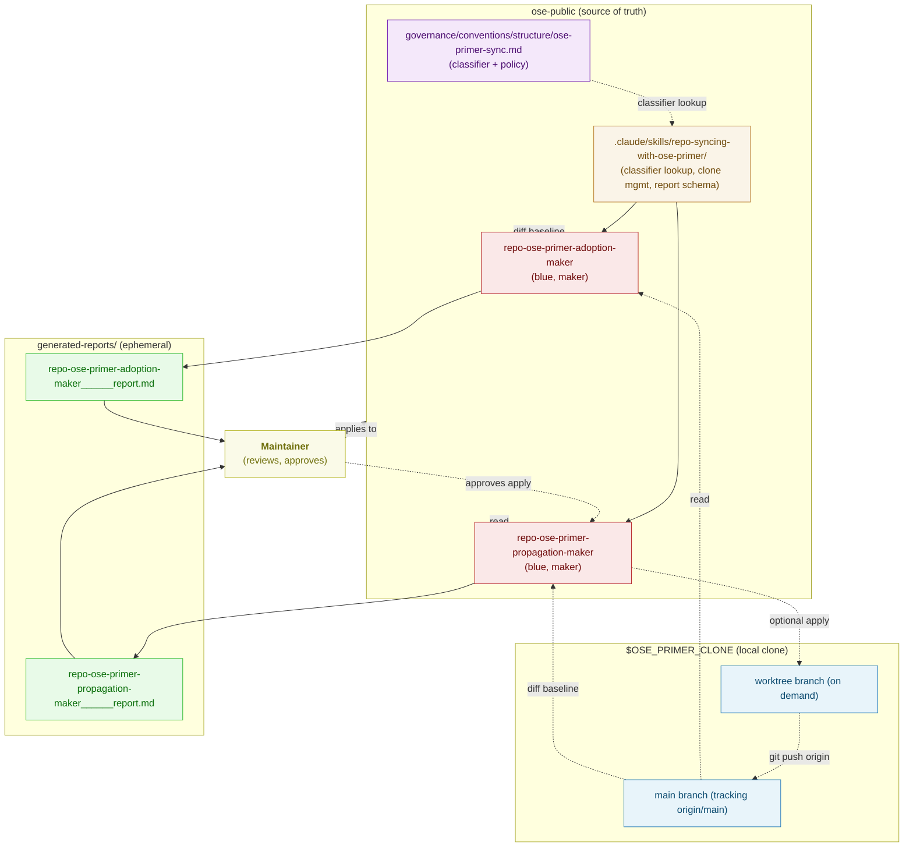

# Technical Documentation — ose-primer Separation

## Architecture Overview



### Key design decisions

1. **One shared skill, two agents** — The classifier, clone-management primitives, report schema, safety rules, and noise filters live in the skill. The agents hold only direction-specific orchestration. If the classifier needs an update, it changes in one place (the governance doc) and the skill's lookup mechanism picks it up without agent changes.
2. **Classifier lives in a governance convention, not in the skill** — Conventions are the authoritative location for rules; skills consume them. The skill references the convention and parses its table at runtime. This keeps `repo-rules-checker` responsible for classifier audit.
3. **Local clone, not a gitlink** — Adding `ose-primer` as a third gitlink at the parent level (alongside `ose-public` and `ose-infra`) creates session-visibility complications without material benefit. A plain local clone at `$OSE_PRIMER_CLONE/` keeps the sync primitives simple and sidesteps the subrepo-worktree workflow entirely.
4. **Dry-run by default** — Both agents default to report-only. Apply mode is an explicit flag the maintainer passes after reviewing the dry-run report. This makes the failure mode "unreviewed noise" rather than "unreviewed mutation."
5. **`maker` role for both agents** — Both agents produce proposal artifacts (reports); under the [Agent Naming Convention](../../../governance/conventions/structure/agent-naming.md) this maps cleanly to the `maker` role. See the "Agent Naming Choice" section below for the full analysis.

## Access Pattern to `ose-primer`

### Clone path — env-var indirection

The clone path is resolved from the **`OSE_PRIMER_CLONE`** environment variable. No absolute path is hardcoded in any committed doc, agent, skill, or workflow — machine-specific info stays out of the public repo.

**Resolution rule**:

1. If `OSE_PRIMER_CLONE` is set in the environment, use its value.
2. If unset, the agent/workflow aborts pre-flight with a remediation message instructing the user to export it.

**Convention default**: `~/ose-projects/ose-primer` — a sibling of the `ose-public` checkout. This is the documented default value users are expected to export unless they have a strong preference otherwise. Example:

```bash
export OSE_PRIMER_CLONE="$HOME/ose-projects/ose-primer"
```

Rationale for the default:

- Sibling of `ose-public` keeps related clones co-located without mandating any specific prefix.
- Outside any Nx workspace, so Nx does not walk it.
- Parallel-safe with existing work because neither `ose-public` nor `ose-infra` observes this path.
- Re-clonable: `rm -rf` and `git clone` recovers the exact state; nothing is lost.

Users who prefer a different layout (tools directory, XDG cache, separate drive) simply export a different `OSE_PRIMER_CLONE` value — the agents, skill, and workflows operate on the env var exclusively.

### First-time setup

```bash
# 1. Set the env var (add to your shell profile to persist across sessions).
export OSE_PRIMER_CLONE="$HOME/ose-projects/ose-primer"   # or your preferred location

# 2. Clone.
mkdir -p "$(dirname "$OSE_PRIMER_CLONE")"
git clone https://github.com/wahidyankf/ose-primer.git "$OSE_PRIMER_CLONE"
```

Both agents' pre-flight verifies clone presence. If missing, the agents emit a remediation message with the exact clone command rather than cloning themselves — cloning 200+ MB into a user directory is a silent surprise that should require explicit consent.

### Per-invocation clone management

Both agents' pre-flight MUST:

1. Verify the `OSE_PRIMER_CLONE` environment variable is set. If unset → emit remediation and abort.
2. Verify `$OSE_PRIMER_CLONE/.git` exists. If missing → emit remediation (with the clone command above) and abort.
3. Verify the clone's `origin` remote points at `https://github.com/wahidyankf/ose-primer.git` or `git@github.com:wahidyankf/ose-primer.git`. If mismatched → abort.
4. `git -C "$OSE_PRIMER_CLONE" fetch --prune` to pick up all branches and tag updates.
5. Verify the working tree is clean. If `git -C "$OSE_PRIMER_CLONE" status --porcelain` returns non-empty → abort unless `--use-clone-as-is` flag was passed.
6. Verify current branch is `main` tracking `origin/main`. If not → `git -C "$OSE_PRIMER_CLONE" checkout main && git -C "$OSE_PRIMER_CLONE" reset --hard origin/main` (only if working tree clean per step 5), else abort.

After the invocation:

- **In dry-run mode**: no mutation of the clone. No worktree. Main clone stays on `main`.
- **In parity-check mode**: no mutation of the clone. No worktree. Main clone stays on `main`.
- **In apply mode (propagation-maker only)**: the agent does **NOT** mutate the main clone's working tree at all. Instead, it creates a **git worktree** attached to the clone, makes all changes inside the worktree, and opens the PR from the worktree. The main clone stays on `main` throughout — parallel-safe with other invocations and always ready for a fresh parity check.

### Apply mode uses git worktrees (not branch-checkout in the main clone)

**Why worktrees, not branch-in-place**:

- **Parallel safety**: Multiple propagation applies can run without blocking the main clone's checkout state. A second agent invocation, a manual `git` command, or a concurrent parity-check all work because the main clone never leaves `main`.
- **Clean main state**: The next pre-flight (for any mode) finds the main clone exactly where it expects — on `main`, clean tree — because apply never changed it.
- **Cleaner recovery on failure**: Failed applies leave a well-named worktree directory the maintainer can inspect and `git worktree remove` when done. No stale branches clutter the main clone's branch list.
- **Alignment with repo convention**: The existing [Subrepo Worktree Workflow Convention](../../../../governance/conventions/structure/subrepo-worktrees.md) at the parent level already treats `.claude/worktrees/` as a gitignored worktree sink for subrepos. `ose-primer` (derived from `ose-public`) inherits that `.gitignore` entry, so worktrees placed under `$OSE_PRIMER_CLONE/.claude/worktrees/` are automatically ignored — no primer-side config change required.

**Apply-mode procedure**:

```bash
# (pre-flight already passed: main clone on main, clean tree)

BRANCH="sync/$(date -u +%Y%m%dT%H%M%SZ)-$(uuidgen | cut -c1-8)"
WORKTREE="$OSE_PRIMER_CLONE/.claude/worktrees/$BRANCH"

# 1. Create worktree tracking origin/main, on the new branch.
git -C "$OSE_PRIMER_CLONE" worktree add -b "$BRANCH" "$WORKTREE" origin/main

# 2. Apply proposed changes INSIDE the worktree.
#    (agent writes files into $WORKTREE, not into $OSE_PRIMER_CLONE directly)

# 3. Commit, push, open draft PR from the worktree.
git -C "$WORKTREE" add <specific paths>
git -C "$WORKTREE" commit -m "<conventional commit message referencing report>"
git -C "$WORKTREE" push -u origin "$BRANCH"
gh -R wahidyankf/ose-primer pr create --draft --base main --head "$BRANCH" \
   --title "<title>" --body "<body linking to generated-reports/ report>"

# 4. Capture the PR URL for the agent's report.

# 5. Cleanup policy:
#    - On success: the agent leaves the worktree in place (it is cheap; branch is pushed; PR is open). The maintainer runs `git -C "$OSE_PRIMER_CLONE" worktree remove "$WORKTREE"` after PR merge.
#    - On failure (any of commit/push/PR-create fails): leave worktree in place for debugging; the agent reports the worktree path in its failure message.
```

**Worktree hygiene — pre-flight additions**:

- Step 7 (new): enumerate existing worktrees under `$OSE_PRIMER_CLONE/.claude/worktrees/`. If any exist and are older than N days (configurable, default 7), emit a warning listing them — but do NOT auto-remove; the maintainer decides. Fresh worktrees (< N days) are silent.
- Step 8 (new): if the number of stale worktrees exceeds a threshold (default 5), refuse to create a new one until the maintainer cleans up (prevents unbounded accumulation).

**Stale-worktree cleanup command** (for maintainer convenience, documented in the skill):

```bash
git -C "$OSE_PRIMER_CLONE" worktree list
git -C "$OSE_PRIMER_CLONE" worktree remove "$OSE_PRIMER_CLONE/.claude/worktrees/<branch-name>"
# Or remove all worktrees older than N days:
git -C "$OSE_PRIMER_CLONE" worktree prune
```

### Authentication

The propagation-maker uses the existing `gh` authentication (same GitHub user used for `ose-public` pushes). No new credentials introduced.

## Classifier Specification

### Classifier directions

| Direction       | Meaning                                                                                                                                             |
| --------------- | --------------------------------------------------------------------------------------------------------------------------------------------------- |
| `propagate`     | Content authored in `ose-public`; flows outward to `ose-primer`. Adoption-maker does NOT surface changes to these paths from the primer.            |
| `adopt`         | Content authored or owned in `ose-primer`; flows inward to `ose-public`. Propagation-maker does NOT surface changes to these paths from ose-public. |
| `bidirectional` | Content maintained in both; changes in either direction are candidates. A transform note may apply (see below).                                     |
| `neither`       | Product-specific, FSL-licensed, ephemeral, or otherwise excluded. Neither agent emits findings for these paths, even if they change.                |

### Transforms (applied to `bidirectional` paths)

Some `bidirectional` files have mixed generic + product content. Examples: `CLAUDE.md`, `AGENTS.md`, `README.md`. The classifier specifies a transform:

- **`strip-product-sections`** — When propagating, remove sections whose heading names a product app (`OrganicLever`, `AyoKoding`, `OSE Platform`, etc.) or whose body cross-links to a product-app path.
- **`identity`** — No transform; propagate/adopt as-is.

Transforms are mechanically specified in the governance doc and implemented in the shared skill. If a file needs a transform the skill does not implement, the agent reports the file as a coverage gap and the maintainer hand-syncs.

### Classifier table (authoritative lives in the governance doc)

The table below is a **blueprint**; the final authoritative version lives in `governance/conventions/structure/ose-primer-sync.md`. When plan and convention disagree, the convention wins.

| Path pattern                                               | Direction                   | Transform              | Rationale                                                                                                                                                                                                                                         |
| ---------------------------------------------------------- | --------------------------- | ---------------------- | ------------------------------------------------------------------------------------------------------------------------------------------------------------------------------------------------------------------------------------------------- |
| `apps/a-demo-*` (excluding `*-e2e`)                        | `neither` (post-extraction) | —                      | Pre-extraction tag was `propagate`; extracted 2026-04-XX; `ose-primer` is authoritative. Primer already carries byte-equivalent state (verified in Phase 7 parity report before extraction). Path no longer exists in `ose-public` after Phase 8. |
| `apps/a-demo-*-e2e`                                        | `neither` (post-extraction) | —                      | Same rationale as above; originally FSL-1.1-MIT E2E suite; removed from `ose-public` in Phase 8.                                                                                                                                                  |
| `specs/apps/a-demo/**`                                     | `neither` (post-extraction) | —                      | Demo contract specs extracted alongside the demo apps; path no longer exists in `ose-public`.                                                                                                                                                     |
| `apps/organiclever-fe`                                     | `neither`                   | —                      | FSL-1.1-MIT product app.                                                                                                                                                                                                                          |
| `apps/organiclever-be`                                     | `neither`                   | —                      | FSL-1.1-MIT product app.                                                                                                                                                                                                                          |
| `apps/organiclever-*-e2e`                                  | `neither`                   | —                      | FSL-1.1-MIT E2E suite.                                                                                                                                                                                                                            |
| `apps/ayokoding-*`                                         | `neither`                   | —                      | FSL-1.1-MIT product app (including E2E and CLI).                                                                                                                                                                                                  |
| `apps/oseplatform-*`                                       | `neither`                   | —                      | FSL-1.1-MIT product app.                                                                                                                                                                                                                          |
| `apps/rhino-cli`                                           | `propagate`                 | identity               | Generic repository-management CLI; MIT-licensable and useful in template.                                                                                                                                                                         |
| `apps/oseplatform-cli`                                     | `neither`                   | —                      | Product-specific site maintenance CLI.                                                                                                                                                                                                            |
| `apps/ayokoding-cli`                                       | `neither`                   | —                      | Product-specific content validation CLI.                                                                                                                                                                                                          |
| `apps-labs/`                                               | `neither`                   | —                      | Experimental; not stable enough for template.                                                                                                                                                                                                     |
| `libs/golang-commons`                                      | `propagate`                 | identity               | Generic Go utilities.                                                                                                                                                                                                                             |
| `libs/clojure-openapi-codegen`                             | `neither` (post-extraction) | —                      | Only consumer was `a-demo-be-clojure-pedestal`; removed in Phase 8 Commit I; `ose-primer` is authoritative if the template needs it.                                                                                                              |
| `libs/elixir-cabbage`                                      | `neither` (post-extraction) | —                      | Only consumer was `a-demo-be-elixir-phoenix`; removed in Phase 8 Commit I.                                                                                                                                                                        |
| `libs/elixir-gherkin`                                      | `neither` (post-extraction) | —                      | Only consumer was `a-demo-be-elixir-phoenix`; removed in Phase 8 Commit I.                                                                                                                                                                        |
| `libs/elixir-openapi-codegen`                              | `neither` (post-extraction) | —                      | Only consumer was `a-demo-be-elixir-phoenix`; removed in Phase 8 Commit I.                                                                                                                                                                        |
| `libs/*` (other)                                           | `propagate`                 | identity               | Default assumption for generic libs; overridden per-lib if product-specific.                                                                                                                                                                      |
| `specs/apps/organiclever/**`                               | `neither`                   | —                      | Product specs.                                                                                                                                                                                                                                    |
| `governance/principles/**`                                 | `bidirectional`             | identity               | Universal values; improvements from either side should surface.                                                                                                                                                                                   |
| `governance/vision/**`                                     | `neither`                   | —                      | Product vision is `ose-public`-specific.                                                                                                                                                                                                          |
| `governance/conventions/**`                                | `bidirectional`             | identity               | Conventions are generic by design; mixed cases flagged per-file below.                                                                                                                                                                            |
| `governance/conventions/structure/licensing.md`            | `neither`                   | —                      | Licensing is fundamentally different (FSL vs MIT).                                                                                                                                                                                                |
| `governance/conventions/structure/ose-primer-sync.md`      | `neither`                   | —                      | This very convention is ose-public-specific; primer does not need a sync-with-itself convention.                                                                                                                                                  |
| `governance/development/**`                                | `bidirectional`             | identity               | Development practices are generic.                                                                                                                                                                                                                |
| `governance/workflows/**`                                  | `bidirectional`             | identity               | Workflows are generic unless they name a product app.                                                                                                                                                                                             |
| `governance/workflows/plan/**`                             | `bidirectional`             | identity               | Plan lifecycle is generic.                                                                                                                                                                                                                        |
| `docs/tutorials/**`                                        | `bidirectional`             | strip-product-sections | Generic tutorials; product-specific tutorials stripped.                                                                                                                                                                                           |
| `docs/how-to/**`                                           | `bidirectional`             | strip-product-sections | Same rationale.                                                                                                                                                                                                                                   |
| `docs/reference/**`                                        | `bidirectional`             | strip-product-sections | Same rationale; monorepo-structure and similar diagrams need product-node removal.                                                                                                                                                                |
| `docs/reference/related-repositories.md`                   | `neither`                   | —                      | Describes the primer from ose-public's perspective; not relevant in primer itself.                                                                                                                                                                |
| `docs/reference/demo-apps-ci-coverage.md`                  | `propagate`                 | identity               | Demo-apps reference.                                                                                                                                                                                                                              |
| `docs/explanation/**`                                      | `bidirectional`             | strip-product-sections | Explanation docs mostly generic.                                                                                                                                                                                                                  |
| `docs/metadata/**`                                         | `neither`                   | —                      | Product content metadata.                                                                                                                                                                                                                         |
| `.claude/agents/repo-*.md`                                 | `bidirectional`             | identity               | Generic governance agents.                                                                                                                                                                                                                        |
| `.claude/agents/plan-*.md`                                 | `bidirectional`             | identity               | Generic plan-lifecycle agents.                                                                                                                                                                                                                    |
| `.claude/agents/docs-*.md`                                 | `bidirectional`             | identity               | Generic docs agents.                                                                                                                                                                                                                              |
| `.claude/agents/specs-*.md`                                | `bidirectional`             | identity               | Generic specs agents.                                                                                                                                                                                                                             |
| `.claude/agents/readme-*.md`                               | `bidirectional`             | identity               | Generic readme agents.                                                                                                                                                                                                                            |
| `.claude/agents/ci-*.md`                                   | `bidirectional`             | identity               | Generic CI agents.                                                                                                                                                                                                                                |
| `.claude/agents/agent-*.md`                                | `bidirectional`             | identity               | Meta-agents.                                                                                                                                                                                                                                      |
| `.claude/agents/swe-*.md`                                  | `bidirectional`             | identity               | Language-dev agents; generic.                                                                                                                                                                                                                     |
| `.claude/agents/web-*.md`                                  | `bidirectional`             | identity               | Web-research agent.                                                                                                                                                                                                                               |
| `.claude/agents/social-*.md`                               | `neither`                   | —                      | Product-marketing-adjacent; template users author their own.                                                                                                                                                                                      |
| `.claude/agents/apps-*.md`                                 | `neither`                   | —                      | Product-app agents.                                                                                                                                                                                                                               |
| `.claude/agents/repo-ose-primer-*.md`                      | `neither`                   | —                      | Sync agents live in ose-public only; primer does not sync itself.                                                                                                                                                                                 |
| `.claude/skills/apps-*/`                                   | `neither`                   | —                      | Product-app skills.                                                                                                                                                                                                                               |
| `.claude/skills/repo-syncing-with-ose-primer/`             | `neither`                   | —                      | Sync skill lives in ose-public only.                                                                                                                                                                                                              |
| `.claude/skills/*` (other)                                 | `bidirectional`             | identity               | Default generic unless product-app-specific.                                                                                                                                                                                                      |
| `.opencode/**`                                             | — (mirror of `.claude/**`)  | —                      | Mirror is generated by sync pipeline; classifier applies to the source tree.                                                                                                                                                                      |
| `README.md` (root)                                         | `bidirectional`             | strip-product-sections | Product-facing sections stripped on propagate.                                                                                                                                                                                                    |
| `CLAUDE.md` (root)                                         | `bidirectional`             | strip-product-sections | Same.                                                                                                                                                                                                                                             |
| `AGENTS.md` (root)                                         | `bidirectional`             | strip-product-sections | Same.                                                                                                                                                                                                                                             |
| `ROADMAP.md`                                               | `neither`                   | —                      | Product roadmap.                                                                                                                                                                                                                                  |
| `LICENSE`, `LICENSING-NOTICE.md`                           | `neither`                   | —                      | License difference is intentional.                                                                                                                                                                                                                |
| `CONTRIBUTING.md`, `SECURITY.md`                           | `bidirectional`             | strip-product-sections | Generic; product-specific references stripped.                                                                                                                                                                                                    |
| `nx.json`, `tsconfig.base.json`, `package.json`, `go.work` | `bidirectional`             | strip-product-sections | Config; product-app entries stripped on propagate.                                                                                                                                                                                                |
| `Brewfile`                                                 | `bidirectional`             | identity               | Generic toolchain list.                                                                                                                                                                                                                           |
| `.husky/**`                                                | `bidirectional`             | identity               | Generic hook scripts.                                                                                                                                                                                                                             |
| `scripts/**`                                               | `bidirectional`             | identity               | Generic repo scripts (doctor, sync pipeline).                                                                                                                                                                                                     |
| `infra/**`                                                 | `neither`                   | —                      | Product infrastructure.                                                                                                                                                                                                                           |
| `plans/**`                                                 | `neither`                   | —                      | Product plans are product-specific.                                                                                                                                                                                                               |
| `generated-reports/**`, `local-temp/**`                    | `neither`                   | —                      | Ephemeral.                                                                                                                                                                                                                                        |
| `node_modules/**`, `obj/**`, `.nx/**`, etc.                | `neither`                   | —                      | Build artifacts.                                                                                                                                                                                                                                  |

Paths NOT listed are `neither` by default. The governance doc makes this explicit.

### Classifier audit rule (for `repo-rules-checker`)

The checker runs a new audit:

1. Enumerate every top-level file and directory under `ose-public/`.
2. Enumerate every immediate subdirectory of `apps/`, `libs/`, `specs/apps/`, `governance/*/`, `docs/*/`, `.claude/agents/` (as files), `.claude/skills/`.
3. For each path, find at least one classifier row (literal or glob) whose pattern matches.
4. Report every unmatched path as a governance finding.
5. Report every classifier row whose pattern matches zero actual paths as a governance finding (stale classifier).

**Post-extraction note**: After Phase 8, the classifier rows for `apps/a-demo-*` and `specs/apps/a-demo/**` intentionally match zero paths in `ose-public` (because the paths have been deleted). These rows MUST NOT be removed from the classifier; they are retained so that the propagation-maker and adoption-maker continue to tag any future accidental re-introduction of an `a-demo-*` path as `neither` and skip it. The audit rule (step 5) MUST be amended to whitelist these specific rows as "intentionally zero-matching, extracted state". Phase 2's classifier doc specifies this whitelist explicitly in the audit-rule section.

## Demo Extraction (one-time event)

This section documents the one-time extraction of the `a-demo-*` polyglot showcase from `ose-public`. The extraction is a Phase 8 activity. It is **not** a pattern for future extractions; it is a specific, bounded cleanup tied to `ose-primer` reaching parity.

### Scope of paths removed

**17 app directories under `apps/`** (exact listing, confirmed by `ls ose-public/apps/ | grep '^a-demo-'` at plan authoring time on 2026-04-18):

- `apps/a-demo-be-clojure-pedestal/`
- `apps/a-demo-be-csharp-aspnetcore/`
- `apps/a-demo-be-e2e/`
- `apps/a-demo-be-elixir-phoenix/`
- `apps/a-demo-be-fsharp-giraffe/`
- `apps/a-demo-be-golang-gin/`
- `apps/a-demo-be-java-springboot/`
- `apps/a-demo-be-java-vertx/`
- `apps/a-demo-be-kotlin-ktor/`
- `apps/a-demo-be-python-fastapi/`
- `apps/a-demo-be-rust-axum/`
- `apps/a-demo-be-ts-effect/`
- `apps/a-demo-fe-dart-flutterweb/`
- `apps/a-demo-fe-e2e/`
- `apps/a-demo-fe-ts-nextjs/`
- `apps/a-demo-fe-ts-tanstack-start/`
- `apps/a-demo-fs-ts-nextjs/`

**1 spec area under `specs/apps/`**:

- `specs/apps/a-demo/` (entire subtree: contracts, behavioural features, OpenAPI spec, generated docs).

**14 GitHub Actions workflows under `.github/workflows/`** (pattern `test-a-demo-*.yml`):

- `test-a-demo-be-clojure-pedestal.yml`
- `test-a-demo-be-csharp-aspnetcore.yml`
- `test-a-demo-be-elixir-phoenix.yml`
- `test-a-demo-be-fsharp-giraffe.yml`
- `test-a-demo-be-golang-gin.yml`
- `test-a-demo-be-java-springboot.yml`
- `test-a-demo-be-java-vertx.yml`
- `test-a-demo-be-kotlin-ktor.yml`
- `test-a-demo-be-python-fastapi.yml`
- `test-a-demo-be-rust-axum.yml`
- `test-a-demo-be-ts-effect.yml`
- `test-a-demo-fe-dart-flutterweb.yml`
- `test-a-demo-fe-ts-nextjs.yml`
- `test-a-demo-fe-ts-tanstack-start.yml`
- `test-a-demo-fs-ts-nextjs.yml` (if present — Phase 8 checklist enumerates all matches at runtime)

**1 reference doc under `docs/reference/`**:

- `docs/reference/demo-apps-ci-coverage.md` (wholly demo-specific; deleted).

**Configuration file edits** (demo-entries pruned in place, files retained):

- `codecov.yml` — remove flags keyed on demo project names.
- `go.work` — remove `use` directives for `apps/a-demo-be-golang-gin`.
- `open-sharia-enterprise.sln` — remove project references for `apps/a-demo-be-csharp-aspnetcore`.
- `.github/workflows/_reusable-*.yml` — if any reusable workflow enumerates demo projects as matrix inputs or conditional branches, prune those entries. Reusables called by product pipelines stay.

**Prose edits in existing docs** (demo references pruned, docs retained):

- `README.md` — remove "Demo apps: 11 backend implementations ..." bullet; remove coverage-badge rows for demo projects; add a single line to "Related Repositories" (or a brief changelog entry) noting the extraction and pointing at `ose-primer`.
- `CLAUDE.md` — remove the full listing of `a-demo-*` apps in the apps inventory; prune coverage-threshold table rows for demo projects; remove three-level-testing-standard example paragraphs that name demo paths or replace demo paths with product-app paths where the example still makes sense.
- `AGENTS.md` — mirror CLAUDE.md edits.
- `ROADMAP.md` — prune phase narratives that cite demos; add a dated changelog entry recording the extraction.

**Governance doc edits** (examples/references pruned, principle content untouched):

- `governance/development/quality/three-level-testing-standard.md` — replace demo-be examples with product-be references (organiclever-be is F#/Giraffe; ayokoding-be / oseplatform are tRPC) or remove the example bullet.
- `governance/development/infra/nx-targets.md` — same approach.
- `docs/reference/monorepo-structure.md` — remove demo rows from the app-inventory tables; update prose that describes the monorepo's "polyglot showcase" aspect.
- `docs/reference/nx-configuration.md` — remove demo-specific target configuration examples.
- `docs/reference/project-dependency-graph.md` — regenerate or remove demo nodes from the Mermaid diagram and dependency tables.
- `docs/how-to/add-new-app.md` — update examples that reference demo apps.
- `docs/how-to/add-new-lib.md` — same.

**Scripts**:

- `scripts/**` — any script enumerating demo project names for bulk operations gets its list pruned; `scripts/doctor/` is NOT trimmed (out of scope per `brd.md` Non-Goals).

**Library deletions (4 entries under `libs/`)** — libraries whose only consumers were demo apps:

- `libs/clojure-openapi-codegen/` — only consumer `a-demo-be-clojure-pedestal` (deleted in Commit B); remove in Commit I.
- `libs/elixir-cabbage/` — only consumer `a-demo-be-elixir-phoenix`; remove in Commit I.
- `libs/elixir-gherkin/` — only consumer `a-demo-be-elixir-phoenix`; remove in Commit I.
- `libs/elixir-openapi-codegen/` — only consumer `a-demo-be-elixir-phoenix`; remove in Commit I.
- Update `libs/README.md` index accordingly.

**Libraries explicitly kept** (not removed, even though tangentially demo-related):

- `libs/golang-commons/` — consumed by `rhino-cli`, `ayokoding-cli`, `oseplatform-cli`.
- `libs/hugo-commons/` — consumed by `ayokoding-cli`, `oseplatform-cli` for legacy link-checking features; Hugo sites migrated to Next.js but the commons package is still imported. Flag for a separate future cleanup plan; **NOT** removed here.
- `libs/ts-ui/` and `libs/ts-ui-tokens/` — consumed by `organiclever-fe` (direct or transitive). Keep.

**`rhino-cli` trim (Commit J)** — `apps/rhino-cli` loses commands whose only targets were demo apps. The CLI itself remains as the authoritative repo-hygiene tool.

Commands to remove:

- `java validate-annotations` — targeted Java backends (`a-demo-be-java-springboot`, `a-demo-be-java-vertx`); no remaining Java backend after extraction.
- `contracts java-clean-imports` — targeted Java backends' generated OpenAPI code; no remaining consumer.
- `contracts dart-scaffold` — targeted `a-demo-fe-dart-flutterweb`; no remaining Dart app.
- Parent grouping commands (`java`, `contracts`) if every subcommand under them was removed.

Files to delete under `apps/rhino-cli/`:

- `cmd/java_validate_annotations.go` + `*_test.go` + `*.integration_test.go`.
- `cmd/contracts_java_clean_imports.go` + `*_test.go` + `*.integration_test.go`.
- `cmd/contracts_dart_scaffold.go` + `*_test.go` + `*.integration_test.go`.
- `cmd/java.go` (parent command, now empty).
- `cmd/contracts.go` (parent command, now empty).
- `internal/java/` (entire subpackage if only the `java` command tree used it).
- Any entries in `apps/rhino-cli/README.md` documenting the removed commands.
- Any Gherkin feature files under `specs/apps/rhino/` that name the removed commands.

Commands NOT removed (even though some formats become unused):

- `test-coverage validate` — format parsers for C#, Clojure, Dart, Elixir, Java, Kotlin, Rust remain as inert code paths. Trimming them is a separate docs-quality follow-up; this plan does not touch `internal/testcoverage/`. Removing parsers touches package-internal tests and risks unrelated breakage.
- `spec-coverage validate` — unchanged; used by every retained product backend.
- `doctor` — polyglot toolchain checks remain (doctor trim is explicitly out of scope per `brd.md` Non-Goals).
- `agents-*`, `workflows-*`, `docs validate-links`, `env-*`, `git pre-commit`, `git pre-push` — all generic repo-hygiene, unchanged.

**Post-trim verification for `rhino-cli`**:

- `nx run rhino-cli:test:unit` must pass (≥90% coverage threshold maintained).
- `nx run rhino-cli:test:integration` must pass.
- `apps/rhino-cli/README.md` must list only surviving commands.
- CLAUDE.md mentions of removed commands ("java validate-annotations") pruned.
- Any `specs/apps/rhino/` Gherkin feature naming a removed command either deleted or updated.

### Extraction sequencing (hard ordering)

The extraction MUST happen in this order; see `delivery.md` for the granular checklist.

```mermaid
flowchart TD
    classDef gate fill:#FAE8E8,stroke:#B82C2C,color:#6F0B0B
    classDef step fill:#E8F4FA,stroke:#2C7FB8,color:#0B4A6F
    classDef post fill:#E8FAE8,stroke:#2CB82C,color:#0B6F0B

    p7["`**Phase 7 gate**: parity-check mode
    propagation-maker verifies ose-primer
    has every demo at ≥ ose-public state`"]:::gate

    s1["`Commit A: delete workflows
    (.github/workflows/test-a-demo-*.yml)`"]:::step
    s2["`Commit B: delete app directories
    (apps/a-demo-*/)`"]:::step
    s3["`Commit C: delete spec area
    (specs/apps/a-demo/)`"]:::step
    s4["`Commit D: delete reference doc
    (docs/reference/demo-apps-ci-coverage.md)`"]:::step
    s5["`Commit E: prune configs
    (codecov.yml, go.work, .sln,
    reusable workflows)`"]:::step
    s6["`Commit F: prune README/CLAUDE.md/
    AGENTS.md/ROADMAP.md references`"]:::step
    s7["`Commit G: prune governance/docs
    demo examples`"]:::step
    s8["`Commit H: update classifier
    (a-demo rows: propagate → neither
    with extraction date)`"]:::step
    s9["`Commit I: remove unused libs
    (clojure-openapi-codegen,
    elixir-cabbage/gherkin/openapi-codegen)`"]:::step
    s10["`Commit J: trim rhino-cli
    (remove java validate-annotations,
    contracts dart-scaffold,
    contracts java-clean-imports)`"]:::step

    p8["`**Phase 9**: post-extraction health
    nx affected green, link check green,
    grep sweep clean, product E2E green,
    rhino-cli tests green`"]:::post

    p7 --> s1 --> s2 --> s3 --> s4 --> s5 --> s6 --> s7 --> s8 --> s9 --> s10 --> p8
```



**Why this order**:

- **Workflows first** (Commit A): removes the CI callers before deleting the app directories, so no push runs a workflow that tries to operate on a directory being deleted in-flight.
- **Apps next** (Commit B): the largest visible change; lands after CI is already blind to those projects.
- **Libs after classifier** (Commit I): the 4 Elixir/Clojure libs became unreferenced once the demo apps (Commit B) were removed; delete in a dedicated commit so the review is scoped to lib-layer changes only.
- **rhino-cli trim after libs** (Commit J): removing demo-only commands is a CLI-surface reduction independent from the library deletions; keeping it as its own commit preserves rhino-cli's test coverage as a reviewable delta.
- **Specs after apps** (Commit C): the specs are only referenced by the deleted apps' codegen, so removal is safe after Commit B.
- **Reference doc** (Commit D): deletes the demo-specific `docs/reference/demo-apps-ci-coverage.md` as its own small commit; inbound links are fixed in later commits.
- **Configs** (Commit E): `codecov.yml` flags now point at deleted projects; `go.work` and `.sln` now point at deleted directories. Pruning fixes the config drift in one commit.
- **Root prose** (Commit F): the README / CLAUDE.md / AGENTS.md / ROADMAP.md edits all concern the same narrative ("demos used to live here, now live in primer"). One commit per those four files keeps the narrative edit reviewable.
- **Governance prose** (Commit G): docs-quality edits across multiple governance + docs files. Bundled into one commit so the reviewer sees the pattern (mechanical demo-path pruning) uniformly.
- **Classifier last** (Commit H): the classifier rows flip from `propagate` → `neither` with the extraction date in the rationale column. Doing this last ensures the classifier's pre-extraction state is the baseline the earlier commits were reviewed against.
- **Post-extraction health** (Phase 9): verified only after the full commit sequence lands.

### Primer-parity verification (Phase 7 gate, detailed)

The propagation-maker runs in `parity-check` mode. Pseudocode:

```
for path in classifier.rows_with_direction("propagate"):
    if path.startswith("apps/a-demo-") or path == "specs/apps/a-demo/":
        left  = read(ose-public/path)
        right = read(primer-clone/path)
        if byte_equal(left, right):
            record(path, "equal")
        elif left is newer than right (commit timestamp on HEAD):
            record(path, "ose-public ahead — catch-up propagation required")
        else:
            record(path, "primer ahead or equal — safe")
verdict = "safe" if no "catch-up propagation required" rows else "blocked"
write_parity_report(verdict, rows)
```

If verdict is "blocked", Phase 8 cannot proceed. The maintainer invokes the normal propagation-maker (apply mode) to catch the primer up, waits for the PR to merge, then re-runs parity-check.

Parity-check report filename: `generated-reports/parity__<uuid>__<yyyy-mm-dd--hh-mm>__report.md`. It is distinct from standard propagation/adoption reports so it can be referenced from Phase 8 commit messages without ambiguity.

### File-impact details for Phase 8 (cross-reference)

See [File Impact Analysis](#file-impact-analysis) for the full per-file table including the Phase 8 rows. The table's "Change" column uses `Delete` for path removal and `Edit` for reference pruning in retained files.

### Rollback

- **During extraction, before Commit H lands**: any intermediate `git reset --hard` returns the tree to the pre-extraction state (assuming the commits have not been pushed yet). If they have been pushed, `git revert` each commit in reverse order restores the directories, workflows, and prose.
- **After extraction completes**: the pre-extraction state is preserved in `ose-public` git history at the SHA recorded in the Phase 7 parity report's frontmatter (`ose-public-sha`). Recovering a demo is `git show <pre-extraction-sha>:apps/a-demo-be-<name>/<file>`; re-introducing one wholesale would be a separate future plan (explicitly out of scope here).
- **Primer-side**: the extraction does nothing to `ose-primer`. Its state is unchanged by Phase 8. Rollback of the primer is therefore a no-op.

## Adopter Agent Spec — `repo-ose-primer-adoption-maker`

### Frontmatter

```yaml
---
name: repo-ose-primer-adoption-maker
description: >
  Surfaces improvements from the local ose-primer clone that are candidates
  for adoption into ose-public. Produces a proposal report grouped by
  classifier direction and significance; does NOT modify ose-public.
  Invoke when: periodic sync cadence; after manual template refresh;
  after noticing a primer-side improvement the source should pick up.
model: opus
color: blue
tools:
  - Read
  - Glob
  - Grep
  - Bash
  - Write
skills:
  - repo-syncing-with-ose-primer
---
```

### Responsibilities

1. Pre-flight per §Access Pattern: verify clone, fetch, verify clean tree on `main`.
2. Parse the classifier from `governance/conventions/structure/ose-primer-sync.md`.
3. For every path tagged `adopt` or `bidirectional`, compute the diff between the primer's current state and `ose-public`'s current state.
4. Apply the direction-appropriate filter (noise suppression from the skill; transforms inverted for adoption).
5. Group findings into significance buckets (structural / substantive / trivial) and classifier-direction buckets (`adopt` / `bidirectional`).
6. Write a report to `generated-reports/repo-ose-primer-adoption-maker__<uuid-chain>__<utc+7-timestamp>__report.md`.
7. Return a summary pointing at the report path.

### Non-responsibilities

- Does NOT modify any file in `ose-public`.
- Does NOT modify any file in the primer clone.
- Does NOT push, pull, or branch.
- Does NOT open PRs.
- Does NOT auto-apply findings.

### Report format

Follows the shared schema (see §Report Format below).

## Propagator Agent Spec — `repo-ose-primer-propagation-maker`

### Frontmatter

```yaml
---
name: repo-ose-primer-propagation-maker
description: >
  Surfaces changes in ose-public that should flow to the ose-primer template.
  Produces a proposal report in dry-run mode; optionally creates a branch,
  commits, pushes, and opens a draft PR against wahidyankf/ose-primer:main
  when invoked in apply mode with maintainer approval.
  Invoke when: after a batch of generic improvements in ose-public; before
  publishing a template update; on periodic cadence.
model: opus
color: blue
tools:
  - Read
  - Glob
  - Grep
  - Bash
  - Write
  - Edit
skills:
  - repo-syncing-with-ose-primer
---
```

### Modes

The propagation-maker supports three modes, selected by explicit invocation flag:

| Mode           | Default? | Writes a report?                  | Writes to primer clone?     | Opens a PR?                | Purpose                                                                                 |
| -------------- | -------- | --------------------------------- | --------------------------- | -------------------------- | --------------------------------------------------------------------------------------- |
| `dry-run`      | Yes      | `propagation__*__report.md`       | No                          | No                         | Preview changes before applying.                                                        |
| `apply`        | No       | `propagation__*__report.md`       | Yes (new branch, committed) | Yes (draft against `main`) | Execute a reviewed dry-run proposal.                                                    |
| `parity-check` | No       | `parity__*__report.md` (distinct) | No                          | No                         | Phase 7 extraction gate: verify primer has every demo at ≥ ose-public state. Read-only. |

### Responsibilities (dry-run / apply modes)

1. Pre-flight per §Access Pattern.
2. Parse the classifier.
3. For every path tagged `propagate` or `bidirectional`, compute the diff `ose-public → primer`.
4. Apply the direction-appropriate transform (e.g., `strip-product-sections`) per classifier.
5. Group findings into significance buckets and classifier-direction buckets.
6. Exclude `neither`-tagged paths from the findings; optionally include them in an audit-only appendix.
7. Write a report to `generated-reports/repo-ose-primer-propagation-maker__<uuid-chain>__<utc+7-timestamp>__report.md`.
8. In apply mode (explicit maintainer flag): create a **git worktree** at `$OSE_PRIMER_CLONE/.claude/worktrees/sync-<utc-timestamp>-<short-uuid>/` tracking `origin/main` on a new branch `sync/<utc-timestamp>-<short-uuid>`, apply the proposed changes inside the worktree, commit with a conventional-commit message referencing the report, push the branch to `origin`, open a draft PR against `wahidyankf/ose-primer:main` linking back to the report. The main clone's working tree is NEVER mutated. On PR-creation success, return the PR URL and leave the worktree in place for the maintainer to remove after merge. On failure, leave the worktree for debugging. See §Access Pattern > Apply mode uses git worktrees for the detailed procedure.

### Responsibilities (parity-check mode)

1. Pre-flight per §Access Pattern.
2. Parse the classifier.
3. Enumerate paths tagged `propagate` that are in the "extraction scope" (pre-Phase-8, this means `apps/a-demo-*` and `specs/apps/a-demo/` — the agent reads the extraction scope from the shared skill's `reference/extraction-scope.md` module so future extraction plans can amend the scope without re-coding the agent).
4. For each path, compute a byte-level diff between the ose-public and primer-clone copies.
5. For each path, compare commit timestamps on HEAD in each repo.
6. Classify each path as one of: `equal`, `primer-newer-or-equal (safe)`, `ose-public-newer (catch-up propagation required)`, `missing-in-primer (critical blocker)`.
7. Write a parity report with filename `generated-reports/parity__<uuid-chain>__<utc+7-timestamp>__report.md`.
8. Set the report's final verdict line: `parity verified: ose-public may safely remove` if no `catch-up` or `missing-in-primer` rows exist; otherwise `parity NOT verified: catch-up propagation required` with the blocking path list.
9. Return the report path and verdict. Does NOT modify any file outside `generated-reports/`.

### Non-responsibilities (all modes)

- Does NOT auto-apply without the explicit flag.
- Does NOT ever commit to the primer's `main` branch directly.
- Does NOT modify any file in `ose-public` in any mode.
- Does NOT emit findings for paths tagged `neither`, even in apply mode.
- In parity-check mode, does NOT compute diffs for paths outside the extraction scope; standard propagation concerns are a different mode.

### Safety invariants (enforced in the agent prompt)

- Propagation proposals NEVER include content from `apps/organiclever-*`, `apps/ayokoding-*`, `apps/oseplatform-*`, `apps/*-e2e`, `specs/apps/organiclever/**`, `plans/**`, `ROADMAP.md`, `LICENSE`, `LICENSING-NOTICE.md`, `infra/**`, `docs/metadata/**`, `generated-reports/**`, `local-temp/**`.
- If a file classified `bidirectional` with transform `strip-product-sections` contains a section referencing a product app and the strip transform fails (e.g., no clear section boundary), the file is reported as a transform-gap and NOT auto-propagated.
- In parity-check mode, the agent NEVER proposes or applies a propagation; a failed parity check produces a report instructing the maintainer to invoke apply mode separately for the catch-up.

## Shared Skill Spec — `repo-syncing-with-ose-primer`

### Directory layout

```
.claude/skills/repo-syncing-with-ose-primer/
├── SKILL.md                      # Entry point
└── reference/
    ├── classifier-parsing.md     # How to parse the classifier table
    ├── clone-management.md       # Pre-flight and post-flight procedures
    ├── report-schema.md          # Report format specification (standard + parity variants)
    ├── transforms.md             # Transform implementations (strip-product-sections, identity)
    └── extraction-scope.md       # Path list for parity-check mode (Phase 7 gate)
```

### `SKILL.md` frontmatter

```yaml
---
name: repo-syncing-with-ose-primer
description: >
  Shared knowledge for the repo-ose-primer-adoption-maker and
  repo-ose-primer-propagation-maker agents. Covers the classifier
  (loaded from governance/conventions/structure/ose-primer-sync.md),
  clone management at $OSE_PRIMER_CLONE, transform
  implementations, noise-suppression rules, and the standard report
  format. Invoke inline; both agents load this skill.
context: inline
version: 1.0.0
---
```

### Content

- **Classifier lookup**: references the convention doc and specifies the table-parsing rule (H3 "Classifier table" → next markdown table; each row = one entry).
- **Clone management**: documents the clone path, the pre-flight steps, the `--use-clone-as-is` escape hatch, the branch-naming rule for apply mode.
- **Transform implementations**:
  - `identity`: pass-through.
  - `strip-product-sections`: remove H2/H3 sections whose heading names `OrganicLever`, `AyoKoding`, `OSE Platform`, or whose body contains cross-links to `apps/(organiclever|ayokoding|oseplatform)-*/`. For tables (e.g., CI badges in README), remove rows naming product apps.
- **Noise-suppression rules**: whitespace-only diffs excluded, line-ending differences excluded, diffs affecting only Prettier-normalisable formatting excluded.
- **Significance classification**: structural (add/remove file, rename, change frontmatter), substantive (content change ≥ 3 lines, heading change, acceptance-criteria change), trivial (< 3 line edit, wording polish, typo).
- **Report format**: see §Report Format below.

## Governance Doc Spec — `governance/conventions/structure/ose-primer-sync.md`

### Frontmatter

```yaml
---
title: "ose-primer Bidirectional Sync Convention"
description: >
  Classifier and policy governing bidirectional synchronisation between
  ose-public and the wahidyankf/ose-primer template repository.
category: explanation
subcategory: conventions
tags:
  - conventions
  - structure
  - ose-primer
  - sync
  - cross-repo
created: 2026-04-18
updated: 2026-04-18
---
```

### Sections

1. **Purpose** — Why this convention exists: making the bidirectional sync systematic, auditable, and safe.
2. **Principles implemented/respected** — Explicit Over Implicit, Simplicity Over Complexity, Automation Over Manual.
3. **Scope** — What this convention covers, what it does NOT cover.
4. **The two repositories** — Short descriptions + URLs + license note.
5. **Sync directions** — Definitions of `propagate`, `adopt`, `bidirectional`, `neither`.
6. **Transforms** — `identity` and `strip-product-sections`.
7. **Classifier table** — The authoritative table (copied from the blueprint above, verified and extended).
8. **Orphan-path rule** — Paths not matched by any row are `neither` by default, but new top-level paths SHOULD be added explicitly.
9. **Audit rule** — Used by `repo-rules-checker`.
10. **Agents that consume this convention** — `repo-ose-primer-adoption-maker`, `repo-ose-primer-propagation-maker`, `repo-rules-checker`.
11. **Clone management** — Canonical clone path and pre-flight rules (pointer to the skill for details).
12. **Safety invariants** — Summary of the invariants enforced by the agents.
13. **Relationship to other conventions** — Licensing, File Naming, Agent Naming, Plans Organization.
14. **Related documents** — Links to skill, agent definitions, reference doc.

## Report Format

### Filename

```
generated-reports/<agent-name>__<uuid-chain>__<yyyy-mm-dd--hh-mm>__report.md
```

UUID chain per existing convention (see `governance/conventions/writing/` for report generation rules). Timestamp in UTC+7.

### Frontmatter

```yaml
---
agent: repo-ose-primer-<adoption|propagation>-maker
mode: <dry-run|apply>
invoked-at: <ISO-8601 timestamp with UTC+7 offset>
ose-public-sha: <SHA of ose-public HEAD at invocation>
ose-primer-sha: <SHA of clone's main at invocation>
classifier-sha: <SHA of the classifier convention doc at invocation>
report-uuid-chain: <chain>
---
```

### Body sections (mandatory)

1. **Summary** — One paragraph; counts of findings per significance bucket.
2. **Classifier coverage** — Any orphan paths encountered; any paths where the classifier's transform could not be applied.
3. **Findings** — Grouped by classifier direction, then by significance, then by path. Each finding:
   - Path
   - Classifier direction and transform
   - Diff (short snippet)
   - Rationale ("why propagate / why adopt")
4. **Excluded paths** (audit only) — Paths tagged `neither` that changed, for auditability. Not included in the proposal.
5. **Next steps** — For dry-run reports: apply-mode invocation hint. For apply-mode reports: the PR URL and any follow-up.

## Safety Rules

1. **Dry-run default**: Both agents default to dry-run. Apply mode requires an explicit flag the maintainer passes.
2. **No `ose-public` writes**: Neither agent writes to any `ose-public` file except `generated-reports/`.
3. **No `main` commits in primer**: Propagation-maker NEVER commits or pushes to the primer's `main` branch. It creates timestamped branches and opens draft PRs.
4. **No `neither` leakage**: Propagation-maker refuses to emit a proposal for any `neither`-tagged path.
5. **Clean-tree precondition**: Both agents abort if the clone has uncommitted changes or is on a non-`main` branch, unless `--use-clone-as-is` is passed.
6. **Transform-gap abstention**: If a `strip-product-sections` transform cannot cleanly isolate product content in a `bidirectional` file, the agent reports the gap and does NOT propose the diff.
7. **External URL freshness**: Both agents cache no network results; each run is independent.
8. **Classifier consistency**: Agents re-parse the classifier on every invocation; no cached copy.

## Agent Naming Choice (Analysis)

The [Agent Naming Convention](../../../governance/conventions/structure/agent-naming.md) permits exactly six role suffixes: `maker`, `checker`, `fixer`, `dev`, `deployer`, `manager`. Zero exceptions.

Candidates evaluated for the new agents:

| Candidate                                                         | Assessment                                                                                                                                                                                                                                            |
| ----------------------------------------------------------------- | ----------------------------------------------------------------------------------------------------------------------------------------------------------------------------------------------------------------------------------------------------- |
| `repo-ose-primer-adopter` / `-propagator`                         | **Rejected** — `adopter`, `propagator` are not in the role vocabulary. Allowing them would require a convention amendment, which is a separate plan per the zero-exceptions rule.                                                                     |
| `repo-ose-primer-syncer` (two agents, inbound/outbound qualifier) | **Rejected** — `syncer` is not in the role vocabulary. Same amendment burden.                                                                                                                                                                         |
| `repo-ose-primer-adopt-deployer` / `-propagate-deployer`          | **Rejected** — `deployer` semantically means "deploys an application to an environment"; the Role Vocabulary example is `apps-ayokoding-web-deployer`. Stretching it here dilutes the vocabulary.                                                     |
| `repo-ose-primer-adopt-manager` / `-propagate-manager`            | **Rejected** — `manager` is "file or resource operations (rename, move, delete)." Sync is not file management in the `docs-file-manager` sense.                                                                                                       |
| **`repo-ose-primer-adoption-maker` / `-propagation-maker`**       | **Selected** — both agents produce proposal artifacts (reports). Under the convention, `maker` is "Produces a content or research artifact." Reports are content artifacts. Qualifier tokens `adoption` and `propagation` narrow the scope correctly. |

Decision: use `maker` for both. No convention amendment required. If a future checker/fixer pair is added, the naming is trivially extensible: `repo-ose-primer-adoption-checker`, `repo-ose-primer-propagation-checker`, `repo-ose-primer-adoption-fixer`, `repo-ose-primer-propagation-fixer`.

## Model Choice (Analysis)

Both agents are configured as `model: opus` in their frontmatter. Candidate models evaluated:

| Candidate                                     | Assessment                                                                                                                                                                                                                                                                                                                                                                                                                                                                                                                          |
| --------------------------------------------- | ----------------------------------------------------------------------------------------------------------------------------------------------------------------------------------------------------------------------------------------------------------------------------------------------------------------------------------------------------------------------------------------------------------------------------------------------------------------------------------------------------------------------------------- |
| `haiku`                                       | **Rejected** — classifier edge cases, transform-boundary detection on `strip-product-sections`, and nuance-preservation judgments during adoption are the core value-add. Haiku's ceiling is too low for reliable FSL-leak prevention; one false-positive is a public-template licensing exposure.                                                                                                                                                                                                                                  |
| `sonnet`                                      | **Considered, rejected** — Sonnet is the default for most agents in this repo and handles the mechanical portions (byte diff, git operations, report templating) well. It would likely succeed on most invocations. Rejected because the failure mode is asymmetric: one mis-classified propagation leaks FSL-licensed product content into a public MIT template. The marginal token-cost of Opus is negligible at the expected invocation cadence (a few per week); the marginal risk-reduction on safety invariants is material. |
| `sonnet` for parity-check + `opus` for others | **Considered, rejected** — splitting models per mode adds plumbing complexity (mode-routing in the agent prompt, harness inconsistency) for minor savings. The parity-check mode's judgment is also non-trivial when files differ only by line endings or trailing whitespace; Opus handles these edge cases more reliably.                                                                                                                                                                                                         |
| **`opus`**                                    | **Selected** — stronger judgment on classifier edge cases, transform boundaries, and adoption nuance; mechanical portions handled equally well; token cost amortised across rare invocations. Safety-first default for high-stakes cross-repo work.                                                                                                                                                                                                                                                                                 |

**Review triggers that would flip the decision**:

- If invocation frequency rises to daily or automated cadence, revisit (cost may outweigh reliability premium).
- If a future checker/fixer triad is introduced to bracket the maker pair, the maker pair's individual judgment burden drops and Sonnet may suffice.
- If the classifier stabilises to the point where edge cases are rare, reconsider for the parity-check mode specifically.

No model amendment required in any governance document — `model` is a per-agent frontmatter field and agents are free to choose within the available model set.

## Workflow Specifications

Two workflow documents under `governance/workflows/repo/` orchestrate the agents. Both follow the [Workflow Naming Convention](../../../governance/conventions/structure/workflow-naming.md) and the [repo-defining-workflows](../../../.claude/skills/repo-defining-workflows/SKILL.md) pattern (YAML frontmatter with name / goal / termination / inputs / outputs; phase breakdown; agent coordination; Gherkin success criteria).

### `governance/workflows/repo/repo-ose-primer-sync-execution.md`

Type: `execution` (single forward procedure per invocation; not iterative zero-finding termination).

Scope=`repo`, qualifier=`ose-primer-sync`, type=`execution` → filename `repo-ose-primer-sync-execution.md` conforms to the convention.

**Frontmatter (outline)**:

```yaml
---
name: repo-ose-primer-sync-execution
goal: Execute one sync cycle between ose-public and ose-primer in the specified direction
termination: Exactly one report in generated-reports/ + optional PR URL (apply mode only); no iteration
inputs:
  - name: direction
    type: enum
    values: [adopt, propagate]
    required: true
    description: "Which sync agent to invoke (adopt → repo-ose-primer-adoption-maker; propagate → repo-ose-primer-propagation-maker)"
  - name: mode
    type: enum
    values: [dry-run, apply]
    required: false
    default: dry-run
    description: "dry-run writes a report only; apply writes a report AND (propagate only) creates branch/PR in primer clone"
  - name: clone-path
    type: string
    required: false
    default: "${OSE_PRIMER_CLONE}"
    description: "Local primer clone location; resolved at invocation from the OSE_PRIMER_CLONE env var. Workflow aborts if unset."
outputs:
  - name: report-file
    type: file
    pattern: "generated-reports/repo-ose-primer-<direction>ion-maker__*__report.md"
  - name: pr-url
    type: string
    required: false
    description: "PR URL if mode=apply and direction=propagate; otherwise absent"
---
```

**Phases**:

1. **Pre-flight** — Validate clone presence; refresh to `main`; assert clean tree unless `--use-clone-as-is`.
2. **Agent invocation** — Call `repo-ose-primer-adoption-maker` (direction=adopt) or `repo-ose-primer-propagation-maker` (direction=propagate) with the mode flag.
3. **Report finalisation** — Confirm report frontmatter + sections; emit a one-line summary pointing at the file.
4. **Optional apply (propagate + apply only)** — Create git worktree at `$OSE_PRIMER_CLONE/.claude/worktrees/sync-<ts>-<uuid>/`; apply changes inside the worktree (NOT in the main clone's working tree); commit; push branch; open draft PR via `gh pr create --draft`; capture PR URL.
5. **Post-flight** — Return clone to `main` on success; leave branch in place on failure with remediation hint.

**Gherkin success criteria**:

- Given a clean primer clone, when invoked with `direction=adopt mode=dry-run`, then exactly one adoption report appears in `generated-reports/` and no files outside `generated-reports/` change.
- Given a clean primer clone, when invoked with `direction=propagate mode=apply`, then a propagation report exists AND a draft PR URL is returned AND the PR description references the report filename.
- Given a dirty clone (working tree has uncommitted changes), when invoked without `--use-clone-as-is`, then the workflow aborts before any agent runs.

### `governance/workflows/repo/repo-ose-primer-extraction-execution.md`

Type: `execution` (one-time forward procedure with an internal catch-up loop on parity failure).

Scope=`repo`, qualifier=`ose-primer-extraction`, type=`execution` → filename `repo-ose-primer-extraction-execution.md` conforms.

**Frontmatter (outline)**:

```yaml
---
name: repo-ose-primer-extraction-execution
goal: Execute the one-time extraction of a-demo-* from ose-public after verifying primer parity
termination: Either "extraction complete" (all 8 commits landed + Phase 9 gates green) or "blocked at parity" (parity report verdict=NOT verified, human decides whether to run catch-up)
inputs:
  - name: extraction-scope
    type: string
    required: false
    default: ".claude/skills/repo-syncing-with-ose-primer/reference/extraction-scope.md"
    description: "Path to extraction-scope document specifying which paths this extraction covers (hard-coded to a-demo-* by default)"
  - name: clone-path
    type: string
    required: false
    default: $OSE_PRIMER_CLONE
  - name: max-catch-up-iterations
    type: number
    required: false
    default: 3
    description: "Cap on catch-up propagation cycles before escalating to human"
outputs:
  - name: parity-report
    type: file
    pattern: "generated-reports/parity__*__report.md"
  - name: extraction-commits
    type: list
    description: "SHAs of Commit A through Commit H"
  - name: final-status
    type: enum
    values: [complete, blocked-at-parity, aborted]
---
```

**Phases**:

1. **Pre-flight** — Clone refresh; extraction-scope parse; verify `ose-public` at `main`.
2. **Parity-check gate** — Invoke `repo-ose-primer-propagation-maker` in `parity-check` mode. Read verdict. If verified → proceed to Phase 3. If NOT verified → enter catch-up loop.
3. **Catch-up loop** (blocked path) — For each blocking path, invoke the sync workflow with `direction=propagate mode=apply` scoped to that path; wait for PR merge; re-run parity-check; loop until verified or max-iterations exceeded. On exceeded, emit `blocked-at-parity` and halt.
4. **Extraction commit sequence** — Execute Commits A → H as documented in [Demo Extraction](#demo-extraction-one-time-event) §Extraction sequencing. Each commit references the parity-report SHA.
5. **Post-extraction verification** — Run `nx affected`, product E2E, grep sweep, link checker, markdown lint. On any failure, emit `aborted` and pause for human remediation (extraction commits are not auto-reverted; the maintainer decides).
6. **Classifier flip** — Commit H: update classifier rows for `apps/a-demo-*` and `specs/apps/a-demo/**` to `neither (post-extraction)`.
7. **Close-out** — Return `complete` status.

**Gherkin success criteria**:

- Given a primer clone in parity with ose-public, when the workflow is invoked, then the parity-check report is generated first AND its verdict is "parity verified" AND the eight extraction commits follow.
- Given a primer clone where one demo is older than ose-public's, when the workflow is invoked, then the catch-up loop runs AND the extraction does NOT proceed until parity is re-verified.
- Given extraction commits have landed, when the post-extraction verification phase runs, then `nx affected -t typecheck lint test:quick spec-coverage` passes AND `grep -rnI 'a-demo' ose-public/` returns only allowed matches (archived plans, this plan, classifier table).

### Design decisions for the workflows

1. **Both are `execution` type, not `quality-gate`** — Neither workflow iterates to zero findings against the same repo state. The sync workflow is a single pass per invocation; the extraction workflow has one internal loop (catch-up) but its termination is scope-exhaustion, not finding-exhaustion.
2. **Extraction workflow references a path-list document, not hard-coded paths** — The extraction-scope module under the shared skill lets a future extraction plan point the same workflow at a different scope. Today the scope is frozen to `a-demo-*` + `specs/apps/a-demo/`; tomorrow it could extract another family.
3. **Sync workflow parameterises direction, not one workflow per direction** — Keeps the orchestration DRY; the agent selection inside the workflow is a one-line enum lookup.
4. **No automated scheduling** — Neither workflow is invoked by a cron, CI job, or hook. Human invocation only, consistent with the brd's safety posture.

## Dependencies

- `gh` CLI authenticated for the GitHub user that owns `wahidyankf/ose-primer`.
- `git` on PATH.
- Existing `.claude/` → `.opencode/` sync pipeline (`npm run sync:claude-to-opencode`) — reused unchanged.
- Existing `generated-reports/` infrastructure.
- No new npm dependencies, no new Nx projects.

## File Impact Analysis

| Path                                                                                       | Change             | Purpose                                                                                                                                               |
| ------------------------------------------------------------------------------------------ | ------------------ | ----------------------------------------------------------------------------------------------------------------------------------------------------- |
| `README.md`                                                                                | Edit               | Add "Related Repositories" section.                                                                                                                   |
| `CLAUDE.md`                                                                                | Edit               | Add subsection linking to primer, reference doc, convention.                                                                                          |
| `AGENTS.md`                                                                                | Edit               | Mirror of CLAUDE.md addition.                                                                                                                         |
| `docs/reference/related-repositories.md`                                                   | **New**            | Reference doc.                                                                                                                                        |
| `docs/reference/README.md`                                                                 | Edit               | Index link to the new reference doc.                                                                                                                  |
| `governance/conventions/structure/ose-primer-sync.md`                                      | **New**            | Authoritative classifier and sync convention.                                                                                                         |
| `governance/conventions/structure/README.md`                                               | Edit               | Index link to the new convention.                                                                                                                     |
| `governance/workflows/repo/repo-ose-primer-sync-execution.md`                              | **New**            | Ongoing sync workflow (direction + mode parameterised; invokes adopter or propagator).                                                                |
| `governance/workflows/repo/repo-ose-primer-extraction-execution.md`                        | **New**            | One-time extraction workflow (parity-check → catch-up → A-H commits → post-verification).                                                             |
| `governance/workflows/repo/README.md`                                                      | Edit               | Index link(s) to the new workflows.                                                                                                                   |
| `.claude/skills/repo-syncing-with-ose-primer/SKILL.md`                                     | **New**            | Shared skill entry point.                                                                                                                             |
| `.claude/skills/repo-syncing-with-ose-primer/reference/classifier-parsing.md`              | **New**            | Skill reference module.                                                                                                                               |
| `.claude/skills/repo-syncing-with-ose-primer/reference/clone-management.md`                | **New**            | Skill reference module.                                                                                                                               |
| `.claude/skills/repo-syncing-with-ose-primer/reference/report-schema.md`                   | **New**            | Skill reference module.                                                                                                                               |
| `.claude/skills/repo-syncing-with-ose-primer/reference/transforms.md`                      | **New**            | Skill reference module.                                                                                                                               |
| `.claude/skills/repo-syncing-with-ose-primer/reference/extraction-scope.md`                | **New**            | Skill reference module — path list for Phase 7 parity-check mode.                                                                                     |
| `.claude/agents/repo-ose-primer-adoption-maker.md`                                         | **New**            | Adoption agent definition.                                                                                                                            |
| `.claude/agents/repo-ose-primer-propagation-maker.md`                                      | **New**            | Propagation agent definition.                                                                                                                         |
| `.claude/agents/README.md`                                                                 | Edit               | Catalogue both new agents.                                                                                                                            |
| `.opencode/skill/repo-syncing-with-ose-primer/**`                                          | Generated          | Mirror via sync pipeline.                                                                                                                             |
| `.opencode/agent/repo-ose-primer-adoption-maker.md`                                        | Generated          | Mirror via sync pipeline.                                                                                                                             |
| `.opencode/agent/repo-ose-primer-propagation-maker.md`                                     | Generated          | Mirror via sync pipeline.                                                                                                                             |
| `.opencode/agent/README.md`                                                                | Edit               | Mirror of catalogue update.                                                                                                                           |
| `plans/in-progress/README.md`                                                              | Edit               | Add this plan to active-plans list.                                                                                                                   |
| `generated-reports/repo-ose-primer-adoption-maker__*__report.md`                           | Generated          | Phase 6 dry-run output.                                                                                                                               |
| `generated-reports/repo-ose-primer-propagation-maker__*__report.md`                        | Generated          | Phase 6 dry-run output.                                                                                                                               |
| `generated-reports/parity__*__report.md`                                                   | Generated          | Phase 7 primer-parity verification report (gate for Phase 8).                                                                                         |
| `.github/workflows/test-a-demo-*.yml` (14 files)                                           | **Delete**         | Phase 8, Commit A: demo-specific CI workflows removed.                                                                                                |
| `apps/a-demo-be-*` and `apps/a-demo-fe-*` and `apps/a-demo-fs-*` (17 dirs)                 | **Delete**         | Phase 8, Commit B: demo app directories removed.                                                                                                      |
| `specs/apps/a-demo/`                                                                       | **Delete**         | Phase 8, Commit C: demo spec area removed.                                                                                                            |
| `docs/reference/demo-apps-ci-coverage.md`                                                  | **Delete**         | Phase 8, Commit D: demo-specific reference doc removed.                                                                                               |
| `codecov.yml`                                                                              | Edit               | Phase 8, Commit E: prune demo project flags.                                                                                                          |
| `go.work`                                                                                  | Edit               | Phase 8, Commit E: prune demo Go `use` directives.                                                                                                    |
| `open-sharia-enterprise.sln`                                                               | Edit               | Phase 8, Commit E: prune demo C# project references.                                                                                                  |
| `.github/workflows/_reusable-*.yml` (conditional edits)                                    | Edit (conditional) | Phase 8, Commit E: if a reusable enumerates demo matrix inputs, prune those; do NOT delete reusables used by product apps.                            |
| `README.md`                                                                                | Edit               | Phase 8, Commit F: remove demo apps bullet, demo coverage badges; add extraction changelog note.                                                      |
| `CLAUDE.md`                                                                                | Edit               | Phase 8, Commit F: remove demo apps inventory + coverage table rows + demo-path examples.                                                             |
| `AGENTS.md`                                                                                | Edit               | Phase 8, Commit F: mirror CLAUDE.md demo-reference removals.                                                                                          |
| `ROADMAP.md`                                                                               | Edit               | Phase 8, Commit F: prune demo mentions; add extraction changelog entry.                                                                               |
| `governance/development/quality/three-level-testing-standard.md`                           | Edit               | Phase 8, Commit G: prune demo-be path examples (replace with product-be or remove).                                                                   |
| `governance/development/infra/nx-targets.md`                                               | Edit               | Phase 8, Commit G: prune demo-path examples.                                                                                                          |
| `docs/reference/monorepo-structure.md`                                                     | Edit               | Phase 8, Commit G: remove demo rows from app inventory; update polyglot-showcase framing.                                                             |
| `docs/reference/nx-configuration.md`                                                       | Edit               | Phase 8, Commit G: prune demo-specific configuration examples.                                                                                        |
| `docs/reference/project-dependency-graph.md`                                               | Edit               | Phase 8, Commit G: regenerate or prune demo graph nodes.                                                                                              |
| `docs/reference/README.md`                                                                 | Edit               | Phase 8, Commit G: remove link to deleted `demo-apps-ci-coverage.md`.                                                                                 |
| `docs/how-to/add-new-app.md`                                                               | Edit               | Phase 8, Commit G: replace demo-path examples with product-app paths.                                                                                 |
| `docs/how-to/add-new-lib.md`                                                               | Edit               | Phase 8, Commit G: same.                                                                                                                              |
| `governance/conventions/structure/ose-primer-sync.md`                                      | Edit               | Phase 8, Commit H: classifier rows for `apps/a-demo-*`, `specs/apps/a-demo/**`, and the 4 Elixir/Clojure libs flip to `neither` with dated rationale. |
| `scripts/**` (conditional)                                                                 | Edit (conditional) | Phase 8 (scope within Commit E): any script enumerating demo project names has its list pruned.                                                       |
| `libs/clojure-openapi-codegen/`                                                            | **Delete**         | Phase 8, Commit I: unused-after-extraction library removal.                                                                                           |
| `libs/elixir-cabbage/`                                                                     | **Delete**         | Phase 8, Commit I: unused-after-extraction library removal.                                                                                           |
| `libs/elixir-gherkin/`                                                                     | **Delete**         | Phase 8, Commit I: unused-after-extraction library removal.                                                                                           |
| `libs/elixir-openapi-codegen/`                                                             | **Delete**         | Phase 8, Commit I: unused-after-extraction library removal.                                                                                           |
| `libs/README.md`                                                                           | Edit               | Phase 8, Commit I: remove index entries for the four deleted libs.                                                                                    |
| `apps/rhino-cli/cmd/java_validate_annotations.go` (+ `*_test.go`, `*.integration_test.go`) | **Delete**         | Phase 8, Commit J: remove demo-only Java-annotations validator.                                                                                       |
| `apps/rhino-cli/cmd/contracts_java_clean_imports.go` (+ tests)                             | **Delete**         | Phase 8, Commit J: remove demo-only Java-imports cleaner.                                                                                             |
| `apps/rhino-cli/cmd/contracts_dart_scaffold.go` (+ tests)                                  | **Delete**         | Phase 8, Commit J: remove demo-only Dart scaffold.                                                                                                    |
| `apps/rhino-cli/cmd/java.go`                                                               | **Delete**         | Phase 8, Commit J: empty parent command after its only subcommand is removed.                                                                         |
| `apps/rhino-cli/cmd/contracts.go`                                                          | **Delete**         | Phase 8, Commit J: empty parent command after its subcommands are removed.                                                                            |
| `apps/rhino-cli/internal/java/`                                                            | **Delete**         | Phase 8, Commit J: internal package used only by the deleted `java` command tree.                                                                     |
| `apps/rhino-cli/README.md`                                                                 | Edit               | Phase 8, Commit J: remove docs for deleted commands.                                                                                                  |
| `CLAUDE.md`                                                                                | Edit               | Phase 8, Commit J: drop the "(includes `java validate-annotations`)" parenthetical next to `rhino-cli`.                                               |
| `specs/apps/rhino/**` (conditional)                                                        | Edit (conditional) | Phase 8, Commit J: prune or delete any Gherkin features that name the removed commands.                                                               |

## Risks and Rollback

### Rollback strategy

- **Per-file**: `git revert` the specific commit introducing the file.
- **Full**: `git revert` the range of commits produced by this plan. The plan is designed as a sequence of narrow commits (one per phase-step) so rollback is granular.
- **Primer-side rollback**: If a propagation PR is merged and later needs reverting, standard GitHub revert flow applies; the report under `generated-reports/` documents exactly what was in the PR.
- **Clone-side rollback**: `rm -rf $OSE_PRIMER_CLONE && git clone ...` restores the clone to a clean state.

### Known risks (per `prd.md` PR-1 through PR-5 and `brd.md` Risk 1 through Risk 7)

Mitigations summarised in README §Risks at a Glance. Full analysis in the `brd.md` and `prd.md`.

## Future Considerations

- **Checker/fixer triad**: Once the maker pair is in routine use, a `repo-ose-primer-adoption-checker` and `-propagation-checker` can validate reports before the maintainer reviews them, and corresponding `-fixer` agents can apply approved proposals.
- **Scheduled sync**: A cron-style scheduled invocation (daily/weekly) writing reports for maintainer review on the next session start.
- **Classifier auto-generation**: From the actual directory tree + licensing metadata, auto-generate the classifier skeleton and flag hand-overrides.
- **Multi-template support**: If other template repositories emerge (e.g., `ose-primer-lite`), the classifier schema is extensible to direction tuples keyed by target repo.

## Related Documents

- [README.md](./README.md) — plan overview and navigation.
- [brd.md](./brd.md) — business perspective.
- [prd.md](./prd.md) — product perspective, Gherkin acceptance criteria.
- [delivery.md](./delivery.md) — sequential delivery checklist.
- [Agent Naming Convention](../../../governance/conventions/structure/agent-naming.md).
- [Maker-Checker-Fixer Pattern](../../../governance/development/pattern/maker-checker-fixer.md).
- [Licensing Convention](../../../governance/conventions/structure/licensing.md).
