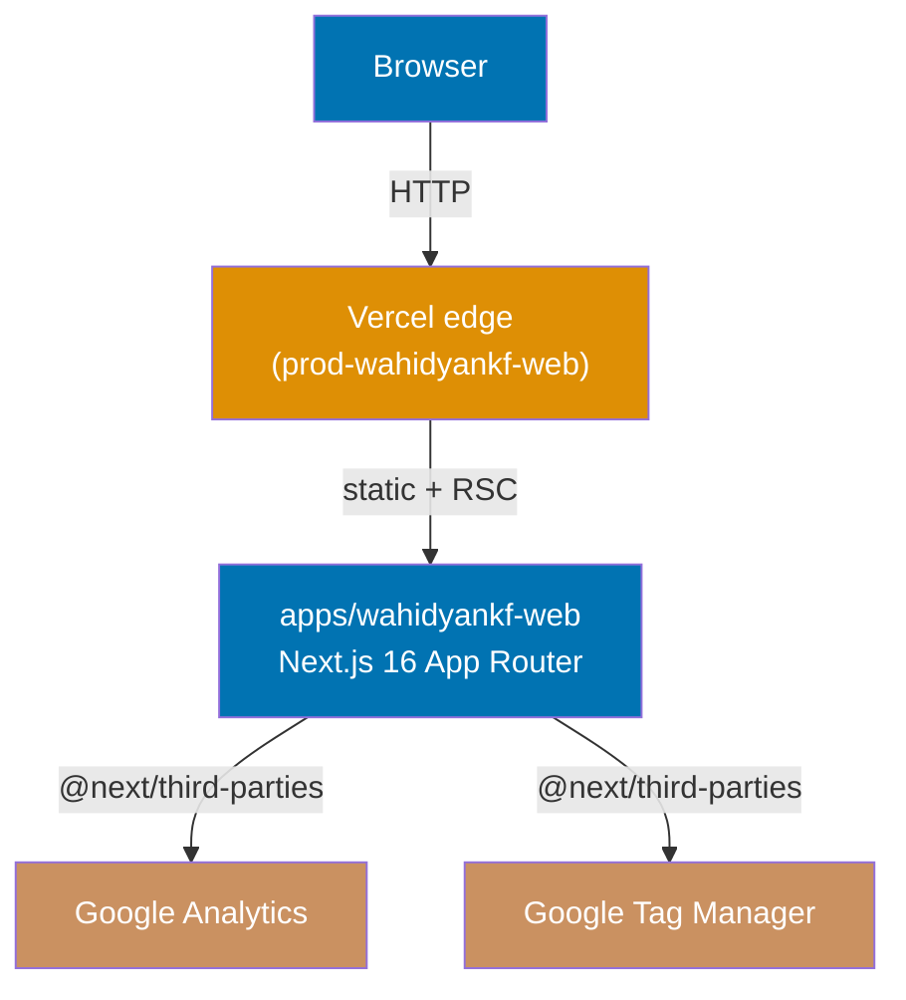
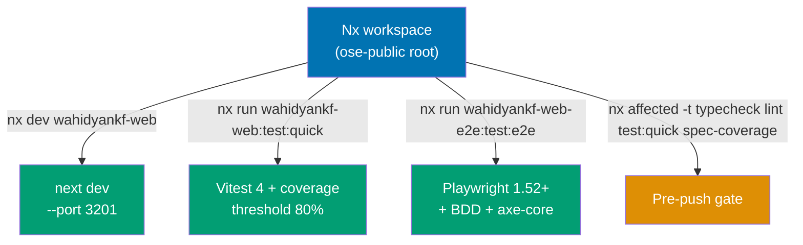
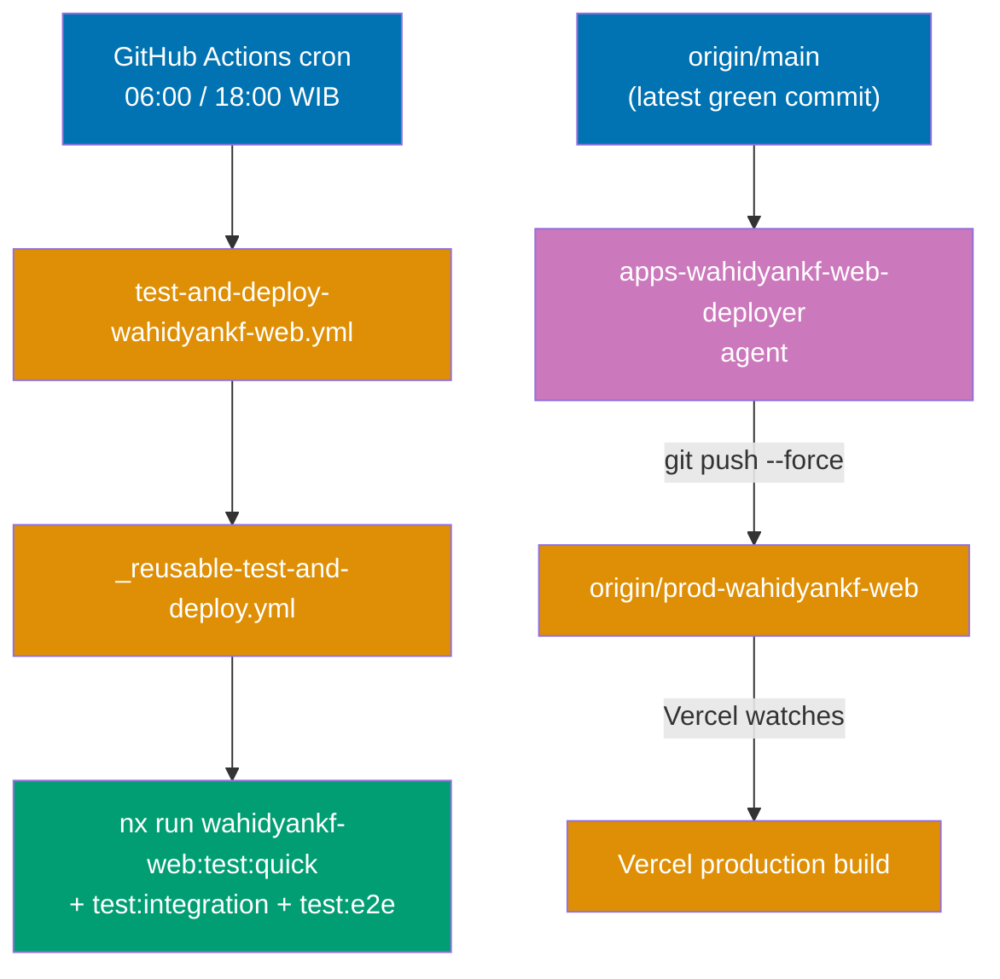

# Tech Docs — Adopt wahidyankf-web

## Architecture

The system has three narrow concerns that each warrant their own diagram
— runtime request flow, local developer workflow, and CI + deploy — so
readers can focus on one concern at a time without a busy omnibus chart.

### Runtime Request Flow

What a visitor's browser actually talks to in production.



### Local Developer Workflow

What the maintainer runs on their own machine through Nx targets.



### CI and Deploy Flow

How scheduled CI drives the same Nx targets, and how the production
branch receives force-pushes from `main`.



All runtime code is ported from the upstream `wahidyankf/oss /
apps-standalone/wahidyankf-web/`. No new server concerns land with this
plan: no API routes, no tRPC, no auth, no database. The app is a
Next.js 16 App Router build with `output: "standalone"` so Vercel can
deploy it directly and a container build remains possible for future
infra moves.

## File-by-File Port Map

Source column uses upstream paths relative to
`wahidyankf/oss/apps-standalone/wahidyankf-web/`. Target column uses
repo paths relative to `apps/wahidyankf-web/`. Transformations listed
where files change shape during port.

| Source                                    | Target                                         | Transformation                                                                                                                                                                                                                                                                                                                                                                                       |
| ----------------------------------------- | ---------------------------------------------- | ---------------------------------------------------------------------------------------------------------------------------------------------------------------------------------------------------------------------------------------------------------------------------------------------------------------------------------------------------------------------------------------------------- |
| `src/app/layout.tsx`                      | `src/app/layout.tsx`                           | Preserve `<html>` / `<body>`; add `@next/third-parties` if GA/GTM env vars present; keep `fonts/` imports                                                                                                                                                                                                                                                                                            |
| `src/app/page.tsx`                        | `src/app/page.tsx`                             | Keep `"use client"`; retain `<Suspense>`; update imports to repo alias `@/`                                                                                                                                                                                                                                                                                                                          |
| `src/app/page.test.tsx`                   | `src/app/page.unit.test.tsx`                   | Rename to `.unit.test.tsx` to match `vitest.config.ts` unit project include glob                                                                                                                                                                                                                                                                                                                     |
| `src/app/layout.test.tsx`                 | `src/app/layout.unit.test.tsx`                 | Same rename rule                                                                                                                                                                                                                                                                                                                                                                                     |
| `src/app/head.tsx`                        | `src/app/head.tsx`                             | Keep as-is (still supported in Next 16 App Router)                                                                                                                                                                                                                                                                                                                                                   |
| `src/app/data.ts`                         | `src/app/data.ts`                              | Copy verbatim                                                                                                                                                                                                                                                                                                                                                                                        |
| `src/app/data.test.ts`                    | `src/app/data.unit.test.ts`                    | Rename                                                                                                                                                                                                                                                                                                                                                                                               |
| `src/app/globals.css`                     | `src/app/globals.css`                          | Migrate to Tailwind 4 syntax: replace `@tailwind base/components/utilities` with `@import "tailwindcss"`; mirror the globals.css shape used by `apps/ayokoding-web/src/app/globals.css`                                                                                                                                                                                                              |
| `src/app/favicon.ico`                     | `src/app/favicon.ico`                          | Copy                                                                                                                                                                                                                                                                                                                                                                                                 |
| `src/app/fonts/`                          | `src/app/fonts/`                               | Copy                                                                                                                                                                                                                                                                                                                                                                                                 |
| `src/app/cv/page.tsx`                     | `src/app/cv/page.tsx`                          | Update imports                                                                                                                                                                                                                                                                                                                                                                                       |
| `src/app/cv/page.test.tsx`                | `src/app/cv/page.unit.test.tsx`                | Rename                                                                                                                                                                                                                                                                                                                                                                                               |
| `src/app/personal-projects/page.tsx`      | `src/app/personal-projects/page.tsx`           | Update imports                                                                                                                                                                                                                                                                                                                                                                                       |
| `src/app/personal-projects/page.test.tsx` | `src/app/personal-projects/page.unit.test.tsx` | Rename                                                                                                                                                                                                                                                                                                                                                                                               |
| `src/components/HighlightText.tsx`        | `src/components/HighlightText.tsx`             | Copy                                                                                                                                                                                                                                                                                                                                                                                                 |
| `src/components/HighlightText.test.tsx`   | `src/components/HighlightText.unit.test.tsx`   | Rename                                                                                                                                                                                                                                                                                                                                                                                               |
| `src/components/Navigation.tsx`           | `src/components/Navigation.tsx`                | Copy                                                                                                                                                                                                                                                                                                                                                                                                 |
| `src/components/Navigation.test.tsx`      | `src/components/Navigation.unit.test.tsx`      | Rename                                                                                                                                                                                                                                                                                                                                                                                               |
| `src/components/ScrollToTop.tsx`          | `src/components/ScrollToTop.tsx`               | Copy                                                                                                                                                                                                                                                                                                                                                                                                 |
| `src/components/ScrollToTop.test.tsx`     | `src/components/ScrollToTop.unit.test.tsx`     | Rename                                                                                                                                                                                                                                                                                                                                                                                               |
| `src/components/SearchComponent.tsx`      | `src/components/SearchComponent.tsx`           | Copy                                                                                                                                                                                                                                                                                                                                                                                                 |
| `src/components/SearchComponent.test.tsx` | `src/components/SearchComponent.unit.test.tsx` | Rename                                                                                                                                                                                                                                                                                                                                                                                               |
| `src/components/ThemeToggle.tsx`          | `src/components/ThemeToggle.tsx`               | Copy; add a `ThemeToggle.unit.test.tsx` in P3 (upstream has no test; filling coverage gap)                                                                                                                                                                                                                                                                                                           |
| `src/utils/search.ts`                     | `src/utils/search.ts`                          | Copy                                                                                                                                                                                                                                                                                                                                                                                                 |
| `src/utils/markdown.tsx`                  | `src/utils/markdown.tsx`                       | Copy (file uses JSX — extension must stay `.tsx`)                                                                                                                                                                                                                                                                                                                                                    |
| `src/utils/markdown.test.tsx`             | `src/utils/markdown.unit.test.tsx`             | Rename to `.unit.test.tsx` (JSX in test file)                                                                                                                                                                                                                                                                                                                                                        |
| `src/utils/style.ts`                      | `src/utils/style.ts`                           | Copy verbatim (style helpers; inspect for Tailwind 4 token usage)                                                                                                                                                                                                                                                                                                                                    |
| `src/utils/style.test.ts`                 | `src/utils/style.unit.test.ts`                 | Rename to `.unit.test.ts`                                                                                                                                                                                                                                                                                                                                                                            |
| `src/test/setup.ts`                       | `src/test/setup.ts`                            | Retain upstream content; update for Vitest 4 + `@testing-library/jest-dom ^6.0.0` if needed                                                                                                                                                                                                                                                                                                          |
| `public/*`                                | `public/*`                                     | Copy all static assets                                                                                                                                                                                                                                                                                                                                                                               |
| `next.config.mjs`                         | `next.config.ts`                               | Rewrite to TypeScript; add `output: "standalone"`; preserve `images.unoptimized: true`                                                                                                                                                                                                                                                                                                               |
| `tailwind.config.ts`                      | _(removed)_                                    | Tailwind v4 reads tokens from CSS directly; delete in favour of `globals.css` `@theme` block                                                                                                                                                                                                                                                                                                         |
| `postcss.config.mjs`                      | `postcss.config.mjs`                           | Update to `{"plugins":{"@tailwindcss/postcss":{}}}` for Tailwind 4                                                                                                                                                                                                                                                                                                                                   |
| `tsconfig.json`                           | `tsconfig.json`                                | Extend `../../tsconfig.base.json`                                                                                                                                                                                                                                                                                                                                                                    |
| `vitest.config.ts`                        | `vitest.config.ts`                             | Rewrite based on `apps/ayokoding-web/vitest.config.ts`; 80% thresholds; two projects: `unit-fe` (jsdom, with `setupFiles: ["./src/test/setup.ts"]`) + `integration` (node). The `unit` (node) project from ayokoding-web is intentionally omitted because there is no node-only code in this app at adoption time. The `test:unit` target uses `--project unit-fe` (see project.json section below). |
| `playwright.config.ts`                    | _(moved)_                                      | Moves into new sibling `apps/wahidyankf-web-e2e/playwright.config.ts` in P4                                                                                                                                                                                                                                                                                                                          |
| `.eslintrc.json`                          | _(removed)_                                    | Replaced by `oxlint.json` identical to `organiclever-fe`'s                                                                                                                                                                                                                                                                                                                                           |
| `.prettierrc`                             | _(removed)_                                    | Use repo-root Prettier config                                                                                                                                                                                                                                                                                                                                                                        |
| `README.md`                               | `README.md`                                    | Rewrite to match `apps/organiclever-fe/README.md` structure                                                                                                                                                                                                                                                                                                                                          |
| `LICENSE`                                 | `LICENSE`                                      | Copy (MIT-compatible; verified in P0)                                                                                                                                                                                                                                                                                                                                                                |

Files to add that upstream does not have:

| Target                                       | Purpose                                                                         |
| -------------------------------------------- | ------------------------------------------------------------------------------- |
| `project.json`                               | Nx project configuration (targets + tags)                                       |
| `.dockerignore`                              | Match `organiclever-fe/.dockerignore`                                           |
| `Dockerfile`                                 | Multi-stage Next.js standalone build (copy from `organiclever-fe/Dockerfile`)   |
| `vercel.json`                                | Enforce `VERCEL_GIT_COMMIT_REF == prod-wahidyankf-web` ignore, security headers |
| `test/unit/` directory                       | Gherkin step implementations (see "Gherkin Location" below)                     |
| `specs/apps/wahidyankf/fe/gherkin/*.feature` | Feature files mirroring the PRD Gherkin ACs                                     |
| `specs/apps/wahidyankf/README.md`            | Describes the domain + BDD framework used                                       |
| `apps/wahidyankf-web-e2e/` (entire project)  | Playwright-BDD E2E runner, modelled on `organiclever-fe-e2e/`                   |

## Dependency Upgrade Matrix

Source versions are from the upstream `package.json` on `main` at
<https://github.com/wahidyankf/oss/blob/main/apps-standalone/wahidyankf-web/package.json>
(accessed 2026-04-19).

**Target versions MUST match `apps/ayokoding-web/package.json` and
`apps/oseplatform-web/package.json`** for every package in the testing
and quality-gate stack. The user's stack-parity requirement is
authoritative — where the two content-platform sibling apps agree on a
caret range, we adopt that exact range verbatim. Where only
`organiclever-fe` uses a different pin (e.g., `jsdom ^28.1.0`,
`vite-tsconfig-paths ^6.1.1`, `@vitejs/plugin-react ^5.1.4`), we **do
not** adopt it — we take the ayokoding/oseplatform value because two
apps agree and `wahidyankf-web` is structurally a content platform like
them (no API/auth mock layer), not an FE with a mocked backend.

The version-verification obligation below still applies — if npm's live
latest is newer than the baseline at P2 execution time and all three
siblings have moved together, bump accordingly; otherwise preserve
parity.

### Runtime dependencies

| Package                    | Source     | Target      | Matches sibling apps                                                 | Rationale                                                                                                                                                                            |
| -------------------------- | ---------- | ----------- | -------------------------------------------------------------------- | ------------------------------------------------------------------------------------------------------------------------------------------------------------------------------------ |
| `next`                     | `14.2.13`  | `16.1.6`    | `ayokoding-web`, `oseplatform-web`, `organiclever-fe` (all `16.1.6`) | Exact pin across all three Next.js apps.                                                                                                                                             |
| `react`                    | `^18`      | `^19.0.0`   | `ayokoding-web`, `oseplatform-web` (`^19.0.0`)                       | `organiclever-fe` uses `^19.1.0`; the `^19.0.0` caret resolves to the same installed version, so adopting `^19.0.0` matches both content platforms exactly without functional drift. |
| `react-dom`                | `^18`      | `^19.0.0`   | Same                                                                 | Same.                                                                                                                                                                                |
| `@next/third-parties`      | `^14.2.14` | `^16.0.0`   | `ayokoding-web` (`^16.0.0`)                                          | Matches ayokoding-web (oseplatform-web does not use this package). Covers Next 16.x.                                                                                                 |
| `class-variance-authority` | `^0.7.0`   | `^0.7.0`    | `ayokoding-web`, `oseplatform-web` (`^0.7.0`)                        | Exact match.                                                                                                                                                                         |
| `clsx`                     | `^2.1.1`   | `^2.1.1`    | `ayokoding-web`, `oseplatform-web` (`^2.1.1`)                        | Exact match.                                                                                                                                                                         |
| `lucide-react`             | `^0.446.0` | `^0.447.0`  | `ayokoding-web`, `oseplatform-web` (`^0.447.0`)                      | Exact match with the two content-platform siblings.                                                                                                                                  |
| `react-icons`              | `^5.3.0`   | `^5.3.0`    | _(not used by siblings — upstream-only)_                             | Retain upstream version; re-verify in P2. `react-icons` is not in any sibling so parity does not apply.                                                                              |
| `tailwind-merge`           | `^2.5.2`   | `^2.5.3`    | `ayokoding-web`, `oseplatform-web` (`^2.5.3`)                        | Exact match with content-platform siblings; still Tailwind-4 compatible at `^2.5.3` per siblings' lockfile state.                                                                    |
| `tailwindcss-animate`      | `^1.0.7`   | _(removed)_ | _(not used by any sibling)_                                          | Drop — no sibling uses it; if any animation-helper is still needed post-Tailwind-4, replicate the handful of classes inline rather than carrying a bespoke dep. Re-evaluate at P2.   |

### Dev dependencies (testing + quality-gate stack)

**Every row below MUST match `ayokoding-web/package.json` and/or
`oseplatform-web/package.json` exactly** per the stack-parity rule. Where
the two disagree we align to both where possible (all the rows below, the
two siblings agree).

| Package                         | Source               | Target                                                           | Matches sibling apps                                             | Rationale                                                                                                                                           |
| ------------------------------- | -------------------- | ---------------------------------------------------------------- | ---------------------------------------------------------------- | --------------------------------------------------------------------------------------------------------------------------------------------------- |
| `@amiceli/vitest-cucumber`      | _(new)_              | `^6.3.0`                                                         | `ayokoding-web`, `oseplatform-web` (`^6.3.0`)                    | Exact pin match for Gherkin runner.                                                                                                                 |
| `@playwright/test`              | `^1.48.1`            | `^1.50.0`                                                        | `oseplatform-web` (`^1.50.0`)                                    | Match oseplatform-web's baseline. (ayokoding-web does not declare this dep directly because its E2E runner lives in a sibling `-e2e` project.)      |
| `@tailwindcss/postcss`          | _(new)_              | `^4.0.0`                                                         | `ayokoding-web`, `oseplatform-web` (`^4.0.0`)                    | Exact match.                                                                                                                                        |
| `@tailwindcss/typography`       | _(new)_              | _(omitted)_                                                      | `ayokoding-web`, `oseplatform-web` (`^0.5.0`)                    | Sibling apps use it for markdown content; `wahidyankf-web` renders no markdown in this plan. Add only when a future content-adopting plan needs it. |
| `@testing-library/jest-dom`     | `^5.16.5`            | `^6.0.0`                                                         | `ayokoding-web`, `oseplatform-web` (`^6.0.0`)                    | Exact match.                                                                                                                                        |
| `@testing-library/react`        | `^14.0.0`            | `^16.0.0`                                                        | `ayokoding-web`, `oseplatform-web` (`^16.0.0`)                   | Exact match; React-19 compatible.                                                                                                                   |
| `@types/node`                   | `^20`                | `^22.0.0`                                                        | `ayokoding-web`, `oseplatform-web` (`^22.0.0`)                   | Exact match.                                                                                                                                        |
| `@types/react`                  | `^18`                | `^19.0.0`                                                        | `ayokoding-web`, `oseplatform-web` (`^19.0.0`)                   | Exact match.                                                                                                                                        |
| `@types/react-dom`              | `^18`                | `^19.0.0`                                                        | `ayokoding-web`, `oseplatform-web` (`^19.0.0`)                   | Exact match.                                                                                                                                        |
| `@vitejs/plugin-react`          | `^4.0.0`             | `^4.0.0`                                                         | `ayokoding-web`, `oseplatform-web` (`^4.0.0`)                    | Exact match.                                                                                                                                        |
| `@vitest/coverage-v8`           | _(new)_              | `^4.0.0`                                                         | `ayokoding-web`, `oseplatform-web` (`^4.0.0`)                    | Exact match; Vitest 4 coverage provider.                                                                                                            |
| `@vitest/ui`                    | `^0.31.0`            | _(removed)_                                                      | _(not used by siblings)_                                         | Not required for headless CI.                                                                                                                       |
| `eslint` + `eslint-config-next` | `^8` / `14.2.13`     | _(removed)_                                                      | _(not used by siblings)_                                         | Replaced by `oxlint` + `jsx-a11y`, matching the other three Next.js apps.                                                                           |
| `eslint-plugin-vitest-globals`  | `^1.5.0`             | _(removed)_                                                      | _(not used by siblings)_                                         | No longer needed post-ESLint removal.                                                                                                               |
| `husky` + `lint-staged`         | `^9.1.6` / `^13.3.0` | _(removed)_                                                      | _(not used at app level by siblings)_                            | Workspace root already configures Husky + lint-staged.                                                                                              |
| `jsdom`                         | `^22.0.0`            | `^26.0.0`                                                        | `ayokoding-web`, `oseplatform-web` (`^26.0.0`)                   | Exact match; Vitest-4-compatible. (organiclever-fe uses `^28.1.0` — we take the content-platform value per the stack-parity rule.)                  |
| `postcss`                       | `^8`                 | _(removed as direct dep; transitive via `@tailwindcss/postcss`)_ | `ayokoding-web`, `oseplatform-web` (not declared directly)       | Content-platform siblings rely on transitive `postcss`; match.                                                                                      |
| `prettier`                      | `^2.8.8`             | _(removed)_                                                      | _(workspace-root)_                                               | Use workspace-root Prettier config.                                                                                                                 |
| `tailwindcss`                   | `^3.4.1`             | `^4.0.0`                                                         | `ayokoding-web`, `oseplatform-web` (`^4.0.0`)                    | Exact match; major v4 migration.                                                                                                                    |
| `typescript`                    | `^5`                 | `^5.6.0`                                                         | `ayokoding-web`, `oseplatform-web` (`^5.6.0`)                    | Exact match.                                                                                                                                        |
| `vite`                          | `^4.3.9`             | _(removed — transitive via Vitest 4)_                            | `ayokoding-web`, `oseplatform-web` (not declared directly)       | Vitest 4 embeds Vite.                                                                                                                               |
| `vite-tsconfig-paths`           | _(new)_              | `^5.0.0`                                                         | `ayokoding-web`, `oseplatform-web` (`^5.0.0`)                    | Exact match. (organiclever-fe uses `^6.1.1` — we take the content-platform value.)                                                                  |
| `vitest`                        | `^0.31.0`            | `^4.0.0`                                                         | `ayokoding-web`, `oseplatform-web`, `organiclever-fe` (`^4.0.0`) | Exact match; all three siblings agree.                                                                                                              |

### E2E sibling app (`apps/wahidyankf-web-e2e`) dependencies

Model after `apps/organiclever-fe-e2e/package.json` — the three content
Web apps do not have a direct FE-only E2E runner sibling at this exact
shape (ayokoding-web and oseplatform-web split BE/FE into two `-e2e`
projects because they expose tRPC APIs; `wahidyankf-web` has no backend
so a single `-e2e` project suffices, mirroring `organiclever-fe-e2e`).

| Package                | Target    | Matches sibling                   | Rationale                                      |
| ---------------------- | --------- | --------------------------------- | ---------------------------------------------- |
| `@playwright/test`     | `^1.52.0` | `organiclever-fe-e2e` (`^1.52.0`) | Matches the E2E model sibling directly.        |
| `playwright-bdd`       | `^8.4.2`  | `organiclever-fe-e2e` (`^8.4.2`)  | BDD glue layer used repo-wide.                 |
| `@axe-core/playwright` | `^4.10.1` | `organiclever-fe-e2e` (`^4.10.1`) | Accessibility scans for the a11y feature file. |
| `typescript`           | `^5.6.0`  | Content-platform siblings         | Exact match.                                   |

### Version verification obligation

Before the P2 `npm install` step, run `npm view <pkg> version` for each
row in the upgrade matrix AND `jq -r .devDependencies.<pkg>
apps/ayokoding-web/package.json` to confirm the live sibling pin. If any
live value is newer than the plan's target AND all relevant siblings have
moved together, bump the target on the fly. If a sibling's version drifts
later in time but the plan hasn't bumped yet, **preserve parity with the
siblings, not with npm latest** — the stack-parity requirement trumps
"freshness".

## Nx Project Configuration

### `apps/wahidyankf-web/project.json`

Targets exposed, modelled on `apps/organiclever-fe/project.json` minus
`codegen` (no OpenAPI contract):

- `dev` — `next dev --port 3201` (port rationale: `3100` oseplatform-web,
  `3101` ayokoding-web, `3200` organiclever-fe; `3201` first free above
  organiclever-fe; recorded in top-level `CLAUDE.md` under the app's section).
- `build` — `next build` with `outputs: ["{projectRoot}/.next"]`.
- `start` — `next start --port 3201`.
- `typecheck` — `tsc --noEmit`.
- `lint` — `npx oxlint@latest --jsx-a11y-plugin .`.
- `test:unit` — `npx vitest run --project unit-fe`; cacheable.
- `test:integration` — `npx vitest run --project integration`; cacheable.
  (No integration tests ship in P3/P4, but the target exists per the "all
  apps with unit tests" rule in the three-level testing standard.)
- `test:quick` — `npx vitest run --coverage && (cd ../../apps/rhino-cli &&
CGO_ENABLED=0 go run main.go test-coverage validate
apps/wahidyankf-web/coverage/lcov.info 80)`; cacheable. Threshold `80`
  matches the two content-platform siblings (`ayokoding-web`,
  `oseplatform-web`).
- `spec-coverage` — `rhino-cli spec-coverage validate --shared-steps
specs/apps/wahidyankf/fe/gherkin apps/wahidyankf-web`; cacheable.

Tags: `["type:app", "platform:nextjs", "lang:ts", "domain:wahidyankf"]`.

### `apps/wahidyankf-web-e2e/project.json`

Model on `apps/organiclever-fe-e2e/project.json`. Targets: `install`,
`typecheck`, `lint`, `test:quick`, `test:e2e`, `test:e2e:ui`,
`test:e2e:report`, `spec-coverage`.

Tags: `["type:e2e", "platform:playwright", "lang:ts", "domain:wahidyankf"]`.
`implicitDependencies: ["wahidyankf-web"]`.

### Tag vocabulary extension

`governance/development/infra/nx-targets.md` currently enumerates allowed
`domain:` values as `ayokoding | oseplatform | organiclever | demo-be |
demo-fe | tooling`. Add `wahidyankf` to this list in P6. Without the
update, the tag fails the tag convention and `repo-rules-checker` surfaces
it as a finding.

### Top-level consequences

- `CLAUDE.md` → add `apps/wahidyankf-web/` + `apps/wahidyankf-web-e2e/`
  to the Apps list and add a "Web Sites > wahidyankf-web" section.
- `apps/README.md` → add the app to the app inventory list.
- `governance/development/infra/nx-targets.md` → append the app and
  its e2e runner to the "Current Project Tags" table.
- `docs/how-to/add-new-app.md` → referenced by this plan but not
  modified unless the port reveals a gap (a follow-up may update it).

## Gherkin Location

Feature files live at `specs/apps/wahidyankf/fe/gherkin/`. Each scenario
from `prd.md` maps to a feature file:

| Feature file                | Scenarios                           | Level               |
| --------------------------- | ----------------------------------- | ------------------- |
| `home.feature`              | Home page renders + Quick Links     | unit + E2E          |
| `search.feature`            | Search filters skills + click-to-CV | unit + E2E          |
| `cv.feature`                | CV renders + highlight              | unit + E2E          |
| `theme.feature`             | Theme toggle                        | unit + E2E          |
| `personal-projects.feature` | Personal projects page renders      | unit + E2E          |
| `accessibility.feature`     | axe-core AA on home + CV            | E2E only (axe-core) |

Unit step implementations under `apps/wahidyankf-web/test/unit/steps/`
mock the DOM via Testing Library. E2E step implementations under
`apps/wahidyankf-web-e2e/steps/` drive Playwright. Both projects consume
the same feature files — this matches the `organiclever-fe` pattern.

## Test Strategy

- **Unit (`test:unit` / `test:quick`)** — Vitest 4 with jsdom. All
  upstream `.test.tsx` files port to `.unit.test.tsx` under their
  component file. Gherkin step definitions under `test/unit/steps/`
  cover the ACs that map cleanly to component interaction (home search
  filter, theme toggle, highlight output).
- **Integration (`test:integration`)** — Empty project definition, no
  files in P3/P4. Target exists so the pre-push gate does not skip the
  project.
- **E2E (`test:e2e` in `wahidyankf-web-e2e`)** — Playwright-BDD.
  Features: `home.feature`, `search.feature`, `cv.feature`,
  `theme.feature`, `personal-projects.feature`, `accessibility.feature`.
  Accessibility feature uses `@axe-core/playwright` with WCAG 2.1 AA tags.
- **Coverage thresholds (in `vitest.config.ts`)** — lines 80, functions
  80, branches 80, statements 80. Matches `ayokoding-web` and
  `oseplatform-web` content platforms (the closest sibling apps
  structurally). `rhino-cli test-coverage validate` enforces the 80% line
  floor in `test:quick`. The 70% threshold carried by `organiclever-fe`
  is a deliberate lower bar there because it mocks API and auth layers
  by design; `wahidyankf-web` has no such layer so the higher content-
  platform threshold is the right match.
- **Coverage excludes** — `src/app/layout.tsx`, `src/app/head.tsx`,
  `src/app/fonts/*`, `src/test/**`, generated files.

## CI / Vercel Wiring

### `.github/workflows/test-and-deploy-wahidyankf-web.yml`

Mirror `test-and-deploy-ayokoding-web.yml` structurally:

```yaml
name: Test and Deploy - Wahidyankf Web

on:
  schedule:
    - cron: "0 23 * * *" # 6 AM WIB
    - cron: "0 11 * * *" # 6 PM WIB
  workflow_dispatch:

permissions:
  contents: write

jobs:
  test-and-deploy:
    uses: ./.github/workflows/_reusable-test-and-deploy.yml
    with:
      app-name: wahidyankf-web
      prod-branch: prod-wahidyankf-web
      health-url: http://localhost:3201
      health-timeout: 150
```

### `apps/wahidyankf-web/vercel.json`

```json
{
  "version": 2,
  "installCommand": "npm install --prefix=../.. --ignore-scripts",
  "buildCommand": "next build",
  "ignoreCommand": "[ \"$VERCEL_GIT_COMMIT_REF\" != \"prod-wahidyankf-web\" ]",
  "headers": [
    {
      "source": "/(.*)",
      "headers": [
        { "key": "X-Content-Type-Options", "value": "nosniff" },
        { "key": "X-Frame-Options", "value": "SAMEORIGIN" },
        { "key": "X-XSS-Protection", "value": "1; mode=block" },
        { "key": "Referrer-Policy", "value": "strict-origin-when-cross-origin" }
      ]
    }
  ]
}
```

### Deployer agent

`.claude/agents/apps-wahidyankf-web-deployer.md` — copy the three
existing `apps-*-deployer.md` files as a template; update `name`,
`description`, the production-branch name, and the `skills:` block to
reference the correct developing-content skill (none exists yet — omit
or replace with `repo-practicing-trunk-based-development` only). Sync
to `.opencode/agent/` via `npm run sync:claude-to-opencode`.

## Phase Commit Map

Each phase commits once under Conventional Commits. Phase scope is
exhaustive: everything listed lands in that phase's single commit. All
phases push `origin main` (or the worktree branch, depending on plan
execution mode).

| Phase | Title                  | Commit message                                                           | Files touched                                                                                                                                                                                                                                                                                                                                        |
| ----- | ---------------------- | ------------------------------------------------------------------------ | ---------------------------------------------------------------------------------------------------------------------------------------------------------------------------------------------------------------------------------------------------------------------------------------------------------------------------------------------------- |
| P0    | Prep & Gap Resolution  | `docs(plans): record wahidyankf-web adoption prep notes`                 | `plans/in-progress/2026-04-19__adopt-wahidyankf-web/{prep-notes.md,delivery.md}` (prep-notes is discarded before plan close-out)                                                                                                                                                                                                                     |
| P1    | Scaffold & Port Source | `feat(wahidyankf-web): scaffold Nx app and port source`                  | `apps/wahidyankf-web/**`, `package-lock.json`                                                                                                                                                                                                                                                                                                        |
| P2    | Upgrade Dependencies   | `chore(wahidyankf-web): upgrade dependencies to 2026-04 stable`          | `apps/wahidyankf-web/package.json`, `package-lock.json`, `apps/wahidyankf-web/src/**` (codemod output), `apps/wahidyankf-web/postcss.config.mjs`, `apps/wahidyankf-web/src/app/globals.css`                                                                                                                                                          |
| P3    | Unit Tests + Gherkin   | `test(wahidyankf-web): port unit tests and add Gherkin acceptance specs` | `apps/wahidyankf-web/src/**/*.unit.test.{ts,tsx}`, `apps/wahidyankf-web/test/unit/**`, `apps/wahidyankf-web/src/test/setup.ts`, `specs/apps/wahidyankf/**`                                                                                                                                                                                           |
| P4    | E2E Runner             | `test(wahidyankf-web-e2e): add Playwright-BDD runner with a11y smoke`    | `apps/wahidyankf-web-e2e/**`, `specs/apps/wahidyankf/fe/gherkin/accessibility.feature`                                                                                                                                                                                                                                                               |
| P5    | Quality Gates          | `ci(wahidyankf-web): wire typecheck, lint, spec-coverage, pre-push gate` | `apps/wahidyankf-web/project.json`, `apps/wahidyankf-web-e2e/project.json`, `apps/wahidyankf-web/oxlint.json`, `nx.json` (only if a target-default addition is needed)                                                                                                                                                                               |
| P6    | Deployment Wiring      | `ci(wahidyankf-web): add Vercel deploy workflow and deployer agent`      | `.github/workflows/test-and-deploy-wahidyankf-web.yml`, `apps/wahidyankf-web/vercel.json`, `apps/wahidyankf-web/Dockerfile`, `apps/wahidyankf-web/.dockerignore`, `.claude/agents/apps-wahidyankf-web-deployer.md`, `.opencode/agent/apps-wahidyankf-web-deployer.md`, `governance/development/infra/nx-targets.md` (tag vocab + current-tags table) |
| P7    | Docs & Close-out       | `docs(wahidyankf-web): add to platform docs and close adoption plan`     | `CLAUDE.md`, `README.md`, `apps/README.md`, the plan's final state + move to `plans/done/`                                                                                                                                                                                                                                                           |

## Rollout Risks and Mitigations

| Risk                                                          | Mitigation                                                                                                                                                                                                                                                                     |
| ------------------------------------------------------------- | ------------------------------------------------------------------------------------------------------------------------------------------------------------------------------------------------------------------------------------------------------------------------------ |
| Tailwind 4 migration breaks the upstream green-on-black theme | P2 runs `npx @tailwindcss/upgrade@latest` on the ported app; P4 Playwright smoke renders `/` and `/cv` at both themes                                                                                                                                                          |
| Next.js 14 → 16 renames break route-handler imports           | Phase P2 runs `npx @next/codemod upgrade` and the Next 15/16 upgrade codemods; P4 smoke tests exercise every route                                                                                                                                                             |
| React 19 + `useSearchParams` Suspense requirement             | Upstream already wraps `HomeContent` in `<Suspense>`; unit tests verify the Suspense boundary renders fallback                                                                                                                                                                 |
| oxlint jsx-a11y flags existing upstream markup                | Fix violations in P3 (unit phase) before P5 turns on CI enforcement                                                                                                                                                                                                            |
| `rhino-cli spec-coverage` finds ungrounded Gherkin steps      | All Gherkin step phrases originate from the acceptance criteria in `prd.md`; step implementations ship in the same commit (P3)                                                                                                                                                 |
| Port misses an upstream file                                  | `tech-docs.md` File-by-File Port Map is exhaustive against the upstream repo snapshot on 2026-04-19 (includes `style.ts`, `style.test.ts`, `markdown.tsx`, `markdown.test.tsx`, and `src/test/setup.ts`); P0 diff-audit checkbox verifies every upstream file is accounted for |
| Production branch created before `main` is actually green     | P6 order: verify `nx affected -t typecheck lint test:quick spec-coverage` exits zero on the commit that concludes P5 before creating the branch                                                                                                                                |

## Rollback

Each phase commits independently on `main`. To roll back:

- If rollback is needed _before_ P6: `git revert <phase-commit>` on the
  relevant phase. The app is not yet in any deploy path so reversion is
  zero-downtime.
- If rollback is needed _after_ P6 but before a Vercel project binding:
  revert the phase commit; delete the `prod-wahidyankf-web` remote
  branch (`git push origin --delete prod-wahidyankf-web`).
- If rollback is needed _after_ Vercel binding: leave `main` untouched,
  force-push an earlier known-good commit via
  `apps-wahidyankf-web-deployer` (identical to the other three
  deployers' rollback story).

No database, no external state, no migration — rollback is always a git
revert plus at most a branch delete.
