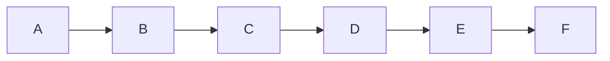

# Tech Docs: Fix All Mermaid Diagram Violations

## 1. Suppression mechanism design

### 1.1 Syntax

Place an HTML comment on the line **immediately before** the opening fence of
the mermaid block:

````markdown
<!-- mermaid-skip -->


````

````

Rules:

- The comment must be on the line directly preceding the ` ```mermaid ` fence
  (no blank line between them).
- The comment text must match exactly `<!-- mermaid-skip -->` (case-sensitive,
  no trailing attributes).
- It applies to one block only (the immediately following one).
- If the following block is not a flowchart/graph type, the comment has no effect
  (non-flowchart blocks are already ignored; skipped count is not incremented).

### 1.2 Implementation — extractor

`apps/rhino-cli/internal/mermaid/extractor.go` tracks the previous non-empty
line while walking the file. When the state machine opens a new mermaid fence,
it checks whether `prevLine == "<!-- mermaid-skip -->"`. If so, it sets
`MermaidBlock.Skip = true` on the extracted block.

```go
type MermaidBlock struct {
    Content    string
    StartLine  int
    BlockIndex int
    Skip       bool   // true when preceded by <!-- mermaid-skip -->
}
````

### 1.3 Implementation — validator

`ValidateBlocks` skips any block where `block.Skip == true`:

```go
if block.Skip {
    result.Skipped++
    continue
}
```

`ValidationResult` gains a `Skipped int` field.

### 1.4 Implementation — reporter

Summary line updated:

```
Scanned 42 block(s) in 3 file(s): 0 violation(s), 2 skipped.
```

JSON output gains `"skipped": N` field.

### 1.5 Gherkin + tests

Four new scenarios in `specs/apps/rhino/cli/gherkin/docs-validate-mermaid.feature`
(see prd.md). Unit tests use mock FS; integration tests write temp files.

---

## 2. Fix strategy by area

### 2.1 Decision matrix

| Violation        | Condition                                                                          | Action                                         |
| ---------------- | ---------------------------------------------------------------------------------- | ---------------------------------------------- |
| `label_too_long` | Label can be split on a word boundary into lines ≤30 chars                         | Add `<br/>` split                              |
| `label_too_long` | Label is a code expression / SQL / signature that cannot be meaningfully shortened | Abbreviate with `…` or rename to concept label |
| `width_exceeded` | Span 4–6, nodes are a sequential process shown parallel by accident                | Restructure as chain                           |
| `width_exceeded` | Span 4–6, nodes are truly parallel options/outputs (e.g., "4 test runners")        | Suppress                                       |
| `width_exceeded` | Span 7+, architecture/C4 overview                                                  | Suppress                                       |
| `width_exceeded` | Span 7+, can be split into two sub-diagrams without losing meaning                 | Split into two diagrams                        |

### 2.2 Per-area guidance

#### `docs/how-to/` and `docs/reference/` (6 files)

Small volume. Fix all structurally — these are process/workflow diagrams where
chaining is semantically correct.

#### `specs/apps/*/c4/` (9 files)

C4 context and component diagrams are intentionally wide. Suppress all.

#### `plans/done/` (13 files)

Historical delivery diagrams. Suppress all — these are frozen records and their
layout is irrelevant to present-day readability enforcement.

#### `apps/oseplatform-web/content/updates/` (6 files)

Small volume. Fix labels, suppress wide architecture overviews (phase summary
diagrams showing 10+ weeks are intentionally wide).

#### `docs/explanation/` (96 files)

Mix. Fix language-overview diagrams (span 4–6 process flows). Suppress large
ecosystem overviews (Spring module map, TypeScript type hierarchy).

#### `apps/ayokoding-web/content/` (244 files)

Largest area. Subdivide by content subdirectory and delegate to content-aware
agents. Default: fix span-4 process flows; suppress span-6+ architecture
diagrams and comparison tables.

---

## 3. Nx target change

After all violations are fixed/suppressed, update `validate:mermaid` in
`apps/rhino-cli/project.json` to scan the full repo:

```json
"validate:mermaid": {
  "command": "CGO_ENABLED=0 go run -C apps/rhino-cli main.go docs validate-mermaid .",
  "cache": true,
  "inputs": [
    "{projectRoot}/**/*.go",
    "{workspaceRoot}/**/*.md"
  ],
  "outputs": []
}
```

The `--changed-only` pre-push hook invocation is unchanged — it already scans
all changed `.md` files regardless of Nx target scope.

---

## 4. Worktree

All changes are in `ose-public`. Use Scope A:

```bash
cd ose-public && claude --worktree mermaid-violations-fix
```

Worktree branch: `worktree-mermaid-violations-fix`
Surfaces as draft PR against `main` when complete.
