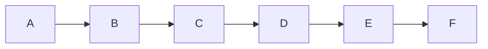

# Tech Docs: Fix All Mermaid Diagram Violations

## 1. Suppression mechanism design

### 1.1 Syntax

Place an HTML comment on the line **immediately before** the opening fence of
the mermaid block:

````markdown
<!-- mermaid-skip -->


````

````

Rules:

- The comment must be on the line directly preceding the ` ```mermaid ` fence
  (no blank line between them).
- The comment text must match exactly `<!-- mermaid-skip -->` (case-sensitive,
  no trailing attributes).
- It applies to one block only (the immediately following one).
- If the following block is not a flowchart/graph type, the comment has no effect
  (non-flowchart blocks are already ignored; skipped count is not incremented).

### 1.2 Implementation — extractor

`apps/rhino-cli/internal/mermaid/extractor.go` tracks the previous non-empty
line while walking the file. When the state machine opens a new mermaid fence,
it checks whether `prevLine == "<!-- mermaid-skip -->"`. If so, it sets
`MermaidBlock.Skip = true` on the extracted block.

The `Skip` field is added to `MermaidBlock` in `internal/mermaid/types.go`
(where the struct is declared), not in `extractor.go`:

```go
type MermaidBlock struct {
    FilePath   string
    BlockIndex int
    Source     string  // raw content of the fenced block
    StartLine  int
    Skip       bool    // true when preceded by <!-- mermaid-skip -->
}
````

### 1.3 Implementation — validator

`ValidateBlocks` skips any block where `block.Skip == true`:

```go
if block.Skip {
    result.Skipped++
    continue
}
```

`ValidationResult` gains a `Skipped int` field.

### 1.4 Implementation — reporter

Summary line updated to preserve the existing warnings count alongside the new
skipped count:

```
Found 0 violation(s) and 2 warning(s) in 3 file(s) (42 block(s) scanned, 2 skipped).
```

The warnings count is retained because `complex_diagram` warnings are the only
signal for diagrams that are too large but not flagged as errors; dropping them
from the summary would silently regress the tool's informativeness. The
`skipped` count is appended as a parenthetical to the existing format rather
than replacing it.

JSON output gains `"skipped": N` field.

### 1.5 Gherkin + tests

Four new scenarios in `specs/apps/rhino/cli/gherkin/docs-validate-mermaid.feature`
(see prd.md). Unit tests use mock FS; integration tests write temp files.

---

## 2. Fix strategy by area

### 2.1 Decision matrix

| Violation        | Condition                                                                          | Action                                         |
| ---------------- | ---------------------------------------------------------------------------------- | ---------------------------------------------- |
| `label_too_long` | Label can be split on a word boundary into lines ≤30 chars                         | Add `<br/>` split                              |
| `label_too_long` | Label is a code expression / SQL / signature that cannot be meaningfully shortened | Abbreviate with `…` or rename to concept label |
| `width_exceeded` | Span 4–6, nodes are a sequential process shown parallel by accident                | Restructure as chain                           |
| `width_exceeded` | Span 4–6, nodes are truly parallel options/outputs (e.g., "4 test runners")        | Suppress                                       |
| `width_exceeded` | Span 7+, architecture/C4 overview                                                  | Suppress                                       |
| `width_exceeded` | Span 7+, can be split into two sub-diagrams without losing meaning                 | Split into two diagrams                        |

### 2.2 Per-area guidance

#### `docs/how-to/` and `docs/reference/` (6 files)

Small volume. Fix all structurally — these are process/workflow diagrams where
chaining is semantically correct.

#### `specs/apps/*/c4/` (9 files)

C4 context and component diagrams are intentionally wide. Suppress all.

#### `plans/done/` (13 files)

Frozen historical records — never touched. Add `"done": true` to the `skipDirs`
map in `walkMDFiles` (same mechanism as `.next` and `node_modules`). The
validator will silently skip the entire directory on all future scans, including
the widened Nx target and `--changed-only` pre-push runs.

**Key choice rationale**: `walkMDFiles` uses `d.Name()`, which returns only the
base directory name. A two-component path like `"plans/done"` can never match a
`d.Name()` result — it would silently fail. The correct key is the bare basename
`"done"`. As of 2026-04-23, `plans/done/` is the only directory named `done`
in the `ose-public` repository (verified via `find . -type d -name done`), so
using the bare basename carries no false-exclusion risk. If a second `done/`
directory is added under a different parent in future, the skip logic should be
upgraded to full relative-path matching rather than basename matching.

#### `apps/oseplatform-web/content/updates/` (6 files)

Small volume. Fix labels, suppress wide architecture overviews (phase summary
diagrams showing 10+ weeks are intentionally wide).

#### `docs/explanation/` (96 files)

Mix. Fix language-overview diagrams (span 4–6 process flows). Suppress large
ecosystem overviews (Spring module map, TypeScript type hierarchy).

#### `apps/ayokoding-web/content/` (244 files)

Largest area. Subdivide by content subdirectory and delegate to content-aware
agents. Default: fix span-4 process flows; suppress span-6+ architecture
diagrams and comparison tables.

---

## 3. Nx target change

After all violations are fixed/suppressed, update `validate:mermaid` in
`apps/rhino-cli/project.json` to scan the full repo:

```json
"validate:mermaid": {
  "command": "CGO_ENABLED=0 go run -C apps/rhino-cli main.go docs validate-mermaid .",
  "cache": true,
  "inputs": [
    "{projectRoot}/**/*.go",
    "{workspaceRoot}/**/*.md"
  ],
  "outputs": []
}
```

The `--changed-only` pre-push hook invocation is unchanged — it already scans
all changed `.md` files regardless of Nx target scope.

---

## 4. Rollback

If the implementation needs to be reverted after merging, apply these steps in
reverse commit order:

### 4.1 Revert the skipDirs addition

In `apps/rhino-cli/cmd/docs_validate_mermaid.go`, remove the `"done": true`
entry from the `skipDirs` map. The directory was previously excluded by being
outside the default scan scope (`docs/`, `governance/`, `.claude/`); reverting
returns to that implicit exclusion.

### 4.2 Revert the suppression mechanism

Reverting the `Skip bool` field addition to `MermaidBlock` in
`internal/mermaid/types.go` will cause a compile error in `extractor.go`
(which sets the field) and `validator.go` (which reads it). Revert all four
files together in a single `git revert` commit:

- `internal/mermaid/types.go` — remove `Skip bool` field
- `internal/mermaid/extractor.go` — remove `prevLine` tracking and `block.Skip` assignment
- `internal/mermaid/validator.go` — remove `block.Skip` branch and `result.Skipped` increment
- `internal/mermaid/reporter.go` — revert summary format to drop skipped count

Also revert `ValidationResult.Skipped int` in `types.go` and the
`"skipped": N` field from JSON output in `reporter.go`.

### 4.3 Revert the Nx target scope change

In `apps/rhino-cli/project.json`, change the `validate:mermaid` target back
to scanning only `governance/` and `.claude/` instead of `.`. Update `inputs`
accordingly.

### 4.4 Revert markdown and spec changes

The `<!-- mermaid-skip -->` annotations added to 300+ markdown files and the
new Gherkin scenarios in `specs/apps/rhino/cli/gherkin/docs-validate-mermaid.feature`
are safe to leave in place if only a partial revert is needed. They have no
effect once the suppression mechanism in the Go code is removed (the
`<!-- mermaid-skip -->` HTML comment is ignored by the validator without the
`Skip` field support). A full revert should include reverting those files too
to keep the repository clean.

---

## 5. Worktree

All changes are in `ose-public`. Use Scope A:

```bash
cd ose-public && claude --worktree mermaid-violations-fix
```

Worktree branch: `worktree-mermaid-violations-fix`
Surfaces as draft PR against `main` when complete.
