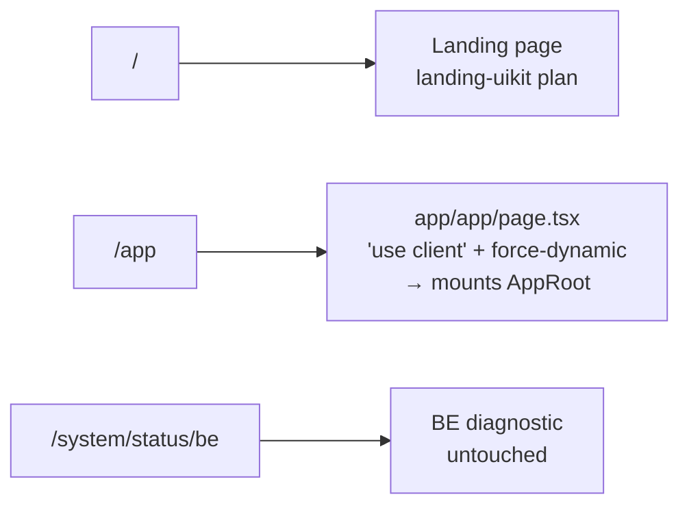
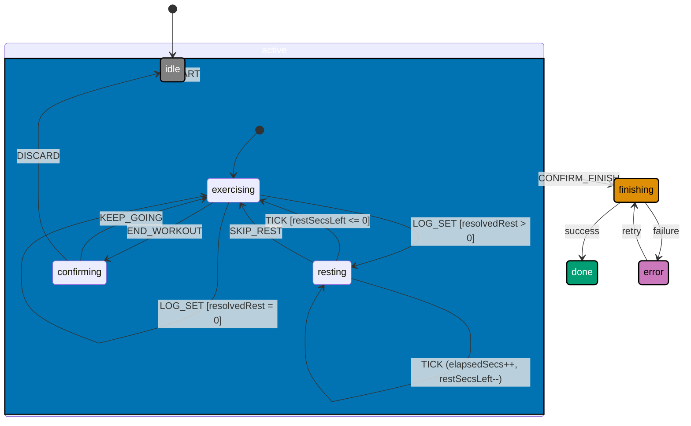
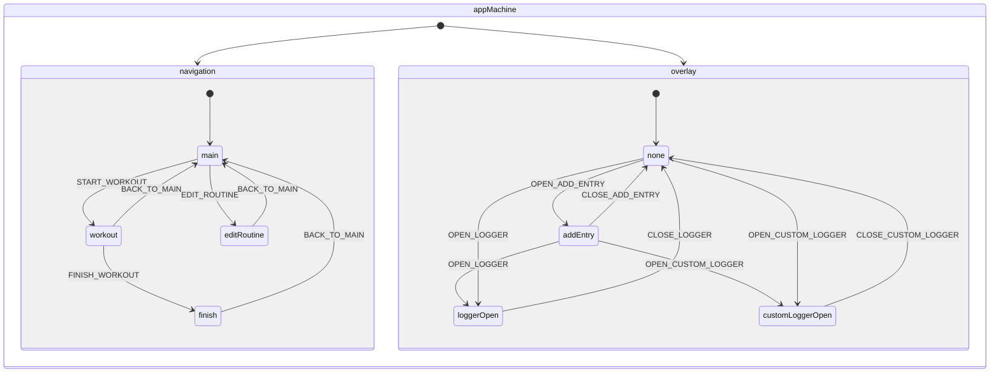

# Technical Documentation

## Raw Design Files

Prototype source files are in `raw/`. See `raw/README.md` for the full file list and
confirmed design decisions. Primary references by phase:

- `raw/colors_and_type.css` — design token system (hues, warm scale, dark mode, type)
- `raw/db.js` — Original prototype `OLDb` class + seed data. **Reference only**;
  this plan does NOT port the class. Storage is PGlite (gear-up); this plan
  reuses the seed _content_ (Yoka profile, Kettlebell day, Calisthenics + Super
  Exercise routines, six recent entries) for `lib/journal/seed.ts`
- `raw/i18n.js` — all translation keys (Phase 0 reference)
- `raw/App.jsx` — shell layout, state model, screen stack (Phase 1 reference)
- `raw/Components.jsx` — `TabBar`, `SideNav`, `AddEntrySheet`, etc. (Phase 1 reference)
- `raw/HomeScreen.jsx` — `WeekRhythmStrip`, module chips, entry timeline (Phase 2 reference)
- `raw/WorkoutScreen.jsx` — set rows, rest timer, sheets (Phase 4 reference)
- `raw/FinishScreen.jsx` — post-workout summary: duration, volume, exercise breakdown (Phase 4 reference)
- `raw/EditRoutineScreen.jsx` — exercise CRUD (Phase 5 reference)
- `raw/HistoryScreen.jsx` — bar chart, session cards (Phase 6 reference)
- `raw/ProgressScreen.jsx` — analytics, SVG charts, 1RM (Phase 7 reference)
- `raw/SettingsScreen.jsx` — all 6 rest options, lang toggle, dark mode (Phase 8 reference)
- `raw/EventLoggers.jsx` — Reading/Learning/Meal/Focus sheets (Phase 3 reference)
- `raw/CustomEvents.jsx` — custom event logger (Phase 3 reference)

When any implementation detail is unclear, read the raw source before guessing.

## Route Architecture



`/app/page.tsx` mounts `<AppRoot />`. **`/app` is the canonical app home URL** —
navigating to `/app` with no hash shows the Home tab by default. In-app tab
navigation appends hash fragments to `/app`:

| Tab            | Canonical URL   | Hash returned by `useHash` |
| -------------- | --------------- | -------------------------- |
| Home (default) | `/app`          | `''` (empty string)        |
| History        | `/app#history`  | `#history`                 |
| Progress       | `/app#progress` | `#progress`                |
| Settings       | `/app#settings` | `#settings`                |

`AppRoot` maps `'' | '#home'` → home tab; `'#history'` → history; etc.
`next/navigation` is not used inside app screens.

## Assumed-Done Foundation (from the gear-up plan)

This plan **does not re-create** any of the following. Treat them as fixed
points landed by [`2026-04-30__organiclever-web-event-mechanism/`](../../done/2026-04-30__organiclever-web-event-mechanism/README.md) (archived):

| Artifact                                                                                                                   | Owner         | This plan's relationship                                                                                                                         |
| -------------------------------------------------------------------------------------------------------------------------- | ------------- | ------------------------------------------------------------------------------------------------------------------------------------------------ |
| `apps/organiclever-web/src/lib/journal/schema.ts`                                                                          | gear-up       | **Extended in Phase 0.1a**: adds `startedAt`, `finishedAt`, `labels` to `JournalEntry` + `NewEntryInput`; `name` field is the kind discriminator |
| `lib/journal/errors.ts`                                                                                                    | gear-up       | Reused; this plan adds no new tagged-error variants in v0                                                                                        |
| `lib/journal/runtime.ts` (`PgliteService` Layer, `makeJournalRuntime`)                                                     | gear-up       | Reused; one `ManagedRuntime` created in `<AppRoot />` via `useMemo`, prop-drilled to children                                                    |
| `lib/journal/journal-store.ts` (`appendEntries`, `listEntries`, `updateEntry`, `deleteEntry`, `bumpEntry`, `clearEntries`) | gear-up       | **Extended in Phase 0.1a**: `appendEntries` updated to supply `started_at`, `finished_at`, `labels` matching v2 schema                           |
| `lib/journal/run-migrations.ts` + migration runner                                                                         | gear-up       | Reused; this plan adds **one** new file under `lib/journal/migrations/` (v2: typed-payload columns)                                              |
| `lib/journal/journal-machine.ts` (XState v5 `journalMachine`)                                                              | gear-up       | Reused; orchestrates `initializing → ready{idle↔mutating} → error` with buffered mutation events                                                 |
| `lib/journal/use-journal.ts` (`useJournal` hook, `useActor` from `@xstate/react`)                                          | gear-up       | Reused; new hooks (`useRoutines`, `useSettings`) follow the same `ManagedRuntime` bridge pattern                                                 |
| `effect`, `@effect/platform`, `@electric-sql/pglite`, `@effect/vitest`, `xstate`, `@xstate/react`                          | gear-up       | Already in `package.json`; no install step                                                                                                       |
| ts-ui `Textarea` + `Badge`                                                                                                 | landing-uikit | Already in `libs/ts-ui`; consumed directly                                                                                                       |

## File Map

```text
apps/organiclever-web/src/
├── app/
│   └── app/
│       └── page.tsx                    ← Phase 1 (replaces <JournalPage /> with <AppRoot />)
├── components/
│   └── app/
│       ├── add-entry-button.tsx        ← gear-up provisional (delete or keep as dev panel)
│       ├── entry-card.tsx              ← gear-up provisional (delete or keep as dev panel)
│       ├── entry-form-sheet.tsx        ← gear-up provisional (delete or keep as dev panel)
│       ├── journal-list.tsx            ← gear-up provisional (delete or keep as dev panel)
│       ├── journal-page.tsx            ← gear-up provisional (replaced by AppRoot in Phase 1)
│       ├── app-root.tsx                ← Phase 1 (new)
│       ├── tab-bar.tsx                 ← Phase 1 (new; custom 64 px — NOT the ts-ui TabBar)
│       ├── side-nav.tsx                ← Phase 1 (new)
│       ├── add-entry-sheet.tsx         ← Phase 3 (new)
│       ├── home/
│       │   ├── home-screen.tsx         ← Phase 2
│       │   ├── week-rhythm-strip.tsx   ← Phase 2
│       │   ├── entry-item.tsx         ← Phase 2
│       │   ├── entry-detail-sheet.tsx  ← Phase 2
│       │   ├── workout-module-view.tsx ← Phase 2
│       │   └── routine-card.tsx        ← Phase 2
│       ├── loggers/
│       │   ├── logger-shell.tsx        ← Phase 3
│       │   ├── reading-logger.tsx      ← Phase 3
│       │   ├── learning-logger.tsx     ← Phase 3
│       │   ├── meal-logger.tsx         ← Phase 3
│       │   ├── focus-logger.tsx        ← Phase 3
│       │   └── custom-entry-logger.tsx ← Phase 3
│       ├── workout/
│       │   ├── workout-screen.tsx      ← Phase 4 (driven by workoutSessionMachine)
│       │   ├── active-exercise-row.tsx ← Phase 4
│       │   ├── set-edit-sheet.tsx      ← Phase 4
│       │   ├── rest-timer.tsx          ← Phase 4
│       │   ├── set-timer-sheet.tsx     ← Phase 4
│       │   └── finish-screen.tsx       ← Phase 4
│       ├── routine/
│       │   ├── edit-routine-screen.tsx ← Phase 5
│       │   └── exercise-editor-row.tsx ← Phase 5
│       ├── history/
│       │   ├── history-screen.tsx      ← Phase 6
│       │   ├── session-card.tsx        ← Phase 6
│       │   └── weekly-bar-chart.tsx    ← Phase 6
│       ├── progress/
│       │   ├── progress-screen.tsx     ← Phase 7
│       │   └── exercise-progress-card.tsx ← Phase 7
│       └── settings/
│           └── settings-screen.tsx     ← Phase 8
├── lib/
│   ├── journal/                        ← gear-up plan (DO NOT RE-CREATE existing files)
│   │   ├── schema.ts                   ← gear-up; `name` field is the kind slug discriminator
│   │   ├── errors.ts                   ← gear-up
│   │   ├── runtime.ts                  ← gear-up (PgliteService Layer, makeJournalRuntime, idb://ol_journal_v1)
│   │   ├── journal-store.ts            ← gear-up (appendEntries, listEntries, updateEntry, deleteEntry, bumpEntry, clearEntries)
│   │   ├── journal-machine.ts          ← gear-up (XState v5 journalMachine)
│   │   ├── use-journal.ts              ← gear-up (useJournal hook via useActor)
│   │   ├── run-migrations.ts           ← gear-up
│   │   ├── format-relative-time.ts     ← gear-up
│   │   ├── types.ts                    ← gear-up (re-exports from schema.ts)
│   │   ├── migrations/
│   │   │   ├── 2026_04_28T14_05_30__create_journal_entries_table.ts ← gear-up
│   │   │   ├── <TIMESTAMP>__add_typed_payload_columns.ts            ← THIS PLAN Phase 0 (v2)
│   │   │   ├── <TIMESTAMP>__add_typed_payload_columns.unit.test.ts  ← THIS PLAN Phase 0
│   │   │   └── index.generated.ts                                   ← gitignored, codegen
│   │   ├── typed-payloads.ts           ← THIS PLAN Phase 0 (Schema.Union on name)
│   │   ├── typed-payloads.unit.test.ts ← THIS PLAN Phase 0
│   │   ├── routine-store.ts            ← THIS PLAN Phase 0 (Effect-returning routines CRUD)
│   │   ├── routine-store.unit.test.ts  ← THIS PLAN Phase 0
│   │   ├── use-routines.ts             ← THIS PLAN Phase 0 (React hook via ManagedRuntime)
│   │   ├── use-routines.unit.test.tsx  ← THIS PLAN Phase 0
│   │   ├── settings-store.ts           ← THIS PLAN Phase 0 (Effect-returning settings CRUD)
│   │   ├── settings-store.unit.test.ts ← THIS PLAN Phase 0
│   │   ├── use-settings.ts             ← THIS PLAN Phase 0 (React hook via ManagedRuntime)
│   │   ├── use-settings.unit.test.tsx  ← THIS PLAN Phase 0
│   │   ├── seed.ts                     ← THIS PLAN Phase 0 (typed seed for first-load)
│   │   ├── stats.ts                    ← THIS PLAN Phase 0.8 (Effect-returning aggregations)
│   │   └── stats.unit.test.ts          ← THIS PLAN Phase 0
│   ├── app/
│   │   ├── app-machine.ts              ← THIS PLAN Phase 1 (XState v5 appMachine — shell state)
│   │   └── app-machine.unit.test.ts    ← THIS PLAN Phase 1
│   ├── workout/
│   │   ├── workout-machine.ts          ← THIS PLAN Phase 4 (XState v5 workoutSessionMachine)
│   │   └── workout-machine.unit.test.ts ← THIS PLAN Phase 4
│   ├── hooks/
│   │   └── use-hash.ts                 ← Phase 1
│   ├── i18n/
│   │   ├── translations.ts             ← Phase 0
│   │   └── use-t.ts                    ← Phase 0
│   ├── utils/
│   │   ├── fmt.ts                      ← Phase 0
│   │   └── fmt.unit.test.ts            ← Phase 0
│   └── auth/                           ← dormant, untouched
├── services/                           ← dormant, untouched (excluded from coverage)
└── layers/                             ← dormant, untouched (excluded from coverage)
```

## Data Model

> These are the data-model contracts the bigger plan adds. Physically the
> declarations are split across multiple Effect `Schema` modules under
> `apps/organiclever-web/src/lib/journal/`:
>
> - `typed-payloads.ts` — `EntryKind`, `WorkoutPayload`, `ReadingPayload`,
>   `LearningPayload`, `MealPayload`, `FocusPayload`, `CustomPayload`,
>   `EntryPayload` (typed union superseding gear-up's open version),
>   `TypedEntry` (Schema.Union on `name`),
>   `JournalEntry = Schema.Type<typeof TypedEntry>` (typed UI alias) —
>   all as `Schema.Struct` / `Schema.Union` with TS types via `Schema.Type<...>`
> - `routine-store.ts` (types section) — `Hue`, `ExerciseType`, `TimerMode`,
>   `ExerciseTemplate`, `ExerciseGroup`, `Routine`, `CompletedSet`,
>   `ActiveExercise`
> - `settings-store.ts` — `RestSeconds`, `Lang`, `AppSettings`
> - `stats.ts` — `WeeklyStats`, `DayEntry`, `ExerciseProgressPoint`,
>   `ExerciseProgress` (computed; not persisted)
>
> The block below shows the TS shapes for review purposes; the actual
> implementation files use `Schema.Struct({...})` and derive the TS type via
> `Schema.Type`. Plain `export interface` is acceptable only for the computed
> stats types that are never decoded from the wire.

```typescript
// Conceptual data-model snapshot — implementation is Schema-first per files above

export type Hue = "terracotta" | "honey" | "sage" | "teal" | "sky" | "plum";
export type ExerciseType = "reps" | "duration" | "oneoff";
export type TimerMode = "countdown" | "countup";
export type RestSeconds = "reps" | "reps2" | 0 | 30 | 60 | 90;
export type Lang = "en" | "id";

export interface ExerciseTemplate {
  id: string;
  name: string;
  type: ExerciseType;
  targetSets: number;
  targetReps: number;
  targetWeight: string | null;
  targetDuration: number | null;
  timerMode: TimerMode;
  bilateral: boolean;
  dayStreak: number;
  restSeconds: number | null;
}
export interface ExerciseGroup {
  id: string;
  name: string;
  exercises: ExerciseTemplate[];
}
export interface Routine {
  id: string;
  name: string;
  hue: Hue;
  type: "workout";
  createdAt: string;
  groups: ExerciseGroup[];
}

export interface CompletedSet {
  reps: number | null;
  weight: string | null;
  duration: number | null;
  restTaken: number | null;
}
export interface ActiveExercise extends ExerciseTemplate {
  sets: CompletedSet[];
}

// EntryKind has 6 members; "workout" is a session type initiated from AddEntrySheet.
// The "5 event types" referenced in BRD/README refer to the quick-log types:
// reading, learning, meal, focus, custom. Workout is always session-initiated, not quick-log.
export type EntryKind = "workout" | "reading" | "learning" | "meal" | "focus" | "custom";
export interface WorkoutPayload {
  routineName: string | null;
  durationSecs: number;
  exercises: Array<ActiveExercise & { name: string }>;
}
export interface ReadingPayload {
  title: string;
  author: string | null;
  pages: number | null;
  durationMins: number | null;
  completionPct: number | null;
  notes: string | null;
}
export interface LearningPayload {
  subject: string;
  source: string | null;
  durationMins: number | null;
  rating: number | null;
  notes: string | null;
}
export interface MealPayload {
  name: string;
  mealType: string | null;
  energyLevel: number | null;
  notes: string | null;
}
export interface FocusPayload {
  task: string | null;
  durationMins: number | null;
  quality: number | null;
  notes: string | null;
}
export interface CustomPayload {
  name: string;
  hue: Hue;
  icon: string;
  durationMins: number | null;
  notes: string | null;
}
export type EntryPayload =
  | WorkoutPayload
  | ReadingPayload
  | LearningPayload
  | MealPayload
  | FocusPayload
  | CustomPayload;

// JournalEntry = Schema.Type<typeof TypedEntry> — exported from typed-payloads.ts
// 'name' matches the gear-up's EntryName discriminator field; same field name used in
// TypedEntry's Schema.Literal unions and in the journal_entries DB column.
export interface JournalEntry {
  id: string;
  name: EntryKind; // kind slug — 'workout'|'reading'|'learning'|'meal'|'focus'|'custom-*'
  labels: string[];
  startedAt: string;
  finishedAt: string;
  payload: EntryPayload;
}
export interface AppSettings {
  name: string;
  restSeconds: RestSeconds;
  darkMode: boolean;
  lang: Lang;
}

// Stats
export interface WeeklyStats {
  workoutsThisWeek: number;
  streak: number;
  totalMins: number;
  totalSets: number;
}
export interface DayEntry {
  date: Date;
  label: string;
  durationMins: number;
  sessions: number;
}
export interface ExerciseProgressPoint {
  date: string;
  weight: number;
  reps: number;
  estimated1RM: number | null;
  isPR: boolean;
}
export interface ExerciseProgress {
  routineName: string | null;
  points: ExerciseProgressPoint[];
}
```

## Persistence: PGlite + Effect (extension on top of gear-up)

Storage continues to be **PGlite (Postgres-WASM over IndexedDB)** as landed by
the gear-up plan — `dataDir` `ol_journal_v1`, IndexedDB key `/pglite/ol_journal_v1`,
opened via `PgliteService` Layer (`makeJournalRuntime`). This plan introduces no
new database; instead it adds:

1. A **v2 migration** under `lib/journal/migrations/` adding typed-payload
   columns (`started_at TIMESTAMPTZ`, `finished_at TIMESTAMPTZ`, `labels TEXT[]`)
   to `journal_entries`, plus a CHECK constraint narrowing `name` to the six v0
   kinds. All `ALTER TABLE` is additive — gear-up rows survive with
   `started_at = created_at` and `finished_at = updated_at` filled by the
   migration's backfill UPDATE.
2. **Per-kind `Schema.Union`** in `lib/journal/typed-payloads.ts` narrowing the
   open `name: EntryName` to `'workout' | 'reading' | 'learning' | 'meal' |
'focus' | custom-*` and pairing each `name` literal with its typed `payload`
   `Schema.Struct`. Typed loggers call `appendEntries` with `name` set to the
   kind slug; the read path decodes rows through `TypedEntry` union.
3. **`routine-store.ts` + `settings-store.ts`** — two new modules adding
   `routines` and `settings` tables (via the same v2 migration), exposing
   `Effect`-returning CRUD that re-uses the gear-up's `PgliteService`.
4. **`seed.ts`** — runs once on first load when
   `(SELECT count(*) FROM journal_entries) = 0 AND (SELECT count(*) FROM routines) = 0`.
   Seed = "Yoka" profile + Kettlebell day + Calisthenics + Super Exercise (plum)
   routines + 6 recent entries across all kinds (one per kind, one custom).

### v2 migration (typed-payload columns)

```typescript
// lib/journal/migrations/<TIMESTAMP>__add_typed_payload_columns.ts
// Replace <TIMESTAMP> with actual UTC second-precision value at file creation time
// (e.g. 2026_05_03T09_22_15). See delivery.md Phase 0.1 for naming regex.

import type { PGlite, Transaction } from "@electric-sql/pglite";
type Queryable = PGlite | Transaction;

export const id = "<TIMESTAMP>__add_typed_payload_columns";

export async function up(db: Queryable): Promise<void> {
  await db.exec(`
    ALTER TABLE journal_entries
      ADD COLUMN started_at  TIMESTAMPTZ,
      ADD COLUMN finished_at TIMESTAMPTZ,
      ADD COLUMN labels      TEXT[] NOT NULL DEFAULT '{}';

    UPDATE journal_entries
      SET started_at  = created_at,
          finished_at = updated_at
      WHERE started_at IS NULL;

    ALTER TABLE journal_entries
      ALTER COLUMN started_at  SET NOT NULL,
      ALTER COLUMN finished_at SET NOT NULL;

    ALTER TABLE journal_entries
      ADD CONSTRAINT journal_entries_kind_v0
      CHECK (name IN ('workout','reading','learning','meal','focus') OR name LIKE 'custom-%');

    CREATE TABLE IF NOT EXISTS routines (
      id          TEXT PRIMARY KEY,
      name        TEXT NOT NULL,
      hue         TEXT NOT NULL,
      type        TEXT NOT NULL,
      created_at  TIMESTAMPTZ NOT NULL,
      groups      JSONB NOT NULL DEFAULT '[]'::jsonb
    );

    CREATE TABLE IF NOT EXISTS settings (
      id            TEXT PRIMARY KEY DEFAULT 'singleton',
      name          TEXT NOT NULL,
      rest_seconds  TEXT NOT NULL,
      dark_mode     BOOLEAN NOT NULL DEFAULT false,
      lang          TEXT NOT NULL DEFAULT 'en',
      CHECK (id = 'singleton')
    );
  `);
}

export async function down(db: Queryable): Promise<void> {
  await db.exec(`
    DROP TABLE IF EXISTS settings;
    DROP TABLE IF EXISTS routines;
    ALTER TABLE journal_entries DROP CONSTRAINT IF EXISTS journal_entries_kind_v0;
    ALTER TABLE journal_entries DROP COLUMN IF EXISTS labels;
    ALTER TABLE journal_entries DROP COLUMN IF EXISTS finished_at;
    ALTER TABLE journal_entries DROP COLUMN IF EXISTS started_at;
  `);
}
```

### Typed-payload `Schema.Union` (narrowing the open `name`)

The gear-up's `name` field (type `EntryName`, slug pattern `^[a-z][a-z0-9-]*$`) doubles
as the kind discriminator. Standard kinds use bare slugs (`'workout'`, `'reading'`, etc.);
custom kinds use a `custom-` prefix (e.g. `'custom-meditation'`).

```typescript
// lib/journal/typed-payloads.ts (sketch)

import { Schema } from "effect";
import { EntryId, IsoTimestamp } from "./schema"; // EntryPayload defined here (typed union) supersedes gear-up's open version

const WorkoutPayload = Schema.Struct({
  /* ... */
});
const ReadingPayload = Schema.Struct({
  /* ... */
});
// ... LearningPayload, MealPayload, FocusPayload ...
const CustomPayload = Schema.Struct({
  /* name, hue, icon, durationMins, notes */
});

// Discriminate on the `name` field (kind slug), not a separate `kind` column
export const TypedEntry = Schema.Union(
  Schema.Struct({ name: Schema.Literal("workout"), payload: WorkoutPayload /* startedAt, finishedAt, labels */ }),
  Schema.Struct({ name: Schema.Literal("reading"), payload: ReadingPayload /* ... */ }),
  Schema.Struct({ name: Schema.Literal("learning"), payload: LearningPayload /* ... */ }),
  Schema.Struct({ name: Schema.Literal("meal"), payload: MealPayload /* ... */ }),
  Schema.Struct({ name: Schema.Literal("focus"), payload: FocusPayload /* ... */ }),
  // Custom: name starts with "custom-"; use Schema.filter for prefix check
  Schema.Struct({
    name: Schema.String.pipe(Schema.filter((s) => s.startsWith("custom-"))),
    payload: CustomPayload /* ... */,
  }),
);
export type TypedEntry = typeof TypedEntry.Type;
```

Typed loggers call `appendEntries` with `name` set to the kind slug and `payload` set to
the typed struct. The store writes faithfully; the read path uses
`Schema.decodeUnknownSync(TypedEntry)` to narrow `journal_entries` rows.

### Effect-returning store extensions

```typescript
// lib/journal/routine-store.ts (signatures)

export const listRoutines: () => Effect.Effect<ReadonlyArray<Routine>, StorageUnavailable, PgliteService>;
export const saveRoutine: (r: Routine) => Effect.Effect<Routine, StorageUnavailable, PgliteService>;
export const deleteRoutine: (id: RoutineId) => Effect.Effect<boolean, StorageUnavailable, PgliteService>;
export const reorderRoutineExercises: (
  routineId: RoutineId,
  groupId: GroupId,
  from: number,
  to: number,
) => Effect.Effect<Routine, NotFound | StorageUnavailable, PgliteService>;
```

```typescript
// lib/journal/settings-store.ts (signatures)

export const getSettings: () => Effect.Effect<AppSettings, StorageUnavailable, PgliteService>;
export const saveSettings: (
  patch: Partial<AppSettings>,
) => Effect.Effect<AppSettings, StorageUnavailable, PgliteService>;
```

The class-based `OLDb` from earlier drafts of this plan is **discarded**.
Imperative methods would re-introduce the patterns the gear-up's "No ORM"
design decision forbade. Every new store function is a free `Effect`
returning function pulling `PgliteService` from context.

Custom-type derivation: no dedicated method; consumer runs the gear-up's
`listEntries` Effect, decodes the rows through `TypedEntry` union,
and filters for `name.startsWith('custom-')` to build the user-created type list.

## useHash Hook — SSR Guard

`use-hash.ts` reads `window.location.hash` exclusively inside `useEffect` — never at module
level or during render. Initial state is `''` (empty string). This pattern prevents
`ReferenceError: window is not defined` if the hook is ever evaluated in a Node.js / SSR
context (even though the current `/app/page.tsx` uses `'use client'` + `force-dynamic`,
defensive coding here keeps the hook reusable outside that guarded context).

## State Management

### XState machines

Two XState v5 machines handle the complex state in this app:

**`journalMachine`** (shipped by gear-up, in `lib/journal/journal-machine.ts`):

- States: `initializing → ready{idle ↔ mutating} → error`
- Buffers in-flight mutations via `pendingMutationEvent` context field
- Actors: `loadEntries` (fromPromise), `performMutation` (fromPromise)
- Both actors call `runtime.runPromise(...)` — single Effect boundary per mutation
- Consumed via `useJournal(runtime)` hook (`useActor` from `@xstate/react`)

**`workoutSessionMachine`** (THIS PLAN, `lib/workout/workout-machine.ts`):

- Manages the full workout session lifecycle; all timer state lives in the machine
- Context:

| Field           | Type                 | Description                                  |
| --------------- | -------------------- | -------------------------------------------- |
| `routine`       | `Routine \| null`    | Selected routine; null = blank workout       |
| `exercises`     | `ActiveExercise[]`   | Mutable session state per exercise           |
| `currentExIdx`  | `number`             | Index into `exercises`                       |
| `currentSetIdx` | `number`             | Which set of the current exercise            |
| `elapsedSecs`   | `number`             | Session wall-clock (incremented by TICK)     |
| `restSecsLeft`  | `number`             | Rest countdown (decremented by TICK in rest) |
| `settings`      | `AppSettings`        | For `resolvedRest()` calculation             |
| `runtime`       | `JournalRuntime`     | For final save in `finishing` invoke         |
| `error`         | `StoreError \| null` | Save failure surfaced to UI                  |

- States:



- Events: `START`, `TICK`, `LOG_SET`, `SKIP_REST`, `ADD_EXERCISE`, `END_WORKOUT`,
  `KEEP_GOING`, `CONFIRM_FINISH`, `DISCARD`
- `TICK` self-transitions in both `active.exercising` (increments `elapsedSecs`)
  and `active.resting` (increments `elapsedSecs`, decrements `restSecsLeft`)
- `TICK` is sent by a `setInterval` in `WorkoutScreen` via `useRef`; the machine
  is pure — no timer side-effects inside the machine itself
- `CONFIRM_FINISH` triggers a `fromPromise` actor calling
  `runtime.runPromise(appendEntries([buildWorkoutEntry(ctx)]))` — Effect-TS is the
  single write boundary
- Consumed via `useActor(workoutSessionMachine, { input: { routine, settings, runtime } })`

### AppRoot state — `appMachine` (XState v5, parallel states)

**No boolean blindness. No illegal states representable.** `appMachine` uses XState v5
**parallel states** — `navigation` and `overlay` run as fully independent regions. It is
structurally impossible for two navigation screens or two overlays to be active at once.
The old `screen: string` + `screenData: { routine? }|{ session? }|null` and
`addEntry: boolean` + `activeLogger: …|null` + `customLogger: …|null` context fields are
eliminated — they admitted illegal combinations that would require defensive runtime guards
to detect. XState states carry that invariant at the type level instead.

`AppRoot` consumes `appMachine` via `useActor(appMachine, { input })`. Side effects
(localStorage, PGlite sync, DOM `data-theme`) live in `AppRoot` `useEffect` watchers —
never inside the machine.



Any event that moves `navigation` → `main` also resets `overlay` → `none` via a parallel
region entry action (XState v5 `entry` + `assign`).

**Context** (only data relevant across regions; no redundant boolean flags):

| Field              | Type                                           | Description                                                        |
| ------------------ | ---------------------------------------------- | ------------------------------------------------------------------ |
| `tab`              | `'home'\|'history'\|'progress'\|'settings'`    | Active tab; `localStorage.ol_tab`                                  |
| `isDesktop`        | `boolean`                                      | Updated by `SET_DESKTOP` event from resize listener                |
| `darkMode`         | `boolean`                                      | From `input.initialDarkMode`; flipped by `TOGGLE_DARK_MODE`        |
| `routine`          | `Routine \| null`                              | Set by `START_WORKOUT` / `EDIT_ROUTINE`; cleared on `BACK_TO_MAIN` |
| `completedSession` | `CompletedSession \| null`                     | Set by `FINISH_WORKOUT`; cleared on `BACK_TO_MAIN`                 |
| `loggerKind`       | `'reading'\|'learning'\|'meal'\|'focus'\|null` | Set by `OPEN_LOGGER`; cleared by `CLOSE_LOGGER`                    |
| `customLoggerName` | `string \| null`                               | Set by `OPEN_CUSTOM_LOGGER`; cleared by `CLOSE_CUSTOM_LOGGER`      |

**Illegal states prevented by machine structure** (not by runtime checks):

| Scenario                                        | How prevented                                                   |
| ----------------------------------------------- | --------------------------------------------------------------- |
| `addEntry` sheet + logger both open             | `overlay` region: one state at a time                           |
| `workout` + `editRoutine` active simultaneously | `navigation` region: one state at a time                        |
| Finish screen receiving wrong session type      | `completedSession` only set on `FINISH_WORKOUT`                 |
| `screenData` type mismatch with current screen  | Eliminated — context fields are per-concept, not per-screen bag |

**Events**: `NAVIGATE_TAB(tab)`, `START_WORKOUT(routine?)`, `EDIT_ROUTINE(routine?)`,
`FINISH_WORKOUT(session)`, `BACK_TO_MAIN`, `OPEN_ADD_ENTRY`, `CLOSE_ADD_ENTRY`,
`OPEN_LOGGER(kind)`, `CLOSE_LOGGER`, `OPEN_CUSTOM_LOGGER(name)`, `CLOSE_CUSTOM_LOGGER`,
`TOGGLE_DARK_MODE`, `SET_DESKTOP(isDesktop)`

## i18n

```typescript
// lib/i18n/translations.ts — TRANSLATIONS['en'] and TRANSLATIONS['id']
// All keys from prototype i18n.js: home, history, settings, progress,
// greeting, last7days, sessions, streak, days, timeMoved, setsDone, ...

// lib/i18n/use-t.ts
import { useSettings } from "@/lib/journal/use-settings"; // sibling Effect-runtime hook
export function useT() {
  const { settings } = useSettings(); // returns AppSettings via runtime.runPromise(getSettings())
  const lang = settings?.lang ?? "en";
  return (key: keyof (typeof TRANSLATIONS)["en"]) => TRANSLATIONS[lang]?.[key] ?? TRANSLATIONS.en[key] ?? key;
}
```

Language switch:

```typescript
// runtime is prop-drilled from AppRoot (created once via useMemo(() => makeJournalRuntime(), []))
await runtime.runPromise(saveSettings({ lang: code }));
window.location.reload();
```

(`saveSettings` is the Effect-returning function from `lib/journal/settings-store.ts`.
`runtime` is the `JournalRuntime` instance created in `AppRoot` and passed as a prop
to child components that need PGlite access — no separate `useJournalRuntime` hook.)

## Utilities

```typescript
// lib/utils/fmt.ts
fmtTime(secs: number): string     // 90 → "1:30", 45 → "45s"
fmtKg(kg: number): string         // 1500 → "1.5k", 850 → "850"
fmtSpec(ex: ExerciseTemplate): string  // "3 × 20 LR @ 8 kg"
```

## ts-ui Components Used from Landing-UIKit Plan

`Textarea` — all entry logger notes fields.
`Badge` — entry-kind tags, day-streak badge, module chips hint text.
All other existing ts-ui: `Button`, `Icon`, `StatCard`, `AppHeader`, `TabBar`, `SideNav`,
`HuePicker`, `Toggle`, `ProgressRing`, `Sheet`, `InfoTip`, `Input`, `Label`, `Card`.

### Entry-Kind Icon Assignments

The `Icon` component's `IconName` union does not include `"book"`. Use these icon names
for entry-kind rows in `AddEntrySheet` and `LoggerShell`:

| Entry kind | Icon name     | Notes                                     |
| ---------- | ------------- | ----------------------------------------- |
| Workout    | `dumbbell`    | Exists in ts-ui                           |
| Reading    | `calendar`    | Closest available; "book" is not in ts-ui |
| Learning   | `zap`         | Inspiration / energy; exists in ts-ui     |
| Meal       | `clock`       | Time-based; exists in ts-ui               |
| Focus      | `timer`       | Concentration timer; exists in ts-ui      |
| Custom     | `plus-circle` | Additive; exists in ts-ui                 |

If a `"book"` icon is added to ts-ui in a future plan, swap Reading from `calendar` to
`book` at that time. No blocker for Phase 3 implementation.

## Progress Charts (Phase 7)

Pure inline SVG — no charting library:

- Exercise weight chart: `<svg viewBox="0 0 200 80">`; `<polyline>` normalized to viewBox;
  `<circle>` per point; `<text>★</text>` on PR points
- Weekly bar chart (history): CSS flex heights (existing prototype approach)
- Module activity bar chart: 7-bar flex layout per day (same as WeekRhythmStrip but
  per-module single color)

1RM Brzycki: `weight × (36 / (37 - reps))` — only computed when `reps >= 1 && reps <= 10`.

## Rest Timer Logic

```text
resolvedRest(exercise, settings):
  if exercise.restSeconds !== null → use exercise.restSeconds
  else if settings.restSeconds === 'reps' → exercise.targetReps (seconds)
  else if settings.restSeconds === 'reps2' → exercise.targetReps * 2 (seconds)
  else if settings.restSeconds === 0 → skip timer
  else → settings.restSeconds (30|60|90)
```

Timer implementation: timer ID stored in `useRef<ReturnType<typeof setInterval>>`. Cleanup:
`clearInterval(timerRef.current)` called in the `useEffect` return function to prevent
memory leaks and stale countdown-after-unmount bugs.

Day streak: increments when next session within 72 h of last; resets to 1 on miss.

## Design Decisions

### Hash routing instead of Next.js App Router for in-app navigation

`next/navigation` (router, link) is tied to the Next.js page hierarchy. The OrganicLever
app is a single-page experience that must handle deep links like `/app#history` without
server-side route changes. Hash routing (`window.location.hash` + a `hashchange` listener
in `use-hash.ts`) keeps all navigation in the browser, avoids server round-trips, and
integrates cleanly with the existing landing-page routes at `/`.

### XState-first + make illegal states unrepresentable (project rule for `apps/organiclever-web/`)

**Two hard rules for all state in `apps/organiclever-web/`:**

1. **XState is highly preferable for all state.** `useState` is only acceptable for
   a single primitive value with no transitions, no side-effect triggers, and no
   persistence (e.g., a controlled `<input>` string). Everything else — multi-field
   state, state with history, state with persistence, state with async effects —
   must be an XState machine. When in doubt, use XState.

2. **Make illegal states unrepresentable.** Never model state as multiple independent
   booleans or nullable fields that can be simultaneously true in ways the UI cannot
   render. Use XState parallel states, discriminated union context fields, and typed
   events so that the compiler and machine topology enforce valid combinations —
   not runtime guards.

**Boolean blindness examples to avoid:**

```typescript
// BAD — illegal: addEntry + activeLogger both truthy simultaneously
{ addEntry: boolean; activeLogger: Kind | null; customLogger: string | null }
// ALSO BAD — screenData type doesn't constrain to current screen
{ screen: 'main'|'workout'|'finish'; screenData: { routine? }|{ session? }|null }

// GOOD — XState parallel states; overlay is one state at a time; navigation is one state at a time
state.matches({ navigation: 'workout' }) // true xor false — not 'workout' AND 'editRoutine'
state.matches({ overlay: 'logger' })     // true xor false — not 'addEntry' AND 'logger'
// context.routine is only meaningful while navigation === 'workout' | 'editRoutine'
// context.completedSession is only meaningful while navigation === 'finish'
```

The three machines in this plan:

- **`journalMachine`** (gear-up) — `initializing → ready{idle ↔ mutating} → error`;
  buffered mutations, Effect-TS actor calls: XState ✓
- **`workoutSessionMachine`** (Phase 4) — timer, exercise tracking, rest countdown,
  finish confirmation, Effect save: XState ✓
- **`appMachine`** (Phase 1) — AppRoot shell navigation + overlay via **parallel
  states** (see AppRoot state section below). Previously planned as `useState` with
  boolean fields — **redesigned to eliminate boolean blindness**. Illegal combinations
  (two overlays, two screens) are structurally impossible.

`useState` remains acceptable for: a single controlled `<input>` text value with no
persistence requirement and no transitions beyond "user typed".

Effect-TS is the boundary for all async work touching PGlite. XState actors call
`runtime.runPromise(effect)` at the `fromPromise` boundary — never raw `fetch` or
`throw`. This keeps error types explicit and the store layer pure.

### Pure inline SVG for charts instead of a charting library

`recharts`, `chart.js`, and similar libraries add 40–100 kB to the bundle and impose
opinionated component APIs. The two chart types needed (SVG polyline for exercise progress,
CSS-flex bars for weekly rhythm) are 20–30 lines of JSX each. Building them inline keeps
the bundle small, avoids version lock-in, and keeps chart code readable alongside the
component that renders it.

### Extend gear-up's PGlite migration registry rather than versioned-key swap

Earlier drafts of this plan used a versioned `localStorage` key (`ol_db_v12`)
that abandoned data on schema change. The gear-up plan replaced that with a
proper migration runner over PGlite — every schema change is one new file under
`lib/journal/migrations/` with strict timestamp + snake_case naming and a
per-migration transaction. This plan adds **one** new migration file
(v2: typed-payload columns) and one entry to the codegen index. Existing
gear-up rows in `journal_entries` survive the v2 migration (additive
`ALTER TABLE ... ADD COLUMN` with backfill UPDATE; never `DROP COLUMN`).
Future PWA-sync columns (`original_created_at`, `deleted_at`, `synced_at`,
`dirty`, `client_id`) slot in as v3 the same way.

### Dark mode: `localStorage` synchronous cache prevents reload flash

`AppSettings.darkMode` is persisted in the PGlite `settings` table via `saveSettings`.
PGlite reads are async — if `darkMode` were initialised only from `getSettings`, the app
would flash light mode on every reload while PGlite boots. Three-layer fix:

1. **`useState` lazy initialiser** — `useState(() => localStorage.getItem('ol_dark_mode') === 'true')`.
   Synchronous; no flash; safe because `AppRoot` only renders inside `'use client'`.
2. **Change `useEffect`** — every `darkMode` toggle writes
   `localStorage.setItem('ol_dark_mode', String(darkMode))` AND calls
   `runtime.runPromise(saveSettings({ darkMode }))` to keep PGlite in sync.
3. **`layout.tsx` inline `<script>`** — runs before React hydration, reads
   `localStorage.ol_dark_mode`, and sets `data-theme` on `<html>` immediately —
   eliminates even the pre-hydration flash for SSR-prerendered shells.

PGlite is source of truth for all settings. `localStorage` is a fast-boot cache for
this one key only.

## Rollback

1. **v2 migration rollback**: Each migration runs inside its own
   `db.transaction(...)` per the gear-up runner. If the v2 migration fails
   mid-apply, the per-migration transaction rolls back the partial
   `ALTER TABLE`; the `_migrations` row is never written; subsequent app
   loads re-apply the migration cleanly. Reverting this plan's commits
   removes the v2 migration file from `lib/journal/migrations/`; the codegen
   regenerates `index.generated.ts` without it; PGlite databases that
   already applied v2 keep the extra columns (additive — no data loss),
   though the application code reverts to gear-up open-`name` behaviour.
2. **`/app` route is additive in route registration**: the route already
   exists from the gear-up plan. This plan only changes the page body
   (`<JournalPage />` → `<AppRoot />`). Reverting restores the gear-up's
   provisional journal page; `/` and `/system/status/be` are untouched.
3. **No data migration is required to roll back**: gear-up data and v2-era
   data both round-trip cleanly through gear-up's open-`name` store; the
   typed-payload `TypedEntry` union is read-side only.

## Dependencies

| Dependency                   | Version            | Status   | Notes                                                                                             |
| ---------------------------- | ------------------ | -------- | ------------------------------------------------------------------------------------------------- |
| Next.js                      | 16 (existing)      | Existing | No change                                                                                         |
| TypeScript                   | Existing           | Existing | All new files are `.tsx` / `.ts`; strict mode + `noUncheckedIndexedAccess`                        |
| Vitest                       | Existing           | Existing | Unit + integration tests use existing runner; vitest.config.ts already amended by gear-up         |
| Playwright                   | Existing           | Existing | E2E via `organiclever-web-e2e`                                                                    |
| `effect`                     | ^3.21.2 (in pkg)   | Existing | Already installed; no install step                                                                |
| `@effect/platform`           | ^0.84 (in pkg)     | Existing | Already installed                                                                                 |
| `@effect/vitest`             | from gear-up       | Existing | Already installed by gear-up; this plan reuses Layer-swap pattern                                 |
| `@electric-sql/pglite`       | from gear-up       | Existing | Already installed by gear-up; this plan reuses `PgliteService` Layer + raw parameterised SQL      |
| `lib/journal/*` (gear-up)    | from gear-up       | Existing | schema, errors, runtime, journal-store, journal-machine, use-journal, run-migrations — all reused |
| `xstate` + `@xstate/react`   | ^5.31 / ^5.0.5     | Existing | Already installed by gear-up; this plan adds `workoutSessionMachine`                              |
| ts-ui `Textarea` / `Badge`   | from landing-uikit | Existing | Already in `libs/ts-ui`                                                                           |
| ts-ui (all other components) | Existing exports   | Existing | Button, Icon, StatCard, AppHeader, TabBar, SideNav, etc.                                          |
| rhino-cli test-coverage      | Existing           | Existing | Validates ≥ 70 % coverage threshold in `test:quick`                                               |
| rhino-cli spec-coverage      | Existing           | Existing | Validates Gherkin step coverage                                                                   |

**No new npm packages are introduced by this plan.** Effect, PGlite,
`@effect/vitest`, and ts-ui were all installed by the gear-up + landing-uikit
plans. This plan adds source files and one new migration only.

## Testing Strategy

- **Unit (Vitest + Gherkin)**: all DB methods, i18n keys, fmt utilities, stateless component
  render assertions
- **Gherkin specs**: `specs/apps/organiclever/fe/gherkin/<feature>/` — one `.feature` per
  phase feature
- **E2E (Playwright)**: `organiclever-web-e2e` — smoke suite per phase
- **Coverage**: ≥ 70 % lines enforced by `rhino-cli test-coverage validate` in `test:quick`
- **Spec coverage**: `nx run organiclever-web:spec-coverage` validates that all Gherkin
  feature scenarios have corresponding step implementations in the app test suite
