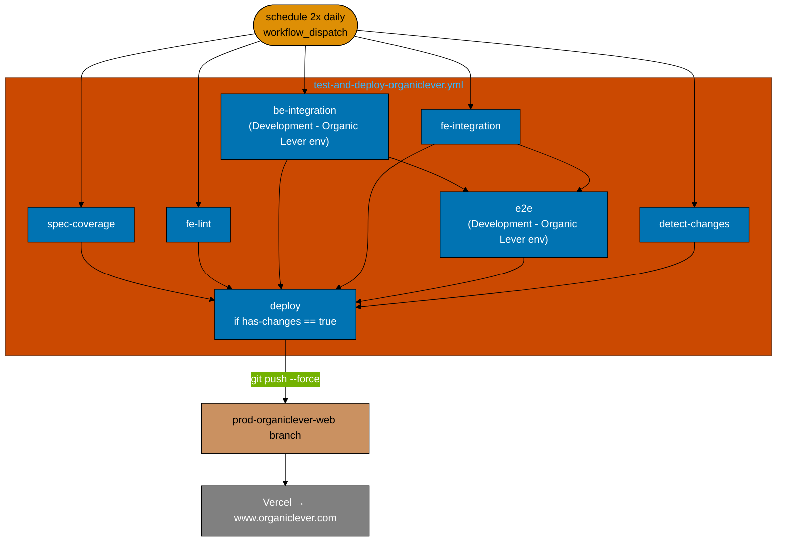
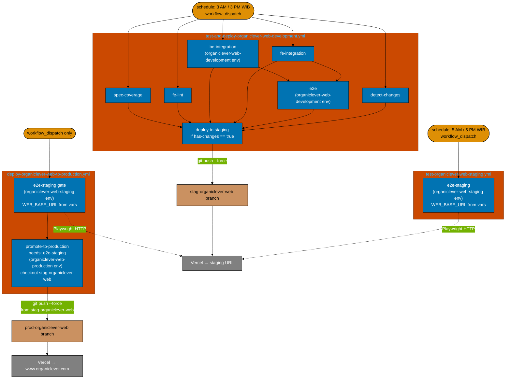

# Technical Documentation

## Architecture: Current State

One workflow runs the full test suite then auto-deploys to production.



## Architecture: Target State

Three workflows. Development deploy is automated; staging E2E is scheduled; production
promotion is gated and manual.



### Schedule timeline (daily)

| UTC    | WIB    | Event                                           |
| ------ | ------ | ----------------------------------------------- |
| 20:00  | 03:00  | Development deploy starts (test + push to stag) |
| ~21:00 | ~04:00 | Development deploy finishes (60–90 min typical) |
| 22:00  | 05:00  | Staging E2E starts (~2h buffer after deploy)    |
| 08:00  | 15:00  | Development deploy starts (afternoon run)       |
| ~09:00 | ~16:00 | Development deploy finishes                     |
| 10:00  | 17:00  | Staging E2E starts (afternoon run)              |

## Workflow 1 — Full YAML

**File**: `.github/workflows/test-and-deploy-organiclever-web-development.yml`

Changes from the original `test-and-deploy-organiclever.yml` are marked `# CHANGED`.

```yaml
name: Test and Deploy - OrganicLever Web Development # CHANGED

on:
  schedule:
    - cron: "0 20 * * *" # 3 AM WIB (UTC+7)  # CHANGED
    - cron: "0 8 * * *" # 3 PM WIB (UTC+7)  # CHANGED
  workflow_dispatch:

permissions:
  contents: write

jobs:
  spec-coverage:
    name: Spec coverage
    runs-on: ubuntu-latest
    timeout-minutes: 10
    steps:
      - uses: actions/checkout@v4
      - uses: ./.github/actions/setup-node
      - uses: ./.github/actions/setup-golang
      - name: Run spec-coverage for all OrganicLever projects
        run: |
          npx nx run organiclever-be:spec-coverage
          npx nx run organiclever-web:spec-coverage
          npx nx run organiclever-be-e2e:spec-coverage
          npx nx run organiclever-web-e2e:spec-coverage

  fe-lint:
    name: FE lint
    runs-on: ubuntu-latest
    timeout-minutes: 10
    steps:
      - uses: actions/checkout@v4
      - uses: ./.github/actions/setup-node
      - run: npx nx run organiclever-web:lint

  be-integration:
    name: BE integration tests
    runs-on: ubuntu-latest
    timeout-minutes: 15
    environment: organiclever-web-development # CHANGED
    steps:
      - uses: actions/checkout@v4
      - uses: ./.github/actions/setup-node
      - name: Generate contract types for backend
        run: |
          npx nx run organiclever-contracts:bundle
          npx nx run organiclever-be:codegen
      - name: Run integration tests
        run: |
          docker compose -f apps/organiclever-be/docker-compose.integration.yml down -v 2>/dev/null || true
          docker compose -f apps/organiclever-be/docker-compose.integration.yml up --abort-on-container-exit --build
      - name: Teardown integration
        if: always()
        run: docker compose -f apps/organiclever-be/docker-compose.integration.yml down -v

  fe-integration:
    name: FE integration tests
    runs-on: ubuntu-latest
    timeout-minutes: 15
    steps:
      - uses: actions/checkout@v4
      - uses: ./.github/actions/setup-node
      - name: Generate contract types
        run: |
          npx nx run organiclever-contracts:bundle
          npx nx run organiclever-web:codegen
      - name: Run integration tests
        run: npx nx run organiclever-web:test:integration

  e2e:
    name: E2E tests (BE + FE)
    needs: [be-integration, fe-integration]
    runs-on: ubuntu-latest
    timeout-minutes: 20
    environment: organiclever-web-development # CHANGED
    steps:
      - uses: actions/checkout@v4
      - uses: ./.github/actions/setup-node
      - name: Generate contract types
        run: |
          npx nx run organiclever-contracts:bundle
          npx nx run organiclever-be:codegen
          npx nx run organiclever-web:codegen
      - name: Start full stack (DB + backend + frontend)
        run: docker compose -f infra/dev/organiclever/docker-compose.yml -f infra/dev/organiclever/docker-compose.ci.yml up --build -d
        env:
          GOOGLE_CLIENT_ID: ${{ secrets.GOOGLE_CLIENT_ID }}
          GOOGLE_CLIENT_SECRET: ${{ secrets.GOOGLE_CLIENT_SECRET }}
      - name: Wait for backend to be healthy
        run: |
          echo "Waiting for backend on port 8202..."
          for i in $(seq 1 36); do
            if curl -sf http://localhost:8202/api/v1/health > /dev/null 2>&1; then
              echo "Backend is healthy"
              exit 0
            fi
            echo "[$i/36] Waiting..."
            sleep 10
          done
          echo "Backend did not become healthy within 6 minutes"
          docker compose -f infra/dev/organiclever/docker-compose.yml -f infra/dev/organiclever/docker-compose.ci.yml logs organiclever-be
          exit 1
      - name: Wait for frontend to be ready
        run: |
          echo "Waiting for frontend on port 3200..."
          for i in $(seq 1 36); do
            if curl -sf http://localhost:3200 > /dev/null 2>&1; then
              echo "Frontend is ready"
              exit 0
            fi
            echo "[$i/36] Waiting..."
            sleep 10
          done
          echo "Frontend did not start within 6 minutes"
          docker compose -f infra/dev/organiclever/docker-compose.yml -f infra/dev/organiclever/docker-compose.ci.yml logs organiclever-web
          exit 1
      - uses: ./.github/actions/setup-playwright
      - name: Run BE E2E tests
        run: npx nx run organiclever-be-e2e:test:e2e
        env:
          BASE_URL: http://localhost:8202
      - name: Upload BE E2E report
        if: always()
        uses: actions/upload-artifact@v4
        with:
          name: playwright-report-organiclever-be
          path: apps/organiclever-be-e2e/playwright-report/
          retention-days: 7
      - name: Run FE E2E tests
        run: npx nx run organiclever-web-e2e:test:e2e
        env:
          WEB_BASE_URL: http://localhost:3200 # CHANGED
      - name: Upload FE E2E report
        if: always()
        uses: actions/upload-artifact@v4
        with:
          name: playwright-report-organiclever-web
          path: apps/organiclever-web-e2e/playwright-report/
          retention-days: 7
      - name: Teardown
        if: always()
        run: docker compose -f infra/dev/organiclever/docker-compose.yml -f infra/dev/organiclever/docker-compose.ci.yml down -v

  detect-changes:
    name: Detect changes
    runs-on: ubuntu-latest
    outputs:
      has-changes: ${{ steps.check.outputs.has-changes }}
    steps:
      - uses: actions/checkout@v4
        with:
          fetch-depth: 2
      - id: check
        run: |
          CHANGED=$(git diff --name-only HEAD~1 HEAD -- "apps/organiclever-web/" 2>/dev/null || echo "")
          if [ -n "$CHANGED" ]; then
            echo "has-changes=true" >> "$GITHUB_OUTPUT"
          else
            echo "has-changes=false" >> "$GITHUB_OUTPUT"
          fi

  deploy:
    name: Deploy to staging # CHANGED
    needs: [spec-coverage, fe-lint, be-integration, fe-integration, e2e, detect-changes]
    if: needs.detect-changes.outputs.has-changes == 'true'
    runs-on: ubuntu-latest
    steps:
      - uses: actions/checkout@v4
        with:
          fetch-depth: 0
      - run: git push origin HEAD:stag-organiclever-web --force # CHANGED
```

## Workflow 2 — Full YAML

**File**: `.github/workflows/test-organiclever-web-staging.yml`

```yaml
name: Test - OrganicLever Web Staging

on:
  schedule:
    - cron: "0 22 * * *" # 5 AM WIB (UTC+7)
    - cron: "0 10 * * *" # 5 PM WIB (UTC+7)
  workflow_dispatch:

permissions:
  contents: read

jobs:
  e2e-staging:
    name: FE E2E tests against staging
    runs-on: ubuntu-latest
    timeout-minutes: 20
    environment: organiclever-web-staging

    steps:
      - uses: actions/checkout@v4
      - uses: ./.github/actions/setup-node
      - uses: ./.github/actions/setup-playwright

      - name: Run FE E2E tests against staging
        run: npx nx run organiclever-web-e2e:test:e2e
        env:
          WEB_BASE_URL: ${{ vars.WEB_BASE_URL }}

      - name: Upload FE E2E report
        if: always()
        uses: actions/upload-artifact@v4
        with:
          name: playwright-report-organiclever-web-staging
          path: apps/organiclever-web-e2e/playwright-report/
          retention-days: 7
```

## Workflow 3 — Full YAML

**File**: `.github/workflows/deploy-organiclever-web-to-production.yml`

```yaml
name: Deploy - OrganicLever Web to Production

on:
  workflow_dispatch:

permissions:
  contents: write

jobs:
  e2e-staging:
    name: FE E2E tests against staging (pre-deploy gate)
    runs-on: ubuntu-latest
    timeout-minutes: 20
    environment: organiclever-web-staging

    steps:
      - uses: actions/checkout@v4
      - uses: ./.github/actions/setup-node
      - uses: ./.github/actions/setup-playwright

      - name: Run FE E2E tests against staging
        run: npx nx run organiclever-web-e2e:test:e2e
        env:
          WEB_BASE_URL: ${{ vars.WEB_BASE_URL }}

      - name: Upload FE E2E report
        if: always()
        uses: actions/upload-artifact@v4
        with:
          name: playwright-report-organiclever-web-staging-predeploy
          path: apps/organiclever-web-e2e/playwright-report/
          retention-days: 7

  promote-to-production:
    name: Promote staging to production
    needs: [e2e-staging]
    runs-on: ubuntu-latest
    environment: organiclever-web-production
    steps:
      - uses: actions/checkout@v4
        with:
          ref: stag-organiclever-web
          fetch-depth: 0
      - run: git push origin HEAD:prod-organiclever-web --force
```

## Branch Model

| Branch                  | Written by                           | Vercel project          | URL                  |
| ----------------------- | ------------------------------------ | ----------------------- | -------------------- |
| `main`                  | Developers (commits)                 | —                       | —                    |
| `stag-organiclever-web` | WF1 `deploy` job (auto, on schedule) | organiclever staging    | Vercel staging URL   |
| `prod-organiclever-web` | WF3 `promote-to-production` job      | organiclever production | www.organiclever.com |

## GitHub Environments

| Environment name               | Used by                                   | Variables      | Secrets                                    |
| ------------------------------ | ----------------------------------------- | -------------- | ------------------------------------------ |
| `organiclever-web-development` | WF1 `be-integration`, `e2e` jobs          | —              | `GOOGLE_CLIENT_ID`, `GOOGLE_CLIENT_SECRET` |
| `organiclever-web-staging`     | WF2 `e2e-staging`, WF3 `e2e-staging` jobs | `WEB_BASE_URL` | —                                          |
| `organiclever-web-production`  | WF3 `promote-to-production` job           | —              | —                                          |

> **Prerequisite**: `GOOGLE_CLIENT_ID` and `GOOGLE_CLIENT_SECRET` must be present in
> `organiclever-web-development`. These were previously in `"Development - Organic Lever"`.
> Confirm they are set before executing this plan.

## Code Change — `playwright.config.ts`

**File**: `apps/organiclever-web-e2e/playwright.config.ts`

One-line change:

```diff
-  baseURL: process.env.BASE_URL || "http://localhost:3200",
+  baseURL: process.env.WEB_BASE_URL || "http://localhost:3200",
```

The localhost fallback is preserved — local development works unchanged.

## Key Design Decisions

**1. Five `# CHANGED` lines in WF1.**
`name:`, both cron schedules, `environment:` on `be-integration` and `e2e` jobs
(`organiclever-web-development`), `deploy` job `name:`, FE E2E `WEB_BASE_URL`,
`git push` target. Everything else verbatim from the original.

**2. `organiclever-web-development` replaces `"Development - Organic Lever"`.**
The new environment name is consistent with the naming pattern used across all three
new environments. Secrets (`GOOGLE_CLIENT_ID`, `GOOGLE_CLIENT_SECRET`) must be
present there before the first CI run.

**3. `organiclever-web-staging` on both WF2 and WF3 `e2e-staging`.**
Single source of truth for the staging URL — `WEB_BASE_URL` is configured once in
`organiclever-web-staging` and consumed by both workflows.

**4. `organiclever-web-production` on WF3 `promote-to-production`.**
Allows GitHub to enforce protection rules (required reviewers, deployment branch
restrictions) on the production push step without any additional workflow complexity.

**5. WF3 re-runs the E2E gate rather than checking prior run status.**
GitHub Actions has no first-class "require prior workflow pass" gate. Re-running
gives a fresh result against staging at the moment of promotion — not a potentially
stale result from up to 12 hours ago.

**6. WF3 `promote-to-production` checks out `stag-organiclever-web`.**
`ref: stag-organiclever-web` + `fetch-depth: 0` ensures the push targets the exact
staging commit. Production is always a promotion from staging, never a `main` deploy.

**7. BE E2E `BASE_URL` unchanged in WF1.**
`BASE_URL: http://localhost:8202` is for `organiclever-be-e2e` — a separate project
with its own Playwright config. The rename scope is `organiclever-web-e2e` only.

**8. `WEB_BASE_URL` is a variable, not a secret.**
Use `${{ vars.WEB_BASE_URL }}` throughout. Staging URLs are not sensitive; the value
can appear in workflow logs without security risk.

**9. Emergency production bypass.**
`git push origin stag-organiclever-web:prod-organiclever-web --force` — use only when
the E2E gate is broken and production must ship urgently. Documented in delivery.md.

## Related `.md` Files — Update Inventory

Six files reference `test-and-deploy-organiclever.yml`. Run to confirm line numbers:

```bash
grep -rn "test-and-deploy-organiclever\.yml" . \
  --include="*.md" \
  --exclude-dir=plans \
  --exclude-dir=generated-reports \
  --exclude-dir=node_modules
```

### `README.md` — 1 occurrence (~line 128)

CI badge. Replace `test-and-deploy-organiclever.yml` with
`test-and-deploy-organiclever-web-development.yml` in URL, href, and alt text.

### `docs/reference/system-architecture/ci-cd.md` — 1 occurrence (~line 199)

Replace `test-and-deploy-organiclever.yml` with
`test-and-deploy-organiclever-web-development.yml`. If inventory table, add rows for
`test-organiclever-web-staging.yml` and `deploy-organiclever-web-to-production.yml`.
Update any prose implying the workflow deploys to production.

### `docs/reference/system-architecture/deployment.md` — 1 occurrence (~line 106)

Replace `test-and-deploy-organiclever.yml` with
`test-and-deploy-organiclever-web-development.yml`. Update prose: this workflow deploys
to staging; production is via `deploy-organiclever-web-to-production.yml`.

### `governance/development/infra/ci-conventions.md` — 2 occurrences (~lines 385, 388)

Replace both with `test-and-deploy-organiclever-web-development.yml`. If full inventory
table, add rows for the two new workflows.

### `governance/development/infra/github-actions-workflow-naming.md` — 5 occurrences (~lines 89, 106, 110, 150, 152)

- **~Line 89 — codebase reference table**: replace single old row with three rows:

  | `name:` field                                    | Filename                                           |
  | ------------------------------------------------ | -------------------------------------------------- |
  | `Test and Deploy - OrganicLever Web Development` | `test-and-deploy-organiclever-web-development.yml` |
  | `Test - OrganicLever Web Staging`                | `test-organiclever-web-staging.yml`                |
  | `Deploy - OrganicLever Web to Production`        | `deploy-organiclever-web-to-production.yml`        |

- **~Line 106 — PASS example comment**: update to `test-and-deploy-organiclever-web-development.yml`
  and `name: Test and Deploy - OrganicLever Web Development`; update derivation walkthrough.
- **~Line 110 — derivation prose**: update filename and walkthrough.
- **~Lines 150, 152 — version alignment table** (Go, .NET rows): replace with
  `test-and-deploy-organiclever-web-development.yml`.

### `governance/development/workflow/ci-post-push-verification.md` — 5 occurrences (~lines 53, 142, 145, 178, 190)

All five occurrences: replace `test-and-deploy-organiclever.yml` with
`test-and-deploy-organiclever-web-development.yml`.
