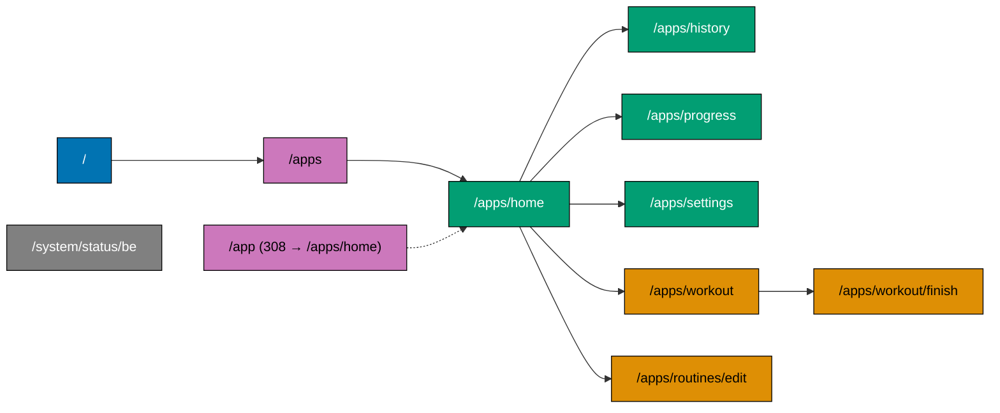

# OrganicLever Web — Routes Under `/apps`

**Status**: In Progress
**Created**: 2026-05-01
**Affected subrepo**: `ose-public`
**Affected app**: `apps/organiclever-web`
**Sibling apps touched**: `apps/organiclever-web-e2e` (step files), `specs/apps/organiclever/fe/gherkin/` (feature files)

## Context

Today the OrganicLever web client is a single-route SPA: `/app` mounts `AppRoot`, and every tab/screen (`home`, `history`, `progress`, `settings`, `workout`, `workout/finish`, `routines/edit`) is an in-memory state inside the XState `appMachine` `navigation` region. Tab choice persists to `localStorage` (`ol_tab`), URL never changes, deep links do not exist, browser back/forward is a no-op for nav, and DevTools "URL = state" debugging is unavailable.

Plan: replace the in-memory navigation region with real Next.js App Router routes nested under `/apps/`. Shell chrome, runtime, seeding, dark-mode sync, and overlays move to a shared `apps/` route segment layout. Each tab/screen becomes a `page.tsx`. The `appMachine` shrinks to its `overlay` region only; `use-hash` (created during Phase 0 gear-up but unused in production AppRoot) is deleted.

Why `/apps` plural: leaves room for sibling product surfaces under the same domain (e.g. `/apps/admin/...`, `/apps/coach/...`) without renaming the route prefix later. The marketing site stays at `/`.

## Scope

### In scope

- Add `apps/organiclever-web/src/app/apps/layout.tsx` (runtime, seed, breakpoint, dark mode, nav chrome, overlay tree).
- Create per-route page entries: `/apps`, `/apps/home`, `/apps/history`, `/apps/progress`, `/apps/settings`, `/apps/workout`, `/apps/workout/finish`, `/apps/routines/edit`.
- Convert `TabBar` and `SideNav` from `onNavigate(tab)` callbacks to `next/link` with `usePathname()` for active-state styling.
- Replace `localStorage`-backed tab persistence with URL-as-source-of-truth. Keep dark-mode and settings persistence as-is.
- Trim `appMachine`: drop the entire `navigation` region (`main`/`workout`/`finish`/`editRoutine`); keep the `overlay` region (`addEntry`/`loggerOpen`/`customLoggerOpen`).
- Delete `lib/hooks/use-hash.ts` (dead code post-refactor) and its any callers.
- Update landing CTA: `landing-page.tsx` `window.location.href = "/app"` → `/apps/home` (Next link or anchor).
- Add `/app` → `/apps/home` 308 permanent redirect via `next.config.ts` so old bookmarks/links don't break.
- Update all 13 e2e step files in `apps/organiclever-web-e2e/steps/` to navigate to the new URLs (10 actually edit; 3 unchanged — `accessibility.steps.ts`, `landing.steps.ts`, `system-status-be.steps.ts`).
- Update Gherkin specs under `specs/apps/organiclever/fe/gherkin/` where they reference `/app` or assume in-memory navigation; add a new `routing/apps-routes.feature` documenting the URL scheme.
- Update unit tests for `AppRoot`, `TabBar`, `SideNav`, `appMachine` to match new shape.
- Update `apps/organiclever-web/README.md` and `apps/organiclever-web/docs/` route table.

### Out of scope

- Moving overlays (Add Entry / Logger sheets) onto URL query params. Possible iter 2; current iter keeps overlays in XState for minimal diff.
- Changing the marketing landing page structure.
- Touching the F# backend (`organiclever-be`) or contracts (`organiclever-contracts`).
- Touching `/system/status/be` (server route, unaffected).
- Internationalisation of route segments (segments are English-only; `lang` setting still affects copy, not URLs).

## Approach Summary

Migration is gradual to keep `main` green: build the new `/apps/...` tree alongside the existing `/app` route, point a redirect, then delete `/app`. See `tech-docs.md` for architecture, `delivery.md` for the ordered checklist (8 phases). XState navigation region collapses last so overlay machine remains stable while route work lands.

## Diagrams

### Route tree (after refactor)

### Migration phasing

```mermaid
flowchart LR
    P0[Phase 0 — Plan + Specs] --> P1
    P1[Phase 1 — apps/ layout + tab pages] --> P2
    P2[Phase 2 — Link-based nav chrome] --> P3
    P3[Phase 3 — Workout + EditRoutine routes] --> P4
    P4[Phase 4 — /app → /apps/home redirect] --> P5
    P5[Phase 5 — Trim appMachine + delete use-hash] --> P6
    P6[Phase 6 — E2E + landing CTA + README] --> P7
    P7[Phase 7 — Quality gate + manual verify]

    style P0 fill:#0173B2,stroke:#000,color:#FFF
    style P1 fill:#0173B2,stroke:#000,color:#FFF
    style P2 fill:#0173B2,stroke:#000,color:#FFF
    style P3 fill:#DE8F05,stroke:#000,color:#000
    style P4 fill:#DE8F05,stroke:#000,color:#000
    style P5 fill:#CC78BC,stroke:#000,color:#000
    style P6 fill:#029E73,stroke:#000,color:#FFF
    style P7 fill:#029E73,stroke:#000,color:#FFF
```

## Documents

- [Business Requirements (BRD)](./brd.md) — why move to URL-routed shell now
- [Product Requirements (PRD)](./prd.md) — user stories + Gherkin acceptance criteria
- [Technical Documentation](./tech-docs.md) — architecture, file impact, design decisions, rollback
- [Delivery Checklist](./delivery.md) — phased `- [ ]` items

## Quality Gates

- `nx affected -t typecheck lint test:quick spec-coverage` green
- `nx run organiclever-web-e2e:test:e2e` green against new URL scheme
- Manual: open `/apps/home`, click each tab, refresh on `/apps/history`, browser back goes to landing, deep-link to `/apps/workout` works, `/app` 308-redirects to `/apps/home`
- Markdown lint green (`npm run lint:md`)
- Coverage ≥ 70% for `organiclever-web` (current threshold)

## Verification

Plan complete when all delivery checkboxes ticked, both quality gates pass, and `apps/organiclever-web/README.md` route table reflects the new scheme.
