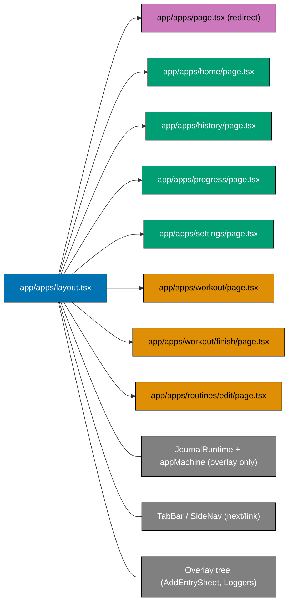

# Tech Docs — OrganicLever Web Routes Under `/apps`

## Architecture

### Current shape (single-route SPA)

```
/                         → LandingPage (marketing)
/app                      → AppRoot (XState parallel: navigation × overlay)
/system/status/be         → server route, BE health probe
```

`AppRoot` is the entire web app. The XState `appMachine` carries two parallel regions:

- `navigation`: `main` (with active `tab`) → `workout` → `finish`, plus `editRoutine`.
- `overlay`: `none` / `addEntry` / `loggerOpen` / `customLoggerOpen`.

`tab` is persisted to `localStorage` (`ol_tab`). `darkMode` to `localStorage` (`ol_dark_mode`) and to PGlite settings. `URL` is never updated.

### Target shape (URL-routed shell)

```
/                            → LandingPage (unchanged)
/apps                        → redirects to /apps/home
/apps/home                   → HomeScreen
/apps/history                → HistoryScreen
/apps/progress               → ProgressScreen
/apps/settings               → SettingsScreen
/apps/workout                → WorkoutScreen   (TabBar hidden)
/apps/workout/finish         → FinishScreen    (TabBar hidden)
/apps/routines/edit          → EditRoutineScreen (TabBar hidden)
/system/status/be            → unchanged
/app                         → 308 → /apps/home
```

The shell (runtime, dark-mode sync, breakpoint detection, navigation chrome, overlay tree) lives in a single layout: `apps/organiclever-web/src/app/apps/layout.tsx`. Each tab/screen becomes a thin `page.tsx` rendering the relevant Screen component with the layout-provided runtime.

`appMachine` is trimmed to its `overlay` region only. Tab is now derived from `usePathname()`. `localStorage.ol_tab` write/read is removed.

### Component layering (after refactor)



### State sources after refactor

| Concern                            | Source of truth (before)                                      | Source of truth (after)                                                                                                         |
| ---------------------------------- | ------------------------------------------------------------- | ------------------------------------------------------------------------------------------------------------------------------- |
| Active tab                         | `appMachine.context.tab` + `localStorage.ol_tab`              | URL (`usePathname()`)                                                                                                           |
| Workout in flight                  | `appMachine.navigation = workout`                             | URL = `/apps/workout`                                                                                                           |
| Finish summary visible             | `appMachine.navigation = finish` + `context.completedSession` | URL = `/apps/workout/finish` (state passed via React context provided by layout, hydrated from latest PGlite session if absent) |
| Edit routine                       | `appMachine.navigation = editRoutine` + `context.routine`     | URL = `/apps/routines/edit` (routine id loaded from PGlite by the page component; layout provides runtime)                      |
| Overlay (modals)                   | `appMachine.overlay`                                          | `appMachine.overlay` (unchanged)                                                                                                |
| Dark mode                          | `appMachine.context.darkMode`                                 | `appMachine.context.darkMode` (unchanged)                                                                                       |
| Desktop breakpoint                 | `appMachine.context.isDesktop`                                | `appMachine.context.isDesktop` (unchanged)                                                                                      |
| Settings (lang, name, restSeconds) | PGlite settings table                                         | PGlite settings table (unchanged)                                                                                               |

### Key design decisions

#### D1 — Use App Router segment layout, not nested layouts per tab

A single `apps/layout.tsx` owns the runtime, breakpoint, dark-mode sync, navigation chrome, and overlay tree. Per-tab pages are thin: `<HistoryScreen runtime={runtime} ... />`. Avoids re-instantiating the PGlite runtime on every route transition; React keeps the layout mounted as long as the route stays under `/apps/`.

Alternatives considered:

- **Per-route layouts that nest the chrome**: rejected because it complicates shared overlay state and forces every page to recreate the runtime.
- **Single page with internal routing**: rejected — that is what we have today and what we are leaving.

#### D2 — Workout/finish/edit-routine routes hide the TabBar via the layout

Layout reads `usePathname()` and chooses to render `<TabBar />` / `<SideNav />` only when the path matches a "main" tab (`/apps/home|history|progress|settings`). Avoids using a Next.js route group layout for the non-main flows; the variation is small and conditional rendering keeps the diff minimal.

Alternative: route groups `(main)` and `(flow)` with separate layouts. Rejected — overlays + runtime would need to be hoisted to a shared parent layout regardless, so the savings are marginal and the file count grows.

#### D3 — Overlays stay in `appMachine`

Modals are URL-orthogonal in this iteration. Promoting them to query params (`?sheet=add-entry&logger=reading`) is feasible but adds scope. Captured as a follow-up idea, not part of this plan.

#### D4 — Workout/finish state hydrated from PGlite, not URL state

Direct URL access to `/apps/workout/finish` without a recently completed session is a possible state. The Finish page reads the most recent session from PGlite. If none, it redirects to `/apps/home`. Same pattern for `/apps/routines/edit` without a routine query param: redirect to `/apps/home`.

We deliberately do not encode session ids or routine ids in the URL in this iteration — the routes are bookmarkable but not "deep" in the data sense. Adding `[sessionId]` and `[routineId]` dynamic segments is a clean follow-up if/when sharing specific sessions becomes a use case.

#### D5 — `/app` → `/apps/home` 308 permanent

`next.config.ts` `redirects()` returns `permanent: true`. Browsers and search engines may cache 308 responses; this is acceptable because the destination is stable. Documented in `apps/organiclever-web/README.md`.

#### D6 — `noindex` on the `apps/` segment

The marketing landing page is the only page intended for SEO. Add `<meta name="robots" content="noindex" />` to the `apps/` layout to prevent the in-app routes from being indexed. The existing `/system/status/be` already has `force-dynamic` server output but no `noindex`; that is unchanged.

#### D7 — Delete `lib/hooks/use-hash.ts`

Created during the gear-up plan but never wired into the production `AppRoot`. Removing avoids confusion about whether hash routing is part of the app's contract.

## File Impact Analysis

### Created files

| Path                                                             | Purpose                                                                          |
| ---------------------------------------------------------------- | -------------------------------------------------------------------------------- |
| `apps/organiclever-web/src/app/apps/layout.tsx`                  | Shared shell — runtime, breakpoint, dark mode, nav chrome, overlay tree, noindex |
| `apps/organiclever-web/src/app/apps/page.tsx`                    | Redirects to `/apps/home`                                                        |
| `apps/organiclever-web/src/app/apps/home/page.tsx`               | Mounts HomeScreen                                                                |
| `apps/organiclever-web/src/app/apps/history/page.tsx`            | Mounts HistoryScreen                                                             |
| `apps/organiclever-web/src/app/apps/progress/page.tsx`           | Mounts ProgressScreen                                                            |
| `apps/organiclever-web/src/app/apps/settings/page.tsx`           | Mounts SettingsScreen                                                            |
| `apps/organiclever-web/src/app/apps/workout/page.tsx`            | Mounts WorkoutScreen, hides TabBar                                               |
| `apps/organiclever-web/src/app/apps/workout/finish/page.tsx`     | Mounts FinishScreen, hides TabBar                                                |
| `apps/organiclever-web/src/app/apps/routines/edit/page.tsx`      | Mounts EditRoutineScreen, hides TabBar                                           |
| `apps/organiclever-web/src/app/apps/layout.unit.test.tsx`        | Layout tests (chrome visibility, overlay rendering, breakpoint)                  |
| `apps/organiclever-web/src/components/app/app-shell.tsx`         | Extracted shell helper used by layout (renders chrome + content)                 |
| `specs/apps/organiclever/fe/gherkin/routing/apps-routes.feature` | New Gherkin feature documenting URL scheme + redirect                            |
| `apps/organiclever-web-e2e/steps/_app-shell.ts`                  | Helper exporting `APP_BASE_URL = "http://localhost:3200/apps/home"`              |

### Modified files

| Path                                                                    | Change                                                                            |
| ----------------------------------------------------------------------- | --------------------------------------------------------------------------------- |
| `apps/organiclever-web/next.config.ts`                                  | Add `redirects()` returning `/app → /apps/home` (308)                             |
| `apps/organiclever-web/src/app/app/page.tsx`                            | DELETED in Phase 4 once redirect is verified                                      |
| `apps/organiclever-web/src/components/app/app-root.tsx`                 | Renamed to `app-shell.tsx`; navigation conditionals replaced by route matching    |
| `apps/organiclever-web/src/components/app/tab-bar.tsx`                  | `onNavigate` → `next/link` `<Link href="/apps/home">`; active via `usePathname()` |
| `apps/organiclever-web/src/components/app/side-nav.tsx`                 | Same pattern as TabBar — `next/link`, `usePathname()` for active state            |
| `apps/organiclever-web/src/lib/app/app-machine.ts`                      | Drop `navigation` region; keep `overlay` region; trim related events              |
| `apps/organiclever-web/src/lib/app/app-machine.unit.test.ts`            | Remove navigation-region tests; add coverage for trimmed event set                |
| `apps/organiclever-web/src/components/landing/landing-page.tsx`         | `window.location.href = "/app"` → `"/apps/home"`                                  |
| `apps/organiclever-web/README.md`                                       | Route table updated                                                               |
| `apps/organiclever-web-e2e/steps/*.steps.ts` (10 of 13 files)           | Replace `goto("http://localhost:3200/app")` with the relevant `/apps/<tab>` URL   |
| `specs/apps/organiclever/fe/gherkin/app-shell/navigation.feature`       | Add scenarios covering URL persistence on refresh                                 |
| `specs/apps/organiclever/fe/gherkin/routing/disabled-routes.feature`    | Add scenario asserting `/app` 308-redirects (not 404)                             |
| `specs/apps/organiclever/fe/gherkin/workout/workout-session.feature`    | Update steps to reference URL changes                                             |
| `specs/apps/organiclever/fe/gherkin/routine/routine-management.feature` | Same                                                                              |

### Deleted files

| Path                                              | Reason                                          |
| ------------------------------------------------- | ----------------------------------------------- |
| `apps/organiclever-web/src/lib/hooks/use-hash.ts` | Dead code; never wired into production AppRoot  |
| `apps/organiclever-web/src/app/app/page.tsx`      | Replaced by `next.config.ts` redirect (Phase 4) |

## Implementation Mechanics

### Layout file (sketch)

```tsx
// apps/organiclever-web/src/app/apps/layout.tsx
"use client";
export const dynamic = "force-dynamic";

import { useEffect, useMemo, useState } from "react";
import { usePathname } from "next/navigation";
import { useActor } from "@xstate/react";
import { appMachine } from "@/lib/app/app-machine";
import { makeJournalRuntime } from "@/lib/journal/runtime";
import { seedIfEmpty } from "@/lib/journal/seed";
import { saveSettings } from "@/lib/journal/settings-store";
import { TabBar } from "@/components/app/tab-bar";
import { SideNav } from "@/components/app/side-nav";
import { OverlayTree } from "@/components/app/overlay-tree";
import { AppRuntimeProvider } from "@/components/app/app-runtime-context";

const MAIN_PATHS = new Set(["/apps/home", "/apps/history", "/apps/progress", "/apps/settings"]);

export default function AppsLayout({ children }: { children: React.ReactNode }) {
  const pathname = usePathname();
  const isMainTab = MAIN_PATHS.has(pathname ?? "");

  const initialDarkMode = useMemo(() => {
    if (typeof window === "undefined") return false;
    return localStorage.getItem("ol_dark_mode") === "true";
  }, []);

  const [state, send] = useActor(appMachine, { input: { initialDarkMode } });
  const runtime = useMemo(() => makeJournalRuntime(), []);

  // dark mode + breakpoint + seed effects (same as today's AppRoot, minus tab persistence)
  useEffect(() => {
    /* dark mode → DOM + localStorage + PGlite */
  }, [state.context.darkMode]);
  useEffect(() => {
    /* SET_DESKTOP on resize */
  }, []);
  useEffect(() => {
    runtime.runPromise(seedIfEmpty()).catch(() => {});
  }, [runtime]);

  return (
    <AppRuntimeProvider runtime={runtime} send={send} state={state}>
      {/* desktop layout when isDesktop; mobile when not */}
      {/* render SideNav/TabBar only when isMainTab */}
      {/* {children} replaces the per-tab content */}
      <OverlayTree />
    </AppRuntimeProvider>
  );
}
```

### Per-tab page (sketch)

```tsx
// apps/organiclever-web/src/app/apps/history/page.tsx
"use client";
export const dynamic = "force-dynamic";

import { HistoryScreen } from "@/components/app/history/history-screen";
import { useAppRuntime } from "@/components/app/app-runtime-context";

export default function HistoryPage() {
  const { runtime, refreshKey } = useAppRuntime();
  return <HistoryScreen runtime={runtime} refreshKey={refreshKey} />;
}
```

### TabBar with `next/link` (sketch)

```tsx
"use client";
import Link from "next/link";
import { usePathname } from "next/navigation";

const TABS = [
  { id: "home", href: "/apps/home", label: "Home", icon: "home" },
  { id: "history", href: "/apps/history", label: "History", icon: "history" },
  { id: "progress", href: "/apps/progress", label: "Progress", icon: "trend" },
  { id: "settings", href: "/apps/settings", label: "Settings", icon: "settings" },
] as const;

export function TabBar({ onFabPress }: { onFabPress: () => void }) {
  const pathname = usePathname();
  return (
    <nav>
      {/* render two tabs, FAB, two tabs — same layout as today */}
      {TABS.map((t) => {
        const active = pathname === t.href;
        return (
          <Link key={t.id} href={t.href} aria-current={active ? "page" : undefined}>
            {t.label}
          </Link>
        );
      })}
    </nav>
  );
}
```

### `next.config.ts` redirect

```ts
// apps/organiclever-web/next.config.ts
const config: NextConfig = {
  async redirects() {
    return [{ source: "/app", destination: "/apps/home", permanent: true }];
  },
  // ... existing config
};
```

### Trimmed `appMachine` (sketch)

```ts
export const appMachine = createMachine({
  id: "appMachine",
  context: ({ input }) => ({ darkMode: input.initialDarkMode, isDesktop: false, loggerKind: null, customLoggerName: null }),
  // single (non-parallel) machine for overlay; dark-mode + breakpoint live in context
  initial: "none",
  states: {
    none: { on: { OPEN_ADD_ENTRY: "addEntry", OPEN_LOGGER: { target: "loggerOpen", actions: assign(...) } } },
    addEntry: { on: { CLOSE_ADD_ENTRY: "none", OPEN_LOGGER: { target: "loggerOpen", actions: assign(...) } } },
    loggerOpen: { on: { CLOSE_LOGGER: { target: "none", actions: assign({ loggerKind: null }) } } },
    customLoggerOpen: { on: { CLOSE_CUSTOM_LOGGER: { target: "none", actions: assign({ customLoggerName: null }) } } },
  },
  on: {
    TOGGLE_DARK_MODE: { actions: assign({ darkMode: ({ context }) => !context.darkMode }) },
    SET_DESKTOP: { actions: assign({ isDesktop: ({ event }) => event.isDesktop }) },
  },
});
```

(`Tab`, `START_WORKOUT`, `EDIT_ROUTINE`, `FINISH_WORKOUT`, `BACK_TO_MAIN`, `NAVIGATE_TAB`, `CompletedSession` references are removed from the machine; navigation flows use `useRouter()` from `next/navigation` instead.)

### Workout / Finish / Edit-Routine state passing

- WorkoutScreen reads the active routine from a React context populated when the user starts a workout from a `RoutineCard` on Home (the card calls `useRouter().push("/apps/workout")` after stashing the chosen routine in context). If a user navigates to `/apps/workout` directly without a routine in context, the page redirects to `/apps/home`.
- FinishScreen reads the most recent completed session from PGlite via `useJournal`. If no recent session exists, redirects to `/apps/home`.
- EditRoutineScreen reads the routine being edited from React context populated when the user opens "Edit". If absent, redirect to `/apps/home`.

This keeps URLs stable and bookmarkable without putting transient state into the URL.

## Dependencies

- `next` (already a dep): `redirects()` config and `next/link`, `usePathname`, `useRouter` from `next/navigation`.
- `@xstate/react` (already a dep): `useActor` for the trimmed overlay machine.
- No new packages.

## Risks Tracking

| Risk                                                | Phase mitigation                                                             |
| --------------------------------------------------- | ---------------------------------------------------------------------------- |
| Big diff if all phases land at once                 | 8-phase rollout; main green between phases                                   |
| E2E churn (10 of 13 step files)                     | Helper file `_app-shell.ts` exporting one base URL per main tab              |
| Coverage dip from new layout file                   | New layout unit tests; per-page tests piggy-back on existing screen tests    |
| Old `/app` bookmarks                                | Permanent 308 redirect plus e2e scenario                                     |
| State loss when user types `/apps/workout` directly | Pages redirect to `/apps/home` if context is missing; documented as expected |

## Rollback Plan

If a regression is found after Phase 7:

1. Revert the merge commit chain back to before Phase 1.
2. The redirect from `/app` → `/apps/home` is added in Phase 4; reverting that phase restores `/app` as the live route.
3. Because phases land sequentially with passing CI between, the revert target is well-defined.

No data migration is involved; PGlite tables are not touched. Settings keys (`ol_dark_mode`, etc.) remain backward-compatible.

## Verification (manual)

1. `nx dev organiclever-web` → open `http://localhost:3200/apps/home` → Home renders.
2. Click each tab → URL updates, active tab style follows pathname, screen content swaps.
3. Refresh on `/apps/history` → still on History.
4. Browser back from `/apps/progress` → returns to `/apps/home`.
5. Type `/apps/workout` directly with no routine context → redirects to `/apps/home`.
6. From Home, start a workout → URL becomes `/apps/workout`, TabBar hidden.
7. Finish a workout → URL becomes `/apps/workout/finish`, FinishScreen visible.
8. Browser back from finish → goes to last route on the stack (likely Home).
9. Navigate to `/app` → 308 to `/apps/home`.
10. Navigate to `/apps/does-not-exist` → 404.
11. Tap FAB on each tab → Add Entry sheet opens; URL unchanged.
12. Toggle dark mode in Settings → DOM `data-theme` updates; reload preserves the choice.

## Related Documentation

- [Plans Organization Convention](../../../governance/conventions/structure/plans.md)
- [Plan Execution Workflow](../../../governance/workflows/plan/plan-execution.md)
- [Three-Level Testing Standard](../../../governance/development/quality/three-level-testing-standard.md)
- [Acceptance Criteria Convention](../../../governance/development/infra/acceptance-criteria.md)
- [Next.js App Router redirects()](https://nextjs.org/docs/app/api-reference/config/next-config-js/redirects) (accessed 2026-05-01)
