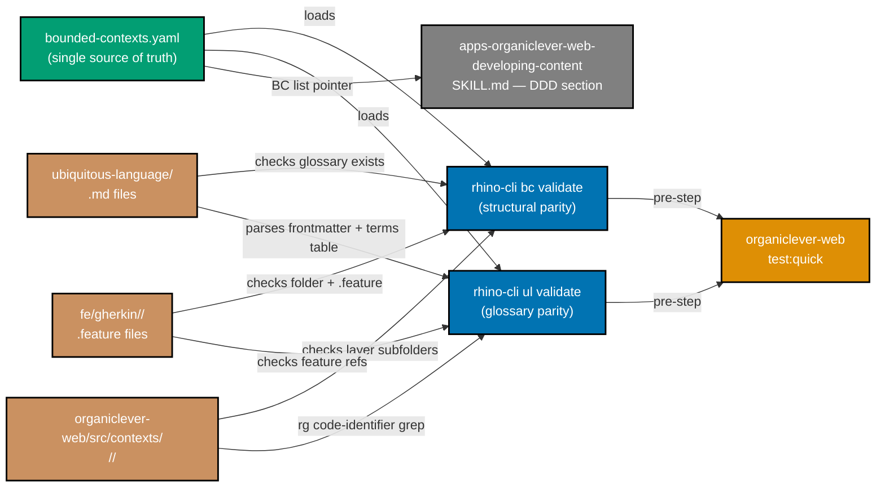

# Tech Docs — OrganicLever rhino-cli DDD Enforcement + Skill Extension

## Target architecture

### High-level shape

#### Directory layout (new + extended files)

```
specs/apps/organiclever/
├── bounded-contexts.yaml        # NEW — single source of truth for the BC map
├── ubiquitous-language/
│   ├── README.md
│   ├── journal.md
│   ├── ...
└── fe/gherkin/<bc>/

apps/organiclever-web/src/contexts/<bc>/<layer>/

apps/rhino-cli/
├── cmd/                         # flat package (all files package cmd — no subdirs)
│   ├── bc.go                    # NEW — Cobra parent command (bcCmd)
│   ├── bc_validate.go           # NEW — `rhino-cli bc validate <app>`
│   ├── bc_validate_test.go      # NEW — unit-level godog suite (mocked filesystem)
│   ├── bc_validate.integration_test.go  # NEW — integration-level godog suite (real /tmp)
│   ├── ul.go                    # NEW — Cobra parent command (ulCmd)
│   ├── ul_validate.go           # NEW — `rhino-cli ul validate <app>`
│   ├── ul_validate_test.go      # NEW — unit-level godog suite (mocked filesystem)
│   └── ul_validate.integration_test.go  # NEW — integration-level godog suite (real /tmp)
├── internal/
│   ├── bcregistry/              # NEW — YAML loader, schema, helpers
│   ├── glossary/                # NEW — markdown parser, frontmatter, table
│   └── (existing packages reused)
└── README.md                    # extended with "DDD enforcement" subsection

specs/apps/rhino/cli/gherkin/
├── bc-validate.feature          # NEW — godog scenarios for FR-2
└── ul-validate.feature          # NEW — godog scenarios for FR-3

apps/organiclever-web/project.json
                                 # `test:quick` extended to call both subcommands

.claude/skills/apps-organiclever-web-developing-content/SKILL.md
                                 # Domain-Driven Design section appended
```

#### Component interactions



### Registry YAML schema

`specs/apps/organiclever/bounded-contexts.yaml`:

```yaml
# Bounded-context registry for the OrganicLever product.
# Single source of truth — consumed by:
#   - rhino-cli bc validate (structural parity)
#   - rhino-cli ul validate (glossary file resolution)
#   - apps-organiclever-web-developing-content skill (BC list pointer)
# Cross-links: see `plans/done/2026-05-02__organiclever-adopt-ddd/tech-docs.md`
# for full design rationale (this file is the machine-readable mirror).

version: 1
app: organiclever
contexts:
  - name: journal
    summary: Append-only event log; system of record for everything the user did.
    layers: [domain, application, infrastructure, presentation]
    code: apps/organiclever-web/src/contexts/journal
    glossary: specs/apps/organiclever/ubiquitous-language/journal.md
    gherkin: specs/apps/organiclever/fe/gherkin/journal
    relationships: []

  - name: workout-session
    summary: In-progress workout state machine; persists outcomes via journal.
    layers: [domain, application, presentation]
    code: apps/organiclever-web/src/contexts/workout-session
    glossary: specs/apps/organiclever/ubiquitous-language/workout-session.md
    gherkin: specs/apps/organiclever/fe/gherkin/workout-session
    relationships:
      - to: journal
        kind: customer-supplier
        role: customer
      - to: routine
        kind: conformist
        role: downstream

  - name: routine
    summary: Workout routine definitions (templates the user can run).
    layers: [domain, application, infrastructure, presentation]
    code: apps/organiclever-web/src/contexts/routine
    glossary: specs/apps/organiclever/ubiquitous-language/routine.md
    gherkin: specs/apps/organiclever/fe/gherkin/routine
    relationships:
      - to: workout-session
        kind: conformist
        role: upstream

  - name: stats
    summary: Read-model — rolling aggregates and progress projections from journal events.
    layers: [domain, application, presentation]
    code: apps/organiclever-web/src/contexts/stats
    glossary: specs/apps/organiclever/ubiquitous-language/stats.md
    gherkin: specs/apps/organiclever/fe/gherkin/stats
    relationships:
      - to: journal
        kind: customer-supplier
        role: customer

  - name: settings
    summary: User-local preferences (theme, locale, units).
    layers: [domain, application, infrastructure, presentation]
    code: apps/organiclever-web/src/contexts/settings
    glossary: specs/apps/organiclever/ubiquitous-language/settings.md
    gherkin: specs/apps/organiclever/fe/gherkin/settings
    relationships: []

  - name: app-shell
    summary: Cross-cutting frame — i18n, layout, theming, navigation, loggers.
    layers: [application, presentation]
    code: apps/organiclever-web/src/contexts/app-shell
    glossary: specs/apps/organiclever/ubiquitous-language/app-shell.md
    gherkin: specs/apps/organiclever/fe/gherkin/app-shell
    relationships: []

  - name: health
    summary: Backend health-endpoint consumption + system-status diagnostic page.
    layers: [infrastructure]
    code: apps/organiclever-web/src/contexts/health
    glossary: specs/apps/organiclever/ubiquitous-language/health.md
    gherkin: specs/apps/organiclever/fe/gherkin/health
    relationships: []

  - name: landing
    summary: Marketing landing surface (`/`).
    layers: [presentation]
    code: apps/organiclever-web/src/contexts/landing
    glossary: specs/apps/organiclever/ubiquitous-language/landing.md
    gherkin: specs/apps/organiclever/fe/gherkin/landing
    relationships: []

  - name: routing
    summary: Disabled-route guards (`/login`, `/profile`).
    layers: [presentation]
    code: apps/organiclever-web/src/contexts/routing
    glossary: specs/apps/organiclever/ubiquitous-language/routing.md
    gherkin: specs/apps/organiclever/fe/gherkin/routing
    relationships: []
```

Notes:

- `version: 1` allows future schema migrations.
- `app: organiclever` is the resolution key for `rhino-cli {bc,ul} validate <app>`.
- `relationships` is a flat list per context. Symmetry check is the validator's job, not the schema's.
- `kind` enum is closed at `customer-supplier`, `conformist`, `shared-kernel`, `anticorruption-layer`, `partnership`, `independent` — extending the enum is a schema change (bumps `version`).
- The full registry is canonical; `tech-docs.md` of the DDD plan describes design intent in prose.

### Subcommand architecture

#### `rhino-cli bc validate <app>`

```
INPUT
  args: <app> (e.g. "organiclever")
  flags: --severity=warn|error  (default: error)
         --root=<path>          (default: cwd of repo root)

LOAD
  registry := bcregistry.Load(specs/apps/<app>/bounded-contexts.yaml)
  if err: print error, exit 2

CHECKS (parallelizable inside one process; sequential output)

  for each ctx in registry.contexts:
    1. Code path exists?
       fs.Stat(ctx.code) ⇒ if missing: finding(`missing code path`)

    2. Layer subfolders exact match?
       declared := set(ctx.layers)
       actual   := set(fs.ReadDir(ctx.code))   # filter dirs only
       missing  := declared \ actual           # finding per missing
       extra    := actual \ declared           # finding per extra

    3. Glossary file exists?
       fs.Stat(ctx.glossary) ⇒ if missing: finding(`missing glossary`)

    4. Gherkin folder exists?
       fs.Stat(ctx.gherkin) ⇒ if missing: finding(`missing gherkin folder`)

    5. Gherkin folder has at least one .feature?
       fs.Glob(ctx.gherkin, "*.feature") ⇒ if empty: finding(`empty gherkin folder`)

  ORPHAN DETECTION
    code root        := common-prefix of all ctx.code paths (e.g. apps/organiclever-web/src/contexts)
    code orphans     := dirs under code root not in any ctx.code
    glossary orphans := *.md under specs/apps/<app>/ubiquitous-language/ not in any ctx.glossary
                       (excluding README.md)
    gherkin orphans  := dirs under specs/apps/<app>/fe/gherkin/ not in any ctx.gherkin
    each orphan ⇒ finding(`orphan <kind>`)

  RELATIONSHIP SYMMETRY
    for each rel R in ctx.relationships:
      if R.kind == "independent": continue
      target := registry.contexts[R.to]
      if target is None: finding(`relationship target not in registry`)
      reciprocal := target.relationships[<-> ctx.name]
      if reciprocal is None: finding(`asymmetry: <ctx> declares <kind> to <target> but <target> doesn't reciprocate`)
      if reciprocal.kind != R.kind: finding(`asymmetry: kinds disagree`)
      # role pairing rules:
      #   customer-supplier: roles must be (supplier, customer)
      #   conformist:        roles must be (upstream, downstream)
      #   shared-kernel, anticorruption-layer, partnership: role optional, must match if set

OUTPUT
  if any findings.severity >= configured: exit non-zero
  print findings in canonical rhino-cli format:
    <file>:<line>:<col> <severity>: <message>
  (line/col elided when not applicable; <file> is the registry YAML file with line for the offending context)
```

Implementation language: Go. Reuses `apps/libs/golang-commons` for finding-output formatting, severity flag parsing, and exit-code helpers.

#### `rhino-cli ul validate <app>`

```
INPUT
  args: <app>
  flags: --severity=warn|error (default: error)
         --root=<path>

LOAD
  registry := bcregistry.Load(specs/apps/<app>/bounded-contexts.yaml)

CHECKS (per glossary file, then cross-context)

  for each ctx in registry.contexts:
    g := glossary.Parse(ctx.glossary)
    if g.parseError: finding(`malformed glossary file`)

    1. Frontmatter
       require keys: ["Bounded context", "Maintainer", "Last reviewed"]
       missing key ⇒ finding(`missing frontmatter key: <key>`)

    2. Terms table header
       expected := ["Term", "Definition", "Code identifier(s)", "Used in features"]
       if g.tableHeader != expected: finding(`malformed terms table header`)

    3. For each row in g.terms:
       a. Code identifiers
          ids := parseBacktickCommaList(row.codeIdentifiers)
          for id in ids:
            hits := ripgrep(id, ctx.code, "*.ts", "*.tsx")
            if hits == 0: finding(`stale identifier: <id>`)

       b. Used in features
          refs := parseFeatureRefList(row.usedInFeatures)
          for ref in refs:
            featurePath := join(ctx.gherkin, ref)
            if !exists(featurePath): finding(`missing feature reference: <ref>`)

    4. Forbidden synonyms
       for forbidden in g.forbiddenSynonyms:
         hits := ripgrep(forbidden.term, ctx.code, "*.ts", "*.tsx")
         hits += ripgrep(forbidden.term, ctx.gherkin, "*.feature")
         if hits > 0: finding(`forbidden synonym used in own context: <term>`)

  CROSS-CONTEXT
    termIndex := map[term] -> [context...]
    for each ctx, g:
      for each row in g.terms:
        termIndex[row.term].append(ctx.name)
    for term, contexts in termIndex:
      if len(contexts) > 1:
        # check if EACH glossary lists ALL OTHER occurrences in Forbidden synonyms
        allCovered := true
        for c in contexts:
          forbiddenList := glossaries[c].forbiddenSynonyms
          others := contexts \ {c}
          missing := others \ forbiddenList[term].declaredBy
          if missing: allCovered = false; break
        if not allCovered:
          finding(`term collision: "<term>" defined in <contexts> without mutual Forbidden-synonyms cross-link`)

OUTPUT
  same canonical format as bc validate
```

Implementation notes:

- `glossary.Parse` is a small markdown parser specialised for the glossary file shape; not a general markdown parser. Frontmatter is YAML-style. Terms table is a standard pipe-delimited markdown table; whitespace tolerance per existing rhino-cli docs-validate parser.
- `ripgrep` is invoked via `os/exec` for symbol existence — fast and standard. Falls back to a Go-native scan if `rg` not on PATH.
- Code-identifier matching is whole-word (`\bIdentifier\b`); whitespace and punctuation around the symbol don't matter; matches in comments count (intentional — a symbol referenced only in a comment is still a real identifier in the file).

### Glossary parser shape

```go
package glossary

type Glossary struct {
    Path                string
    Frontmatter         map[string]string  // "Bounded context", "Maintainer", "Last reviewed"
    Summary             string             // text under "## One-line summary"
    Terms               []Term             // rows of the Terms table
    ForbiddenSynonyms   []Forbidden        // entries under "## Forbidden synonyms"
    ParseErrors         []ParseError       // collected non-fatal parse errors
}

type Term struct {
    Term            string
    Definition      string
    CodeIdentifiers []string  // parsed from backtick-comma-list
    UsedInFeatures  []string  // parsed from comma-separated feature paths
    SourceLine      int
}

type Forbidden struct {
    Term       string
    Reason     string  // free text
    DeclaredBy string  // the BC name owning the forbidden list (for cross-context check)
    SourceLine int
}

type ParseError struct {
    Line    int
    Col     int
    Message string
}
```

### project.json wiring

`apps/organiclever-web/project.json` `test:quick` target gains two pre-steps:

```json
{
  "targets": {
    "test:quick": {
      "executor": "nx:run-commands",
      "options": {
        "commands": [
          "rhino-cli bc validate organiclever --severity=${ORGANICLEVER_RHINO_DDD_SEVERITY:-error}",
          "rhino-cli ul validate organiclever --severity=${ORGANICLEVER_RHINO_DDD_SEVERITY:-error}",
          "<existing test:quick chain>"
        ],
        "parallel": false
      }
    }
  }
}
```

Severity controlled by `ORGANICLEVER_RHINO_DDD_SEVERITY` env var (default `error`). The default `error` is the production setting and ships from day one of this plan. The `warn` override is a **local escape hatch only** for the case when a false-positive surfaces post-merge and an immediate downgrade is needed before the fix lands; it is not a production setting and is not used in CI.

### Skill DDD section design

`.claude/skills/apps-organiclever-web-developing-content/SKILL.md` gains a final section:

````markdown
## Domain-Driven Design

`apps/organiclever-web` follows Domain-Driven Design. The bounded-context map is canonical at:

- **Registry**: `specs/apps/organiclever/bounded-contexts.yaml`
- **Glossaries**: `specs/apps/organiclever/ubiquitous-language/<bc>.md`
- **Design intent (full prose)**: `plans/done/2026-05-02__organiclever-adopt-ddd/tech-docs.md`
- **ADR**: `apps/organiclever-web/docs/explanation/bounded-context-map.md`

### Bounded contexts

See the registry for the canonical list. Currently 9: journal, workout-session, routine, stats, settings, app-shell, health, landing, routing.

### Layer rules (concise)

| Layer            | Imports allowed                                                                    | Imports forbidden                                                  |
| ---------------- | ---------------------------------------------------------------------------------- | ------------------------------------------------------------------ |
| `domain`         | own `domain/`, `shared/utils/**`                                                   | anything in `application/`, `infrastructure/`, `presentation/`     |
| `application`    | own `domain/`, own `infrastructure/` ports, other contexts' `application/index.ts` | other contexts' `domain/`/`infrastructure/`/`presentation/`        |
| `infrastructure` | own `domain/`, own `application/` ports                                            | other contexts' anything; `presentation/`                          |
| `presentation`   | own `domain/`, own `application/`, other contexts' `presentation/index.ts`         | own `infrastructure/`; other contexts' `domain/`/`infrastructure/` |

Full layer rules: see DDD plan `tech-docs.md` § "Layer rules".

### xstate machine placement

- **Pure** (no `fromPromise`/IO actors) → `domain/`
- **Orchestrating** (invokes IO actors / cross-context calls) → `application/`
- **UI shell** (no aggregate model, just view state) → `presentation/`

Full xstate placement rules: see DDD plan `tech-docs.md` § "xstate machine placement".

### Cross-context calls

- Only via target BC's `application/index.ts` (or `presentation/index.ts` for hooks/components).
- NEVER hold a foreign machine's actor handle.
- NEVER import another context's `domain/`, `infrastructure/`, or non-published files.

### Glossary authoring rule

When you add a new domain term to code OR a Gherkin feature:

1. Add a row to the right context's `specs/apps/organiclever/ubiquitous-language/<bc>.md` Terms table.
2. Set `Code identifier(s)` to the actual symbol(s) in code (backtick-comma-list).
3. Set `Used in features` to the `.feature` filename(s) under that BC's Gherkin folder.
4. If the term is also used by another context with a different meaning, add it to **both** glossaries' "Forbidden synonyms" sections cross-linking each other.
5. The glossary update lands **in the same commit** as the code/feature change.

### Pre-commit checklist

```bash
nx run organiclever-web:test:quick
# This runs (among other things):
#   rhino-cli bc validate organiclever
#   rhino-cli ul validate organiclever
# Both must exit zero before the commit can proceed.
```
````

If either reports a finding:

- **Orphan code/glossary/gherkin** — register it in `bounded-contexts.yaml` or move it under an existing context.
- **Stale code identifier** — update the glossary `Code identifier(s)` column to match the renamed symbol.
- **Term collision** — add cross-linked Forbidden synonyms to both glossaries.
- **Layer subfolder mismatch** — update the registry's `layers` array OR remove the unused subfolder.

NEVER silence a finding by lowering severity in production. Use `--severity=warn` only for local exploratory work.

### Three-level testing layout

Per the [Three-Level Testing Standard](../../../governance/development/quality/three-level-testing-standard.md), each subcommand ships with:

- **Unit (`test:unit`)** — Godog scenarios consume mocked filesystem; mocks installed via package-level function variables (existing rhino-cli pattern). Coverage measured here, ≥90%.
- **Integration (`test:integration`)** — Same Gherkin scenarios consume real `/tmp` filesystem fixtures; drives commands in-process via `cmd.RunE()`; cacheable.
- **E2E** — Not applicable (CLI app).

Both levels share `specs/apps/rhino/cli/gherkin/bc-validate.feature` and `specs/apps/rhino/cli/gherkin/ul-validate.feature`. Step implementations differ between levels (mocked I/O at unit, real I/O at integration).

## Decisions

| #   | Decision                                                                                          | Rationale                                                                                                                                                                                                                                                                                         |
| --- | ------------------------------------------------------------------------------------------------- | ------------------------------------------------------------------------------------------------------------------------------------------------------------------------------------------------------------------------------------------------------------------------------------------------- |
| D1  | Registry is YAML, not JSON.                                                                       | Comment support; human-readable; consistent with other repo configs.                                                                                                                                                                                                                              |
| D2  | Registry lives in `specs/apps/organiclever/`, not `apps/organiclever-web/`.                       | Specs are platform-agnostic and shared between FE/BE; the registry will be reused when `organiclever-be` adopts DDD. Code-side path would scope it FE-only.                                                                                                                                       |
| D3  | Subcommand name is `bc validate` and `ul validate`, not `ddd-bc` or `ddd-ul`.                     | Short, two-letter group prefix matches existing rhino-cli style (e.g. `docs validate-links`). `bc` = bounded context; `ul` = ubiquitous language. Memorable and unambiguous in this repo.                                                                                                         |
| D4  | Two subcommands, not one.                                                                         | They check orthogonal concerns (structural parity vs glossary parity). Splitting allows independent severity flags and cleaner finding output.                                                                                                                                                    |
| D5  | Code-identifier check uses ripgrep (with Go fallback), not a TypeScript AST parser.               | Polyglot-ready (works for F# BE later); no language-specific dependency; whole-word grep is sufficient because identifiers are whole-token by convention in TS/F#/Go.                                                                                                                             |
| D6  | Severity defaults to `error`; `warn` is a local escape hatch only.                                | Default-strict prevents accidental-warning-only operation in production. The DDD plan is complete before this plan begins, so subcommands ship at error severity from day one — no two-wave rollout. The env var override exists only for fast post-merge downgrade if a false positive surfaces. |
| D7  | Skill DDD section points to canonical sources rather than duplicating them.                       | Prevents drift between skill content and DDD plan `tech-docs.md`. Skill is concise enough to load without bloating any agent's context.                                                                                                                                                           |
| D8  | Polyglot import-graph subcommand (`bc deps`) explicitly deferred.                                 | ESLint boundaries already covers TS in DDD plan; F# BE doesn't yet adopt DDD. Wait until polyglot DDD becomes real before building polyglot tooling.                                                                                                                                              |
| D9  | New checker agent (`apps-organiclever-ddd-checker`) explicitly deferred.                          | Existing `plan-checker` and `specs-checker` cover most semantic concerns when invoked. New checker = governance overhead. Add only if rhino-cli + skill leave drift unaddressed in production.                                                                                                    |
| D10 | Registry YAML lists relationships flat per context; symmetry check is validator's responsibility. | Schema simplicity — flat YAML beats inferred mirroring. Symmetry is a validation rule, not a schema rule.                                                                                                                                                                                         |
| D11 | `glossary.Parse` is a glossary-shape-specific parser, not a general markdown parser.              | Smaller code surface; faster; easier to test. The glossary file shape is fixed by FR-1 of the DDD plan; a specialised parser is appropriate.                                                                                                                                                      |

## Open questions (Phase 0 must resolve)

- Q1: Should `bc validate` warn on missing `relationships` declarations entirely, or only on asymmetry? — defaults
  to **only asymmetry**; missing relationships are valid for independent contexts (`landing`, `routing`, `health`,
  `settings`).
  - RESOLVED (2026-05-03): **Accept default — only flag asymmetry, not absence.** Independent contexts with
    empty `relationships: []` generate no finding. A finding fires only when a declared relationship has no
    reciprocal in the target context, or when `kind`/`role` pairs disagree.
- Q2: Should `ul validate` enforce that every code identifier in the BC's `code` path appears in some glossary
  entry? — defaults to **no, glossary is a sample of important terms, not an exhaustive index**; revisit if
  glossary discipline drifts.
  - RESOLVED (2026-05-03): **Accept default — no exhaustive coverage.** `ul validate` checks the inverse: every
    identifier already in the glossary must still exist in code. New symbols not yet in the glossary are not
    flagged. This keeps the glossary a curated sample and avoids noise from auto-generated identifiers.
- Q3: Should the env var be `ORGANICLEVER_RHINO_DDD_SEVERITY` (app-scoped) or `RHINO_DDD_SEVERITY` (global)? —
  defaults to **app-scoped**; other apps may want different severities when they adopt DDD.
  - RESOLVED (2026-05-03): **Accept default — `ORGANICLEVER_RHINO_DDD_SEVERITY`.** App-scoped lets future DDD
    adopters (`organiclever-be` or other apps) set their own severity independently. A global var would force one
    setting across all apps in the same shell, which is too coarse.

## Risk mitigations

- **Subcommand wall-clock too slow**: profile in Phase 4. Glossary parser caches parsed glossaries within one invocation. Ripgrep invocation is shared across all symbols per glossary.
- **Glossary parser brittle**: integration godog scenarios include "table reformatted by Prettier" cases (different column widths, extra trailing pipes, blank rows).
- **Strict serial dependency on DDD plan**: this plan does not start until the DDD adoption plan archives to `plans/done/`. Pre-flight Phase 0 confirms the DDD plan's final SHA is on `origin/main` before any work begins. If the DDD plan stalls, this plan stalls — accepted trade-off because validating against a half-migrated codebase produces unreliable results.

## Rollback

### Per-phase rollback

```bash
git log --oneline | head -20            # find phase commit
git revert <phase-commit-sha>            # safe revert
```

After reverting, all gates must be green before retrying.

### Subcommand rollback (bc validate or ul validate misbehaves in production)

1. Set `ORGANICLEVER_RHINO_DDD_SEVERITY=warn` in the relevant environment to downgrade findings to warnings (fast, no code change).
2. If the subcommand crashes, comment out the corresponding line in `apps/organiclever-web/project.json` `test:quick` and commit `chore(organiclever-web): temporarily disable rhino-cli {bc,ul} validate — <reason>`.
3. Investigate root cause; fix in a follow-up commit; re-enable.

### Skill DDD section rollback

Revert the SKILL.md edit. The existing "developing content" sections are untouched, so the skill keeps working in degraded mode (no DDD knowledge for agents).

### Full plan abort

1. Identify the Phase 0 commit.
2. Revert all phase commits backward to Phase 0 in reverse chronological order.
3. Confirm baseline gates green.
4. Confirm `apps/organiclever-web/project.json` `test:quick` no longer references rhino-cli DDD subcommands.

## References

- [OrganicLever DDD Adoption Plan (sibling)](../../done/2026-05-02__organiclever-adopt-ddd/tech-docs.md) — full design intent for the BC layout this plan validates.
- [Three-Level Testing Standard](../../../governance/development/quality/three-level-testing-standard.md)
- [Test-Driven Development Convention](../../../governance/development/workflow/test-driven-development.md)
- [rhino-cli existing subcommands (reference for style)](../../../apps/rhino-cli/cmd/) — follow established patterns.
