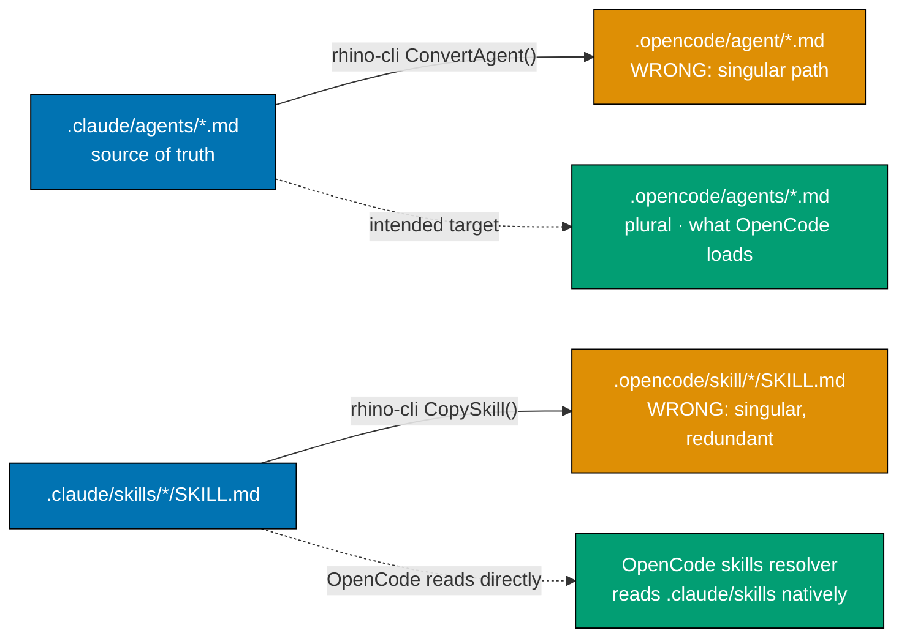

# Validate Claude Code ↔ OpenCode Sync Correctness

## Overview

The repository maintains dual-mode AI agent and skill configuration:
`.claude/` is the source of truth, and `.opencode/` is auto-generated by
`rhino-cli agents sync` (`npm run sync:claude-to-opencode`). This plan audits the
sync infrastructure end-to-end against the **current** Claude Code and OpenCode
canonical specifications, fixes correctness gaps, hardens validators against
spec drift, and produces a regression test matrix that future agent/skill spec
changes will exercise.

It is a **prerequisite** for
[`2026-04-30__adopt-opencode-go/`](../2026-04-30__adopt-opencode-go/README.md) —
that plan rests on the assumption that `npm run sync:claude-to-opencode` writes
files OpenCode actually loads, and that `npm run validate:sync` reflects truth.
Audit findings below show that assumption does not hold today.

## Why This Plan Exists

Web research against [opencode.ai/docs/agents](https://opencode.ai/docs/agents/),
[opencode.ai/docs/skills](https://opencode.ai/docs/skills/), and
[opencode.ai/docs/config](https://opencode.ai/docs/config/) (accessed
2026-05-02), cross-referenced with
[code.claude.com/docs/en/sub-agents](https://code.claude.com/docs/en/sub-agents)
and [code.claude.com/docs/en/skills](https://code.claude.com/docs/en/skills),
revealed that the current sync writes to non-canonical paths and emits a
deprecated frontmatter shape. The opencode-go migration plan would hard-code
those broken assumptions deeper into `ConvertModel()` if shipped first.

## Scope (ose-public single-repo, parent-rooted edits OK; `apps/rhino-cli` worktree recommended)

| Area | Concern |
| ---- | ------- |
| `apps/rhino-cli/internal/agents/converter.go` | Output directory path; field handling (`color`, `mode`, `permission`) |
| `apps/rhino-cli/internal/agents/copier.go` | Output directory path; remove-or-document redundancy with `.claude/skills/` native read |
| `apps/rhino-cli/internal/agents/sync_validator.go` | Validates against wrong target dir today; tools-shape semantics |
| `apps/rhino-cli/internal/agents/agent_validator.go` | `ValidColors`, `ValidTools`, `ValidModels`, `RequiredFieldOrder` lag spec |
| `apps/rhino-cli/internal/agents/skill_validator.go` | Missing recognition of Claude Code skill fields (`disable-model-invocation`, `allowed-tools`, `when_to_use`, etc.) |
| `apps/rhino-cli/internal/agents/types.go` | Inconsistency between `ClaudeAgent.Tools []string` and `ClaudeAgentFull.Tools string` |
| `apps/rhino-cli/cmd/agents_sync.go` | Help text describes wrong skill-output naming (`SKILL.md → {skill-name}.md` is false) |
| `.opencode/agent/`, `.opencode/agents/`, `.opencode/skill/`, `.opencode/skills/` | Dual-population on disk; need single canonical target after fix |
| `.opencode/opencode.json` | `permission`/`mcp` shape audited but not modified for opencode-go content (out of scope) |
| Tests across `apps/rhino-cli/internal/agents/*_test.go` and `apps/rhino-cli/cmd/*_test.go` | Spec-fidelity test matrix added |

**Out of scope**:

- Changing the model the sync emits (that is the
  [opencode-go plan](../2026-04-30__adopt-opencode-go/README.md))
- Migrating `tools:` deprecated map → `permission:` block (separate plan; this
  plan documents and decides the policy, defers implementation)
- Editing `.claude/agents/` or `.claude/skills/` content (source of truth — only
  validated, not modified)
- `ose-infra` and `ose-primer` — out of scope; those repos do not use this sync

## Audit Findings (Summary)

Detailed in [tech-docs.md](./tech-docs.md). Severity uses repository's
`repo-assessing-criticality-confidence` scale.

| ID | Severity | Finding |
| -- | -------- | ------- |
| F1 | CRITICAL | Sync writes agents to `.opencode/agent/` (singular). OpenCode docs canonical path is `.opencode/agents/` (plural). Synced agents are likely invisible to OpenCode. |
| F2 | HIGH | Sync writes skills to `.opencode/skill/` (singular). OpenCode reads `.opencode/skills/` (plural) and **also reads `.claude/skills/` directly**, so skill copy is non-canonical AND redundant. |
| F3 | HIGH | Both singular and plural directories exist on disk and in git, populated by different tools (rhino-cli vs Nx generator). Confusing state, drift surface. |
| F4 | MEDIUM | OpenCode `tools:` boolean map is deprecated in favor of agent-level `permission:` block. Sync emits deprecated shape; needs explicit policy. |
| F5 | MEDIUM | `mode` field never emitted; OpenCode default `all` may not match agent intent (some Claude agents are clearly `subagent`-only). |
| F6 | MEDIUM | `color` field stripped on conversion. OpenCode supports `color` (theme tokens or hex). Loss of UX information. |
| F7 | MEDIUM | `ValidColors` set lags spec: missing `red`, `orange`, `pink`, `cyan`. Validator hard-fails on spec-valid colors. |
| F8 | MEDIUM | `ValidTools` set lags spec: missing `Agent` (renamed from `Task`) and other current Claude Code tools. |
| F9 | MEDIUM | `ValidModels` rejects `inherit` and full model IDs (`claude-opus-4-7`) which Claude Code accepts. |
| F10 | MEDIUM | `RequiredFieldOrder` validator hard-rejects all extra Claude Code fields (`disallowedTools`, `permissionMode`, `maxTurns`, `effort`, `memory`, `isolation`, `background`, `initialPrompt`, `mcpServers`, `hooks`). |
| F11 | MEDIUM | `skill_validator.go` does not recognize Claude Code skill fields (`disable-model-invocation`, `allowed-tools`, `when_to_use`, `argument-hint`, `arguments`, `user-invocable`, `model`, `effort`, `context`, `agent`, `hooks`, `paths`, `shell`). |
| F12 | LOW | `agents_sync.go` long-help says "SKILL.md → {skill-name}.md conversion" — implementation does not rename. Doc-code drift. |
| F13 | LOW | `types.go` has inconsistent shapes for "Claude tools": `ClaudeAgent.Tools []string` vs `ClaudeAgentFull.Tools string`. |
| F14 | LOW | `validateSkillIdentity` enforces byte-equal between `.claude/skills/<n>/SKILL.md` and `.opencode/skill/<n>/SKILL.md`. Per OpenCode skills docs, the copy is unnecessary; check is enforcing redundancy. |

## Document Navigation

| Document | Purpose |
| -------- | ------- |
| [README.md](./README.md) | This file — overview, scope, navigation, finding summary |
| [brd.md](./brd.md) | Business rationale — why correct sync now blocks opencode-go |
| [prd.md](./prd.md) | Product requirements + Gherkin acceptance criteria per finding |
| [tech-docs.md](./tech-docs.md) | Technical design — exact code changes, validator strengthening, test matrix |
| [delivery.md](./delivery.md) | Step-by-step delivery checklist with quality gates |

## Relationship to Other Plans

- **Blocks**: [`2026-04-30__adopt-opencode-go/`](../2026-04-30__adopt-opencode-go/README.md).
  That plan modifies `ConvertModel()` and regenerates `.opencode/agent/*.md`.
  If the directory bug is not fixed first, opencode-go will publish to
  unread paths and the migration will silently no-op in OpenCode sessions.
- **Independent of**: [`2026-04-25__organiclever-web-app/`](../2026-04-25__organiclever-web-app/README.md)
  and [`2026-04-28__organiclever-web-event-mechanism/`](../2026-04-28__organiclever-web-event-mechanism/README.md)
  — those plans touch app code, not sync tooling.

## Success Criteria (Summary)

1. `npm run sync:claude-to-opencode` writes agent files to `.opencode/agents/`
   (plural) — the documented OpenCode path.
2. Skill output policy decided and enforced (either: stop syncing skills since
   `.claude/skills/` is read natively, OR sync to `.opencode/skills/` plural —
   not both, not singular).
3. Singular directories `.opencode/agent/` and `.opencode/skill/` removed from
   the repo and from git, with a single tracked canonical source.
4. `npm run validate:sync` validates against the chosen canonical target and
   passes against the current `.claude/` content with **zero drift**.
5. `npm run validate:claude` accepts every spec-valid Claude Code field
   (no false-positive rejections of `red`/`orange`/`pink`/`cyan` colors,
   `inherit` model, additional documented fields).
6. `apps/rhino-cli/internal/agents/converter.go` has a documented policy for
   each Claude Code agent frontmatter field: "preserve", "translate", "drop",
   "warn", or "deferred-to-later-plan".
7. New test matrix in `converter_test.go` and `sync_validator_test.go`
   exercises every documented Claude Code agent and skill field, with golden
   fixtures verified against the OpenCode JSON schema (`https://opencode.ai/config.json`).
8. `nx run rhino-cli:test:unit` and `:test:integration` pass at ≥90% coverage.
9. CLAUDE.md and `.claude/agents/README.md` updated to reflect canonical paths,
   so future agent additions don't reintroduce the bug.

## Verification Sources

All findings traced to live documentation as of 2026-05-02:

- [OpenCode Agents](https://opencode.ai/docs/agents/) — agent dir is `.opencode/agents/`; `tools` deprecated; `permission` is modern shape.
- [OpenCode Skills](https://opencode.ai/docs/skills/) — skill dir is `.opencode/skills/`; `.claude/skills/` is natively read.
- [OpenCode Config](https://opencode.ai/docs/config/) — `agent` (singular) is the per-agent override key in `opencode.json`; `permission` is top-level singular; `model`/`small_model` formats.
- [Claude Code subagents](https://code.claude.com/docs/en/sub-agents) — full frontmatter field list including `disallowedTools`, `permissionMode`, `maxTurns`, `effort`, `memory`, `isolation`, `background`, `initialPrompt`, `mcpServers`, `hooks`, `color` (8 values incl. red/orange/pink/cyan).
- [Claude Code skills](https://code.claude.com/docs/en/skills) — full skill frontmatter including `when_to_use`, `argument-hint`, `arguments`, `disable-model-invocation`, `user-invocable`, `allowed-tools`, `model`, `effort`, `context`, `agent`, `hooks`, `paths`, `shell`.
