# Technical Documentation — Cross-Vendor Agent Parity

## Architecture

### Current State

`governance/` may contain vendor-specific content in load-bearing prose. AGENTS.md and CLAUDE.md are currently excluded from the vendor-independence convention even though AGENTS.md is the highest-leverage cross-vendor instruction surface (read natively by OpenCode, Codex CLI, Aider). The binding-sync layer has no automated count-parity / color-map / tier-map check — `.claude/agents/*.md` and `.opencode/agents/*.md` already differ (70 vs 71 as of 2026-05-03; `.opencode` has one orphan `ci-monitor-subagent.md` not present in `.claude`).

| File / Surface                                                                                                                   | Issue                                                                                                                                                                                                                      | Target                                                                                                                                                                              |
| -------------------------------------------------------------------------------------------------------------------------------- | -------------------------------------------------------------------------------------------------------------------------------------------------------------------------------------------------------------------------- | ----------------------------------------------------------------------------------------------------------------------------------------------------------------------------------- |
| `governance/development/agents/model-selection.md`                                                                               | Concrete model names, benchmark citations                                                                                                                                                                                  | Rewrite using capability tiers; link to docs/reference/                                                                                                                             |
| `governance/development/agents/ai-agents.md`                                                                                     | Vendor-specific examples (color translation map, OpenCode 1.14.31+ note — this note describes current state of the file and will be replaced with "current OpenCode" per delivery step, etc.) likely in load-bearing prose | Wrap vendor specifics in `binding-example` fences; neutralize surrounding prose                                                                                                     |
| `governance/README.md`                                                                                                           | Layer 4 references `.claude/agents/`; missing vendor-specific content test                                                                                                                                                 | Replace with "platform binding agents"; add layer-test entry                                                                                                                        |
| `governance/repository-governance-architecture.md`                                                                               | Skills delivery role clarification                                                                                                                                                                                         | Clarify Skills are delivery infra                                                                                                                                                   |
| `governance/principles/`                                                                                                         | Any model-name citations                                                                                                                                                                                                   | Rewrite using tier language                                                                                                                                                         |
| `governance/conventions/structure/governance-vendor-independence.md`                                                             | Currently excludes AGENTS.md / CLAUDE.md from scope                                                                                                                                                                        | Amend Scope section + Exceptions list to include both; preserve `plans/` exclusion                                                                                                  |
| `AGENTS.md` (repo root)                                                                                                          | Currently out of scope; contains vendor-specific terms (`.claude/`, "Claude Code", model IDs)                                                                                                                              | Apply vocabulary map; wrap vendor specifics in `binding-example` fences                                                                                                             |
| `CLAUDE.md` (repo root)                                                                                                          | Currently out of scope; should remain a thin shim importing AGENTS.md                                                                                                                                                      | Verify it remains a shim; if it duplicates load-bearing AGENTS.md content, consolidate; allow Claude-specific content under "Platform Binding Examples" or `binding-example` fences |
| `.claude/agents/*.md` ↔ `.opencode/agents/*.md` count drift (70 vs 71 observed; `.opencode` has orphan `ci-monitor-subagent.md`) | No automated parity check                                                                                                                                                                                                  | Investigate orphan, then run `npm run sync:claude-to-opencode` and verify counts equalize                                                                                           |
| Color-translation map in `ai-agents.md`                                                                                          | No automated coverage check vs `.claude/agents/*.md` frontmatter colors                                                                                                                                                    | Cross-check; missing entries become findings                                                                                                                                        |
| Capability-tier map in `model-selection.md`                                                                                      | No automated coverage check vs `.claude/` and `.opencode/` agent frontmatter tiers                                                                                                                                         | Cross-check; missing entries become findings                                                                                                                                        |
| `docs/reference/platform-bindings.md` (Aider entry)                                                                              | Lists Aider as native AGENTS.md reader; Aider's own docs (<https://aider.chat/docs/usage/conventions.html>) only document `CONVENTIONS.md`                                                                                 | Correct Aider entry to reflect CONVENTIONS.md as documented file; AGENTS.md support is claimed by agents.md standard site but not by Aider                                          |

### Target State

```
governance/                          # Vendor-neutral prose
├── conventions/structure/
│   └── governance-vendor-independence.md   # Amended: AGENTS.md + CLAUDE.md now in-scope
├── development/agents/
│   ├── model-selection.md                  # Capability tiers; tier map covers every used tier
│   ├── ai-agents.md                        # binding-example fences for color map + version notes
│   └── ...
└── README.md                                # Layer 4 → "platform binding agents"; layer-test includes vendor-specific content test

docs/reference/                      # Vendor-specific technical specs
└── ai-model-benchmarks.md          # Canonical benchmark source

AGENTS.md                            # Vendor-neutral prose; vendor specifics inside fences
CLAUDE.md                            # Thin Claude-Code shim; @AGENTS.md import preserved
                                     # (Claude-specific content allowed under fences/headings since CLAUDE.md is itself a binding shim)

.claude/agents/*.md == .opencode/agents/*.md  (count parity)
```

### Phase-Ordering Decision Flow

The plan has a non-trivial conditional phase structure with a named blocking dependency. The diagram below shows the execution flow and decision branches.

```mermaid
%% Color Palette: Blue #0173B2, Orange #DE8F05, Teal #029E73, Gray #808080, Purple #CC78BC
%% All colors are color-blind friendly and meet WCAG AA contrast standards

flowchart LR
    P0["Phase 0\nRe-Baseline\n#40;run vendor-audit#41;"]:::blue
    DEC{"0 violations?"}:::orange
    P1V["Phases 1-3\nVerify Only\n#40;no remediation#41;"]:::gray
    P13["Phases 1-3\nFull Remediation\n#40;rewrite governance#41;"]:::teal
    PX["Phase X\nConvention Amendment\n#40;BLOCKING for Phase 4#41;"]:::orange
    P4["Phase 4\nAGENTS.md / CLAUDE.md\nNeutrality Audit"]:::blue
    P5["Phase 5\nBehavioral-Parity\nInvariants"]:::teal
    P6["Phase 6\nOperationalize Parity\n#40;agents + workflow + Nx + hook#41;"]:::purple
    P7["Phase 7\nFinal Validation\n+ Archive"]:::blue

    P0 --> DEC
    DEC -->|"Yes — already clean"| P1V
    DEC -->|"No — violations found"| P13
    P1V --> PX
    P13 --> PX
    PX -->|"Committed"| P4
    P4 --> P5
    P5 --> P6
    P6 --> P7

    classDef blue fill:#0173B2,stroke:#000000,color:#FFFFFF,stroke-width:2px
    classDef orange fill:#DE8F05,stroke:#000000,color:#FFFFFF,stroke-width:2px
    classDef teal fill:#029E73,stroke:#000000,color:#FFFFFF,stroke-width:2px
    classDef gray fill:#808080,stroke:#000000,color:#FFFFFF,stroke-width:2px
    classDef purple fill:#CC78BC,stroke:#000000,color:#FFFFFF,stroke-width:2px
```



**Key constraints**:

- Phase X must be **committed** (not just started) before Phase 4 begins — Phase X amends the convention that Phase 4 enforces
- Phase 0 determines whether Phases 1-3 collapse to verify-only or require full remediation
- Phases 5, 6, and 7 always run regardless of the Phase 0 outcome

### Migration Strategy

**Benchmark data** (model scores, pricing, capability summaries):

- **Current**: Scattered in governance files referencing model tiers
- **Target**: `docs/reference/ai-model-benchmarks.md` (already exists, expand)
- **Diátaxis category**: Reference — technical specs users look up

**Governance / AGENTS.md / CLAUDE.md rewrites** per vocabulary map:

| Vendor-specific term        | Neutral replacement                                                                |
| --------------------------- | ---------------------------------------------------------------------------------- |
| "Claude Code"               | "the coding agent" (load-bearing prose); preserved inside `binding-example` fences |
| "Sonnet" / "Opus" / "Haiku" | capability tier (planning-grade, execution-grade, fast)                            |
| `.claude/agents/`           | "the agent definition file" or `<platform-binding>/agents/`                        |
| "Anthropic"                 | drop or "model vendor"                                                             |

(Full map lives in `governance/conventions/structure/governance-vendor-independence.md` Vocabulary Map table; this plan executes against that map.)

**CLAUDE.md special-case treatment**: CLAUDE.md is a Claude-Code-specific shim by design. It MAY contain vendor terms but only inside `binding-example` fences or under a "Platform Binding Examples" heading after the convention amendment. The single `@AGENTS.md` import line counts as an inline binding directive and is allowed.

## File Impact

### Files to Modify

**Phase 1-3 (governance prose, conditional on Phase 0 baseline)**:

- `governance/development/agents/model-selection.md` — Remove benchmark prose, use capability tiers; ensure tier map covers every tier used in `.claude/` and `.opencode/` agent frontmatter
- `governance/development/agents/ai-agents.md` — Explicit modify target; wrap vendor-specific examples (color translation map entries, OpenCode 1.14.31+ note — this note describes the current state of the file and will be replaced with "current OpenCode" per delivery step) in `binding-example` fences; neutralize surrounding prose; ensure color-translation map covers every named color used in `.claude/agents/*.md` frontmatter
- `governance/README.md` — Update Layer 4 description, replace vendor paths, add vendor-specific content test to layer-test guidance
- `governance/repository-governance-architecture.md` — Clarify Skills delivery role
- `governance/principles/**/*.md` — Audit and rewrite any model-name citations

**Phase X (convention amendment, blocking for Phase 4)**:

- `governance/conventions/structure/governance-vendor-independence.md` — Amend Scope section to include AGENTS.md and CLAUDE.md; remove them from the Exceptions list; preserve `plans/` exclusion; add a note explaining that CLAUDE.md is a Claude-Code-specific shim where vendor terms are allowed inside fences and Platform Binding Examples sections

**Phase 4 (newly in scope)**:

- `AGENTS.md` (repo root) — Apply vocabulary map; wrap any remaining vendor-specific examples in `binding-example` fences
- `CLAUDE.md` (repo root) — Verify single-line `@AGENTS.md` import is preserved; consolidate any duplicated load-bearing content; ensure all Claude-Code-specific content sits inside fences or under "Platform Binding Examples" headings

**Phase 5 (behavioral-parity invariants — verification, not modification)**:

- `.claude/agents/*.md` and `.opencode/agents/*.md` — read-only inspection of frontmatter for color and tier values; count comparison; sync drift fix only (re-run `npm run sync:claude-to-opencode` + commit if drift exists)

### Files to Create/Expand

- `docs/reference/ai-model-benchmarks.md` — Ensure comprehensive benchmark coverage for every model referenced in `governance/`, AGENTS.md, and CLAUDE.md
- `governance/README.md` — Add vendor-specific content test to layer-test guidance
- `.claude/agents/repo-parity-checker.md` — **NEW** (Phase 6.1) — green checker agent invoking existing tools to validate parity invariants
- `.claude/agents/repo-parity-fixer.md` — **NEW** (Phase 6.1) — yellow fixer agent for limited auto-remediation (sync drift only)
- `.opencode/agents/repo-parity-checker.md` — auto-generated by `npm run sync:claude-to-opencode`
- `.opencode/agents/repo-parity-fixer.md` — auto-generated by sync
- `governance/workflows/repo/repo-cross-vendor-parity-quality-gate.md` — **NEW** (Phase 6.3) — iterative check-fix-verify orchestration mirroring `plan-quality-gate.md`
- `governance/workflows/README.md` — add catalog entry for the new workflow
- `apps/rhino-cli/project.json` — add `validate:cross-vendor-parity` Nx target (or new `repo-parity` meta-project — pick whichever is more idiomatic)
- `.husky/pre-push` — extend to invoke the new Nx target

## Parity Checker Agent Specification

This section specifies the new agents added in Phase 6. Both follow the [Agent Definition Files](../../../governance/development/agents/ai-agents.md) convention.

### `repo-parity-checker` (green)

| Attribute                      | Value                                                                                                                                                                                                                           |
| ------------------------------ | ------------------------------------------------------------------------------------------------------------------------------------------------------------------------------------------------------------------------------- |
| Color                          | `green` (translates to `success` for OpenCode)                                                                                                                                                                                  |
| Model tier                     | execution-grade (`sonnet` for Claude Code, mapped equivalently for OpenCode)                                                                                                                                                    |
| Tools                          | `Bash, Read, Glob, Grep, WebFetch, Write`                                                                                                                                                                                       |
| Output                         | `generated-reports/parity__<uuid>__<YYYY-MM-DD--HH-MM>__audit.md` (dual-label criticality/confidence per [repo-assessing-criticality-confidence skill](../../../.claude/skills/repo-assessing-criticality-confidence/SKILL.md)) |
| Invokes (no logic duplication) | `rhino-cli governance vendor-audit`, `npm run sync:claude-to-opencode`, `ls`, `grep -h "^color:" .claude/agents/*.md`, `grep -h "^model:" .claude/agents/*.md .opencode/agents/*.md`, WebFetch on Aider docs                    |

**Five invariants checked**:

1. `rhino-cli governance vendor-audit governance/` returns 0 violations
2. `npm run sync:claude-to-opencode` is a no-op (`git diff --quiet` after invocation)
3. `.claude/agents/*.md` count (excluding `README.md`) equals `.opencode/agents/*.md` count
4. Color-translation map in `governance/development/agents/ai-agents.md` covers every named color used in `.claude/agents/*.md` frontmatter
5. Capability-tier map in `governance/development/agents/model-selection.md` covers every model tier referenced in `.claude/` and `.opencode/` agent frontmatter
6. Aider entry in `docs/reference/platform-bindings.md` matches Aider's own documentation at <https://aider.chat/docs/usage/conventions.html> (WebFetch — flag drift)

Each finding labeled with criticality (CRITICAL/HIGH/MEDIUM/LOW) and confidence (HIGH/MEDIUM/FALSE_POSITIVE).

### `repo-parity-fixer` (yellow)

| Attribute          | Value                                                                                                                             |
| ------------------ | --------------------------------------------------------------------------------------------------------------------------------- |
| Color              | `yellow` (translates to `warning` for OpenCode)                                                                                   |
| Model tier         | execution-grade                                                                                                                   |
| Tools              | `Bash, Read, Edit, Glob, Grep, Write`                                                                                             |
| Auto-fixable scope | Only sync drift — re-runs `npm run sync:claude-to-opencode` and stages the result                                                 |
| Flagged-only scope | Color-map gaps, tier-map gaps, orphan agents, Aider entry drift — fixer reports findings; human edits the maps or removes orphans |

Fixer re-validates each finding against the current tree before applying (per [maker-checker-fixer pattern](../../../.claude/skills/repo-applying-maker-checker-fixer/SKILL.md)). FALSE_POSITIVE detection skips findings that no longer reproduce.

### Nx target `validate:cross-vendor-parity`

The target invokes the same shell commands the checker uses, **not** the agent itself (Nx targets shouldn't spawn AI agents — they should be deterministic shell programs). The agent is for ad-hoc human-driven audits and dual-label reports; the Nx target is the CI gate.

```bash
# Pseudocode for the target
nx run rhino-cli:validate:cross-vendor-parity:
  ./apps/rhino-cli/dist/rhino-cli governance vendor-audit governance/ || exit 1
  npm run sync:claude-to-opencode
  git diff --quiet || { echo "sync drift"; exit 1; }
  CL=$(ls .claude/agents/*.md | grep -v README | wc -l)
  OP=$(ls .opencode/agents/*.md | grep -v README | wc -l)
  [ "$CL" = "$OP" ] || { echo "count mismatch: $CL vs $OP"; exit 1; }
  # color and tier coverage checks via grep + diff
```

The target is wired into `.husky/pre-push` and runs on every push touching governance, agents, or platform-bindings files.

### Workflow `repo-cross-vendor-parity-quality-gate`

The workflow at `governance/workflows/repo/repo-cross-vendor-parity-quality-gate.md` orchestrates the iterative check-fix-verify pattern across the two new agents. Mirrors the structure of `governance/workflows/plan/plan-quality-gate.md`:

| Aspect                 | Value                                                                                                                                                                            |
| ---------------------- | -------------------------------------------------------------------------------------------------------------------------------------------------------------------------------- |
| Path                   | `governance/workflows/repo/repo-cross-vendor-parity-quality-gate.md`                                                                                                             |
| Naming                 | Per [Workflow Naming Convention](../../../governance/conventions/structure/workflow-naming.md) — `<scope>(-<qualifier>)*-<type>` → `repo-cross-vendor-parity-quality-gate`       |
| Inputs                 | `scope` (which invariants), `mode` (lax/normal/strict/ocd), `min-iterations`, `max-iterations` (default 7), `max-concurrency` (default 2)                                        |
| Outputs                | `final-status` ∈ {pass, partial, fail}, `iterations-completed`, `final-report` (`generated-reports/parity__*__audit.md`)                                                         |
| Termination            | Zero findings on **two consecutive** validations (consecutive-pass requirement, same as plan-quality-gate)                                                                       |
| Invokes                | `repo-parity-checker` (Step 1, Step 4) and `repo-parity-fixer` (Step 3, conditional on findings)                                                                                 |
| Convergence safeguards | False-positive skip list (`.known-false-positives.md`), scoped re-validation on iter 2+, escalation warning at iteration 5                                                       |
| Limited fixer scope    | Only sync drift is auto-fixable; map gaps, orphans, and Aider drift require human resolution — workflow surfaces these as `partial` status when they remain after max-iterations |

The workflow is the orchestration layer; the agents are the workers; the Nx target is the CI gate. Three layers, distinct roles, no logic duplication.

## Behavioral-Parity Verification Commands

These commands implement Phase 5 invariants. They are inspection-only (no writes besides `sync:claude-to-opencode` if drift is found).

```bash
# 1. Sync layer must be a no-op on a freshly-synced tree
npm run sync:claude-to-opencode
git status                                                   # Must show no modified files; if any, commit drift then re-run

# 2. Agent count parity (currently 70 vs 71 — .opencode has orphan ci-monitor-subagent.md)
ls .claude/agents/*.md | wc -l
ls .opencode/agents/*.md | wc -l                             # Counts must match after resolution

# 3. Diff which agents are missing on either side (helps debug count drift)
diff <(ls .claude/agents/ | sort) <(ls .opencode/agents/ | sort)

# 4. Extract every named color used in .claude/agents/*.md frontmatter
grep -h "^color:" .claude/agents/*.md | sort -u

# 5. Extract every model tier used in agent frontmatter (both bindings)
grep -h "^model:" .claude/agents/*.md .opencode/agents/*.md | sort -u

# 6. Cross-check #4 against the color-translation map in ai-agents.md
grep -A2 "Dual-Mode Color Translation" governance/development/agents/ai-agents.md

# 7. Cross-check #5 against the capability-tier map in model-selection.md
grep -A2 "capability tier" governance/development/agents/model-selection.md

# 8. Final audit (after all remediation)
go run apps/rhino-cli/main.go governance vendor-audit governance/
go run apps/rhino-cli/main.go governance vendor-audit AGENTS.md CLAUDE.md   # After convention amendment
```

If `rhino-cli governance vendor-audit` does not yet accept arbitrary file targets (only `governance/` directory by default), Phase 4 prep includes either extending the CLI to accept file paths OR running an equivalent grep against AGENTS.md / CLAUDE.md using the combined audit regex from the convention.

## External Standards Verification (web research 2026-05-03)

Verified via `web-research-maker` against current public docs. Findings inform plan scope and surface a factual-accuracy correction for `docs/reference/platform-bindings.md`.

| Claim                                                                                        | Status                                                                                                                                                                                   | Source                                                                                                                                                                                       |
| -------------------------------------------------------------------------------------------- | ---------------------------------------------------------------------------------------------------------------------------------------------------------------------------------------- | -------------------------------------------------------------------------------------------------------------------------------------------------------------------------------------------- |
| AGENTS.md is a Linux Foundation / Agentic AI Foundation standard                             | Verified                                                                                                                                                                                 | <https://www.linuxfoundation.org/press/linux-foundation-announces-the-formation-of-the-agentic-ai-foundation> (announced 2025-12-09)                                                         |
| OpenCode reads AGENTS.md natively                                                            | Verified                                                                                                                                                                                 | <https://opencode.ai/docs/rules/>                                                                                                                                                            |
| OpenCode reads `.claude/skills/<name>/SKILL.md` natively (one of multiple paths)             | Verified                                                                                                                                                                                 | <https://opencode.ai/docs/skills/> (also reads `.opencode/skills/`, `.agents/skills/`)                                                                                                       |
| OpenAI Codex CLI reads AGENTS.md natively                                                    | Verified                                                                                                                                                                                 | <https://developers.openai.com/codex/guides/agents-md>                                                                                                                                       |
| Aider reads AGENTS.md natively                                                               | **Error**                                                                                                                                                                                | Aider's own docs (<https://aider.chat/docs/usage/conventions.html>) only document `CONVENTIONS.md`. agents.md self-reported list claims Aider; Aider's own docs do not.                      |
| OpenCode rejects named CSS colors; only hex or theme tokens valid                            | Unverified — docs enumerate supported values (hex, theme tokens) without explicitly stating rejection of named colors; recommend testing by running sync and observing OpenCode behavior | <https://opencode.ai/docs/agents/> (`primary`, `secondary`, `accent`, `success`, `warning`, `error`, `info`) — docs list what IS valid but do not explicitly state named colors are rejected |
| OpenCode 1.14.31 specifically introduced color rejection                                     | Unverifiable                                                                                                                                                                             | No public changelog entry pinning the cutoff to 1.14.31. Plan substitutes "current OpenCode".                                                                                                |
| "planning-grade / execution-grade / fast" is community-recognized capability-tier vocabulary | Internal coinage                                                                                                                                                                         | No external usage found. Plan adds a one-line note to `model-selection.md` clarifying this is repo-internal vocabulary.                                                                      |

**Plan adjustments driven by these findings**:

- Aider entry in `docs/reference/platform-bindings.md` and `AGENTS.md` (Platform Bindings section) now in scope (Phase 4 sub-task) — fix the documented-file claim
- "OpenCode 1.14.31+" wording in `governance/development/agents/ai-agents.md` to be replaced with "current OpenCode"
- Capability-tier internal-coinage note added to `governance/development/agents/model-selection.md`

## Dependencies

- `rhino-cli governance vendor-audit` — Validation tool for governance/, AGENTS.md, CLAUDE.md (post-amendment)
- `npm run sync:claude-to-opencode` — Binding-sync command
- `docs/reference/ai-model-benchmarks.md` — Must be comprehensive before governance / AGENTS.md links to it
- `governance/conventions/structure/governance-vendor-independence.md` — Amended in Phase X; blocks Phase 4

## Rollback

If issues arise:

1. **Governance prose** — `git revert` the governance file changes; benchmark data remains in `docs/reference/` (safe, reference material)
2. **Convention amendment** — `git revert` the convention amendment; AGENTS.md / CLAUDE.md fall back to out-of-scope
3. **AGENTS.md / CLAUDE.md** — `git revert`; agents at session boot re-read previous content
4. **Binding-sync drift fix** — `npm run sync:claude-to-opencode` is idempotent; re-running re-stabilizes the tree
5. Re-run audit to confirm restoration
