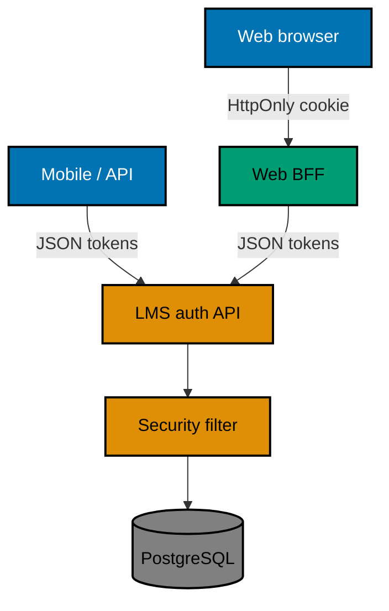
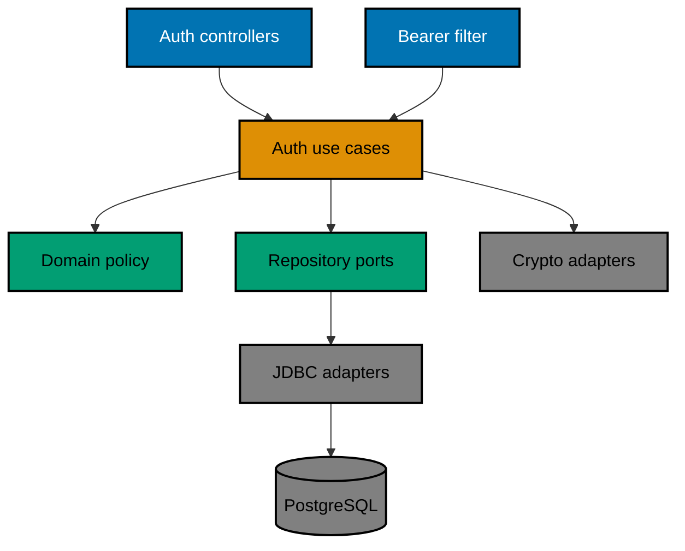
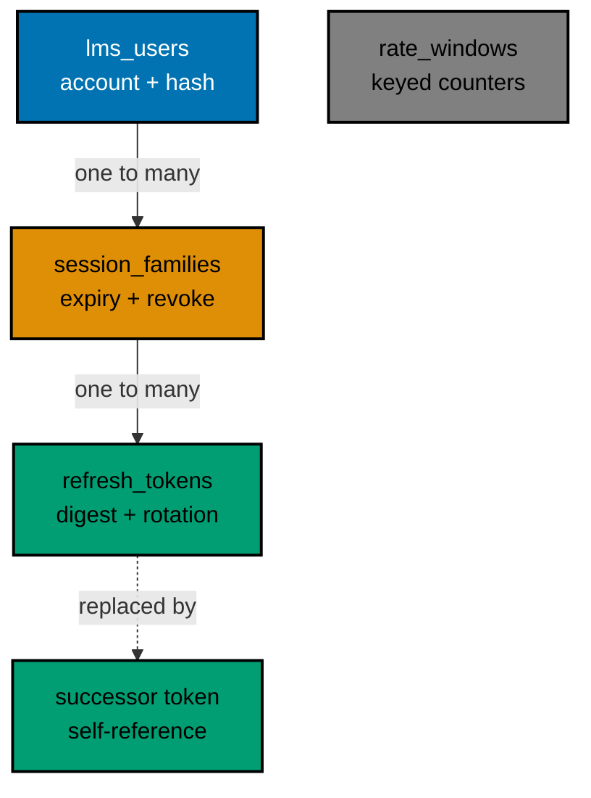

# Technical Design — LMS Authentication

This document targets an engineer new to this repository and to the service. It defines the design
decisions needed to execute [`delivery.md`](./delivery.md) without choosing new API, security,
persistence, testing, or rollout behavior.

## 1. Current State

`apps/ose-lms-be` is a Java 25 and Spring Boot 4.1.1 REST application with contract-generated models,
Cucumber-JVM Unit scenarios, a 99% authored-line threshold, and Playwright-BDD E2E against a built
JAR [Repo-grounded: `apps/ose-lms-be/build.gradle.kts`; `apps/ose-lms-be/project.json`;
`apps/ose-lms-be-e2e/project.json`]. It exposes health, Actuator health, and an unprotected hello
route. It owns no database, security filter chain, or Integration adapter [Repo-grounded:
`specs/apps/ose/lms-be/architecture.md`; `apps/ose-lms-be/behaviour-coverage.json`].

OpenAPI under `specs/apps/ose/lms-be/contracts/` is bundled before models-only Java generation;
controllers remain handwritten [Repo-grounded: `apps/ose-lms-be/project.json`]. This plan preserves
that boundary.

## 2. Target Architecture



The BFF is an integration boundary, not a new project in this plan. `ose-lms-be` returns the same
JSON contract to every trusted caller and does not set a cookie or enable browser CORS.

Inside the service, use package-by-feature under `com.oseplatform.lms.auth`. Domain/application
services depend on small ports for users, session families, refresh tokens, throttles, password
hashing, token issuance, time, and randomness. Spring Security, Spring Data JDBC, PostgreSQL,
Argon2, and Nimbus are adapters. Constructor injection is mandatory; domain behavior must remain
testable without Spring, a database, the clock, randomness, or the network. [Repo-grounded:
`docs/explanation/software-engineering/programming-languages/java/README.md`]



## 3. HTTP and Token Design

The exact public operations and payloads are defined in [`prd.md`](./prd.md). OpenAPI adds an HTTP
Bearer security scheme to `/api/v1/hello` and leaves auth/health operations anonymous. All
application and security failures use RFC 9457 `application/problem+json`; malformed JSON and field
validation return `400`, duplicate canonical username returns `409`, authentication failures return
`401`, and exhausted limits return `429` with integer `Retry-After` seconds.

Access tokens:

- HS256 only; reject every unconfigured algorithm before accepting claims.
- Required claims: issuer `ose-lms-be`, audience `ose-lms-api`, subject user UUID, canonical
  `username`, session-family ID `sid`, unique `jti`, `iat`, `nbf`, and `exp`.
- Default lifetime 900 seconds and configurable clock skew of 30 seconds.
- Every protected request validates signature/claims and loads the active, unexpired `sid`. This is
  intentionally one database lookup per request so logout and replay revocation are immediate.

Refresh tokens are 32 cryptographically random bytes encoded Base64url without padding. Persist only
their SHA-256 digest. A refresh transaction locks the current token/family, verifies it is current
and unexpired, marks it consumed, inserts its successor, and commits before returning. A consumed
token presented again revokes the entire family. The family expires 2,592,000 seconds after login;
rotation returns the remaining duration and never moves that absolute deadline.

Spring Security documents adaptive one-way password storage through `PasswordEncoder`, and OWASP
recommends Argon2id for new password stores with a baseline of 19 MiB memory, 2 iterations, and
parallelism 1 [Web-cited, accessed 2026-09-14:
<https://docs.spring.io/spring-security/reference/7.0/features/authentication/password-storage.html>;
<https://cheatsheetseries.owasp.org/cheatsheets/Password_Storage_Cheat_Sheet.html>]. Store hashes
with the `{argon2}` identifier so parameters/algorithm can be upgraded. For an unknown username,
verify the submitted password against one fixed valid dummy hash before returning the same
`invalid_credentials` problem used for a wrong password.

## 4. Persistence and Migrations

Use Spring Data JDBC rather than JPA: the model is a small set of explicit transactional records,
and refresh rotation needs deliberate row-lock/update semantics rather than an object graph.
[Judgment call] Use PostgreSQL in development, Integration, E2E, and deployment; H2 is excluded
because its locking, unique constraints, timestamp behavior, and SQL dialect would not prove the
production boundary.

Add an additive, forward-only Flyway V1 migration using only Apache-2.0 `org.flywaydb:flyway-core`
and `org.flywaydb:flyway-database-postgresql`. Flyway's upstream repository publishes an
Apache-2.0 license [Web-cited, accessed 2026-09-14:
<https://github.com/flyway/flyway/blob/main/LICENSE.txt>]. Do not introduce `com.redgate` artifacts.

### Tables

Every table ends with the six repository audit columns in this exact order: `created_at
TIMESTAMPTZ NOT NULL DEFAULT now()`, `created_by VARCHAR(255) NOT NULL DEFAULT 'system'`,
`updated_at TIMESTAMPTZ NOT NULL DEFAULT now()`, `updated_by VARCHAR(255) NOT NULL DEFAULT
'system'`, `deleted_at TIMESTAMPTZ NULL`, `deleted_by VARCHAR(255) NULL` [Repo-grounded:
`repo-governance/development/pattern/database-audit-trail/required-audit-columns.md`]. Normal queries
include `deleted_at IS NULL`; authentication rows are retained and soft-deleted when deletion is
needed.



The ERD abbreviates the mandatory audit columns to remain readable; the following table is the exact
migration contract. Every foreign key uses `ON DELETE RESTRICT`, and production code performs no
hard delete. Defaults use PostgreSQL `gen_random_uuid()` and `now()`.

| Table                     | Exact non-audit columns                                                                                                                                                                                                                                                                                                                                                                                                                                                                                                                         |
| ------------------------- | ----------------------------------------------------------------------------------------------------------------------------------------------------------------------------------------------------------------------------------------------------------------------------------------------------------------------------------------------------------------------------------------------------------------------------------------------------------------------------------------------------------------------------------------------- |
| `lms_users`               | `id UUID PRIMARY KEY DEFAULT gen_random_uuid()`; `username VARCHAR(32) NOT NULL`; `password_hash VARCHAR(255) NOT NULL`. Partial unique index on `username WHERE deleted_at IS NULL`.                                                                                                                                                                                                                                                                                                                                                           |
| `auth_session_families`   | `id UUID PRIMARY KEY DEFAULT gen_random_uuid()`; `user_id UUID NOT NULL REFERENCES lms_users(id) ON DELETE RESTRICT`; `absolute_expires_at TIMESTAMPTZ NOT NULL`; `revoked_at TIMESTAMPTZ NULL`; `revocation_reason VARCHAR(64) NULL`; check that `revoked_at` and `revocation_reason` are both null or both non-null; indexes on `user_id` and active `id`.                                                                                                                                                                                    |
| `auth_refresh_tokens`     | `id UUID PRIMARY KEY DEFAULT gen_random_uuid()`; `session_family_id UUID NOT NULL REFERENCES auth_session_families(id) ON DELETE RESTRICT`; `token_digest CHAR(64) NOT NULL UNIQUE`; `expires_at TIMESTAMPTZ NOT NULL`; `consumed_at TIMESTAMPTZ NULL`; `replaced_by_token_id UUID NULL REFERENCES auth_refresh_tokens(id) ON DELETE RESTRICT`; `revoked_at TIMESTAMPTZ NULL`; check that replacement implies consumption; partial unique index on `session_family_id WHERE consumed_at IS NULL AND revoked_at IS NULL AND deleted_at IS NULL`. |
| `auth_rate_limit_windows` | `id UUID PRIMARY KEY DEFAULT gen_random_uuid()`; `action VARCHAR(32) NOT NULL` checked to `login_failure`, `auth_source`, or `registration_source`; `identity_digest CHAR(64) NOT NULL`; `window_started_at TIMESTAMPTZ NOT NULL`; `window_ends_at TIMESTAMPTZ NOT NULL`; `attempt_count INTEGER NOT NULL DEFAULT 0 CHECK (attempt_count >= 0)`; check `window_ends_at > window_started_at`; partial unique index on `(action, identity_digest, window_started_at) WHERE deleted_at IS NULL`.                                                   |

### Row Lifecycles

- Registration inserts one active `lms_users` row. This plan exposes no user-deletion operation, so
  the row stays active; repository reads still enforce `deleted_at IS NULL`.
- Login inserts one `auth_session_families` row and one current `auth_refresh_tokens` row in one
  transaction. Concurrent logins create separate families without a count or eviction check.
- Refresh locks the family and submitted token, sets `consumed_at`, inserts the successor, and links
  `replaced_by_token_id` atomically. Expired rows remain as replay/audit evidence.
- Replay or logout sets the family `revoked_at`/`revocation_reason` and the current refresh token's
  `revoked_at`. Access validation treats revoked, expired, or soft-deleted family/user rows as invalid.
- A throttle increment upserts one active window row. Expired windows remain audit evidence until a
  separately authorized retention policy exists; this plan does not hard-delete them.

PostgreSQL transactions/row locks enforce concurrent registration and refresh outcomes. Do not use
an in-memory counter: multiple application instances must see the same throttle and replay state.

### Rollback and Recovery

The migration only creates new tables/indexes, so the previous application version can run while
ignoring them. Roll back the JAR/config without dropping tables. If a migration fails before commit,
fix the migration only when it has not succeeded anywhere; after any environment records success,
add a forward-fix migration. Take a database backup before production rollout. Never delete auth
tables as an automated rollback.

Use an **expand → verify → contract** migration lifecycle. This delivery performs the expand step
by creating tables/indexes only, then verifies exact columns, constraints, FKs, row lifecycles,
concurrency, and application restart against a clean and already-migrated PostgreSQL database. The
contract step is explicitly “retain all new structures”: no old column/table is replaced, so there
is nothing safe or necessary to remove in this delivery. No-loss proof consists of a pre-rollout
backup, Flyway checksum/history capture, row-count/digest comparisons before and after application
rollback, and a second forward startup that reads the same synthetic users/families/tokens. Any
future column/table removal needs a separate authorized plan after live compatibility is measured.

Replacing `OSE_LMS_BE_JWT_SECRET` invalidates outstanding access tokens for at most their configured
15-minute default; valid refresh families can mint new tokens after the new process starts. A
multi-key overlap ring is deliberately deferred until independent token validators or zero-login
key rotation is required.

## 5. Configuration

Map these environment variables to validated immutable configuration. Do not commit real values.

| Variable                                                   | Required/default | Validation                            |
| ---------------------------------------------------------- | ---------------- | ------------------------------------- |
| `OSE_LMS_BE_DATABASE_URL`                                  | required         | PostgreSQL JDBC URL                   |
| `OSE_LMS_BE_DATABASE_USERNAME`                             | required         | nonblank                              |
| `OSE_LMS_BE_DATABASE_PASSWORD`                             | required         | nonblank secret                       |
| `OSE_LMS_BE_JWT_SECRET`                                    | required         | Base64; at least 32 decoded bytes     |
| `OSE_LMS_BE_JWT_ISSUER`                                    | `ose-lms-be`     | nonblank                              |
| `OSE_LMS_BE_JWT_AUDIENCE`                                  | `ose-lms-api`    | nonblank                              |
| `OSE_LMS_BE_ACCESS_TOKEN_TTL_SECONDS`                      | `900`            | positive and shorter than refresh TTL |
| `OSE_LMS_BE_REFRESH_TOKEN_TTL_SECONDS`                     | `2592000`        | positive and longer than access TTL   |
| `OSE_LMS_BE_JWT_CLOCK_SKEW_SECONDS`                        | `30`             | zero or positive                      |
| `OSE_LMS_BE_RATE_LIMIT_SECRET`                             | required         | Base64; at least 32 decoded bytes     |
| `OSE_LMS_BE_LOGIN_FAILURE_LIMIT` / `_WINDOW_SECONDS`       | `5` / `900`      | positive                              |
| `OSE_LMS_BE_AUTH_SOURCE_LIMIT` / `_WINDOW_SECONDS`         | `20` / `900`     | positive                              |
| `OSE_LMS_BE_REGISTRATION_SOURCE_LIMIT` / `_WINDOW_SECONDS` | `10` / `3600`    | positive                              |
| `OSE_LMS_BE_TRUSTED_PROXY_CIDRS`                           | empty            | comma-separated valid CIDRs           |

Hash throttle identities with HMAC-SHA-256 and the separate rate-limit secret. For login failures,
hash the canonical username; for source limits, hash the resolved source address. Accept the first
valid forwarded address only when the direct peer is within `OSE_LMS_BE_TRUSTED_PROXY_CIDRS`;
otherwise ignore all forwarded headers.

## 6. Test Architecture

- **Unit:** Cucumber-JVM and focused JUnit run in-process with MockMvc, fake repositories, fixed
  clock/randomness, and fake password/token ports. No real database, environment, filesystem, or
  network. Keep 99% authored-line coverage.
- **Integration:** a dedicated Gradle source set under `tests/integration/` starts PostgreSQL with
  Testcontainers and Spring Boot `@ServiceConnection`, applies real Flyway migrations, and proves
  repositories, locking, restart persistence, constraints, and concurrent races. Spring Boot
  documents this Testcontainers integration [Web-cited, accessed 2026-09-14:
  <https://docs.spring.io/spring-boot/reference/testing/testcontainers.html>]. Add `test:integration`
  runtime and `test:coverage:integration` static coverage; runtime Integration stays outside
  `test:quick`.
- **E2E:** `apps/ose-lms-be-e2e/docker-compose.yml` defines service `postgres` using the repository's
  existing PostgreSQL image convention, database/user `ose_lms_e2e`, host port **5437**, a named
  disposable volume, and a `pg_isready -U ose_lms -d ose_lms_e2e` health check. New
  `scripts/run-e2e.ts` runs `docker compose -p ose-lms-be-e2e-auth up -d --wait postgres`, starts the
  built JAR on port 8403 through the existing Playwright web-server lifecycle, executes the unfiltered
  suite, and always runs `docker compose ... down -v --remove-orphans` in `finally`, preserving the
  test exit code. The `pg` dev dependency powers a Cucumber/Playwright `Before` fixture that truncates
  the four auth tables in FK-safe order before each scenario. All credentials/data are synthetic;
  retries/sleeps, production access, and committed raw tokens are forbidden.

The manual equivalent is copyable and uses the same project name:

```bash
rtk ./hippo run --class service --disk-path . -- docker compose -p ose-lms-be-e2e-auth -f apps/ose-lms-be-e2e/docker-compose.yml up -d --wait postgres
rtk ./hippo run --class transactional --disk-path . -- npm exec nx -- run ose-lms-be-e2e:test:e2e
rtk ./hippo run --class transactional --disk-path . -- docker compose -p ose-lms-be-e2e-auth -f apps/ose-lms-be-e2e/docker-compose.yml down -v --remove-orphans
```

Expected observations: Compose reports `postgres` healthy on `127.0.0.1:5437`; Playwright reports
every scenario passed with zero retries; cleanup removes the container, network, and volume and
`docker compose ... ps -a` lists nothing afterward. Store sanitized transcripts under
`plans/in-progress/lms-user/evidence/phase-7-e2e-{up,test,down}.txt`.

The Integration suite owns a loopback PostgreSQL socket and therefore requires an `ose-lms-be`
entry with a concrete reason in `repo-config.yml` `integration-loopback`. Because `repo-config.yml`
is a repository-rule surface, the delivery checklist includes the complete local rules-propagation
inventory, conflict, placement, enforcement, verification, manifest, and sibling-obligation steps.

## 7. Design Decisions and Alternatives

### D-1 — JWT access plus opaque refresh

**Chosen:** 15-minute HS256 JWT access tokens plus single-use opaque refresh tokens with a 30-day
absolute family expiry. This fits direct API/mobile Bearer use and BFF server-to-server use.

**Rejected — server session cookie:** safer browser defaults, but couples the LMS API to browsers,
requires CSRF handling, and is awkward for mobile/API callers. **Rejected — access JWT only:** less
state, but users must re-enter credentials every 15 minutes and logout cannot revoke a stolen token.

**Prior art:** the older `plans/done/2026-04-22__auth-register-login/` chose HS256 JWT access but no
refresh lifecycle [Repo-grounded]; this plan keeps the interoperable bearer shape while adding the
missing rotation/revocation contract. Spring Security's resource-server documentation provides the
JWT encoder/decoder boundary [Web-cited, accessed 2026-09-14:
<https://docs.spring.io/spring-security/reference/servlet/oauth2/>].

**Revisit when:** independent services must validate access tokens; then move to asymmetric signing
and a public key-distribution contract.

### D-2 — Stateful access revocation

**Chosen:** validate persisted `sid` on every protected request.

**Rejected — fully stateless JWT:** avoids one database read and is viable when revocation can wait
for token expiry, but it cannot satisfy this product's immediate logout/replay-family revocation.
**Rejected — cached revocation/version records:** can reduce database reads and remain viable with a
shared cache, but introduces cache invalidation and another availability dependency before load is
measured. **Rejected — opaque access tokens:** provides server-side revocation by definition, but
gives up self-contained claims needed by standard Bearer/JWT consumers.

**Prior art:** the current repository has no persisted LMS auth/session mechanism [Repo-grounded:
`apps/ose-lms-be/src/main/java`], while the older auth plan used a fully stateless JWT
[Repo-grounded: `plans/done/2026-04-22__auth-register-login/tech-docs.md`]. The selected design is the
smallest change that adds the user-required immediate revocation. OWASP's session guidance requires
server-side invalidation on logout, which the `sid` lookup makes observable for a JWT
[Web-cited, accessed 2026-09-14:
<https://cheatsheetseries.owasp.org/cheatsheets/Session_Management_Cheat_Sheet.html>].

**Revisit when:** measured protected-route database latency or availability makes this read a
bottleneck; adopt a shared cache only with revocation-propagation and fail-closed tests.

**Consequence:** protected availability now depends on PostgreSQL session lookup; database failure
returns an authentication/service failure instead of accepting an unverified session.

### D-3 — Unlimited session families

**Chosen:** every valid login creates an independent session family with no count. This is an
explicit user correction.

**Rejected — cap at three and reject a fourth login:** viable and predictable for security-sensitive
products, but blocks a valid user without an in-scope session-management screen. **Rejected — cap at
three and evict the oldest family:** preserves login success but silently logs out another client and
requires a trustworthy device/session identity. **Rejected — count client-supplied device IDs:**
viable only when clients securely persist IDs, but spoofing/reinstallation semantics are undefined.

**Prior art:** no current LMS API, spec, table, or request model contains a device identity or session
cap [Repo-grounded: `specs/apps/ose/lms-be`; `apps/ose-lms-be`], and the user explicitly withdrew the
proposed three-device requirement. Unlimited independent refresh families therefore add no invented
client contract.

**Revisit when:** product requirements explicitly define recognizable devices, user-visible session
management, and an eviction/rejection policy.

**Consequence:** one account may accumulate many active families until their absolute expiry;
operators can revoke a compromised family but receive no device-management UI in this scope.

### D-4 — BFF for web

**Chosen:** the browser talks to a BFF, which stores LMS credentials server-side and issues its own
HttpOnly cookie. **Rejected — tokens in browser JavaScript:** increases XSS token-exfiltration risk.
**Rejected — LMS cookie authentication:** mixes browser CSRF/CORS/session concerns into an API also
serving mobile and automation.

**Prior art:** `ose-lms-be` currently exposes a REST API rather than a browser session surface
[Repo-grounded: `specs/apps/ose/lms-be/contracts/openapi.yaml`]. OWASP recommends HttpOnly cookie
protections for browser sessions; the BFF can apply them without changing the mobile/API contract
[Web-cited, accessed 2026-09-14:
<https://cheatsheetseries.owasp.org/cheatsheets/Session_Management_Cheat_Sheet.html>].

**Consequence:** the web BFF must securely retain and refresh LMS credentials and implement its own
HttpOnly, Secure, and SameSite cookie plus CSRF policy. **Revisit when:** the product authorizes a
direct browser-to-LMS client or a shared browser-session service replaces the BFF boundary.

### D-5 — PostgreSQL-backed fixed windows

**Chosen:** transactional fixed-window throttle rows shared by all instances. **Rejected — process
memory:** loses state on restart and splits counts by replica. **Rejected — add Redis:** operationally
strong but adds a second datastore before scale demonstrates the need.

**Prior art:** the two existing backend test stacks already use PostgreSQL rather than a second
rate-limit store [Repo-grounded: `apps/ose-be`; `apps/organiclever-be`].

**Consequence:** throttling adds transactional PostgreSQL writes and retains expired audit rows until
a separately authorized retention policy exists. **Revisit when:** measured contention or retention
volume requires Redis/sliding windows or an explicit cleanup policy.

### D-6 — HS256 signing for v1

**Chosen:** one required high-entropy Base64 HMAC secret, with Nimbus encoder/decoder restricted to
HS256. The only token issuer and validator is `ose-lms-be`, so public-key distribution has no current
consumer.

**Rejected — RS256:** viable and preferable when independent services validate LMS tokens, but adds
private/public key generation, storage, rotation, and discovery without a consumer. **Rejected —
EdDSA:** smaller modern keys and viable with compatible clients, but has less repository/framework
prior art and the same unnecessary distribution surface. **Rejected — multiple overlapping HMAC
keys:** enables zero-login key rotation but requires a `kid`/key-ring lifecycle beyond the requested
single service.

**Prior art:** the older auth plan chose HS256 [Repo-grounded:
`plans/done/2026-04-22__auth-register-login/tech-docs.md`]. Spring Security's Nimbus builder supports
secret-key JWT encoders/decoders, while JWT BCP requires explicit algorithm verification
[Web-cited, accessed 2026-09-14:
<https://docs.spring.io/spring-security/reference/api/java/org/springframework/security/oauth2/jwt/NimbusJwtEncoder.SecretKeyJwtEncoderBuilder.html>;
<https://www.rfc-editor.org/rfc/rfc8725.html>].

**Revisit when:** another service must validate without holding the signing secret or key rotation
must overlap longer than the access-token lifetime.

**Consequence:** every validator also holds signing authority, so the HMAC secret stays inside this
single service boundary.

### D-7 — Password policy and Argon2id

**Chosen:** 15–128 Unicode code points, spaces allowed, no composition rule, no trim/normalization,
and Argon2id with `{argon2}` metadata. This meets the no-MFA OWASP minimum while avoiding predictable
composition rules.

**Rejected — eight characters plus upper/lower/number/symbol:** familiar and viable for legacy UI,
but permits shorter secrets and imposes composition rules OWASP discourages. **Rejected — 12–128
without composition:** more usable for short passphrases but falls below the selected no-MFA
guidance. **Rejected — bcrypt:** mature and viable, including for legacy hash verification, but is
not the preferred new-store algorithm when Argon2id is available.

**Prior art:** the older auth plan used bcrypt and an eight-character minimum [Repo-grounded:
`plans/done/2026-04-22__auth-register-login/`]. OWASP now recommends at least 15 characters without
MFA, maximum length of at least 64, all characters, and Argon2id for new stores [Web-cited, accessed
2026-09-14: <https://cheatsheetseries.owasp.org/cheatsheets/Authentication_Cheat_Sheet.html>;
<https://cheatsheetseries.owasp.org/cheatsheets/Password_Storage_Cheat_Sheet.html>].

**Consequence:** clients must support long Unicode passphrases; Argon2 cost is paid on every real or
dummy login verification. **Revisit when:** MFA arrives or measured hardware requires work-factor
retuning while preserving stored hash metadata.

### D-8 — Refresh-token reuse revokes one family

**Chosen:** rotation consumes the current refresh token atomically; presenting any consumed token
revokes that session family, including its latest refresh/access credentials.

**Rejected — reject only the reused token:** viable but cannot distinguish a benign retry from an
attacker who may already hold the successor, so the successor remains unsafe. **Rejected — revoke
every family for the user:** strongest containment and viable for high-risk accounts, but logs out
unrelated clients even though the breach evidence identifies one family. **Rejected — non-rotating
refresh tokens:** simplest storage, but replay can continue until absolute expiry.

**Prior art:** the current LMS owns no refresh mechanism and the older auth plan issued access JWTs
only [Repo-grounded]. OAuth 2.0 Security Best Current Practice describes refresh-token rotation and
reuse detection as a replay defense [Web-cited, accessed 2026-09-14:
<https://www.rfc-editor.org/rfc/rfc9700.html>].

**Consequence:** an ambiguous client retry can revoke its family; clients serialize refresh and
return to login after an uncertain result. **Revisit when:** sender-constrained refresh tokens are
available end to end.

### D-9 — Trusted-proxy source resolution

**Chosen:** support `X-Forwarded-For` only and ignore RFC `Forwarded`. Use the direct peer unless it
belongs to an explicit trusted-proxy CIDR. For a trusted direct peer, parse every comma-separated XFF
element as an IP address, walk right-to-left discarding trusted proxy hops, and select the first
untrusted address; if every forwarded hop is trusted, select the leftmost XFF address. Any empty or
malformed element invalidates the entire header and falls back to the direct peer. An empty trusted
CIDR list therefore always uses the direct peer.

**Rejected — always use the direct peer:** safest and viable for direct mobile/API traffic, but all
web users share the BFF address and exhaust one source bucket. **Rejected — trust the leftmost XFF
element unconditionally:** simple and viable behind a perfectly sealed edge, but direct callers can
spoof it and untrusted intermediate hops can prepend values. **Rejected — parse both RFC `Forwarded`
and XFF:** standards-complete and viable, but ambiguous precedence/quoting doubles the attack surface
without a deployment requirement. **Rejected — disable source throttling behind the BFF:** avoids
proxy parsing but removes one selected abuse control from web traffic.

**Prior art:** `ose-lms-be` has no current forwarded-header policy [Repo-grounded:
`apps/ose-lms-be/src/main/resources/application.yaml`]. Spring Boot documents that proxy handling
must be configured for the deployment rather than assumed [Web-cited, accessed 2026-09-14:
<https://docs.spring.io/spring-boot/how-to/webserver.html#howto.webserver.use-behind-a-proxy-server>].

**Revisit when:** deployment standardizes one ingress/proxy chain; replace the generic CIDR list
with that platform's centrally governed source-identity contract.

**Consequence:** a wrong allowlist can collapse or misattribute throttles, and deployments that emit
only RFC `Forwarded` fall back to the proxy address. Malformed CIDRs fail startup; malformed XFF fails
closed to the direct peer; right-to-left multi-hop and all-trusted cases remain in every release gate.

## File-Impact Analysis

```text
.
├── apps/
│   ├── ose-lms-be/
│   │   ├── .env.example [E] — document non-secret auth/database configuration
│   │   ├── README.md [E] — auth, persistence, commands, and test topology
│   │   ├── behaviour-coverage.json [E] — register Integration bindings
│   │   ├── build.gradle.kts [E] — security/JDBC/Flyway/Testcontainers dependencies and source set
│   │   ├── project.json [E] — Integration runtime/static targets and cache inputs
│   │   ├── src/main/java/com/oseplatform/lms/auth/**/*.java [N] — bounded auth feature implementation
│   │   ├── src/main/java/com/oseplatform/lms/hello/HelloController.java [E] — authenticated route
│   │   ├── src/main/resources/
│   │   │   ├── application.yaml [E] — database, Flyway, and validated auth settings
│   │   │   └── db/migration/V1__create_authentication.sql [N] — additive auth schema
│   │   ├── src/test/java/com/oseplatform/lms/**/*.java [E/N] — Unit/JUnit/Cucumber proofs
│   │   └── tests/integration/java/com/oseplatform/lms/**/*.java [N] — real PostgreSQL proofs
│   └── ose-lms-be-e2e/
│       ├── README.md [E] — database-backed E2E instructions
│       ├── behaviour-coverage.json [E] — retain owner Unit + E2E mappings after Integration is added upstream
│       ├── docker-compose.yml [N] — isolated PostgreSQL service on host port 5437
│       ├── package.json [E] — add the pg dev dependency for deterministic row cleanup
│       ├── playwright.config.ts [E] — built-JAR lifecycle on port 8403
│       ├── scripts/run-e2e.ts [N] — Compose up/wait/test/finally-down orchestration
│       └── steps/**/*.ts [E/N] — auth HTTP, token state, concurrency, pg cleanup bindings
├── docs/reference/web-sites.md [E] — register the fixed E2E PostgreSQL port
├── package-lock.json [E] — lock any added E2E dependency
├── plans/in-progress/
│   ├── README.md [E] — active-plan index
│   └── lms-user/
│       ├── *.md [N] — this mature plan and execution ledger
│       └── evidence/* [N] — sanitized RED/GREEN/manual/gate/PR proof
├── plans/done/
│   ├── README.md [E] — completion-date index entry
│   └── <completion-date>__lms-user/ [N via move] — archived plan plus evidence
├── repo-config.yml [E] — allow ose-lms-be-owned Integration loopback
└── specs/apps/ose/lms-be/
    ├── README.md [E] — authenticated, persistent product scope
    ├── architecture.md [E] — security/data/test boundaries and diagrams
    ├── behaviours/
    │   ├── README.md [E] — auth domain index and scenario counts
    │   ├── authentication/*.feature [N] — registration/login/access/refresh/logout/throttling
    │   ├── authentication/README.md [N] — domain index
    │   └── {config,health,hello}/*.feature [E] — security/config behavior and Integration exemptions
    └── contracts/
        ├── README.md [E] — auth operations and file index
        ├── openapi.yaml [E] — tags, bearer scheme, path/schema registration
        ├── paths/{auth,hello}.yaml [N/E] — auth operations and protected hello
        ├── responses/*.yaml [N] — token and Problem response components
        └── schemas/{auth,problem}.yaml [N] — request/response public types
```

### More Detail

The bounded `auth/**/*.java` family contains domain records/policies; register, login, refresh,
logout, access-validation, and throttle use cases; repository/clock/random/password/token ports;
Spring Data JDBC repositories; Argon2/Nimbus adapters; Spring Security configuration/filtering;
configuration properties; controllers; and Problem Details mapping. Discover the exact final class
list from the RED tests before GREEN, record it in `learnings.md`, and keep only classes with one
clear responsibility.

Generated Java models remain under the existing ignored `generated-contracts/` output and are
regenerated by the existing `ose-lms-be:codegen` target; they are not committed. No application,
specification, database, or test path may introduce `deviceId`, device count, session-cap, or
oldest-session eviction behavior.
