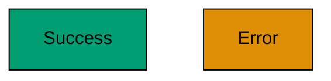
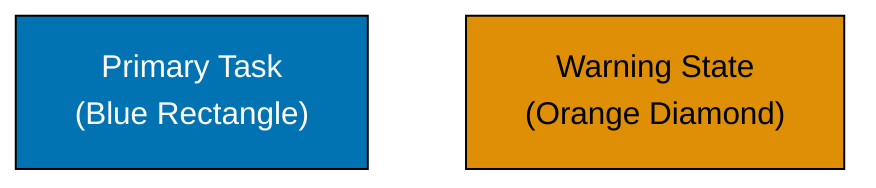
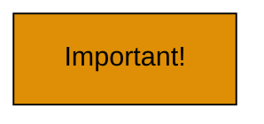
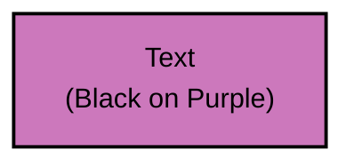

# Common Mistakes to Avoid

## Mistake 1: Using Red-Green Combinations

FAIL: **Problem**: Red-blind and green-blind users cannot distinguish these colors

```text
FAIL: WRONG
graph TD
    A[Success]:::green
    B[Error]:::red

    classDef green fill:#029E73
    classDef red fill:#DE8F05
```

PASS: **Solution**: Use colors from verified palette



## Mistake 2: Relying on Color Alone

FAIL: **Problem**: Color-blind users cannot distinguish elements

```text
FAIL: WRONG
graph TD
    A:::blue
    B:::orange

    classDef blue fill:#0173B2
    classDef orange fill:#DE8F05
```

PASS: **Solution**: Add text labels and shapes



## Mistake 3: Using Yellow for Important Information

FAIL: **Problem**: Yellow is invisible to tritanopia (blue-yellow blind)

```text
FAIL: WRONG - Yellow not visible to tritanopia users
graph TD
    A[Important!]:::yellow

    classDef yellow fill:#DE8F05,stroke:#000000
```

PASS: **Solution**: Use orange or teal instead



## Mistake 4: No Contrast Verification

FAIL: **Problem**: Insufficient contrast causes readability issues

```text
FAIL: WRONG - Purple text on light purple might have low contrast
graph TD
    A[Text]:::weakContrast

    classDef weakContrast fill:#DE8F05,color:#FF1493
```

PASS: **Solution**: Verify with contrast checker



## Mistake 5: Using CSS Color Names

FAIL: **Problem**: Inconsistent across platforms

```css
FAIL: WRONG
fill: red;
background: green;
border: blue;
```

PASS: **Solution**: Always use hex codes

```css
PASS: CORRECT
fill: #DE8F05;
background: #029E73;
border: #0173B2;
```

## Mistake 6: Not Testing in Dark Mode

FAIL: **Problem**: Colors might not have sufficient contrast in dark mode

```
Light mode: White background + Blue fill PASS: Works
Dark mode: Dark background + Blue fill FAIL: May not work
```

PASS: **Solution**: Test both modes

```
Light mode: White background + Blue fill PASS: 8.59:1 contrast
Dark mode: Dark background + Blue fill PASS: 6.93:1 contrast
```
