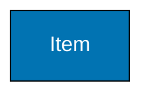

# Implementation Best Practices

## 1. Use Hex Codes, Never CSS Color Names

FAIL: **Wrong:**

```css
fill: red;
background: green;
border: blue;
```

PASS: **Correct:**

```css
fill: #de8f05;
background: #029e73;
border: #0173b2;
```

## 2. Always Include Borders or Outlines

Borders provide shape definition that doesn't rely on fill color:

PASS: **Good:**

```text
classDef box fill:#0173B2,stroke:#000000,color:#FFFFFF,stroke-width:2px
```

FAIL: **Avoid:**

```text
classDef box fill:#0173B2,color:#0000FF
```

## 3. Combine Multiple Visual Cues

Never use color alone. Combine:

- PASS: Color + shape (different node types)
- PASS: Color + text (descriptive labels)
- PASS: Color + position (spatial organization)
- PASS: Color + icons (additional markers)

## 4. Document Your Color Choices (Recommended for Transparency)

**IMPORTANT DISTINCTION:**

- **REQUIRED FOR ACCESSIBILITY**: Using accessible hex codes in `classDef` (e.g., `fill:#0173B2`)
- **RECOMMENDED FOR DOCUMENTATION**: Adding comments listing colors used (aids verification, signals intent)

The comment is helpful for transparency and verification, but the accessible hex codes in `classDef` are what actually make the diagram accessible.

**Example:**



**Note**: The comment above is somewhat redundant since the `classDef` already contains the hex codes. However, it aids quick verification and signals accessibility intent to readers.

## 5. Test Before Publishing

Before committing content with colors:

1. PASS: Create using accessible palette
2. PASS: Test in color blindness simulator
3. PASS: Verify contrast ratios
4. PASS: Check light and dark modes
5. PASS: Confirm shape differentiation is sufficient
