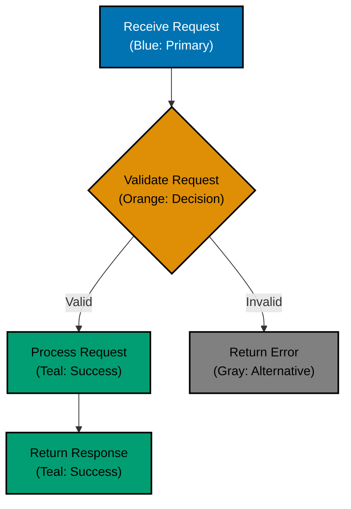

# Real-World Examples

## Good Example: Accessible Mermaid Diagram



**Why this works:**

- PASS: Uses only verified palette colors
- PASS: Black borders provide shape definition
- PASS: White text provides contrast on dark fills
- PASS: Text labels describe each element
- PASS: Diamond shape for decision point (not just color)
- PASS: Different rectangles for different steps
- PASS: Color scheme documented
- PASS: Safe for all color blindness types

## Bad Example: Inaccessible Diagram

```text
<!-- This diagram fails accessibility requirements -->
graph TD
    A[Success]:::green
    B[Error]:::red
    C[Warning]:::yellow

    classDef green fill:#029E73
    classDef red fill:#DE8F05
    classDef yellow fill:#DE8F05
```

**Why this fails:**

- FAIL: Uses red (invisible to protanopia/deuteranopia)
- FAIL: Uses green (invisible to protanopia/deuteranopia)
- FAIL: Uses yellow (invisible to tritanopia)
- FAIL: Red-green combination (worst case)
- FAIL: No borders for shape definition
- FAIL: No text labels
- FAIL: Relies on color alone
- FAIL: Not tested for color blindness
- FAIL: May fail WCAG contrast requirements
