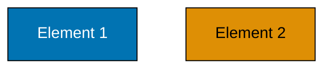

# Testing Tools and Process

## Required Tools

### Coblis Color Blindness Simulator

- **URL**: <https://www.color-blindness.com/coblis-color-blindness-simulator/>
- **Usage**: Upload image or diagram and view simulated appearance for each color blindness type
- **Coverage**: Protanopia, Deuteranopia, Tritanopia, Monochromacy
- **Free**: Yes, web-based, no login required

### WebAIM Contrast Checker

- **URL**: <https://webaim.org/resources/contrastchecker/>
- **Usage**: Enter foreground and background colors, get contrast ratio and WCAG compliance status
- **Coverage**: WCAG AA and AAA standards, both directions
- **Free**: Yes, web-based, no login required

### Figma Color Blind Plugin

- **URL**: <https://www.figma.com/community/plugin/733159460536249875/Color%20Blind>
- **Usage**: Install plugin in Figma, view designs with color blindness simulation
- **Coverage**: All color blindness types
- **Free**: Yes, requires Figma account

## Complete Testing Process

### Step 1: Create Content Using Accessible Palette

Create your diagram or design using only colors from the verified palette:

### Step 2: Test in Color Blindness Simulator

1. Open [Coblis Color Blindness Simulator](https://www.color-blindness.com/coblis-color-blindness-simulator/)
2. Upload or paste your diagram/image
3. Test under all three color blindness types:
   - Protanopia (Red-Blindness)
   - Deuteranopia (Green-Blindness)
   - Tritanopia (Blue-Yellow Blindness)
4. Verify that:
   - All elements remain visually distinct
   - Colors don't appear identical or indistinguishable
   - Contrast is sufficient (no "washing out")

### Step 3: Verify Contrast Ratios

1. Open [WebAIM Contrast Checker](https://webaim.org/resources/contrastchecker/)
2. For each color used, test against both backgrounds:
   - Light background: #FFFFFF
   - Dark background: #1E1E2E
3. For text on colored backgrounds, measure:
   - Foreground color (text): Your chosen text color
   - Background color: Your chosen fill color
4. Verify results:
   - Text: PASS: 4.5:1 or higher (WCAG AA)
   - Components: PASS: 3:1 or higher (WCAG AA)

### Step 4: Confirm Shape Differentiation

Review your diagram and ensure:

- PASS: Different node shapes used (rectangle, circle, diamond)
- PASS: Different line styles (solid, dashed, dotted)
- PASS: Clear text labels on all elements
- PASS: Elements remain distinguishable in grayscale

### Step 5: Test Light and Dark Modes

1. View content on white background (#FFFFFF)
   - Contrast acceptable?
   - Colors visible?
   - Text readable?
2. View content on dark background (#1E1E2E)
   - Contrast acceptable?
   - Colors visible?
   - Text readable?
