# Common Mermaid Syntax Errors: Colons in State Diagram Edge Labels

**CRITICAL**: In `stateDiagram-v2`, edge labels cannot contain colon characters (`:`).

**Syntax**: State diagram edge labels use the format `state1 --> state2: label text here`, where the colon after `state2` separates the transition from the label text.

**Problem**: If the label text itself contains colons (like Clojure keywords `:count` or `:users`, or other code snippets with colons), Mermaid's parser fails because the colon is a reserved separator character.

**Problem Example (FAIL: BROKEN)**:

```text
stateDiagram-v2
    complex --> updated: swap! update :count inc
    updated --> final: swap! update :users conj
```

**Why it fails**: The parser sees `:count` and `:users` as additional syntax elements, not part of the label text. The first colon in the label text (`:` in `:count`) is interpreted as a new separator, breaking the parsing.

**Solution (PASS: WORKING)**:

Remove colons from edge label text. Use plain text descriptions instead of literal code syntax when colons are present:

```mermaid
stateDiagram-v2
    accTitle: Common Mermaid Syntax Errors: Colons in State Diagram Edge Labels
    accDescr: complex moves to updated on swap! update count inc; updated moves to final on swap! update users conj.
    complex --> updated: swap! update count<br/>inc
    updated --> final: swap! update users<br/>conj
```



**Alternative - Descriptive Text**:

If the code syntax is critical to show, use descriptive text that avoids colons:

```mermaid
stateDiagram-v2
    accTitle: Common Mermaid Syntax Errors: Colons in State Diagram Edge Labels (2)
    accDescr: complex moves to updated on update count with increment; updated moves to final on add user to collection.
    complex --> updated: update count with<br/>increment
    updated --> final: add user to<br/>collection
```



**Rule**: Avoid colons in state diagram edge labels. Remove colons from code snippets in labels (e.g., use `count` instead of `:count` for Clojure keywords, use `key value` instead of `key: value` for object notation).

**Affected syntax**: `stateDiagram-v2` only. This does NOT affect:

- Flowchart edge labels (`graph TD` / `flowchart TD`) - colons work fine in flowchart edge labels
- Sequence diagram messages - different syntax, no issue with colons
- Node text in any diagram type - only affects state diagram edge labels

**Rationale**: In state diagrams, the colon is a structural syntax element that separates the transition from its label. Any additional colons in the label text create parsing ambiguity.

**Real-World Context**: This error was discovered when documenting Clojure state transitions using keywords like `:count` and `:users` in edge labels.
