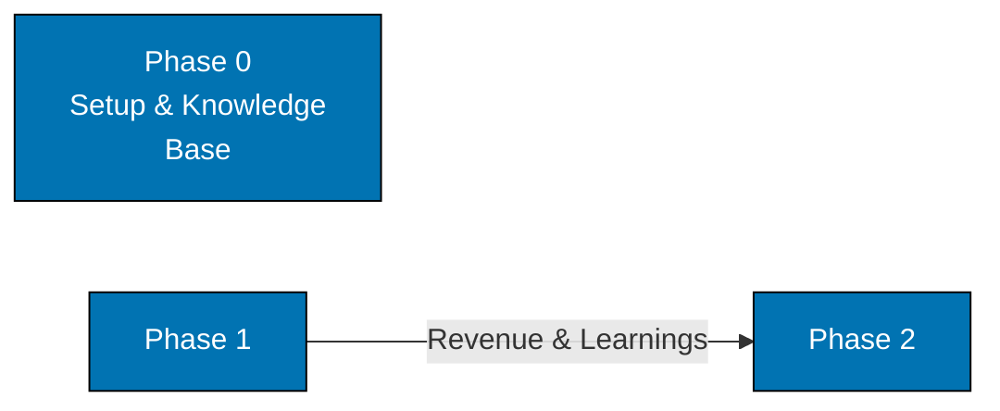

# Common Mermaid Syntax Errors: Escape Sequences Do Not Create Line Breaks

**CRITICAL**: The `\n` escape sequence does not create line breaks in Mermaid diagrams. It renders as the literal characters `\n` in both node labels and edge labels.

**Root Cause**: Mermaid ESM receives the literal string `\n` and does not interpret it as a line break. This is a Mermaid behaviour, not a platform issue.

**Context**:

- **Node labels** (`["text\nmore text"]`): `\n` renders as literal `\n` characters — does NOT create a line break.
- **Edge labels** (`-->|"Revenue\n& Learnings"|`): `\n` renders as literal `\n` characters — does NOT create a line break.

**Problem Example (FAIL: BROKEN)**:

```text
graph LR
    P0["Phase 0\nRepository Setup\n& Knowledge Base"]:::blue
    P1["Phase 1"] -->|"Revenue\n& Learnings"| P2["Phase 2"]
```

This renders node labels as `Phase 0\nRepository Setup\n& Knowledge Base` and edge labels as `Revenue\n& Learnings` with literal `\n` characters visible.

**Solution (PASS: WORKING)**:

Use `<br/>` for multi-line labels, or shorten to single-line text:



**Rule**: Never use `\n` in any Mermaid label (node or edge). Use `<br/>` for multi-line node and edge labels; edge labels take no other HTML (see [Rule 2](./common-syntax-errors-label-constraints-overview-and-rules-1-2.md)).

**Real-World Context**: Discovered when building a roadmap diagram on `apps/ose-www/content/about.md`. Both node labels (`"Phase 3\nEnterprise Application\nLarge Organizations"`) and edge labels (`"Revenue\n& Learnings"`) rendered with literal `\n` characters visible.
