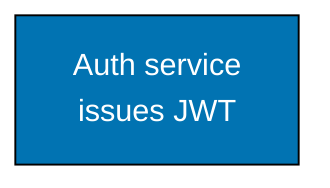
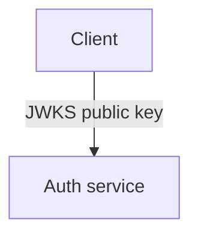

# Common Mermaid Syntax Errors: Label Constraints — Overview, Rule 1, and Rule 2

**CRITICAL**: Mermaid renderers silently clip label text beyond approximately 20–22 characters with no warning. Edge labels do not support HTML tags. URL paths and dot-prefixed tokens in edge labels break the parser.

These three constraints apply everywhere labels appear and are documented together because they all stem from the same root problem: edge labels and node label lines have tight rendering limits and restricted syntax.

## Rule 1: Node label line breaks — `<br/>` only

Use `<br/>` to create line breaks inside node labels. The `\n` escape sequence renders as the literal characters `\n` (see Error 7). `<br/>` is the only supported mechanism.

**DO:**



**DO NOT:**

```text
graph TD
    A["Auth service\nissues JWT"]:::blue
    %% BROKEN: renders as "Auth service\nissues JWT" (literal backslash-n)
    classDef blue fill:#0173B2,stroke:#000000,color:#FFFFFF
```

## Rule 2: Edge labels — plain text only, no HTML

Edge labels are the text inside `|"..."|` arrow syntax: `A -->|"text"| B`. They do not support `<br/>` or any other HTML. The tag renders as literal text characters, making the label long and broken.

**DO:**



**DO NOT:**

```text
graph TD
    A[Client]-->|"JWKS key<br/>via HTTPS"| B[Auth service]
    %% BROKEN: renders as "JWKS key<br/>via HTTPS" with visible tag
```

Keep edge labels single-line plain text. If you need multi-line detail, move it into the destination node label.
